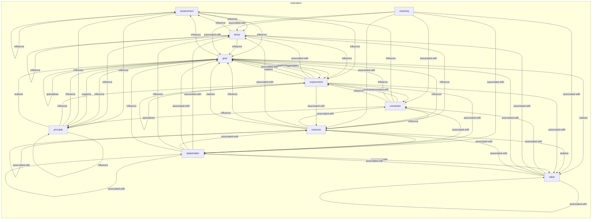
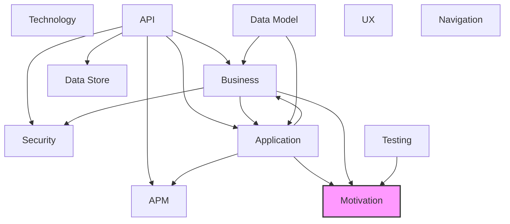

# Motivation Layer

## Report Index

- [Layer Introduction](#layer-introduction)
- [Intra-Layer Relationships](#intra-layer-relationships)
- [Inter-Layer Dependencies](#inter-layer-dependencies)
- [Inter-Layer Relationships Table](#inter-layer-relationships-table)
- [Node Reference](#node-reference)
  - [Assessment](#assessment)
  - [Constraint](#constraint)
  - [Driver](#driver)
  - [Goal](#goal)
  - [Meaning](#meaning)
  - [Outcome](#outcome)
  - [Principle](#principle)
  - [Requirement](#requirement)
  - [Stakeholder](#stakeholder)
  - [Value](#value)

## Layer Introduction

**Layer 1**: Motivation
**Standard**: [ArchiMate 3.2](https://pubs.opengroup.org/architecture/archimate32-doc/)

Layer 1: Motivation Layer

### Statistics

| Metric                    | Count |
| ------------------------- | ----- |
| Node Types                | 10    |
| Intra-Layer Relationships | 70    |
| Inter-Layer Relationships | 10    |
| Inbound Relationships     | 10    |
| Outbound Relationships    | 0     |

### Layer Dependencies

**Depends On**: [Business](./02-business-layer-report.md), [Application](./04-application-layer-report.md), [Testing](./12-testing-layer-report.md)

**Depended On By**: None

## Intra-Layer Relationships

```mermaid
flowchart LR
  subgraph motivation
    assessment["assessment"]
    constraint["constraint"]
    driver["driver"]
    goal["goal"]
    meaning["meaning"]
    outcome["outcome"]
    principle["principle"]
    requirement["requirement"]
    stakeholder["stakeholder"]
    value["value"]
    assessment -->|influence| assessment
    assessment -->|influence| driver
    assessment -->|influence| goal
    assessment -->|influence| principle
    assessment -->|influence| requirement
    constraint -->|constrains| requirement
    constraint -->|influence| assessment
    constraint -->|influence| goal
    constraint -->|influence| outcome
    constraint -->|influence| principle
    constraint -->|influence| requirement
    driver -->|influence| assessment
    driver -->|influence| driver
    driver -->|influence| goal
    driver -->|influence| outcome
    driver -->|influence| principle
    driver -->|influence| requirement
    goal -->|aggregates| goal
    goal -->|aggregates| requirement
    goal -->|influence| assessment
    goal -->|influence| goal
    goal -->|influence| outcome
    goal -->|influence| principle
    goal -->|influence| requirement
    goal -->|realizes| goal
    goal -->|realizes| value
    goal -->|specializes| goal
    goal -->|supports| principle
    meaning -->|associated-with| constraint
    meaning -->|associated-with| driver
    meaning -->|associated-with| goal
    meaning -->|associated-with| outcome
    meaning -->|associated-with| stakeholder
    meaning -->|associated-with| value
    outcome -->|associated-with| constraint
    outcome -->|associated-with| driver
    outcome -->|associated-with| outcome
    outcome -->|associated-with| stakeholder
    outcome -->|influence| goal
    outcome -->|realizes| goal
    outcome -->|realizes| value
    principle -->|influence| assessment
    principle -->|influence| goal
    principle -->|influence| principle
    principle -->|influence| requirement
    principle -->|realizes| goal
    requirement -->|aggregates| goal
    requirement -->|aggregates| requirement
    requirement -->|associated-with| constraint
    requirement -->|associated-with| driver
    requirement -->|associated-with| goal
    requirement -->|associated-with| outcome
    requirement -->|associated-with| stakeholder
    requirement -->|associated-with| value
    requirement -->|realizes| goal
    requirement -->|specializes| requirement
    stakeholder -->|associated-with| constraint
    stakeholder -->|associated-with| driver
    stakeholder -->|associated-with| goal
    stakeholder -->|associated-with| outcome
    stakeholder -->|associated-with| stakeholder
    stakeholder -->|associated-with| value
    stakeholder -->|influence| driver
    stakeholder -->|influence| goal
    value -->|associated-with| constraint
    value -->|associated-with| driver
    value -->|associated-with| goal
    value -->|associated-with| outcome
    value -->|associated-with| stakeholder
    value -->|associated-with| value
  end
```

## Inter-Layer Dependencies

```mermaid
flowchart TB
  classDef current fill:#f9f,stroke:#333,stroke-width:2px
  motivation["Motivation"]
  business["Business"]
  security["Security"]
  application["Application"]
  technology["Technology"]
  api["API"]
  data_model["Data Model"]
  data_store["Data Store"]
  ux["UX"]
  navigation["Navigation"]
  apm["APM"]
  testing["Testing"]
  api --> apm
  api --> application
  api --> business
  api --> data_store
  api --> security
  application --> apm
  application --> business
  application --> motivation
  business --> application
  business --> motivation
  business --> security
  data_model --> application
  data_model --> business
  testing --> motivation
  class motivation current
```

## Inter-Layer Relationships Table

| Relationship ID                                                          | Source Node                                                               | Dest Node                                                  | Dest Layer                                    | Predicate              | Cardinality  | Strength |
| ------------------------------------------------------------------------ | ------------------------------------------------------------------------- | ---------------------------------------------------------- | --------------------------------------------- | ---------------------- | ------------ | -------- |
| application.applicationservice.delivers-value.motivation.value           | [Applicationservice](./04-application-layer-report.md#applicationservice) | [Value](./01-motivation-layer-report.md#value)             | [Motivation](./01-motivation-layer-report.md) | delivers-value         | many-to-many | medium   |
| business.businessservice.delivers-value.motivation.value                 | [Businessservice](./02-business-layer-report.md#businessservice)          | [Value](./01-motivation-layer-report.md#value)             | [Motivation](./01-motivation-layer-report.md) | delivers-value         | many-to-many | medium   |
| testing.coveragerequirement.constrained-by.motivation.constraint         | [Coveragerequirement](./12-testing-layer-report.md#coveragerequirement)   | [Constraint](./01-motivation-layer-report.md#constraint)   | [Motivation](./01-motivation-layer-report.md) | constrained-by         | many-to-many | medium   |
| testing.coveragerequirement.fulfills-requirements.motivation.requirement | [Coveragerequirement](./12-testing-layer-report.md#coveragerequirement)   | [Requirement](./01-motivation-layer-report.md#requirement) | [Motivation](./01-motivation-layer-report.md) | fulfills-requirements  | many-to-many | high     |
| testing.testcasesketch.fulfills-requirements.motivation.requirement      | [Testcasesketch](./12-testing-layer-report.md#testcasesketch)             | [Requirement](./01-motivation-layer-report.md#requirement) | [Motivation](./01-motivation-layer-report.md) | fulfills-requirements  | many-to-many | high     |
| testing.testcasesketch.supports-goals.motivation.goal                    | [Testcasesketch](./12-testing-layer-report.md#testcasesketch)             | [Goal](./01-motivation-layer-report.md#goal)               | [Motivation](./01-motivation-layer-report.md) | supports-goals         | many-to-many | high     |
| testing.testcoveragemodel.constrained-by.motivation.constraint           | [Testcoveragemodel](./12-testing-layer-report.md#testcoveragemodel)       | [Constraint](./01-motivation-layer-report.md#constraint)   | [Motivation](./01-motivation-layer-report.md) | constrained-by         | many-to-many | medium   |
| testing.testcoveragemodel.fulfills-requirements.motivation.requirement   | [Testcoveragemodel](./12-testing-layer-report.md#testcoveragemodel)       | [Requirement](./01-motivation-layer-report.md#requirement) | [Motivation](./01-motivation-layer-report.md) | fulfills-requirements  | many-to-many | high     |
| testing.testcoveragemodel.governed-by-principles.motivation.principle    | [Testcoveragemodel](./12-testing-layer-report.md#testcoveragemodel)       | [Principle](./01-motivation-layer-report.md#principle)     | [Motivation](./01-motivation-layer-report.md) | governed-by-principles | many-to-many | high     |
| testing.testcoveragemodel.supports-goals.motivation.goal                 | [Testcoveragemodel](./12-testing-layer-report.md#testcoveragemodel)       | [Goal](./01-motivation-layer-report.md#goal)               | [Motivation](./01-motivation-layer-report.md) | supports-goals         | many-to-many | high     |

## Node Reference

### Assessment {#assessment}

**Spec Node ID**: `motivation.assessment`

Outcome of analysis of the state of affairs of the enterprise or any part of it, and its environment. Assessments commonly take the form of strengths, weaknesses, opportunities, or threats (SWOT).

#### Relationship Metrics

- **Intra-Layer**: Inbound: 5 | Outbound: 5
- **Inter-Layer**: Inbound: 0 | Outbound: 0

#### Intra-Layer Relationships

| Related Node                | Predicate | Direction | Cardinality  |
| --------------------------- | --------- | --------- | ------------ |
| [Assessment](#assessment)   | influence | outbound  | many-to-many |
| [Driver](#driver)           | influence | outbound  | many-to-one  |
| [Goal](#goal)               | influence | outbound  | many-to-many |
| [Principle](#principle)     | influence | outbound  | many-to-many |
| [Requirement](#requirement) | influence | outbound  | many-to-many |
| [Constraint](#constraint)   | influence | inbound   | many-to-many |
| [Driver](#driver)           | influence | inbound   | many-to-many |
| [Goal](#goal)               | influence | inbound   | many-to-many |
| [Principle](#principle)     | influence | inbound   | many-to-many |

[Back to Index](#report-index)

### Constraint {#constraint}

**Spec Node ID**: `motivation.constraint`

Restriction on the freedom of design and implementation choices available when realizing a system, as opposed to requirements which must be satisfied.

#### Relationship Metrics

- **Intra-Layer**: Inbound: 5 | Outbound: 6
- **Inter-Layer**: Inbound: 2 | Outbound: 0

#### Intra-Layer Relationships

| Related Node                | Predicate       | Direction | Cardinality  |
| --------------------------- | --------------- | --------- | ------------ |
| [Requirement](#requirement) | constrains      | outbound  | many-to-one  |
| [Assessment](#assessment)   | influence       | outbound  | many-to-many |
| [Goal](#goal)               | influence       | outbound  | many-to-many |
| [Outcome](#outcome)         | influence       | outbound  | many-to-one  |
| [Principle](#principle)     | influence       | outbound  | many-to-many |
| [Requirement](#requirement) | influence       | outbound  | many-to-many |
| [Meaning](#meaning)         | associated-with | inbound   | many-to-many |
| [Outcome](#outcome)         | associated-with | inbound   | many-to-many |
| [Requirement](#requirement) | associated-with | inbound   | many-to-many |
| [Stakeholder](#stakeholder) | associated-with | inbound   | many-to-many |
| [Value](#value)             | associated-with | inbound   | many-to-many |

#### Inter-Layer Relationships

| Related Node                                                            | Layer                                   | Predicate      | Direction | Cardinality  |
| ----------------------------------------------------------------------- | --------------------------------------- | -------------- | --------- | ------------ |
| [Coveragerequirement](./12-testing-layer-report.md#coveragerequirement) | [Testing](./12-testing-layer-report.md) | constrained-by | inbound   | many-to-many |
| [Testcoveragemodel](./12-testing-layer-report.md#testcoveragemodel)     | [Testing](./12-testing-layer-report.md) | constrained-by | inbound   | many-to-many |

[Back to Index](#report-index)

### Driver {#driver}

**Spec Node ID**: `motivation.driver`

External or internal condition that motivates an organization to change its goals, strategy, or architecture.

#### Relationship Metrics

- **Intra-Layer**: Inbound: 8 | Outbound: 6
- **Inter-Layer**: Inbound: 0 | Outbound: 0

#### Intra-Layer Relationships

| Related Node                | Predicate       | Direction | Cardinality  |
| --------------------------- | --------------- | --------- | ------------ |
| [Assessment](#assessment)   | influence       | inbound   | many-to-one  |
| [Assessment](#assessment)   | influence       | outbound  | many-to-many |
| [Driver](#driver)           | influence       | outbound  | many-to-one  |
| [Goal](#goal)               | influence       | outbound  | many-to-many |
| [Outcome](#outcome)         | influence       | outbound  | many-to-one  |
| [Principle](#principle)     | influence       | outbound  | many-to-many |
| [Requirement](#requirement) | influence       | outbound  | many-to-many |
| [Meaning](#meaning)         | associated-with | inbound   | many-to-many |
| [Outcome](#outcome)         | associated-with | inbound   | many-to-many |
| [Requirement](#requirement) | associated-with | inbound   | many-to-many |
| [Stakeholder](#stakeholder) | associated-with | inbound   | many-to-many |
| [Stakeholder](#stakeholder) | influence       | inbound   | many-to-one  |
| [Value](#value)             | associated-with | inbound   | many-to-many |

[Back to Index](#report-index)

### Goal {#goal}

**Spec Node ID**: `motivation.goal`

High-level statement of intent, direction, or desired end state

#### Relationship Metrics

- **Intra-Layer**: Inbound: 18 | Outbound: 11
- **Inter-Layer**: Inbound: 2 | Outbound: 0

#### Intra-Layer Relationships

| Related Node                | Predicate       | Direction | Cardinality  |
| --------------------------- | --------------- | --------- | ------------ |
| [Assessment](#assessment)   | influence       | inbound   | many-to-many |
| [Constraint](#constraint)   | influence       | inbound   | many-to-many |
| [Driver](#driver)           | influence       | inbound   | many-to-many |
| [Goal](#goal)               | aggregates      | outbound  | many-to-many |
| [Requirement](#requirement) | aggregates      | outbound  | many-to-many |
| [Assessment](#assessment)   | influence       | outbound  | many-to-many |
| [Goal](#goal)               | influence       | outbound  | many-to-many |
| [Outcome](#outcome)         | influence       | outbound  | many-to-one  |
| [Principle](#principle)     | influence       | outbound  | many-to-many |
| [Requirement](#requirement) | influence       | outbound  | many-to-many |
| [Goal](#goal)               | realizes        | outbound  | many-to-many |
| [Value](#value)             | realizes        | outbound  | many-to-many |
| [Goal](#goal)               | specializes     | outbound  | many-to-one  |
| [Principle](#principle)     | supports        | outbound  | many-to-one  |
| [Meaning](#meaning)         | associated-with | inbound   | many-to-many |
| [Outcome](#outcome)         | influence       | inbound   | many-to-one  |
| [Outcome](#outcome)         | realizes        | inbound   | many-to-many |
| [Principle](#principle)     | influence       | inbound   | many-to-many |
| [Principle](#principle)     | realizes        | inbound   | many-to-one  |
| [Requirement](#requirement) | aggregates      | inbound   | many-to-many |
| [Requirement](#requirement) | associated-with | inbound   | many-to-many |
| [Requirement](#requirement) | realizes        | inbound   | many-to-one  |
| [Stakeholder](#stakeholder) | associated-with | inbound   | many-to-many |
| [Stakeholder](#stakeholder) | influence       | inbound   | many-to-one  |
| [Value](#value)             | associated-with | inbound   | many-to-many |

#### Inter-Layer Relationships

| Related Node                                                        | Layer                                   | Predicate      | Direction | Cardinality  |
| ------------------------------------------------------------------- | --------------------------------------- | -------------- | --------- | ------------ |
| [Testcasesketch](./12-testing-layer-report.md#testcasesketch)       | [Testing](./12-testing-layer-report.md) | supports-goals | inbound   | many-to-many |
| [Testcoveragemodel](./12-testing-layer-report.md#testcoveragemodel) | [Testing](./12-testing-layer-report.md) | supports-goals | inbound   | many-to-many |

[Back to Index](#report-index)

### Meaning {#meaning}

**Spec Node ID**: `motivation.meaning`

Knowledge or expertise present in, or the interpretation given to, a concept in a particular context, as understood by stakeholders.

#### Relationship Metrics

- **Intra-Layer**: Inbound: 0 | Outbound: 6
- **Inter-Layer**: Inbound: 0 | Outbound: 0

#### Intra-Layer Relationships

| Related Node                | Predicate       | Direction | Cardinality  |
| --------------------------- | --------------- | --------- | ------------ |
| [Constraint](#constraint)   | associated-with | outbound  | many-to-many |
| [Driver](#driver)           | associated-with | outbound  | many-to-many |
| [Goal](#goal)               | associated-with | outbound  | many-to-many |
| [Outcome](#outcome)         | associated-with | outbound  | many-to-many |
| [Stakeholder](#stakeholder) | associated-with | outbound  | many-to-many |
| [Value](#value)             | associated-with | outbound  | many-to-many |

[Back to Index](#report-index)

### Outcome {#outcome}

**Spec Node ID**: `motivation.outcome`

End result intended or already achieved by the organization or a system, distinct from a Goal which expresses the desired direction.

#### Relationship Metrics

- **Intra-Layer**: Inbound: 8 | Outbound: 7
- **Inter-Layer**: Inbound: 0 | Outbound: 0

#### Intra-Layer Relationships

| Related Node                | Predicate       | Direction | Cardinality  |
| --------------------------- | --------------- | --------- | ------------ |
| [Constraint](#constraint)   | influence       | inbound   | many-to-one  |
| [Driver](#driver)           | influence       | inbound   | many-to-one  |
| [Goal](#goal)               | influence       | inbound   | many-to-one  |
| [Meaning](#meaning)         | associated-with | inbound   | many-to-many |
| [Constraint](#constraint)   | associated-with | outbound  | many-to-many |
| [Driver](#driver)           | associated-with | outbound  | many-to-many |
| [Outcome](#outcome)         | associated-with | outbound  | many-to-many |
| [Stakeholder](#stakeholder) | associated-with | outbound  | many-to-many |
| [Goal](#goal)               | influence       | outbound  | many-to-one  |
| [Goal](#goal)               | realizes        | outbound  | many-to-many |
| [Value](#value)             | realizes        | outbound  | many-to-many |
| [Requirement](#requirement) | associated-with | inbound   | many-to-many |
| [Stakeholder](#stakeholder) | associated-with | inbound   | many-to-many |
| [Value](#value)             | associated-with | inbound   | many-to-many |

[Back to Index](#report-index)

### Principle {#principle}

**Spec Node ID**: `motivation.principle`

Normative property of all systems in a given context, or a statement governing how an organization intends to fulfill its mission and guide decision-making.

#### Relationship Metrics

- **Intra-Layer**: Inbound: 6 | Outbound: 5
- **Inter-Layer**: Inbound: 1 | Outbound: 0

#### Intra-Layer Relationships

| Related Node                | Predicate | Direction | Cardinality  |
| --------------------------- | --------- | --------- | ------------ |
| [Assessment](#assessment)   | influence | inbound   | many-to-many |
| [Constraint](#constraint)   | influence | inbound   | many-to-many |
| [Driver](#driver)           | influence | inbound   | many-to-many |
| [Goal](#goal)               | influence | inbound   | many-to-many |
| [Goal](#goal)               | supports  | inbound   | many-to-one  |
| [Assessment](#assessment)   | influence | outbound  | many-to-many |
| [Goal](#goal)               | influence | outbound  | many-to-many |
| [Principle](#principle)     | influence | outbound  | many-to-many |
| [Requirement](#requirement) | influence | outbound  | many-to-many |
| [Goal](#goal)               | realizes  | outbound  | many-to-one  |

#### Inter-Layer Relationships

| Related Node                                                        | Layer                                   | Predicate              | Direction | Cardinality  |
| ------------------------------------------------------------------- | --------------------------------------- | ---------------------- | --------- | ------------ |
| [Testcoveragemodel](./12-testing-layer-report.md#testcoveragemodel) | [Testing](./12-testing-layer-report.md) | governed-by-principles | inbound   | many-to-many |

[Back to Index](#report-index)

### Requirement {#requirement}

**Spec Node ID**: `motivation.requirement`

Statement of need that must be realized by a system, component, or solution, and that can be associated with stakeholders, goals, or constraints.

#### Relationship Metrics

- **Intra-Layer**: Inbound: 9 | Outbound: 10
- **Inter-Layer**: Inbound: 3 | Outbound: 0

#### Intra-Layer Relationships

| Related Node                | Predicate       | Direction | Cardinality  |
| --------------------------- | --------------- | --------- | ------------ |
| [Assessment](#assessment)   | influence       | inbound   | many-to-many |
| [Constraint](#constraint)   | constrains      | inbound   | many-to-one  |
| [Constraint](#constraint)   | influence       | inbound   | many-to-many |
| [Driver](#driver)           | influence       | inbound   | many-to-many |
| [Goal](#goal)               | aggregates      | inbound   | many-to-many |
| [Goal](#goal)               | influence       | inbound   | many-to-many |
| [Principle](#principle)     | influence       | inbound   | many-to-many |
| [Goal](#goal)               | aggregates      | outbound  | many-to-many |
| [Requirement](#requirement) | aggregates      | outbound  | many-to-many |
| [Constraint](#constraint)   | associated-with | outbound  | many-to-many |
| [Driver](#driver)           | associated-with | outbound  | many-to-many |
| [Goal](#goal)               | associated-with | outbound  | many-to-many |
| [Outcome](#outcome)         | associated-with | outbound  | many-to-many |
| [Stakeholder](#stakeholder) | associated-with | outbound  | many-to-many |
| [Value](#value)             | associated-with | outbound  | many-to-many |
| [Goal](#goal)               | realizes        | outbound  | many-to-one  |
| [Requirement](#requirement) | specializes     | outbound  | many-to-one  |

#### Inter-Layer Relationships

| Related Node                                                            | Layer                                   | Predicate             | Direction | Cardinality  |
| ----------------------------------------------------------------------- | --------------------------------------- | --------------------- | --------- | ------------ |
| [Coveragerequirement](./12-testing-layer-report.md#coveragerequirement) | [Testing](./12-testing-layer-report.md) | fulfills-requirements | inbound   | many-to-many |
| [Testcasesketch](./12-testing-layer-report.md#testcasesketch)           | [Testing](./12-testing-layer-report.md) | fulfills-requirements | inbound   | many-to-many |
| [Testcoveragemodel](./12-testing-layer-report.md#testcoveragemodel)     | [Testing](./12-testing-layer-report.md) | fulfills-requirements | inbound   | many-to-many |

[Back to Index](#report-index)

### Stakeholder {#stakeholder}

**Spec Node ID**: `motivation.stakeholder`

Individual, team, or organization that has an interest in, or is affected by, the effects of the architecture.

#### Relationship Metrics

- **Intra-Layer**: Inbound: 5 | Outbound: 8
- **Inter-Layer**: Inbound: 0 | Outbound: 0

#### Intra-Layer Relationships

| Related Node                | Predicate       | Direction | Cardinality  |
| --------------------------- | --------------- | --------- | ------------ |
| [Meaning](#meaning)         | associated-with | inbound   | many-to-many |
| [Outcome](#outcome)         | associated-with | inbound   | many-to-many |
| [Requirement](#requirement) | associated-with | inbound   | many-to-many |
| [Constraint](#constraint)   | associated-with | outbound  | many-to-many |
| [Driver](#driver)           | associated-with | outbound  | many-to-many |
| [Goal](#goal)               | associated-with | outbound  | many-to-many |
| [Outcome](#outcome)         | associated-with | outbound  | many-to-many |
| [Stakeholder](#stakeholder) | associated-with | outbound  | many-to-many |
| [Value](#value)             | associated-with | outbound  | many-to-many |
| [Driver](#driver)           | influence       | outbound  | many-to-one  |
| [Goal](#goal)               | influence       | outbound  | many-to-one  |
| [Value](#value)             | associated-with | inbound   | many-to-many |

[Back to Index](#report-index)

### Value {#value}

**Spec Node ID**: `motivation.value`

Relative worth, utility, or importance of a concept, phenomenon, or outcome to one or more stakeholders.

#### Relationship Metrics

- **Intra-Layer**: Inbound: 6 | Outbound: 6
- **Inter-Layer**: Inbound: 2 | Outbound: 0

#### Intra-Layer Relationships

| Related Node                | Predicate       | Direction | Cardinality  |
| --------------------------- | --------------- | --------- | ------------ |
| [Goal](#goal)               | realizes        | inbound   | many-to-many |
| [Meaning](#meaning)         | associated-with | inbound   | many-to-many |
| [Outcome](#outcome)         | realizes        | inbound   | many-to-many |
| [Requirement](#requirement) | associated-with | inbound   | many-to-many |
| [Stakeholder](#stakeholder) | associated-with | inbound   | many-to-many |
| [Constraint](#constraint)   | associated-with | outbound  | many-to-many |
| [Driver](#driver)           | associated-with | outbound  | many-to-many |
| [Goal](#goal)               | associated-with | outbound  | many-to-many |
| [Outcome](#outcome)         | associated-with | outbound  | many-to-many |
| [Stakeholder](#stakeholder) | associated-with | outbound  | many-to-many |
| [Value](#value)             | associated-with | outbound  | many-to-many |

#### Inter-Layer Relationships

| Related Node                                                              | Layer                                           | Predicate      | Direction | Cardinality  |
| ------------------------------------------------------------------------- | ----------------------------------------------- | -------------- | --------- | ------------ |
| [Applicationservice](./04-application-layer-report.md#applicationservice) | [Application](./04-application-layer-report.md) | delivers-value | inbound   | many-to-many |
| [Businessservice](./02-business-layer-report.md#businessservice)          | [Business](./02-business-layer-report.md)       | delivers-value | inbound   | many-to-many |

[Back to Index](#report-index)

---

_Generated: 2026-03-04T13:13:20.949Z | Spec Version: 0.8.1 | Generator: generate-layer-reports.ts_
