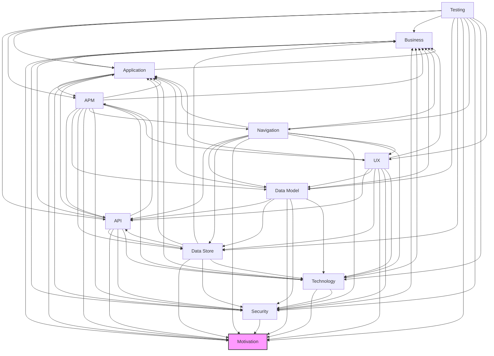

# Motivation Layer

## Report Index

- [Layer Introduction](#layer-introduction)
- [Intra-Layer Relationships](#intra-layer-relationships)
- [Inter-Layer Dependencies](#inter-layer-dependencies)
- [Inter-Layer Relationships Table](#inter-layer-relationships-table)
- [Node Reference](#node-reference)
  - [Assessment](#assessment)
  - [Constraint](#constraint)
  - [Driver](#driver)
  - [Goal](#goal)
  - [Meaning](#meaning)
  - [Outcome](#outcome)
  - [Principle](#principle)
  - [Requirement](#requirement)
  - [Stakeholder](#stakeholder)
  - [Value](#value)

## Layer Introduction

**Layer 1**: Motivation
**Standard**: [ArchiMate 3.2](https://pubs.opengroup.org/architecture/archimate32-doc/)

Layer 1: Motivation Layer

### Statistics

| Metric                    | Count |
| ------------------------- | ----- |
| Node Types                | 10    |
| Intra-Layer Relationships | 80    |
| Inter-Layer Relationships | 95    |
| Inbound Relationships     | 95    |
| Outbound Relationships    | 0     |

### Layer Dependencies

**Depends On**: [Business](./02-business-layer-report.md), [Security](./03-security-layer-report.md), [Application](./04-application-layer-report.md), [Technology](./05-technology-layer-report.md), [API](./06-api-layer-report.md), [Data Model](./07-data-model-layer-report.md), [Data Store](./08-data-store-layer-report.md), [UX](./09-ux-layer-report.md), [Navigation](./10-navigation-layer-report.md), [APM](./11-apm-layer-report.md), [Testing](./12-testing-layer-report.md)

**Depended On By**: None

## Intra-Layer Relationships

```mermaid
flowchart LR
  subgraph motivation
    assessment["assessment"]
    constraint["constraint"]
    driver["driver"]
    goal["goal"]
    meaning["meaning"]
    outcome["outcome"]
    principle["principle"]
    requirement["requirement"]
    stakeholder["stakeholder"]
    value["value"]
    assessment -->|associated-with| constraint
    assessment -->|associated-with| outcome
    assessment -->|influence| assessment
    assessment -->|influence| driver
    assessment -->|influence| goal
    assessment -->|influence| principle
    assessment -->|influence| requirement
    constraint -->|constrains| requirement
    constraint -->|influence| assessment
    constraint -->|influence| goal
    constraint -->|influence| outcome
    constraint -->|influence| principle
    constraint -->|influence| requirement
    constraint -->|specializes| constraint
    driver -->|associated-with| constraint
    driver -->|associated-with| value
    driver -->|influence| assessment
    driver -->|influence| driver
    driver -->|influence| goal
    driver -->|influence| outcome
    driver -->|influence| principle
    driver -->|influence| requirement
    goal -->|aggregates| goal
    goal -->|aggregates| requirement
    goal -->|associated-with| constraint
    goal -->|influence| assessment
    goal -->|influence| goal
    goal -->|influence| outcome
    goal -->|influence| principle
    goal -->|influence| requirement
    goal -->|realizes| goal
    goal -->|realizes| value
    goal -->|specializes| goal
    goal -->|supports| principle
    meaning -->|associated-with| constraint
    meaning -->|associated-with| driver
    meaning -->|associated-with| goal
    meaning -->|associated-with| outcome
    meaning -->|associated-with| stakeholder
    meaning -->|associated-with| value
    outcome -->|associated-with| constraint
    outcome -->|associated-with| driver
    outcome -->|associated-with| outcome
    outcome -->|associated-with| stakeholder
    outcome -->|influence| goal
    outcome -->|realizes| goal
    outcome -->|realizes| value
    principle -->|associated-with| value
    principle -->|influence| assessment
    principle -->|influence| goal
    principle -->|influence| principle
    principle -->|influence| requirement
    principle -->|realizes| goal
    requirement -->|aggregates| goal
    requirement -->|aggregates| requirement
    requirement -->|associated-with| constraint
    requirement -->|associated-with| driver
    requirement -->|associated-with| goal
    requirement -->|associated-with| outcome
    requirement -->|associated-with| stakeholder
    requirement -->|associated-with| value
    requirement -->|realizes| goal
    requirement -->|specializes| requirement
    stakeholder -->|associated-with| constraint
    stakeholder -->|associated-with| driver
    stakeholder -->|associated-with| goal
    stakeholder -->|associated-with| outcome
    stakeholder -->|associated-with| principle
    stakeholder -->|associated-with| requirement
    stakeholder -->|associated-with| stakeholder
    stakeholder -->|associated-with| value
    stakeholder -->|influence| assessment
    stakeholder -->|influence| driver
    stakeholder -->|influence| goal
    value -->|associated-with| constraint
    value -->|associated-with| driver
    value -->|associated-with| goal
    value -->|associated-with| outcome
    value -->|associated-with| stakeholder
    value -->|associated-with| value
  end
```

## Inter-Layer Dependencies

```mermaid
flowchart TB
  classDef current fill:#f9f,stroke:#333,stroke-width:2px
  motivation["Motivation"]
  business["Business"]
  security["Security"]
  application["Application"]
  technology["Technology"]
  api["API"]
  data_model["Data Model"]
  data_store["Data Store"]
  ux["UX"]
  navigation["Navigation"]
  apm["APM"]
  testing["Testing"]
  api --> apm
  api --> application
  api --> business
  api --> data_store
  api --> motivation
  api --> security
  api --> technology
  apm --> api
  apm --> application
  apm --> business
  apm --> data_model
  apm --> data_store
  apm --> motivation
  apm --> navigation
  apm --> security
  apm --> technology
  apm --> ux
  application --> apm
  application --> business
  application --> motivation
  application --> security
  business --> application
  business --> motivation
  business --> security
  data_model --> api
  data_model --> application
  data_model --> business
  data_model --> data_store
  data_model --> motivation
  data_model --> security
  data_model --> technology
  data_store --> api
  data_store --> application
  data_store --> business
  data_store --> motivation
  data_store --> security
  data_store --> technology
  navigation --> api
  navigation --> application
  navigation --> business
  navigation --> data_model
  navigation --> data_store
  navigation --> motivation
  navigation --> security
  navigation --> technology
  navigation --> ux
  security --> business
  security --> motivation
  technology --> application
  technology --> business
  technology --> motivation
  technology --> security
  testing --> api
  testing --> apm
  testing --> application
  testing --> business
  testing --> data_model
  testing --> data_store
  testing --> motivation
  testing --> navigation
  testing --> security
  testing --> technology
  testing --> ux
  ux --> api
  ux --> application
  ux --> business
  ux --> data_model
  ux --> data_store
  ux --> motivation
  ux --> security
  ux --> technology
  class motivation current
```

## Inter-Layer Relationships Table

| Relationship ID                                                          | Source Node                                                                          | Dest Node                                                  | Dest Layer                                    | Predicate              | Cardinality  | Strength |
| ------------------------------------------------------------------------ | ------------------------------------------------------------------------------------ | ---------------------------------------------------------- | --------------------------------------------- | ---------------------- | ------------ | -------- |
| api.openapidocument.serves.motivation.stakeholder                        | [Openapidocument](./06-api-layer-report.md#openapidocument)                          | [Stakeholder](./01-motivation-layer-report.md#stakeholder) | [Motivation](./01-motivation-layer-report.md) | serves                 | many-to-many | medium   |
| api.operation.realizes.motivation.goal                                   | [Operation](./06-api-layer-report.md#operation)                                      | [Goal](./01-motivation-layer-report.md#goal)               | [Motivation](./01-motivation-layer-report.md) | realizes               | many-to-many | medium   |
| api.operation.realizes.motivation.outcome                                | [Operation](./06-api-layer-report.md#operation)                                      | [Outcome](./01-motivation-layer-report.md#outcome)         | [Motivation](./01-motivation-layer-report.md) | realizes               | many-to-many | medium   |
| api.operation.satisfies.motivation.constraint                            | [Operation](./06-api-layer-report.md#operation)                                      | [Constraint](./01-motivation-layer-report.md#constraint)   | [Motivation](./01-motivation-layer-report.md) | satisfies              | many-to-many | medium   |
| api.operation.satisfies.motivation.requirement                           | [Operation](./06-api-layer-report.md#operation)                                      | [Requirement](./01-motivation-layer-report.md#requirement) | [Motivation](./01-motivation-layer-report.md) | satisfies              | many-to-many | medium   |
| api.ratelimit.satisfies.motivation.constraint                            | [Ratelimit](./06-api-layer-report.md#ratelimit)                                      | [Constraint](./01-motivation-layer-report.md#constraint)   | [Motivation](./01-motivation-layer-report.md) | satisfies              | many-to-many | medium   |
| api.securityscheme.satisfies.motivation.principle                        | [Securityscheme](./06-api-layer-report.md#securityscheme)                            | [Principle](./01-motivation-layer-report.md#principle)     | [Motivation](./01-motivation-layer-report.md) | satisfies              | many-to-many | medium   |
| api.securityscheme.satisfies.motivation.requirement                      | [Securityscheme](./06-api-layer-report.md#securityscheme)                            | [Requirement](./01-motivation-layer-report.md#requirement) | [Motivation](./01-motivation-layer-report.md) | satisfies              | many-to-many | medium   |
| apm.exporterconfig.satisfies.motivation.requirement                      | [Exporterconfig](./11-apm-layer-report.md#exporterconfig)                            | [Requirement](./01-motivation-layer-report.md#requirement) | [Motivation](./01-motivation-layer-report.md) | satisfies              | many-to-many | medium   |
| apm.instrumentationconfig.satisfies.motivation.constraint                | [Instrumentationconfig](./11-apm-layer-report.md#instrumentationconfig)              | [Constraint](./01-motivation-layer-report.md#constraint)   | [Motivation](./01-motivation-layer-report.md) | satisfies              | many-to-many | medium   |
| apm.metricinstrument.maps-to.motivation.outcome                          | [Metricinstrument](./11-apm-layer-report.md#metricinstrument)                        | [Outcome](./01-motivation-layer-report.md#outcome)         | [Motivation](./01-motivation-layer-report.md) | maps-to                | many-to-many | medium   |
| apm.metricinstrument.realizes.motivation.goal                            | [Metricinstrument](./11-apm-layer-report.md#metricinstrument)                        | [Goal](./01-motivation-layer-report.md#goal)               | [Motivation](./01-motivation-layer-report.md) | realizes               | many-to-many | medium   |
| apm.metricinstrument.satisfies.motivation.requirement                    | [Metricinstrument](./11-apm-layer-report.md#metricinstrument)                        | [Requirement](./01-motivation-layer-report.md#requirement) | [Motivation](./01-motivation-layer-report.md) | satisfies              | many-to-many | medium   |
| apm.traceconfiguration.satisfies.motivation.requirement                  | [Traceconfiguration](./11-apm-layer-report.md#traceconfiguration)                    | [Requirement](./01-motivation-layer-report.md#requirement) | [Motivation](./01-motivation-layer-report.md) | satisfies              | many-to-many | medium   |
| application.applicationcomponent.realizes.motivation.goal                | [Applicationcomponent](./04-application-layer-report.md#applicationcomponent)        | [Goal](./01-motivation-layer-report.md#goal)               | [Motivation](./01-motivation-layer-report.md) | realizes               | many-to-many | medium   |
| application.applicationcomponent.realizes.motivation.principle           | [Applicationcomponent](./04-application-layer-report.md#applicationcomponent)        | [Principle](./01-motivation-layer-report.md#principle)     | [Motivation](./01-motivation-layer-report.md) | realizes               | many-to-many | medium   |
| application.applicationcomponent.satisfies.motivation.requirement        | [Applicationcomponent](./04-application-layer-report.md#applicationcomponent)        | [Requirement](./01-motivation-layer-report.md#requirement) | [Motivation](./01-motivation-layer-report.md) | satisfies              | many-to-many | medium   |
| application.applicationfunction.satisfies.motivation.requirement         | [Applicationfunction](./04-application-layer-report.md#applicationfunction)          | [Requirement](./01-motivation-layer-report.md#requirement) | [Motivation](./01-motivation-layer-report.md) | satisfies              | many-to-many | medium   |
| application.applicationservice.delivers-value.motivation.value           | [Applicationservice](./04-application-layer-report.md#applicationservice)            | [Value](./01-motivation-layer-report.md#value)             | [Motivation](./01-motivation-layer-report.md) | delivers-value         | many-to-many | medium   |
| application.applicationservice.realizes.motivation.goal                  | [Applicationservice](./04-application-layer-report.md#applicationservice)            | [Goal](./01-motivation-layer-report.md#goal)               | [Motivation](./01-motivation-layer-report.md) | realizes               | many-to-many | medium   |
| application.applicationservice.realizes.motivation.requirement           | [Applicationservice](./04-application-layer-report.md#applicationservice)            | [Requirement](./01-motivation-layer-report.md#requirement) | [Motivation](./01-motivation-layer-report.md) | realizes               | many-to-many | medium   |
| application.applicationservice.satisfies.motivation.constraint           | [Applicationservice](./04-application-layer-report.md#applicationservice)            | [Constraint](./01-motivation-layer-report.md#constraint)   | [Motivation](./01-motivation-layer-report.md) | satisfies              | many-to-many | medium   |
| application.applicationservice.serves.motivation.stakeholder             | [Applicationservice](./04-application-layer-report.md#applicationservice)            | [Stakeholder](./01-motivation-layer-report.md#stakeholder) | [Motivation](./01-motivation-layer-report.md) | serves                 | many-to-many | medium   |
| business.businessactor.serves.motivation.stakeholder                     | [Businessactor](./02-business-layer-report.md#businessactor)                         | [Stakeholder](./01-motivation-layer-report.md#stakeholder) | [Motivation](./01-motivation-layer-report.md) | serves                 | many-to-many | medium   |
| business.businessfunction.realizes.motivation.goal                       | [Businessfunction](./02-business-layer-report.md#businessfunction)                   | [Goal](./01-motivation-layer-report.md#goal)               | [Motivation](./01-motivation-layer-report.md) | realizes               | many-to-many | medium   |
| business.businessprocess.realizes.motivation.goal                        | [Businessprocess](./02-business-layer-report.md#businessprocess)                     | [Goal](./01-motivation-layer-report.md#goal)               | [Motivation](./01-motivation-layer-report.md) | realizes               | many-to-many | medium   |
| business.businessprocess.realizes.motivation.outcome                     | [Businessprocess](./02-business-layer-report.md#businessprocess)                     | [Outcome](./01-motivation-layer-report.md#outcome)         | [Motivation](./01-motivation-layer-report.md) | realizes               | many-to-many | medium   |
| business.businessprocess.satisfies.motivation.requirement                | [Businessprocess](./02-business-layer-report.md#businessprocess)                     | [Requirement](./01-motivation-layer-report.md#requirement) | [Motivation](./01-motivation-layer-report.md) | satisfies              | many-to-many | medium   |
| business.businessrole.serves.motivation.stakeholder                      | [Businessrole](./02-business-layer-report.md#businessrole)                           | [Stakeholder](./01-motivation-layer-report.md#stakeholder) | [Motivation](./01-motivation-layer-report.md) | serves                 | many-to-many | medium   |
| business.businessservice.delivers-value.motivation.value                 | [Businessservice](./02-business-layer-report.md#businessservice)                     | [Value](./01-motivation-layer-report.md#value)             | [Motivation](./01-motivation-layer-report.md) | delivers-value         | many-to-many | medium   |
| business.businessservice.realizes.motivation.goal                        | [Businessservice](./02-business-layer-report.md#businessservice)                     | [Goal](./01-motivation-layer-report.md#goal)               | [Motivation](./01-motivation-layer-report.md) | realizes               | many-to-many | medium   |
| business.businessservice.satisfies.motivation.requirement                | [Businessservice](./02-business-layer-report.md#businessservice)                     | [Requirement](./01-motivation-layer-report.md#requirement) | [Motivation](./01-motivation-layer-report.md) | satisfies              | many-to-many | medium   |
| data-model.jsonschema.realizes.motivation.goal                           | [Jsonschema](./07-data-model-layer-report.md#jsonschema)                             | [Goal](./01-motivation-layer-report.md#goal)               | [Motivation](./01-motivation-layer-report.md) | realizes               | many-to-many | medium   |
| data-model.jsonschema.satisfies.motivation.constraint                    | [Jsonschema](./07-data-model-layer-report.md#jsonschema)                             | [Constraint](./01-motivation-layer-report.md#constraint)   | [Motivation](./01-motivation-layer-report.md) | satisfies              | many-to-many | medium   |
| data-model.jsonschema.satisfies.motivation.requirement                   | [Jsonschema](./07-data-model-layer-report.md#jsonschema)                             | [Requirement](./01-motivation-layer-report.md#requirement) | [Motivation](./01-motivation-layer-report.md) | satisfies              | many-to-many | medium   |
| data-model.objectschema.realizes.motivation.goal                         | [Objectschema](./07-data-model-layer-report.md#objectschema)                         | [Goal](./01-motivation-layer-report.md#goal)               | [Motivation](./01-motivation-layer-report.md) | realizes               | many-to-many | medium   |
| data-model.objectschema.satisfies.motivation.requirement                 | [Objectschema](./07-data-model-layer-report.md#objectschema)                         | [Requirement](./01-motivation-layer-report.md#requirement) | [Motivation](./01-motivation-layer-report.md) | satisfies              | many-to-many | medium   |
| data-model.schemadefinition.satisfies.motivation.constraint              | [Schemadefinition](./07-data-model-layer-report.md#schemadefinition)                 | [Constraint](./01-motivation-layer-report.md#constraint)   | [Motivation](./01-motivation-layer-report.md) | satisfies              | many-to-many | medium   |
| data-model.schemadefinition.satisfies.motivation.requirement             | [Schemadefinition](./07-data-model-layer-report.md#schemadefinition)                 | [Requirement](./01-motivation-layer-report.md#requirement) | [Motivation](./01-motivation-layer-report.md) | satisfies              | many-to-many | medium   |
| data-model.schemaproperty.satisfies.motivation.constraint                | [Schemaproperty](./07-data-model-layer-report.md#schemaproperty)                     | [Constraint](./01-motivation-layer-report.md#constraint)   | [Motivation](./01-motivation-layer-report.md) | satisfies              | many-to-many | medium   |
| data-store.accesspattern.satisfies.motivation.requirement                | [Accesspattern](./08-data-store-layer-report.md#accesspattern)                       | [Requirement](./01-motivation-layer-report.md#requirement) | [Motivation](./01-motivation-layer-report.md) | satisfies              | many-to-many | medium   |
| data-store.collection.satisfies.motivation.requirement                   | [Collection](./08-data-store-layer-report.md#collection)                             | [Requirement](./01-motivation-layer-report.md#requirement) | [Motivation](./01-motivation-layer-report.md) | satisfies              | many-to-many | medium   |
| data-store.database.satisfies.motivation.constraint                      | [Database](./08-data-store-layer-report.md#database)                                 | [Constraint](./01-motivation-layer-report.md#constraint)   | [Motivation](./01-motivation-layer-report.md) | satisfies              | many-to-many | medium   |
| data-store.database.satisfies.motivation.requirement                     | [Database](./08-data-store-layer-report.md#database)                                 | [Requirement](./01-motivation-layer-report.md#requirement) | [Motivation](./01-motivation-layer-report.md) | satisfies              | many-to-many | medium   |
| data-store.retentionpolicy.satisfies.motivation.constraint               | [Retentionpolicy](./08-data-store-layer-report.md#retentionpolicy)                   | [Constraint](./01-motivation-layer-report.md#constraint)   | [Motivation](./01-motivation-layer-report.md) | satisfies              | many-to-many | medium   |
| data-store.retentionpolicy.satisfies.motivation.principle                | [Retentionpolicy](./08-data-store-layer-report.md#retentionpolicy)                   | [Principle](./01-motivation-layer-report.md#principle)     | [Motivation](./01-motivation-layer-report.md) | satisfies              | many-to-many | medium   |
| data-store.retentionpolicy.satisfies.motivation.requirement              | [Retentionpolicy](./08-data-store-layer-report.md#retentionpolicy)                   | [Requirement](./01-motivation-layer-report.md#requirement) | [Motivation](./01-motivation-layer-report.md) | satisfies              | many-to-many | medium   |
| data-store.validationrule.satisfies.motivation.requirement               | [Validationrule](./08-data-store-layer-report.md#validationrule)                     | [Requirement](./01-motivation-layer-report.md#requirement) | [Motivation](./01-motivation-layer-report.md) | satisfies              | many-to-many | medium   |
| navigation.flowstep.satisfies.motivation.requirement                     | [Flowstep](./10-navigation-layer-report.md#flowstep)                                 | [Requirement](./01-motivation-layer-report.md#requirement) | [Motivation](./01-motivation-layer-report.md) | satisfies              | many-to-many | medium   |
| navigation.navigationflow.realizes.motivation.goal                       | [Navigationflow](./10-navigation-layer-report.md#navigationflow)                     | [Goal](./01-motivation-layer-report.md#goal)               | [Motivation](./01-motivation-layer-report.md) | realizes               | many-to-many | medium   |
| navigation.navigationflow.satisfies.motivation.requirement               | [Navigationflow](./10-navigation-layer-report.md#navigationflow)                     | [Requirement](./01-motivation-layer-report.md#requirement) | [Motivation](./01-motivation-layer-report.md) | satisfies              | many-to-many | medium   |
| navigation.navigationguard.realizes.motivation.principle                 | [Navigationguard](./10-navigation-layer-report.md#navigationguard)                   | [Principle](./01-motivation-layer-report.md#principle)     | [Motivation](./01-motivation-layer-report.md) | realizes               | many-to-many | medium   |
| navigation.navigationguard.satisfies.motivation.constraint               | [Navigationguard](./10-navigation-layer-report.md#navigationguard)                   | [Constraint](./01-motivation-layer-report.md#constraint)   | [Motivation](./01-motivation-layer-report.md) | satisfies              | many-to-many | medium   |
| navigation.route.realizes.motivation.outcome                             | [Route](./10-navigation-layer-report.md#route)                                       | [Outcome](./01-motivation-layer-report.md#outcome)         | [Motivation](./01-motivation-layer-report.md) | realizes               | many-to-many | medium   |
| navigation.route.satisfies.motivation.requirement                        | [Route](./10-navigation-layer-report.md#route)                                       | [Requirement](./01-motivation-layer-report.md#requirement) | [Motivation](./01-motivation-layer-report.md) | satisfies              | many-to-many | medium   |
| security.accountabilityrequirement.satisfies.motivation.requirement      | [Accountabilityrequirement](./03-security-layer-report.md#accountabilityrequirement) | [Requirement](./01-motivation-layer-report.md#requirement) | [Motivation](./01-motivation-layer-report.md) | satisfies              | many-to-many | medium   |
| security.countermeasure.realizes.motivation.goal                         | [Countermeasure](./03-security-layer-report.md#countermeasure)                       | [Goal](./01-motivation-layer-report.md#goal)               | [Motivation](./01-motivation-layer-report.md) | realizes               | many-to-many | medium   |
| security.countermeasure.satisfies.motivation.requirement                 | [Countermeasure](./03-security-layer-report.md#countermeasure)                       | [Requirement](./01-motivation-layer-report.md#requirement) | [Motivation](./01-motivation-layer-report.md) | satisfies              | many-to-many | medium   |
| security.securityconstraints.implements.motivation.constraint            | [Securityconstraints](./03-security-layer-report.md#securityconstraints)             | [Constraint](./01-motivation-layer-report.md#constraint)   | [Motivation](./01-motivation-layer-report.md) | implements             | many-to-many | medium   |
| security.securitypolicy.realizes.motivation.principle                    | [Securitypolicy](./03-security-layer-report.md#securitypolicy)                       | [Principle](./01-motivation-layer-report.md#principle)     | [Motivation](./01-motivation-layer-report.md) | realizes               | many-to-many | medium   |
| security.securitypolicy.satisfies.motivation.requirement                 | [Securitypolicy](./03-security-layer-report.md#securitypolicy)                       | [Requirement](./01-motivation-layer-report.md#requirement) | [Motivation](./01-motivation-layer-report.md) | satisfies              | many-to-many | medium   |
| security.threat.maps-to.motivation.requirement                           | [Threat](./03-security-layer-report.md#threat)                                       | [Requirement](./01-motivation-layer-report.md#requirement) | [Motivation](./01-motivation-layer-report.md) | maps-to                | many-to-many | medium   |
| security.threat.realizes.motivation.driver                               | [Threat](./03-security-layer-report.md#threat)                                       | [Driver](./01-motivation-layer-report.md#driver)           | [Motivation](./01-motivation-layer-report.md) | realizes               | many-to-many | medium   |
| technology.node.satisfies.motivation.constraint                          | [Node](./05-technology-layer-report.md#node)                                         | [Constraint](./01-motivation-layer-report.md#constraint)   | [Motivation](./01-motivation-layer-report.md) | satisfies              | many-to-many | medium   |
| technology.systemsoftware.implements.motivation.principle                | [Systemsoftware](./05-technology-layer-report.md#systemsoftware)                     | [Principle](./01-motivation-layer-report.md#principle)     | [Motivation](./01-motivation-layer-report.md) | implements             | many-to-many | medium   |
| technology.systemsoftware.realizes.motivation.goal                       | [Systemsoftware](./05-technology-layer-report.md#systemsoftware)                     | [Goal](./01-motivation-layer-report.md#goal)               | [Motivation](./01-motivation-layer-report.md) | realizes               | many-to-many | medium   |
| technology.systemsoftware.satisfies.motivation.constraint                | [Systemsoftware](./05-technology-layer-report.md#systemsoftware)                     | [Constraint](./01-motivation-layer-report.md#constraint)   | [Motivation](./01-motivation-layer-report.md) | satisfies              | many-to-many | medium   |
| technology.systemsoftware.satisfies.motivation.requirement               | [Systemsoftware](./05-technology-layer-report.md#systemsoftware)                     | [Requirement](./01-motivation-layer-report.md#requirement) | [Motivation](./01-motivation-layer-report.md) | satisfies              | many-to-many | medium   |
| technology.technologyservice.realizes.motivation.goal                    | [Technologyservice](./05-technology-layer-report.md#technologyservice)               | [Goal](./01-motivation-layer-report.md#goal)               | [Motivation](./01-motivation-layer-report.md) | realizes               | many-to-many | medium   |
| technology.technologyservice.satisfies.motivation.requirement            | [Technologyservice](./05-technology-layer-report.md#technologyservice)               | [Requirement](./01-motivation-layer-report.md#requirement) | [Motivation](./01-motivation-layer-report.md) | satisfies              | many-to-many | medium   |
| technology.technologyservice.serves.motivation.stakeholder               | [Technologyservice](./05-technology-layer-report.md#technologyservice)               | [Stakeholder](./01-motivation-layer-report.md#stakeholder) | [Motivation](./01-motivation-layer-report.md) | serves                 | many-to-many | medium   |
| testing.coveragerequirement.constrained-by.motivation.constraint         | [Coveragerequirement](./12-testing-layer-report.md#coveragerequirement)              | [Constraint](./01-motivation-layer-report.md#constraint)   | [Motivation](./01-motivation-layer-report.md) | constrained-by         | many-to-many | medium   |
| testing.coveragerequirement.fulfills-requirements.motivation.requirement | [Coveragerequirement](./12-testing-layer-report.md#coveragerequirement)              | [Requirement](./01-motivation-layer-report.md#requirement) | [Motivation](./01-motivation-layer-report.md) | fulfills-requirements  | many-to-many | high     |
| testing.coveragerequirement.supports-goals.motivation.goal               | [Coveragerequirement](./12-testing-layer-report.md#coveragerequirement)              | [Goal](./01-motivation-layer-report.md#goal)               | [Motivation](./01-motivation-layer-report.md) | supports-goals         | many-to-many | medium   |
| testing.coveragesummary.fulfills-requirements.motivation.requirement     | [Coveragesummary](./12-testing-layer-report.md#coveragesummary)                      | [Requirement](./01-motivation-layer-report.md#requirement) | [Motivation](./01-motivation-layer-report.md) | fulfills-requirements  | many-to-many | medium   |
| testing.coveragesummary.measures-outcome.motivation.outcome              | [Coveragesummary](./12-testing-layer-report.md#coveragesummary)                      | [Outcome](./01-motivation-layer-report.md#outcome)         | [Motivation](./01-motivation-layer-report.md) | measures-outcome       | many-to-many | medium   |
| testing.testcasesketch.constrained-by.motivation.constraint              | [Testcasesketch](./12-testing-layer-report.md#testcasesketch)                        | [Constraint](./01-motivation-layer-report.md#constraint)   | [Motivation](./01-motivation-layer-report.md) | constrained-by         | many-to-many | medium   |
| testing.testcasesketch.fulfills-requirements.motivation.requirement      | [Testcasesketch](./12-testing-layer-report.md#testcasesketch)                        | [Requirement](./01-motivation-layer-report.md#requirement) | [Motivation](./01-motivation-layer-report.md) | fulfills-requirements  | many-to-many | high     |
| testing.testcasesketch.supports-goals.motivation.goal                    | [Testcasesketch](./12-testing-layer-report.md#testcasesketch)                        | [Goal](./01-motivation-layer-report.md#goal)               | [Motivation](./01-motivation-layer-report.md) | supports-goals         | many-to-many | high     |
| testing.testcoveragemodel.constrained-by.motivation.constraint           | [Testcoveragemodel](./12-testing-layer-report.md#testcoveragemodel)                  | [Constraint](./01-motivation-layer-report.md#constraint)   | [Motivation](./01-motivation-layer-report.md) | constrained-by         | many-to-many | medium   |
| testing.testcoveragemodel.fulfills-requirements.motivation.requirement   | [Testcoveragemodel](./12-testing-layer-report.md#testcoveragemodel)                  | [Requirement](./01-motivation-layer-report.md#requirement) | [Motivation](./01-motivation-layer-report.md) | fulfills-requirements  | many-to-many | high     |
| testing.testcoveragemodel.governed-by-principles.motivation.principle    | [Testcoveragemodel](./12-testing-layer-report.md#testcoveragemodel)                  | [Principle](./01-motivation-layer-report.md#principle)     | [Motivation](./01-motivation-layer-report.md) | governed-by-principles | many-to-many | high     |
| testing.testcoveragemodel.measures-outcome.motivation.outcome            | [Testcoveragemodel](./12-testing-layer-report.md#testcoveragemodel)                  | [Outcome](./01-motivation-layer-report.md#outcome)         | [Motivation](./01-motivation-layer-report.md) | measures-outcome       | many-to-many | medium   |
| testing.testcoveragemodel.references.motivation.driver                   | [Testcoveragemodel](./12-testing-layer-report.md#testcoveragemodel)                  | [Driver](./01-motivation-layer-report.md#driver)           | [Motivation](./01-motivation-layer-report.md) | references             | many-to-many | medium   |
| testing.testcoveragemodel.supports-goals.motivation.goal                 | [Testcoveragemodel](./12-testing-layer-report.md#testcoveragemodel)                  | [Goal](./01-motivation-layer-report.md#goal)               | [Motivation](./01-motivation-layer-report.md) | supports-goals         | many-to-many | high     |
| testing.testcoveragetarget.fulfills-requirements.motivation.requirement  | [Testcoveragetarget](./12-testing-layer-report.md#testcoveragetarget)                | [Requirement](./01-motivation-layer-report.md#requirement) | [Motivation](./01-motivation-layer-report.md) | fulfills-requirements  | many-to-many | medium   |
| testing.testcoveragetarget.supports-goals.motivation.goal                | [Testcoveragetarget](./12-testing-layer-report.md#testcoveragetarget)                | [Goal](./01-motivation-layer-report.md#goal)               | [Motivation](./01-motivation-layer-report.md) | supports-goals         | many-to-many | medium   |
| ux.actioncomponent.satisfies.motivation.requirement                      | [Actioncomponent](./09-ux-layer-report.md#actioncomponent)                           | [Requirement](./01-motivation-layer-report.md#requirement) | [Motivation](./01-motivation-layer-report.md) | satisfies              | many-to-many | medium   |
| ux.librarycomponent.satisfies.motivation.principle                       | [Librarycomponent](./09-ux-layer-report.md#librarycomponent)                         | [Principle](./01-motivation-layer-report.md#principle)     | [Motivation](./01-motivation-layer-report.md) | satisfies              | many-to-many | medium   |
| ux.librarycomponent.satisfies.motivation.requirement                     | [Librarycomponent](./09-ux-layer-report.md#librarycomponent)                         | [Requirement](./01-motivation-layer-report.md#requirement) | [Motivation](./01-motivation-layer-report.md) | satisfies              | many-to-many | medium   |
| ux.uxspec.satisfies.motivation.requirement                               | [Uxspec](./09-ux-layer-report.md#uxspec)                                             | [Requirement](./01-motivation-layer-report.md#requirement) | [Motivation](./01-motivation-layer-report.md) | satisfies              | many-to-many | medium   |
| ux.view.maps-to.motivation.outcome                                       | [View](./09-ux-layer-report.md#view)                                                 | [Outcome](./01-motivation-layer-report.md#outcome)         | [Motivation](./01-motivation-layer-report.md) | maps-to                | many-to-many | medium   |
| ux.view.realizes.motivation.goal                                         | [View](./09-ux-layer-report.md#view)                                                 | [Goal](./01-motivation-layer-report.md#goal)               | [Motivation](./01-motivation-layer-report.md) | realizes               | many-to-many | medium   |
| ux.view.satisfies.motivation.requirement                                 | [View](./09-ux-layer-report.md#view)                                                 | [Requirement](./01-motivation-layer-report.md#requirement) | [Motivation](./01-motivation-layer-report.md) | satisfies              | many-to-many | medium   |
| ux.view.serves.motivation.stakeholder                                    | [View](./09-ux-layer-report.md#view)                                                 | [Stakeholder](./01-motivation-layer-report.md#stakeholder) | [Motivation](./01-motivation-layer-report.md) | serves                 | many-to-many | medium   |

## Node Reference

### Assessment {#assessment}

**Spec Node ID**: `motivation.assessment`

Outcome of analysis of the state of affairs of the enterprise or any part of it, and its environment. Assessments commonly take the form of strengths, weaknesses, opportunities, or threats (SWOT).

#### Relationship Metrics

- **Intra-Layer**: Inbound: 6 | Outbound: 7
- **Inter-Layer**: Inbound: 0 | Outbound: 0

#### Intra-Layer Relationships

| Related Node                | Predicate       | Direction | Cardinality  |
| --------------------------- | --------------- | --------- | ------------ |
| [Constraint](#constraint)   | associated-with | outbound  | many-to-many |
| [Outcome](#outcome)         | associated-with | outbound  | many-to-many |
| [Assessment](#assessment)   | influence       | outbound  | many-to-many |
| [Driver](#driver)           | influence       | outbound  | many-to-many |
| [Goal](#goal)               | influence       | outbound  | many-to-many |
| [Principle](#principle)     | influence       | outbound  | many-to-many |
| [Requirement](#requirement) | influence       | outbound  | many-to-many |
| [Constraint](#constraint)   | influence       | inbound   | many-to-many |
| [Driver](#driver)           | influence       | inbound   | many-to-many |
| [Goal](#goal)               | influence       | inbound   | many-to-many |
| [Principle](#principle)     | influence       | inbound   | many-to-many |
| [Stakeholder](#stakeholder) | influence       | inbound   | many-to-many |

[Back to Index](#report-index)

### Constraint {#constraint}

**Spec Node ID**: `motivation.constraint`

Restriction on the freedom of design and implementation choices available when realizing a system, as opposed to requirements which must be satisfied.

#### Relationship Metrics

- **Intra-Layer**: Inbound: 9 | Outbound: 7
- **Inter-Layer**: Inbound: 16 | Outbound: 0

#### Intra-Layer Relationships

| Related Node                | Predicate       | Direction | Cardinality  |
| --------------------------- | --------------- | --------- | ------------ |
| [Assessment](#assessment)   | associated-with | inbound   | many-to-many |
| [Requirement](#requirement) | constrains      | outbound  | many-to-many |
| [Assessment](#assessment)   | influence       | outbound  | many-to-many |
| [Goal](#goal)               | influence       | outbound  | many-to-many |
| [Outcome](#outcome)         | influence       | outbound  | many-to-many |
| [Principle](#principle)     | influence       | outbound  | many-to-many |
| [Requirement](#requirement) | influence       | outbound  | many-to-many |
| [Constraint](#constraint)   | specializes     | outbound  | many-to-many |
| [Driver](#driver)           | associated-with | inbound   | many-to-many |
| [Goal](#goal)               | associated-with | inbound   | many-to-many |
| [Meaning](#meaning)         | associated-with | inbound   | many-to-many |
| [Outcome](#outcome)         | associated-with | inbound   | many-to-many |
| [Requirement](#requirement) | associated-with | inbound   | many-to-many |
| [Stakeholder](#stakeholder) | associated-with | inbound   | many-to-many |
| [Value](#value)             | associated-with | inbound   | many-to-many |

#### Inter-Layer Relationships

| Related Node                                                              | Layer                                           | Predicate      | Direction | Cardinality  |
| ------------------------------------------------------------------------- | ----------------------------------------------- | -------------- | --------- | ------------ |
| [Operation](./06-api-layer-report.md#operation)                           | [API](./06-api-layer-report.md)                 | satisfies      | inbound   | many-to-many |
| [Ratelimit](./06-api-layer-report.md#ratelimit)                           | [API](./06-api-layer-report.md)                 | satisfies      | inbound   | many-to-many |
| [Instrumentationconfig](./11-apm-layer-report.md#instrumentationconfig)   | [APM](./11-apm-layer-report.md)                 | satisfies      | inbound   | many-to-many |
| [Applicationservice](./04-application-layer-report.md#applicationservice) | [Application](./04-application-layer-report.md) | satisfies      | inbound   | many-to-many |
| [Jsonschema](./07-data-model-layer-report.md#jsonschema)                  | [Data Model](./07-data-model-layer-report.md)   | satisfies      | inbound   | many-to-many |
| [Schemadefinition](./07-data-model-layer-report.md#schemadefinition)      | [Data Model](./07-data-model-layer-report.md)   | satisfies      | inbound   | many-to-many |
| [Schemaproperty](./07-data-model-layer-report.md#schemaproperty)          | [Data Model](./07-data-model-layer-report.md)   | satisfies      | inbound   | many-to-many |
| [Database](./08-data-store-layer-report.md#database)                      | [Data Store](./08-data-store-layer-report.md)   | satisfies      | inbound   | many-to-many |
| [Retentionpolicy](./08-data-store-layer-report.md#retentionpolicy)        | [Data Store](./08-data-store-layer-report.md)   | satisfies      | inbound   | many-to-many |
| [Navigationguard](./10-navigation-layer-report.md#navigationguard)        | [Navigation](./10-navigation-layer-report.md)   | satisfies      | inbound   | many-to-many |
| [Securityconstraints](./03-security-layer-report.md#securityconstraints)  | [Security](./03-security-layer-report.md)       | implements     | inbound   | many-to-many |
| [Node](./05-technology-layer-report.md#node)                              | [Technology](./05-technology-layer-report.md)   | satisfies      | inbound   | many-to-many |
| [Systemsoftware](./05-technology-layer-report.md#systemsoftware)          | [Technology](./05-technology-layer-report.md)   | satisfies      | inbound   | many-to-many |
| [Coveragerequirement](./12-testing-layer-report.md#coveragerequirement)   | [Testing](./12-testing-layer-report.md)         | constrained-by | inbound   | many-to-many |
| [Testcasesketch](./12-testing-layer-report.md#testcasesketch)             | [Testing](./12-testing-layer-report.md)         | constrained-by | inbound   | many-to-many |
| [Testcoveragemodel](./12-testing-layer-report.md#testcoveragemodel)       | [Testing](./12-testing-layer-report.md)         | constrained-by | inbound   | many-to-many |

[Back to Index](#report-index)

### Driver {#driver}

**Spec Node ID**: `motivation.driver`

External or internal condition that motivates an organization to change its goals, strategy, or architecture.

#### Relationship Metrics

- **Intra-Layer**: Inbound: 8 | Outbound: 8
- **Inter-Layer**: Inbound: 2 | Outbound: 0

#### Intra-Layer Relationships

| Related Node                | Predicate       | Direction | Cardinality  |
| --------------------------- | --------------- | --------- | ------------ |
| [Assessment](#assessment)   | influence       | inbound   | many-to-many |
| [Constraint](#constraint)   | associated-with | outbound  | many-to-many |
| [Value](#value)             | associated-with | outbound  | many-to-many |
| [Assessment](#assessment)   | influence       | outbound  | many-to-many |
| [Driver](#driver)           | influence       | outbound  | many-to-many |
| [Goal](#goal)               | influence       | outbound  | many-to-many |
| [Outcome](#outcome)         | influence       | outbound  | many-to-many |
| [Principle](#principle)     | influence       | outbound  | many-to-many |
| [Requirement](#requirement) | influence       | outbound  | many-to-many |
| [Meaning](#meaning)         | associated-with | inbound   | many-to-many |
| [Outcome](#outcome)         | associated-with | inbound   | many-to-many |
| [Requirement](#requirement) | associated-with | inbound   | many-to-many |
| [Stakeholder](#stakeholder) | associated-with | inbound   | many-to-many |
| [Stakeholder](#stakeholder) | influence       | inbound   | many-to-many |
| [Value](#value)             | associated-with | inbound   | many-to-many |

#### Inter-Layer Relationships

| Related Node                                                        | Layer                                     | Predicate  | Direction | Cardinality  |
| ------------------------------------------------------------------- | ----------------------------------------- | ---------- | --------- | ------------ |
| [Threat](./03-security-layer-report.md#threat)                      | [Security](./03-security-layer-report.md) | realizes   | inbound   | many-to-many |
| [Testcoveragemodel](./12-testing-layer-report.md#testcoveragemodel) | [Testing](./12-testing-layer-report.md)   | references | inbound   | many-to-many |

[Back to Index](#report-index)

### Goal {#goal}

**Spec Node ID**: `motivation.goal`

High-level statement of intent, direction, or desired end state

#### Relationship Metrics

- **Intra-Layer**: Inbound: 18 | Outbound: 12
- **Inter-Layer**: Inbound: 18 | Outbound: 0

#### Intra-Layer Relationships

| Related Node                | Predicate       | Direction | Cardinality  |
| --------------------------- | --------------- | --------- | ------------ |
| [Assessment](#assessment)   | influence       | inbound   | many-to-many |
| [Constraint](#constraint)   | influence       | inbound   | many-to-many |
| [Driver](#driver)           | influence       | inbound   | many-to-many |
| [Goal](#goal)               | aggregates      | outbound  | many-to-many |
| [Requirement](#requirement) | aggregates      | outbound  | many-to-many |
| [Constraint](#constraint)   | associated-with | outbound  | many-to-many |
| [Assessment](#assessment)   | influence       | outbound  | many-to-many |
| [Goal](#goal)               | influence       | outbound  | many-to-many |
| [Outcome](#outcome)         | influence       | outbound  | many-to-many |
| [Principle](#principle)     | influence       | outbound  | many-to-many |
| [Requirement](#requirement) | influence       | outbound  | many-to-many |
| [Goal](#goal)               | realizes        | outbound  | many-to-many |
| [Value](#value)             | realizes        | outbound  | many-to-many |
| [Goal](#goal)               | specializes     | outbound  | many-to-many |
| [Principle](#principle)     | supports        | outbound  | many-to-many |
| [Meaning](#meaning)         | associated-with | inbound   | many-to-many |
| [Outcome](#outcome)         | influence       | inbound   | many-to-many |
| [Outcome](#outcome)         | realizes        | inbound   | many-to-many |
| [Principle](#principle)     | influence       | inbound   | many-to-many |
| [Principle](#principle)     | realizes        | inbound   | many-to-many |
| [Requirement](#requirement) | aggregates      | inbound   | many-to-many |
| [Requirement](#requirement) | associated-with | inbound   | many-to-many |
| [Requirement](#requirement) | realizes        | inbound   | many-to-many |
| [Stakeholder](#stakeholder) | associated-with | inbound   | many-to-many |
| [Stakeholder](#stakeholder) | influence       | inbound   | many-to-many |
| [Value](#value)             | associated-with | inbound   | many-to-many |

#### Inter-Layer Relationships

| Related Node                                                                  | Layer                                           | Predicate      | Direction | Cardinality  |
| ----------------------------------------------------------------------------- | ----------------------------------------------- | -------------- | --------- | ------------ |
| [Operation](./06-api-layer-report.md#operation)                               | [API](./06-api-layer-report.md)                 | realizes       | inbound   | many-to-many |
| [Metricinstrument](./11-apm-layer-report.md#metricinstrument)                 | [APM](./11-apm-layer-report.md)                 | realizes       | inbound   | many-to-many |
| [Applicationcomponent](./04-application-layer-report.md#applicationcomponent) | [Application](./04-application-layer-report.md) | realizes       | inbound   | many-to-many |
| [Applicationservice](./04-application-layer-report.md#applicationservice)     | [Application](./04-application-layer-report.md) | realizes       | inbound   | many-to-many |
| [Businessfunction](./02-business-layer-report.md#businessfunction)            | [Business](./02-business-layer-report.md)       | realizes       | inbound   | many-to-many |
| [Businessprocess](./02-business-layer-report.md#businessprocess)              | [Business](./02-business-layer-report.md)       | realizes       | inbound   | many-to-many |
| [Businessservice](./02-business-layer-report.md#businessservice)              | [Business](./02-business-layer-report.md)       | realizes       | inbound   | many-to-many |
| [Jsonschema](./07-data-model-layer-report.md#jsonschema)                      | [Data Model](./07-data-model-layer-report.md)   | realizes       | inbound   | many-to-many |
| [Objectschema](./07-data-model-layer-report.md#objectschema)                  | [Data Model](./07-data-model-layer-report.md)   | realizes       | inbound   | many-to-many |
| [Navigationflow](./10-navigation-layer-report.md#navigationflow)              | [Navigation](./10-navigation-layer-report.md)   | realizes       | inbound   | many-to-many |
| [Countermeasure](./03-security-layer-report.md#countermeasure)                | [Security](./03-security-layer-report.md)       | realizes       | inbound   | many-to-many |
| [Systemsoftware](./05-technology-layer-report.md#systemsoftware)              | [Technology](./05-technology-layer-report.md)   | realizes       | inbound   | many-to-many |
| [Technologyservice](./05-technology-layer-report.md#technologyservice)        | [Technology](./05-technology-layer-report.md)   | realizes       | inbound   | many-to-many |
| [Coveragerequirement](./12-testing-layer-report.md#coveragerequirement)       | [Testing](./12-testing-layer-report.md)         | supports-goals | inbound   | many-to-many |
| [Testcasesketch](./12-testing-layer-report.md#testcasesketch)                 | [Testing](./12-testing-layer-report.md)         | supports-goals | inbound   | many-to-many |
| [Testcoveragemodel](./12-testing-layer-report.md#testcoveragemodel)           | [Testing](./12-testing-layer-report.md)         | supports-goals | inbound   | many-to-many |
| [Testcoveragetarget](./12-testing-layer-report.md#testcoveragetarget)         | [Testing](./12-testing-layer-report.md)         | supports-goals | inbound   | many-to-many |
| [View](./09-ux-layer-report.md#view)                                          | [UX](./09-ux-layer-report.md)                   | realizes       | inbound   | many-to-many |

[Back to Index](#report-index)

### Meaning {#meaning}

**Spec Node ID**: `motivation.meaning`

Knowledge or expertise present in, or the interpretation given to, a concept in a particular context, as understood by stakeholders.

#### Relationship Metrics

- **Intra-Layer**: Inbound: 0 | Outbound: 6
- **Inter-Layer**: Inbound: 0 | Outbound: 0

#### Intra-Layer Relationships

| Related Node                | Predicate       | Direction | Cardinality  |
| --------------------------- | --------------- | --------- | ------------ |
| [Constraint](#constraint)   | associated-with | outbound  | many-to-many |
| [Driver](#driver)           | associated-with | outbound  | many-to-many |
| [Goal](#goal)               | associated-with | outbound  | many-to-many |
| [Outcome](#outcome)         | associated-with | outbound  | many-to-many |
| [Stakeholder](#stakeholder) | associated-with | outbound  | many-to-many |
| [Value](#value)             | associated-with | outbound  | many-to-many |

[Back to Index](#report-index)

### Outcome {#outcome}

**Spec Node ID**: `motivation.outcome`

End result intended or already achieved by the organization or a system, distinct from a Goal which expresses the desired direction.

#### Relationship Metrics

- **Intra-Layer**: Inbound: 9 | Outbound: 7
- **Inter-Layer**: Inbound: 7 | Outbound: 0

#### Intra-Layer Relationships

| Related Node                | Predicate       | Direction | Cardinality  |
| --------------------------- | --------------- | --------- | ------------ |
| [Assessment](#assessment)   | associated-with | inbound   | many-to-many |
| [Constraint](#constraint)   | influence       | inbound   | many-to-many |
| [Driver](#driver)           | influence       | inbound   | many-to-many |
| [Goal](#goal)               | influence       | inbound   | many-to-many |
| [Meaning](#meaning)         | associated-with | inbound   | many-to-many |
| [Constraint](#constraint)   | associated-with | outbound  | many-to-many |
| [Driver](#driver)           | associated-with | outbound  | many-to-many |
| [Outcome](#outcome)         | associated-with | outbound  | many-to-many |
| [Stakeholder](#stakeholder) | associated-with | outbound  | many-to-many |
| [Goal](#goal)               | influence       | outbound  | many-to-many |
| [Goal](#goal)               | realizes        | outbound  | many-to-many |
| [Value](#value)             | realizes        | outbound  | many-to-many |
| [Requirement](#requirement) | associated-with | inbound   | many-to-many |
| [Stakeholder](#stakeholder) | associated-with | inbound   | many-to-many |
| [Value](#value)             | associated-with | inbound   | many-to-many |

#### Inter-Layer Relationships

| Related Node                                                        | Layer                                         | Predicate        | Direction | Cardinality  |
| ------------------------------------------------------------------- | --------------------------------------------- | ---------------- | --------- | ------------ |
| [Operation](./06-api-layer-report.md#operation)                     | [API](./06-api-layer-report.md)               | realizes         | inbound   | many-to-many |
| [Metricinstrument](./11-apm-layer-report.md#metricinstrument)       | [APM](./11-apm-layer-report.md)               | maps-to          | inbound   | many-to-many |
| [Businessprocess](./02-business-layer-report.md#businessprocess)    | [Business](./02-business-layer-report.md)     | realizes         | inbound   | many-to-many |
| [Route](./10-navigation-layer-report.md#route)                      | [Navigation](./10-navigation-layer-report.md) | realizes         | inbound   | many-to-many |
| [Coveragesummary](./12-testing-layer-report.md#coveragesummary)     | [Testing](./12-testing-layer-report.md)       | measures-outcome | inbound   | many-to-many |
| [Testcoveragemodel](./12-testing-layer-report.md#testcoveragemodel) | [Testing](./12-testing-layer-report.md)       | measures-outcome | inbound   | many-to-many |
| [View](./09-ux-layer-report.md#view)                                | [UX](./09-ux-layer-report.md)                 | maps-to          | inbound   | many-to-many |

[Back to Index](#report-index)

### Principle {#principle}

**Spec Node ID**: `motivation.principle`

Normative property of all systems in a given context, or a statement governing how an organization intends to fulfill its mission and guide decision-making.

#### Relationship Metrics

- **Intra-Layer**: Inbound: 7 | Outbound: 6
- **Inter-Layer**: Inbound: 8 | Outbound: 0

#### Intra-Layer Relationships

| Related Node                | Predicate       | Direction | Cardinality  |
| --------------------------- | --------------- | --------- | ------------ |
| [Assessment](#assessment)   | influence       | inbound   | many-to-many |
| [Constraint](#constraint)   | influence       | inbound   | many-to-many |
| [Driver](#driver)           | influence       | inbound   | many-to-many |
| [Goal](#goal)               | influence       | inbound   | many-to-many |
| [Goal](#goal)               | supports        | inbound   | many-to-many |
| [Value](#value)             | associated-with | outbound  | many-to-many |
| [Assessment](#assessment)   | influence       | outbound  | many-to-many |
| [Goal](#goal)               | influence       | outbound  | many-to-many |
| [Principle](#principle)     | influence       | outbound  | many-to-many |
| [Requirement](#requirement) | influence       | outbound  | many-to-many |
| [Goal](#goal)               | realizes        | outbound  | many-to-many |
| [Stakeholder](#stakeholder) | associated-with | inbound   | many-to-many |

#### Inter-Layer Relationships

| Related Node                                                                  | Layer                                           | Predicate              | Direction | Cardinality  |
| ----------------------------------------------------------------------------- | ----------------------------------------------- | ---------------------- | --------- | ------------ |
| [Securityscheme](./06-api-layer-report.md#securityscheme)                     | [API](./06-api-layer-report.md)                 | satisfies              | inbound   | many-to-many |
| [Applicationcomponent](./04-application-layer-report.md#applicationcomponent) | [Application](./04-application-layer-report.md) | realizes               | inbound   | many-to-many |
| [Retentionpolicy](./08-data-store-layer-report.md#retentionpolicy)            | [Data Store](./08-data-store-layer-report.md)   | satisfies              | inbound   | many-to-many |
| [Navigationguard](./10-navigation-layer-report.md#navigationguard)            | [Navigation](./10-navigation-layer-report.md)   | realizes               | inbound   | many-to-many |
| [Securitypolicy](./03-security-layer-report.md#securitypolicy)                | [Security](./03-security-layer-report.md)       | realizes               | inbound   | many-to-many |
| [Systemsoftware](./05-technology-layer-report.md#systemsoftware)              | [Technology](./05-technology-layer-report.md)   | implements             | inbound   | many-to-many |
| [Testcoveragemodel](./12-testing-layer-report.md#testcoveragemodel)           | [Testing](./12-testing-layer-report.md)         | governed-by-principles | inbound   | many-to-many |
| [Librarycomponent](./09-ux-layer-report.md#librarycomponent)                  | [UX](./09-ux-layer-report.md)                   | satisfies              | inbound   | many-to-many |

[Back to Index](#report-index)

### Requirement {#requirement}

**Spec Node ID**: `motivation.requirement`

Statement of need that must be realized by a system, component, or solution, and that can be associated with stakeholders, goals, or constraints.

#### Relationship Metrics

- **Intra-Layer**: Inbound: 10 | Outbound: 10
- **Inter-Layer**: Inbound: 36 | Outbound: 0

#### Intra-Layer Relationships

| Related Node                | Predicate       | Direction | Cardinality  |
| --------------------------- | --------------- | --------- | ------------ |
| [Assessment](#assessment)   | influence       | inbound   | many-to-many |
| [Constraint](#constraint)   | constrains      | inbound   | many-to-many |
| [Constraint](#constraint)   | influence       | inbound   | many-to-many |
| [Driver](#driver)           | influence       | inbound   | many-to-many |
| [Goal](#goal)               | aggregates      | inbound   | many-to-many |
| [Goal](#goal)               | influence       | inbound   | many-to-many |
| [Principle](#principle)     | influence       | inbound   | many-to-many |
| [Goal](#goal)               | aggregates      | outbound  | many-to-many |
| [Requirement](#requirement) | aggregates      | outbound  | many-to-many |
| [Constraint](#constraint)   | associated-with | outbound  | many-to-many |
| [Driver](#driver)           | associated-with | outbound  | many-to-many |
| [Goal](#goal)               | associated-with | outbound  | many-to-many |
| [Outcome](#outcome)         | associated-with | outbound  | many-to-many |
| [Stakeholder](#stakeholder) | associated-with | outbound  | many-to-many |
| [Value](#value)             | associated-with | outbound  | many-to-many |
| [Goal](#goal)               | realizes        | outbound  | many-to-many |
| [Requirement](#requirement) | specializes     | outbound  | many-to-many |
| [Stakeholder](#stakeholder) | associated-with | inbound   | many-to-many |

#### Inter-Layer Relationships

| Related Node                                                                         | Layer                                           | Predicate             | Direction | Cardinality  |
| ------------------------------------------------------------------------------------ | ----------------------------------------------- | --------------------- | --------- | ------------ |
| [Operation](./06-api-layer-report.md#operation)                                      | [API](./06-api-layer-report.md)                 | satisfies             | inbound   | many-to-many |
| [Securityscheme](./06-api-layer-report.md#securityscheme)                            | [API](./06-api-layer-report.md)                 | satisfies             | inbound   | many-to-many |
| [Exporterconfig](./11-apm-layer-report.md#exporterconfig)                            | [APM](./11-apm-layer-report.md)                 | satisfies             | inbound   | many-to-many |
| [Metricinstrument](./11-apm-layer-report.md#metricinstrument)                        | [APM](./11-apm-layer-report.md)                 | satisfies             | inbound   | many-to-many |
| [Traceconfiguration](./11-apm-layer-report.md#traceconfiguration)                    | [APM](./11-apm-layer-report.md)                 | satisfies             | inbound   | many-to-many |
| [Applicationcomponent](./04-application-layer-report.md#applicationcomponent)        | [Application](./04-application-layer-report.md) | satisfies             | inbound   | many-to-many |
| [Applicationfunction](./04-application-layer-report.md#applicationfunction)          | [Application](./04-application-layer-report.md) | satisfies             | inbound   | many-to-many |
| [Applicationservice](./04-application-layer-report.md#applicationservice)            | [Application](./04-application-layer-report.md) | realizes              | inbound   | many-to-many |
| [Businessprocess](./02-business-layer-report.md#businessprocess)                     | [Business](./02-business-layer-report.md)       | satisfies             | inbound   | many-to-many |
| [Businessservice](./02-business-layer-report.md#businessservice)                     | [Business](./02-business-layer-report.md)       | satisfies             | inbound   | many-to-many |
| [Jsonschema](./07-data-model-layer-report.md#jsonschema)                             | [Data Model](./07-data-model-layer-report.md)   | satisfies             | inbound   | many-to-many |
| [Objectschema](./07-data-model-layer-report.md#objectschema)                         | [Data Model](./07-data-model-layer-report.md)   | satisfies             | inbound   | many-to-many |
| [Schemadefinition](./07-data-model-layer-report.md#schemadefinition)                 | [Data Model](./07-data-model-layer-report.md)   | satisfies             | inbound   | many-to-many |
| [Accesspattern](./08-data-store-layer-report.md#accesspattern)                       | [Data Store](./08-data-store-layer-report.md)   | satisfies             | inbound   | many-to-many |
| [Collection](./08-data-store-layer-report.md#collection)                             | [Data Store](./08-data-store-layer-report.md)   | satisfies             | inbound   | many-to-many |
| [Database](./08-data-store-layer-report.md#database)                                 | [Data Store](./08-data-store-layer-report.md)   | satisfies             | inbound   | many-to-many |
| [Retentionpolicy](./08-data-store-layer-report.md#retentionpolicy)                   | [Data Store](./08-data-store-layer-report.md)   | satisfies             | inbound   | many-to-many |
| [Validationrule](./08-data-store-layer-report.md#validationrule)                     | [Data Store](./08-data-store-layer-report.md)   | satisfies             | inbound   | many-to-many |
| [Flowstep](./10-navigation-layer-report.md#flowstep)                                 | [Navigation](./10-navigation-layer-report.md)   | satisfies             | inbound   | many-to-many |
| [Navigationflow](./10-navigation-layer-report.md#navigationflow)                     | [Navigation](./10-navigation-layer-report.md)   | satisfies             | inbound   | many-to-many |
| [Route](./10-navigation-layer-report.md#route)                                       | [Navigation](./10-navigation-layer-report.md)   | satisfies             | inbound   | many-to-many |
| [Accountabilityrequirement](./03-security-layer-report.md#accountabilityrequirement) | [Security](./03-security-layer-report.md)       | satisfies             | inbound   | many-to-many |
| [Countermeasure](./03-security-layer-report.md#countermeasure)                       | [Security](./03-security-layer-report.md)       | satisfies             | inbound   | many-to-many |
| [Securitypolicy](./03-security-layer-report.md#securitypolicy)                       | [Security](./03-security-layer-report.md)       | satisfies             | inbound   | many-to-many |
| [Threat](./03-security-layer-report.md#threat)                                       | [Security](./03-security-layer-report.md)       | maps-to               | inbound   | many-to-many |
| [Systemsoftware](./05-technology-layer-report.md#systemsoftware)                     | [Technology](./05-technology-layer-report.md)   | satisfies             | inbound   | many-to-many |
| [Technologyservice](./05-technology-layer-report.md#technologyservice)               | [Technology](./05-technology-layer-report.md)   | satisfies             | inbound   | many-to-many |
| [Coveragerequirement](./12-testing-layer-report.md#coveragerequirement)              | [Testing](./12-testing-layer-report.md)         | fulfills-requirements | inbound   | many-to-many |
| [Coveragesummary](./12-testing-layer-report.md#coveragesummary)                      | [Testing](./12-testing-layer-report.md)         | fulfills-requirements | inbound   | many-to-many |
| [Testcasesketch](./12-testing-layer-report.md#testcasesketch)                        | [Testing](./12-testing-layer-report.md)         | fulfills-requirements | inbound   | many-to-many |
| [Testcoveragemodel](./12-testing-layer-report.md#testcoveragemodel)                  | [Testing](./12-testing-layer-report.md)         | fulfills-requirements | inbound   | many-to-many |
| [Testcoveragetarget](./12-testing-layer-report.md#testcoveragetarget)                | [Testing](./12-testing-layer-report.md)         | fulfills-requirements | inbound   | many-to-many |
| [Actioncomponent](./09-ux-layer-report.md#actioncomponent)                           | [UX](./09-ux-layer-report.md)                   | satisfies             | inbound   | many-to-many |
| [Librarycomponent](./09-ux-layer-report.md#librarycomponent)                         | [UX](./09-ux-layer-report.md)                   | satisfies             | inbound   | many-to-many |
| [Uxspec](./09-ux-layer-report.md#uxspec)                                             | [UX](./09-ux-layer-report.md)                   | satisfies             | inbound   | many-to-many |
| [View](./09-ux-layer-report.md#view)                                                 | [UX](./09-ux-layer-report.md)                   | satisfies             | inbound   | many-to-many |

[Back to Index](#report-index)

### Stakeholder {#stakeholder}

**Spec Node ID**: `motivation.stakeholder`

Individual, team, or organization that has an interest in, or is affected by, the effects of the architecture.

#### Relationship Metrics

- **Intra-Layer**: Inbound: 5 | Outbound: 11
- **Inter-Layer**: Inbound: 6 | Outbound: 0

#### Intra-Layer Relationships

| Related Node                | Predicate       | Direction | Cardinality  |
| --------------------------- | --------------- | --------- | ------------ |
| [Meaning](#meaning)         | associated-with | inbound   | many-to-many |
| [Outcome](#outcome)         | associated-with | inbound   | many-to-many |
| [Requirement](#requirement) | associated-with | inbound   | many-to-many |
| [Constraint](#constraint)   | associated-with | outbound  | many-to-many |
| [Driver](#driver)           | associated-with | outbound  | many-to-many |
| [Goal](#goal)               | associated-with | outbound  | many-to-many |
| [Outcome](#outcome)         | associated-with | outbound  | many-to-many |
| [Principle](#principle)     | associated-with | outbound  | many-to-many |
| [Requirement](#requirement) | associated-with | outbound  | many-to-many |
| [Stakeholder](#stakeholder) | associated-with | outbound  | many-to-many |
| [Value](#value)             | associated-with | outbound  | many-to-many |
| [Assessment](#assessment)   | influence       | outbound  | many-to-many |
| [Driver](#driver)           | influence       | outbound  | many-to-many |
| [Goal](#goal)               | influence       | outbound  | many-to-many |
| [Value](#value)             | associated-with | inbound   | many-to-many |

#### Inter-Layer Relationships

| Related Node                                                              | Layer                                           | Predicate | Direction | Cardinality  |
| ------------------------------------------------------------------------- | ----------------------------------------------- | --------- | --------- | ------------ |
| [Openapidocument](./06-api-layer-report.md#openapidocument)               | [API](./06-api-layer-report.md)                 | serves    | inbound   | many-to-many |
| [Applicationservice](./04-application-layer-report.md#applicationservice) | [Application](./04-application-layer-report.md) | serves    | inbound   | many-to-many |
| [Businessactor](./02-business-layer-report.md#businessactor)              | [Business](./02-business-layer-report.md)       | serves    | inbound   | many-to-many |
| [Businessrole](./02-business-layer-report.md#businessrole)                | [Business](./02-business-layer-report.md)       | serves    | inbound   | many-to-many |
| [Technologyservice](./05-technology-layer-report.md#technologyservice)    | [Technology](./05-technology-layer-report.md)   | serves    | inbound   | many-to-many |
| [View](./09-ux-layer-report.md#view)                                      | [UX](./09-ux-layer-report.md)                   | serves    | inbound   | many-to-many |

[Back to Index](#report-index)

### Value {#value}

**Spec Node ID**: `motivation.value`

Relative worth, utility, or importance of a concept, phenomenon, or outcome to one or more stakeholders.

#### Relationship Metrics

- **Intra-Layer**: Inbound: 8 | Outbound: 6
- **Inter-Layer**: Inbound: 2 | Outbound: 0

#### Intra-Layer Relationships

| Related Node                | Predicate       | Direction | Cardinality  |
| --------------------------- | --------------- | --------- | ------------ |
| [Driver](#driver)           | associated-with | inbound   | many-to-many |
| [Goal](#goal)               | realizes        | inbound   | many-to-many |
| [Meaning](#meaning)         | associated-with | inbound   | many-to-many |
| [Outcome](#outcome)         | realizes        | inbound   | many-to-many |
| [Principle](#principle)     | associated-with | inbound   | many-to-many |
| [Requirement](#requirement) | associated-with | inbound   | many-to-many |
| [Stakeholder](#stakeholder) | associated-with | inbound   | many-to-many |
| [Constraint](#constraint)   | associated-with | outbound  | many-to-many |
| [Driver](#driver)           | associated-with | outbound  | many-to-many |
| [Goal](#goal)               | associated-with | outbound  | many-to-many |
| [Outcome](#outcome)         | associated-with | outbound  | many-to-many |
| [Stakeholder](#stakeholder) | associated-with | outbound  | many-to-many |
| [Value](#value)             | associated-with | outbound  | many-to-many |

#### Inter-Layer Relationships

| Related Node                                                              | Layer                                           | Predicate      | Direction | Cardinality  |
| ------------------------------------------------------------------------- | ----------------------------------------------- | -------------- | --------- | ------------ |
| [Applicationservice](./04-application-layer-report.md#applicationservice) | [Application](./04-application-layer-report.md) | delivers-value | inbound   | many-to-many |
| [Businessservice](./02-business-layer-report.md#businessservice)          | [Business](./02-business-layer-report.md)       | delivers-value | inbound   | many-to-many |

[Back to Index](#report-index)

---

_Generated: 2026-04-04T12:20:35.618Z | Spec Version: 0.8.3 | Generator: generate-layer-reports.ts_
