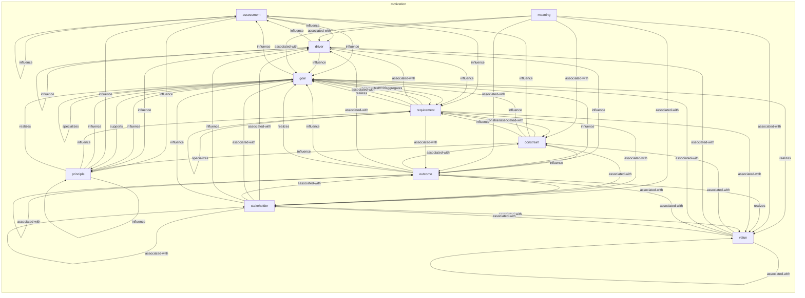
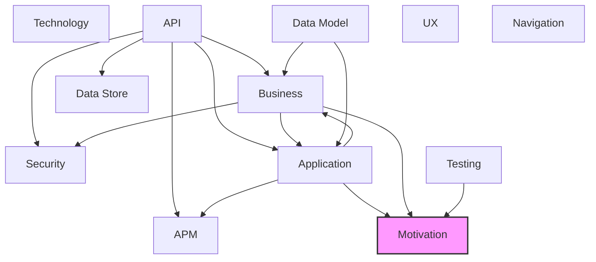

# Motivation Layer

## Report Index

- [Layer Introduction](#layer-introduction)
- [Intra-Layer Relationships](#intra-layer-relationships)
- [Inter-Layer Dependencies](#inter-layer-dependencies)
- [Inter-Layer Relationships Table](#inter-layer-relationships-table)
- [Node Reference](#node-reference)
  - [Assessment](#assessment)
  - [Constraint](#constraint)
  - [Driver](#driver)
  - [Goal](#goal)
  - [Meaning](#meaning)
  - [Outcome](#outcome)
  - [Principle](#principle)
  - [Requirement](#requirement)
  - [Stakeholder](#stakeholder)
  - [Value](#value)

## Layer Introduction

**Layer 1**: Motivation
**Standard**: [ArchiMate 3.2](https://pubs.opengroup.org/architecture/archimate32-doc/)

Layer 1: Motivation Layer

### Statistics

| Metric                    | Count |
| ------------------------- | ----- |
| Node Types                | 10    |
| Intra-Layer Relationships | 70    |
| Inter-Layer Relationships | 10    |
| Inbound Relationships     | 10    |
| Outbound Relationships    | 0     |

### Layer Dependencies

**Depends On**: [Business](./02-business-layer-report.md), [Application](./04-application-layer-report.md), [Testing](./12-testing-layer-report.md)

**Depended On By**: None

## Intra-Layer Relationships

## Inter-Layer Dependencies

## Inter-Layer Relationships Table

| Relationship ID                                                          | Source Node                                                               | Dest Node                                                  | Dest Layer                                    | Predicate              | Cardinality  | Strength |
| ------------------------------------------------------------------------ | ------------------------------------------------------------------------- | ---------------------------------------------------------- | --------------------------------------------- | ---------------------- | ------------ | -------- |
| application.applicationservice.delivers-value.motivation.value           | [applicationservice](./04-application-layer-report.md#applicationservice) | [value](./01-motivation-layer-report.md#value)             | [Motivation](./01-motivation-layer-report.md) | delivers-value         | many-to-many | medium   |
| business.businessservice.delivers-value.motivation.value                 | [businessservice](./02-business-layer-report.md#businessservice)          | [value](./01-motivation-layer-report.md#value)             | [Motivation](./01-motivation-layer-report.md) | delivers-value         | many-to-many | medium   |
| testing.coveragerequirement.constrained-by.motivation.constraint         | [coveragerequirement](./12-testing-layer-report.md#coveragerequirement)   | [constraint](./01-motivation-layer-report.md#constraint)   | [Motivation](./01-motivation-layer-report.md) | constrained-by         | many-to-many | medium   |
| testing.coveragerequirement.fulfills-requirements.motivation.requirement | [coveragerequirement](./12-testing-layer-report.md#coveragerequirement)   | [requirement](./01-motivation-layer-report.md#requirement) | [Motivation](./01-motivation-layer-report.md) | fulfills-requirements  | many-to-many | high     |
| testing.testcasesketch.fulfills-requirements.motivation.requirement      | [testcasesketch](./12-testing-layer-report.md#testcasesketch)             | [requirement](./01-motivation-layer-report.md#requirement) | [Motivation](./01-motivation-layer-report.md) | fulfills-requirements  | many-to-many | high     |
| testing.testcasesketch.supports-goals.motivation.goal                    | [testcasesketch](./12-testing-layer-report.md#testcasesketch)             | [goal](./01-motivation-layer-report.md#goal)               | [Motivation](./01-motivation-layer-report.md) | supports-goals         | many-to-many | high     |
| testing.testcoveragemodel.constrained-by.motivation.constraint           | [testcoveragemodel](./12-testing-layer-report.md#testcoveragemodel)       | [constraint](./01-motivation-layer-report.md#constraint)   | [Motivation](./01-motivation-layer-report.md) | constrained-by         | many-to-many | medium   |
| testing.testcoveragemodel.fulfills-requirements.motivation.requirement   | [testcoveragemodel](./12-testing-layer-report.md#testcoveragemodel)       | [requirement](./01-motivation-layer-report.md#requirement) | [Motivation](./01-motivation-layer-report.md) | fulfills-requirements  | many-to-many | high     |
| testing.testcoveragemodel.governed-by-principles.motivation.principle    | [testcoveragemodel](./12-testing-layer-report.md#testcoveragemodel)       | [principle](./01-motivation-layer-report.md#principle)     | [Motivation](./01-motivation-layer-report.md) | governed-by-principles | many-to-many | high     |
| testing.testcoveragemodel.supports-goals.motivation.goal                 | [testcoveragemodel](./12-testing-layer-report.md#testcoveragemodel)       | [goal](./01-motivation-layer-report.md#goal)               | [Motivation](./01-motivation-layer-report.md) | supports-goals         | many-to-many | high     |

## Node Reference

### Assessment {#assessment}

**Spec Node ID**: `motivation.assessment`

Outcome of analysis of the state of affairs of the enterprise or any part of it, and its environment. Assessments commonly take the form of strengths, weaknesses, opportunities, or threats (SWOT).

#### Relationship Metrics

- **Intra-Layer**: Inbound: 5 | Outbound: 5
- **Inter-Layer**: Inbound: 0 | Outbound: 0

#### Intra-Layer Relationships

| Related Node                | Predicate | Direction | Cardinality  |
| --------------------------- | --------- | --------- | ------------ |
| [assessment](#assessment)   | influence | outbound  | many-to-many |
| [driver](#driver)           | influence | outbound  | many-to-one  |
| [goal](#goal)               | influence | outbound  | many-to-many |
| [principle](#principle)     | influence | outbound  | many-to-many |
| [requirement](#requirement) | influence | outbound  | many-to-many |
| [constraint](#constraint)   | influence | inbound   | many-to-many |
| [driver](#driver)           | influence | inbound   | many-to-many |
| [goal](#goal)               | influence | inbound   | many-to-many |
| [principle](#principle)     | influence | inbound   | many-to-many |

[Back to Index](#report-index)

### Constraint {#constraint}

**Spec Node ID**: `motivation.constraint`

Restriction on the freedom of design and implementation choices available when realizing a system, as opposed to requirements which must be satisfied.

#### Relationship Metrics

- **Intra-Layer**: Inbound: 5 | Outbound: 6
- **Inter-Layer**: Inbound: 2 | Outbound: 0

#### Intra-Layer Relationships

| Related Node                | Predicate       | Direction | Cardinality  |
| --------------------------- | --------------- | --------- | ------------ |
| [requirement](#requirement) | constrains      | outbound  | many-to-one  |
| [assessment](#assessment)   | influence       | outbound  | many-to-many |
| [goal](#goal)               | influence       | outbound  | many-to-many |
| [outcome](#outcome)         | influence       | outbound  | many-to-one  |
| [principle](#principle)     | influence       | outbound  | many-to-many |
| [requirement](#requirement) | influence       | outbound  | many-to-many |
| [meaning](#meaning)         | associated-with | inbound   | many-to-many |
| [outcome](#outcome)         | associated-with | inbound   | many-to-many |
| [requirement](#requirement) | associated-with | inbound   | many-to-many |
| [stakeholder](#stakeholder) | associated-with | inbound   | many-to-many |
| [value](#value)             | associated-with | inbound   | many-to-many |

#### Inter-Layer Relationships

| Related Node                                                            | Layer                                   | Predicate      | Direction | Cardinality  |
| ----------------------------------------------------------------------- | --------------------------------------- | -------------- | --------- | ------------ |
| [coveragerequirement](./12-testing-layer-report.md#coveragerequirement) | [Testing](./12-testing-layer-report.md) | constrained-by | inbound   | many-to-many |
| [testcoveragemodel](./12-testing-layer-report.md#testcoveragemodel)     | [Testing](./12-testing-layer-report.md) | constrained-by | inbound   | many-to-many |

[Back to Index](#report-index)

### Driver {#driver}

**Spec Node ID**: `motivation.driver`

External or internal condition that motivates an organization to change its goals, strategy, or architecture.

#### Relationship Metrics

- **Intra-Layer**: Inbound: 8 | Outbound: 6
- **Inter-Layer**: Inbound: 0 | Outbound: 0

#### Intra-Layer Relationships

| Related Node                | Predicate       | Direction | Cardinality  |
| --------------------------- | --------------- | --------- | ------------ |
| [assessment](#assessment)   | influence       | inbound   | many-to-one  |
| [assessment](#assessment)   | influence       | outbound  | many-to-many |
| [driver](#driver)           | influence       | outbound  | many-to-one  |
| [goal](#goal)               | influence       | outbound  | many-to-many |
| [outcome](#outcome)         | influence       | outbound  | many-to-one  |
| [principle](#principle)     | influence       | outbound  | many-to-many |
| [requirement](#requirement) | influence       | outbound  | many-to-many |
| [meaning](#meaning)         | associated-with | inbound   | many-to-many |
| [outcome](#outcome)         | associated-with | inbound   | many-to-many |
| [requirement](#requirement) | associated-with | inbound   | many-to-many |
| [stakeholder](#stakeholder) | associated-with | inbound   | many-to-many |
| [stakeholder](#stakeholder) | influence       | inbound   | many-to-one  |
| [value](#value)             | associated-with | inbound   | many-to-many |

[Back to Index](#report-index)

### Goal {#goal}

**Spec Node ID**: `motivation.goal`

High-level statement of intent, direction, or desired end state

#### Relationship Metrics

- **Intra-Layer**: Inbound: 18 | Outbound: 11
- **Inter-Layer**: Inbound: 2 | Outbound: 0

#### Intra-Layer Relationships

| Related Node                | Predicate       | Direction | Cardinality  |
| --------------------------- | --------------- | --------- | ------------ |
| [assessment](#assessment)   | influence       | inbound   | many-to-many |
| [constraint](#constraint)   | influence       | inbound   | many-to-many |
| [driver](#driver)           | influence       | inbound   | many-to-many |
| [goal](#goal)               | aggregates      | outbound  | many-to-many |
| [requirement](#requirement) | aggregates      | outbound  | many-to-many |
| [assessment](#assessment)   | influence       | outbound  | many-to-many |
| [goal](#goal)               | influence       | outbound  | many-to-many |
| [outcome](#outcome)         | influence       | outbound  | many-to-one  |
| [principle](#principle)     | influence       | outbound  | many-to-many |
| [requirement](#requirement) | influence       | outbound  | many-to-many |
| [goal](#goal)               | realizes        | outbound  | many-to-many |
| [value](#value)             | realizes        | outbound  | many-to-many |
| [goal](#goal)               | specializes     | outbound  | many-to-one  |
| [principle](#principle)     | supports        | outbound  | many-to-one  |
| [meaning](#meaning)         | associated-with | inbound   | many-to-many |
| [outcome](#outcome)         | influence       | inbound   | many-to-one  |
| [outcome](#outcome)         | realizes        | inbound   | many-to-many |
| [principle](#principle)     | influence       | inbound   | many-to-many |
| [principle](#principle)     | realizes        | inbound   | many-to-one  |
| [requirement](#requirement) | aggregates      | inbound   | many-to-many |
| [requirement](#requirement) | associated-with | inbound   | many-to-many |
| [requirement](#requirement) | realizes        | inbound   | many-to-one  |
| [stakeholder](#stakeholder) | associated-with | inbound   | many-to-many |
| [stakeholder](#stakeholder) | influence       | inbound   | many-to-one  |
| [value](#value)             | associated-with | inbound   | many-to-many |

#### Inter-Layer Relationships

| Related Node                                                        | Layer                                   | Predicate      | Direction | Cardinality  |
| ------------------------------------------------------------------- | --------------------------------------- | -------------- | --------- | ------------ |
| [testcasesketch](./12-testing-layer-report.md#testcasesketch)       | [Testing](./12-testing-layer-report.md) | supports-goals | inbound   | many-to-many |
| [testcoveragemodel](./12-testing-layer-report.md#testcoveragemodel) | [Testing](./12-testing-layer-report.md) | supports-goals | inbound   | many-to-many |

[Back to Index](#report-index)

### Meaning {#meaning}

**Spec Node ID**: `motivation.meaning`

Knowledge or expertise present in, or the interpretation given to, a concept in a particular context, as understood by stakeholders.

#### Relationship Metrics

- **Intra-Layer**: Inbound: 0 | Outbound: 6
- **Inter-Layer**: Inbound: 0 | Outbound: 0

#### Intra-Layer Relationships

| Related Node                | Predicate       | Direction | Cardinality  |
| --------------------------- | --------------- | --------- | ------------ |
| [constraint](#constraint)   | associated-with | outbound  | many-to-many |
| [driver](#driver)           | associated-with | outbound  | many-to-many |
| [goal](#goal)               | associated-with | outbound  | many-to-many |
| [outcome](#outcome)         | associated-with | outbound  | many-to-many |
| [stakeholder](#stakeholder) | associated-with | outbound  | many-to-many |
| [value](#value)             | associated-with | outbound  | many-to-many |

[Back to Index](#report-index)

### Outcome {#outcome}

**Spec Node ID**: `motivation.outcome`

End result intended or already achieved by the organization or a system, distinct from a Goal which expresses the desired direction.

#### Relationship Metrics

- **Intra-Layer**: Inbound: 8 | Outbound: 7
- **Inter-Layer**: Inbound: 0 | Outbound: 0

#### Intra-Layer Relationships

| Related Node                | Predicate       | Direction | Cardinality  |
| --------------------------- | --------------- | --------- | ------------ |
| [constraint](#constraint)   | influence       | inbound   | many-to-one  |
| [driver](#driver)           | influence       | inbound   | many-to-one  |
| [goal](#goal)               | influence       | inbound   | many-to-one  |
| [meaning](#meaning)         | associated-with | inbound   | many-to-many |
| [constraint](#constraint)   | associated-with | outbound  | many-to-many |
| [driver](#driver)           | associated-with | outbound  | many-to-many |
| [outcome](#outcome)         | associated-with | outbound  | many-to-many |
| [stakeholder](#stakeholder) | associated-with | outbound  | many-to-many |
| [goal](#goal)               | influence       | outbound  | many-to-one  |
| [goal](#goal)               | realizes        | outbound  | many-to-many |
| [value](#value)             | realizes        | outbound  | many-to-many |
| [requirement](#requirement) | associated-with | inbound   | many-to-many |
| [stakeholder](#stakeholder) | associated-with | inbound   | many-to-many |
| [value](#value)             | associated-with | inbound   | many-to-many |

[Back to Index](#report-index)

### Principle {#principle}

**Spec Node ID**: `motivation.principle`

Normative property of all systems in a given context, or a statement governing how an organization intends to fulfill its mission and guide decision-making.

#### Relationship Metrics

- **Intra-Layer**: Inbound: 6 | Outbound: 5
- **Inter-Layer**: Inbound: 1 | Outbound: 0

#### Intra-Layer Relationships

| Related Node                | Predicate | Direction | Cardinality  |
| --------------------------- | --------- | --------- | ------------ |
| [assessment](#assessment)   | influence | inbound   | many-to-many |
| [constraint](#constraint)   | influence | inbound   | many-to-many |
| [driver](#driver)           | influence | inbound   | many-to-many |
| [goal](#goal)               | influence | inbound   | many-to-many |
| [goal](#goal)               | supports  | inbound   | many-to-one  |
| [assessment](#assessment)   | influence | outbound  | many-to-many |
| [goal](#goal)               | influence | outbound  | many-to-many |
| [principle](#principle)     | influence | outbound  | many-to-many |
| [requirement](#requirement) | influence | outbound  | many-to-many |
| [goal](#goal)               | realizes  | outbound  | many-to-one  |

#### Inter-Layer Relationships

| Related Node                                                        | Layer                                   | Predicate              | Direction | Cardinality  |
| ------------------------------------------------------------------- | --------------------------------------- | ---------------------- | --------- | ------------ |
| [testcoveragemodel](./12-testing-layer-report.md#testcoveragemodel) | [Testing](./12-testing-layer-report.md) | governed-by-principles | inbound   | many-to-many |

[Back to Index](#report-index)

### Requirement {#requirement}

**Spec Node ID**: `motivation.requirement`

Statement of need that must be realized by a system, component, or solution, and that can be associated with stakeholders, goals, or constraints.

#### Relationship Metrics

- **Intra-Layer**: Inbound: 9 | Outbound: 10
- **Inter-Layer**: Inbound: 3 | Outbound: 0

#### Intra-Layer Relationships

| Related Node                | Predicate       | Direction | Cardinality  |
| --------------------------- | --------------- | --------- | ------------ |
| [assessment](#assessment)   | influence       | inbound   | many-to-many |
| [constraint](#constraint)   | constrains      | inbound   | many-to-one  |
| [constraint](#constraint)   | influence       | inbound   | many-to-many |
| [driver](#driver)           | influence       | inbound   | many-to-many |
| [goal](#goal)               | aggregates      | inbound   | many-to-many |
| [goal](#goal)               | influence       | inbound   | many-to-many |
| [principle](#principle)     | influence       | inbound   | many-to-many |
| [goal](#goal)               | aggregates      | outbound  | many-to-many |
| [requirement](#requirement) | aggregates      | outbound  | many-to-many |
| [constraint](#constraint)   | associated-with | outbound  | many-to-many |
| [driver](#driver)           | associated-with | outbound  | many-to-many |
| [goal](#goal)               | associated-with | outbound  | many-to-many |
| [outcome](#outcome)         | associated-with | outbound  | many-to-many |
| [stakeholder](#stakeholder) | associated-with | outbound  | many-to-many |
| [value](#value)             | associated-with | outbound  | many-to-many |
| [goal](#goal)               | realizes        | outbound  | many-to-one  |
| [requirement](#requirement) | specializes     | outbound  | many-to-one  |

#### Inter-Layer Relationships

| Related Node                                                            | Layer                                   | Predicate             | Direction | Cardinality  |
| ----------------------------------------------------------------------- | --------------------------------------- | --------------------- | --------- | ------------ |
| [coveragerequirement](./12-testing-layer-report.md#coveragerequirement) | [Testing](./12-testing-layer-report.md) | fulfills-requirements | inbound   | many-to-many |
| [testcasesketch](./12-testing-layer-report.md#testcasesketch)           | [Testing](./12-testing-layer-report.md) | fulfills-requirements | inbound   | many-to-many |
| [testcoveragemodel](./12-testing-layer-report.md#testcoveragemodel)     | [Testing](./12-testing-layer-report.md) | fulfills-requirements | inbound   | many-to-many |

[Back to Index](#report-index)

### Stakeholder {#stakeholder}

**Spec Node ID**: `motivation.stakeholder`

Individual, team, or organization that has an interest in, or is affected by, the effects of the architecture.

#### Relationship Metrics

- **Intra-Layer**: Inbound: 5 | Outbound: 8
- **Inter-Layer**: Inbound: 0 | Outbound: 0

#### Intra-Layer Relationships

| Related Node                | Predicate       | Direction | Cardinality  |
| --------------------------- | --------------- | --------- | ------------ |
| [meaning](#meaning)         | associated-with | inbound   | many-to-many |
| [outcome](#outcome)         | associated-with | inbound   | many-to-many |
| [requirement](#requirement) | associated-with | inbound   | many-to-many |
| [constraint](#constraint)   | associated-with | outbound  | many-to-many |
| [driver](#driver)           | associated-with | outbound  | many-to-many |
| [goal](#goal)               | associated-with | outbound  | many-to-many |
| [outcome](#outcome)         | associated-with | outbound  | many-to-many |
| [stakeholder](#stakeholder) | associated-with | outbound  | many-to-many |
| [value](#value)             | associated-with | outbound  | many-to-many |
| [driver](#driver)           | influence       | outbound  | many-to-one  |
| [goal](#goal)               | influence       | outbound  | many-to-one  |
| [value](#value)             | associated-with | inbound   | many-to-many |

[Back to Index](#report-index)

### Value {#value}

**Spec Node ID**: `motivation.value`

Relative worth, utility, or importance of a concept, phenomenon, or outcome to one or more stakeholders.

#### Relationship Metrics

- **Intra-Layer**: Inbound: 6 | Outbound: 6
- **Inter-Layer**: Inbound: 2 | Outbound: 0

#### Intra-Layer Relationships

| Related Node                | Predicate       | Direction | Cardinality  |
| --------------------------- | --------------- | --------- | ------------ |
| [goal](#goal)               | realizes        | inbound   | many-to-many |
| [meaning](#meaning)         | associated-with | inbound   | many-to-many |
| [outcome](#outcome)         | realizes        | inbound   | many-to-many |
| [requirement](#requirement) | associated-with | inbound   | many-to-many |
| [stakeholder](#stakeholder) | associated-with | inbound   | many-to-many |
| [constraint](#constraint)   | associated-with | outbound  | many-to-many |
| [driver](#driver)           | associated-with | outbound  | many-to-many |
| [goal](#goal)               | associated-with | outbound  | many-to-many |
| [outcome](#outcome)         | associated-with | outbound  | many-to-many |
| [stakeholder](#stakeholder) | associated-with | outbound  | many-to-many |
| [value](#value)             | associated-with | outbound  | many-to-many |

#### Inter-Layer Relationships

| Related Node                                                              | Layer                                           | Predicate      | Direction | Cardinality  |
| ------------------------------------------------------------------------- | ----------------------------------------------- | -------------- | --------- | ------------ |
| [applicationservice](./04-application-layer-report.md#applicationservice) | [Application](./04-application-layer-report.md) | delivers-value | inbound   | many-to-many |
| [businessservice](./02-business-layer-report.md#businessservice)          | [Business](./02-business-layer-report.md)       | delivers-value | inbound   | many-to-many |

[Back to Index](#report-index)

---

_Generated: 2026-02-28T10:53:05.779Z | Spec Version: 0.8.0 | Generator: generate-layer-reports.ts_
