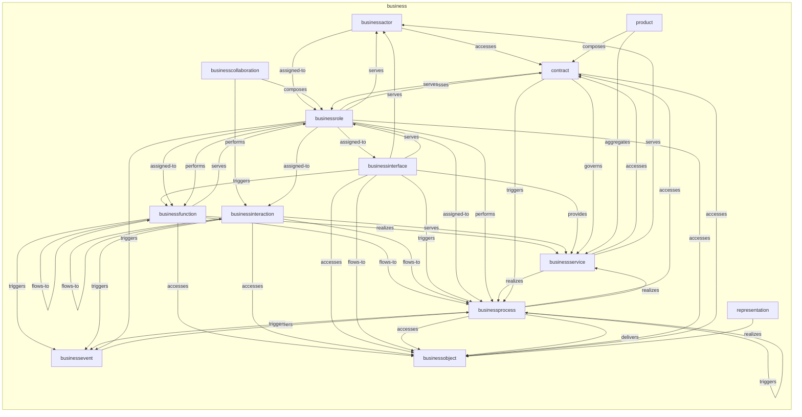
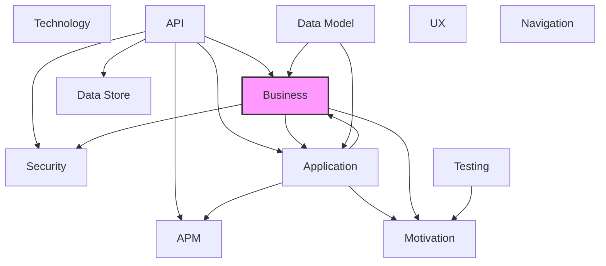

# Business Layer

## Report Index

- [Layer Introduction](#layer-introduction)
- [Intra-Layer Relationships](#intra-layer-relationships)
- [Inter-Layer Dependencies](#inter-layer-dependencies)
- [Inter-Layer Relationships Table](#inter-layer-relationships-table)
- [Node Reference](#node-reference)
  - [Businessactor](#businessactor)
  - [Businesscollaboration](#businesscollaboration)
  - [Businessevent](#businessevent)
  - [Businessfunction](#businessfunction)
  - [Businessinteraction](#businessinteraction)
  - [Businessinterface](#businessinterface)
  - [Businessobject](#businessobject)
  - [Businessprocess](#businessprocess)
  - [Businessrole](#businessrole)
  - [Businessservice](#businessservice)
  - [Contract](#contract)
  - [Product](#product)
  - [Representation](#representation)

## Layer Introduction

**Layer 2**: Business
**Standard**: [ArchiMate 3.2](https://pubs.opengroup.org/architecture/archimate32-doc/)

Layer 2: Business Layer

### Statistics

| Metric                    | Count |
| ------------------------- | ----- |
| Node Types                | 13    |
| Intra-Layer Relationships | 51    |
| Inter-Layer Relationships | 11    |
| Inbound Relationships     | 6     |
| Outbound Relationships    | 5     |

### Layer Dependencies

**Depends On**: [Application](./04-application-layer-report.md), [API](./06-api-layer-report.md), [Data Model](./07-data-model-layer-report.md)

**Depended On By**: [Motivation](./01-motivation-layer-report.md), [Security](./03-security-layer-report.md), [Application](./04-application-layer-report.md)

## Intra-Layer Relationships

## Inter-Layer Dependencies

## Inter-Layer Relationships Table

| Relationship ID                                                      | Source Node                                                               | Dest Node                                                                 | Dest Layer                                      | Predicate      | Cardinality  | Strength |
| -------------------------------------------------------------------- | ------------------------------------------------------------------------- | ------------------------------------------------------------------------- | ----------------------------------------------- | -------------- | ------------ | -------- |
| api.operation.references.business.businessinterface                  | [operation](./06-api-layer-report.md#operation)                           | [businessinterface](./02-business-layer-report.md#businessinterface)      | [Business](./02-business-layer-report.md)       | references     | many-to-one  | medium   |
| api.operation.references.business.businessservice                    | [operation](./06-api-layer-report.md#operation)                           | [businessservice](./02-business-layer-report.md#businessservice)          | [Business](./02-business-layer-report.md)       | references     | many-to-one  | medium   |
| api.securityscheme.references.business.businessinterface             | [securityscheme](./06-api-layer-report.md#securityscheme)                 | [businessinterface](./02-business-layer-report.md#businessinterface)      | [Business](./02-business-layer-report.md)       | references     | many-to-one  | medium   |
| api.securityscheme.references.business.businessservice               | [securityscheme](./06-api-layer-report.md#securityscheme)                 | [businessservice](./02-business-layer-report.md#businessservice)          | [Business](./02-business-layer-report.md)       | references     | many-to-one  | medium   |
| application.applicationprocess.realizes.business.businessprocess     | [applicationprocess](./04-application-layer-report.md#applicationprocess) | [businessprocess](./02-business-layer-report.md#businessprocess)          | [Business](./02-business-layer-report.md)       | realizes       | many-to-one  | medium   |
| business.businessobject.references.application.dataobject            | [businessobject](./02-business-layer-report.md#businessobject)            | [dataobject](./04-application-layer-report.md#dataobject)                 | [Application](./04-application-layer-report.md) | references     | many-to-one  | medium   |
| business.businessprocess.aggregates.application.applicationprocess   | [businessprocess](./02-business-layer-report.md#businessprocess)          | [applicationprocess](./04-application-layer-report.md#applicationprocess) | [Application](./04-application-layer-report.md) | aggregates     | many-to-one  | medium   |
| business.businessprocess.constrained-by.security.securityconstraints | [businessprocess](./02-business-layer-report.md#businessprocess)          | [securityconstraints](./03-security-layer-report.md#securityconstraints)  | [Security](./03-security-layer-report.md)       | constrained-by | many-to-one  | medium   |
| business.businessprocess.constrained-by.security.separationofduty    | [businessprocess](./02-business-layer-report.md#businessprocess)          | [separationofduty](./03-security-layer-report.md#separationofduty)        | [Security](./03-security-layer-report.md)       | constrained-by | many-to-one  | medium   |
| business.businessservice.delivers-value.motivation.value             | [businessservice](./02-business-layer-report.md#businessservice)          | [value](./01-motivation-layer-report.md#value)                            | [Motivation](./01-motivation-layer-report.md)   | delivers-value | many-to-many | medium   |
| data-model.jsonschema.references.business.businessobject             | [jsonschema](./07-data-model-layer-report.md#jsonschema)                  | [businessobject](./02-business-layer-report.md#businessobject)            | [Business](./02-business-layer-report.md)       | references     | many-to-one  | medium   |

## Node Reference

### Businessactor {#businessactor}

**Spec Node ID**: `business.businessactor`

An active structure element representing an organizational entity (person, department, or external organization) capable of performing behavior. BusinessActors are assigned to BusinessRoles and may be associated with BusinessServices they use or provide.

#### Relationship Metrics

- **Intra-Layer**: Inbound: 3 | Outbound: 2
- **Inter-Layer**: Inbound: 0 | Outbound: 0

#### Intra-Layer Relationships

| Related Node                            | Predicate   | Direction | Cardinality  |
| --------------------------------------- | ----------- | --------- | ------------ |
| [contract](#contract)                   | accesses    | outbound  | many-to-one  |
| [businessrole](#businessrole)           | assigned-to | outbound  | many-to-many |
| [businessinterface](#businessinterface) | serves      | inbound   | many-to-one  |
| [businessrole](#businessrole)           | serves      | inbound   | many-to-one  |
| [businessservice](#businessservice)     | serves      | inbound   | many-to-many |

[Back to Index](#report-index)

### Businesscollaboration {#businesscollaboration}

**Spec Node ID**: `business.businesscollaboration`

An active structure element representing an aggregate of two or more BusinessRoles that work together to perform collective behavior (BusinessInteraction). The collaboration is meaningful only in the context of its participating roles.

#### Relationship Metrics

- **Intra-Layer**: Inbound: 0 | Outbound: 2
- **Inter-Layer**: Inbound: 0 | Outbound: 0

#### Intra-Layer Relationships

| Related Node                                | Predicate | Direction | Cardinality  |
| ------------------------------------------- | --------- | --------- | ------------ |
| [businessrole](#businessrole)               | composes  | outbound  | many-to-many |
| [businessinteraction](#businessinteraction) | performs  | outbound  | many-to-one  |

[Back to Index](#report-index)

### Businessevent {#businessevent}

**Spec Node ID**: `business.businessevent`

A behavior element that represents an organizational state change, such as a customer order placed or a contract signed, that can trigger or result from a BusinessProcess or BusinessFunction.

#### Relationship Metrics

- **Intra-Layer**: Inbound: 4 | Outbound: 1
- **Inter-Layer**: Inbound: 0 | Outbound: 0

#### Intra-Layer Relationships

| Related Node                                | Predicate | Direction | Cardinality  |
| ------------------------------------------- | --------- | --------- | ------------ |
| [businessprocess](#businessprocess)         | triggers  | outbound  | many-to-many |
| [businessfunction](#businessfunction)       | triggers  | inbound   | many-to-one  |
| [businessinteraction](#businessinteraction) | triggers  | inbound   | many-to-one  |
| [businessprocess](#businessprocess)         | triggers  | inbound   | many-to-one  |
| [businessrole](#businessrole)               | triggers  | inbound   | many-to-one  |

[Back to Index](#report-index)

### Businessfunction {#businessfunction}

**Spec Node ID**: `business.businessfunction`

A behavior element that groups behavior based on required capabilities, skills, or resources (e.g., HR management, financial reporting). Unlike BusinessProcess, it is not goal-oriented but competency-oriented.

#### Relationship Metrics

- **Intra-Layer**: Inbound: 5 | Outbound: 7
- **Inter-Layer**: Inbound: 0 | Outbound: 0

#### Intra-Layer Relationships

| Related Node                            | Predicate   | Direction | Cardinality |
| --------------------------------------- | ----------- | --------- | ----------- |
| [businessobject](#businessobject)       | accesses    | outbound  | many-to-one |
| [businessfunction](#businessfunction)   | composes    | outbound  | many-to-one |
| [businessfunction](#businessfunction)   | flows-to    | outbound  | many-to-one |
| [businessprocess](#businessprocess)     | flows-to    | outbound  | many-to-one |
| [businessservice](#businessservice)     | realizes    | outbound  | many-to-one |
| [businessrole](#businessrole)           | serves      | outbound  | many-to-one |
| [businessevent](#businessevent)         | triggers    | outbound  | many-to-one |
| [businessinterface](#businessinterface) | triggers    | inbound   | many-to-one |
| [businessrole](#businessrole)           | assigned-to | inbound   | many-to-one |
| [businessrole](#businessrole)           | performs    | inbound   | many-to-one |

[Back to Index](#report-index)

### Businessinteraction {#businessinteraction}

**Spec Node ID**: `business.businessinteraction`

A behavior element representing collective behavior performed by a BusinessCollaboration. It is the interaction counterpart to BusinessProcess (performed by a role) and BusinessFunction (performed by an actor).

#### Relationship Metrics

- **Intra-Layer**: Inbound: 3 | Outbound: 5
- **Inter-Layer**: Inbound: 0 | Outbound: 0

#### Intra-Layer Relationships

| Related Node                                    | Predicate   | Direction | Cardinality |
| ----------------------------------------------- | ----------- | --------- | ----------- |
| [businesscollaboration](#businesscollaboration) | performs    | inbound   | many-to-one |
| [businessobject](#businessobject)               | accesses    | outbound  | many-to-one |
| [businessinteraction](#businessinteraction)     | flows-to    | outbound  | many-to-one |
| [businessprocess](#businessprocess)             | flows-to    | outbound  | many-to-one |
| [businessservice](#businessservice)             | serves      | outbound  | many-to-one |
| [businessevent](#businessevent)                 | triggers    | outbound  | many-to-one |
| [businessrole](#businessrole)                   | assigned-to | inbound   | many-to-one |

[Back to Index](#report-index)

### Businessinterface {#businessinterface}

**Spec Node ID**: `business.businessinterface`

An active structure element representing a point of access at which a BusinessService is made available to the environment, used by BusinessActors or external parties.

#### Relationship Metrics

- **Intra-Layer**: Inbound: 1 | Outbound: 7
- **Inter-Layer**: Inbound: 2 | Outbound: 0

#### Intra-Layer Relationships

| Related Node                          | Predicate   | Direction | Cardinality |
| ------------------------------------- | ----------- | --------- | ----------- |
| [businessobject](#businessobject)     | accesses    | outbound  | many-to-one |
| [businessobject](#businessobject)     | flows-to    | outbound  | many-to-one |
| [businessservice](#businessservice)   | provides    | outbound  | many-to-one |
| [businessactor](#businessactor)       | serves      | outbound  | many-to-one |
| [businessrole](#businessrole)         | serves      | outbound  | many-to-one |
| [businessfunction](#businessfunction) | triggers    | outbound  | many-to-one |
| [businessprocess](#businessprocess)   | triggers    | outbound  | many-to-one |
| [businessrole](#businessrole)         | assigned-to | inbound   | many-to-one |

#### Inter-Layer Relationships

| Related Node                                              | Layer                           | Predicate  | Direction | Cardinality |
| --------------------------------------------------------- | ------------------------------- | ---------- | --------- | ----------- |
| [operation](./06-api-layer-report.md#operation)           | [API](./06-api-layer-report.md) | references | inbound   | many-to-one |
| [securityscheme](./06-api-layer-report.md#securityscheme) | [API](./06-api-layer-report.md) | references | inbound   | many-to-one |

[Back to Index](#report-index)

### Businessobject {#businessobject}

**Spec Node ID**: `business.businessobject`

A passive structure element that has relevance from a business perspective, representing information or data that active elements (actors, roles) act upon. Examples include documents, messages, contracts, and reports.

#### Relationship Metrics

- **Intra-Layer**: Inbound: 9 | Outbound: 0
- **Inter-Layer**: Inbound: 1 | Outbound: 1

#### Intra-Layer Relationships

| Related Node                                | Predicate | Direction | Cardinality  |
| ------------------------------------------- | --------- | --------- | ------------ |
| [businessfunction](#businessfunction)       | accesses  | inbound   | many-to-one  |
| [businessinteraction](#businessinteraction) | accesses  | inbound   | many-to-one  |
| [businessinterface](#businessinterface)     | accesses  | inbound   | many-to-one  |
| [businessinterface](#businessinterface)     | flows-to  | inbound   | many-to-one  |
| [businessprocess](#businessprocess)         | accesses  | inbound   | many-to-many |
| [businessprocess](#businessprocess)         | delivers  | inbound   | many-to-one  |
| [businessrole](#businessrole)               | accesses  | inbound   | many-to-one  |
| [contract](#contract)                       | accesses  | inbound   | many-to-one  |
| [representation](#representation)           | realizes  | inbound   | many-to-one  |

#### Inter-Layer Relationships

| Related Node                                              | Layer                                           | Predicate  | Direction | Cardinality |
| --------------------------------------------------------- | ----------------------------------------------- | ---------- | --------- | ----------- |
| [dataobject](./04-application-layer-report.md#dataobject) | [Application](./04-application-layer-report.md) | references | outbound  | many-to-one |
| [jsonschema](./07-data-model-layer-report.md#jsonschema)  | [Data Model](./07-data-model-layer-report.md)   | references | inbound   | many-to-one |

[Back to Index](#report-index)

### Businessprocess {#businessprocess}

**Spec Node ID**: `business.businessprocess`

A behavior element representing a sequence or set of behaviors that achieves a specific business result for a customer or stakeholder. Driven by external triggers (BusinessEvents) or internal initiations, and performed by BusinessActors or BusinessRoles.

#### Relationship Metrics

- **Intra-Layer**: Inbound: 10 | Outbound: 7
- **Inter-Layer**: Inbound: 1 | Outbound: 3

#### Intra-Layer Relationships

| Related Node                                | Predicate   | Direction | Cardinality  |
| ------------------------------------------- | ----------- | --------- | ------------ |
| [businessevent](#businessevent)             | triggers    | inbound   | many-to-many |
| [businessfunction](#businessfunction)       | flows-to    | inbound   | many-to-one  |
| [businessinteraction](#businessinteraction) | flows-to    | inbound   | many-to-one  |
| [businessinterface](#businessinterface)     | triggers    | inbound   | many-to-one  |
| [businessobject](#businessobject)           | accesses    | outbound  | many-to-many |
| [contract](#contract)                       | accesses    | outbound  | many-to-one  |
| [businessobject](#businessobject)           | delivers    | outbound  | many-to-one  |
| [businessprocess](#businessprocess)         | flows-to    | outbound  | many-to-many |
| [businessservice](#businessservice)         | realizes    | outbound  | many-to-one  |
| [businessevent](#businessevent)             | triggers    | outbound  | many-to-one  |
| [businessprocess](#businessprocess)         | triggers    | outbound  | many-to-one  |
| [businessrole](#businessrole)               | assigned-to | inbound   | many-to-one  |
| [businessrole](#businessrole)               | performs    | inbound   | many-to-one  |
| [businessservice](#businessservice)         | realizes    | inbound   | many-to-one  |
| [contract](#contract)                       | triggers    | inbound   | many-to-one  |

#### Inter-Layer Relationships

| Related Node                                                              | Layer                                           | Predicate      | Direction | Cardinality |
| ------------------------------------------------------------------------- | ----------------------------------------------- | -------------- | --------- | ----------- |
| [applicationprocess](./04-application-layer-report.md#applicationprocess) | [Application](./04-application-layer-report.md) | realizes       | inbound   | many-to-one |
| [applicationprocess](./04-application-layer-report.md#applicationprocess) | [Application](./04-application-layer-report.md) | aggregates     | outbound  | many-to-one |
| [securityconstraints](./03-security-layer-report.md#securityconstraints)  | [Security](./03-security-layer-report.md)       | constrained-by | outbound  | many-to-one |
| [separationofduty](./03-security-layer-report.md#separationofduty)        | [Security](./03-security-layer-report.md)       | constrained-by | outbound  | many-to-one |

[Back to Index](#report-index)

### Businessrole {#businessrole}

**Spec Node ID**: `business.businessrole`

An active structure element representing a named set of responsibilities, skills, or authorizations that can be assigned to a BusinessActor. Roles abstract away the concrete actor, enabling flexible actor-to-behavior assignment.

#### Relationship Metrics

- **Intra-Layer**: Inbound: 5 | Outbound: 10
- **Inter-Layer**: Inbound: 0 | Outbound: 0

#### Intra-Layer Relationships

| Related Node                                    | Predicate   | Direction | Cardinality  |
| ----------------------------------------------- | ----------- | --------- | ------------ |
| [businessactor](#businessactor)                 | assigned-to | inbound   | many-to-many |
| [businesscollaboration](#businesscollaboration) | composes    | inbound   | many-to-many |
| [businessfunction](#businessfunction)           | serves      | inbound   | many-to-one  |
| [businessinterface](#businessinterface)         | serves      | inbound   | many-to-one  |
| [businessobject](#businessobject)               | accesses    | outbound  | many-to-one  |
| [contract](#contract)                           | accesses    | outbound  | many-to-one  |
| [businessfunction](#businessfunction)           | assigned-to | outbound  | many-to-one  |
| [businessinteraction](#businessinteraction)     | assigned-to | outbound  | many-to-one  |
| [businessinterface](#businessinterface)         | assigned-to | outbound  | many-to-one  |
| [businessprocess](#businessprocess)             | assigned-to | outbound  | many-to-one  |
| [businessfunction](#businessfunction)           | performs    | outbound  | many-to-one  |
| [businessprocess](#businessprocess)             | performs    | outbound  | many-to-one  |
| [businessactor](#businessactor)                 | serves      | outbound  | many-to-one  |
| [businessevent](#businessevent)                 | triggers    | outbound  | many-to-one  |
| [contract](#contract)                           | serves      | inbound   | many-to-one  |

[Back to Index](#report-index)

### Businessservice {#businessservice}

**Spec Node ID**: `business.businessservice`

An externally visible behavior element that fulfills a business need for a customer or stakeholder. Defined from the consumer perspective; the internal realization (via BusinessProcess or BusinessFunction) is encapsulated and not exposed.

#### Relationship Metrics

- **Intra-Layer**: Inbound: 6 | Outbound: 3
- **Inter-Layer**: Inbound: 2 | Outbound: 1

#### Intra-Layer Relationships

| Related Node                                | Predicate  | Direction | Cardinality  |
| ------------------------------------------- | ---------- | --------- | ------------ |
| [businessfunction](#businessfunction)       | realizes   | inbound   | many-to-one  |
| [businessinteraction](#businessinteraction) | serves     | inbound   | many-to-one  |
| [businessinterface](#businessinterface)     | provides   | inbound   | many-to-one  |
| [businessprocess](#businessprocess)         | realizes   | inbound   | many-to-one  |
| [contract](#contract)                       | accesses   | outbound  | many-to-one  |
| [businessprocess](#businessprocess)         | realizes   | outbound  | many-to-one  |
| [businessactor](#businessactor)             | serves     | outbound  | many-to-many |
| [contract](#contract)                       | governs    | inbound   | many-to-one  |
| [product](#product)                         | aggregates | inbound   | many-to-one  |

#### Inter-Layer Relationships

| Related Node                                              | Layer                                         | Predicate      | Direction | Cardinality  |
| --------------------------------------------------------- | --------------------------------------------- | -------------- | --------- | ------------ |
| [operation](./06-api-layer-report.md#operation)           | [API](./06-api-layer-report.md)               | references     | inbound   | many-to-one  |
| [securityscheme](./06-api-layer-report.md#securityscheme) | [API](./06-api-layer-report.md)               | references     | inbound   | many-to-one  |
| [value](./01-motivation-layer-report.md#value)            | [Motivation](./01-motivation-layer-report.md) | delivers-value | outbound  | many-to-many |

[Back to Index](#report-index)

### Contract {#contract}

**Spec Node ID**: `business.contract`

A passive structure element representing a formal or informal specification of an agreement between a service provider and consumer, defining obligations, rights, and terms. Often associated with a Product or BusinessService.

#### Relationship Metrics

- **Intra-Layer**: Inbound: 5 | Outbound: 4
- **Inter-Layer**: Inbound: 0 | Outbound: 0

#### Intra-Layer Relationships

| Related Node                        | Predicate | Direction | Cardinality |
| ----------------------------------- | --------- | --------- | ----------- |
| [businessactor](#businessactor)     | accesses  | inbound   | many-to-one |
| [businessprocess](#businessprocess) | accesses  | inbound   | many-to-one |
| [businessrole](#businessrole)       | accesses  | inbound   | many-to-one |
| [businessservice](#businessservice) | accesses  | inbound   | many-to-one |
| [businessobject](#businessobject)   | accesses  | outbound  | many-to-one |
| [businessservice](#businessservice) | governs   | outbound  | many-to-one |
| [businessrole](#businessrole)       | serves    | outbound  | many-to-one |
| [businessprocess](#businessprocess) | triggers  | outbound  | many-to-one |
| [product](#product)                 | composes  | inbound   | many-to-one |

[Back to Index](#report-index)

### Product {#product}

**Spec Node ID**: `business.product`

A passive structure element representing a coherent collection of BusinessServices and Contracts offered to customers or markets. The product encapsulates the value proposition delivered to end users or business partners.

#### Relationship Metrics

- **Intra-Layer**: Inbound: 0 | Outbound: 2
- **Inter-Layer**: Inbound: 0 | Outbound: 0

#### Intra-Layer Relationships

| Related Node                        | Predicate  | Direction | Cardinality |
| ----------------------------------- | ---------- | --------- | ----------- |
| [businessservice](#businessservice) | aggregates | outbound  | many-to-one |
| [contract](#contract)               | composes   | outbound  | many-to-one |

[Back to Index](#report-index)

### Representation {#representation}

**Spec Node ID**: `business.representation`

A passive structure element representing the perceptible form in which a BusinessObject is manifested (e.g., a printed report, a digital document, or an on-screen form). Multiple representations can carry the same BusinessObject.

#### Relationship Metrics

- **Intra-Layer**: Inbound: 0 | Outbound: 1
- **Inter-Layer**: Inbound: 0 | Outbound: 0

#### Intra-Layer Relationships

| Related Node                      | Predicate | Direction | Cardinality |
| --------------------------------- | --------- | --------- | ----------- |
| [businessobject](#businessobject) | realizes  | outbound  | many-to-one |

[Back to Index](#report-index)

---

_Generated: 2026-02-28T15:47:18.821Z | Spec Version: 0.8.1 | Generator: generate-layer-reports.ts_
