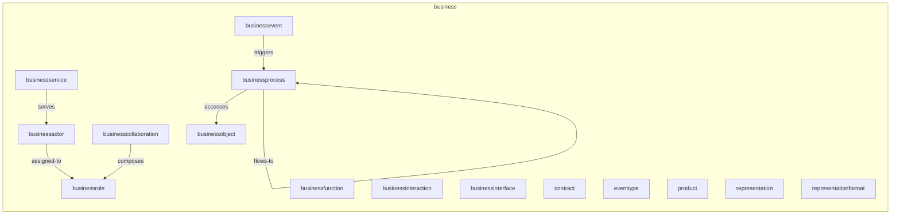
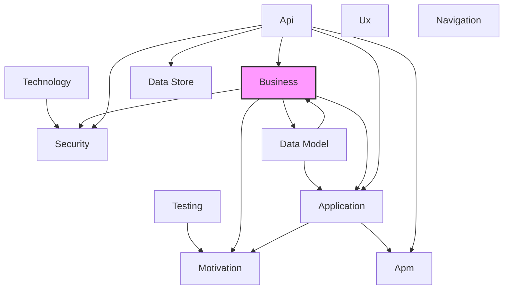

# Business Layer
## Report Index
- [Layer Introduction](#layer-introduction)
- [Intra-Layer Relationships Diagram](#intra-layer-relationships)
- [Inter-Layer Dependencies Diagram](#inter-layer-dependencies)
- [Inter-Layer Relationships Table](#inter-layer-relationships-table)
- [Node Reference](#node-reference)
  - [Businessactor](#businessactor)
  - [Businesscollaboration](#businesscollaboration)
  - [Businessevent](#businessevent)
  - [Businessfunction](#businessfunction)
  - [Businessinteraction](#businessinteraction)
  - [Businessinterface](#businessinterface)
  - [Businessobject](#businessobject)
  - [Businessprocess](#businessprocess)
  - [Businessrole](#businessrole)
  - [Businessservice](#businessservice)
  - [Contract](#contract)
  - [Eventtype](#eventtype)
  - [Product](#product)
  - [Representation](#representation)
  - [Representationformat](#representationformat)

## Layer Introduction
**Layer 2**: Business
**Standard**: [ArchiMate 3.2](https://pubs.opengroup.org/architecture/archimate32-doc/)

Layer 2: Business Layer

### Statistics
| Metric | Count |
|--------|-------|
| Node Types | 15 |
| Intra-Layer Relationships | 6 |
| Inter-Layer Relationships | 19 |
| Inbound Relationships | 10 |
| Outbound Relationships | 9 |

### Layer Dependencies
**Depends On**: [Api](./06-api-layer-report.md), [Data Model](./07-data-model-layer-report.md)
**Depended On By**: [Motivation](./01-motivation-layer-report.md), [Security](./03-security-layer-report.md), [Application](./04-application-layer-report.md), [Data Model](./07-data-model-layer-report.md)

## Intra-Layer Relationships

## Inter-Layer Dependencies

## Inter-Layer Relationships Table
| Relationship ID | Source Node | Dest Node | Dest Layer | Predicate | Cardinality | Strength |
|-----------------|-------------|-----------|------------|-----------|-------------|----------|
| business.businessobject.master-data-source.application.dataobject | [businessobject](#businessobject) | [dataobject]([Application](./04-application-layer-report.md)#dataobject) | [Application](./04-application-layer-report.md) | master-data-source | many-to-one | medium |
| business.businessprocess.process-steps.application.applicationprocess | [businessprocess](#businessprocess) | [applicationprocess]([Application](./04-application-layer-report.md)#applicationprocess) | [Application](./04-application-layer-report.md) | process-steps | many-to-many | medium |
| business.businessprocess.realized-by-process.application.applicationprocess | [businessprocess](#businessprocess) | [applicationprocess]([Application](./04-application-layer-report.md)#applicationprocess) | [Application](./04-application-layer-report.md) | realized-by-process | many-to-one | medium |
| business.businessobject.represented-by-dataobject.application.dataobject | [businessobject](#businessobject) | [dataobject]([Application](./04-application-layer-report.md)#dataobject) | [Application](./04-application-layer-report.md) | represented-by-dataobject | many-to-one | medium |
| api.operation.business-interface-ref.business.businessinterface | [operation](#operation) | [businessinterface]([Business](./02-business-layer-report.md)#businessinterface) | [Business](./02-business-layer-report.md) | business-interface-ref | many-to-one | medium |
| api.securityscheme.business-interface-ref.business.businessinterface | [securityscheme](#securityscheme) | [businessinterface]([Business](./02-business-layer-report.md)#businessinterface) | [Business](./02-business-layer-report.md) | business-interface-ref | many-to-one | medium |
| data-model.jsonschema.business-object-ref.business.businessobject | [jsonschema](#jsonschema) | [businessobject]([Business](./02-business-layer-report.md)#businessobject) | [Business](./02-business-layer-report.md) | business-object-ref | many-to-one | medium |
| api.operation.business-service-ref.business.businessservice | [operation](#operation) | [businessservice]([Business](./02-business-layer-report.md)#businessservice) | [Business](./02-business-layer-report.md) | business-service-ref | many-to-one | medium |
| api.securityscheme.business-service-ref.business.businessservice | [securityscheme](#securityscheme) | [businessservice]([Business](./02-business-layer-report.md)#businessservice) | [Business](./02-business-layer-report.md) | business-service-ref | many-to-one | medium |
| data-model.jsonschema.referenced-by.business.businessobject | [jsonschema](#jsonschema) | [businessobject]([Business](./02-business-layer-report.md)#businessobject) | [Business](./02-business-layer-report.md) | referenced-by | many-to-one | medium |
| api.operation.referenced-by.business.businessinterface | [operation](#operation) | [businessinterface]([Business](./02-business-layer-report.md)#businessinterface) | [Business](./02-business-layer-report.md) | referenced-by | many-to-one | medium |
| api.operation.referenced-by.business.businessservice | [operation](#operation) | [businessservice]([Business](./02-business-layer-report.md)#businessservice) | [Business](./02-business-layer-report.md) | referenced-by | many-to-one | medium |
| api.securityscheme.referenced-by.business.businessinterface | [securityscheme](#securityscheme) | [businessinterface]([Business](./02-business-layer-report.md)#businessinterface) | [Business](./02-business-layer-report.md) | referenced-by | many-to-one | medium |
| api.securityscheme.referenced-by.business.businessservice | [securityscheme](#securityscheme) | [businessservice]([Business](./02-business-layer-report.md)#businessservice) | [Business](./02-business-layer-report.md) | referenced-by | many-to-one | medium |
| business.businessobject.governance-owner.data-model.datagovernance | [businessobject](#businessobject) | [datagovernance]([Data Model](./07-data-model-layer-report.md)#datagovernance) | [Data Model](./07-data-model-layer-report.md) | governance-owner | many-to-one | medium |
| business.businessservice.delivers-value.motivation.value | [businessservice](#businessservice) | [value]([Motivation](./01-motivation-layer-report.md)#value) | [Motivation](./01-motivation-layer-report.md) | delivers-value | many-to-many | medium |
| business.businessprocess.referenced-by.security.separationofduty | [businessprocess](#businessprocess) | [separationofduty]([Security](./03-security-layer-report.md)#separationofduty) | [Security](./03-security-layer-report.md) | referenced-by | many-to-one | medium |
| business.businessprocess.security-controls.security.securityconstraints | [businessprocess](#businessprocess) | [securityconstraints]([Security](./03-security-layer-report.md)#securityconstraints) | [Security](./03-security-layer-report.md) | security-controls | many-to-many | high |
| business.businessprocess.separation-of-duty.security.separationofduty | [businessprocess](#businessprocess) | [separationofduty]([Security](./03-security-layer-report.md)#separationofduty) | [Security](./03-security-layer-report.md) | separation-of-duty | many-to-one | medium |

## Node Reference
### Businessactor
**Spec Node ID**: `business.businessactor`

An organizational entity capable of performing behavior

#### Intra-Layer Relationships
| Related Node | Predicate | Direction | Cardinality |
|--------------|-----------|-----------|-------------|
| [businessrole](#businessrole) | assigned-to | outbound | many-to-many |
| [businessservice](#businessservice) | serves | inbound | many-to-many |

[Back to Index](#report-index)

### Businesscollaboration
**Spec Node ID**: `business.businesscollaboration`

Aggregate of business roles working together

#### Intra-Layer Relationships
| Related Node | Predicate | Direction | Cardinality |
|--------------|-----------|-----------|-------------|
| [businessrole](#businessrole) | composes | outbound | many-to-many |

[Back to Index](#report-index)

### Businessevent
**Spec Node ID**: `business.businessevent`

Something that happens and influences behavior

#### Intra-Layer Relationships
| Related Node | Predicate | Direction | Cardinality |
|--------------|-----------|-----------|-------------|
| [businessprocess](#businessprocess) | triggers | outbound | many-to-many |

[Back to Index](#report-index)

### Businessfunction
**Spec Node ID**: `business.businessfunction`

Collection of business behavior based on criteria

[Back to Index](#report-index)

### Businessinteraction
**Spec Node ID**: `business.businessinteraction`

Unit of collective behavior by collaboration

[Back to Index](#report-index)

### Businessinterface
**Spec Node ID**: `business.businessinterface`

Point of access where business service is available

#### Inter-Layer Relationships
| Related Node | Layer | Predicate | Direction | Cardinality |
|--------------|-------|-----------|-----------|-------------|
| [operation]([Api](./06-api-layer-report.md)#operation) | [Api](./06-api-layer-report.md) | business-interface-ref | inbound | many-to-one |
| [operation]([Api](./06-api-layer-report.md)#operation) | [Api](./06-api-layer-report.md) | referenced-by | inbound | many-to-one |
| [securityscheme]([Api](./06-api-layer-report.md)#securityscheme) | [Api](./06-api-layer-report.md) | business-interface-ref | inbound | many-to-one |
| [securityscheme]([Api](./06-api-layer-report.md)#securityscheme) | [Api](./06-api-layer-report.md) | referenced-by | inbound | many-to-one |

[Back to Index](#report-index)

### Businessobject
**Spec Node ID**: `business.businessobject`

Concept used within business domain

#### Intra-Layer Relationships
| Related Node | Predicate | Direction | Cardinality |
|--------------|-----------|-----------|-------------|
| [businessprocess](#businessprocess) | accesses | inbound | many-to-many |

#### Inter-Layer Relationships
| Related Node | Layer | Predicate | Direction | Cardinality |
|--------------|-------|-----------|-----------|-------------|
| [jsonschema]([Data Model](./07-data-model-layer-report.md)#jsonschema) | [Data Model](./07-data-model-layer-report.md) | business-object-ref | inbound | many-to-one |
| [jsonschema]([Data Model](./07-data-model-layer-report.md)#jsonschema) | [Data Model](./07-data-model-layer-report.md) | referenced-by | inbound | many-to-one |
| [datagovernance]([Data Model](./07-data-model-layer-report.md)#datagovernance) | [Data Model](./07-data-model-layer-report.md) | governance-owner | outbound | many-to-one |
| [dataobject]([Application](./04-application-layer-report.md)#dataobject) | [Application](./04-application-layer-report.md) | master-data-source | outbound | many-to-one |
| [dataobject]([Application](./04-application-layer-report.md)#dataobject) | [Application](./04-application-layer-report.md) | represented-by-dataobject | outbound | many-to-one |

[Back to Index](#report-index)

### Businessprocess
**Spec Node ID**: `business.businessprocess`

Sequence of business behaviors achieving a result

#### Intra-Layer Relationships
| Related Node | Predicate | Direction | Cardinality |
|--------------|-----------|-----------|-------------|
| [businessevent](#businessevent) | triggers | inbound | many-to-many |
| [businessobject](#businessobject) | accesses | outbound | many-to-many |
| [businessprocess](#businessprocess) | flows-to | outbound | many-to-many |

#### Inter-Layer Relationships
| Related Node | Layer | Predicate | Direction | Cardinality |
|--------------|-------|-----------|-----------|-------------|
| [applicationprocess]([Application](./04-application-layer-report.md)#applicationprocess) | [Application](./04-application-layer-report.md) | process-steps | outbound | many-to-many |
| [applicationprocess]([Application](./04-application-layer-report.md)#applicationprocess) | [Application](./04-application-layer-report.md) | realized-by-process | outbound | many-to-one |
| [separationofduty]([Security](./03-security-layer-report.md)#separationofduty) | [Security](./03-security-layer-report.md) | referenced-by | outbound | many-to-one |
| [securityconstraints]([Security](./03-security-layer-report.md)#securityconstraints) | [Security](./03-security-layer-report.md) | security-controls | outbound | many-to-many |
| [separationofduty]([Security](./03-security-layer-report.md)#separationofduty) | [Security](./03-security-layer-report.md) | separation-of-duty | outbound | many-to-one |

[Back to Index](#report-index)

### Businessrole
**Spec Node ID**: `business.businessrole`

The responsibility for performing specific behavior

#### Intra-Layer Relationships
| Related Node | Predicate | Direction | Cardinality |
|--------------|-----------|-----------|-------------|
| [businessactor](#businessactor) | assigned-to | inbound | many-to-many |
| [businesscollaboration](#businesscollaboration) | composes | inbound | many-to-many |

[Back to Index](#report-index)

### Businessservice
**Spec Node ID**: `business.businessservice`

Service that fulfills a business need

#### Intra-Layer Relationships
| Related Node | Predicate | Direction | Cardinality |
|--------------|-----------|-----------|-------------|
| [businessactor](#businessactor) | serves | outbound | many-to-many |

#### Inter-Layer Relationships
| Related Node | Layer | Predicate | Direction | Cardinality |
|--------------|-------|-----------|-----------|-------------|
| [value]([Motivation](./01-motivation-layer-report.md)#value) | [Motivation](./01-motivation-layer-report.md) | delivers-value | outbound | many-to-many |
| [operation]([Api](./06-api-layer-report.md)#operation) | [Api](./06-api-layer-report.md) | business-service-ref | inbound | many-to-one |
| [operation]([Api](./06-api-layer-report.md)#operation) | [Api](./06-api-layer-report.md) | referenced-by | inbound | many-to-one |
| [securityscheme]([Api](./06-api-layer-report.md)#securityscheme) | [Api](./06-api-layer-report.md) | business-service-ref | inbound | many-to-one |
| [securityscheme]([Api](./06-api-layer-report.md)#securityscheme) | [Api](./06-api-layer-report.md) | referenced-by | inbound | many-to-one |

[Back to Index](#report-index)

### Contract
**Spec Node ID**: `business.contract`

Formal specification of agreement

[Back to Index](#report-index)

### Eventtype
**Spec Node ID**: `business.eventtype`

EventType element in Business Layer

[Back to Index](#report-index)

### Product
**Spec Node ID**: `business.product`

Coherent collection of services with a value

[Back to Index](#report-index)

### Representation
**Spec Node ID**: `business.representation`

Perceptible form of business object

[Back to Index](#report-index)

### Representationformat
**Spec Node ID**: `business.representationformat`

RepresentationFormat element in Business Layer

[Back to Index](#report-index)

---
*Generated: 2026-02-11T21:30:52.783Z | Generator: generate-layer-reports.ts*
