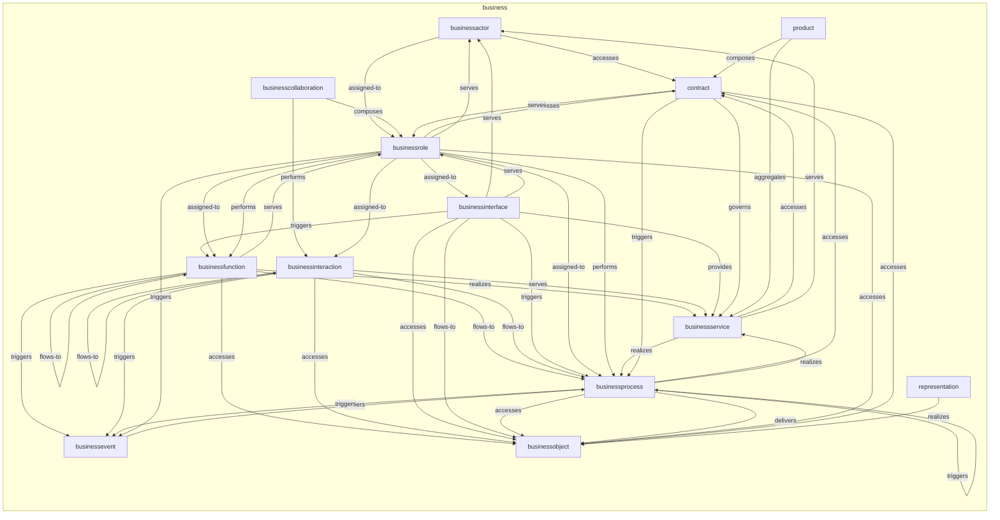
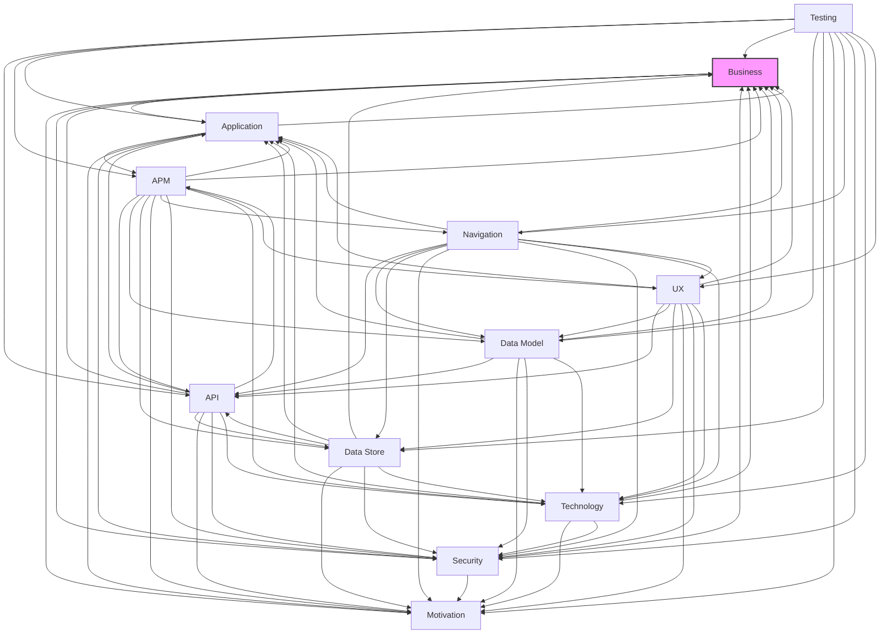

# Business Layer

## Report Index

- [Layer Introduction](#layer-introduction)
- [Intra-Layer Relationships](#intra-layer-relationships)
- [Inter-Layer Dependencies](#inter-layer-dependencies)
- [Inter-Layer Relationships Table](#inter-layer-relationships-table)
- [Node Reference](#node-reference)
  - [Businessactor](#businessactor)
  - [Businesscollaboration](#businesscollaboration)
  - [Businessevent](#businessevent)
  - [Businessfunction](#businessfunction)
  - [Businessinteraction](#businessinteraction)
  - [Businessinterface](#businessinterface)
  - [Businessobject](#businessobject)
  - [Businessprocess](#businessprocess)
  - [Businessrole](#businessrole)
  - [Businessservice](#businessservice)
  - [Contract](#contract)
  - [Product](#product)
  - [Representation](#representation)

## Layer Introduction

**Layer 2**: Business
**Standard**: [ArchiMate 3.2](https://pubs.opengroup.org/architecture/archimate32-doc/)

Layer 2: Business Layer

### Statistics

| Metric                    | Count |
| ------------------------- | ----- |
| Node Types                | 13    |
| Intra-Layer Relationships | 51    |
| Inter-Layer Relationships | 94    |
| Inbound Relationships     | 81    |
| Outbound Relationships    | 13    |

### Layer Dependencies

**Depends On**: [Security](./03-security-layer-report.md), [Application](./04-application-layer-report.md), [Technology](./05-technology-layer-report.md), [API](./06-api-layer-report.md), [Data Model](./07-data-model-layer-report.md), [Data Store](./08-data-store-layer-report.md), [UX](./09-ux-layer-report.md), [Navigation](./10-navigation-layer-report.md), [APM](./11-apm-layer-report.md), [Testing](./12-testing-layer-report.md)

**Depended On By**: [Motivation](./01-motivation-layer-report.md), [Security](./03-security-layer-report.md), [Application](./04-application-layer-report.md)

## Intra-Layer Relationships

```mermaid
flowchart LR
  subgraph business
    businessactor["businessactor"]
    businesscollaboration["businesscollaboration"]
    businessevent["businessevent"]
    businessfunction["businessfunction"]
    businessinteraction["businessinteraction"]
    businessinterface["businessinterface"]
    businessobject["businessobject"]
    businessprocess["businessprocess"]
    businessrole["businessrole"]
    businessservice["businessservice"]
    contract["contract"]
    product["product"]
    representation["representation"]
    businessactor -->|accesses| contract
    businessactor -->|assigned-to| businessrole
    businesscollaboration -->|composes| businessrole
    businesscollaboration -->|performs| businessinteraction
    businessevent -->|triggers| businessprocess
    businessfunction -->|accesses| businessobject
    businessfunction -->|composes| businessfunction
    businessfunction -->|flows-to| businessfunction
    businessfunction -->|flows-to| businessprocess
    businessfunction -->|realizes| businessservice
    businessfunction -->|serves| businessrole
    businessfunction -->|triggers| businessevent
    businessinteraction -->|accesses| businessobject
    businessinteraction -->|flows-to| businessinteraction
    businessinteraction -->|flows-to| businessprocess
    businessinteraction -->|serves| businessservice
    businessinteraction -->|triggers| businessevent
    businessinterface -->|accesses| businessobject
    businessinterface -->|flows-to| businessobject
    businessinterface -->|provides| businessservice
    businessinterface -->|serves| businessactor
    businessinterface -->|serves| businessrole
    businessinterface -->|triggers| businessfunction
    businessinterface -->|triggers| businessprocess
    businessprocess -->|accesses| businessobject
    businessprocess -->|accesses| contract
    businessprocess -->|delivers| businessobject
    businessprocess -->|flows-to| businessprocess
    businessprocess -->|realizes| businessservice
    businessprocess -->|triggers| businessevent
    businessprocess -->|triggers| businessprocess
    businessrole -->|accesses| businessobject
    businessrole -->|accesses| contract
    businessrole -->|assigned-to| businessfunction
    businessrole -->|assigned-to| businessinteraction
    businessrole -->|assigned-to| businessinterface
    businessrole -->|assigned-to| businessprocess
    businessrole -->|performs| businessfunction
    businessrole -->|performs| businessprocess
    businessrole -->|serves| businessactor
    businessrole -->|triggers| businessevent
    businessservice -->|accesses| contract
    businessservice -->|realizes| businessprocess
    businessservice -->|serves| businessactor
    contract -->|accesses| businessobject
    contract -->|governs| businessservice
    contract -->|serves| businessrole
    contract -->|triggers| businessprocess
    product -->|aggregates| businessservice
    product -->|composes| contract
    representation -->|realizes| businessobject
  end
```

## Inter-Layer Dependencies

```mermaid
flowchart TB
  classDef current fill:#f9f,stroke:#333,stroke-width:2px
  motivation["Motivation"]
  business["Business"]
  security["Security"]
  application["Application"]
  technology["Technology"]
  api["API"]
  data_model["Data Model"]
  data_store["Data Store"]
  ux["UX"]
  navigation["Navigation"]
  apm["APM"]
  testing["Testing"]
  api --> apm
  api --> application
  api --> business
  api --> data_store
  api --> motivation
  api --> security
  api --> technology
  apm --> api
  apm --> application
  apm --> business
  apm --> data_model
  apm --> data_store
  apm --> motivation
  apm --> navigation
  apm --> security
  apm --> technology
  apm --> ux
  application --> apm
  application --> business
  application --> motivation
  application --> security
  business --> application
  business --> motivation
  business --> security
  data_model --> api
  data_model --> application
  data_model --> business
  data_model --> motivation
  data_model --> security
  data_model --> technology
  data_store --> api
  data_store --> application
  data_store --> business
  data_store --> motivation
  data_store --> security
  data_store --> technology
  navigation --> api
  navigation --> application
  navigation --> business
  navigation --> data_model
  navigation --> data_store
  navigation --> motivation
  navigation --> security
  navigation --> technology
  navigation --> ux
  security --> business
  security --> motivation
  technology --> application
  technology --> business
  technology --> motivation
  technology --> security
  testing --> api
  testing --> apm
  testing --> application
  testing --> business
  testing --> data_model
  testing --> data_store
  testing --> motivation
  testing --> navigation
  testing --> security
  testing --> technology
  testing --> ux
  ux --> api
  ux --> application
  ux --> business
  ux --> data_model
  ux --> data_store
  ux --> motivation
  ux --> security
  ux --> technology
  class business current
```

## Inter-Layer Relationships Table

| Relationship ID                                                      | Source Node                                                                   | Dest Node                                                                 | Dest Layer                                      | Predicate      | Cardinality  | Strength |
| -------------------------------------------------------------------- | ----------------------------------------------------------------------------- | ------------------------------------------------------------------------- | ----------------------------------------------- | -------------- | ------------ | -------- |
| api.openapidocument.realizes.business.businessservice                | [Openapidocument](./06-api-layer-report.md#openapidocument)                   | [Businessservice](./02-business-layer-report.md#businessservice)          | [Business](./02-business-layer-report.md)       | realizes       | many-to-one  | medium   |
| api.operation.realizes.business.businessprocess                      | [Operation](./06-api-layer-report.md#operation)                               | [Businessprocess](./02-business-layer-report.md#businessprocess)          | [Business](./02-business-layer-report.md)       | realizes       | many-to-one  | medium   |
| api.operation.references.business.businessinterface                  | [Operation](./06-api-layer-report.md#operation)                               | [Businessinterface](./02-business-layer-report.md#businessinterface)      | [Business](./02-business-layer-report.md)       | references     | many-to-one  | medium   |
| api.operation.references.business.businessservice                    | [Operation](./06-api-layer-report.md#operation)                               | [Businessservice](./02-business-layer-report.md#businessservice)          | [Business](./02-business-layer-report.md)       | references     | many-to-one  | medium   |
| api.operation.serves.business.businessrole                           | [Operation](./06-api-layer-report.md#operation)                               | [Businessrole](./02-business-layer-report.md#businessrole)                | [Business](./02-business-layer-report.md)       | serves         | many-to-one  | medium   |
| api.operation.triggers.business.businessprocess                      | [Operation](./06-api-layer-report.md#operation)                               | [Businessprocess](./02-business-layer-report.md#businessprocess)          | [Business](./02-business-layer-report.md)       | triggers       | many-to-one  | medium   |
| api.pathitem.realizes.business.businessfunction                      | [Pathitem](./06-api-layer-report.md#pathitem)                                 | [Businessfunction](./02-business-layer-report.md#businessfunction)        | [Business](./02-business-layer-report.md)       | realizes       | many-to-one  | medium   |
| api.requestbody.maps-to.business.businessobject                      | [Requestbody](./06-api-layer-report.md#requestbody)                           | [Businessobject](./02-business-layer-report.md#businessobject)            | [Business](./02-business-layer-report.md)       | maps-to        | many-to-one  | medium   |
| api.schema.maps-to.business.businessobject                           | [Schema](./06-api-layer-report.md#schema)                                     | [Businessobject](./02-business-layer-report.md#businessobject)            | [Business](./02-business-layer-report.md)       | maps-to        | many-to-one  | medium   |
| api.securityscheme.references.business.businessinterface             | [Securityscheme](./06-api-layer-report.md#securityscheme)                     | [Businessinterface](./02-business-layer-report.md#businessinterface)      | [Business](./02-business-layer-report.md)       | references     | many-to-one  | medium   |
| api.securityscheme.references.business.businessservice               | [Securityscheme](./06-api-layer-report.md#securityscheme)                     | [Businessservice](./02-business-layer-report.md#businessservice)          | [Business](./02-business-layer-report.md)       | references     | many-to-one  | medium   |
| api.securityscheme.serves.business.businessrole                      | [Securityscheme](./06-api-layer-report.md#securityscheme)                     | [Businessrole](./02-business-layer-report.md#businessrole)                | [Business](./02-business-layer-report.md)       | serves         | many-to-one  | medium   |
| apm.logconfiguration.monitors.business.businessservice               | [Logconfiguration](./11-apm-layer-report.md#logconfiguration)                 | [Businessservice](./02-business-layer-report.md#businessservice)          | [Business](./02-business-layer-report.md)       | monitors       | many-to-one  | medium   |
| apm.metricinstrument.monitors.business.businessprocess               | [Metricinstrument](./11-apm-layer-report.md#metricinstrument)                 | [Businessprocess](./02-business-layer-report.md#businessprocess)          | [Business](./02-business-layer-report.md)       | monitors       | many-to-one  | medium   |
| apm.metricinstrument.monitors.business.businessservice               | [Metricinstrument](./11-apm-layer-report.md#metricinstrument)                 | [Businessservice](./02-business-layer-report.md#businessservice)          | [Business](./02-business-layer-report.md)       | monitors       | many-to-one  | medium   |
| apm.resource.serves.business.businessprocess                         | [Resource](./11-apm-layer-report.md#resource)                                 | [Businessprocess](./02-business-layer-report.md#businessprocess)          | [Business](./02-business-layer-report.md)       | serves         | many-to-one  | medium   |
| apm.span.maps-to.business.businessprocess                            | [Span](./11-apm-layer-report.md#span)                                         | [Businessprocess](./02-business-layer-report.md#businessprocess)          | [Business](./02-business-layer-report.md)       | maps-to        | many-to-one  | medium   |
| apm.traceconfiguration.monitors.business.businessservice             | [Traceconfiguration](./11-apm-layer-report.md#traceconfiguration)             | [Businessservice](./02-business-layer-report.md#businessservice)          | [Business](./02-business-layer-report.md)       | monitors       | many-to-one  | medium   |
| application.applicationcomponent.realizes.business.businessservice   | [Applicationcomponent](./04-application-layer-report.md#applicationcomponent) | [Businessservice](./02-business-layer-report.md#businessservice)          | [Business](./02-business-layer-report.md)       | realizes       | many-to-one  | medium   |
| application.applicationcomponent.serves.business.businessrole        | [Applicationcomponent](./04-application-layer-report.md#applicationcomponent) | [Businessrole](./02-business-layer-report.md#businessrole)                | [Business](./02-business-layer-report.md)       | serves         | many-to-one  | medium   |
| application.applicationevent.triggers.business.businessprocess       | [Applicationevent](./04-application-layer-report.md#applicationevent)         | [Businessprocess](./02-business-layer-report.md#businessprocess)          | [Business](./02-business-layer-report.md)       | triggers       | many-to-one  | medium   |
| application.applicationfunction.realizes.business.businessfunction   | [Applicationfunction](./04-application-layer-report.md#applicationfunction)   | [Businessfunction](./02-business-layer-report.md#businessfunction)        | [Business](./02-business-layer-report.md)       | realizes       | many-to-one  | medium   |
| application.applicationinterface.serves.business.businessrole        | [Applicationinterface](./04-application-layer-report.md#applicationinterface) | [Businessrole](./02-business-layer-report.md#businessrole)                | [Business](./02-business-layer-report.md)       | serves         | many-to-one  | medium   |
| application.applicationprocess.realizes.business.businessprocess     | [Applicationprocess](./04-application-layer-report.md#applicationprocess)     | [Businessprocess](./02-business-layer-report.md#businessprocess)          | [Business](./02-business-layer-report.md)       | realizes       | many-to-one  | medium   |
| application.applicationservice.accesses.business.businessobject      | [Applicationservice](./04-application-layer-report.md#applicationservice)     | [Businessobject](./02-business-layer-report.md#businessobject)            | [Business](./02-business-layer-report.md)       | accesses       | many-to-one  | medium   |
| application.applicationservice.realizes.business.businessservice     | [Applicationservice](./04-application-layer-report.md#applicationservice)     | [Businessservice](./02-business-layer-report.md#businessservice)          | [Business](./02-business-layer-report.md)       | realizes       | many-to-one  | medium   |
| application.applicationservice.serves.business.businessprocess       | [Applicationservice](./04-application-layer-report.md#applicationservice)     | [Businessprocess](./02-business-layer-report.md#businessprocess)          | [Business](./02-business-layer-report.md)       | serves         | many-to-one  | medium   |
| business.businessactor.serves.motivation.stakeholder                 | [Businessactor](./02-business-layer-report.md#businessactor)                  | [Stakeholder](./01-motivation-layer-report.md#stakeholder)                | [Motivation](./01-motivation-layer-report.md)   | serves         | many-to-one  | medium   |
| business.businessfunction.realizes.motivation.goal                   | [Businessfunction](./02-business-layer-report.md#businessfunction)            | [Goal](./01-motivation-layer-report.md#goal)                              | [Motivation](./01-motivation-layer-report.md)   | realizes       | many-to-one  | medium   |
| business.businessobject.references.application.dataobject            | [Businessobject](./02-business-layer-report.md#businessobject)                | [Dataobject](./04-application-layer-report.md#dataobject)                 | [Application](./04-application-layer-report.md) | references     | many-to-one  | medium   |
| business.businessprocess.aggregates.application.applicationprocess   | [Businessprocess](./02-business-layer-report.md#businessprocess)              | [Applicationprocess](./04-application-layer-report.md#applicationprocess) | [Application](./04-application-layer-report.md) | aggregates     | many-to-one  | medium   |
| business.businessprocess.constrained-by.security.securityconstraints | [Businessprocess](./02-business-layer-report.md#businessprocess)              | [Securityconstraints](./03-security-layer-report.md#securityconstraints)  | [Security](./03-security-layer-report.md)       | constrained-by | many-to-one  | medium   |
| business.businessprocess.constrained-by.security.separationofduty    | [Businessprocess](./02-business-layer-report.md#businessprocess)              | [Separationofduty](./03-security-layer-report.md#separationofduty)        | [Security](./03-security-layer-report.md)       | constrained-by | many-to-one  | medium   |
| business.businessprocess.realizes.motivation.goal                    | [Businessprocess](./02-business-layer-report.md#businessprocess)              | [Goal](./01-motivation-layer-report.md#goal)                              | [Motivation](./01-motivation-layer-report.md)   | realizes       | many-to-one  | medium   |
| business.businessprocess.realizes.motivation.outcome                 | [Businessprocess](./02-business-layer-report.md#businessprocess)              | [Outcome](./01-motivation-layer-report.md#outcome)                        | [Motivation](./01-motivation-layer-report.md)   | realizes       | many-to-one  | medium   |
| business.businessprocess.satisfies.motivation.requirement            | [Businessprocess](./02-business-layer-report.md#businessprocess)              | [Requirement](./01-motivation-layer-report.md#requirement)                | [Motivation](./01-motivation-layer-report.md)   | satisfies      | many-to-one  | medium   |
| business.businessrole.serves.motivation.stakeholder                  | [Businessrole](./02-business-layer-report.md#businessrole)                    | [Stakeholder](./01-motivation-layer-report.md#stakeholder)                | [Motivation](./01-motivation-layer-report.md)   | serves         | many-to-one  | medium   |
| business.businessservice.delivers-value.motivation.value             | [Businessservice](./02-business-layer-report.md#businessservice)              | [Value](./01-motivation-layer-report.md#value)                            | [Motivation](./01-motivation-layer-report.md)   | delivers-value | many-to-many | medium   |
| business.businessservice.realizes.motivation.goal                    | [Businessservice](./02-business-layer-report.md#businessservice)              | [Goal](./01-motivation-layer-report.md#goal)                              | [Motivation](./01-motivation-layer-report.md)   | realizes       | many-to-one  | medium   |
| business.businessservice.satisfies.motivation.requirement            | [Businessservice](./02-business-layer-report.md#businessservice)              | [Requirement](./01-motivation-layer-report.md#requirement)                | [Motivation](./01-motivation-layer-report.md)   | satisfies      | many-to-one  | medium   |
| data-model.jsonschema.references.business.businessobject             | [Jsonschema](./07-data-model-layer-report.md#jsonschema)                      | [Businessobject](./02-business-layer-report.md#businessobject)            | [Business](./02-business-layer-report.md)       | references     | many-to-one  | medium   |
| data-model.jsonschema.serves.business.businessservice                | [Jsonschema](./07-data-model-layer-report.md#jsonschema)                      | [Businessservice](./02-business-layer-report.md#businessservice)          | [Business](./02-business-layer-report.md)       | serves         | many-to-one  | medium   |
| data-model.objectschema.realizes.business.businessobject             | [Objectschema](./07-data-model-layer-report.md#objectschema)                  | [Businessobject](./02-business-layer-report.md#businessobject)            | [Business](./02-business-layer-report.md)       | realizes       | many-to-one  | medium   |
| data-model.objectschema.references.business.businessfunction         | [Objectschema](./07-data-model-layer-report.md#objectschema)                  | [Businessfunction](./02-business-layer-report.md#businessfunction)        | [Business](./02-business-layer-report.md)       | references     | many-to-one  | medium   |
| data-model.objectschema.references.business.businessprocess          | [Objectschema](./07-data-model-layer-report.md#objectschema)                  | [Businessprocess](./02-business-layer-report.md#businessprocess)          | [Business](./02-business-layer-report.md)       | references     | many-to-one  | medium   |
| data-model.schemadefinition.realizes.business.businessobject         | [Schemadefinition](./07-data-model-layer-report.md#schemadefinition)          | [Businessobject](./02-business-layer-report.md#businessobject)            | [Business](./02-business-layer-report.md)       | realizes       | many-to-one  | medium   |
| data-model.schemadefinition.references.business.businessprocess      | [Schemadefinition](./07-data-model-layer-report.md#schemadefinition)          | [Businessprocess](./02-business-layer-report.md#businessprocess)          | [Business](./02-business-layer-report.md)       | references     | many-to-one  | medium   |
| data-store.accesspattern.serves.business.businessfunction            | [Accesspattern](./08-data-store-layer-report.md#accesspattern)                | [Businessfunction](./02-business-layer-report.md#businessfunction)        | [Business](./02-business-layer-report.md)       | serves         | many-to-one  | medium   |
| data-store.collection.realizes.business.businessobject               | [Collection](./08-data-store-layer-report.md#collection)                      | [Businessobject](./02-business-layer-report.md#businessobject)            | [Business](./02-business-layer-report.md)       | realizes       | many-to-one  | medium   |
| data-store.database.realizes.business.businessservice                | [Database](./08-data-store-layer-report.md#database)                          | [Businessservice](./02-business-layer-report.md#businessservice)          | [Business](./02-business-layer-report.md)       | realizes       | many-to-one  | medium   |
| data-store.database.serves.business.businessprocess                  | [Database](./08-data-store-layer-report.md#database)                          | [Businessprocess](./02-business-layer-report.md#businessprocess)          | [Business](./02-business-layer-report.md)       | serves         | many-to-one  | medium   |
| data-store.eventhandler.triggers.business.businessevent              | [Eventhandler](./08-data-store-layer-report.md#eventhandler)                  | [Businessevent](./02-business-layer-report.md#businessevent)              | [Business](./02-business-layer-report.md)       | triggers       | many-to-one  | medium   |
| data-store.retentionpolicy.satisfies.business.contract               | [Retentionpolicy](./08-data-store-layer-report.md#retentionpolicy)            | [Contract](./02-business-layer-report.md#contract)                        | [Business](./02-business-layer-report.md)       | satisfies      | many-to-one  | medium   |
| data-store.storedlogic.realizes.business.businessfunction            | [Storedlogic](./08-data-store-layer-report.md#storedlogic)                    | [Businessfunction](./02-business-layer-report.md#businessfunction)        | [Business](./02-business-layer-report.md)       | realizes       | many-to-one  | medium   |
| data-store.view.serves.business.businessservice                      | [View](./08-data-store-layer-report.md#view)                                  | [Businessservice](./02-business-layer-report.md#businessservice)          | [Business](./02-business-layer-report.md)       | serves         | many-to-one  | medium   |
| navigation.flowstep.realizes.business.businessfunction               | [Flowstep](./10-navigation-layer-report.md#flowstep)                          | [Businessfunction](./02-business-layer-report.md#businessfunction)        | [Business](./02-business-layer-report.md)       | realizes       | many-to-one  | medium   |
| navigation.navigationflow.realizes.business.businessprocess          | [Navigationflow](./10-navigation-layer-report.md#navigationflow)              | [Businessprocess](./02-business-layer-report.md#businessprocess)          | [Business](./02-business-layer-report.md)       | realizes       | many-to-one  | medium   |
| navigation.navigationflow.serves.business.businessservice            | [Navigationflow](./10-navigation-layer-report.md#navigationflow)              | [Businessservice](./02-business-layer-report.md#businessservice)          | [Business](./02-business-layer-report.md)       | serves         | many-to-one  | medium   |
| navigation.navigationflow.triggers.business.businessprocess          | [Navigationflow](./10-navigation-layer-report.md#navigationflow)              | [Businessprocess](./02-business-layer-report.md#businessprocess)          | [Business](./02-business-layer-report.md)       | triggers       | many-to-one  | medium   |
| navigation.navigationguard.references.business.businessrole          | [Navigationguard](./10-navigation-layer-report.md#navigationguard)            | [Businessrole](./02-business-layer-report.md#businessrole)                | [Business](./02-business-layer-report.md)       | references     | many-to-one  | medium   |
| navigation.route.maps-to.business.businessfunction                   | [Route](./10-navigation-layer-report.md#route)                                | [Businessfunction](./02-business-layer-report.md#businessfunction)        | [Business](./02-business-layer-report.md)       | maps-to        | many-to-one  | medium   |
| navigation.route.realizes.business.businessprocess                   | [Route](./10-navigation-layer-report.md#route)                                | [Businessprocess](./02-business-layer-report.md#businessprocess)          | [Business](./02-business-layer-report.md)       | realizes       | many-to-one  | medium   |
| navigation.route.serves.business.businessrole                        | [Route](./10-navigation-layer-report.md#route)                                | [Businessrole](./02-business-layer-report.md#businessrole)                | [Business](./02-business-layer-report.md)       | serves         | many-to-one  | medium   |
| security.countermeasure.protects.business.businessprocess            | [Countermeasure](./03-security-layer-report.md#countermeasure)                | [Businessprocess](./02-business-layer-report.md#businessprocess)          | [Business](./02-business-layer-report.md)       | protects       | many-to-one  | medium   |
| security.role.maps-to.business.businessrole                          | [Role](./03-security-layer-report.md#role)                                    | [Businessrole](./02-business-layer-report.md#businessrole)                | [Business](./02-business-layer-report.md)       | maps-to        | many-to-one  | medium   |
| security.secureresource.references.business.businessobject           | [Secureresource](./03-security-layer-report.md#secureresource)                | [Businessobject](./02-business-layer-report.md#businessobject)            | [Business](./02-business-layer-report.md)       | references     | many-to-one  | medium   |
| security.securitypolicy.constrains.business.businessprocess          | [Securitypolicy](./03-security-layer-report.md#securitypolicy)                | [Businessprocess](./02-business-layer-report.md#businessprocess)          | [Business](./02-business-layer-report.md)       | constrains     | many-to-one  | medium   |
| security.securitypolicy.governs.business.businessservice             | [Securitypolicy](./03-security-layer-report.md#securitypolicy)                | [Businessservice](./02-business-layer-report.md#businessservice)          | [Business](./02-business-layer-report.md)       | governs        | many-to-one  | medium   |
| security.separationofduty.constrains.business.businessrole           | [Separationofduty](./03-security-layer-report.md#separationofduty)            | [Businessrole](./02-business-layer-report.md#businessrole)                | [Business](./02-business-layer-report.md)       | constrains     | many-to-one  | medium   |
| security.threat.targets.business.businessprocess                     | [Threat](./03-security-layer-report.md#threat)                                | [Businessprocess](./02-business-layer-report.md#businessprocess)          | [Business](./02-business-layer-report.md)       | targets        | many-to-one  | medium   |
| security.threat.targets.business.businessservice                     | [Threat](./03-security-layer-report.md#threat)                                | [Businessservice](./02-business-layer-report.md#businessservice)          | [Business](./02-business-layer-report.md)       | targets        | many-to-one  | medium   |
| technology.node.serves.business.businessprocess                      | [Node](./05-technology-layer-report.md#node)                                  | [Businessprocess](./02-business-layer-report.md#businessprocess)          | [Business](./02-business-layer-report.md)       | serves         | many-to-one  | medium   |
| technology.systemsoftware.realizes.business.businessservice          | [Systemsoftware](./05-technology-layer-report.md#systemsoftware)              | [Businessservice](./02-business-layer-report.md#businessservice)          | [Business](./02-business-layer-report.md)       | realizes       | many-to-one  | medium   |
| technology.systemsoftware.serves.business.businessprocess            | [Systemsoftware](./05-technology-layer-report.md#systemsoftware)              | [Businessprocess](./02-business-layer-report.md#businessprocess)          | [Business](./02-business-layer-report.md)       | serves         | many-to-one  | medium   |
| technology.technologyfunction.serves.business.businessservice        | [Technologyfunction](./05-technology-layer-report.md#technologyfunction)      | [Businessservice](./02-business-layer-report.md#businessservice)          | [Business](./02-business-layer-report.md)       | serves         | many-to-one  | medium   |
| technology.technologyservice.realizes.business.businessservice       | [Technologyservice](./05-technology-layer-report.md#technologyservice)        | [Businessservice](./02-business-layer-report.md#businessservice)          | [Business](./02-business-layer-report.md)       | realizes       | many-to-one  | medium   |
| technology.technologyservice.serves.business.businessfunction        | [Technologyservice](./05-technology-layer-report.md#technologyservice)        | [Businessfunction](./02-business-layer-report.md#businessfunction)        | [Business](./02-business-layer-report.md)       | serves         | many-to-one  | medium   |
| technology.technologyservice.serves.business.businessprocess         | [Technologyservice](./05-technology-layer-report.md#technologyservice)        | [Businessprocess](./02-business-layer-report.md#businessprocess)          | [Business](./02-business-layer-report.md)       | serves         | many-to-one  | medium   |
| technology.technologyservice.serves.business.businessservice         | [Technologyservice](./05-technology-layer-report.md#technologyservice)        | [Businessservice](./02-business-layer-report.md#businessservice)          | [Business](./02-business-layer-report.md)       | serves         | many-to-one  | medium   |
| testing.coveragerequirement.references.business.businessfunction     | [Coveragerequirement](./12-testing-layer-report.md#coveragerequirement)       | [Businessfunction](./02-business-layer-report.md#businessfunction)        | [Business](./02-business-layer-report.md)       | references     | many-to-one  | medium   |
| testing.coveragesummary.references.business.businessprocess          | [Coveragesummary](./12-testing-layer-report.md#coveragesummary)               | [Businessprocess](./02-business-layer-report.md#businessprocess)          | [Business](./02-business-layer-report.md)       | references     | many-to-one  | medium   |
| testing.testcasesketch.tests.business.businessprocess                | [Testcasesketch](./12-testing-layer-report.md#testcasesketch)                 | [Businessprocess](./02-business-layer-report.md#businessprocess)          | [Business](./02-business-layer-report.md)       | tests          | many-to-one  | medium   |
| testing.testcasesketch.tests.business.businessservice                | [Testcasesketch](./12-testing-layer-report.md#testcasesketch)                 | [Businessservice](./02-business-layer-report.md#businessservice)          | [Business](./02-business-layer-report.md)       | tests          | many-to-one  | medium   |
| testing.testcoveragemodel.covers.business.businessfunction           | [Testcoveragemodel](./12-testing-layer-report.md#testcoveragemodel)           | [Businessfunction](./02-business-layer-report.md#businessfunction)        | [Business](./02-business-layer-report.md)       | covers         | many-to-one  | medium   |
| testing.testcoveragemodel.covers.business.businessprocess            | [Testcoveragemodel](./12-testing-layer-report.md#testcoveragemodel)           | [Businessprocess](./02-business-layer-report.md#businessprocess)          | [Business](./02-business-layer-report.md)       | covers         | many-to-one  | medium   |
| testing.testcoveragemodel.covers.business.businessservice            | [Testcoveragemodel](./12-testing-layer-report.md#testcoveragemodel)           | [Businessservice](./02-business-layer-report.md#businessservice)          | [Business](./02-business-layer-report.md)       | covers         | many-to-one  | medium   |
| testing.testcoveragetarget.references.business.businessprocess       | [Testcoveragetarget](./12-testing-layer-report.md#testcoveragetarget)         | [Businessprocess](./02-business-layer-report.md#businessprocess)          | [Business](./02-business-layer-report.md)       | references     | many-to-one  | medium   |
| ux.actioncomponent.realizes.business.businessfunction                | [Actioncomponent](./09-ux-layer-report.md#actioncomponent)                    | [Businessfunction](./02-business-layer-report.md#businessfunction)        | [Business](./02-business-layer-report.md)       | realizes       | many-to-one  | medium   |
| ux.actioncomponent.triggers.business.businessevent                   | [Actioncomponent](./09-ux-layer-report.md#actioncomponent)                    | [Businessevent](./02-business-layer-report.md#businessevent)              | [Business](./02-business-layer-report.md)       | triggers       | many-to-one  | medium   |
| ux.subview.realizes.business.businessprocess                         | [Subview](./09-ux-layer-report.md#subview)                                    | [Businessprocess](./02-business-layer-report.md#businessprocess)          | [Business](./02-business-layer-report.md)       | realizes       | many-to-one  | medium   |
| ux.view.maps-to.business.businessobject                              | [View](./09-ux-layer-report.md#view)                                          | [Businessobject](./02-business-layer-report.md#businessobject)            | [Business](./02-business-layer-report.md)       | maps-to        | many-to-one  | medium   |
| ux.view.realizes.business.businessprocess                            | [View](./09-ux-layer-report.md#view)                                          | [Businessprocess](./02-business-layer-report.md#businessprocess)          | [Business](./02-business-layer-report.md)       | realizes       | many-to-one  | medium   |
| ux.view.serves.business.businessrole                                 | [View](./09-ux-layer-report.md#view)                                          | [Businessrole](./02-business-layer-report.md#businessrole)                | [Business](./02-business-layer-report.md)       | serves         | many-to-one  | medium   |
| ux.view.serves.business.businessservice                              | [View](./09-ux-layer-report.md#view)                                          | [Businessservice](./02-business-layer-report.md#businessservice)          | [Business](./02-business-layer-report.md)       | serves         | many-to-one  | medium   |

## Node Reference

### Businessactor {#businessactor}

**Spec Node ID**: `business.businessactor`

An active structure element representing an organizational entity (person, department, or external organization) capable of performing behavior. BusinessActors are assigned to BusinessRoles and may be associated with BusinessServices they use or provide.

#### Relationship Metrics

- **Intra-Layer**: Inbound: 3 | Outbound: 2
- **Inter-Layer**: Inbound: 0 | Outbound: 1

#### Intra-Layer Relationships

| Related Node                            | Predicate   | Direction | Cardinality  |
| --------------------------------------- | ----------- | --------- | ------------ |
| [Contract](#contract)                   | accesses    | outbound  | many-to-one  |
| [Businessrole](#businessrole)           | assigned-to | outbound  | many-to-many |
| [Businessinterface](#businessinterface) | serves      | inbound   | many-to-one  |
| [Businessrole](#businessrole)           | serves      | inbound   | many-to-one  |
| [Businessservice](#businessservice)     | serves      | inbound   | many-to-many |

#### Inter-Layer Relationships

| Related Node                                               | Layer                                         | Predicate | Direction | Cardinality |
| ---------------------------------------------------------- | --------------------------------------------- | --------- | --------- | ----------- |
| [Stakeholder](./01-motivation-layer-report.md#stakeholder) | [Motivation](./01-motivation-layer-report.md) | serves    | outbound  | many-to-one |

[Back to Index](#report-index)

### Businesscollaboration {#businesscollaboration}

**Spec Node ID**: `business.businesscollaboration`

An active structure element representing an aggregate of two or more BusinessRoles that work together to perform collective behavior (BusinessInteraction). The collaboration is meaningful only in the context of its participating roles.

#### Relationship Metrics

- **Intra-Layer**: Inbound: 0 | Outbound: 2
- **Inter-Layer**: Inbound: 0 | Outbound: 0

#### Intra-Layer Relationships

| Related Node                                | Predicate | Direction | Cardinality  |
| ------------------------------------------- | --------- | --------- | ------------ |
| [Businessrole](#businessrole)               | composes  | outbound  | many-to-many |
| [Businessinteraction](#businessinteraction) | performs  | outbound  | many-to-one  |

[Back to Index](#report-index)

### Businessevent {#businessevent}

**Spec Node ID**: `business.businessevent`

A behavior element that represents an organizational state change, such as a customer order placed or a contract signed, that can trigger or result from a BusinessProcess or BusinessFunction.

#### Relationship Metrics

- **Intra-Layer**: Inbound: 4 | Outbound: 1
- **Inter-Layer**: Inbound: 2 | Outbound: 0

#### Intra-Layer Relationships

| Related Node                                | Predicate | Direction | Cardinality  |
| ------------------------------------------- | --------- | --------- | ------------ |
| [Businessprocess](#businessprocess)         | triggers  | outbound  | many-to-many |
| [Businessfunction](#businessfunction)       | triggers  | inbound   | many-to-one  |
| [Businessinteraction](#businessinteraction) | triggers  | inbound   | many-to-one  |
| [Businessprocess](#businessprocess)         | triggers  | inbound   | many-to-one  |
| [Businessrole](#businessrole)               | triggers  | inbound   | many-to-one  |

#### Inter-Layer Relationships

| Related Node                                                 | Layer                                         | Predicate | Direction | Cardinality |
| ------------------------------------------------------------ | --------------------------------------------- | --------- | --------- | ----------- |
| [Eventhandler](./08-data-store-layer-report.md#eventhandler) | [Data Store](./08-data-store-layer-report.md) | triggers  | inbound   | many-to-one |
| [Actioncomponent](./09-ux-layer-report.md#actioncomponent)   | [UX](./09-ux-layer-report.md)                 | triggers  | inbound   | many-to-one |

[Back to Index](#report-index)

### Businessfunction {#businessfunction}

**Spec Node ID**: `business.businessfunction`

A behavior element that groups behavior based on required capabilities, skills, or resources (e.g., HR management, financial reporting). Unlike BusinessProcess, it is not goal-oriented but competency-oriented.

#### Relationship Metrics

- **Intra-Layer**: Inbound: 5 | Outbound: 7
- **Inter-Layer**: Inbound: 11 | Outbound: 1

#### Intra-Layer Relationships

| Related Node                            | Predicate   | Direction | Cardinality |
| --------------------------------------- | ----------- | --------- | ----------- |
| [Businessobject](#businessobject)       | accesses    | outbound  | many-to-one |
| [Businessfunction](#businessfunction)   | composes    | outbound  | many-to-one |
| [Businessfunction](#businessfunction)   | flows-to    | outbound  | many-to-one |
| [Businessprocess](#businessprocess)     | flows-to    | outbound  | many-to-one |
| [Businessservice](#businessservice)     | realizes    | outbound  | many-to-one |
| [Businessrole](#businessrole)           | serves      | outbound  | many-to-one |
| [Businessevent](#businessevent)         | triggers    | outbound  | many-to-one |
| [Businessinterface](#businessinterface) | triggers    | inbound   | many-to-one |
| [Businessrole](#businessrole)           | assigned-to | inbound   | many-to-one |
| [Businessrole](#businessrole)           | performs    | inbound   | many-to-one |

#### Inter-Layer Relationships

| Related Node                                                                | Layer                                           | Predicate  | Direction | Cardinality |
| --------------------------------------------------------------------------- | ----------------------------------------------- | ---------- | --------- | ----------- |
| [Pathitem](./06-api-layer-report.md#pathitem)                               | [API](./06-api-layer-report.md)                 | realizes   | inbound   | many-to-one |
| [Applicationfunction](./04-application-layer-report.md#applicationfunction) | [Application](./04-application-layer-report.md) | realizes   | inbound   | many-to-one |
| [Goal](./01-motivation-layer-report.md#goal)                                | [Motivation](./01-motivation-layer-report.md)   | realizes   | outbound  | many-to-one |
| [Objectschema](./07-data-model-layer-report.md#objectschema)                | [Data Model](./07-data-model-layer-report.md)   | references | inbound   | many-to-one |
| [Accesspattern](./08-data-store-layer-report.md#accesspattern)              | [Data Store](./08-data-store-layer-report.md)   | serves     | inbound   | many-to-one |
| [Storedlogic](./08-data-store-layer-report.md#storedlogic)                  | [Data Store](./08-data-store-layer-report.md)   | realizes   | inbound   | many-to-one |
| [Flowstep](./10-navigation-layer-report.md#flowstep)                        | [Navigation](./10-navigation-layer-report.md)   | realizes   | inbound   | many-to-one |
| [Route](./10-navigation-layer-report.md#route)                              | [Navigation](./10-navigation-layer-report.md)   | maps-to    | inbound   | many-to-one |
| [Technologyservice](./05-technology-layer-report.md#technologyservice)      | [Technology](./05-technology-layer-report.md)   | serves     | inbound   | many-to-one |
| [Coveragerequirement](./12-testing-layer-report.md#coveragerequirement)     | [Testing](./12-testing-layer-report.md)         | references | inbound   | many-to-one |
| [Testcoveragemodel](./12-testing-layer-report.md#testcoveragemodel)         | [Testing](./12-testing-layer-report.md)         | covers     | inbound   | many-to-one |
| [Actioncomponent](./09-ux-layer-report.md#actioncomponent)                  | [UX](./09-ux-layer-report.md)                   | realizes   | inbound   | many-to-one |

[Back to Index](#report-index)

### Businessinteraction {#businessinteraction}

**Spec Node ID**: `business.businessinteraction`

A behavior element representing collective behavior performed by a BusinessCollaboration. It is the interaction counterpart to BusinessProcess (performed by a role) and BusinessFunction (performed by an actor).

#### Relationship Metrics

- **Intra-Layer**: Inbound: 3 | Outbound: 5
- **Inter-Layer**: Inbound: 0 | Outbound: 0

#### Intra-Layer Relationships

| Related Node                                    | Predicate   | Direction | Cardinality |
| ----------------------------------------------- | ----------- | --------- | ----------- |
| [Businesscollaboration](#businesscollaboration) | performs    | inbound   | many-to-one |
| [Businessobject](#businessobject)               | accesses    | outbound  | many-to-one |
| [Businessinteraction](#businessinteraction)     | flows-to    | outbound  | many-to-one |
| [Businessprocess](#businessprocess)             | flows-to    | outbound  | many-to-one |
| [Businessservice](#businessservice)             | serves      | outbound  | many-to-one |
| [Businessevent](#businessevent)                 | triggers    | outbound  | many-to-one |
| [Businessrole](#businessrole)                   | assigned-to | inbound   | many-to-one |

[Back to Index](#report-index)

### Businessinterface {#businessinterface}

**Spec Node ID**: `business.businessinterface`

An active structure element representing a point of access at which a BusinessService is made available to the environment, used by BusinessActors or external parties.

#### Relationship Metrics

- **Intra-Layer**: Inbound: 1 | Outbound: 7
- **Inter-Layer**: Inbound: 2 | Outbound: 0

#### Intra-Layer Relationships

| Related Node                          | Predicate   | Direction | Cardinality |
| ------------------------------------- | ----------- | --------- | ----------- |
| [Businessobject](#businessobject)     | accesses    | outbound  | many-to-one |
| [Businessobject](#businessobject)     | flows-to    | outbound  | many-to-one |
| [Businessservice](#businessservice)   | provides    | outbound  | many-to-one |
| [Businessactor](#businessactor)       | serves      | outbound  | many-to-one |
| [Businessrole](#businessrole)         | serves      | outbound  | many-to-one |
| [Businessfunction](#businessfunction) | triggers    | outbound  | many-to-one |
| [Businessprocess](#businessprocess)   | triggers    | outbound  | many-to-one |
| [Businessrole](#businessrole)         | assigned-to | inbound   | many-to-one |

#### Inter-Layer Relationships

| Related Node                                              | Layer                           | Predicate  | Direction | Cardinality |
| --------------------------------------------------------- | ------------------------------- | ---------- | --------- | ----------- |
| [Operation](./06-api-layer-report.md#operation)           | [API](./06-api-layer-report.md) | references | inbound   | many-to-one |
| [Securityscheme](./06-api-layer-report.md#securityscheme) | [API](./06-api-layer-report.md) | references | inbound   | many-to-one |

[Back to Index](#report-index)

### Businessobject {#businessobject}

**Spec Node ID**: `business.businessobject`

A passive structure element that has relevance from a business perspective, representing information or data that active elements (actors, roles) act upon. Examples include documents, messages, contracts, and reports.

#### Relationship Metrics

- **Intra-Layer**: Inbound: 9 | Outbound: 0
- **Inter-Layer**: Inbound: 9 | Outbound: 1

#### Intra-Layer Relationships

| Related Node                                | Predicate | Direction | Cardinality  |
| ------------------------------------------- | --------- | --------- | ------------ |
| [Businessfunction](#businessfunction)       | accesses  | inbound   | many-to-one  |
| [Businessinteraction](#businessinteraction) | accesses  | inbound   | many-to-one  |
| [Businessinterface](#businessinterface)     | accesses  | inbound   | many-to-one  |
| [Businessinterface](#businessinterface)     | flows-to  | inbound   | many-to-one  |
| [Businessprocess](#businessprocess)         | accesses  | inbound   | many-to-many |
| [Businessprocess](#businessprocess)         | delivers  | inbound   | many-to-one  |
| [Businessrole](#businessrole)               | accesses  | inbound   | many-to-one  |
| [Contract](#contract)                       | accesses  | inbound   | many-to-one  |
| [Representation](#representation)           | realizes  | inbound   | many-to-one  |

#### Inter-Layer Relationships

| Related Node                                                              | Layer                                           | Predicate  | Direction | Cardinality |
| ------------------------------------------------------------------------- | ----------------------------------------------- | ---------- | --------- | ----------- |
| [Requestbody](./06-api-layer-report.md#requestbody)                       | [API](./06-api-layer-report.md)                 | maps-to    | inbound   | many-to-one |
| [Schema](./06-api-layer-report.md#schema)                                 | [API](./06-api-layer-report.md)                 | maps-to    | inbound   | many-to-one |
| [Applicationservice](./04-application-layer-report.md#applicationservice) | [Application](./04-application-layer-report.md) | accesses   | inbound   | many-to-one |
| [Dataobject](./04-application-layer-report.md#dataobject)                 | [Application](./04-application-layer-report.md) | references | outbound  | many-to-one |
| [Jsonschema](./07-data-model-layer-report.md#jsonschema)                  | [Data Model](./07-data-model-layer-report.md)   | references | inbound   | many-to-one |
| [Objectschema](./07-data-model-layer-report.md#objectschema)              | [Data Model](./07-data-model-layer-report.md)   | realizes   | inbound   | many-to-one |
| [Schemadefinition](./07-data-model-layer-report.md#schemadefinition)      | [Data Model](./07-data-model-layer-report.md)   | realizes   | inbound   | many-to-one |
| [Collection](./08-data-store-layer-report.md#collection)                  | [Data Store](./08-data-store-layer-report.md)   | realizes   | inbound   | many-to-one |
| [Secureresource](./03-security-layer-report.md#secureresource)            | [Security](./03-security-layer-report.md)       | references | inbound   | many-to-one |
| [View](./09-ux-layer-report.md#view)                                      | [UX](./09-ux-layer-report.md)                   | maps-to    | inbound   | many-to-one |

[Back to Index](#report-index)

### Businessprocess {#businessprocess}

**Spec Node ID**: `business.businessprocess`

A behavior element representing a sequence or set of behaviors that achieves a specific business result for a customer or stakeholder. Driven by external triggers (BusinessEvents) or internal initiations, and performed by BusinessActors or BusinessRoles.

#### Relationship Metrics

- **Intra-Layer**: Inbound: 10 | Outbound: 7
- **Inter-Layer**: Inbound: 26 | Outbound: 6

#### Intra-Layer Relationships

| Related Node                                | Predicate   | Direction | Cardinality  |
| ------------------------------------------- | ----------- | --------- | ------------ |
| [Businessevent](#businessevent)             | triggers    | inbound   | many-to-many |
| [Businessfunction](#businessfunction)       | flows-to    | inbound   | many-to-one  |
| [Businessinteraction](#businessinteraction) | flows-to    | inbound   | many-to-one  |
| [Businessinterface](#businessinterface)     | triggers    | inbound   | many-to-one  |
| [Businessobject](#businessobject)           | accesses    | outbound  | many-to-many |
| [Contract](#contract)                       | accesses    | outbound  | many-to-one  |
| [Businessobject](#businessobject)           | delivers    | outbound  | many-to-one  |
| [Businessprocess](#businessprocess)         | flows-to    | outbound  | many-to-many |
| [Businessservice](#businessservice)         | realizes    | outbound  | many-to-one  |
| [Businessevent](#businessevent)             | triggers    | outbound  | many-to-one  |
| [Businessprocess](#businessprocess)         | triggers    | outbound  | many-to-one  |
| [Businessrole](#businessrole)               | assigned-to | inbound   | many-to-one  |
| [Businessrole](#businessrole)               | performs    | inbound   | many-to-one  |
| [Businessservice](#businessservice)         | realizes    | inbound   | many-to-one  |
| [Contract](#contract)                       | triggers    | inbound   | many-to-one  |

#### Inter-Layer Relationships

| Related Node                                                              | Layer                                           | Predicate      | Direction | Cardinality |
| ------------------------------------------------------------------------- | ----------------------------------------------- | -------------- | --------- | ----------- |
| [Operation](./06-api-layer-report.md#operation)                           | [API](./06-api-layer-report.md)                 | realizes       | inbound   | many-to-one |
| [Operation](./06-api-layer-report.md#operation)                           | [API](./06-api-layer-report.md)                 | triggers       | inbound   | many-to-one |
| [Metricinstrument](./11-apm-layer-report.md#metricinstrument)             | [APM](./11-apm-layer-report.md)                 | monitors       | inbound   | many-to-one |
| [Resource](./11-apm-layer-report.md#resource)                             | [APM](./11-apm-layer-report.md)                 | serves         | inbound   | many-to-one |
| [Span](./11-apm-layer-report.md#span)                                     | [APM](./11-apm-layer-report.md)                 | maps-to        | inbound   | many-to-one |
| [Applicationevent](./04-application-layer-report.md#applicationevent)     | [Application](./04-application-layer-report.md) | triggers       | inbound   | many-to-one |
| [Applicationprocess](./04-application-layer-report.md#applicationprocess) | [Application](./04-application-layer-report.md) | realizes       | inbound   | many-to-one |
| [Applicationservice](./04-application-layer-report.md#applicationservice) | [Application](./04-application-layer-report.md) | serves         | inbound   | many-to-one |
| [Applicationprocess](./04-application-layer-report.md#applicationprocess) | [Application](./04-application-layer-report.md) | aggregates     | outbound  | many-to-one |
| [Securityconstraints](./03-security-layer-report.md#securityconstraints)  | [Security](./03-security-layer-report.md)       | constrained-by | outbound  | many-to-one |
| [Separationofduty](./03-security-layer-report.md#separationofduty)        | [Security](./03-security-layer-report.md)       | constrained-by | outbound  | many-to-one |
| [Goal](./01-motivation-layer-report.md#goal)                              | [Motivation](./01-motivation-layer-report.md)   | realizes       | outbound  | many-to-one |
| [Outcome](./01-motivation-layer-report.md#outcome)                        | [Motivation](./01-motivation-layer-report.md)   | realizes       | outbound  | many-to-one |
| [Requirement](./01-motivation-layer-report.md#requirement)                | [Motivation](./01-motivation-layer-report.md)   | satisfies      | outbound  | many-to-one |
| [Objectschema](./07-data-model-layer-report.md#objectschema)              | [Data Model](./07-data-model-layer-report.md)   | references     | inbound   | many-to-one |
| [Schemadefinition](./07-data-model-layer-report.md#schemadefinition)      | [Data Model](./07-data-model-layer-report.md)   | references     | inbound   | many-to-one |
| [Database](./08-data-store-layer-report.md#database)                      | [Data Store](./08-data-store-layer-report.md)   | serves         | inbound   | many-to-one |
| [Navigationflow](./10-navigation-layer-report.md#navigationflow)          | [Navigation](./10-navigation-layer-report.md)   | realizes       | inbound   | many-to-one |
| [Navigationflow](./10-navigation-layer-report.md#navigationflow)          | [Navigation](./10-navigation-layer-report.md)   | triggers       | inbound   | many-to-one |
| [Route](./10-navigation-layer-report.md#route)                            | [Navigation](./10-navigation-layer-report.md)   | realizes       | inbound   | many-to-one |
| [Countermeasure](./03-security-layer-report.md#countermeasure)            | [Security](./03-security-layer-report.md)       | protects       | inbound   | many-to-one |
| [Securitypolicy](./03-security-layer-report.md#securitypolicy)            | [Security](./03-security-layer-report.md)       | constrains     | inbound   | many-to-one |
| [Threat](./03-security-layer-report.md#threat)                            | [Security](./03-security-layer-report.md)       | targets        | inbound   | many-to-one |
| [Node](./05-technology-layer-report.md#node)                              | [Technology](./05-technology-layer-report.md)   | serves         | inbound   | many-to-one |
| [Systemsoftware](./05-technology-layer-report.md#systemsoftware)          | [Technology](./05-technology-layer-report.md)   | serves         | inbound   | many-to-one |
| [Technologyservice](./05-technology-layer-report.md#technologyservice)    | [Technology](./05-technology-layer-report.md)   | serves         | inbound   | many-to-one |
| [Coveragesummary](./12-testing-layer-report.md#coveragesummary)           | [Testing](./12-testing-layer-report.md)         | references     | inbound   | many-to-one |
| [Testcasesketch](./12-testing-layer-report.md#testcasesketch)             | [Testing](./12-testing-layer-report.md)         | tests          | inbound   | many-to-one |
| [Testcoveragemodel](./12-testing-layer-report.md#testcoveragemodel)       | [Testing](./12-testing-layer-report.md)         | covers         | inbound   | many-to-one |
| [Testcoveragetarget](./12-testing-layer-report.md#testcoveragetarget)     | [Testing](./12-testing-layer-report.md)         | references     | inbound   | many-to-one |
| [Subview](./09-ux-layer-report.md#subview)                                | [UX](./09-ux-layer-report.md)                   | realizes       | inbound   | many-to-one |
| [View](./09-ux-layer-report.md#view)                                      | [UX](./09-ux-layer-report.md)                   | realizes       | inbound   | many-to-one |

[Back to Index](#report-index)

### Businessrole {#businessrole}

**Spec Node ID**: `business.businessrole`

An active structure element representing a named set of responsibilities, skills, or authorizations that can be assigned to a BusinessActor. Roles abstract away the concrete actor, enabling flexible actor-to-behavior assignment.

#### Relationship Metrics

- **Intra-Layer**: Inbound: 5 | Outbound: 10
- **Inter-Layer**: Inbound: 9 | Outbound: 1

#### Intra-Layer Relationships

| Related Node                                    | Predicate   | Direction | Cardinality  |
| ----------------------------------------------- | ----------- | --------- | ------------ |
| [Businessactor](#businessactor)                 | assigned-to | inbound   | many-to-many |
| [Businesscollaboration](#businesscollaboration) | composes    | inbound   | many-to-many |
| [Businessfunction](#businessfunction)           | serves      | inbound   | many-to-one  |
| [Businessinterface](#businessinterface)         | serves      | inbound   | many-to-one  |
| [Businessobject](#businessobject)               | accesses    | outbound  | many-to-one  |
| [Contract](#contract)                           | accesses    | outbound  | many-to-one  |
| [Businessfunction](#businessfunction)           | assigned-to | outbound  | many-to-one  |
| [Businessinteraction](#businessinteraction)     | assigned-to | outbound  | many-to-one  |
| [Businessinterface](#businessinterface)         | assigned-to | outbound  | many-to-one  |
| [Businessprocess](#businessprocess)             | assigned-to | outbound  | many-to-one  |
| [Businessfunction](#businessfunction)           | performs    | outbound  | many-to-one  |
| [Businessprocess](#businessprocess)             | performs    | outbound  | many-to-one  |
| [Businessactor](#businessactor)                 | serves      | outbound  | many-to-one  |
| [Businessevent](#businessevent)                 | triggers    | outbound  | many-to-one  |
| [Contract](#contract)                           | serves      | inbound   | many-to-one  |

#### Inter-Layer Relationships

| Related Node                                                                  | Layer                                           | Predicate  | Direction | Cardinality |
| ----------------------------------------------------------------------------- | ----------------------------------------------- | ---------- | --------- | ----------- |
| [Operation](./06-api-layer-report.md#operation)                               | [API](./06-api-layer-report.md)                 | serves     | inbound   | many-to-one |
| [Securityscheme](./06-api-layer-report.md#securityscheme)                     | [API](./06-api-layer-report.md)                 | serves     | inbound   | many-to-one |
| [Applicationcomponent](./04-application-layer-report.md#applicationcomponent) | [Application](./04-application-layer-report.md) | serves     | inbound   | many-to-one |
| [Applicationinterface](./04-application-layer-report.md#applicationinterface) | [Application](./04-application-layer-report.md) | serves     | inbound   | many-to-one |
| [Stakeholder](./01-motivation-layer-report.md#stakeholder)                    | [Motivation](./01-motivation-layer-report.md)   | serves     | outbound  | many-to-one |
| [Navigationguard](./10-navigation-layer-report.md#navigationguard)            | [Navigation](./10-navigation-layer-report.md)   | references | inbound   | many-to-one |
| [Route](./10-navigation-layer-report.md#route)                                | [Navigation](./10-navigation-layer-report.md)   | serves     | inbound   | many-to-one |
| [Role](./03-security-layer-report.md#role)                                    | [Security](./03-security-layer-report.md)       | maps-to    | inbound   | many-to-one |
| [Separationofduty](./03-security-layer-report.md#separationofduty)            | [Security](./03-security-layer-report.md)       | constrains | inbound   | many-to-one |
| [View](./09-ux-layer-report.md#view)                                          | [UX](./09-ux-layer-report.md)                   | serves     | inbound   | many-to-one |

[Back to Index](#report-index)

### Businessservice {#businessservice}

**Spec Node ID**: `business.businessservice`

An externally visible behavior element that fulfills a business need for a customer or stakeholder. Defined from the consumer perspective; the internal realization (via BusinessProcess or BusinessFunction) is encapsulated and not exposed.

#### Relationship Metrics

- **Intra-Layer**: Inbound: 6 | Outbound: 3
- **Inter-Layer**: Inbound: 21 | Outbound: 3

#### Intra-Layer Relationships

| Related Node                                | Predicate  | Direction | Cardinality  |
| ------------------------------------------- | ---------- | --------- | ------------ |
| [Businessfunction](#businessfunction)       | realizes   | inbound   | many-to-one  |
| [Businessinteraction](#businessinteraction) | serves     | inbound   | many-to-one  |
| [Businessinterface](#businessinterface)     | provides   | inbound   | many-to-one  |
| [Businessprocess](#businessprocess)         | realizes   | inbound   | many-to-one  |
| [Contract](#contract)                       | accesses   | outbound  | many-to-one  |
| [Businessprocess](#businessprocess)         | realizes   | outbound  | many-to-one  |
| [Businessactor](#businessactor)             | serves     | outbound  | many-to-many |
| [Contract](#contract)                       | governs    | inbound   | many-to-one  |
| [Product](#product)                         | aggregates | inbound   | many-to-one  |

#### Inter-Layer Relationships

| Related Node                                                                  | Layer                                           | Predicate      | Direction | Cardinality  |
| ----------------------------------------------------------------------------- | ----------------------------------------------- | -------------- | --------- | ------------ |
| [Openapidocument](./06-api-layer-report.md#openapidocument)                   | [API](./06-api-layer-report.md)                 | realizes       | inbound   | many-to-one  |
| [Operation](./06-api-layer-report.md#operation)                               | [API](./06-api-layer-report.md)                 | references     | inbound   | many-to-one  |
| [Securityscheme](./06-api-layer-report.md#securityscheme)                     | [API](./06-api-layer-report.md)                 | references     | inbound   | many-to-one  |
| [Logconfiguration](./11-apm-layer-report.md#logconfiguration)                 | [APM](./11-apm-layer-report.md)                 | monitors       | inbound   | many-to-one  |
| [Metricinstrument](./11-apm-layer-report.md#metricinstrument)                 | [APM](./11-apm-layer-report.md)                 | monitors       | inbound   | many-to-one  |
| [Traceconfiguration](./11-apm-layer-report.md#traceconfiguration)             | [APM](./11-apm-layer-report.md)                 | monitors       | inbound   | many-to-one  |
| [Applicationcomponent](./04-application-layer-report.md#applicationcomponent) | [Application](./04-application-layer-report.md) | realizes       | inbound   | many-to-one  |
| [Applicationservice](./04-application-layer-report.md#applicationservice)     | [Application](./04-application-layer-report.md) | realizes       | inbound   | many-to-one  |
| [Value](./01-motivation-layer-report.md#value)                                | [Motivation](./01-motivation-layer-report.md)   | delivers-value | outbound  | many-to-many |
| [Goal](./01-motivation-layer-report.md#goal)                                  | [Motivation](./01-motivation-layer-report.md)   | realizes       | outbound  | many-to-one  |
| [Requirement](./01-motivation-layer-report.md#requirement)                    | [Motivation](./01-motivation-layer-report.md)   | satisfies      | outbound  | many-to-one  |
| [Jsonschema](./07-data-model-layer-report.md#jsonschema)                      | [Data Model](./07-data-model-layer-report.md)   | serves         | inbound   | many-to-one  |
| [Database](./08-data-store-layer-report.md#database)                          | [Data Store](./08-data-store-layer-report.md)   | realizes       | inbound   | many-to-one  |
| [View](./08-data-store-layer-report.md#view)                                  | [Data Store](./08-data-store-layer-report.md)   | serves         | inbound   | many-to-one  |
| [Navigationflow](./10-navigation-layer-report.md#navigationflow)              | [Navigation](./10-navigation-layer-report.md)   | serves         | inbound   | many-to-one  |
| [Securitypolicy](./03-security-layer-report.md#securitypolicy)                | [Security](./03-security-layer-report.md)       | governs        | inbound   | many-to-one  |
| [Threat](./03-security-layer-report.md#threat)                                | [Security](./03-security-layer-report.md)       | targets        | inbound   | many-to-one  |
| [Systemsoftware](./05-technology-layer-report.md#systemsoftware)              | [Technology](./05-technology-layer-report.md)   | realizes       | inbound   | many-to-one  |
| [Technologyfunction](./05-technology-layer-report.md#technologyfunction)      | [Technology](./05-technology-layer-report.md)   | serves         | inbound   | many-to-one  |
| [Technologyservice](./05-technology-layer-report.md#technologyservice)        | [Technology](./05-technology-layer-report.md)   | realizes       | inbound   | many-to-one  |
| [Technologyservice](./05-technology-layer-report.md#technologyservice)        | [Technology](./05-technology-layer-report.md)   | serves         | inbound   | many-to-one  |
| [Testcasesketch](./12-testing-layer-report.md#testcasesketch)                 | [Testing](./12-testing-layer-report.md)         | tests          | inbound   | many-to-one  |
| [Testcoveragemodel](./12-testing-layer-report.md#testcoveragemodel)           | [Testing](./12-testing-layer-report.md)         | covers         | inbound   | many-to-one  |
| [View](./09-ux-layer-report.md#view)                                          | [UX](./09-ux-layer-report.md)                   | serves         | inbound   | many-to-one  |

[Back to Index](#report-index)

### Contract {#contract}

**Spec Node ID**: `business.contract`

A passive structure element representing a formal or informal specification of an agreement between a service provider and consumer, defining obligations, rights, and terms. Often associated with a Product or BusinessService.

#### Relationship Metrics

- **Intra-Layer**: Inbound: 5 | Outbound: 4
- **Inter-Layer**: Inbound: 1 | Outbound: 0

#### Intra-Layer Relationships

| Related Node                        | Predicate | Direction | Cardinality |
| ----------------------------------- | --------- | --------- | ----------- |
| [Businessactor](#businessactor)     | accesses  | inbound   | many-to-one |
| [Businessprocess](#businessprocess) | accesses  | inbound   | many-to-one |
| [Businessrole](#businessrole)       | accesses  | inbound   | many-to-one |
| [Businessservice](#businessservice) | accesses  | inbound   | many-to-one |
| [Businessobject](#businessobject)   | accesses  | outbound  | many-to-one |
| [Businessservice](#businessservice) | governs   | outbound  | many-to-one |
| [Businessrole](#businessrole)       | serves    | outbound  | many-to-one |
| [Businessprocess](#businessprocess) | triggers  | outbound  | many-to-one |
| [Product](#product)                 | composes  | inbound   | many-to-one |

#### Inter-Layer Relationships

| Related Node                                                       | Layer                                         | Predicate | Direction | Cardinality |
| ------------------------------------------------------------------ | --------------------------------------------- | --------- | --------- | ----------- |
| [Retentionpolicy](./08-data-store-layer-report.md#retentionpolicy) | [Data Store](./08-data-store-layer-report.md) | satisfies | inbound   | many-to-one |

[Back to Index](#report-index)

### Product {#product}

**Spec Node ID**: `business.product`

A passive structure element representing a coherent collection of BusinessServices and Contracts offered to customers or markets. The product encapsulates the value proposition delivered to end users or business partners.

#### Relationship Metrics

- **Intra-Layer**: Inbound: 0 | Outbound: 2
- **Inter-Layer**: Inbound: 0 | Outbound: 0

#### Intra-Layer Relationships

| Related Node                        | Predicate  | Direction | Cardinality |
| ----------------------------------- | ---------- | --------- | ----------- |
| [Businessservice](#businessservice) | aggregates | outbound  | many-to-one |
| [Contract](#contract)               | composes   | outbound  | many-to-one |

[Back to Index](#report-index)

### Representation {#representation}

**Spec Node ID**: `business.representation`

A passive structure element representing the perceptible form in which a BusinessObject is manifested (e.g., a printed report, a digital document, or an on-screen form). Multiple representations can carry the same BusinessObject.

#### Relationship Metrics

- **Intra-Layer**: Inbound: 0 | Outbound: 1
- **Inter-Layer**: Inbound: 0 | Outbound: 0

#### Intra-Layer Relationships

| Related Node                      | Predicate | Direction | Cardinality |
| --------------------------------- | --------- | --------- | ----------- |
| [Businessobject](#businessobject) | realizes  | outbound  | many-to-one |

[Back to Index](#report-index)

---

_Generated: 2026-03-14T21:19:00.153Z | Spec Version: 0.8.3 | Generator: generate-layer-reports.ts_
