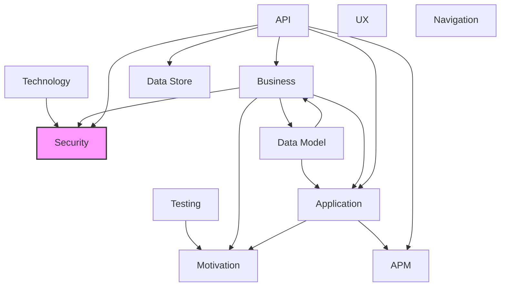

# Security Layer

## Report Index

- [Layer Introduction](#layer-introduction)
- [Intra-Layer Relationships](#intra-layer-relationships)
- [Inter-Layer Dependencies](#inter-layer-dependencies)
- [Inter-Layer Relationships Table](#inter-layer-relationships-table)
- [Node Reference](#node-reference)
  - [Accesscondition](#accesscondition)
  - [Accesscontrollevel](#accesscontrollevel)
  - [Accountabilityrequirement](#accountabilityrequirement)
  - [Actiontype](#actiontype)
  - [Actor](#actor)
  - [Actordependency](#actordependency)
  - [Actorobjective](#actorobjective)
  - [Actortype](#actortype)
  - [Auditconfig](#auditconfig)
  - [Auditlevel](#auditlevel)
  - [Authenticationconfig](#authenticationconfig)
  - [Authprovider](#authprovider)
  - [Bindingofduty](#bindingofduty)
  - [Classification](#classification)
  - [Classificationlevel](#classificationlevel)
  - [Condition](#condition)
  - [Conditionoperator](#conditionoperator)
  - [Countermeasure](#countermeasure)
  - [Criticality](#criticality)
  - [Dataclassification](#dataclassification)
  - [Datasource](#datasource)
  - [Delegation](#delegation)
  - [Delegationtype](#delegationtype)
  - [Deletionmethod](#deletionmethod)
  - [Destinationtype](#destinationtype)
  - [Effectiveness](#effectiveness)
  - [Encryptionrequirement](#encryptionrequirement)
  - [Evaluationtype](#evaluationtype)
  - [Evidence](#evidence)
  - [Evidencestrength](#evidencestrength)
  - [Evidencetype](#evidencetype)
  - [Fieldaccesscontrol](#fieldaccesscontrol)
  - [Impact](#impact)
  - [Informationentity](#informationentity)
  - [Informationright](#informationright)
  - [Likelihood](#likelihood)
  - [Maskingstrategy](#maskingstrategy)
  - [Needtoknow](#needtoknow)
  - [Passwordpolicy](#passwordpolicy)
  - [Permission](#permission)
  - [Permissionscope](#permissionscope)
  - [Policyaction](#policyaction)
  - [Policyeffect](#policyeffect)
  - [Policyrule](#policyrule)
  - [Policytarget](#policytarget)
  - [Ratelimit](#ratelimit)
  - [Ratelimitaction](#ratelimitaction)
  - [Ratelimitscope](#ratelimitscope)
  - [Requirementlevel](#requirementlevel)
  - [Resourceoperation](#resourceoperation)
  - [Resourcetype](#resourcetype)
  - [Retentionpolicy](#retentionpolicy)
  - [Role](#role)
  - [Secureresource](#secureresource)
  - [Securityconstraints](#securityconstraints)
  - [Securitymodel](#securitymodel)
  - [Securitypolicy](#securitypolicy)
  - [Separationofduty](#separationofduty)
  - [Socialdependency](#socialdependency)
  - [Storageclass](#storageclass)
  - [Threat](#threat)
  - [Trustlevel](#trustlevel)
  - [Validationrule](#validationrule)
  - [Validationruletype](#validationruletype)
  - [Validationseverity](#validationseverity)
  - [Verificationlevel](#verificationlevel)

## Layer Introduction

**Layer 3**: Security
**Standard**: [NIST SP 800-53](https://nvlpubs.nist.gov/nistpubs/SpecialPublications/NIST.SP.800-53r5.pdf)

Layer 3: Security Layer

### Statistics

| Metric                    | Count |
| ------------------------- | ----- |
| Node Types                | 66    |
| Intra-Layer Relationships | 0     |
| Inter-Layer Relationships | 13    |
| Inbound Relationships     | 13    |
| Outbound Relationships    | 0     |

### Layer Dependencies

**Depends On**: [Business](./02-business-layer-report.md), [Technology](./05-technology-layer-report.md), [API](./06-api-layer-report.md)

**Depended On By**: None

## Intra-Layer Relationships

### Hierarchical Organization

This layer contains 66 node types. To improve readability, they are organized hierarchically:

| Group | Count | Types |
|-------|-------|-------|
| **A** | 12 | `accesscondition`, `accesscontrollevel`, `accountabilityrequirement`, `actiontype`, `actor`, `actordependency`, `actorobjective`, `actortype`, `auditconfig`, `auditlevel`, `authenticationconfig`, `authprovider` |
| **B** | 1 | `bindingofduty` |
| **C** | 6 | `classification`, `classificationlevel`, `condition`, `conditionoperator`, `countermeasure`, `criticality` |
| **D** | 6 | `dataclassification`, `datasource`, `delegation`, `delegationtype`, `deletionmethod`, `destinationtype` |
| **E** | 6 | `effectiveness`, `encryptionrequirement`, `evaluationtype`, `evidence`, `evidencestrength`, `evidencetype` |
| **F** | 1 | `fieldaccesscontrol` |
| **I** | 3 | `impact`, `informationentity`, `informationright` |
| **L** | 1 | `likelihood` |
| **M** | 1 | `maskingstrategy` |
| **N** | 1 | `needtoknow` |
| **P** | 7 | `passwordpolicy`, `permission`, `permissionscope`, `policyaction`, `policyeffect`, `policyrule`, `policytarget` |
| **R** | 8 | `ratelimit`, `ratelimitaction`, `ratelimitscope`, `requirementlevel`, `resourceoperation`, `resourcetype`, `retentionpolicy`, `role` |
| **S** | 7 | `secureresource`, `securityconstraints`, `securitymodel`, `securitypolicy`, `separationofduty`, `socialdependency`, `storageclass` |
| **T** | 2 | `threat`, `trustlevel` |
| **V** | 4 | `validationrule`, `validationruletype`, `validationseverity`, `verificationlevel` |

No intra-layer relationships are defined for this layer.

## Inter-Layer Dependencies

## Inter-Layer Relationships Table

| Relationship ID                                                         | Source Node                                                      | Dest Node                                                                | Dest Layer                                | Predicate            | Cardinality  | Strength |
| ----------------------------------------------------------------------- | ---------------------------------------------------------------- | ------------------------------------------------------------------------ | ----------------------------------------- | -------------------- | ------------ | -------- |
| technology.artifact.classification.security.classification              | [artifact](./05-technology-layer-report.md#artifact)             | [classification](./03-security-layer-report.md#classification)           | [Security](./03-security-layer-report.md) | classification       | many-to-one  | low      |
| technology.artifact.referenced-by.security.classification               | [artifact](./05-technology-layer-report.md#artifact)             | [classification](./03-security-layer-report.md#classification)           | [Security](./03-security-layer-report.md) | referenced-by        | many-to-one  | medium   |
| business.businessprocess.referenced-by.security.separationofduty        | [businessprocess](./02-business-layer-report.md#businessprocess) | [separationofduty](./03-security-layer-report.md#separationofduty)       | [Security](./03-security-layer-report.md) | referenced-by        | many-to-one  | medium   |
| api.securityscheme.referenced-by.security.secureresource                | [securityscheme](./06-api-layer-report.md#securityscheme)        | [secureresource](./03-security-layer-report.md#secureresource)           | [Security](./03-security-layer-report.md) | referenced-by        | many-to-one  | medium   |
| api.securityscheme.referenced-by.security.permission                    | [securityscheme](./06-api-layer-report.md#securityscheme)        | [permission](./03-security-layer-report.md#permission)                   | [Security](./03-security-layer-report.md) | referenced-by        | many-to-many | medium   |
| api.operation.referenced-by.security.secureresource                     | [operation](./06-api-layer-report.md#operation)                  | [secureresource](./03-security-layer-report.md#secureresource)           | [Security](./03-security-layer-report.md) | referenced-by        | many-to-one  | medium   |
| api.operation.referenced-by.security.permission                         | [operation](./06-api-layer-report.md#operation)                  | [permission](./03-security-layer-report.md#permission)                   | [Security](./03-security-layer-report.md) | referenced-by        | many-to-many | medium   |
| api.securityscheme.required-permissions.security.permission             | [securityscheme](./06-api-layer-report.md#securityscheme)        | [permission](./03-security-layer-report.md#permission)                   | [Security](./03-security-layer-report.md) | required-permissions | many-to-many | critical |
| api.operation.required-permissions.security.permission                  | [operation](./06-api-layer-report.md#operation)                  | [permission](./03-security-layer-report.md#permission)                   | [Security](./03-security-layer-report.md) | required-permissions | many-to-many | critical |
| business.businessprocess.security-controls.security.securityconstraints | [businessprocess](./02-business-layer-report.md#businessprocess) | [securityconstraints](./03-security-layer-report.md#securityconstraints) | [Security](./03-security-layer-report.md) | security-controls    | many-to-many | high     |
| api.securityscheme.security-resource.security.secureresource            | [securityscheme](./06-api-layer-report.md#securityscheme)        | [secureresource](./03-security-layer-report.md#secureresource)           | [Security](./03-security-layer-report.md) | security-resource    | many-to-one  | critical |
| api.operation.security-resource.security.secureresource                 | [operation](./06-api-layer-report.md#operation)                  | [secureresource](./03-security-layer-report.md#secureresource)           | [Security](./03-security-layer-report.md) | security-resource    | many-to-one  | critical |
| business.businessprocess.separation-of-duty.security.separationofduty   | [businessprocess](./02-business-layer-report.md#businessprocess) | [separationofduty](./03-security-layer-report.md#separationofduty)       | [Security](./03-security-layer-report.md) | separation-of-duty   | many-to-one  | medium   |

## Node Reference

### Accesscondition {#accesscondition}

**Spec Node ID**: `security.accesscondition`

Conditional access rule

#### Relationship Metrics

- **Intra-Layer**: Inbound: 0 | Outbound: 0
- **Inter-Layer**: Inbound: 0 | Outbound: 0

[Back to Index](#report-index)

### Accesscontrollevel {#accesscontrollevel}

**Spec Node ID**: `security.accesscontrollevel`

AccessControlLevel element in Security Layer

#### Relationship Metrics

- **Intra-Layer**: Inbound: 0 | Outbound: 0
- **Inter-Layer**: Inbound: 0 | Outbound: 0

[Back to Index](#report-index)

### Accountabilityrequirement {#accountabilityrequirement}

**Spec Node ID**: `security.accountabilityrequirement`

Accountability and non-repudiation requirements

#### Relationship Metrics

- **Intra-Layer**: Inbound: 0 | Outbound: 0
- **Inter-Layer**: Inbound: 0 | Outbound: 0

[Back to Index](#report-index)

### Actiontype {#actiontype}

**Spec Node ID**: `security.actiontype`

ActionType element in Security Layer

#### Relationship Metrics

- **Intra-Layer**: Inbound: 0 | Outbound: 0
- **Inter-Layer**: Inbound: 0 | Outbound: 0

[Back to Index](#report-index)

### Actor {#actor}

**Spec Node ID**: `security.actor`

Actor in the system (beyond roles)

#### Relationship Metrics

- **Intra-Layer**: Inbound: 0 | Outbound: 0
- **Inter-Layer**: Inbound: 0 | Outbound: 0

[Back to Index](#report-index)

### Actordependency {#actordependency}

**Spec Node ID**: `security.actordependency`

Dependency between actors

#### Relationship Metrics

- **Intra-Layer**: Inbound: 0 | Outbound: 0
- **Inter-Layer**: Inbound: 0 | Outbound: 0

[Back to Index](#report-index)

### Actorobjective {#actorobjective}

**Spec Node ID**: `security.actorobjective`

Security-related objective or goal of an actor

#### Relationship Metrics

- **Intra-Layer**: Inbound: 0 | Outbound: 0
- **Inter-Layer**: Inbound: 0 | Outbound: 0

[Back to Index](#report-index)

### Actortype {#actortype}

**Spec Node ID**: `security.actortype`

ActorType element in Security Layer

#### Relationship Metrics

- **Intra-Layer**: Inbound: 0 | Outbound: 0
- **Inter-Layer**: Inbound: 0 | Outbound: 0

[Back to Index](#report-index)

### Auditconfig {#auditconfig}

**Spec Node ID**: `security.auditconfig`

Configuration for security audit logging, specifying what events to capture, retention periods, storage destinations, and compliance requirements. Enables security monitoring and forensic analysis.

#### Relationship Metrics

- **Intra-Layer**: Inbound: 0 | Outbound: 0
- **Inter-Layer**: Inbound: 0 | Outbound: 0

[Back to Index](#report-index)

### Auditlevel {#auditlevel}

**Spec Node ID**: `security.auditlevel`

AuditLevel element in Security Layer

#### Relationship Metrics

- **Intra-Layer**: Inbound: 0 | Outbound: 0
- **Inter-Layer**: Inbound: 0 | Outbound: 0

[Back to Index](#report-index)

### Authenticationconfig {#authenticationconfig}

**Spec Node ID**: `security.authenticationconfig`

Authentication configuration

#### Relationship Metrics

- **Intra-Layer**: Inbound: 0 | Outbound: 0
- **Inter-Layer**: Inbound: 0 | Outbound: 0

[Back to Index](#report-index)

### Authprovider {#authprovider}

**Spec Node ID**: `security.authprovider`

AuthProvider element in Security Layer

#### Relationship Metrics

- **Intra-Layer**: Inbound: 0 | Outbound: 0
- **Inter-Layer**: Inbound: 0 | Outbound: 0

[Back to Index](#report-index)

### Bindingofduty {#bindingofduty}

**Spec Node ID**: `security.bindingofduty`

Same actor must complete related tasks

#### Relationship Metrics

- **Intra-Layer**: Inbound: 0 | Outbound: 0
- **Inter-Layer**: Inbound: 0 | Outbound: 0

[Back to Index](#report-index)

### Classification {#classification}

**Spec Node ID**: `security.classification`

A single classification level defining data sensitivity and protection requirements

#### Relationship Metrics

- **Intra-Layer**: Inbound: 0 | Outbound: 0
- **Inter-Layer**: Inbound: 2 | Outbound: 0

#### Inter-Layer Relationships

| Related Node                                         | Layer                                         | Predicate      | Direction | Cardinality |
| ---------------------------------------------------- | --------------------------------------------- | -------------- | --------- | ----------- |
| [artifact](./05-technology-layer-report.md#artifact) | [Technology](./05-technology-layer-report.md) | referenced-by  | inbound   | many-to-one |
| [artifact](./05-technology-layer-report.md#artifact) | [Technology](./05-technology-layer-report.md) | classification | inbound   | many-to-one |

[Back to Index](#report-index)

### Classificationlevel {#classificationlevel}

**Spec Node ID**: `security.classificationlevel`

ClassificationLevel element in Security Layer

#### Relationship Metrics

- **Intra-Layer**: Inbound: 0 | Outbound: 0
- **Inter-Layer**: Inbound: 0 | Outbound: 0

[Back to Index](#report-index)

### Condition {#condition}

**Spec Node ID**: `security.condition`

A logical expression or predicate that determines when a SecurityPolicy rule applies. Supports attribute-based access control by evaluating context such as time, location, user attributes, or resource state.

#### Relationship Metrics

- **Intra-Layer**: Inbound: 0 | Outbound: 0
- **Inter-Layer**: Inbound: 0 | Outbound: 0

[Back to Index](#report-index)

### Conditionoperator {#conditionoperator}

**Spec Node ID**: `security.conditionoperator`

ConditionOperator element in Security Layer

#### Relationship Metrics

- **Intra-Layer**: Inbound: 0 | Outbound: 0
- **Inter-Layer**: Inbound: 0 | Outbound: 0

[Back to Index](#report-index)

### Countermeasure {#countermeasure}

**Spec Node ID**: `security.countermeasure`

Security countermeasure for a threat

#### Relationship Metrics

- **Intra-Layer**: Inbound: 0 | Outbound: 0
- **Inter-Layer**: Inbound: 0 | Outbound: 0

[Back to Index](#report-index)

### Criticality {#criticality}

**Spec Node ID**: `security.criticality`

Criticality element in Security Layer

#### Relationship Metrics

- **Intra-Layer**: Inbound: 0 | Outbound: 0
- **Inter-Layer**: Inbound: 0 | Outbound: 0

[Back to Index](#report-index)

### Dataclassification {#dataclassification}

**Spec Node ID**: `security.dataclassification`

Data classification and protection policies

#### Relationship Metrics

- **Intra-Layer**: Inbound: 0 | Outbound: 0
- **Inter-Layer**: Inbound: 0 | Outbound: 0

[Back to Index](#report-index)

### Datasource {#datasource}

**Spec Node ID**: `security.datasource`

DataSource element in Security Layer

#### Relationship Metrics

- **Intra-Layer**: Inbound: 0 | Outbound: 0
- **Inter-Layer**: Inbound: 0 | Outbound: 0

[Back to Index](#report-index)

### Delegation {#delegation}

**Spec Node ID**: `security.delegation`

Explicit delegation of permissions or goals

#### Relationship Metrics

- **Intra-Layer**: Inbound: 0 | Outbound: 0
- **Inter-Layer**: Inbound: 0 | Outbound: 0

[Back to Index](#report-index)

### Delegationtype {#delegationtype}

**Spec Node ID**: `security.delegationtype`

DelegationType element in Security Layer

#### Relationship Metrics

- **Intra-Layer**: Inbound: 0 | Outbound: 0
- **Inter-Layer**: Inbound: 0 | Outbound: 0

[Back to Index](#report-index)

### Deletionmethod {#deletionmethod}

**Spec Node ID**: `security.deletionmethod`

DeletionMethod element in Security Layer

#### Relationship Metrics

- **Intra-Layer**: Inbound: 0 | Outbound: 0
- **Inter-Layer**: Inbound: 0 | Outbound: 0

[Back to Index](#report-index)

### Destinationtype {#destinationtype}

**Spec Node ID**: `security.destinationtype`

DestinationType element in Security Layer

#### Relationship Metrics

- **Intra-Layer**: Inbound: 0 | Outbound: 0
- **Inter-Layer**: Inbound: 0 | Outbound: 0

[Back to Index](#report-index)

### Effectiveness {#effectiveness}

**Spec Node ID**: `security.effectiveness`

Effectiveness element in Security Layer

#### Relationship Metrics

- **Intra-Layer**: Inbound: 0 | Outbound: 0
- **Inter-Layer**: Inbound: 0 | Outbound: 0

[Back to Index](#report-index)

### Encryptionrequirement {#encryptionrequirement}

**Spec Node ID**: `security.encryptionrequirement`

EncryptionRequirement element in Security Layer

#### Relationship Metrics

- **Intra-Layer**: Inbound: 0 | Outbound: 0
- **Inter-Layer**: Inbound: 0 | Outbound: 0

[Back to Index](#report-index)

### Evaluationtype {#evaluationtype}

**Spec Node ID**: `security.evaluationtype`

EvaluationType element in Security Layer

#### Relationship Metrics

- **Intra-Layer**: Inbound: 0 | Outbound: 0
- **Inter-Layer**: Inbound: 0 | Outbound: 0

[Back to Index](#report-index)

### Evidence {#evidence}

**Spec Node ID**: `security.evidence`

Evidence required for accountability

#### Relationship Metrics

- **Intra-Layer**: Inbound: 0 | Outbound: 0
- **Inter-Layer**: Inbound: 0 | Outbound: 0

[Back to Index](#report-index)

### Evidencestrength {#evidencestrength}

**Spec Node ID**: `security.evidencestrength`

EvidenceStrength element in Security Layer

#### Relationship Metrics

- **Intra-Layer**: Inbound: 0 | Outbound: 0
- **Inter-Layer**: Inbound: 0 | Outbound: 0

[Back to Index](#report-index)

### Evidencetype {#evidencetype}

**Spec Node ID**: `security.evidencetype`

EvidenceType element in Security Layer

#### Relationship Metrics

- **Intra-Layer**: Inbound: 0 | Outbound: 0
- **Inter-Layer**: Inbound: 0 | Outbound: 0

[Back to Index](#report-index)

### Fieldaccesscontrol {#fieldaccesscontrol}

**Spec Node ID**: `security.fieldaccesscontrol`

Field-level access control

#### Relationship Metrics

- **Intra-Layer**: Inbound: 0 | Outbound: 0
- **Inter-Layer**: Inbound: 0 | Outbound: 0

[Back to Index](#report-index)

### Impact {#impact}

**Spec Node ID**: `security.impact`

Impact element in Security Layer

#### Relationship Metrics

- **Intra-Layer**: Inbound: 0 | Outbound: 0
- **Inter-Layer**: Inbound: 0 | Outbound: 0

[Back to Index](#report-index)

### Informationentity {#informationentity}

**Spec Node ID**: `security.informationentity`

Information asset with fine-grained rights

#### Relationship Metrics

- **Intra-Layer**: Inbound: 0 | Outbound: 0
- **Inter-Layer**: Inbound: 0 | Outbound: 0

[Back to Index](#report-index)

### Informationright {#informationright}

**Spec Node ID**: `security.informationright`

Fine-grained information access rights

#### Relationship Metrics

- **Intra-Layer**: Inbound: 0 | Outbound: 0
- **Inter-Layer**: Inbound: 0 | Outbound: 0

[Back to Index](#report-index)

### Likelihood {#likelihood}

**Spec Node ID**: `security.likelihood`

Likelihood element in Security Layer

#### Relationship Metrics

- **Intra-Layer**: Inbound: 0 | Outbound: 0
- **Inter-Layer**: Inbound: 0 | Outbound: 0

[Back to Index](#report-index)

### Maskingstrategy {#maskingstrategy}

**Spec Node ID**: `security.maskingstrategy`

MaskingStrategy element in Security Layer

#### Relationship Metrics

- **Intra-Layer**: Inbound: 0 | Outbound: 0
- **Inter-Layer**: Inbound: 0 | Outbound: 0

[Back to Index](#report-index)

### Needtoknow {#needtoknow}

**Spec Node ID**: `security.needtoknow`

Information access based on objective/purpose requirements

#### Relationship Metrics

- **Intra-Layer**: Inbound: 0 | Outbound: 0
- **Inter-Layer**: Inbound: 0 | Outbound: 0

[Back to Index](#report-index)

### Passwordpolicy {#passwordpolicy}

**Spec Node ID**: `security.passwordpolicy`

Password requirements

#### Relationship Metrics

- **Intra-Layer**: Inbound: 0 | Outbound: 0
- **Inter-Layer**: Inbound: 0 | Outbound: 0

[Back to Index](#report-index)

### Permission {#permission}

**Spec Node ID**: `security.permission`

Permission definition

#### Relationship Metrics

- **Intra-Layer**: Inbound: 0 | Outbound: 0
- **Inter-Layer**: Inbound: 4 | Outbound: 0

#### Inter-Layer Relationships

| Related Node                                              | Layer                           | Predicate            | Direction | Cardinality  |
| --------------------------------------------------------- | ------------------------------- | -------------------- | --------- | ------------ |
| [securityscheme](./06-api-layer-report.md#securityscheme) | [API](./06-api-layer-report.md) | required-permissions | inbound   | many-to-many |
| [securityscheme](./06-api-layer-report.md#securityscheme) | [API](./06-api-layer-report.md) | referenced-by        | inbound   | many-to-many |
| [operation](./06-api-layer-report.md#operation)           | [API](./06-api-layer-report.md) | required-permissions | inbound   | many-to-many |
| [operation](./06-api-layer-report.md#operation)           | [API](./06-api-layer-report.md) | referenced-by        | inbound   | many-to-many |

[Back to Index](#report-index)

### Permissionscope {#permissionscope}

**Spec Node ID**: `security.permissionscope`

PermissionScope element in Security Layer

#### Relationship Metrics

- **Intra-Layer**: Inbound: 0 | Outbound: 0
- **Inter-Layer**: Inbound: 0 | Outbound: 0

[Back to Index](#report-index)

### Policyaction {#policyaction}

**Spec Node ID**: `security.policyaction`

Action to take when policy rule matches

#### Relationship Metrics

- **Intra-Layer**: Inbound: 0 | Outbound: 0
- **Inter-Layer**: Inbound: 0 | Outbound: 0

[Back to Index](#report-index)

### Policyeffect {#policyeffect}

**Spec Node ID**: `security.policyeffect`

PolicyEffect element in Security Layer

#### Relationship Metrics

- **Intra-Layer**: Inbound: 0 | Outbound: 0
- **Inter-Layer**: Inbound: 0 | Outbound: 0

[Back to Index](#report-index)

### Policyrule {#policyrule}

**Spec Node ID**: `security.policyrule`

Individual policy rule

#### Relationship Metrics

- **Intra-Layer**: Inbound: 0 | Outbound: 0
- **Inter-Layer**: Inbound: 0 | Outbound: 0

[Back to Index](#report-index)

### Policytarget {#policytarget}

**Spec Node ID**: `security.policytarget`

PolicyTarget element in Security Layer

#### Relationship Metrics

- **Intra-Layer**: Inbound: 0 | Outbound: 0
- **Inter-Layer**: Inbound: 0 | Outbound: 0

[Back to Index](#report-index)

### Ratelimit {#ratelimit}

**Spec Node ID**: `security.ratelimit`

Defines throttling constraints for API or service access, specifying maximum request counts, time windows, and actions to take when limits are exceeded. Protects resources from abuse and ensures fair usage across consumers.

#### Relationship Metrics

- **Intra-Layer**: Inbound: 0 | Outbound: 0
- **Inter-Layer**: Inbound: 0 | Outbound: 0

[Back to Index](#report-index)

### Ratelimitaction {#ratelimitaction}

**Spec Node ID**: `security.ratelimitaction`

RateLimitAction element in Security Layer

#### Relationship Metrics

- **Intra-Layer**: Inbound: 0 | Outbound: 0
- **Inter-Layer**: Inbound: 0 | Outbound: 0

[Back to Index](#report-index)

### Ratelimitscope {#ratelimitscope}

**Spec Node ID**: `security.ratelimitscope`

RateLimitScope element in Security Layer

#### Relationship Metrics

- **Intra-Layer**: Inbound: 0 | Outbound: 0
- **Inter-Layer**: Inbound: 0 | Outbound: 0

[Back to Index](#report-index)

### Requirementlevel {#requirementlevel}

**Spec Node ID**: `security.requirementlevel`

RequirementLevel element in Security Layer

#### Relationship Metrics

- **Intra-Layer**: Inbound: 0 | Outbound: 0
- **Inter-Layer**: Inbound: 0 | Outbound: 0

[Back to Index](#report-index)

### Resourceoperation {#resourceoperation}

**Spec Node ID**: `security.resourceoperation`

Operation on a resource

#### Relationship Metrics

- **Intra-Layer**: Inbound: 0 | Outbound: 0
- **Inter-Layer**: Inbound: 0 | Outbound: 0

[Back to Index](#report-index)

### Resourcetype {#resourcetype}

**Spec Node ID**: `security.resourcetype`

ResourceType element in Security Layer

#### Relationship Metrics

- **Intra-Layer**: Inbound: 0 | Outbound: 0
- **Inter-Layer**: Inbound: 0 | Outbound: 0

[Back to Index](#report-index)

### Retentionpolicy {#retentionpolicy}

**Spec Node ID**: `security.retentionpolicy`

Defines how long security-related data (audit logs, access records, encryption keys) must be retained, archival strategies, and secure deletion procedures. Ensures compliance with regulatory requirements.

#### Relationship Metrics

- **Intra-Layer**: Inbound: 0 | Outbound: 0
- **Inter-Layer**: Inbound: 0 | Outbound: 0

[Back to Index](#report-index)

### Role {#role}

**Spec Node ID**: `security.role`

User role definition

#### Relationship Metrics

- **Intra-Layer**: Inbound: 0 | Outbound: 0
- **Inter-Layer**: Inbound: 0 | Outbound: 0

[Back to Index](#report-index)

### Secureresource {#secureresource}

**Spec Node ID**: `security.secureresource`

Protected resource definition

#### Relationship Metrics

- **Intra-Layer**: Inbound: 0 | Outbound: 0
- **Inter-Layer**: Inbound: 4 | Outbound: 0

#### Inter-Layer Relationships

| Related Node                                              | Layer                           | Predicate         | Direction | Cardinality |
| --------------------------------------------------------- | ------------------------------- | ----------------- | --------- | ----------- |
| [securityscheme](./06-api-layer-report.md#securityscheme) | [API](./06-api-layer-report.md) | security-resource | inbound   | many-to-one |
| [securityscheme](./06-api-layer-report.md#securityscheme) | [API](./06-api-layer-report.md) | referenced-by     | inbound   | many-to-one |
| [operation](./06-api-layer-report.md#operation)           | [API](./06-api-layer-report.md) | security-resource | inbound   | many-to-one |
| [operation](./06-api-layer-report.md#operation)           | [API](./06-api-layer-report.md) | referenced-by     | inbound   | many-to-one |

[Back to Index](#report-index)

### Securityconstraints {#securityconstraints}

**Spec Node ID**: `security.securityconstraints`

Security patterns and constraints

#### Relationship Metrics

- **Intra-Layer**: Inbound: 0 | Outbound: 0
- **Inter-Layer**: Inbound: 1 | Outbound: 0

#### Inter-Layer Relationships

| Related Node                                                     | Layer                                     | Predicate         | Direction | Cardinality  |
| ---------------------------------------------------------------- | ----------------------------------------- | ----------------- | --------- | ------------ |
| [businessprocess](./02-business-layer-report.md#businessprocess) | [Business](./02-business-layer-report.md) | security-controls | inbound   | many-to-many |

[Back to Index](#report-index)

### Securitymodel {#securitymodel}

**Spec Node ID**: `security.securitymodel`

Complete security model for application

#### Relationship Metrics

- **Intra-Layer**: Inbound: 0 | Outbound: 0
- **Inter-Layer**: Inbound: 0 | Outbound: 0

[Back to Index](#report-index)

### Securitypolicy {#securitypolicy}

**Spec Node ID**: `security.securitypolicy`

Declarative security policy

#### Relationship Metrics

- **Intra-Layer**: Inbound: 0 | Outbound: 0
- **Inter-Layer**: Inbound: 0 | Outbound: 0

[Back to Index](#report-index)

### Separationofduty {#separationofduty}

**Spec Node ID**: `security.separationofduty`

Different actors must perform related tasks

#### Relationship Metrics

- **Intra-Layer**: Inbound: 0 | Outbound: 0
- **Inter-Layer**: Inbound: 2 | Outbound: 0

#### Inter-Layer Relationships

| Related Node                                                     | Layer                                     | Predicate          | Direction | Cardinality |
| ---------------------------------------------------------------- | ----------------------------------------- | ------------------ | --------- | ----------- |
| [businessprocess](./02-business-layer-report.md#businessprocess) | [Business](./02-business-layer-report.md) | separation-of-duty | inbound   | many-to-one |
| [businessprocess](./02-business-layer-report.md#businessprocess) | [Business](./02-business-layer-report.md) | referenced-by      | inbound   | many-to-one |

[Back to Index](#report-index)

### Socialdependency {#socialdependency}

**Spec Node ID**: `security.socialdependency`

Dependencies and trust between actors

#### Relationship Metrics

- **Intra-Layer**: Inbound: 0 | Outbound: 0
- **Inter-Layer**: Inbound: 0 | Outbound: 0

[Back to Index](#report-index)

### Storageclass {#storageclass}

**Spec Node ID**: `security.storageclass`

StorageClass element in Security Layer

#### Relationship Metrics

- **Intra-Layer**: Inbound: 0 | Outbound: 0
- **Inter-Layer**: Inbound: 0 | Outbound: 0

[Back to Index](#report-index)

### Threat {#threat}

**Spec Node ID**: `security.threat`

Security threat and countermeasures

#### Relationship Metrics

- **Intra-Layer**: Inbound: 0 | Outbound: 0
- **Inter-Layer**: Inbound: 0 | Outbound: 0

[Back to Index](#report-index)

### Trustlevel {#trustlevel}

**Spec Node ID**: `security.trustlevel`

TrustLevel element in Security Layer

#### Relationship Metrics

- **Intra-Layer**: Inbound: 0 | Outbound: 0
- **Inter-Layer**: Inbound: 0 | Outbound: 0

[Back to Index](#report-index)

### Validationrule {#validationrule}

**Spec Node ID**: `security.validationrule`

Specifies data validation constraints for FieldAccessControl, defining allowed patterns, value ranges, or transformations applied when accessing protected fields. Prevents data corruption and enforces field-level integrity.

#### Relationship Metrics

- **Intra-Layer**: Inbound: 0 | Outbound: 0
- **Inter-Layer**: Inbound: 0 | Outbound: 0

[Back to Index](#report-index)

### Validationruletype {#validationruletype}

**Spec Node ID**: `security.validationruletype`

ValidationRuleType element in Security Layer

#### Relationship Metrics

- **Intra-Layer**: Inbound: 0 | Outbound: 0
- **Inter-Layer**: Inbound: 0 | Outbound: 0

[Back to Index](#report-index)

### Validationseverity {#validationseverity}

**Spec Node ID**: `security.validationseverity`

ValidationSeverity element in Security Layer

#### Relationship Metrics

- **Intra-Layer**: Inbound: 0 | Outbound: 0
- **Inter-Layer**: Inbound: 0 | Outbound: 0

[Back to Index](#report-index)

### Verificationlevel {#verificationlevel}

**Spec Node ID**: `security.verificationlevel`

VerificationLevel element in Security Layer

#### Relationship Metrics

- **Intra-Layer**: Inbound: 0 | Outbound: 0
- **Inter-Layer**: Inbound: 0 | Outbound: 0

[Back to Index](#report-index)

---

_Generated: 2026-02-13T11:58:05.059Z | Spec Version: 0.8.0 | Commit: c1cfcc4 | Generator: generate-layer-reports.ts_
