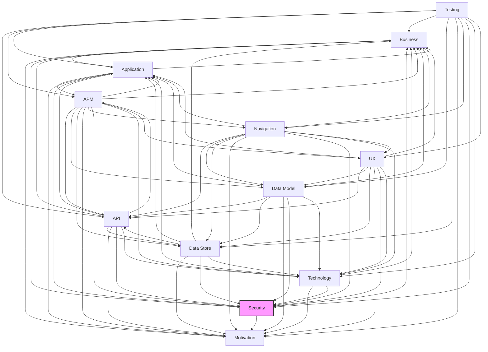

# Security Layer

## Report Index

- [Layer Introduction](#layer-introduction)
- [Intra-Layer Relationships](#intra-layer-relationships)
- [Inter-Layer Dependencies](#inter-layer-dependencies)
- [Inter-Layer Relationships Table](#inter-layer-relationships-table)
- [Node Reference](#node-reference)
  - [Accesscondition](#accesscondition)
  - [Accountabilityrequirement](#accountabilityrequirement)
  - [Actor](#actor)
  - [Auditconfig](#auditconfig)
  - [Authenticationconfig](#authenticationconfig)
  - [Bindingofduty](#bindingofduty)
  - [Condition](#condition)
  - [Countermeasure](#countermeasure)
  - [Dataclassification](#dataclassification)
  - [Delegation](#delegation)
  - [Evidence](#evidence)
  - [Fieldaccesscontrol](#fieldaccesscontrol)
  - [Informationentity](#informationentity)
  - [Informationright](#informationright)
  - [Needtoknow](#needtoknow)
  - [Passwordpolicy](#passwordpolicy)
  - [Permission](#permission)
  - [Policyaction](#policyaction)
  - [Policyrule](#policyrule)
  - [Resourceoperation](#resourceoperation)
  - [Retentionpolicy](#retentionpolicy)
  - [Role](#role)
  - [Secureresource](#secureresource)
  - [Securityconstraints](#securityconstraints)
  - [Securitymodel](#securitymodel)
  - [Securitypolicy](#securitypolicy)
  - [Separationofduty](#separationofduty)
  - [Threat](#threat)
  - [Validationrule](#validationrule)

## Layer Introduction

**Layer 3**: Security
**Standard**: [NIST SP 800-53](https://nvlpubs.nist.gov/nistpubs/SpecialPublications/NIST.SP.800-53r5.pdf)

Layer 3: Security Layer

### Statistics

| Metric                    | Count |
| ------------------------- | ----- |
| Node Types                | 29    |
| Intra-Layer Relationships | 167   |
| Inter-Layer Relationships | 93    |
| Inbound Relationships     | 77    |
| Outbound Relationships    | 16    |

### Layer Dependencies

**Depends On**: [Business](./02-business-layer-report.md), [Application](./04-application-layer-report.md), [Technology](./05-technology-layer-report.md), [API](./06-api-layer-report.md), [Data Model](./07-data-model-layer-report.md), [Data Store](./08-data-store-layer-report.md), [UX](./09-ux-layer-report.md), [Navigation](./10-navigation-layer-report.md), [APM](./11-apm-layer-report.md), [Testing](./12-testing-layer-report.md)

**Depended On By**: [Motivation](./01-motivation-layer-report.md), [Business](./02-business-layer-report.md)

## Intra-Layer Relationships

```mermaid
flowchart LR
  subgraph security
    accesscondition["accesscondition"]
    accountabilityrequirement["accountabilityrequirement"]
    actor["actor"]
    auditconfig["auditconfig"]
    authenticationconfig["authenticationconfig"]
    bindingofduty["bindingofduty"]
    condition["condition"]
    countermeasure["countermeasure"]
    dataclassification["dataclassification"]
    delegation["delegation"]
    evidence["evidence"]
    fieldaccesscontrol["fieldaccesscontrol"]
    informationentity["informationentity"]
    informationright["informationright"]
    needtoknow["needtoknow"]
    passwordpolicy["passwordpolicy"]
    permission["permission"]
    policyaction["policyaction"]
    policyrule["policyrule"]
    resourceoperation["resourceoperation"]
    retentionpolicy["retentionpolicy"]
    role["role"]
    secureresource["secureresource"]
    securityconstraints["securityconstraints"]
    securitymodel["securitymodel"]
    securitypolicy["securitypolicy"]
    separationofduty["separationofduty"]
    threat["threat"]
    validationrule["validationrule"]
    accesscondition -->|composes| policyrule
    accesscondition -->|constrains| permission
    accesscondition -->|governs| fieldaccesscontrol
    accesscondition -->|references| secureresource
    accesscondition -->|uses| validationrule
    accountabilityrequirement -->|constrains| actor
    accountabilityrequirement -->|requires| auditconfig
    accountabilityrequirement -->|requires| evidence
    accountabilityrequirement -->|requires| retentionpolicy
    actor -->|accesses| secureresource
    actor -->|assigned-to| role
    actor -->|associated-with| delegation
    actor -->|associated-with| threat
    actor -->|constrained-by| securityconstraints
    actor -->|governed-by| authenticationconfig
    actor -->|references| delegation
    actor -->|requires| authenticationconfig
    auditconfig -->|depends-on| retentionpolicy
    auditconfig -->|fulfills| accountabilityrequirement
    auditconfig -->|governs| retentionpolicy
    auditconfig -->|governs| secureresource
    auditconfig -->|mitigates| threat
    auditconfig -->|monitors| secureresource
    auditconfig -->|triggers| evidence
    authenticationconfig -->|authenticates| actor
    authenticationconfig -->|constrained-by| securitypolicy
    authenticationconfig -->|depends-on| auditconfig
    authenticationconfig -->|protects| secureresource
    authenticationconfig -->|references| passwordpolicy
    authenticationconfig -->|uses| passwordpolicy
    bindingofduty -->|associated-with| separationofduty
    bindingofduty -->|constrains| role
    bindingofduty -->|governs| resourceoperation
    bindingofduty -->|requires| evidence
    bindingofduty -->|supports| accountabilityrequirement
    condition -->|composes| accesscondition
    condition -->|constrains| policyrule
    condition -->|constrains| securitypolicy
    condition -->|triggers| policyaction
    countermeasure -->|fulfills| securityconstraints
    countermeasure -->|implements| securitypolicy
    countermeasure -->|mitigates| threat
    countermeasure -->|monitors| secureresource
    countermeasure -->|protects| secureresource
    countermeasure -->|requires| evidence
    dataclassification -->|governs| fieldaccesscontrol
    dataclassification -->|governs| informationentity
    dataclassification -->|governs| retentionpolicy
    dataclassification -->|governs| secureresource
    dataclassification -->|requires| countermeasure
    dataclassification -->|supports| securitypolicy
    delegation -->|authorizes| role
    delegation -->|constrained-by| securitypolicy
    delegation -->|requires| actor
    delegation -->|triggers| evidence
    evidence -->|mitigates| threat
    evidence -->|realizes| auditconfig
    evidence -->|supports| accountabilityrequirement
    evidence -->|validates| policyrule
    fieldaccesscontrol -->|constrained-by| accesscondition
    fieldaccesscontrol -->|constrained-by| dataclassification
    fieldaccesscontrol -->|governs| secureresource
    fieldaccesscontrol -->|implements| policyrule
    fieldaccesscontrol -->|protects| secureresource
    fieldaccesscontrol -->|requires| permission
    informationentity -->|constrained-by| dataclassification
    informationentity -->|constrained-by| retentionpolicy
    informationentity -->|governs| informationright
    informationentity -->|requires| accountabilityrequirement
    informationright -->|accesses| informationentity
    informationright -->|assigned-to| actor
    informationright -->|constrained-by| accesscondition
    informationright -->|governs| informationentity
    informationright -->|implements| permission
    needtoknow -->|associated-with| role
    needtoknow -->|constrained-by| dataclassification
    needtoknow -->|constrains| permission
    needtoknow -->|implements| policyrule
    needtoknow -->|protects| informationentity
    passwordpolicy -->|constrains| authenticationconfig
    passwordpolicy -->|mandates| countermeasure
    passwordpolicy -->|mitigates| threat
    passwordpolicy -->|requires| auditconfig
    passwordpolicy -->|requires| countermeasure
    passwordpolicy -->|uses| validationrule
    permission -->|authorizes| resourceoperation
    policyaction -->|enforces-requirement| policyrule
    policyaction -->|governs| permission
    policyaction -->|mandates| countermeasure
    policyaction -->|mitigates| threat
    policyaction -->|requires| countermeasure
    policyaction -->|triggers| auditconfig
    policyrule -->|authorizes| permission
    policyrule -->|composes| securitypolicy
    policyrule -->|generates| evidence
    policyrule -->|governs| informationright
    policyrule -->|mandates| countermeasure
    policyrule -->|protects| secureresource
    policyrule -->|requires| countermeasure
    policyrule -->|triggers| policyaction
    policyrule -->|uses| accesscondition
    policyrule -->|uses| condition
    resourceoperation -->|accesses| secureresource
    resourceoperation -->|constrained-by| accesscondition
    resourceoperation -->|governs| secureresource
    resourceoperation -->|triggers| auditconfig
    retentionpolicy -->|constrains| informationentity
    retentionpolicy -->|governs| auditconfig
    retentionpolicy -->|governs| evidence
    retentionpolicy -->|mandates| countermeasure
    retentionpolicy -->|requires| countermeasure
    role -->|accesses| secureresource
    role -->|aggregates| permission
    role -->|authorizes| permission
    role -->|constrained-by| separationofduty
    role -->|provides| permission
    role -->|specializes| role
    secureresource -->|aggregates| fieldaccesscontrol
    secureresource -->|aggregates| resourceoperation
    securityconstraints -->|aggregates| bindingofduty
    securityconstraints -->|aggregates| needtoknow
    securityconstraints -->|aggregates| separationofduty
    securityconstraints -->|constrains| role
    securityconstraints -->|enforces| securitypolicy
    securityconstraints -->|governs| securitypolicy
    securitymodel -->|aggregates| actor
    securitymodel -->|aggregates| authenticationconfig
    securitymodel -->|aggregates| delegation
    securitymodel -->|aggregates| informationentity
    securitymodel -->|aggregates| permission
    securitymodel -->|aggregates| role
    securitymodel -->|aggregates| secureresource
    securitymodel -->|aggregates| threat
    securitymodel -->|composes| authenticationconfig
    securitymodel -->|composes| securityconstraints
    securitymodel -->|composes| securitypolicy
    securitymodel -->|constrains| accountabilityrequirement
    securitymodel -->|governs| dataclassification
    securitymodel -->|governs| securitypolicy
    securitymodel -->|manages| threat
    securitypolicy -->|aggregates| policyrule
    securitypolicy -->|constrains| permission
    securitypolicy -->|enforces-requirement| accesscondition
    securitypolicy -->|fulfills| accountabilityrequirement
    securitypolicy -->|governs| passwordpolicy
    securitypolicy -->|governs| secureresource
    securitypolicy -->|mandates| countermeasure
    securitypolicy -->|requires| countermeasure
    separationofduty -->|associated-with| bindingofduty
    separationofduty -->|constrains| role
    separationofduty -->|governs| policyrule
    separationofduty -->|mitigates| threat
    separationofduty -->|requires| accountabilityrequirement
    threat -->|accesses| secureresource
    threat -->|aggregates| countermeasure
    threat -->|constrains| accesscondition
    threat -->|influence| dataclassification
    threat -->|influence| securitypolicy
    threat -->|targets| informationentity
    threat -->|targets| secureresource
    threat -->|triggers| auditconfig
    validationrule -->|constrains| accesscondition
    validationrule -->|constrains| fieldaccesscontrol
    validationrule -->|enforces-requirement| fieldaccesscontrol
    validationrule -->|enforces-requirement| securityconstraints
    validationrule -->|realizes| policyrule
    validationrule -->|supports| securitypolicy
  end
```

## Inter-Layer Dependencies

```mermaid
flowchart TB
  classDef current fill:#f9f,stroke:#333,stroke-width:2px
  motivation["Motivation"]
  business["Business"]
  security["Security"]
  application["Application"]
  technology["Technology"]
  api["API"]
  data_model["Data Model"]
  data_store["Data Store"]
  ux["UX"]
  navigation["Navigation"]
  apm["APM"]
  testing["Testing"]
  api --> apm
  api --> application
  api --> business
  api --> data_store
  api --> motivation
  api --> security
  api --> technology
  apm --> api
  apm --> application
  apm --> business
  apm --> data_model
  apm --> data_store
  apm --> motivation
  apm --> navigation
  apm --> security
  apm --> technology
  apm --> ux
  application --> apm
  application --> business
  application --> motivation
  application --> security
  business --> application
  business --> motivation
  business --> security
  data_model --> api
  data_model --> application
  data_model --> business
  data_model --> data_store
  data_model --> motivation
  data_model --> security
  data_model --> technology
  data_store --> api
  data_store --> application
  data_store --> business
  data_store --> motivation
  data_store --> security
  data_store --> technology
  navigation --> api
  navigation --> application
  navigation --> business
  navigation --> data_model
  navigation --> data_store
  navigation --> motivation
  navigation --> security
  navigation --> technology
  navigation --> ux
  security --> business
  security --> motivation
  technology --> application
  technology --> business
  technology --> motivation
  technology --> security
  testing --> api
  testing --> apm
  testing --> application
  testing --> business
  testing --> data_model
  testing --> data_store
  testing --> motivation
  testing --> navigation
  testing --> security
  testing --> technology
  testing --> ux
  ux --> api
  ux --> application
  ux --> business
  ux --> data_model
  ux --> data_store
  ux --> motivation
  ux --> security
  ux --> technology
  class security current
```

## Inter-Layer Relationships Table

| Relationship ID                                                         | Source Node                                                                          | Dest Node                                                                            | Dest Layer                                    | Predicate      | Cardinality  | Strength |
| ----------------------------------------------------------------------- | ------------------------------------------------------------------------------------ | ------------------------------------------------------------------------------------ | --------------------------------------------- | -------------- | ------------ | -------- |
| api.operation.references.security.secureresource                        | [Operation](./06-api-layer-report.md#operation)                                      | [Secureresource](./03-security-layer-report.md#secureresource)                       | [Security](./03-security-layer-report.md)     | references     | many-to-many | medium   |
| api.operation.references.security.threat                                | [Operation](./06-api-layer-report.md#operation)                                      | [Threat](./03-security-layer-report.md#threat)                                       | [Security](./03-security-layer-report.md)     | references     | many-to-many | medium   |
| api.operation.requires.security.permission                              | [Operation](./06-api-layer-report.md#operation)                                      | [Permission](./03-security-layer-report.md#permission)                               | [Security](./03-security-layer-report.md)     | requires       | many-to-many | medium   |
| api.operation.requires.security.securitypolicy                          | [Operation](./06-api-layer-report.md#operation)                                      | [Securitypolicy](./03-security-layer-report.md#securitypolicy)                       | [Security](./03-security-layer-report.md)     | requires       | many-to-many | medium   |
| api.operation.satisfies.security.countermeasure                         | [Operation](./06-api-layer-report.md#operation)                                      | [Countermeasure](./03-security-layer-report.md#countermeasure)                       | [Security](./03-security-layer-report.md)     | satisfies      | many-to-many | medium   |
| api.pathitem.requires.security.securitypolicy                           | [Pathitem](./06-api-layer-report.md#pathitem)                                        | [Securitypolicy](./03-security-layer-report.md#securitypolicy)                       | [Security](./03-security-layer-report.md)     | requires       | many-to-many | medium   |
| api.ratelimit.implements.security.countermeasure                        | [Ratelimit](./06-api-layer-report.md#ratelimit)                                      | [Countermeasure](./03-security-layer-report.md#countermeasure)                       | [Security](./03-security-layer-report.md)     | implements     | many-to-many | medium   |
| api.securityscheme.implements.security.securitypolicy                   | [Securityscheme](./06-api-layer-report.md#securityscheme)                            | [Securitypolicy](./03-security-layer-report.md#securitypolicy)                       | [Security](./03-security-layer-report.md)     | implements     | many-to-many | medium   |
| api.securityscheme.maps-to.security.actor                               | [Securityscheme](./06-api-layer-report.md#securityscheme)                            | [Actor](./03-security-layer-report.md#actor)                                         | [Security](./03-security-layer-report.md)     | maps-to        | many-to-many | medium   |
| api.securityscheme.references.security.secureresource                   | [Securityscheme](./06-api-layer-report.md#securityscheme)                            | [Secureresource](./03-security-layer-report.md#secureresource)                       | [Security](./03-security-layer-report.md)     | references     | many-to-many | medium   |
| api.securityscheme.requires.security.permission                         | [Securityscheme](./06-api-layer-report.md#securityscheme)                            | [Permission](./03-security-layer-report.md#permission)                               | [Security](./03-security-layer-report.md)     | requires       | many-to-many | medium   |
| api.server.satisfies.security.securitypolicy                            | [Server](./06-api-layer-report.md#server)                                            | [Securitypolicy](./03-security-layer-report.md#securitypolicy)                       | [Security](./03-security-layer-report.md)     | satisfies      | many-to-many | medium   |
| apm.exporterconfig.satisfies.security.retentionpolicy                   | [Exporterconfig](./11-apm-layer-report.md#exporterconfig)                            | [Retentionpolicy](./03-security-layer-report.md#retentionpolicy)                     | [Security](./03-security-layer-report.md)     | satisfies      | many-to-many | medium   |
| apm.logconfiguration.satisfies.security.auditconfig                     | [Logconfiguration](./11-apm-layer-report.md#logconfiguration)                        | [Auditconfig](./03-security-layer-report.md#auditconfig)                             | [Security](./03-security-layer-report.md)     | satisfies      | many-to-many | medium   |
| apm.logprocessor.satisfies.security.securityconstraints                 | [Logprocessor](./11-apm-layer-report.md#logprocessor)                                | [Securityconstraints](./03-security-layer-report.md#securityconstraints)             | [Security](./03-security-layer-report.md)     | satisfies      | many-to-many | medium   |
| apm.logrecord.satisfies.security.accountabilityrequirement              | [Logrecord](./11-apm-layer-report.md#logrecord)                                      | [Accountabilityrequirement](./03-security-layer-report.md#accountabilityrequirement) | [Security](./03-security-layer-report.md)     | satisfies      | many-to-many | medium   |
| apm.metricinstrument.monitors.security.threat                           | [Metricinstrument](./11-apm-layer-report.md#metricinstrument)                        | [Threat](./03-security-layer-report.md#threat)                                       | [Security](./03-security-layer-report.md)     | monitors       | many-to-many | medium   |
| apm.resource.references.security.secureresource                         | [Resource](./11-apm-layer-report.md#resource)                                        | [Secureresource](./03-security-layer-report.md#secureresource)                       | [Security](./03-security-layer-report.md)     | references     | many-to-many | medium   |
| apm.span.monitors.security.secureresource                               | [Span](./11-apm-layer-report.md#span)                                                | [Secureresource](./03-security-layer-report.md#secureresource)                       | [Security](./03-security-layer-report.md)     | monitors       | many-to-many | medium   |
| apm.traceconfiguration.satisfies.security.securitypolicy                | [Traceconfiguration](./11-apm-layer-report.md#traceconfiguration)                    | [Securitypolicy](./03-security-layer-report.md#securitypolicy)                       | [Security](./03-security-layer-report.md)     | satisfies      | many-to-many | medium   |
| application.applicationcomponent.accesses.security.secureresource       | [Applicationcomponent](./04-application-layer-report.md#applicationcomponent)        | [Secureresource](./03-security-layer-report.md#secureresource)                       | [Security](./03-security-layer-report.md)     | accesses       | many-to-many | medium   |
| application.applicationcomponent.constrained-by.security.securitypolicy | [Applicationcomponent](./04-application-layer-report.md#applicationcomponent)        | [Securitypolicy](./03-security-layer-report.md#securitypolicy)                       | [Security](./03-security-layer-report.md)     | constrained-by | many-to-many | medium   |
| application.applicationcomponent.implements.security.countermeasure     | [Applicationcomponent](./04-application-layer-report.md#applicationcomponent)        | [Countermeasure](./03-security-layer-report.md#countermeasure)                       | [Security](./03-security-layer-report.md)     | implements     | many-to-many | medium   |
| application.applicationcomponent.mitigates.security.threat              | [Applicationcomponent](./04-application-layer-report.md#applicationcomponent)        | [Threat](./03-security-layer-report.md#threat)                                       | [Security](./03-security-layer-report.md)     | mitigates      | many-to-many | medium   |
| application.applicationfunction.accesses.security.secureresource        | [Applicationfunction](./04-application-layer-report.md#applicationfunction)          | [Secureresource](./03-security-layer-report.md#secureresource)                       | [Security](./03-security-layer-report.md)     | accesses       | many-to-many | medium   |
| application.applicationinterface.exposes.security.secureresource        | [Applicationinterface](./04-application-layer-report.md#applicationinterface)        | [Secureresource](./03-security-layer-report.md#secureresource)                       | [Security](./03-security-layer-report.md)     | exposes        | many-to-many | medium   |
| application.applicationservice.constrained-by.security.accesscondition  | [Applicationservice](./04-application-layer-report.md#applicationservice)            | [Accesscondition](./03-security-layer-report.md#accesscondition)                     | [Security](./03-security-layer-report.md)     | constrained-by | many-to-many | medium   |
| application.applicationservice.requires.security.authenticationconfig   | [Applicationservice](./04-application-layer-report.md#applicationservice)            | [Authenticationconfig](./03-security-layer-report.md#authenticationconfig)           | [Security](./03-security-layer-report.md)     | requires       | many-to-many | medium   |
| business.businessprocess.constrained-by.security.securityconstraints    | [Businessprocess](./02-business-layer-report.md#businessprocess)                     | [Securityconstraints](./03-security-layer-report.md#securityconstraints)             | [Security](./03-security-layer-report.md)     | constrained-by | many-to-many | medium   |
| business.businessprocess.constrained-by.security.separationofduty       | [Businessprocess](./02-business-layer-report.md#businessprocess)                     | [Separationofduty](./03-security-layer-report.md#separationofduty)                   | [Security](./03-security-layer-report.md)     | constrained-by | many-to-many | medium   |
| data-model.objectschema.references.security.secureresource              | [Objectschema](./07-data-model-layer-report.md#objectschema)                         | [Secureresource](./03-security-layer-report.md#secureresource)                       | [Security](./03-security-layer-report.md)     | references     | many-to-many | medium   |
| data-model.objectschema.satisfies.security.securityconstraints          | [Objectschema](./07-data-model-layer-report.md#objectschema)                         | [Securityconstraints](./03-security-layer-report.md#securityconstraints)             | [Security](./03-security-layer-report.md)     | satisfies      | many-to-many | medium   |
| data-model.schemadefinition.references.security.threat                  | [Schemadefinition](./07-data-model-layer-report.md#schemadefinition)                 | [Threat](./03-security-layer-report.md#threat)                                       | [Security](./03-security-layer-report.md)     | references     | many-to-many | medium   |
| data-model.schemadefinition.requires.security.retentionpolicy           | [Schemadefinition](./07-data-model-layer-report.md#schemadefinition)                 | [Retentionpolicy](./03-security-layer-report.md#retentionpolicy)                     | [Security](./03-security-layer-report.md)     | requires       | many-to-many | medium   |
| data-model.schemadefinition.satisfies.security.dataclassification       | [Schemadefinition](./07-data-model-layer-report.md#schemadefinition)                 | [Dataclassification](./03-security-layer-report.md#dataclassification)               | [Security](./03-security-layer-report.md)     | satisfies      | many-to-many | medium   |
| data-model.schemaproperty.satisfies.security.dataclassification         | [Schemaproperty](./07-data-model-layer-report.md#schemaproperty)                     | [Dataclassification](./03-security-layer-report.md#dataclassification)               | [Security](./03-security-layer-report.md)     | satisfies      | many-to-many | medium   |
| data-model.schemaproperty.satisfies.security.fieldaccesscontrol         | [Schemaproperty](./07-data-model-layer-report.md#schemaproperty)                     | [Fieldaccesscontrol](./03-security-layer-report.md#fieldaccesscontrol)               | [Security](./03-security-layer-report.md)     | satisfies      | many-to-many | medium   |
| data-model.schemaproperty.satisfies.security.validationrule             | [Schemaproperty](./07-data-model-layer-report.md#schemaproperty)                     | [Validationrule](./03-security-layer-report.md#validationrule)                       | [Security](./03-security-layer-report.md)     | satisfies      | many-to-many | medium   |
| data-store.accesspattern.satisfies.security.accesscondition             | [Accesspattern](./08-data-store-layer-report.md#accesspattern)                       | [Accesscondition](./03-security-layer-report.md#accesscondition)                     | [Security](./03-security-layer-report.md)     | satisfies      | many-to-many | medium   |
| data-store.collection.implements.security.secureresource                | [Collection](./08-data-store-layer-report.md#collection)                             | [Secureresource](./03-security-layer-report.md#secureresource)                       | [Security](./03-security-layer-report.md)     | implements     | many-to-many | medium   |
| data-store.collection.satisfies.security.dataclassification             | [Collection](./08-data-store-layer-report.md#collection)                             | [Dataclassification](./03-security-layer-report.md#dataclassification)               | [Security](./03-security-layer-report.md)     | satisfies      | many-to-many | medium   |
| data-store.database.satisfies.security.securitypolicy                   | [Database](./08-data-store-layer-report.md#database)                                 | [Securitypolicy](./03-security-layer-report.md#securitypolicy)                       | [Security](./03-security-layer-report.md)     | satisfies      | many-to-many | medium   |
| data-store.field.requires.security.fieldaccesscontrol                   | [Field](./08-data-store-layer-report.md#field)                                       | [Fieldaccesscontrol](./03-security-layer-report.md#fieldaccesscontrol)               | [Security](./03-security-layer-report.md)     | requires       | many-to-many | medium   |
| data-store.field.satisfies.security.dataclassification                  | [Field](./08-data-store-layer-report.md#field)                                       | [Dataclassification](./03-security-layer-report.md#dataclassification)               | [Security](./03-security-layer-report.md)     | satisfies      | many-to-many | medium   |
| data-store.retentionpolicy.satisfies.security.retentionpolicy           | [Retentionpolicy](./08-data-store-layer-report.md#retentionpolicy)                   | [Retentionpolicy](./03-security-layer-report.md#retentionpolicy)                     | [Security](./03-security-layer-report.md)     | satisfies      | many-to-many | medium   |
| data-store.storedlogic.satisfies.security.securitypolicy                | [Storedlogic](./08-data-store-layer-report.md#storedlogic)                           | [Securitypolicy](./03-security-layer-report.md#securitypolicy)                       | [Security](./03-security-layer-report.md)     | satisfies      | many-to-many | medium   |
| navigation.guardcondition.references.security.permission                | [Guardcondition](./10-navigation-layer-report.md#guardcondition)                     | [Permission](./03-security-layer-report.md#permission)                               | [Security](./03-security-layer-report.md)     | references     | many-to-many | medium   |
| navigation.navigationflow.satisfies.security.securityconstraints        | [Navigationflow](./10-navigation-layer-report.md#navigationflow)                     | [Securityconstraints](./03-security-layer-report.md#securityconstraints)             | [Security](./03-security-layer-report.md)     | satisfies      | many-to-many | medium   |
| navigation.navigationguard.implements.security.securitypolicy           | [Navigationguard](./10-navigation-layer-report.md#navigationguard)                   | [Securitypolicy](./03-security-layer-report.md#securitypolicy)                       | [Security](./03-security-layer-report.md)     | implements     | many-to-many | medium   |
| navigation.navigationguard.requires.security.role                       | [Navigationguard](./10-navigation-layer-report.md#navigationguard)                   | [Role](./03-security-layer-report.md#role)                                           | [Security](./03-security-layer-report.md)     | requires       | many-to-many | medium   |
| navigation.route.accesses.security.secureresource                       | [Route](./10-navigation-layer-report.md#route)                                       | [Secureresource](./03-security-layer-report.md#secureresource)                       | [Security](./03-security-layer-report.md)     | accesses       | many-to-many | medium   |
| navigation.route.requires.security.permission                           | [Route](./10-navigation-layer-report.md#route)                                       | [Permission](./03-security-layer-report.md#permission)                               | [Security](./03-security-layer-report.md)     | requires       | many-to-many | medium   |
| navigation.routemeta.references.security.securitypolicy                 | [Routemeta](./10-navigation-layer-report.md#routemeta)                               | [Securitypolicy](./03-security-layer-report.md#securitypolicy)                       | [Security](./03-security-layer-report.md)     | references     | many-to-many | medium   |
| security.accountabilityrequirement.satisfies.motivation.requirement     | [Accountabilityrequirement](./03-security-layer-report.md#accountabilityrequirement) | [Requirement](./01-motivation-layer-report.md#requirement)                           | [Motivation](./01-motivation-layer-report.md) | satisfies      | many-to-many | medium   |
| security.countermeasure.protects.business.businessprocess               | [Countermeasure](./03-security-layer-report.md#countermeasure)                       | [Businessprocess](./02-business-layer-report.md#businessprocess)                     | [Business](./02-business-layer-report.md)     | protects       | many-to-many | medium   |
| security.countermeasure.realizes.motivation.goal                        | [Countermeasure](./03-security-layer-report.md#countermeasure)                       | [Goal](./01-motivation-layer-report.md#goal)                                         | [Motivation](./01-motivation-layer-report.md) | realizes       | many-to-many | medium   |
| security.countermeasure.satisfies.motivation.requirement                | [Countermeasure](./03-security-layer-report.md#countermeasure)                       | [Requirement](./01-motivation-layer-report.md#requirement)                           | [Motivation](./01-motivation-layer-report.md) | satisfies      | many-to-many | medium   |
| security.role.maps-to.business.businessrole                             | [Role](./03-security-layer-report.md#role)                                           | [Businessrole](./02-business-layer-report.md#businessrole)                           | [Business](./02-business-layer-report.md)     | maps-to        | many-to-many | medium   |
| security.secureresource.references.business.businessobject              | [Secureresource](./03-security-layer-report.md#secureresource)                       | [Businessobject](./02-business-layer-report.md#businessobject)                       | [Business](./02-business-layer-report.md)     | references     | many-to-many | medium   |
| security.securityconstraints.implements.motivation.constraint           | [Securityconstraints](./03-security-layer-report.md#securityconstraints)             | [Constraint](./01-motivation-layer-report.md#constraint)                             | [Motivation](./01-motivation-layer-report.md) | implements     | many-to-many | medium   |
| security.securitypolicy.constrains.business.businessprocess             | [Securitypolicy](./03-security-layer-report.md#securitypolicy)                       | [Businessprocess](./02-business-layer-report.md#businessprocess)                     | [Business](./02-business-layer-report.md)     | constrains     | many-to-many | medium   |
| security.securitypolicy.governs.business.businessservice                | [Securitypolicy](./03-security-layer-report.md#securitypolicy)                       | [Businessservice](./02-business-layer-report.md#businessservice)                     | [Business](./02-business-layer-report.md)     | governs        | many-to-many | medium   |
| security.securitypolicy.realizes.motivation.principle                   | [Securitypolicy](./03-security-layer-report.md#securitypolicy)                       | [Principle](./01-motivation-layer-report.md#principle)                               | [Motivation](./01-motivation-layer-report.md) | realizes       | many-to-many | medium   |
| security.securitypolicy.satisfies.motivation.requirement                | [Securitypolicy](./03-security-layer-report.md#securitypolicy)                       | [Requirement](./01-motivation-layer-report.md#requirement)                           | [Motivation](./01-motivation-layer-report.md) | satisfies      | many-to-many | medium   |
| security.separationofduty.constrains.business.businessrole              | [Separationofduty](./03-security-layer-report.md#separationofduty)                   | [Businessrole](./02-business-layer-report.md#businessrole)                           | [Business](./02-business-layer-report.md)     | constrains     | many-to-many | medium   |
| security.threat.maps-to.motivation.requirement                          | [Threat](./03-security-layer-report.md#threat)                                       | [Requirement](./01-motivation-layer-report.md#requirement)                           | [Motivation](./01-motivation-layer-report.md) | maps-to        | many-to-many | medium   |
| security.threat.realizes.motivation.driver                              | [Threat](./03-security-layer-report.md#threat)                                       | [Driver](./01-motivation-layer-report.md#driver)                                     | [Motivation](./01-motivation-layer-report.md) | realizes       | many-to-many | medium   |
| security.threat.targets.business.businessprocess                        | [Threat](./03-security-layer-report.md#threat)                                       | [Businessprocess](./02-business-layer-report.md#businessprocess)                     | [Business](./02-business-layer-report.md)     | targets        | many-to-many | medium   |
| security.threat.targets.business.businessservice                        | [Threat](./03-security-layer-report.md#threat)                                       | [Businessservice](./02-business-layer-report.md#businessservice)                     | [Business](./02-business-layer-report.md)     | targets        | many-to-many | medium   |
| technology.device.satisfies.security.securitypolicy                     | [Device](./05-technology-layer-report.md#device)                                     | [Securitypolicy](./03-security-layer-report.md#securitypolicy)                       | [Security](./03-security-layer-report.md)     | satisfies      | many-to-many | medium   |
| technology.node.satisfies.security.securitypolicy                       | [Node](./05-technology-layer-report.md#node)                                         | [Securitypolicy](./03-security-layer-report.md#securitypolicy)                       | [Security](./03-security-layer-report.md)     | satisfies      | many-to-many | medium   |
| technology.systemsoftware.implements.security.countermeasure            | [Systemsoftware](./05-technology-layer-report.md#systemsoftware)                     | [Countermeasure](./03-security-layer-report.md#countermeasure)                       | [Security](./03-security-layer-report.md)     | implements     | many-to-many | medium   |
| technology.systemsoftware.mitigates.security.threat                     | [Systemsoftware](./05-technology-layer-report.md#systemsoftware)                     | [Threat](./03-security-layer-report.md#threat)                                       | [Security](./03-security-layer-report.md)     | mitigates      | many-to-many | medium   |
| technology.systemsoftware.realizes.security.securitypolicy              | [Systemsoftware](./05-technology-layer-report.md#systemsoftware)                     | [Securitypolicy](./03-security-layer-report.md#securitypolicy)                       | [Security](./03-security-layer-report.md)     | realizes       | many-to-many | medium   |
| technology.technologyfunction.implements.security.countermeasure        | [Technologyfunction](./05-technology-layer-report.md#technologyfunction)             | [Countermeasure](./03-security-layer-report.md#countermeasure)                       | [Security](./03-security-layer-report.md)     | implements     | many-to-many | medium   |
| technology.technologyservice.accesses.security.secureresource           | [Technologyservice](./05-technology-layer-report.md#technologyservice)               | [Secureresource](./03-security-layer-report.md#secureresource)                       | [Security](./03-security-layer-report.md)     | accesses       | many-to-many | medium   |
| technology.technologyservice.satisfies.security.securitypolicy          | [Technologyservice](./05-technology-layer-report.md#technologyservice)               | [Securitypolicy](./03-security-layer-report.md#securitypolicy)                       | [Security](./03-security-layer-report.md)     | satisfies      | many-to-many | medium   |
| testing.coveragerequirement.references.security.securitypolicy          | [Coveragerequirement](./12-testing-layer-report.md#coveragerequirement)              | [Securitypolicy](./03-security-layer-report.md#securitypolicy)                       | [Security](./03-security-layer-report.md)     | references     | many-to-many | medium   |
| testing.environmentfactor.references.security.securitypolicy            | [Environmentfactor](./12-testing-layer-report.md#environmentfactor)                  | [Securitypolicy](./03-security-layer-report.md#securitypolicy)                       | [Security](./03-security-layer-report.md)     | references     | many-to-many | medium   |
| testing.testcasesketch.tests.security.countermeasure                    | [Testcasesketch](./12-testing-layer-report.md#testcasesketch)                        | [Countermeasure](./03-security-layer-report.md#countermeasure)                       | [Security](./03-security-layer-report.md)     | tests          | many-to-many | medium   |
| testing.testcasesketch.tests.security.threat                            | [Testcasesketch](./12-testing-layer-report.md#testcasesketch)                        | [Threat](./03-security-layer-report.md#threat)                                       | [Security](./03-security-layer-report.md)     | tests          | many-to-many | medium   |
| testing.testcasesketch.validates.security.securitypolicy                | [Testcasesketch](./12-testing-layer-report.md#testcasesketch)                        | [Securitypolicy](./03-security-layer-report.md#securitypolicy)                       | [Security](./03-security-layer-report.md)     | validates      | many-to-many | medium   |
| testing.testcoveragemodel.covers.security.securitypolicy                | [Testcoveragemodel](./12-testing-layer-report.md#testcoveragemodel)                  | [Securitypolicy](./03-security-layer-report.md#securitypolicy)                       | [Security](./03-security-layer-report.md)     | covers         | many-to-many | medium   |
| testing.testcoveragemodel.references.security.threat                    | [Testcoveragemodel](./12-testing-layer-report.md#testcoveragemodel)                  | [Threat](./03-security-layer-report.md#threat)                                       | [Security](./03-security-layer-report.md)     | references     | many-to-many | medium   |
| testing.testcoveragetarget.references.security.secureresource           | [Testcoveragetarget](./12-testing-layer-report.md#testcoveragetarget)                | [Secureresource](./03-security-layer-report.md#secureresource)                       | [Security](./03-security-layer-report.md)     | references     | many-to-many | medium   |
| ux.actioncomponent.references.security.secureresource                   | [Actioncomponent](./09-ux-layer-report.md#actioncomponent)                           | [Secureresource](./03-security-layer-report.md#secureresource)                       | [Security](./03-security-layer-report.md)     | references     | many-to-many | medium   |
| ux.actioncomponent.requires.security.permission                         | [Actioncomponent](./09-ux-layer-report.md#actioncomponent)                           | [Permission](./03-security-layer-report.md#permission)                               | [Security](./03-security-layer-report.md)     | requires       | many-to-many | medium   |
| ux.subview.requires.security.permission                                 | [Subview](./09-ux-layer-report.md#subview)                                           | [Permission](./03-security-layer-report.md#permission)                               | [Security](./03-security-layer-report.md)     | requires       | many-to-many | medium   |
| ux.tablecolumn.references.security.fieldaccesscontrol                   | [Tablecolumn](./09-ux-layer-report.md#tablecolumn)                                   | [Fieldaccesscontrol](./03-security-layer-report.md#fieldaccesscontrol)               | [Security](./03-security-layer-report.md)     | references     | many-to-many | medium   |
| ux.view.references.security.secureresource                              | [View](./09-ux-layer-report.md#view)                                                 | [Secureresource](./03-security-layer-report.md#secureresource)                       | [Security](./03-security-layer-report.md)     | references     | many-to-many | medium   |
| ux.view.requires.security.permission                                    | [View](./09-ux-layer-report.md#view)                                                 | [Permission](./03-security-layer-report.md#permission)                               | [Security](./03-security-layer-report.md)     | requires       | many-to-many | medium   |
| ux.view.requires.security.role                                          | [View](./09-ux-layer-report.md#view)                                                 | [Role](./03-security-layer-report.md#role)                                           | [Security](./03-security-layer-report.md)     | requires       | many-to-many | medium   |
| ux.view.satisfies.security.securitypolicy                               | [View](./09-ux-layer-report.md#view)                                                 | [Securitypolicy](./03-security-layer-report.md#securitypolicy)                       | [Security](./03-security-layer-report.md)     | satisfies      | many-to-many | medium   |

## Node Reference

### Accesscondition {#accesscondition}

**Spec Node ID**: `security.accesscondition`

Defines a single boolean predicate evaluated against a request context attribute (field), comparing the runtime value using a specified operator. Composed inside a PolicyRule condition chain to form compound access control expressions.

#### Relationship Metrics

- **Intra-Layer**: Inbound: 8 | Outbound: 5
- **Inter-Layer**: Inbound: 2 | Outbound: 0

#### Intra-Layer Relationships

| Related Node                              | Predicate            | Direction | Cardinality  |
| ----------------------------------------- | -------------------- | --------- | ------------ |
| [Policyrule](#policyrule)                 | composes             | outbound  | many-to-many |
| [Permission](#permission)                 | constrains           | outbound  | many-to-many |
| [Fieldaccesscontrol](#fieldaccesscontrol) | governs              | outbound  | many-to-many |
| [Secureresource](#secureresource)         | references           | outbound  | many-to-many |
| [Validationrule](#validationrule)         | uses                 | outbound  | many-to-many |
| [Condition](#condition)                   | composes             | inbound   | many-to-many |
| [Fieldaccesscontrol](#fieldaccesscontrol) | constrained-by       | inbound   | many-to-many |
| [Informationright](#informationright)     | constrained-by       | inbound   | many-to-many |
| [Policyrule](#policyrule)                 | uses                 | inbound   | many-to-many |
| [Resourceoperation](#resourceoperation)   | constrained-by       | inbound   | many-to-many |
| [Securitypolicy](#securitypolicy)         | enforces-requirement | inbound   | many-to-many |
| [Threat](#threat)                         | constrains           | inbound   | many-to-many |
| [Validationrule](#validationrule)         | constrains           | inbound   | many-to-many |

#### Inter-Layer Relationships

| Related Node                                                              | Layer                                           | Predicate      | Direction | Cardinality  |
| ------------------------------------------------------------------------- | ----------------------------------------------- | -------------- | --------- | ------------ |
| [Applicationservice](./04-application-layer-report.md#applicationservice) | [Application](./04-application-layer-report.md) | constrained-by | inbound   | many-to-many |
| [Accesspattern](./08-data-store-layer-report.md#accesspattern)            | [Data Store](./08-data-store-layer-report.md)   | satisfies      | inbound   | many-to-many |

[Back to Index](#report-index)

### Accountabilityrequirement {#accountabilityrequirement}

**Spec Node ID**: `security.accountabilityrequirement`

Expresses who is obligated to provide evidence that a specific action occurred and under what conditions that evidence can be challenged. Distinct from AuditConfig, which defines what events are captured — this node defines the obligation to prove an action took place. Implements NIST SP 800-53 AU-10 non-repudiation.

#### Relationship Metrics

- **Intra-Layer**: Inbound: 7 | Outbound: 4
- **Inter-Layer**: Inbound: 1 | Outbound: 1

#### Intra-Layer Relationships

| Related Node                            | Predicate  | Direction | Cardinality  |
| --------------------------------------- | ---------- | --------- | ------------ |
| [Actor](#actor)                         | constrains | outbound  | many-to-many |
| [Auditconfig](#auditconfig)             | requires   | outbound  | many-to-many |
| [Evidence](#evidence)                   | requires   | outbound  | many-to-many |
| [Retentionpolicy](#retentionpolicy)     | requires   | outbound  | many-to-many |
| [Auditconfig](#auditconfig)             | fulfills   | inbound   | many-to-many |
| [Bindingofduty](#bindingofduty)         | supports   | inbound   | many-to-many |
| [Evidence](#evidence)                   | supports   | inbound   | many-to-many |
| [Informationentity](#informationentity) | requires   | inbound   | many-to-many |
| [Securitymodel](#securitymodel)         | constrains | inbound   | many-to-many |
| [Securitypolicy](#securitypolicy)       | fulfills   | inbound   | many-to-many |
| [Separationofduty](#separationofduty)   | requires   | inbound   | many-to-many |

#### Inter-Layer Relationships

| Related Node                                               | Layer                                         | Predicate | Direction | Cardinality  |
| ---------------------------------------------------------- | --------------------------------------------- | --------- | --------- | ------------ |
| [Logrecord](./11-apm-layer-report.md#logrecord)            | [APM](./11-apm-layer-report.md)               | satisfies | inbound   | many-to-many |
| [Requirement](./01-motivation-layer-report.md#requirement) | [Motivation](./01-motivation-layer-report.md) | satisfies | outbound  | many-to-many |

[Back to Index](#report-index)

### Actor {#actor}

**Spec Node ID**: `security.actor`

A named principal — human user, service account, automated system, or external entity — whose identity and trust level govern what operations it may perform. Associates with Roles for permission grouping and with SeparationOfDuty and Delegation controls, per NIST SP 800-53 AC-2 (Account Management) and SP 800-207 (Zero Trust Architecture).

#### Relationship Metrics

- **Intra-Layer**: Inbound: 5 | Outbound: 8
- **Inter-Layer**: Inbound: 1 | Outbound: 0

#### Intra-Layer Relationships

| Related Node                                            | Predicate       | Direction | Cardinality  |
| ------------------------------------------------------- | --------------- | --------- | ------------ |
| [Accountabilityrequirement](#accountabilityrequirement) | constrains      | inbound   | many-to-many |
| [Secureresource](#secureresource)                       | accesses        | outbound  | many-to-many |
| [Role](#role)                                           | assigned-to     | outbound  | many-to-many |
| [Delegation](#delegation)                               | associated-with | outbound  | many-to-many |
| [Threat](#threat)                                       | associated-with | outbound  | many-to-many |
| [Securityconstraints](#securityconstraints)             | constrained-by  | outbound  | many-to-many |
| [Authenticationconfig](#authenticationconfig)           | governed-by     | outbound  | many-to-many |
| [Delegation](#delegation)                               | references      | outbound  | many-to-many |
| [Authenticationconfig](#authenticationconfig)           | requires        | outbound  | many-to-many |
| [Authenticationconfig](#authenticationconfig)           | authenticates   | inbound   | many-to-many |
| [Delegation](#delegation)                               | requires        | inbound   | many-to-many |
| [Informationright](#informationright)                   | assigned-to     | inbound   | many-to-many |
| [Securitymodel](#securitymodel)                         | aggregates      | inbound   | many-to-many |

#### Inter-Layer Relationships

| Related Node                                              | Layer                           | Predicate | Direction | Cardinality  |
| --------------------------------------------------------- | ------------------------------- | --------- | --------- | ------------ |
| [Securityscheme](./06-api-layer-report.md#securityscheme) | [API](./06-api-layer-report.md) | maps-to   | inbound   | many-to-many |

[Back to Index](#report-index)

### Auditconfig {#auditconfig}

**Spec Node ID**: `security.auditconfig`

Configuration for security audit logging, specifying what events to capture, retention periods, storage destinations, and compliance requirements. Enables security monitoring and forensic analysis.

#### Relationship Metrics

- **Intra-Layer**: Inbound: 8 | Outbound: 7
- **Inter-Layer**: Inbound: 1 | Outbound: 0

#### Intra-Layer Relationships

| Related Node                                            | Predicate  | Direction | Cardinality  |
| ------------------------------------------------------- | ---------- | --------- | ------------ |
| [Accountabilityrequirement](#accountabilityrequirement) | requires   | inbound   | many-to-many |
| [Retentionpolicy](#retentionpolicy)                     | depends-on | outbound  | many-to-many |
| [Accountabilityrequirement](#accountabilityrequirement) | fulfills   | outbound  | many-to-many |
| [Retentionpolicy](#retentionpolicy)                     | governs    | outbound  | many-to-many |
| [Secureresource](#secureresource)                       | governs    | outbound  | many-to-many |
| [Threat](#threat)                                       | mitigates  | outbound  | many-to-many |
| [Secureresource](#secureresource)                       | monitors   | outbound  | many-to-many |
| [Evidence](#evidence)                                   | triggers   | outbound  | many-to-many |
| [Authenticationconfig](#authenticationconfig)           | depends-on | inbound   | many-to-many |
| [Evidence](#evidence)                                   | realizes   | inbound   | many-to-many |
| [Passwordpolicy](#passwordpolicy)                       | requires   | inbound   | many-to-many |
| [Policyaction](#policyaction)                           | triggers   | inbound   | many-to-many |
| [Resourceoperation](#resourceoperation)                 | triggers   | inbound   | many-to-many |
| [Retentionpolicy](#retentionpolicy)                     | governs    | inbound   | many-to-many |
| [Threat](#threat)                                       | triggers   | inbound   | many-to-many |

#### Inter-Layer Relationships

| Related Node                                                  | Layer                           | Predicate | Direction | Cardinality  |
| ------------------------------------------------------------- | ------------------------------- | --------- | --------- | ------------ |
| [Logconfiguration](./11-apm-layer-report.md#logconfiguration) | [APM](./11-apm-layer-report.md) | satisfies | inbound   | many-to-many |

[Back to Index](#report-index)

### Authenticationconfig {#authenticationconfig}

**Spec Node ID**: `security.authenticationconfig`

Specifies how principals are verified before accessing protected resources, including the identity provider, multi-factor requirements, session lifetime, and credential policy references. Scoped per application or service. Maps to NIST SP 800-53 IA-2, IA-5, and IA-11.

#### Relationship Metrics

- **Intra-Layer**: Inbound: 5 | Outbound: 6
- **Inter-Layer**: Inbound: 1 | Outbound: 0

#### Intra-Layer Relationships

| Related Node                      | Predicate      | Direction | Cardinality  |
| --------------------------------- | -------------- | --------- | ------------ |
| [Actor](#actor)                   | governed-by    | inbound   | many-to-many |
| [Actor](#actor)                   | requires       | inbound   | many-to-many |
| [Actor](#actor)                   | authenticates  | outbound  | many-to-many |
| [Securitypolicy](#securitypolicy) | constrained-by | outbound  | many-to-many |
| [Auditconfig](#auditconfig)       | depends-on     | outbound  | many-to-many |
| [Secureresource](#secureresource) | protects       | outbound  | many-to-many |
| [Passwordpolicy](#passwordpolicy) | references     | outbound  | many-to-many |
| [Passwordpolicy](#passwordpolicy) | uses           | outbound  | many-to-many |
| [Passwordpolicy](#passwordpolicy) | constrains     | inbound   | many-to-many |
| [Securitymodel](#securitymodel)   | aggregates     | inbound   | many-to-many |
| [Securitymodel](#securitymodel)   | composes       | inbound   | many-to-many |

#### Inter-Layer Relationships

| Related Node                                                              | Layer                                           | Predicate | Direction | Cardinality  |
| ------------------------------------------------------------------------- | ----------------------------------------------- | --------- | --------- | ------------ |
| [Applicationservice](./04-application-layer-report.md#applicationservice) | [Application](./04-application-layer-report.md) | requires  | inbound   | many-to-many |

[Back to Index](#report-index)

### Bindingofduty {#bindingofduty}

**Spec Node ID**: `security.bindingofduty`

Obligation control requiring that a single actor who initiates a task must also complete it, preventing task hijacking or inconsistent workflow state that could be exploited by a different actor. Complements SeparationOfDuty by enforcing task continuity rather than task segregation. Anchored to NIST SP 800-53 CM-5 (Access Restrictions for Change) and workflow integrity controls.

#### Relationship Metrics

- **Intra-Layer**: Inbound: 2 | Outbound: 5
- **Inter-Layer**: Inbound: 0 | Outbound: 0

#### Intra-Layer Relationships

| Related Node                                            | Predicate       | Direction | Cardinality  |
| ------------------------------------------------------- | --------------- | --------- | ------------ |
| [Separationofduty](#separationofduty)                   | associated-with | outbound  | many-to-many |
| [Role](#role)                                           | constrains      | outbound  | many-to-many |
| [Resourceoperation](#resourceoperation)                 | governs         | outbound  | many-to-many |
| [Evidence](#evidence)                                   | requires        | outbound  | many-to-many |
| [Accountabilityrequirement](#accountabilityrequirement) | supports        | outbound  | many-to-many |
| [Securityconstraints](#securityconstraints)             | aggregates      | inbound   | many-to-many |
| [Separationofduty](#separationofduty)                   | associated-with | inbound   | many-to-many |

[Back to Index](#report-index)

### Condition {#condition}

**Spec Node ID**: `security.condition`

A reusable logical expression evaluated against request context (time, location, user attributes, resource state) to determine when a SecurityPolicy rule applies. Distinct from AccessCondition, which is a concrete field+operator+value predicate composed inside a PolicyRule condition chain.

#### Relationship Metrics

- **Intra-Layer**: Inbound: 1 | Outbound: 4
- **Inter-Layer**: Inbound: 0 | Outbound: 0

#### Intra-Layer Relationships

| Related Node                        | Predicate  | Direction | Cardinality  |
| ----------------------------------- | ---------- | --------- | ------------ |
| [Accesscondition](#accesscondition) | composes   | outbound  | many-to-many |
| [Policyrule](#policyrule)           | constrains | outbound  | many-to-many |
| [Securitypolicy](#securitypolicy)   | constrains | outbound  | many-to-many |
| [Policyaction](#policyaction)       | triggers   | outbound  | many-to-many |
| [Policyrule](#policyrule)           | uses       | inbound   | many-to-many |

[Back to Index](#report-index)

### Countermeasure {#countermeasure}

**Spec Node ID**: `security.countermeasure`

A security control or mitigation technique that reduces the likelihood or impact of a specific threat. Maps to NIST SP 800-53 controls by type (technical, operational, management) and tracks implementation status and residual risk.

#### Relationship Metrics

- **Intra-Layer**: Inbound: 12 | Outbound: 6
- **Inter-Layer**: Inbound: 6 | Outbound: 3

#### Intra-Layer Relationships

| Related Node                                | Predicate  | Direction | Cardinality  |
| ------------------------------------------- | ---------- | --------- | ------------ |
| [Securityconstraints](#securityconstraints) | fulfills   | outbound  | many-to-many |
| [Securitypolicy](#securitypolicy)           | implements | outbound  | many-to-many |
| [Threat](#threat)                           | mitigates  | outbound  | many-to-many |
| [Secureresource](#secureresource)           | monitors   | outbound  | many-to-many |
| [Secureresource](#secureresource)           | protects   | outbound  | many-to-many |
| [Evidence](#evidence)                       | requires   | outbound  | many-to-many |
| [Dataclassification](#dataclassification)   | requires   | inbound   | many-to-many |
| [Passwordpolicy](#passwordpolicy)           | mandates   | inbound   | many-to-many |
| [Passwordpolicy](#passwordpolicy)           | requires   | inbound   | many-to-many |
| [Policyaction](#policyaction)               | mandates   | inbound   | many-to-many |
| [Policyaction](#policyaction)               | requires   | inbound   | many-to-many |
| [Policyrule](#policyrule)                   | mandates   | inbound   | many-to-many |
| [Policyrule](#policyrule)                   | requires   | inbound   | many-to-many |
| [Retentionpolicy](#retentionpolicy)         | mandates   | inbound   | many-to-many |
| [Retentionpolicy](#retentionpolicy)         | requires   | inbound   | many-to-many |
| [Securitypolicy](#securitypolicy)           | mandates   | inbound   | many-to-many |
| [Securitypolicy](#securitypolicy)           | requires   | inbound   | many-to-many |
| [Threat](#threat)                           | aggregates | inbound   | many-to-many |

#### Inter-Layer Relationships

| Related Node                                                                  | Layer                                           | Predicate  | Direction | Cardinality  |
| ----------------------------------------------------------------------------- | ----------------------------------------------- | ---------- | --------- | ------------ |
| [Operation](./06-api-layer-report.md#operation)                               | [API](./06-api-layer-report.md)                 | satisfies  | inbound   | many-to-many |
| [Ratelimit](./06-api-layer-report.md#ratelimit)                               | [API](./06-api-layer-report.md)                 | implements | inbound   | many-to-many |
| [Applicationcomponent](./04-application-layer-report.md#applicationcomponent) | [Application](./04-application-layer-report.md) | implements | inbound   | many-to-many |
| [Businessprocess](./02-business-layer-report.md#businessprocess)              | [Business](./02-business-layer-report.md)       | protects   | outbound  | many-to-many |
| [Goal](./01-motivation-layer-report.md#goal)                                  | [Motivation](./01-motivation-layer-report.md)   | realizes   | outbound  | many-to-many |
| [Requirement](./01-motivation-layer-report.md#requirement)                    | [Motivation](./01-motivation-layer-report.md)   | satisfies  | outbound  | many-to-many |
| [Systemsoftware](./05-technology-layer-report.md#systemsoftware)              | [Technology](./05-technology-layer-report.md)   | implements | inbound   | many-to-many |
| [Technologyfunction](./05-technology-layer-report.md#technologyfunction)      | [Technology](./05-technology-layer-report.md)   | implements | inbound   | many-to-many |
| [Testcasesketch](./12-testing-layer-report.md#testcasesketch)                 | [Testing](./12-testing-layer-report.md)         | tests      | inbound   | many-to-many |

[Back to Index](#report-index)

### Dataclassification {#dataclassification}

**Spec Node ID**: `security.dataclassification`

Data classification and protection policies

#### Relationship Metrics

- **Intra-Layer**: Inbound: 5 | Outbound: 6
- **Inter-Layer**: Inbound: 4 | Outbound: 0

#### Intra-Layer Relationships

| Related Node                              | Predicate      | Direction | Cardinality  |
| ----------------------------------------- | -------------- | --------- | ------------ |
| [Fieldaccesscontrol](#fieldaccesscontrol) | governs        | outbound  | many-to-many |
| [Informationentity](#informationentity)   | governs        | outbound  | many-to-many |
| [Retentionpolicy](#retentionpolicy)       | governs        | outbound  | many-to-many |
| [Secureresource](#secureresource)         | governs        | outbound  | many-to-many |
| [Countermeasure](#countermeasure)         | requires       | outbound  | many-to-many |
| [Securitypolicy](#securitypolicy)         | supports       | outbound  | many-to-many |
| [Fieldaccesscontrol](#fieldaccesscontrol) | constrained-by | inbound   | many-to-many |
| [Informationentity](#informationentity)   | constrained-by | inbound   | many-to-many |
| [Needtoknow](#needtoknow)                 | constrained-by | inbound   | many-to-many |
| [Securitymodel](#securitymodel)           | governs        | inbound   | many-to-many |
| [Threat](#threat)                         | influence      | inbound   | many-to-many |

#### Inter-Layer Relationships

| Related Node                                                         | Layer                                         | Predicate | Direction | Cardinality  |
| -------------------------------------------------------------------- | --------------------------------------------- | --------- | --------- | ------------ |
| [Schemadefinition](./07-data-model-layer-report.md#schemadefinition) | [Data Model](./07-data-model-layer-report.md) | satisfies | inbound   | many-to-many |
| [Schemaproperty](./07-data-model-layer-report.md#schemaproperty)     | [Data Model](./07-data-model-layer-report.md) | satisfies | inbound   | many-to-many |
| [Collection](./08-data-store-layer-report.md#collection)             | [Data Store](./08-data-store-layer-report.md) | satisfies | inbound   | many-to-many |
| [Field](./08-data-store-layer-report.md#field)                       | [Data Store](./08-data-store-layer-report.md) | satisfies | inbound   | many-to-many |

[Back to Index](#report-index)

### Delegation {#delegation}

**Spec Node ID**: `security.delegation`

Explicit transfer of permissions or authority from a delegator to a delegatee, subject to scope constraints and optional time bounds. Supports least-privilege enforcement (NIST AC-6) by enabling time-limited privilege elevation rather than permanent role assignment.

#### Relationship Metrics

- **Intra-Layer**: Inbound: 3 | Outbound: 4
- **Inter-Layer**: Inbound: 0 | Outbound: 0

#### Intra-Layer Relationships

| Related Node                      | Predicate       | Direction | Cardinality  |
| --------------------------------- | --------------- | --------- | ------------ |
| [Actor](#actor)                   | associated-with | inbound   | many-to-many |
| [Actor](#actor)                   | references      | inbound   | many-to-many |
| [Role](#role)                     | authorizes      | outbound  | many-to-many |
| [Securitypolicy](#securitypolicy) | constrained-by  | outbound  | many-to-many |
| [Actor](#actor)                   | requires        | outbound  | many-to-many |
| [Evidence](#evidence)             | triggers        | outbound  | many-to-many |
| [Securitymodel](#securitymodel)   | aggregates      | inbound   | many-to-many |

[Back to Index](#report-index)

### Evidence {#evidence}

**Spec Node ID**: `security.evidence`

An artifact that provides verifiable proof of an action or event for non-repudiation and audit purposes. Anchored to NIST SP 800-53 AU-10 (Non-repudiation), evidence types range from cryptographic signatures to plain audit log entries, with strength characterizing the assurance level per NIST SP 800-63-3.

#### Relationship Metrics

- **Intra-Layer**: Inbound: 7 | Outbound: 4
- **Inter-Layer**: Inbound: 0 | Outbound: 0

#### Intra-Layer Relationships

| Related Node                                            | Predicate | Direction | Cardinality  |
| ------------------------------------------------------- | --------- | --------- | ------------ |
| [Accountabilityrequirement](#accountabilityrequirement) | requires  | inbound   | many-to-many |
| [Auditconfig](#auditconfig)                             | triggers  | inbound   | many-to-many |
| [Bindingofduty](#bindingofduty)                         | requires  | inbound   | many-to-many |
| [Countermeasure](#countermeasure)                       | requires  | inbound   | many-to-many |
| [Delegation](#delegation)                               | triggers  | inbound   | many-to-many |
| [Threat](#threat)                                       | mitigates | outbound  | many-to-many |
| [Auditconfig](#auditconfig)                             | realizes  | outbound  | many-to-many |
| [Accountabilityrequirement](#accountabilityrequirement) | supports  | outbound  | many-to-many |
| [Policyrule](#policyrule)                               | validates | outbound  | many-to-many |
| [Policyrule](#policyrule)                               | generates | inbound   | many-to-many |
| [Retentionpolicy](#retentionpolicy)                     | governs   | inbound   | many-to-many |

[Back to Index](#report-index)

### Fieldaccesscontrol {#fieldaccesscontrol}

**Spec Node ID**: `security.fieldaccesscontrol`

Defines access restrictions and transformation rules for a specific data field, controlling how sensitive values are masked or redacted when exposed to unauthorized principals. Used within SecureResource fieldAccess to enforce field-level data protection per NIST SP 800-53 AC-3 and SC-28.

#### Relationship Metrics

- **Intra-Layer**: Inbound: 5 | Outbound: 6
- **Inter-Layer**: Inbound: 3 | Outbound: 0

#### Intra-Layer Relationships

| Related Node                              | Predicate            | Direction | Cardinality  |
| ----------------------------------------- | -------------------- | --------- | ------------ |
| [Accesscondition](#accesscondition)       | governs              | inbound   | many-to-many |
| [Dataclassification](#dataclassification) | governs              | inbound   | many-to-many |
| [Accesscondition](#accesscondition)       | constrained-by       | outbound  | many-to-many |
| [Dataclassification](#dataclassification) | constrained-by       | outbound  | many-to-many |
| [Secureresource](#secureresource)         | governs              | outbound  | many-to-many |
| [Policyrule](#policyrule)                 | implements           | outbound  | many-to-many |
| [Secureresource](#secureresource)         | protects             | outbound  | many-to-many |
| [Permission](#permission)                 | requires             | outbound  | many-to-many |
| [Secureresource](#secureresource)         | aggregates           | inbound   | many-to-many |
| [Validationrule](#validationrule)         | constrains           | inbound   | many-to-many |
| [Validationrule](#validationrule)         | enforces-requirement | inbound   | many-to-many |

#### Inter-Layer Relationships

| Related Node                                                     | Layer                                         | Predicate  | Direction | Cardinality  |
| ---------------------------------------------------------------- | --------------------------------------------- | ---------- | --------- | ------------ |
| [Schemaproperty](./07-data-model-layer-report.md#schemaproperty) | [Data Model](./07-data-model-layer-report.md) | satisfies  | inbound   | many-to-many |
| [Field](./08-data-store-layer-report.md#field)                   | [Data Store](./08-data-store-layer-report.md) | requires   | inbound   | many-to-many |
| [Tablecolumn](./09-ux-layer-report.md#tablecolumn)               | [UX](./09-ux-layer-report.md)                 | references | inbound   | many-to-many |

[Back to Index](#report-index)

### Informationentity {#informationentity}

**Spec Node ID**: `security.informationentity`

Named information asset subject to fine-grained access rights and data classification. Represents a logical grouping of data (e.g., customer PII, financial records) whose access is governed by associated InformationRight grants and AccountabilityRequirements, per NIST SP 800-53 AC-3 and IP-1.

#### Relationship Metrics

- **Intra-Layer**: Inbound: 7 | Outbound: 4
- **Inter-Layer**: Inbound: 0 | Outbound: 0

#### Intra-Layer Relationships

| Related Node                                            | Predicate      | Direction | Cardinality  |
| ------------------------------------------------------- | -------------- | --------- | ------------ |
| [Dataclassification](#dataclassification)               | governs        | inbound   | many-to-many |
| [Dataclassification](#dataclassification)               | constrained-by | outbound  | many-to-many |
| [Retentionpolicy](#retentionpolicy)                     | constrained-by | outbound  | many-to-many |
| [Informationright](#informationright)                   | governs        | outbound  | many-to-many |
| [Accountabilityrequirement](#accountabilityrequirement) | requires       | outbound  | many-to-many |
| [Informationright](#informationright)                   | accesses       | inbound   | many-to-many |
| [Informationright](#informationright)                   | governs        | inbound   | many-to-many |
| [Needtoknow](#needtoknow)                               | protects       | inbound   | many-to-many |
| [Retentionpolicy](#retentionpolicy)                     | constrains     | inbound   | many-to-many |
| [Securitymodel](#securitymodel)                         | aggregates     | inbound   | many-to-many |
| [Threat](#threat)                                       | targets        | inbound   | many-to-many |

[Back to Index](#report-index)

### Informationright {#informationright}

**Spec Node ID**: `security.informationright`

A granular access grant specifying which operations a named actor may perform on an InformationEntity, subject to a qualifying constraint expression. Implements attribute-based access control (ABAC) at the information asset level, per NIST SP 800-162 (ABAC Guide) and NIST SP 800-53 AC-3(14).

#### Relationship Metrics

- **Intra-Layer**: Inbound: 2 | Outbound: 5
- **Inter-Layer**: Inbound: 0 | Outbound: 0

#### Intra-Layer Relationships

| Related Node                            | Predicate      | Direction | Cardinality  |
| --------------------------------------- | -------------- | --------- | ------------ |
| [Informationentity](#informationentity) | governs        | inbound   | many-to-many |
| [Informationentity](#informationentity) | accesses       | outbound  | many-to-many |
| [Actor](#actor)                         | assigned-to    | outbound  | many-to-many |
| [Accesscondition](#accesscondition)     | constrained-by | outbound  | many-to-many |
| [Informationentity](#informationentity) | governs        | outbound  | many-to-many |
| [Permission](#permission)               | implements     | outbound  | many-to-many |
| [Policyrule](#policyrule)               | governs        | inbound   | many-to-many |

[Back to Index](#report-index)

### Needtoknow {#needtoknow}

**Spec Node ID**: `security.needtoknow`

Restricts access to a resource to only those actors whose stated purpose requires it, implementing the NIST SP 800-53 AC-3(3) mandatory access control principle. JustificationRequired enforces that actors must declare their purpose before access is granted.

#### Relationship Metrics

- **Intra-Layer**: Inbound: 1 | Outbound: 5
- **Inter-Layer**: Inbound: 0 | Outbound: 0

#### Intra-Layer Relationships

| Related Node                                | Predicate       | Direction | Cardinality  |
| ------------------------------------------- | --------------- | --------- | ------------ |
| [Role](#role)                               | associated-with | outbound  | many-to-many |
| [Dataclassification](#dataclassification)   | constrained-by  | outbound  | many-to-many |
| [Permission](#permission)                   | constrains      | outbound  | many-to-many |
| [Policyrule](#policyrule)                   | implements      | outbound  | many-to-many |
| [Informationentity](#informationentity)     | protects        | outbound  | many-to-many |
| [Securityconstraints](#securityconstraints) | aggregates      | inbound   | many-to-many |

[Back to Index](#report-index)

### Passwordpolicy {#passwordpolicy}

**Spec Node ID**: `security.passwordpolicy`

Defines password complexity, rotation, and lockout requirements for credential-based authentication. Implements NIST SP 800-53 IA-5(1) controls including minimum length, character class requirements, history enforcement, and brute-force lockout thresholds.

#### Relationship Metrics

- **Intra-Layer**: Inbound: 3 | Outbound: 6
- **Inter-Layer**: Inbound: 0 | Outbound: 0

#### Intra-Layer Relationships

| Related Node                                  | Predicate  | Direction | Cardinality  |
| --------------------------------------------- | ---------- | --------- | ------------ |
| [Authenticationconfig](#authenticationconfig) | references | inbound   | many-to-many |
| [Authenticationconfig](#authenticationconfig) | uses       | inbound   | many-to-many |
| [Authenticationconfig](#authenticationconfig) | constrains | outbound  | many-to-many |
| [Countermeasure](#countermeasure)             | mandates   | outbound  | many-to-many |
| [Threat](#threat)                             | mitigates  | outbound  | many-to-many |
| [Auditconfig](#auditconfig)                   | requires   | outbound  | many-to-many |
| [Countermeasure](#countermeasure)             | requires   | outbound  | many-to-many |
| [Validationrule](#validationrule)             | uses       | outbound  | many-to-many |
| [Securitypolicy](#securitypolicy)             | governs    | inbound   | many-to-many |

[Back to Index](#report-index)

### Permission {#permission}

**Spec Node ID**: `security.permission`

An atomic grant authorizing a specific action (e.g., read, write, execute) on a resource within a defined scope. Permissions are assigned to Roles and enforced by SecureResource access control lists. Implements NIST SP 800-53 AC-3 access enforcement and AC-6 least privilege.

#### Relationship Metrics

- **Intra-Layer**: Inbound: 11 | Outbound: 1
- **Inter-Layer**: Inbound: 7 | Outbound: 0

#### Intra-Layer Relationships

| Related Node                              | Predicate  | Direction | Cardinality  |
| ----------------------------------------- | ---------- | --------- | ------------ |
| [Accesscondition](#accesscondition)       | constrains | inbound   | many-to-many |
| [Fieldaccesscontrol](#fieldaccesscontrol) | requires   | inbound   | many-to-many |
| [Informationright](#informationright)     | implements | inbound   | many-to-many |
| [Needtoknow](#needtoknow)                 | constrains | inbound   | many-to-many |
| [Resourceoperation](#resourceoperation)   | authorizes | outbound  | many-to-many |
| [Policyaction](#policyaction)             | governs    | inbound   | many-to-many |
| [Policyrule](#policyrule)                 | authorizes | inbound   | many-to-many |
| [Role](#role)                             | aggregates | inbound   | many-to-many |
| [Role](#role)                             | authorizes | inbound   | one-to-many  |
| [Role](#role)                             | provides   | inbound   | many-to-many |
| [Securitymodel](#securitymodel)           | aggregates | inbound   | many-to-many |
| [Securitypolicy](#securitypolicy)         | constrains | inbound   | many-to-many |

#### Inter-Layer Relationships

| Related Node                                                     | Layer                                         | Predicate  | Direction | Cardinality  |
| ---------------------------------------------------------------- | --------------------------------------------- | ---------- | --------- | ------------ |
| [Operation](./06-api-layer-report.md#operation)                  | [API](./06-api-layer-report.md)               | requires   | inbound   | many-to-many |
| [Securityscheme](./06-api-layer-report.md#securityscheme)        | [API](./06-api-layer-report.md)               | requires   | inbound   | many-to-many |
| [Guardcondition](./10-navigation-layer-report.md#guardcondition) | [Navigation](./10-navigation-layer-report.md) | references | inbound   | many-to-many |
| [Route](./10-navigation-layer-report.md#route)                   | [Navigation](./10-navigation-layer-report.md) | requires   | inbound   | many-to-many |
| [Actioncomponent](./09-ux-layer-report.md#actioncomponent)       | [UX](./09-ux-layer-report.md)                 | requires   | inbound   | many-to-many |
| [Subview](./09-ux-layer-report.md#subview)                       | [UX](./09-ux-layer-report.md)                 | requires   | inbound   | many-to-many |
| [View](./09-ux-layer-report.md#view)                             | [UX](./09-ux-layer-report.md)                 | requires   | inbound   | many-to-many |

[Back to Index](#report-index)

### Policyaction {#policyaction}

**Spec Node ID**: `security.policyaction`

The enforcement action executed when a SecurityPolicy rule condition is met. Defines the system response to a policy match (allow, deny, remediation, notification), ensuring consistent policy enforcement across the security model per NIST SP 800-53 CA-9 (Internal System Connections) and SI-3 (Malicious Code Protection).

#### Relationship Metrics

- **Intra-Layer**: Inbound: 2 | Outbound: 6
- **Inter-Layer**: Inbound: 0 | Outbound: 0

#### Intra-Layer Relationships

| Related Node                      | Predicate            | Direction | Cardinality  |
| --------------------------------- | -------------------- | --------- | ------------ |
| [Condition](#condition)           | triggers             | inbound   | many-to-many |
| [Policyrule](#policyrule)         | enforces-requirement | outbound  | many-to-many |
| [Permission](#permission)         | governs              | outbound  | many-to-many |
| [Countermeasure](#countermeasure) | mandates             | outbound  | many-to-many |
| [Threat](#threat)                 | mitigates            | outbound  | many-to-many |
| [Countermeasure](#countermeasure) | requires             | outbound  | many-to-many |
| [Auditconfig](#auditconfig)       | triggers             | outbound  | many-to-many |
| [Policyrule](#policyrule)         | triggers             | inbound   | many-to-many |

[Back to Index](#report-index)

### Policyrule {#policyrule}

**Spec Node ID**: `security.policyrule`

An atomic policy evaluation unit consisting of a condition predicate and an enforcement effect (PERMIT or DENY), with optional obligation actions executed upon match. Multiple PolicyRules compose a SecurityPolicy evaluated in priority order.

#### Relationship Metrics

- **Intra-Layer**: Inbound: 9 | Outbound: 10
- **Inter-Layer**: Inbound: 0 | Outbound: 0

#### Intra-Layer Relationships

| Related Node                              | Predicate            | Direction | Cardinality  |
| ----------------------------------------- | -------------------- | --------- | ------------ |
| [Accesscondition](#accesscondition)       | composes             | inbound   | many-to-many |
| [Condition](#condition)                   | constrains           | inbound   | many-to-many |
| [Evidence](#evidence)                     | validates            | inbound   | many-to-many |
| [Fieldaccesscontrol](#fieldaccesscontrol) | implements           | inbound   | many-to-many |
| [Needtoknow](#needtoknow)                 | implements           | inbound   | many-to-many |
| [Policyaction](#policyaction)             | enforces-requirement | inbound   | many-to-many |
| [Permission](#permission)                 | authorizes           | outbound  | many-to-many |
| [Securitypolicy](#securitypolicy)         | composes             | outbound  | many-to-many |
| [Evidence](#evidence)                     | generates            | outbound  | many-to-many |
| [Informationright](#informationright)     | governs              | outbound  | many-to-many |
| [Countermeasure](#countermeasure)         | mandates             | outbound  | many-to-many |
| [Secureresource](#secureresource)         | protects             | outbound  | many-to-many |
| [Countermeasure](#countermeasure)         | requires             | outbound  | many-to-many |
| [Policyaction](#policyaction)             | triggers             | outbound  | many-to-many |
| [Accesscondition](#accesscondition)       | uses                 | outbound  | many-to-many |
| [Condition](#condition)                   | uses                 | outbound  | many-to-many |
| [Securitypolicy](#securitypolicy)         | aggregates           | inbound   | many-to-many |
| [Separationofduty](#separationofduty)     | governs              | inbound   | many-to-many |
| [Validationrule](#validationrule)         | realizes             | inbound   | many-to-many |

[Back to Index](#report-index)

### Resourceoperation {#resourceoperation}

**Spec Node ID**: `security.resourceoperation`

A permitted operation that an actor may perform on a secured resource, forming the verb component of a subject-verb-object access control policy. Bound to AccessConditions, RateLimits, and AuditConfig nodes via the security policy model, per NIST SP 800-53 AC-3 (Access Enforcement).

#### Relationship Metrics

- **Intra-Layer**: Inbound: 3 | Outbound: 4
- **Inter-Layer**: Inbound: 0 | Outbound: 0

#### Intra-Layer Relationships

| Related Node                        | Predicate      | Direction | Cardinality  |
| ----------------------------------- | -------------- | --------- | ------------ |
| [Bindingofduty](#bindingofduty)     | governs        | inbound   | many-to-many |
| [Permission](#permission)           | authorizes     | inbound   | many-to-many |
| [Secureresource](#secureresource)   | accesses       | outbound  | many-to-many |
| [Accesscondition](#accesscondition) | constrained-by | outbound  | many-to-many |
| [Secureresource](#secureresource)   | governs        | outbound  | many-to-many |
| [Auditconfig](#auditconfig)         | triggers       | outbound  | many-to-many |
| [Secureresource](#secureresource)   | aggregates     | inbound   | many-to-many |

[Back to Index](#report-index)

### Retentionpolicy {#retentionpolicy}

**Spec Node ID**: `security.retentionpolicy`

Defines how long security-related data (audit logs, access records, encryption keys) must be retained, archival strategies, and secure deletion procedures. Ensures compliance with regulatory requirements.

#### Relationship Metrics

- **Intra-Layer**: Inbound: 5 | Outbound: 5
- **Inter-Layer**: Inbound: 3 | Outbound: 0

#### Intra-Layer Relationships

| Related Node                                            | Predicate      | Direction | Cardinality  |
| ------------------------------------------------------- | -------------- | --------- | ------------ |
| [Accountabilityrequirement](#accountabilityrequirement) | requires       | inbound   | many-to-many |
| [Auditconfig](#auditconfig)                             | depends-on     | inbound   | many-to-many |
| [Auditconfig](#auditconfig)                             | governs        | inbound   | many-to-many |
| [Dataclassification](#dataclassification)               | governs        | inbound   | many-to-many |
| [Informationentity](#informationentity)                 | constrained-by | inbound   | many-to-many |
| [Informationentity](#informationentity)                 | constrains     | outbound  | many-to-many |
| [Auditconfig](#auditconfig)                             | governs        | outbound  | many-to-many |
| [Evidence](#evidence)                                   | governs        | outbound  | many-to-many |
| [Countermeasure](#countermeasure)                       | mandates       | outbound  | many-to-many |
| [Countermeasure](#countermeasure)                       | requires       | outbound  | many-to-many |

#### Inter-Layer Relationships

| Related Node                                                         | Layer                                         | Predicate | Direction | Cardinality  |
| -------------------------------------------------------------------- | --------------------------------------------- | --------- | --------- | ------------ |
| [Exporterconfig](./11-apm-layer-report.md#exporterconfig)            | [APM](./11-apm-layer-report.md)               | satisfies | inbound   | many-to-many |
| [Schemadefinition](./07-data-model-layer-report.md#schemadefinition) | [Data Model](./07-data-model-layer-report.md) | requires  | inbound   | many-to-many |
| [Retentionpolicy](./08-data-store-layer-report.md#retentionpolicy)   | [Data Store](./08-data-store-layer-report.md) | satisfies | inbound   | many-to-many |

[Back to Index](#report-index)

### Role {#role}

**Spec Node ID**: `security.role`

A named collection of Permissions implementing RBAC per NIST SP 800-53 AC-2 and AC-6. Roles can inherit from parent roles (role hierarchy), accumulating permissions transitively. The level attribute defines the role privilege tier for least-privilege enforcement.

#### Relationship Metrics

- **Intra-Layer**: Inbound: 8 | Outbound: 6
- **Inter-Layer**: Inbound: 2 | Outbound: 1

#### Intra-Layer Relationships

| Related Node                                | Predicate       | Direction | Cardinality  |
| ------------------------------------------- | --------------- | --------- | ------------ |
| [Actor](#actor)                             | assigned-to     | inbound   | many-to-many |
| [Bindingofduty](#bindingofduty)             | constrains      | inbound   | many-to-many |
| [Delegation](#delegation)                   | authorizes      | inbound   | many-to-many |
| [Needtoknow](#needtoknow)                   | associated-with | inbound   | many-to-many |
| [Secureresource](#secureresource)           | accesses        | outbound  | many-to-many |
| [Permission](#permission)                   | aggregates      | outbound  | many-to-many |
| [Permission](#permission)                   | authorizes      | outbound  | one-to-many  |
| [Separationofduty](#separationofduty)       | constrained-by  | outbound  | many-to-many |
| [Permission](#permission)                   | provides        | outbound  | many-to-many |
| [Role](#role)                               | specializes     | outbound  | many-to-many |
| [Securityconstraints](#securityconstraints) | constrains      | inbound   | many-to-many |
| [Securitymodel](#securitymodel)             | aggregates      | inbound   | many-to-many |
| [Separationofduty](#separationofduty)       | constrains      | inbound   | many-to-many |

#### Inter-Layer Relationships

| Related Node                                                       | Layer                                         | Predicate | Direction | Cardinality  |
| ------------------------------------------------------------------ | --------------------------------------------- | --------- | --------- | ------------ |
| [Navigationguard](./10-navigation-layer-report.md#navigationguard) | [Navigation](./10-navigation-layer-report.md) | requires  | inbound   | many-to-many |
| [Businessrole](./02-business-layer-report.md#businessrole)         | [Business](./02-business-layer-report.md)     | maps-to   | outbound  | many-to-many |
| [View](./09-ux-layer-report.md#view)                               | [UX](./09-ux-layer-report.md)                 | requires  | inbound   | many-to-many |

[Back to Index](#report-index)

### Secureresource {#secureresource}

**Spec Node ID**: `security.secureresource`

Represents a named resource subject to security controls, defining the operations that can be performed on it and optional field-level access restrictions. Acts as the resource component in subject-action-resource access control triples per NIST SP 800-53 AC-3.

#### Relationship Metrics

- **Intra-Layer**: Inbound: 18 | Outbound: 2
- **Inter-Layer**: Inbound: 14 | Outbound: 1

#### Intra-Layer Relationships

| Related Node                                  | Predicate  | Direction | Cardinality  |
| --------------------------------------------- | ---------- | --------- | ------------ |
| [Accesscondition](#accesscondition)           | references | inbound   | many-to-many |
| [Actor](#actor)                               | accesses   | inbound   | many-to-many |
| [Auditconfig](#auditconfig)                   | governs    | inbound   | many-to-many |
| [Auditconfig](#auditconfig)                   | monitors   | inbound   | many-to-many |
| [Authenticationconfig](#authenticationconfig) | protects   | inbound   | many-to-many |
| [Countermeasure](#countermeasure)             | monitors   | inbound   | many-to-many |
| [Countermeasure](#countermeasure)             | protects   | inbound   | many-to-many |
| [Dataclassification](#dataclassification)     | governs    | inbound   | many-to-many |
| [Fieldaccesscontrol](#fieldaccesscontrol)     | governs    | inbound   | many-to-many |
| [Fieldaccesscontrol](#fieldaccesscontrol)     | protects   | inbound   | many-to-many |
| [Policyrule](#policyrule)                     | protects   | inbound   | many-to-many |
| [Resourceoperation](#resourceoperation)       | accesses   | inbound   | many-to-many |
| [Resourceoperation](#resourceoperation)       | governs    | inbound   | many-to-many |
| [Role](#role)                                 | accesses   | inbound   | many-to-many |
| [Fieldaccesscontrol](#fieldaccesscontrol)     | aggregates | outbound  | many-to-many |
| [Resourceoperation](#resourceoperation)       | aggregates | outbound  | many-to-many |
| [Securitymodel](#securitymodel)               | aggregates | inbound   | many-to-many |
| [Securitypolicy](#securitypolicy)             | governs    | inbound   | many-to-many |
| [Threat](#threat)                             | accesses   | inbound   | many-to-many |
| [Threat](#threat)                             | targets    | inbound   | many-to-many |

#### Inter-Layer Relationships

| Related Node                                                                  | Layer                                           | Predicate  | Direction | Cardinality  |
| ----------------------------------------------------------------------------- | ----------------------------------------------- | ---------- | --------- | ------------ |
| [Operation](./06-api-layer-report.md#operation)                               | [API](./06-api-layer-report.md)                 | references | inbound   | many-to-many |
| [Securityscheme](./06-api-layer-report.md#securityscheme)                     | [API](./06-api-layer-report.md)                 | references | inbound   | many-to-many |
| [Resource](./11-apm-layer-report.md#resource)                                 | [APM](./11-apm-layer-report.md)                 | references | inbound   | many-to-many |
| [Span](./11-apm-layer-report.md#span)                                         | [APM](./11-apm-layer-report.md)                 | monitors   | inbound   | many-to-many |
| [Applicationcomponent](./04-application-layer-report.md#applicationcomponent) | [Application](./04-application-layer-report.md) | accesses   | inbound   | many-to-many |
| [Applicationfunction](./04-application-layer-report.md#applicationfunction)   | [Application](./04-application-layer-report.md) | accesses   | inbound   | many-to-many |
| [Applicationinterface](./04-application-layer-report.md#applicationinterface) | [Application](./04-application-layer-report.md) | exposes    | inbound   | many-to-many |
| [Objectschema](./07-data-model-layer-report.md#objectschema)                  | [Data Model](./07-data-model-layer-report.md)   | references | inbound   | many-to-many |
| [Collection](./08-data-store-layer-report.md#collection)                      | [Data Store](./08-data-store-layer-report.md)   | implements | inbound   | many-to-many |
| [Route](./10-navigation-layer-report.md#route)                                | [Navigation](./10-navigation-layer-report.md)   | accesses   | inbound   | many-to-many |
| [Businessobject](./02-business-layer-report.md#businessobject)                | [Business](./02-business-layer-report.md)       | references | outbound  | many-to-many |
| [Technologyservice](./05-technology-layer-report.md#technologyservice)        | [Technology](./05-technology-layer-report.md)   | accesses   | inbound   | many-to-many |
| [Testcoveragetarget](./12-testing-layer-report.md#testcoveragetarget)         | [Testing](./12-testing-layer-report.md)         | references | inbound   | many-to-many |
| [Actioncomponent](./09-ux-layer-report.md#actioncomponent)                    | [UX](./09-ux-layer-report.md)                   | references | inbound   | many-to-many |
| [View](./09-ux-layer-report.md#view)                                          | [UX](./09-ux-layer-report.md)                   | references | inbound   | many-to-many |

[Back to Index](#report-index)

### Securityconstraints {#securityconstraints}

**Spec Node ID**: `security.securityconstraints`

An aggregate container defining the procedural access control constraints for an application, grouping SeparationOfDuty, BindingOfDuty, and NeedToKnow rules. Applied within SecurityModel to enforce AC-5 and workflow integrity controls.

#### Relationship Metrics

- **Intra-Layer**: Inbound: 4 | Outbound: 6
- **Inter-Layer**: Inbound: 4 | Outbound: 1

#### Intra-Layer Relationships

| Related Node                          | Predicate            | Direction | Cardinality  |
| ------------------------------------- | -------------------- | --------- | ------------ |
| [Actor](#actor)                       | constrained-by       | inbound   | many-to-many |
| [Countermeasure](#countermeasure)     | fulfills             | inbound   | many-to-many |
| [Bindingofduty](#bindingofduty)       | aggregates           | outbound  | many-to-many |
| [Needtoknow](#needtoknow)             | aggregates           | outbound  | many-to-many |
| [Separationofduty](#separationofduty) | aggregates           | outbound  | many-to-many |
| [Role](#role)                         | constrains           | outbound  | many-to-many |
| [Securitypolicy](#securitypolicy)     | enforces             | outbound  | many-to-many |
| [Securitypolicy](#securitypolicy)     | governs              | outbound  | many-to-many |
| [Securitymodel](#securitymodel)       | composes             | inbound   | many-to-many |
| [Validationrule](#validationrule)     | enforces-requirement | inbound   | many-to-many |

#### Inter-Layer Relationships

| Related Node                                                     | Layer                                         | Predicate      | Direction | Cardinality  |
| ---------------------------------------------------------------- | --------------------------------------------- | -------------- | --------- | ------------ |
| [Logprocessor](./11-apm-layer-report.md#logprocessor)            | [APM](./11-apm-layer-report.md)               | satisfies      | inbound   | many-to-many |
| [Businessprocess](./02-business-layer-report.md#businessprocess) | [Business](./02-business-layer-report.md)     | constrained-by | inbound   | many-to-many |
| [Objectschema](./07-data-model-layer-report.md#objectschema)     | [Data Model](./07-data-model-layer-report.md) | satisfies      | inbound   | many-to-many |
| [Navigationflow](./10-navigation-layer-report.md#navigationflow) | [Navigation](./10-navigation-layer-report.md) | satisfies      | inbound   | many-to-many |
| [Constraint](./01-motivation-layer-report.md#constraint)         | [Motivation](./01-motivation-layer-report.md) | implements     | outbound  | many-to-many |

[Back to Index](#report-index)

### Securitymodel {#securitymodel}

**Spec Node ID**: `security.securitymodel`

The root aggregate for an application's security posture, composing authentication, authorization (roles, permissions, resources), threat model, data classification, accountability requirements, and policies into a unified security specification. Scoped to a single application or bounded context.

#### Relationship Metrics

- **Intra-Layer**: Inbound: 0 | Outbound: 15
- **Inter-Layer**: Inbound: 0 | Outbound: 0

#### Intra-Layer Relationships

| Related Node                                            | Predicate  | Direction | Cardinality  |
| ------------------------------------------------------- | ---------- | --------- | ------------ |
| [Actor](#actor)                                         | aggregates | outbound  | many-to-many |
| [Authenticationconfig](#authenticationconfig)           | aggregates | outbound  | many-to-many |
| [Delegation](#delegation)                               | aggregates | outbound  | many-to-many |
| [Informationentity](#informationentity)                 | aggregates | outbound  | many-to-many |
| [Permission](#permission)                               | aggregates | outbound  | many-to-many |
| [Role](#role)                                           | aggregates | outbound  | many-to-many |
| [Secureresource](#secureresource)                       | aggregates | outbound  | many-to-many |
| [Threat](#threat)                                       | aggregates | outbound  | many-to-many |
| [Authenticationconfig](#authenticationconfig)           | composes   | outbound  | many-to-many |
| [Securityconstraints](#securityconstraints)             | composes   | outbound  | many-to-many |
| [Securitypolicy](#securitypolicy)                       | composes   | outbound  | many-to-many |
| [Accountabilityrequirement](#accountabilityrequirement) | constrains | outbound  | many-to-many |
| [Dataclassification](#dataclassification)               | governs    | outbound  | many-to-many |
| [Securitypolicy](#securitypolicy)                       | governs    | outbound  | many-to-many |
| [Threat](#threat)                                       | manages    | outbound  | many-to-many |

[Back to Index](#report-index)

### Securitypolicy {#securitypolicy}

**Spec Node ID**: `security.securitypolicy`

A named, prioritized security policy containing ordered evaluation rules that determine access control decisions for targeted resources or operations. Policies are evaluated in priority order with the highest-priority matching policy determining the outcome. Implements NIST SP 800-53 AC-1 policy requirements.

#### Relationship Metrics

- **Intra-Layer**: Inbound: 12 | Outbound: 8
- **Inter-Layer**: Inbound: 19 | Outbound: 4

#### Intra-Layer Relationships

| Related Node                                            | Predicate            | Direction | Cardinality  |
| ------------------------------------------------------- | -------------------- | --------- | ------------ |
| [Authenticationconfig](#authenticationconfig)           | constrained-by       | inbound   | many-to-many |
| [Condition](#condition)                                 | constrains           | inbound   | many-to-many |
| [Countermeasure](#countermeasure)                       | implements           | inbound   | many-to-many |
| [Dataclassification](#dataclassification)               | supports             | inbound   | many-to-many |
| [Delegation](#delegation)                               | constrained-by       | inbound   | many-to-many |
| [Policyrule](#policyrule)                               | composes             | inbound   | many-to-many |
| [Securityconstraints](#securityconstraints)             | enforces             | inbound   | many-to-many |
| [Securityconstraints](#securityconstraints)             | governs              | inbound   | many-to-many |
| [Securitymodel](#securitymodel)                         | composes             | inbound   | many-to-many |
| [Securitymodel](#securitymodel)                         | governs              | inbound   | many-to-many |
| [Policyrule](#policyrule)                               | aggregates           | outbound  | many-to-many |
| [Permission](#permission)                               | constrains           | outbound  | many-to-many |
| [Accesscondition](#accesscondition)                     | enforces-requirement | outbound  | many-to-many |
| [Accountabilityrequirement](#accountabilityrequirement) | fulfills             | outbound  | many-to-many |
| [Passwordpolicy](#passwordpolicy)                       | governs              | outbound  | many-to-many |
| [Secureresource](#secureresource)                       | governs              | outbound  | many-to-many |
| [Countermeasure](#countermeasure)                       | mandates             | outbound  | many-to-many |
| [Countermeasure](#countermeasure)                       | requires             | outbound  | many-to-many |
| [Threat](#threat)                                       | influence            | inbound   | many-to-many |
| [Validationrule](#validationrule)                       | supports             | inbound   | many-to-many |

#### Inter-Layer Relationships

| Related Node                                                                  | Layer                                           | Predicate      | Direction | Cardinality  |
| ----------------------------------------------------------------------------- | ----------------------------------------------- | -------------- | --------- | ------------ |
| [Operation](./06-api-layer-report.md#operation)                               | [API](./06-api-layer-report.md)                 | requires       | inbound   | many-to-many |
| [Pathitem](./06-api-layer-report.md#pathitem)                                 | [API](./06-api-layer-report.md)                 | requires       | inbound   | many-to-many |
| [Securityscheme](./06-api-layer-report.md#securityscheme)                     | [API](./06-api-layer-report.md)                 | implements     | inbound   | many-to-many |
| [Server](./06-api-layer-report.md#server)                                     | [API](./06-api-layer-report.md)                 | satisfies      | inbound   | many-to-many |
| [Traceconfiguration](./11-apm-layer-report.md#traceconfiguration)             | [APM](./11-apm-layer-report.md)                 | satisfies      | inbound   | many-to-many |
| [Applicationcomponent](./04-application-layer-report.md#applicationcomponent) | [Application](./04-application-layer-report.md) | constrained-by | inbound   | many-to-many |
| [Database](./08-data-store-layer-report.md#database)                          | [Data Store](./08-data-store-layer-report.md)   | satisfies      | inbound   | many-to-many |
| [Storedlogic](./08-data-store-layer-report.md#storedlogic)                    | [Data Store](./08-data-store-layer-report.md)   | satisfies      | inbound   | many-to-many |
| [Navigationguard](./10-navigation-layer-report.md#navigationguard)            | [Navigation](./10-navigation-layer-report.md)   | implements     | inbound   | many-to-many |
| [Routemeta](./10-navigation-layer-report.md#routemeta)                        | [Navigation](./10-navigation-layer-report.md)   | references     | inbound   | many-to-many |
| [Businessprocess](./02-business-layer-report.md#businessprocess)              | [Business](./02-business-layer-report.md)       | constrains     | outbound  | many-to-many |
| [Businessservice](./02-business-layer-report.md#businessservice)              | [Business](./02-business-layer-report.md)       | governs        | outbound  | many-to-many |
| [Principle](./01-motivation-layer-report.md#principle)                        | [Motivation](./01-motivation-layer-report.md)   | realizes       | outbound  | many-to-many |
| [Requirement](./01-motivation-layer-report.md#requirement)                    | [Motivation](./01-motivation-layer-report.md)   | satisfies      | outbound  | many-to-many |
| [Device](./05-technology-layer-report.md#device)                              | [Technology](./05-technology-layer-report.md)   | satisfies      | inbound   | many-to-many |
| [Node](./05-technology-layer-report.md#node)                                  | [Technology](./05-technology-layer-report.md)   | satisfies      | inbound   | many-to-many |
| [Systemsoftware](./05-technology-layer-report.md#systemsoftware)              | [Technology](./05-technology-layer-report.md)   | realizes       | inbound   | many-to-many |
| [Technologyservice](./05-technology-layer-report.md#technologyservice)        | [Technology](./05-technology-layer-report.md)   | satisfies      | inbound   | many-to-many |
| [Coveragerequirement](./12-testing-layer-report.md#coveragerequirement)       | [Testing](./12-testing-layer-report.md)         | references     | inbound   | many-to-many |
| [Environmentfactor](./12-testing-layer-report.md#environmentfactor)           | [Testing](./12-testing-layer-report.md)         | references     | inbound   | many-to-many |
| [Testcasesketch](./12-testing-layer-report.md#testcasesketch)                 | [Testing](./12-testing-layer-report.md)         | validates      | inbound   | many-to-many |
| [Testcoveragemodel](./12-testing-layer-report.md#testcoveragemodel)           | [Testing](./12-testing-layer-report.md)         | covers         | inbound   | many-to-many |
| [View](./09-ux-layer-report.md#view)                                          | [UX](./09-ux-layer-report.md)                   | satisfies      | inbound   | many-to-many |

[Back to Index](#report-index)

### Separationofduty {#separationofduty}

**Spec Node ID**: `security.separationofduty`

Enforces NIST SP 800-53 AC-5 by requiring that sensitive tasks (e.g., request + approval, initiate + authorize) are performed by different actors or roles, preventing fraud, collusion, and undetected errors. MutuallyExclusive indicates roles that cannot be assigned to the same individual.

#### Relationship Metrics

- **Intra-Layer**: Inbound: 3 | Outbound: 5
- **Inter-Layer**: Inbound: 1 | Outbound: 1

#### Intra-Layer Relationships

| Related Node                                            | Predicate       | Direction | Cardinality  |
| ------------------------------------------------------- | --------------- | --------- | ------------ |
| [Bindingofduty](#bindingofduty)                         | associated-with | inbound   | many-to-many |
| [Role](#role)                                           | constrained-by  | inbound   | many-to-many |
| [Securityconstraints](#securityconstraints)             | aggregates      | inbound   | many-to-many |
| [Bindingofduty](#bindingofduty)                         | associated-with | outbound  | many-to-many |
| [Role](#role)                                           | constrains      | outbound  | many-to-many |
| [Policyrule](#policyrule)                               | governs         | outbound  | many-to-many |
| [Threat](#threat)                                       | mitigates       | outbound  | many-to-many |
| [Accountabilityrequirement](#accountabilityrequirement) | requires        | outbound  | many-to-many |

#### Inter-Layer Relationships

| Related Node                                                     | Layer                                     | Predicate      | Direction | Cardinality  |
| ---------------------------------------------------------------- | ----------------------------------------- | -------------- | --------- | ------------ |
| [Businessprocess](./02-business-layer-report.md#businessprocess) | [Business](./02-business-layer-report.md) | constrained-by | inbound   | many-to-many |
| [Businessrole](./02-business-layer-report.md#businessrole)       | [Business](./02-business-layer-report.md) | constrains     | outbound  | many-to-many |

[Back to Index](#report-index)

### Threat {#threat}

**Spec Node ID**: `security.threat`

Represents an identified security threat with assessed likelihood and impact, targeting specific resources or controls. Linked to Countermeasures that reduce exposure. Supports NIST SP 800-53 RA-3 risk assessment and enables residual risk tracking.

#### Relationship Metrics

- **Intra-Layer**: Inbound: 9 | Outbound: 8
- **Inter-Layer**: Inbound: 7 | Outbound: 4

#### Intra-Layer Relationships

| Related Node                              | Predicate       | Direction | Cardinality  |
| ----------------------------------------- | --------------- | --------- | ------------ |
| [Actor](#actor)                           | associated-with | inbound   | many-to-many |
| [Auditconfig](#auditconfig)               | mitigates       | inbound   | many-to-many |
| [Countermeasure](#countermeasure)         | mitigates       | inbound   | many-to-many |
| [Evidence](#evidence)                     | mitigates       | inbound   | many-to-many |
| [Passwordpolicy](#passwordpolicy)         | mitigates       | inbound   | many-to-many |
| [Policyaction](#policyaction)             | mitigates       | inbound   | many-to-many |
| [Securitymodel](#securitymodel)           | aggregates      | inbound   | many-to-many |
| [Securitymodel](#securitymodel)           | manages         | inbound   | many-to-many |
| [Separationofduty](#separationofduty)     | mitigates       | inbound   | many-to-many |
| [Secureresource](#secureresource)         | accesses        | outbound  | many-to-many |
| [Countermeasure](#countermeasure)         | aggregates      | outbound  | many-to-many |
| [Accesscondition](#accesscondition)       | constrains      | outbound  | many-to-many |
| [Dataclassification](#dataclassification) | influence       | outbound  | many-to-many |
| [Securitypolicy](#securitypolicy)         | influence       | outbound  | many-to-many |
| [Informationentity](#informationentity)   | targets         | outbound  | many-to-many |
| [Secureresource](#secureresource)         | targets         | outbound  | many-to-many |
| [Auditconfig](#auditconfig)               | triggers        | outbound  | many-to-many |

#### Inter-Layer Relationships

| Related Node                                                                  | Layer                                           | Predicate  | Direction | Cardinality  |
| ----------------------------------------------------------------------------- | ----------------------------------------------- | ---------- | --------- | ------------ |
| [Operation](./06-api-layer-report.md#operation)                               | [API](./06-api-layer-report.md)                 | references | inbound   | many-to-many |
| [Metricinstrument](./11-apm-layer-report.md#metricinstrument)                 | [APM](./11-apm-layer-report.md)                 | monitors   | inbound   | many-to-many |
| [Applicationcomponent](./04-application-layer-report.md#applicationcomponent) | [Application](./04-application-layer-report.md) | mitigates  | inbound   | many-to-many |
| [Schemadefinition](./07-data-model-layer-report.md#schemadefinition)          | [Data Model](./07-data-model-layer-report.md)   | references | inbound   | many-to-many |
| [Requirement](./01-motivation-layer-report.md#requirement)                    | [Motivation](./01-motivation-layer-report.md)   | maps-to    | outbound  | many-to-many |
| [Driver](./01-motivation-layer-report.md#driver)                              | [Motivation](./01-motivation-layer-report.md)   | realizes   | outbound  | many-to-many |
| [Businessprocess](./02-business-layer-report.md#businessprocess)              | [Business](./02-business-layer-report.md)       | targets    | outbound  | many-to-many |
| [Businessservice](./02-business-layer-report.md#businessservice)              | [Business](./02-business-layer-report.md)       | targets    | outbound  | many-to-many |
| [Systemsoftware](./05-technology-layer-report.md#systemsoftware)              | [Technology](./05-technology-layer-report.md)   | mitigates  | inbound   | many-to-many |
| [Testcasesketch](./12-testing-layer-report.md#testcasesketch)                 | [Testing](./12-testing-layer-report.md)         | tests      | inbound   | many-to-many |
| [Testcoveragemodel](./12-testing-layer-report.md#testcoveragemodel)           | [Testing](./12-testing-layer-report.md)         | references | inbound   | many-to-many |

[Back to Index](#report-index)

### Validationrule {#validationrule}

**Spec Node ID**: `security.validationrule`

Specifies data validation constraints for FieldAccessControl, defining allowed patterns, value ranges, or transformations applied when accessing protected fields. Prevents data corruption and enforces field-level integrity.

#### Relationship Metrics

- **Intra-Layer**: Inbound: 2 | Outbound: 6
- **Inter-Layer**: Inbound: 1 | Outbound: 0

#### Intra-Layer Relationships

| Related Node                                | Predicate            | Direction | Cardinality  |
| ------------------------------------------- | -------------------- | --------- | ------------ |
| [Accesscondition](#accesscondition)         | uses                 | inbound   | many-to-many |
| [Passwordpolicy](#passwordpolicy)           | uses                 | inbound   | many-to-many |
| [Accesscondition](#accesscondition)         | constrains           | outbound  | many-to-many |
| [Fieldaccesscontrol](#fieldaccesscontrol)   | constrains           | outbound  | many-to-many |
| [Fieldaccesscontrol](#fieldaccesscontrol)   | enforces-requirement | outbound  | many-to-many |
| [Securityconstraints](#securityconstraints) | enforces-requirement | outbound  | many-to-many |
| [Policyrule](#policyrule)                   | realizes             | outbound  | many-to-many |
| [Securitypolicy](#securitypolicy)           | supports             | outbound  | many-to-many |

#### Inter-Layer Relationships

| Related Node                                                     | Layer                                         | Predicate | Direction | Cardinality  |
| ---------------------------------------------------------------- | --------------------------------------------- | --------- | --------- | ------------ |
| [Schemaproperty](./07-data-model-layer-report.md#schemaproperty) | [Data Model](./07-data-model-layer-report.md) | satisfies | inbound   | many-to-many |

[Back to Index](#report-index)

---

_Generated: 2026-04-04T12:15:20.246Z | Spec Version: 0.8.3 | Generator: generate-layer-reports.ts_
