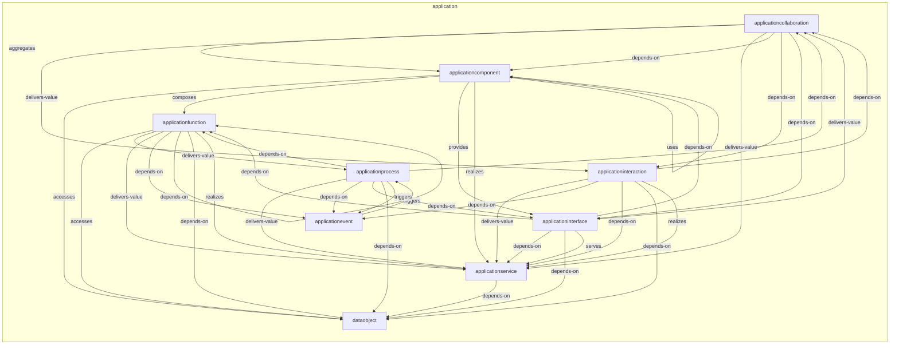
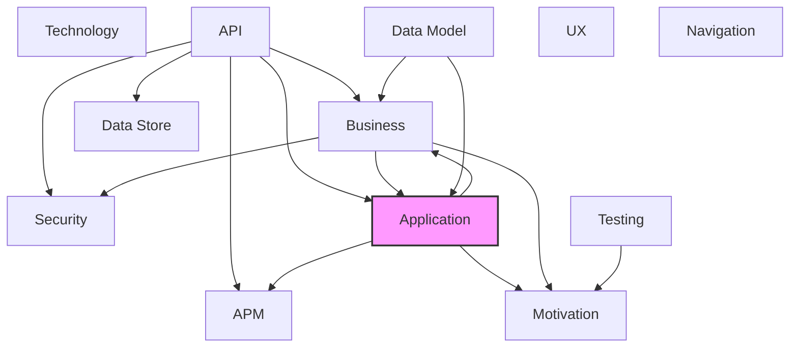

# Application Layer

## Report Index

- [Layer Introduction](#layer-introduction)
- [Intra-Layer Relationships](#intra-layer-relationships)
- [Inter-Layer Dependencies](#inter-layer-dependencies)
- [Inter-Layer Relationships Table](#inter-layer-relationships-table)
- [Node Reference](#node-reference)
  - [Applicationcollaboration](#applicationcollaboration)
  - [Applicationcomponent](#applicationcomponent)
  - [Applicationevent](#applicationevent)
  - [Applicationfunction](#applicationfunction)
  - [Applicationinteraction](#applicationinteraction)
  - [Applicationinterface](#applicationinterface)
  - [Applicationprocess](#applicationprocess)
  - [Applicationservice](#applicationservice)
  - [Dataobject](#dataobject)

## Layer Introduction

**Layer 4**: Application
**Standard**: [ArchiMate 3.2](https://pubs.opengroup.org/architecture/archimate32-doc/)

Layer 4: Application Layer

### Statistics

| Metric                    | Count |
| ------------------------- | ----- |
| Node Types                | 9     |
| Intra-Layer Relationships | 39    |
| Inter-Layer Relationships | 8     |
| Inbound Relationships     | 5     |
| Outbound Relationships    | 3     |

### Layer Dependencies

**Depends On**: [Business](./02-business-layer-report.md), [API](./06-api-layer-report.md), [Data Model](./07-data-model-layer-report.md)

**Depended On By**: [Motivation](./01-motivation-layer-report.md), [Business](./02-business-layer-report.md), [APM](./11-apm-layer-report.md)

## Intra-Layer Relationships

## Inter-Layer Dependencies

## Inter-Layer Relationships Table

| Relationship ID                                                    | Source Node                                                               | Dest Node                                                                 | Dest Layer                                      | Predicate      | Cardinality  | Strength |
| ------------------------------------------------------------------ | ------------------------------------------------------------------------- | ------------------------------------------------------------------------- | ----------------------------------------------- | -------------- | ------------ | -------- |
| api.operation.references.application.applicationservice            | [operation](./06-api-layer-report.md#operation)                           | [applicationservice](./04-application-layer-report.md#applicationservice) | [Application](./04-application-layer-report.md) | references     | many-to-one  | medium   |
| api.securityscheme.references.application.applicationservice       | [securityscheme](./06-api-layer-report.md#securityscheme)                 | [applicationservice](./04-application-layer-report.md#applicationservice) | [Application](./04-application-layer-report.md) | references     | many-to-one  | medium   |
| application.applicationprocess.realizes.business.businessprocess   | [applicationprocess](./04-application-layer-report.md#applicationprocess) | [businessprocess](./02-business-layer-report.md#businessprocess)          | [Business](./02-business-layer-report.md)       | realizes       | many-to-one  | medium   |
| application.applicationservice.delivers-value.motivation.value     | [applicationservice](./04-application-layer-report.md#applicationservice) | [value](./01-motivation-layer-report.md#value)                            | [Motivation](./01-motivation-layer-report.md)   | delivers-value | many-to-many | medium   |
| application.applicationservice.references.apm.traceconfiguration   | [applicationservice](./04-application-layer-report.md#applicationservice) | [traceconfiguration](./11-apm-layer-report.md#traceconfiguration)         | [APM](./11-apm-layer-report.md)                 | references     | many-to-one  | medium   |
| business.businessobject.references.application.dataobject          | [businessobject](./02-business-layer-report.md#businessobject)            | [dataobject](./04-application-layer-report.md#dataobject)                 | [Application](./04-application-layer-report.md) | references     | many-to-one  | medium   |
| business.businessprocess.aggregates.application.applicationprocess | [businessprocess](./02-business-layer-report.md#businessprocess)          | [applicationprocess](./04-application-layer-report.md#applicationprocess) | [Application](./04-application-layer-report.md) | aggregates     | many-to-one  | medium   |
| data-model.jsonschema.references.application.applicationservice    | [jsonschema](./07-data-model-layer-report.md#jsonschema)                  | [applicationservice](./04-application-layer-report.md#applicationservice) | [Application](./04-application-layer-report.md) | references     | many-to-one  | medium   |

## Node Reference

### Applicationcollaboration {#applicationcollaboration}

**Spec Node ID**: `application.applicationcollaboration`

Aggregate of application components working together

#### Relationship Metrics

- **Intra-Layer**: Inbound: 3 | Outbound: 6
- **Inter-Layer**: Inbound: 0 | Outbound: 0

#### Intra-Layer Relationships

| Related Node                                      | Predicate      | Direction | Cardinality |
| ------------------------------------------------- | -------------- | --------- | ----------- |
| [applicationcomponent](#applicationcomponent)     | aggregates     | outbound  | many-to-one |
| [applicationinteraction](#applicationinteraction) | delivers-value | outbound  | many-to-one |
| [applicationservice](#applicationservice)         | delivers-value | outbound  | many-to-one |
| [applicationcomponent](#applicationcomponent)     | depends-on     | outbound  | many-to-one |
| [applicationinteraction](#applicationinteraction) | depends-on     | outbound  | many-to-one |
| [applicationinterface](#applicationinterface)     | depends-on     | outbound  | many-to-one |
| [applicationinteraction](#applicationinteraction) | depends-on     | inbound   | many-to-one |
| [applicationinterface](#applicationinterface)     | delivers-value | inbound   | many-to-one |
| [applicationprocess](#applicationprocess)         | depends-on     | inbound   | many-to-one |

[Back to Index](#report-index)

### Applicationcomponent {#applicationcomponent}

**Spec Node ID**: `application.applicationcomponent`

Modular, deployable, and replaceable part of a system

#### Relationship Metrics

- **Intra-Layer**: Inbound: 4 | Outbound: 5
- **Inter-Layer**: Inbound: 0 | Outbound: 0

#### Intra-Layer Relationships

| Related Node                                          | Predicate  | Direction | Cardinality |
| ----------------------------------------------------- | ---------- | --------- | ----------- |
| [applicationcollaboration](#applicationcollaboration) | aggregates | inbound   | many-to-one |
| [applicationcollaboration](#applicationcollaboration) | depends-on | inbound   | many-to-one |
| [dataobject](#dataobject)                             | accesses   | outbound  | many-to-one |
| [applicationfunction](#applicationfunction)           | composes   | outbound  | many-to-one |
| [applicationinterface](#applicationinterface)         | provides   | outbound  | many-to-one |
| [applicationservice](#applicationservice)             | realizes   | outbound  | many-to-one |
| [applicationcomponent](#applicationcomponent)         | uses       | outbound  | many-to-one |
| [applicationinterface](#applicationinterface)         | depends-on | inbound   | many-to-one |

[Back to Index](#report-index)

### Applicationevent {#applicationevent}

**Spec Node ID**: `application.applicationevent`

A state change in an application element that triggers reactive application behavior.

#### Relationship Metrics

- **Intra-Layer**: Inbound: 4 | Outbound: 1
- **Inter-Layer**: Inbound: 0 | Outbound: 0

#### Intra-Layer Relationships

| Related Node                                      | Predicate  | Direction | Cardinality |
| ------------------------------------------------- | ---------- | --------- | ----------- |
| [applicationprocess](#applicationprocess)         | triggers   | outbound  | many-to-one |
| [applicationfunction](#applicationfunction)       | depends-on | inbound   | many-to-one |
| [applicationinteraction](#applicationinteraction) | depends-on | inbound   | many-to-one |
| [applicationprocess](#applicationprocess)         | depends-on | inbound   | many-to-one |
| [applicationprocess](#applicationprocess)         | triggers   | inbound   | many-to-one |

[Back to Index](#report-index)

### Applicationfunction {#applicationfunction}

**Spec Node ID**: `application.applicationfunction`

Automated behavior performed by an application component for internal purposes, not directly exposed as a service to external consumers.

#### Relationship Metrics

- **Intra-Layer**: Inbound: 4 | Outbound: 7
- **Inter-Layer**: Inbound: 0 | Outbound: 0

#### Intra-Layer Relationships

| Related Node                                  | Predicate      | Direction | Cardinality |
| --------------------------------------------- | -------------- | --------- | ----------- |
| [applicationcomponent](#applicationcomponent) | composes       | inbound   | many-to-one |
| [dataobject](#dataobject)                     | accesses       | outbound  | many-to-one |
| [applicationprocess](#applicationprocess)     | delivers-value | outbound  | many-to-one |
| [applicationservice](#applicationservice)     | delivers-value | outbound  | many-to-one |
| [applicationevent](#applicationevent)         | depends-on     | outbound  | many-to-one |
| [applicationfunction](#applicationfunction)   | depends-on     | outbound  | many-to-one |
| [dataobject](#dataobject)                     | depends-on     | outbound  | many-to-one |
| [applicationservice](#applicationservice)     | realizes       | outbound  | many-to-one |
| [applicationinterface](#applicationinterface) | depends-on     | inbound   | many-to-one |
| [applicationprocess](#applicationprocess)     | depends-on     | inbound   | many-to-one |

[Back to Index](#report-index)

### Applicationinteraction {#applicationinteraction}

**Spec Node ID**: `application.applicationinteraction`

Collective application behavior performed by two or more application components working in collaboration, representing their joint behavioral contribution.

#### Relationship Metrics

- **Intra-Layer**: Inbound: 2 | Outbound: 6
- **Inter-Layer**: Inbound: 0 | Outbound: 0

#### Intra-Layer Relationships

| Related Node                                          | Predicate      | Direction | Cardinality |
| ----------------------------------------------------- | -------------- | --------- | ----------- |
| [applicationcollaboration](#applicationcollaboration) | delivers-value | inbound   | many-to-one |
| [applicationcollaboration](#applicationcollaboration) | depends-on     | inbound   | many-to-one |
| [applicationservice](#applicationservice)             | delivers-value | outbound  | many-to-one |
| [applicationcollaboration](#applicationcollaboration) | depends-on     | outbound  | many-to-one |
| [applicationevent](#applicationevent)                 | depends-on     | outbound  | many-to-one |
| [applicationservice](#applicationservice)             | depends-on     | outbound  | many-to-one |
| [dataobject](#dataobject)                             | depends-on     | outbound  | many-to-one |
| [applicationservice](#applicationservice)             | realizes       | outbound  | many-to-one |

[Back to Index](#report-index)

### Applicationinterface {#applicationinterface}

**Spec Node ID**: `application.applicationinterface`

Point of access where application service is available

#### Relationship Metrics

- **Intra-Layer**: Inbound: 3 | Outbound: 6
- **Inter-Layer**: Inbound: 0 | Outbound: 0

#### Intra-Layer Relationships

| Related Node                                          | Predicate      | Direction | Cardinality |
| ----------------------------------------------------- | -------------- | --------- | ----------- |
| [applicationcollaboration](#applicationcollaboration) | depends-on     | inbound   | many-to-one |
| [applicationcomponent](#applicationcomponent)         | provides       | inbound   | many-to-one |
| [applicationcollaboration](#applicationcollaboration) | delivers-value | outbound  | many-to-one |
| [applicationcomponent](#applicationcomponent)         | depends-on     | outbound  | many-to-one |
| [applicationfunction](#applicationfunction)           | depends-on     | outbound  | many-to-one |
| [applicationservice](#applicationservice)             | depends-on     | outbound  | many-to-one |
| [dataobject](#dataobject)                             | depends-on     | outbound  | many-to-one |
| [applicationservice](#applicationservice)             | serves         | outbound  | many-to-one |
| [applicationprocess](#applicationprocess)             | depends-on     | inbound   | many-to-one |

[Back to Index](#report-index)

### Applicationprocess {#applicationprocess}

**Spec Node ID**: `application.applicationprocess`

An ordered sequence of application behaviors performed by an application component to achieve a specific operational result.

#### Relationship Metrics

- **Intra-Layer**: Inbound: 2 | Outbound: 7
- **Inter-Layer**: Inbound: 1 | Outbound: 1

#### Intra-Layer Relationships

| Related Node                                          | Predicate      | Direction | Cardinality |
| ----------------------------------------------------- | -------------- | --------- | ----------- |
| [applicationevent](#applicationevent)                 | triggers       | inbound   | many-to-one |
| [applicationfunction](#applicationfunction)           | delivers-value | inbound   | many-to-one |
| [applicationservice](#applicationservice)             | delivers-value | outbound  | many-to-one |
| [applicationcollaboration](#applicationcollaboration) | depends-on     | outbound  | many-to-one |
| [applicationevent](#applicationevent)                 | depends-on     | outbound  | many-to-one |
| [applicationfunction](#applicationfunction)           | depends-on     | outbound  | many-to-one |
| [applicationinterface](#applicationinterface)         | depends-on     | outbound  | many-to-one |
| [dataobject](#dataobject)                             | depends-on     | outbound  | many-to-one |
| [applicationevent](#applicationevent)                 | triggers       | outbound  | many-to-one |

#### Inter-Layer Relationships

| Related Node                                                     | Layer                                     | Predicate  | Direction | Cardinality |
| ---------------------------------------------------------------- | ----------------------------------------- | ---------- | --------- | ----------- |
| [businessprocess](./02-business-layer-report.md#businessprocess) | [Business](./02-business-layer-report.md) | realizes   | outbound  | many-to-one |
| [businessprocess](./02-business-layer-report.md#businessprocess) | [Business](./02-business-layer-report.md) | aggregates | inbound   | many-to-one |

[Back to Index](#report-index)

### Applicationservice {#applicationservice}

**Spec Node ID**: `application.applicationservice`

Service that exposes application functionality

#### Relationship Metrics

- **Intra-Layer**: Inbound: 10 | Outbound: 1
- **Inter-Layer**: Inbound: 3 | Outbound: 2

#### Intra-Layer Relationships

| Related Node                                          | Predicate      | Direction | Cardinality  |
| ----------------------------------------------------- | -------------- | --------- | ------------ |
| [applicationcollaboration](#applicationcollaboration) | delivers-value | inbound   | many-to-one  |
| [applicationcomponent](#applicationcomponent)         | realizes       | inbound   | many-to-one  |
| [applicationfunction](#applicationfunction)           | delivers-value | inbound   | many-to-one  |
| [applicationfunction](#applicationfunction)           | realizes       | inbound   | many-to-one  |
| [applicationinteraction](#applicationinteraction)     | delivers-value | inbound   | many-to-one  |
| [applicationinteraction](#applicationinteraction)     | depends-on     | inbound   | many-to-one  |
| [applicationinteraction](#applicationinteraction)     | realizes       | inbound   | many-to-one  |
| [applicationinterface](#applicationinterface)         | depends-on     | inbound   | many-to-one  |
| [applicationinterface](#applicationinterface)         | serves         | inbound   | many-to-one  |
| [applicationprocess](#applicationprocess)             | delivers-value | inbound   | many-to-one  |
| [dataobject](#dataobject)                             | depends-on     | outbound  | many-to-many |

#### Inter-Layer Relationships

| Related Node                                                      | Layer                                         | Predicate      | Direction | Cardinality  |
| ----------------------------------------------------------------- | --------------------------------------------- | -------------- | --------- | ------------ |
| [operation](./06-api-layer-report.md#operation)                   | [API](./06-api-layer-report.md)               | references     | inbound   | many-to-one  |
| [securityscheme](./06-api-layer-report.md#securityscheme)         | [API](./06-api-layer-report.md)               | references     | inbound   | many-to-one  |
| [value](./01-motivation-layer-report.md#value)                    | [Motivation](./01-motivation-layer-report.md) | delivers-value | outbound  | many-to-many |
| [traceconfiguration](./11-apm-layer-report.md#traceconfiguration) | [APM](./11-apm-layer-report.md)               | references     | outbound  | many-to-one  |
| [jsonschema](./07-data-model-layer-report.md#jsonschema)          | [Data Model](./07-data-model-layer-report.md) | references     | inbound   | many-to-one  |

[Back to Index](#report-index)

### Dataobject {#dataobject}

**Spec Node ID**: `application.dataobject`

A passive application element representing data structured for automated processing by application components. Unlike behavioral elements, it is accessed, manipulated, or stored by active elements — not an actor itself. For canonical data schema definitions shared across layers, use the Data Model layer instead.

#### Relationship Metrics

- **Intra-Layer**: Inbound: 7 | Outbound: 0
- **Inter-Layer**: Inbound: 1 | Outbound: 0

#### Intra-Layer Relationships

| Related Node                                      | Predicate  | Direction | Cardinality  |
| ------------------------------------------------- | ---------- | --------- | ------------ |
| [applicationcomponent](#applicationcomponent)     | accesses   | inbound   | many-to-one  |
| [applicationfunction](#applicationfunction)       | accesses   | inbound   | many-to-one  |
| [applicationfunction](#applicationfunction)       | depends-on | inbound   | many-to-one  |
| [applicationinteraction](#applicationinteraction) | depends-on | inbound   | many-to-one  |
| [applicationinterface](#applicationinterface)     | depends-on | inbound   | many-to-one  |
| [applicationprocess](#applicationprocess)         | depends-on | inbound   | many-to-one  |
| [applicationservice](#applicationservice)         | depends-on | inbound   | many-to-many |

#### Inter-Layer Relationships

| Related Node                                                   | Layer                                     | Predicate  | Direction | Cardinality |
| -------------------------------------------------------------- | ----------------------------------------- | ---------- | --------- | ----------- |
| [businessobject](./02-business-layer-report.md#businessobject) | [Business](./02-business-layer-report.md) | references | inbound   | many-to-one |

[Back to Index](#report-index)

---

_Generated: 2026-02-28T12:48:58.609Z | Spec Version: 0.8.0 | Generator: generate-layer-reports.ts_
