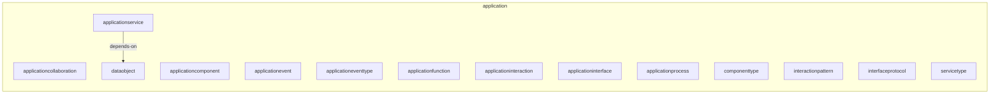
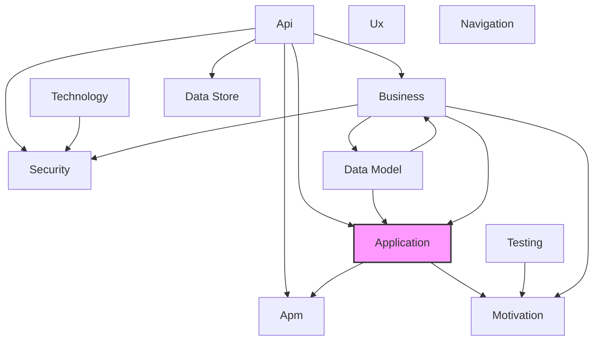

# Application Layer

## Report Index

- [Layer Introduction](#layer-introduction)
- [Intra-Layer Relationships](#intra-layer-relationships)
- [Inter-Layer Dependencies](#inter-layer-dependencies)
- [Inter-Layer Relationships Table](#inter-layer-relationships-table)
- [Node Reference](#node-reference)
  - [Applicationcollaboration](#applicationcollaboration)
  - [Applicationcomponent](#applicationcomponent)
  - [Applicationevent](#applicationevent)
  - [Applicationeventtype](#applicationeventtype)
  - [Applicationfunction](#applicationfunction)
  - [Applicationinteraction](#applicationinteraction)
  - [Applicationinterface](#applicationinterface)
  - [Applicationprocess](#applicationprocess)
  - [Applicationservice](#applicationservice)
  - [Componenttype](#componenttype)
  - [Dataobject](#dataobject)
  - [Interactionpattern](#interactionpattern)
  - [Interfaceprotocol](#interfaceprotocol)
  - [Servicetype](#servicetype)

## Layer Introduction

**Layer 4**: Application
**Standard**: [ArchiMate 3.2](https://pubs.opengroup.org/architecture/archimate32-doc/)

Layer 4: Application Layer

### Statistics

| Metric                    | Count |
| ------------------------- | ----- |
| Node Types                | 14    |
| Intra-Layer Relationships | 1     |
| Inter-Layer Relationships | 9     |
| Inbound Relationships     | 7     |
| Outbound Relationships    | 2     |

### Layer Dependencies

**Depends On**: [Business](./02-business-layer-report.md), [Api](./06-api-layer-report.md), [Data Model](./07-data-model-layer-report.md)

**Depended On By**: [Motivation](./01-motivation-layer-report.md), [Apm](./11-apm-layer-report.md)

## Intra-Layer Relationships

## Inter-Layer Dependencies

## Inter-Layer Relationships Table

| Relationship ID                                                             | Source Node                                                               | Dest Node                                                                 | Dest Layer                                      | Predicate                 | Cardinality  | Strength |
| --------------------------------------------------------------------------- | ------------------------------------------------------------------------- | ------------------------------------------------------------------------- | ----------------------------------------------- | ------------------------- | ------------ | -------- |
| application.applicationservice.traced.apm.traceconfiguration                | [applicationservice](./04-application-layer-report.md#applicationservice) | [traceconfiguration](./11-apm-layer-report.md#traceconfiguration)         | [Apm](./11-apm-layer-report.md)                 | traced                    | many-to-one  | medium   |
| api.securityscheme.archimate-ref.application.applicationservice             | [securityscheme](./06-api-layer-report.md#securityscheme)                 | [applicationservice](./04-application-layer-report.md#applicationservice) | [Application](./04-application-layer-report.md) | archimate-ref             | many-to-one  | medium   |
| api.operation.archimate-ref.application.applicationservice                  | [operation](./06-api-layer-report.md#operation)                           | [applicationservice](./04-application-layer-report.md#applicationservice) | [Application](./04-application-layer-report.md) | archimate-ref             | many-to-one  | medium   |
| data-model.jsonschema.archimate-ref.application.applicationservice          | [jsonschema](./07-data-model-layer-report.md#jsonschema)                  | [applicationservice](./04-application-layer-report.md#applicationservice) | [Application](./04-application-layer-report.md) | archimate-ref             | many-to-one  | medium   |
| business.businessobject.master-data-source.application.dataobject           | [businessobject](./02-business-layer-report.md#businessobject)            | [dataobject](./04-application-layer-report.md#dataobject)                 | [Application](./04-application-layer-report.md) | master-data-source        | many-to-one  | medium   |
| business.businessprocess.process-steps.application.applicationprocess       | [businessprocess](./02-business-layer-report.md#businessprocess)          | [applicationprocess](./04-application-layer-report.md#applicationprocess) | [Application](./04-application-layer-report.md) | process-steps             | many-to-many | medium   |
| business.businessprocess.realized-by-process.application.applicationprocess | [businessprocess](./02-business-layer-report.md#businessprocess)          | [applicationprocess](./04-application-layer-report.md#applicationprocess) | [Application](./04-application-layer-report.md) | realized-by-process       | many-to-one  | medium   |
| business.businessobject.represented-by-dataobject.application.dataobject    | [businessobject](./02-business-layer-report.md#businessobject)            | [dataobject](./04-application-layer-report.md#dataobject)                 | [Application](./04-application-layer-report.md) | represented-by-dataobject | many-to-one  | medium   |
| application.applicationservice.delivers-value.motivation.value              | [applicationservice](./04-application-layer-report.md#applicationservice) | [value](./01-motivation-layer-report.md#value)                            | [Motivation](./01-motivation-layer-report.md)   | delivers-value            | many-to-many | medium   |

## Node Reference

### Applicationcollaboration

**Spec Node ID**: `application.applicationcollaboration`

Aggregate of application components working together

[Back to Index](#report-index)

### Applicationcomponent

**Spec Node ID**: `application.applicationcomponent`

Modular, deployable, and replaceable part of a system

[Back to Index](#report-index)

### Applicationevent

**Spec Node ID**: `application.applicationevent`

Application state change notification

[Back to Index](#report-index)

### Applicationeventtype

**Spec Node ID**: `application.applicationeventtype`

ApplicationEventType element in Application Layer

[Back to Index](#report-index)

### Applicationfunction

**Spec Node ID**: `application.applicationfunction`

Automated behavior performed by application component

[Back to Index](#report-index)

### Applicationinteraction

**Spec Node ID**: `application.applicationinteraction`

Unit of collective application behavior

[Back to Index](#report-index)

### Applicationinterface

**Spec Node ID**: `application.applicationinterface`

Point of access where application service is available

[Back to Index](#report-index)

### Applicationprocess

**Spec Node ID**: `application.applicationprocess`

Sequence of application behaviors

#### Inter-Layer Relationships

| Related Node                                                     | Layer                                     | Predicate           | Direction | Cardinality  |
| ---------------------------------------------------------------- | ----------------------------------------- | ------------------- | --------- | ------------ |
| [businessprocess](./02-business-layer-report.md#businessprocess) | [Business](./02-business-layer-report.md) | realized-by-process | inbound   | many-to-one  |
| [businessprocess](./02-business-layer-report.md#businessprocess) | [Business](./02-business-layer-report.md) | process-steps       | inbound   | many-to-many |

[Back to Index](#report-index)

### Applicationservice

**Spec Node ID**: `application.applicationservice`

Service that exposes application functionality

#### Intra-Layer Relationships

| Related Node              | Predicate  | Direction | Cardinality  |
| ------------------------- | ---------- | --------- | ------------ |
| [dataobject](#dataobject) | depends-on | outbound  | many-to-many |

#### Inter-Layer Relationships

| Related Node                                                      | Layer                                         | Predicate      | Direction | Cardinality  |
| ----------------------------------------------------------------- | --------------------------------------------- | -------------- | --------- | ------------ |
| [securityscheme](./06-api-layer-report.md#securityscheme)         | [Api](./06-api-layer-report.md)               | archimate-ref  | inbound   | many-to-one  |
| [operation](./06-api-layer-report.md#operation)                   | [Api](./06-api-layer-report.md)               | archimate-ref  | inbound   | many-to-one  |
| [jsonschema](./07-data-model-layer-report.md#jsonschema)          | [Data Model](./07-data-model-layer-report.md) | archimate-ref  | inbound   | many-to-one  |
| [traceconfiguration](./11-apm-layer-report.md#traceconfiguration) | [Apm](./11-apm-layer-report.md)               | traced         | outbound  | many-to-one  |
| [value](./01-motivation-layer-report.md#value)                    | [Motivation](./01-motivation-layer-report.md) | delivers-value | outbound  | many-to-many |

[Back to Index](#report-index)

### Componenttype

**Spec Node ID**: `application.componenttype`

ComponentType element in Application Layer

[Back to Index](#report-index)

### Dataobject

**Spec Node ID**: `application.dataobject`

Data structured for automated processing

#### Intra-Layer Relationships

| Related Node                              | Predicate  | Direction | Cardinality  |
| ----------------------------------------- | ---------- | --------- | ------------ |
| [applicationservice](#applicationservice) | depends-on | inbound   | many-to-many |

#### Inter-Layer Relationships

| Related Node                                                   | Layer                                     | Predicate                 | Direction | Cardinality |
| -------------------------------------------------------------- | ----------------------------------------- | ------------------------- | --------- | ----------- |
| [businessobject](./02-business-layer-report.md#businessobject) | [Business](./02-business-layer-report.md) | master-data-source        | inbound   | many-to-one |
| [businessobject](./02-business-layer-report.md#businessobject) | [Business](./02-business-layer-report.md) | represented-by-dataobject | inbound   | many-to-one |

[Back to Index](#report-index)

### Interactionpattern

**Spec Node ID**: `application.interactionpattern`

InteractionPattern element in Application Layer

[Back to Index](#report-index)

### Interfaceprotocol

**Spec Node ID**: `application.interfaceprotocol`

InterfaceProtocol element in Application Layer

[Back to Index](#report-index)

### Servicetype

**Spec Node ID**: `application.servicetype`

ServiceType element in Application Layer

[Back to Index](#report-index)

---

_Generated: 2026-02-11T21:56:39.325Z | Generator: generate-layer-reports.ts_
