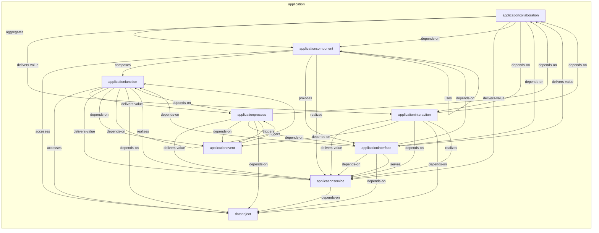
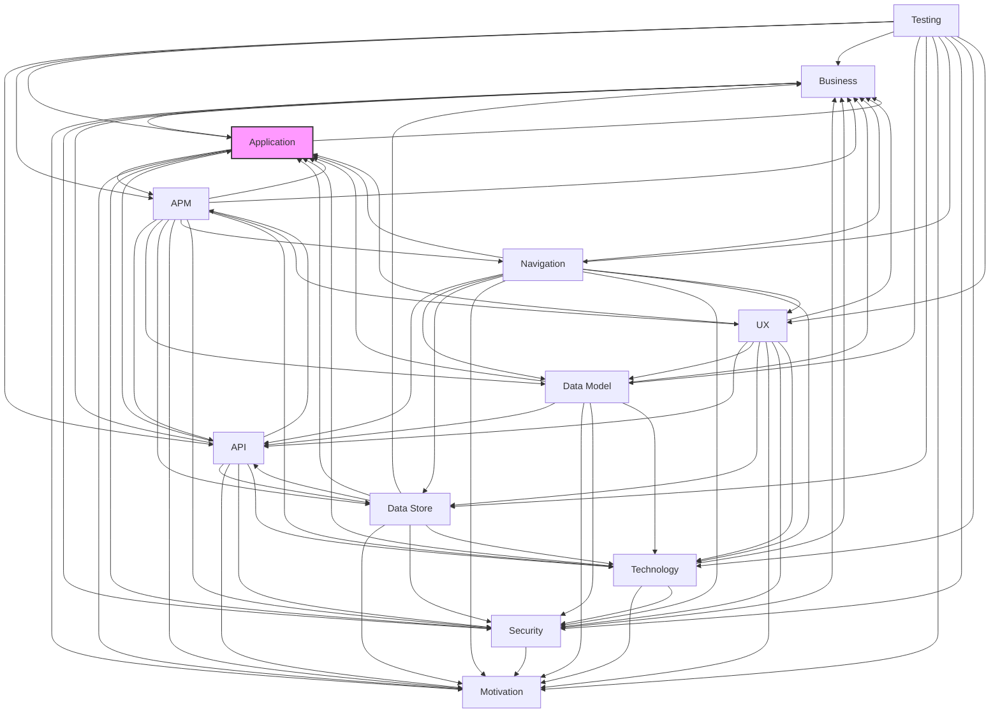

# Application Layer

## Report Index

- [Layer Introduction](#layer-introduction)
- [Intra-Layer Relationships](#intra-layer-relationships)
- [Inter-Layer Dependencies](#inter-layer-dependencies)
- [Inter-Layer Relationships Table](#inter-layer-relationships-table)
- [Node Reference](#node-reference)
  - [Applicationcollaboration](#applicationcollaboration)
  - [Applicationcomponent](#applicationcomponent)
  - [Applicationevent](#applicationevent)
  - [Applicationfunction](#applicationfunction)
  - [Applicationinteraction](#applicationinteraction)
  - [Applicationinterface](#applicationinterface)
  - [Applicationprocess](#applicationprocess)
  - [Applicationservice](#applicationservice)
  - [Dataobject](#dataobject)

## Layer Introduction

**Layer 4**: Application
**Standard**: [ArchiMate 3.2](https://pubs.opengroup.org/architecture/archimate32-doc/)

Layer 4: Application Layer

### Statistics

| Metric                    | Count |
| ------------------------- | ----- |
| Node Types                | 9     |
| Intra-Layer Relationships | 39    |
| Inter-Layer Relationships | 95    |
| Inbound Relationships     | 68    |
| Outbound Relationships    | 27    |

### Layer Dependencies

**Depends On**: [Business](./02-business-layer-report.md), [Technology](./05-technology-layer-report.md), [API](./06-api-layer-report.md), [Data Model](./07-data-model-layer-report.md), [Data Store](./08-data-store-layer-report.md), [UX](./09-ux-layer-report.md), [Navigation](./10-navigation-layer-report.md), [APM](./11-apm-layer-report.md), [Testing](./12-testing-layer-report.md)

**Depended On By**: [Motivation](./01-motivation-layer-report.md), [Business](./02-business-layer-report.md), [Security](./03-security-layer-report.md), [APM](./11-apm-layer-report.md)

## Intra-Layer Relationships

```mermaid
flowchart LR
  subgraph application
    applicationcollaboration["applicationcollaboration"]
    applicationcomponent["applicationcomponent"]
    applicationevent["applicationevent"]
    applicationfunction["applicationfunction"]
    applicationinteraction["applicationinteraction"]
    applicationinterface["applicationinterface"]
    applicationprocess["applicationprocess"]
    applicationservice["applicationservice"]
    dataobject["dataobject"]
    applicationcollaboration -->|aggregates| applicationcomponent
    applicationcollaboration -->|delivers-value| applicationinteraction
    applicationcollaboration -->|delivers-value| applicationservice
    applicationcollaboration -->|depends-on| applicationcomponent
    applicationcollaboration -->|depends-on| applicationinteraction
    applicationcollaboration -->|depends-on| applicationinterface
    applicationcomponent -->|accesses| dataobject
    applicationcomponent -->|composes| applicationfunction
    applicationcomponent -->|provides| applicationinterface
    applicationcomponent -->|realizes| applicationservice
    applicationcomponent -->|uses| applicationcomponent
    applicationevent -->|triggers| applicationprocess
    applicationfunction -->|accesses| dataobject
    applicationfunction -->|delivers-value| applicationprocess
    applicationfunction -->|delivers-value| applicationservice
    applicationfunction -->|depends-on| applicationevent
    applicationfunction -->|depends-on| applicationfunction
    applicationfunction -->|depends-on| dataobject
    applicationfunction -->|realizes| applicationservice
    applicationinteraction -->|delivers-value| applicationservice
    applicationinteraction -->|depends-on| applicationcollaboration
    applicationinteraction -->|depends-on| applicationevent
    applicationinteraction -->|depends-on| applicationservice
    applicationinteraction -->|depends-on| dataobject
    applicationinteraction -->|realizes| applicationservice
    applicationinterface -->|delivers-value| applicationcollaboration
    applicationinterface -->|depends-on| applicationcomponent
    applicationinterface -->|depends-on| applicationfunction
    applicationinterface -->|depends-on| applicationservice
    applicationinterface -->|depends-on| dataobject
    applicationinterface -->|serves| applicationservice
    applicationprocess -->|delivers-value| applicationservice
    applicationprocess -->|depends-on| applicationcollaboration
    applicationprocess -->|depends-on| applicationevent
    applicationprocess -->|depends-on| applicationfunction
    applicationprocess -->|depends-on| applicationinterface
    applicationprocess -->|depends-on| dataobject
    applicationprocess -->|triggers| applicationevent
    applicationservice -->|depends-on| dataobject
  end
```

## Inter-Layer Dependencies

```mermaid
flowchart TB
  classDef current fill:#f9f,stroke:#333,stroke-width:2px
  motivation["Motivation"]
  business["Business"]
  security["Security"]
  application["Application"]
  technology["Technology"]
  api["API"]
  data_model["Data Model"]
  data_store["Data Store"]
  ux["UX"]
  navigation["Navigation"]
  apm["APM"]
  testing["Testing"]
  api --> apm
  api --> application
  api --> business
  api --> data_store
  api --> motivation
  api --> security
  api --> technology
  apm --> api
  apm --> application
  apm --> business
  apm --> data_model
  apm --> data_store
  apm --> motivation
  apm --> navigation
  apm --> security
  apm --> technology
  apm --> ux
  application --> apm
  application --> business
  application --> motivation
  application --> security
  business --> application
  business --> motivation
  business --> security
  data_model --> api
  data_model --> application
  data_model --> business
  data_model --> motivation
  data_model --> security
  data_model --> technology
  data_store --> api
  data_store --> application
  data_store --> business
  data_store --> motivation
  data_store --> security
  data_store --> technology
  navigation --> api
  navigation --> application
  navigation --> business
  navigation --> data_model
  navigation --> data_store
  navigation --> motivation
  navigation --> security
  navigation --> technology
  navigation --> ux
  security --> business
  security --> motivation
  technology --> application
  technology --> business
  technology --> motivation
  technology --> security
  testing --> api
  testing --> apm
  testing --> application
  testing --> business
  testing --> data_model
  testing --> data_store
  testing --> motivation
  testing --> navigation
  testing --> security
  testing --> technology
  testing --> ux
  ux --> api
  ux --> application
  ux --> business
  ux --> data_model
  ux --> data_store
  ux --> motivation
  ux --> security
  ux --> technology
  class application current
```

## Inter-Layer Relationships Table

| Relationship ID                                                         | Source Node                                                                   | Dest Node                                                                     | Dest Layer                                      | Predicate      | Cardinality  | Strength |
| ----------------------------------------------------------------------- | ----------------------------------------------------------------------------- | ----------------------------------------------------------------------------- | ----------------------------------------------- | -------------- | ------------ | -------- |
| api.openapidocument.realizes.application.applicationservice             | [Openapidocument](./06-api-layer-report.md#openapidocument)                   | [Applicationservice](./04-application-layer-report.md#applicationservice)     | [Application](./04-application-layer-report.md) | realizes       | many-to-one  | medium   |
| api.openapidocument.serves.application.applicationcomponent             | [Openapidocument](./06-api-layer-report.md#openapidocument)                   | [Applicationcomponent](./04-application-layer-report.md#applicationcomponent) | [Application](./04-application-layer-report.md) | serves         | many-to-one  | medium   |
| api.operation.realizes.application.applicationfunction                  | [Operation](./06-api-layer-report.md#operation)                               | [Applicationfunction](./04-application-layer-report.md#applicationfunction)   | [Application](./04-application-layer-report.md) | realizes       | many-to-one  | medium   |
| api.operation.references.application.applicationservice                 | [Operation](./06-api-layer-report.md#operation)                               | [Applicationservice](./04-application-layer-report.md#applicationservice)     | [Application](./04-application-layer-report.md) | references     | many-to-one  | medium   |
| api.operation.triggers.application.applicationevent                     | [Operation](./06-api-layer-report.md#operation)                               | [Applicationevent](./04-application-layer-report.md#applicationevent)         | [Application](./04-application-layer-report.md) | triggers       | many-to-one  | medium   |
| api.operation.uses.application.applicationinterface                     | [Operation](./06-api-layer-report.md#operation)                               | [Applicationinterface](./04-application-layer-report.md#applicationinterface) | [Application](./04-application-layer-report.md) | uses           | many-to-one  | medium   |
| api.pathitem.serves.application.applicationcomponent                    | [Pathitem](./06-api-layer-report.md#pathitem)                                 | [Applicationcomponent](./04-application-layer-report.md#applicationcomponent) | [Application](./04-application-layer-report.md) | serves         | many-to-one  | medium   |
| api.securityscheme.references.application.applicationcomponent          | [Securityscheme](./06-api-layer-report.md#securityscheme)                     | [Applicationcomponent](./04-application-layer-report.md#applicationcomponent) | [Application](./04-application-layer-report.md) | references     | many-to-one  | medium   |
| api.securityscheme.references.application.applicationservice            | [Securityscheme](./06-api-layer-report.md#securityscheme)                     | [Applicationservice](./04-application-layer-report.md#applicationservice)     | [Application](./04-application-layer-report.md) | references     | many-to-one  | medium   |
| api.server.serves.application.applicationcomponent                      | [Server](./06-api-layer-report.md#server)                                     | [Applicationcomponent](./04-application-layer-report.md#applicationcomponent) | [Application](./04-application-layer-report.md) | serves         | many-to-one  | medium   |
| apm.instrumentationconfig.monitors.application.applicationcomponent     | [Instrumentationconfig](./11-apm-layer-report.md#instrumentationconfig)       | [Applicationcomponent](./04-application-layer-report.md#applicationcomponent) | [Application](./04-application-layer-report.md) | monitors       | many-to-one  | medium   |
| apm.logrecord.monitors.application.applicationservice                   | [Logrecord](./11-apm-layer-report.md#logrecord)                               | [Applicationservice](./04-application-layer-report.md#applicationservice)     | [Application](./04-application-layer-report.md) | monitors       | many-to-one  | medium   |
| apm.metricinstrument.monitors.application.applicationcomponent          | [Metricinstrument](./11-apm-layer-report.md#metricinstrument)                 | [Applicationcomponent](./04-application-layer-report.md#applicationcomponent) | [Application](./04-application-layer-report.md) | monitors       | many-to-one  | medium   |
| apm.metricinstrument.monitors.application.applicationservice            | [Metricinstrument](./11-apm-layer-report.md#metricinstrument)                 | [Applicationservice](./04-application-layer-report.md#applicationservice)     | [Application](./04-application-layer-report.md) | monitors       | many-to-one  | medium   |
| apm.resource.maps-to.application.applicationcomponent                   | [Resource](./11-apm-layer-report.md#resource)                                 | [Applicationcomponent](./04-application-layer-report.md#applicationcomponent) | [Application](./04-application-layer-report.md) | maps-to        | many-to-one  | medium   |
| apm.span.monitors.application.applicationcomponent                      | [Span](./11-apm-layer-report.md#span)                                         | [Applicationcomponent](./04-application-layer-report.md#applicationcomponent) | [Application](./04-application-layer-report.md) | monitors       | many-to-one  | medium   |
| apm.span.monitors.application.applicationservice                        | [Span](./11-apm-layer-report.md#span)                                         | [Applicationservice](./04-application-layer-report.md#applicationservice)     | [Application](./04-application-layer-report.md) | monitors       | many-to-one  | medium   |
| apm.traceconfiguration.monitors.application.applicationservice          | [Traceconfiguration](./11-apm-layer-report.md#traceconfiguration)             | [Applicationservice](./04-application-layer-report.md#applicationservice)     | [Application](./04-application-layer-report.md) | monitors       | many-to-one  | medium   |
| application.applicationcomponent.accesses.security.secureresource       | [Applicationcomponent](./04-application-layer-report.md#applicationcomponent) | [Secureresource](./03-security-layer-report.md#secureresource)                | [Security](./03-security-layer-report.md)       | accesses       | many-to-one  | medium   |
| application.applicationcomponent.constrained-by.security.securitypolicy | [Applicationcomponent](./04-application-layer-report.md#applicationcomponent) | [Securitypolicy](./03-security-layer-report.md#securitypolicy)                | [Security](./03-security-layer-report.md)       | constrained-by | many-to-one  | medium   |
| application.applicationcomponent.implements.security.countermeasure     | [Applicationcomponent](./04-application-layer-report.md#applicationcomponent) | [Countermeasure](./03-security-layer-report.md#countermeasure)                | [Security](./03-security-layer-report.md)       | implements     | many-to-one  | medium   |
| application.applicationcomponent.mitigates.security.threat              | [Applicationcomponent](./04-application-layer-report.md#applicationcomponent) | [Threat](./03-security-layer-report.md#threat)                                | [Security](./03-security-layer-report.md)       | mitigates      | many-to-one  | medium   |
| application.applicationcomponent.realizes.business.businessservice      | [Applicationcomponent](./04-application-layer-report.md#applicationcomponent) | [Businessservice](./02-business-layer-report.md#businessservice)              | [Business](./02-business-layer-report.md)       | realizes       | many-to-one  | medium   |
| application.applicationcomponent.realizes.motivation.goal               | [Applicationcomponent](./04-application-layer-report.md#applicationcomponent) | [Goal](./01-motivation-layer-report.md#goal)                                  | [Motivation](./01-motivation-layer-report.md)   | realizes       | many-to-one  | medium   |
| application.applicationcomponent.realizes.motivation.principle          | [Applicationcomponent](./04-application-layer-report.md#applicationcomponent) | [Principle](./01-motivation-layer-report.md#principle)                        | [Motivation](./01-motivation-layer-report.md)   | realizes       | many-to-one  | medium   |
| application.applicationcomponent.satisfies.motivation.requirement       | [Applicationcomponent](./04-application-layer-report.md#applicationcomponent) | [Requirement](./01-motivation-layer-report.md#requirement)                    | [Motivation](./01-motivation-layer-report.md)   | satisfies      | many-to-one  | medium   |
| application.applicationcomponent.serves.business.businessrole           | [Applicationcomponent](./04-application-layer-report.md#applicationcomponent) | [Businessrole](./02-business-layer-report.md#businessrole)                    | [Business](./02-business-layer-report.md)       | serves         | many-to-one  | medium   |
| application.applicationevent.triggers.business.businessprocess          | [Applicationevent](./04-application-layer-report.md#applicationevent)         | [Businessprocess](./02-business-layer-report.md#businessprocess)              | [Business](./02-business-layer-report.md)       | triggers       | many-to-one  | medium   |
| application.applicationfunction.accesses.security.secureresource        | [Applicationfunction](./04-application-layer-report.md#applicationfunction)   | [Secureresource](./03-security-layer-report.md#secureresource)                | [Security](./03-security-layer-report.md)       | accesses       | many-to-one  | medium   |
| application.applicationfunction.realizes.business.businessfunction      | [Applicationfunction](./04-application-layer-report.md#applicationfunction)   | [Businessfunction](./02-business-layer-report.md#businessfunction)            | [Business](./02-business-layer-report.md)       | realizes       | many-to-one  | medium   |
| application.applicationfunction.satisfies.motivation.requirement        | [Applicationfunction](./04-application-layer-report.md#applicationfunction)   | [Requirement](./01-motivation-layer-report.md#requirement)                    | [Motivation](./01-motivation-layer-report.md)   | satisfies      | many-to-one  | medium   |
| application.applicationinterface.exposes.security.secureresource        | [Applicationinterface](./04-application-layer-report.md#applicationinterface) | [Secureresource](./03-security-layer-report.md#secureresource)                | [Security](./03-security-layer-report.md)       | exposes        | many-to-one  | medium   |
| application.applicationinterface.serves.business.businessrole           | [Applicationinterface](./04-application-layer-report.md#applicationinterface) | [Businessrole](./02-business-layer-report.md#businessrole)                    | [Business](./02-business-layer-report.md)       | serves         | many-to-one  | medium   |
| application.applicationprocess.realizes.business.businessprocess        | [Applicationprocess](./04-application-layer-report.md#applicationprocess)     | [Businessprocess](./02-business-layer-report.md#businessprocess)              | [Business](./02-business-layer-report.md)       | realizes       | many-to-one  | medium   |
| application.applicationservice.accesses.business.businessobject         | [Applicationservice](./04-application-layer-report.md#applicationservice)     | [Businessobject](./02-business-layer-report.md#businessobject)                | [Business](./02-business-layer-report.md)       | accesses       | many-to-one  | medium   |
| application.applicationservice.constrained-by.security.accesscondition  | [Applicationservice](./04-application-layer-report.md#applicationservice)     | [Accesscondition](./03-security-layer-report.md#accesscondition)              | [Security](./03-security-layer-report.md)       | constrained-by | many-to-one  | medium   |
| application.applicationservice.delivers-value.motivation.value          | [Applicationservice](./04-application-layer-report.md#applicationservice)     | [Value](./01-motivation-layer-report.md#value)                                | [Motivation](./01-motivation-layer-report.md)   | delivers-value | many-to-many | medium   |
| application.applicationservice.realizes.business.businessservice        | [Applicationservice](./04-application-layer-report.md#applicationservice)     | [Businessservice](./02-business-layer-report.md#businessservice)              | [Business](./02-business-layer-report.md)       | realizes       | many-to-one  | medium   |
| application.applicationservice.realizes.motivation.goal                 | [Applicationservice](./04-application-layer-report.md#applicationservice)     | [Goal](./01-motivation-layer-report.md#goal)                                  | [Motivation](./01-motivation-layer-report.md)   | realizes       | many-to-one  | medium   |
| application.applicationservice.realizes.motivation.requirement          | [Applicationservice](./04-application-layer-report.md#applicationservice)     | [Requirement](./01-motivation-layer-report.md#requirement)                    | [Motivation](./01-motivation-layer-report.md)   | realizes       | many-to-one  | medium   |
| application.applicationservice.references.apm.traceconfiguration        | [Applicationservice](./04-application-layer-report.md#applicationservice)     | [Traceconfiguration](./11-apm-layer-report.md#traceconfiguration)             | [APM](./11-apm-layer-report.md)                 | references     | many-to-one  | medium   |
| application.applicationservice.requires.security.authenticationconfig   | [Applicationservice](./04-application-layer-report.md#applicationservice)     | [Authenticationconfig](./03-security-layer-report.md#authenticationconfig)    | [Security](./03-security-layer-report.md)       | requires       | many-to-one  | medium   |
| application.applicationservice.satisfies.motivation.constraint          | [Applicationservice](./04-application-layer-report.md#applicationservice)     | [Constraint](./01-motivation-layer-report.md#constraint)                      | [Motivation](./01-motivation-layer-report.md)   | satisfies      | many-to-one  | medium   |
| application.applicationservice.serves.business.businessprocess          | [Applicationservice](./04-application-layer-report.md#applicationservice)     | [Businessprocess](./02-business-layer-report.md#businessprocess)              | [Business](./02-business-layer-report.md)       | serves         | many-to-one  | medium   |
| application.applicationservice.serves.motivation.stakeholder            | [Applicationservice](./04-application-layer-report.md#applicationservice)     | [Stakeholder](./01-motivation-layer-report.md#stakeholder)                    | [Motivation](./01-motivation-layer-report.md)   | serves         | many-to-one  | medium   |
| business.businessobject.references.application.dataobject               | [Businessobject](./02-business-layer-report.md#businessobject)                | [Dataobject](./04-application-layer-report.md#dataobject)                     | [Application](./04-application-layer-report.md) | references     | many-to-one  | medium   |
| business.businessprocess.aggregates.application.applicationprocess      | [Businessprocess](./02-business-layer-report.md#businessprocess)              | [Applicationprocess](./04-application-layer-report.md#applicationprocess)     | [Application](./04-application-layer-report.md) | aggregates     | many-to-one  | medium   |
| data-model.jsonschema.references.application.applicationservice         | [Jsonschema](./07-data-model-layer-report.md#jsonschema)                      | [Applicationservice](./04-application-layer-report.md#applicationservice)     | [Application](./04-application-layer-report.md) | references     | many-to-one  | medium   |
| data-model.jsonschema.serves.application.applicationfunction            | [Jsonschema](./07-data-model-layer-report.md#jsonschema)                      | [Applicationfunction](./04-application-layer-report.md#applicationfunction)   | [Application](./04-application-layer-report.md) | serves         | many-to-one  | medium   |
| data-model.objectschema.realizes.application.dataobject                 | [Objectschema](./07-data-model-layer-report.md#objectschema)                  | [Dataobject](./04-application-layer-report.md#dataobject)                     | [Application](./04-application-layer-report.md) | realizes       | many-to-one  | medium   |
| data-model.reference.maps-to.application.applicationservice             | [Reference](./07-data-model-layer-report.md#reference)                        | [Applicationservice](./04-application-layer-report.md#applicationservice)     | [Application](./04-application-layer-report.md) | maps-to        | many-to-one  | medium   |
| data-model.schemacomposition.serves.application.applicationfunction     | [Schemacomposition](./07-data-model-layer-report.md#schemacomposition)        | [Applicationfunction](./04-application-layer-report.md#applicationfunction)   | [Application](./04-application-layer-report.md) | serves         | many-to-one  | medium   |
| data-model.schemadefinition.realizes.application.dataobject             | [Schemadefinition](./07-data-model-layer-report.md#schemadefinition)          | [Dataobject](./04-application-layer-report.md#dataobject)                     | [Application](./04-application-layer-report.md) | realizes       | many-to-one  | medium   |
| data-model.schemadefinition.serves.application.applicationcomponent     | [Schemadefinition](./07-data-model-layer-report.md#schemadefinition)          | [Applicationcomponent](./04-application-layer-report.md#applicationcomponent) | [Application](./04-application-layer-report.md) | serves         | many-to-one  | medium   |
| data-model.schemadefinition.serves.application.applicationevent         | [Schemadefinition](./07-data-model-layer-report.md#schemadefinition)          | [Applicationevent](./04-application-layer-report.md#applicationevent)         | [Application](./04-application-layer-report.md) | serves         | many-to-one  | medium   |
| data-model.schemadefinition.serves.application.applicationfunction      | [Schemadefinition](./07-data-model-layer-report.md#schemadefinition)          | [Applicationfunction](./04-application-layer-report.md#applicationfunction)   | [Application](./04-application-layer-report.md) | serves         | many-to-one  | medium   |
| data-store.accesspattern.serves.application.applicationfunction         | [Accesspattern](./08-data-store-layer-report.md#accesspattern)                | [Applicationfunction](./04-application-layer-report.md#applicationfunction)   | [Application](./04-application-layer-report.md) | serves         | many-to-one  | medium   |
| data-store.collection.serves.application.applicationcomponent           | [Collection](./08-data-store-layer-report.md#collection)                      | [Applicationcomponent](./04-application-layer-report.md#applicationcomponent) | [Application](./04-application-layer-report.md) | serves         | many-to-one  | medium   |
| data-store.database.serves.application.applicationcomponent             | [Database](./08-data-store-layer-report.md#database)                          | [Applicationcomponent](./04-application-layer-report.md#applicationcomponent) | [Application](./04-application-layer-report.md) | serves         | many-to-one  | medium   |
| data-store.database.serves.application.applicationservice               | [Database](./08-data-store-layer-report.md#database)                          | [Applicationservice](./04-application-layer-report.md#applicationservice)     | [Application](./04-application-layer-report.md) | serves         | many-to-one  | medium   |
| data-store.eventhandler.triggers.application.applicationevent           | [Eventhandler](./08-data-store-layer-report.md#eventhandler)                  | [Applicationevent](./04-application-layer-report.md#applicationevent)         | [Application](./04-application-layer-report.md) | triggers       | many-to-one  | medium   |
| data-store.storedlogic.implements.application.applicationfunction       | [Storedlogic](./08-data-store-layer-report.md#storedlogic)                    | [Applicationfunction](./04-application-layer-report.md#applicationfunction)   | [Application](./04-application-layer-report.md) | implements     | many-to-one  | medium   |
| data-store.storedlogic.serves.application.applicationservice            | [Storedlogic](./08-data-store-layer-report.md#storedlogic)                    | [Applicationservice](./04-application-layer-report.md#applicationservice)     | [Application](./04-application-layer-report.md) | serves         | many-to-one  | medium   |
| data-store.view.serves.application.applicationservice                   | [View](./08-data-store-layer-report.md#view)                                  | [Applicationservice](./04-application-layer-report.md#applicationservice)     | [Application](./04-application-layer-report.md) | serves         | many-to-one  | medium   |
| navigation.contextvariable.references.application.dataobject            | [Contextvariable](./10-navigation-layer-report.md#contextvariable)            | [Dataobject](./04-application-layer-report.md#dataobject)                     | [Application](./04-application-layer-report.md) | references     | many-to-one  | medium   |
| navigation.flowstep.accesses.application.applicationservice             | [Flowstep](./10-navigation-layer-report.md#flowstep)                          | [Applicationservice](./04-application-layer-report.md#applicationservice)     | [Application](./04-application-layer-report.md) | accesses       | many-to-one  | medium   |
| navigation.navigationflow.realizes.application.applicationprocess       | [Navigationflow](./10-navigation-layer-report.md#navigationflow)              | [Applicationprocess](./04-application-layer-report.md#applicationprocess)     | [Application](./04-application-layer-report.md) | realizes       | many-to-one  | medium   |
| navigation.navigationflow.triggers.application.applicationevent         | [Navigationflow](./10-navigation-layer-report.md#navigationflow)              | [Applicationevent](./04-application-layer-report.md#applicationevent)         | [Application](./04-application-layer-report.md) | triggers       | many-to-one  | medium   |
| navigation.navigationguard.uses.application.applicationservice          | [Navigationguard](./10-navigation-layer-report.md#navigationguard)            | [Applicationservice](./04-application-layer-report.md#applicationservice)     | [Application](./04-application-layer-report.md) | uses           | many-to-one  | medium   |
| navigation.route.accesses.application.applicationinterface              | [Route](./10-navigation-layer-report.md#route)                                | [Applicationinterface](./04-application-layer-report.md#applicationinterface) | [Application](./04-application-layer-report.md) | accesses       | many-to-one  | medium   |
| navigation.route.depends-on.application.applicationcomponent            | [Route](./10-navigation-layer-report.md#route)                                | [Applicationcomponent](./04-application-layer-report.md#applicationcomponent) | [Application](./04-application-layer-report.md) | depends-on     | many-to-one  | medium   |
| navigation.route.uses.application.applicationservice                    | [Route](./10-navigation-layer-report.md#route)                                | [Applicationservice](./04-application-layer-report.md#applicationservice)     | [Application](./04-application-layer-report.md) | uses           | many-to-one  | medium   |
| technology.device.serves.application.applicationcomponent               | [Device](./05-technology-layer-report.md#device)                              | [Applicationcomponent](./04-application-layer-report.md#applicationcomponent) | [Application](./04-application-layer-report.md) | serves         | many-to-one  | medium   |
| technology.node.serves.application.applicationcomponent                 | [Node](./05-technology-layer-report.md#node)                                  | [Applicationcomponent](./04-application-layer-report.md#applicationcomponent) | [Application](./04-application-layer-report.md) | serves         | many-to-one  | medium   |
| technology.systemsoftware.realizes.application.applicationservice       | [Systemsoftware](./05-technology-layer-report.md#systemsoftware)              | [Applicationservice](./04-application-layer-report.md#applicationservice)     | [Application](./04-application-layer-report.md) | realizes       | many-to-one  | medium   |
| technology.systemsoftware.serves.application.applicationcomponent       | [Systemsoftware](./05-technology-layer-report.md#systemsoftware)              | [Applicationcomponent](./04-application-layer-report.md#applicationcomponent) | [Application](./04-application-layer-report.md) | serves         | many-to-one  | medium   |
| technology.technologyfunction.serves.application.applicationfunction    | [Technologyfunction](./05-technology-layer-report.md#technologyfunction)      | [Applicationfunction](./04-application-layer-report.md#applicationfunction)   | [Application](./04-application-layer-report.md) | serves         | many-to-one  | medium   |
| technology.technologyservice.serves.application.applicationcomponent    | [Technologyservice](./05-technology-layer-report.md#technologyservice)        | [Applicationcomponent](./04-application-layer-report.md#applicationcomponent) | [Application](./04-application-layer-report.md) | serves         | many-to-one  | medium   |
| technology.technologyservice.serves.application.applicationservice      | [Technologyservice](./05-technology-layer-report.md#technologyservice)        | [Applicationservice](./04-application-layer-report.md#applicationservice)     | [Application](./04-application-layer-report.md) | serves         | many-to-one  | medium   |
| testing.coveragerequirement.covers.application.applicationfunction      | [Coveragerequirement](./12-testing-layer-report.md#coveragerequirement)       | [Applicationfunction](./04-application-layer-report.md#applicationfunction)   | [Application](./04-application-layer-report.md) | covers         | many-to-one  | medium   |
| testing.testcasesketch.tests.application.applicationfunction            | [Testcasesketch](./12-testing-layer-report.md#testcasesketch)                 | [Applicationfunction](./04-application-layer-report.md#applicationfunction)   | [Application](./04-application-layer-report.md) | tests          | many-to-one  | medium   |
| testing.testcasesketch.tests.application.applicationinterface           | [Testcasesketch](./12-testing-layer-report.md#testcasesketch)                 | [Applicationinterface](./04-application-layer-report.md#applicationinterface) | [Application](./04-application-layer-report.md) | tests          | many-to-one  | medium   |
| testing.testcasesketch.tests.application.applicationservice             | [Testcasesketch](./12-testing-layer-report.md#testcasesketch)                 | [Applicationservice](./04-application-layer-report.md#applicationservice)     | [Application](./04-application-layer-report.md) | tests          | many-to-one  | medium   |
| testing.testcoveragemodel.covers.application.applicationcomponent       | [Testcoveragemodel](./12-testing-layer-report.md#testcoveragemodel)           | [Applicationcomponent](./04-application-layer-report.md#applicationcomponent) | [Application](./04-application-layer-report.md) | covers         | many-to-one  | medium   |
| testing.testcoveragemodel.covers.application.applicationservice         | [Testcoveragemodel](./12-testing-layer-report.md#testcoveragemodel)           | [Applicationservice](./04-application-layer-report.md#applicationservice)     | [Application](./04-application-layer-report.md) | covers         | many-to-one  | medium   |
| testing.testcoveragetarget.covers.application.applicationservice        | [Testcoveragetarget](./12-testing-layer-report.md#testcoveragetarget)         | [Applicationservice](./04-application-layer-report.md#applicationservice)     | [Application](./04-application-layer-report.md) | covers         | many-to-one  | medium   |
| testing.testcoveragetarget.tests.application.applicationcomponent       | [Testcoveragetarget](./12-testing-layer-report.md#testcoveragetarget)         | [Applicationcomponent](./04-application-layer-report.md#applicationcomponent) | [Application](./04-application-layer-report.md) | tests          | many-to-one  | medium   |
| ux.actioncomponent.triggers.application.applicationservice              | [Actioncomponent](./09-ux-layer-report.md#actioncomponent)                    | [Applicationservice](./04-application-layer-report.md#applicationservice)     | [Application](./04-application-layer-report.md) | triggers       | many-to-one  | medium   |
| ux.actioncomponent.uses.application.applicationfunction                 | [Actioncomponent](./09-ux-layer-report.md#actioncomponent)                    | [Applicationfunction](./04-application-layer-report.md#applicationfunction)   | [Application](./04-application-layer-report.md) | uses           | many-to-one  | medium   |
| ux.componentinstance.accesses.application.applicationservice            | [Componentinstance](./09-ux-layer-report.md#componentinstance)                | [Applicationservice](./04-application-layer-report.md#applicationservice)     | [Application](./04-application-layer-report.md) | accesses       | many-to-one  | medium   |
| ux.subview.serves.application.applicationservice                        | [Subview](./09-ux-layer-report.md#subview)                                    | [Applicationservice](./04-application-layer-report.md#applicationservice)     | [Application](./04-application-layer-report.md) | serves         | many-to-one  | medium   |
| ux.view.accesses.application.applicationcomponent                       | [View](./09-ux-layer-report.md#view)                                          | [Applicationcomponent](./04-application-layer-report.md#applicationcomponent) | [Application](./04-application-layer-report.md) | accesses       | many-to-one  | medium   |
| ux.view.realizes.application.applicationinterface                       | [View](./09-ux-layer-report.md#view)                                          | [Applicationinterface](./04-application-layer-report.md#applicationinterface) | [Application](./04-application-layer-report.md) | realizes       | many-to-one  | medium   |
| ux.view.serves.application.applicationservice                           | [View](./09-ux-layer-report.md#view)                                          | [Applicationservice](./04-application-layer-report.md#applicationservice)     | [Application](./04-application-layer-report.md) | serves         | many-to-one  | medium   |
| ux.view.uses.application.applicationevent                               | [View](./09-ux-layer-report.md#view)                                          | [Applicationevent](./04-application-layer-report.md#applicationevent)         | [Application](./04-application-layer-report.md) | uses           | many-to-one  | medium   |

## Node Reference

### Applicationcollaboration {#applicationcollaboration}

**Spec Node ID**: `application.applicationcollaboration`

Aggregate of application components working together

#### Relationship Metrics

- **Intra-Layer**: Inbound: 3 | Outbound: 6
- **Inter-Layer**: Inbound: 0 | Outbound: 0

#### Intra-Layer Relationships

| Related Node                                      | Predicate      | Direction | Cardinality |
| ------------------------------------------------- | -------------- | --------- | ----------- |
| [Applicationcomponent](#applicationcomponent)     | aggregates     | outbound  | many-to-one |
| [Applicationinteraction](#applicationinteraction) | delivers-value | outbound  | many-to-one |
| [Applicationservice](#applicationservice)         | delivers-value | outbound  | many-to-one |
| [Applicationcomponent](#applicationcomponent)     | depends-on     | outbound  | many-to-one |
| [Applicationinteraction](#applicationinteraction) | depends-on     | outbound  | many-to-one |
| [Applicationinterface](#applicationinterface)     | depends-on     | outbound  | many-to-one |
| [Applicationinteraction](#applicationinteraction) | depends-on     | inbound   | many-to-one |
| [Applicationinterface](#applicationinterface)     | delivers-value | inbound   | many-to-one |
| [Applicationprocess](#applicationprocess)         | depends-on     | inbound   | many-to-one |

[Back to Index](#report-index)

### Applicationcomponent {#applicationcomponent}

**Spec Node ID**: `application.applicationcomponent`

Modular, deployable, and replaceable part of a system

#### Relationship Metrics

- **Intra-Layer**: Inbound: 4 | Outbound: 5
- **Inter-Layer**: Inbound: 19 | Outbound: 9

#### Intra-Layer Relationships

| Related Node                                          | Predicate  | Direction | Cardinality |
| ----------------------------------------------------- | ---------- | --------- | ----------- |
| [Applicationcollaboration](#applicationcollaboration) | aggregates | inbound   | many-to-one |
| [Applicationcollaboration](#applicationcollaboration) | depends-on | inbound   | many-to-one |
| [Dataobject](#dataobject)                             | accesses   | outbound  | many-to-one |
| [Applicationfunction](#applicationfunction)           | composes   | outbound  | many-to-one |
| [Applicationinterface](#applicationinterface)         | provides   | outbound  | many-to-one |
| [Applicationservice](#applicationservice)             | realizes   | outbound  | many-to-one |
| [Applicationcomponent](#applicationcomponent)         | uses       | outbound  | many-to-one |
| [Applicationinterface](#applicationinterface)         | depends-on | inbound   | many-to-one |

#### Inter-Layer Relationships

| Related Node                                                            | Layer                                         | Predicate      | Direction | Cardinality |
| ----------------------------------------------------------------------- | --------------------------------------------- | -------------- | --------- | ----------- |
| [Openapidocument](./06-api-layer-report.md#openapidocument)             | [API](./06-api-layer-report.md)               | serves         | inbound   | many-to-one |
| [Pathitem](./06-api-layer-report.md#pathitem)                           | [API](./06-api-layer-report.md)               | serves         | inbound   | many-to-one |
| [Securityscheme](./06-api-layer-report.md#securityscheme)               | [API](./06-api-layer-report.md)               | references     | inbound   | many-to-one |
| [Server](./06-api-layer-report.md#server)                               | [API](./06-api-layer-report.md)               | serves         | inbound   | many-to-one |
| [Instrumentationconfig](./11-apm-layer-report.md#instrumentationconfig) | [APM](./11-apm-layer-report.md)               | monitors       | inbound   | many-to-one |
| [Metricinstrument](./11-apm-layer-report.md#metricinstrument)           | [APM](./11-apm-layer-report.md)               | monitors       | inbound   | many-to-one |
| [Resource](./11-apm-layer-report.md#resource)                           | [APM](./11-apm-layer-report.md)               | maps-to        | inbound   | many-to-one |
| [Span](./11-apm-layer-report.md#span)                                   | [APM](./11-apm-layer-report.md)               | monitors       | inbound   | many-to-one |
| [Secureresource](./03-security-layer-report.md#secureresource)          | [Security](./03-security-layer-report.md)     | accesses       | outbound  | many-to-one |
| [Securitypolicy](./03-security-layer-report.md#securitypolicy)          | [Security](./03-security-layer-report.md)     | constrained-by | outbound  | many-to-one |
| [Countermeasure](./03-security-layer-report.md#countermeasure)          | [Security](./03-security-layer-report.md)     | implements     | outbound  | many-to-one |
| [Threat](./03-security-layer-report.md#threat)                          | [Security](./03-security-layer-report.md)     | mitigates      | outbound  | many-to-one |
| [Businessservice](./02-business-layer-report.md#businessservice)        | [Business](./02-business-layer-report.md)     | realizes       | outbound  | many-to-one |
| [Goal](./01-motivation-layer-report.md#goal)                            | [Motivation](./01-motivation-layer-report.md) | realizes       | outbound  | many-to-one |
| [Principle](./01-motivation-layer-report.md#principle)                  | [Motivation](./01-motivation-layer-report.md) | realizes       | outbound  | many-to-one |
| [Requirement](./01-motivation-layer-report.md#requirement)              | [Motivation](./01-motivation-layer-report.md) | satisfies      | outbound  | many-to-one |
| [Businessrole](./02-business-layer-report.md#businessrole)              | [Business](./02-business-layer-report.md)     | serves         | outbound  | many-to-one |
| [Schemadefinition](./07-data-model-layer-report.md#schemadefinition)    | [Data Model](./07-data-model-layer-report.md) | serves         | inbound   | many-to-one |
| [Collection](./08-data-store-layer-report.md#collection)                | [Data Store](./08-data-store-layer-report.md) | serves         | inbound   | many-to-one |
| [Database](./08-data-store-layer-report.md#database)                    | [Data Store](./08-data-store-layer-report.md) | serves         | inbound   | many-to-one |
| [Route](./10-navigation-layer-report.md#route)                          | [Navigation](./10-navigation-layer-report.md) | depends-on     | inbound   | many-to-one |
| [Device](./05-technology-layer-report.md#device)                        | [Technology](./05-technology-layer-report.md) | serves         | inbound   | many-to-one |
| [Node](./05-technology-layer-report.md#node)                            | [Technology](./05-technology-layer-report.md) | serves         | inbound   | many-to-one |
| [Systemsoftware](./05-technology-layer-report.md#systemsoftware)        | [Technology](./05-technology-layer-report.md) | serves         | inbound   | many-to-one |
| [Technologyservice](./05-technology-layer-report.md#technologyservice)  | [Technology](./05-technology-layer-report.md) | serves         | inbound   | many-to-one |
| [Testcoveragemodel](./12-testing-layer-report.md#testcoveragemodel)     | [Testing](./12-testing-layer-report.md)       | covers         | inbound   | many-to-one |
| [Testcoveragetarget](./12-testing-layer-report.md#testcoveragetarget)   | [Testing](./12-testing-layer-report.md)       | tests          | inbound   | many-to-one |
| [View](./09-ux-layer-report.md#view)                                    | [UX](./09-ux-layer-report.md)                 | accesses       | inbound   | many-to-one |

[Back to Index](#report-index)

### Applicationevent {#applicationevent}

**Spec Node ID**: `application.applicationevent`

A state change in an application element that triggers reactive application behavior.

#### Relationship Metrics

- **Intra-Layer**: Inbound: 4 | Outbound: 1
- **Inter-Layer**: Inbound: 5 | Outbound: 1

#### Intra-Layer Relationships

| Related Node                                      | Predicate  | Direction | Cardinality |
| ------------------------------------------------- | ---------- | --------- | ----------- |
| [Applicationprocess](#applicationprocess)         | triggers   | outbound  | many-to-one |
| [Applicationfunction](#applicationfunction)       | depends-on | inbound   | many-to-one |
| [Applicationinteraction](#applicationinteraction) | depends-on | inbound   | many-to-one |
| [Applicationprocess](#applicationprocess)         | depends-on | inbound   | many-to-one |
| [Applicationprocess](#applicationprocess)         | triggers   | inbound   | many-to-one |

#### Inter-Layer Relationships

| Related Node                                                         | Layer                                         | Predicate | Direction | Cardinality |
| -------------------------------------------------------------------- | --------------------------------------------- | --------- | --------- | ----------- |
| [Operation](./06-api-layer-report.md#operation)                      | [API](./06-api-layer-report.md)               | triggers  | inbound   | many-to-one |
| [Businessprocess](./02-business-layer-report.md#businessprocess)     | [Business](./02-business-layer-report.md)     | triggers  | outbound  | many-to-one |
| [Schemadefinition](./07-data-model-layer-report.md#schemadefinition) | [Data Model](./07-data-model-layer-report.md) | serves    | inbound   | many-to-one |
| [Eventhandler](./08-data-store-layer-report.md#eventhandler)         | [Data Store](./08-data-store-layer-report.md) | triggers  | inbound   | many-to-one |
| [Navigationflow](./10-navigation-layer-report.md#navigationflow)     | [Navigation](./10-navigation-layer-report.md) | triggers  | inbound   | many-to-one |
| [View](./09-ux-layer-report.md#view)                                 | [UX](./09-ux-layer-report.md)                 | uses      | inbound   | many-to-one |

[Back to Index](#report-index)

### Applicationfunction {#applicationfunction}

**Spec Node ID**: `application.applicationfunction`

Automated behavior performed by an application component for internal purposes, not directly exposed as a service to external consumers.

#### Relationship Metrics

- **Intra-Layer**: Inbound: 4 | Outbound: 7
- **Inter-Layer**: Inbound: 10 | Outbound: 3

#### Intra-Layer Relationships

| Related Node                                  | Predicate      | Direction | Cardinality |
| --------------------------------------------- | -------------- | --------- | ----------- |
| [Applicationcomponent](#applicationcomponent) | composes       | inbound   | many-to-one |
| [Dataobject](#dataobject)                     | accesses       | outbound  | many-to-one |
| [Applicationprocess](#applicationprocess)     | delivers-value | outbound  | many-to-one |
| [Applicationservice](#applicationservice)     | delivers-value | outbound  | many-to-one |
| [Applicationevent](#applicationevent)         | depends-on     | outbound  | many-to-one |
| [Applicationfunction](#applicationfunction)   | depends-on     | outbound  | many-to-one |
| [Dataobject](#dataobject)                     | depends-on     | outbound  | many-to-one |
| [Applicationservice](#applicationservice)     | realizes       | outbound  | many-to-one |
| [Applicationinterface](#applicationinterface) | depends-on     | inbound   | many-to-one |
| [Applicationprocess](#applicationprocess)     | depends-on     | inbound   | many-to-one |

#### Inter-Layer Relationships

| Related Node                                                             | Layer                                         | Predicate  | Direction | Cardinality |
| ------------------------------------------------------------------------ | --------------------------------------------- | ---------- | --------- | ----------- |
| [Operation](./06-api-layer-report.md#operation)                          | [API](./06-api-layer-report.md)               | realizes   | inbound   | many-to-one |
| [Secureresource](./03-security-layer-report.md#secureresource)           | [Security](./03-security-layer-report.md)     | accesses   | outbound  | many-to-one |
| [Businessfunction](./02-business-layer-report.md#businessfunction)       | [Business](./02-business-layer-report.md)     | realizes   | outbound  | many-to-one |
| [Requirement](./01-motivation-layer-report.md#requirement)               | [Motivation](./01-motivation-layer-report.md) | satisfies  | outbound  | many-to-one |
| [Jsonschema](./07-data-model-layer-report.md#jsonschema)                 | [Data Model](./07-data-model-layer-report.md) | serves     | inbound   | many-to-one |
| [Schemacomposition](./07-data-model-layer-report.md#schemacomposition)   | [Data Model](./07-data-model-layer-report.md) | serves     | inbound   | many-to-one |
| [Schemadefinition](./07-data-model-layer-report.md#schemadefinition)     | [Data Model](./07-data-model-layer-report.md) | serves     | inbound   | many-to-one |
| [Accesspattern](./08-data-store-layer-report.md#accesspattern)           | [Data Store](./08-data-store-layer-report.md) | serves     | inbound   | many-to-one |
| [Storedlogic](./08-data-store-layer-report.md#storedlogic)               | [Data Store](./08-data-store-layer-report.md) | implements | inbound   | many-to-one |
| [Technologyfunction](./05-technology-layer-report.md#technologyfunction) | [Technology](./05-technology-layer-report.md) | serves     | inbound   | many-to-one |
| [Coveragerequirement](./12-testing-layer-report.md#coveragerequirement)  | [Testing](./12-testing-layer-report.md)       | covers     | inbound   | many-to-one |
| [Testcasesketch](./12-testing-layer-report.md#testcasesketch)            | [Testing](./12-testing-layer-report.md)       | tests      | inbound   | many-to-one |
| [Actioncomponent](./09-ux-layer-report.md#actioncomponent)               | [UX](./09-ux-layer-report.md)                 | uses       | inbound   | many-to-one |

[Back to Index](#report-index)

### Applicationinteraction {#applicationinteraction}

**Spec Node ID**: `application.applicationinteraction`

Collective application behavior performed by two or more application components working in collaboration, representing their joint behavioral contribution.

#### Relationship Metrics

- **Intra-Layer**: Inbound: 2 | Outbound: 6
- **Inter-Layer**: Inbound: 0 | Outbound: 0

#### Intra-Layer Relationships

| Related Node                                          | Predicate      | Direction | Cardinality |
| ----------------------------------------------------- | -------------- | --------- | ----------- |
| [Applicationcollaboration](#applicationcollaboration) | delivers-value | inbound   | many-to-one |
| [Applicationcollaboration](#applicationcollaboration) | depends-on     | inbound   | many-to-one |
| [Applicationservice](#applicationservice)             | delivers-value | outbound  | many-to-one |
| [Applicationcollaboration](#applicationcollaboration) | depends-on     | outbound  | many-to-one |
| [Applicationevent](#applicationevent)                 | depends-on     | outbound  | many-to-one |
| [Applicationservice](#applicationservice)             | depends-on     | outbound  | many-to-one |
| [Dataobject](#dataobject)                             | depends-on     | outbound  | many-to-one |
| [Applicationservice](#applicationservice)             | realizes       | outbound  | many-to-one |

[Back to Index](#report-index)

### Applicationinterface {#applicationinterface}

**Spec Node ID**: `application.applicationinterface`

Point of access where application service is available

#### Relationship Metrics

- **Intra-Layer**: Inbound: 3 | Outbound: 6
- **Inter-Layer**: Inbound: 4 | Outbound: 2

#### Intra-Layer Relationships

| Related Node                                          | Predicate      | Direction | Cardinality |
| ----------------------------------------------------- | -------------- | --------- | ----------- |
| [Applicationcollaboration](#applicationcollaboration) | depends-on     | inbound   | many-to-one |
| [Applicationcomponent](#applicationcomponent)         | provides       | inbound   | many-to-one |
| [Applicationcollaboration](#applicationcollaboration) | delivers-value | outbound  | many-to-one |
| [Applicationcomponent](#applicationcomponent)         | depends-on     | outbound  | many-to-one |
| [Applicationfunction](#applicationfunction)           | depends-on     | outbound  | many-to-one |
| [Applicationservice](#applicationservice)             | depends-on     | outbound  | many-to-one |
| [Dataobject](#dataobject)                             | depends-on     | outbound  | many-to-one |
| [Applicationservice](#applicationservice)             | serves         | outbound  | many-to-one |
| [Applicationprocess](#applicationprocess)             | depends-on     | inbound   | many-to-one |

#### Inter-Layer Relationships

| Related Node                                                   | Layer                                         | Predicate | Direction | Cardinality |
| -------------------------------------------------------------- | --------------------------------------------- | --------- | --------- | ----------- |
| [Operation](./06-api-layer-report.md#operation)                | [API](./06-api-layer-report.md)               | uses      | inbound   | many-to-one |
| [Secureresource](./03-security-layer-report.md#secureresource) | [Security](./03-security-layer-report.md)     | exposes   | outbound  | many-to-one |
| [Businessrole](./02-business-layer-report.md#businessrole)     | [Business](./02-business-layer-report.md)     | serves    | outbound  | many-to-one |
| [Route](./10-navigation-layer-report.md#route)                 | [Navigation](./10-navigation-layer-report.md) | accesses  | inbound   | many-to-one |
| [Testcasesketch](./12-testing-layer-report.md#testcasesketch)  | [Testing](./12-testing-layer-report.md)       | tests     | inbound   | many-to-one |
| [View](./09-ux-layer-report.md#view)                           | [UX](./09-ux-layer-report.md)                 | realizes  | inbound   | many-to-one |

[Back to Index](#report-index)

### Applicationprocess {#applicationprocess}

**Spec Node ID**: `application.applicationprocess`

An ordered sequence of application behaviors performed by an application component to achieve a specific operational result.

#### Relationship Metrics

- **Intra-Layer**: Inbound: 2 | Outbound: 7
- **Inter-Layer**: Inbound: 2 | Outbound: 1

#### Intra-Layer Relationships

| Related Node                                          | Predicate      | Direction | Cardinality |
| ----------------------------------------------------- | -------------- | --------- | ----------- |
| [Applicationevent](#applicationevent)                 | triggers       | inbound   | many-to-one |
| [Applicationfunction](#applicationfunction)           | delivers-value | inbound   | many-to-one |
| [Applicationservice](#applicationservice)             | delivers-value | outbound  | many-to-one |
| [Applicationcollaboration](#applicationcollaboration) | depends-on     | outbound  | many-to-one |
| [Applicationevent](#applicationevent)                 | depends-on     | outbound  | many-to-one |
| [Applicationfunction](#applicationfunction)           | depends-on     | outbound  | many-to-one |
| [Applicationinterface](#applicationinterface)         | depends-on     | outbound  | many-to-one |
| [Dataobject](#dataobject)                             | depends-on     | outbound  | many-to-one |
| [Applicationevent](#applicationevent)                 | triggers       | outbound  | many-to-one |

#### Inter-Layer Relationships

| Related Node                                                     | Layer                                         | Predicate  | Direction | Cardinality |
| ---------------------------------------------------------------- | --------------------------------------------- | ---------- | --------- | ----------- |
| [Businessprocess](./02-business-layer-report.md#businessprocess) | [Business](./02-business-layer-report.md)     | realizes   | outbound  | many-to-one |
| [Businessprocess](./02-business-layer-report.md#businessprocess) | [Business](./02-business-layer-report.md)     | aggregates | inbound   | many-to-one |
| [Navigationflow](./10-navigation-layer-report.md#navigationflow) | [Navigation](./10-navigation-layer-report.md) | realizes   | inbound   | many-to-one |

[Back to Index](#report-index)

### Applicationservice {#applicationservice}

**Spec Node ID**: `application.applicationservice`

Service that exposes application functionality

#### Relationship Metrics

- **Intra-Layer**: Inbound: 10 | Outbound: 1
- **Inter-Layer**: Inbound: 24 | Outbound: 11

#### Intra-Layer Relationships

| Related Node                                          | Predicate      | Direction | Cardinality  |
| ----------------------------------------------------- | -------------- | --------- | ------------ |
| [Applicationcollaboration](#applicationcollaboration) | delivers-value | inbound   | many-to-one  |
| [Applicationcomponent](#applicationcomponent)         | realizes       | inbound   | many-to-one  |
| [Applicationfunction](#applicationfunction)           | delivers-value | inbound   | many-to-one  |
| [Applicationfunction](#applicationfunction)           | realizes       | inbound   | many-to-one  |
| [Applicationinteraction](#applicationinteraction)     | delivers-value | inbound   | many-to-one  |
| [Applicationinteraction](#applicationinteraction)     | depends-on     | inbound   | many-to-one  |
| [Applicationinteraction](#applicationinteraction)     | realizes       | inbound   | many-to-one  |
| [Applicationinterface](#applicationinterface)         | depends-on     | inbound   | many-to-one  |
| [Applicationinterface](#applicationinterface)         | serves         | inbound   | many-to-one  |
| [Applicationprocess](#applicationprocess)             | delivers-value | inbound   | many-to-one  |
| [Dataobject](#dataobject)                             | depends-on     | outbound  | many-to-many |

#### Inter-Layer Relationships

| Related Node                                                               | Layer                                         | Predicate      | Direction | Cardinality  |
| -------------------------------------------------------------------------- | --------------------------------------------- | -------------- | --------- | ------------ |
| [Openapidocument](./06-api-layer-report.md#openapidocument)                | [API](./06-api-layer-report.md)               | realizes       | inbound   | many-to-one  |
| [Operation](./06-api-layer-report.md#operation)                            | [API](./06-api-layer-report.md)               | references     | inbound   | many-to-one  |
| [Securityscheme](./06-api-layer-report.md#securityscheme)                  | [API](./06-api-layer-report.md)               | references     | inbound   | many-to-one  |
| [Logrecord](./11-apm-layer-report.md#logrecord)                            | [APM](./11-apm-layer-report.md)               | monitors       | inbound   | many-to-one  |
| [Metricinstrument](./11-apm-layer-report.md#metricinstrument)              | [APM](./11-apm-layer-report.md)               | monitors       | inbound   | many-to-one  |
| [Span](./11-apm-layer-report.md#span)                                      | [APM](./11-apm-layer-report.md)               | monitors       | inbound   | many-to-one  |
| [Traceconfiguration](./11-apm-layer-report.md#traceconfiguration)          | [APM](./11-apm-layer-report.md)               | monitors       | inbound   | many-to-one  |
| [Businessobject](./02-business-layer-report.md#businessobject)             | [Business](./02-business-layer-report.md)     | accesses       | outbound  | many-to-one  |
| [Accesscondition](./03-security-layer-report.md#accesscondition)           | [Security](./03-security-layer-report.md)     | constrained-by | outbound  | many-to-one  |
| [Value](./01-motivation-layer-report.md#value)                             | [Motivation](./01-motivation-layer-report.md) | delivers-value | outbound  | many-to-many |
| [Businessservice](./02-business-layer-report.md#businessservice)           | [Business](./02-business-layer-report.md)     | realizes       | outbound  | many-to-one  |
| [Goal](./01-motivation-layer-report.md#goal)                               | [Motivation](./01-motivation-layer-report.md) | realizes       | outbound  | many-to-one  |
| [Requirement](./01-motivation-layer-report.md#requirement)                 | [Motivation](./01-motivation-layer-report.md) | realizes       | outbound  | many-to-one  |
| [Traceconfiguration](./11-apm-layer-report.md#traceconfiguration)          | [APM](./11-apm-layer-report.md)               | references     | outbound  | many-to-one  |
| [Authenticationconfig](./03-security-layer-report.md#authenticationconfig) | [Security](./03-security-layer-report.md)     | requires       | outbound  | many-to-one  |
| [Constraint](./01-motivation-layer-report.md#constraint)                   | [Motivation](./01-motivation-layer-report.md) | satisfies      | outbound  | many-to-one  |
| [Businessprocess](./02-business-layer-report.md#businessprocess)           | [Business](./02-business-layer-report.md)     | serves         | outbound  | many-to-one  |
| [Stakeholder](./01-motivation-layer-report.md#stakeholder)                 | [Motivation](./01-motivation-layer-report.md) | serves         | outbound  | many-to-one  |
| [Jsonschema](./07-data-model-layer-report.md#jsonschema)                   | [Data Model](./07-data-model-layer-report.md) | references     | inbound   | many-to-one  |
| [Reference](./07-data-model-layer-report.md#reference)                     | [Data Model](./07-data-model-layer-report.md) | maps-to        | inbound   | many-to-one  |
| [Database](./08-data-store-layer-report.md#database)                       | [Data Store](./08-data-store-layer-report.md) | serves         | inbound   | many-to-one  |
| [Storedlogic](./08-data-store-layer-report.md#storedlogic)                 | [Data Store](./08-data-store-layer-report.md) | serves         | inbound   | many-to-one  |
| [View](./08-data-store-layer-report.md#view)                               | [Data Store](./08-data-store-layer-report.md) | serves         | inbound   | many-to-one  |
| [Flowstep](./10-navigation-layer-report.md#flowstep)                       | [Navigation](./10-navigation-layer-report.md) | accesses       | inbound   | many-to-one  |
| [Navigationguard](./10-navigation-layer-report.md#navigationguard)         | [Navigation](./10-navigation-layer-report.md) | uses           | inbound   | many-to-one  |
| [Route](./10-navigation-layer-report.md#route)                             | [Navigation](./10-navigation-layer-report.md) | uses           | inbound   | many-to-one  |
| [Systemsoftware](./05-technology-layer-report.md#systemsoftware)           | [Technology](./05-technology-layer-report.md) | realizes       | inbound   | many-to-one  |
| [Technologyservice](./05-technology-layer-report.md#technologyservice)     | [Technology](./05-technology-layer-report.md) | serves         | inbound   | many-to-one  |
| [Testcasesketch](./12-testing-layer-report.md#testcasesketch)              | [Testing](./12-testing-layer-report.md)       | tests          | inbound   | many-to-one  |
| [Testcoveragemodel](./12-testing-layer-report.md#testcoveragemodel)        | [Testing](./12-testing-layer-report.md)       | covers         | inbound   | many-to-one  |
| [Testcoveragetarget](./12-testing-layer-report.md#testcoveragetarget)      | [Testing](./12-testing-layer-report.md)       | covers         | inbound   | many-to-one  |
| [Actioncomponent](./09-ux-layer-report.md#actioncomponent)                 | [UX](./09-ux-layer-report.md)                 | triggers       | inbound   | many-to-one  |
| [Componentinstance](./09-ux-layer-report.md#componentinstance)             | [UX](./09-ux-layer-report.md)                 | accesses       | inbound   | many-to-one  |
| [Subview](./09-ux-layer-report.md#subview)                                 | [UX](./09-ux-layer-report.md)                 | serves         | inbound   | many-to-one  |
| [View](./09-ux-layer-report.md#view)                                       | [UX](./09-ux-layer-report.md)                 | serves         | inbound   | many-to-one  |

[Back to Index](#report-index)

### Dataobject {#dataobject}

**Spec Node ID**: `application.dataobject`

A passive application element representing data structured for automated processing by application components. Unlike behavioral elements, it is accessed, manipulated, or stored by active elements — not an actor itself. For canonical data schema definitions shared across layers, use the Data Model layer instead.

#### Relationship Metrics

- **Intra-Layer**: Inbound: 7 | Outbound: 0
- **Inter-Layer**: Inbound: 4 | Outbound: 0

#### Intra-Layer Relationships

| Related Node                                      | Predicate  | Direction | Cardinality  |
| ------------------------------------------------- | ---------- | --------- | ------------ |
| [Applicationcomponent](#applicationcomponent)     | accesses   | inbound   | many-to-one  |
| [Applicationfunction](#applicationfunction)       | accesses   | inbound   | many-to-one  |
| [Applicationfunction](#applicationfunction)       | depends-on | inbound   | many-to-one  |
| [Applicationinteraction](#applicationinteraction) | depends-on | inbound   | many-to-one  |
| [Applicationinterface](#applicationinterface)     | depends-on | inbound   | many-to-one  |
| [Applicationprocess](#applicationprocess)         | depends-on | inbound   | many-to-one  |
| [Applicationservice](#applicationservice)         | depends-on | inbound   | many-to-many |

#### Inter-Layer Relationships

| Related Node                                                         | Layer                                         | Predicate  | Direction | Cardinality |
| -------------------------------------------------------------------- | --------------------------------------------- | ---------- | --------- | ----------- |
| [Businessobject](./02-business-layer-report.md#businessobject)       | [Business](./02-business-layer-report.md)     | references | inbound   | many-to-one |
| [Objectschema](./07-data-model-layer-report.md#objectschema)         | [Data Model](./07-data-model-layer-report.md) | realizes   | inbound   | many-to-one |
| [Schemadefinition](./07-data-model-layer-report.md#schemadefinition) | [Data Model](./07-data-model-layer-report.md) | realizes   | inbound   | many-to-one |
| [Contextvariable](./10-navigation-layer-report.md#contextvariable)   | [Navigation](./10-navigation-layer-report.md) | references | inbound   | many-to-one |

[Back to Index](#report-index)

---

_Generated: 2026-03-15T17:29:42.761Z | Spec Version: 0.8.3 | Generator: generate-layer-reports.ts_
