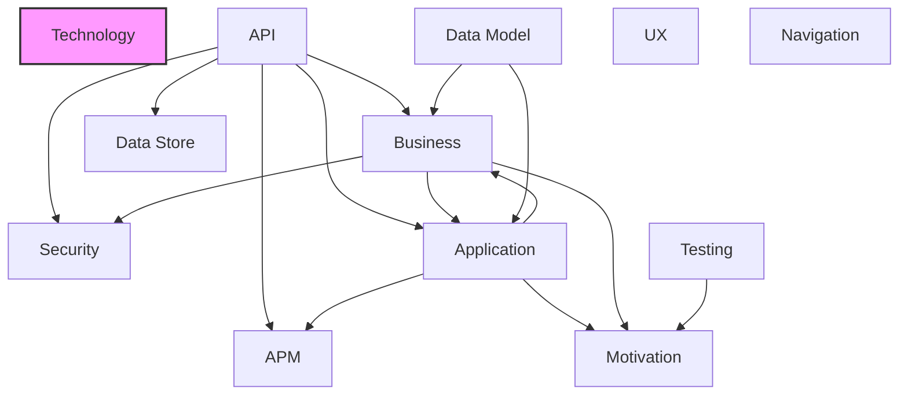

# Technology Layer

## Report Index

- [Layer Introduction](#layer-introduction)
- [Intra-Layer Relationships](#intra-layer-relationships)
- [Inter-Layer Dependencies](#inter-layer-dependencies)
- [Inter-Layer Relationships Table](#inter-layer-relationships-table)
- [Node Reference](#node-reference)
  - [Artifact](#artifact)
  - [Communicationnetwork](#communicationnetwork)
  - [Device](#device)
  - [Node](#node)
  - [Path](#path)
  - [Systemsoftware](#systemsoftware)
  - [Technologycollaboration](#technologycollaboration)
  - [Technologyevent](#technologyevent)
  - [Technologyfunction](#technologyfunction)
  - [Technologyinteraction](#technologyinteraction)
  - [Technologyinterface](#technologyinterface)
  - [Technologyprocess](#technologyprocess)
  - [Technologyservice](#technologyservice)

## Layer Introduction

**Layer 5**: Technology
**Standard**: [ArchiMate 3.2](https://pubs.opengroup.org/architecture/archimate32-doc/)

Layer 5: Technology Layer

### Statistics

| Metric                    | Count |
| ------------------------- | ----- |
| Node Types                | 13    |
| Intra-Layer Relationships | 85    |
| Inter-Layer Relationships | 0     |
| Inbound Relationships     | 0     |
| Outbound Relationships    | 0     |

### Layer Dependencies

**Depends On**: None

**Depended On By**: None

## Intra-Layer Relationships

```mermaid
flowchart LR
  subgraph technology
    artifact["artifact"]
    communicationnetwork["communicationnetwork"]
    device["device"]
    node["node"]
    path["path"]
    systemsoftware["systemsoftware"]
    technologycollaboration["technologycollaboration"]
    technologyevent["technologyevent"]
    technologyfunction["technologyfunction"]
    technologyinteraction["technologyinteraction"]
    technologyinterface["technologyinterface"]
    technologyprocess["technologyprocess"]
    technologyservice["technologyservice"]
    communicationnetwork -->|aggregates| communicationnetwork
    communicationnetwork -->|aggregates| path
    communicationnetwork -->|assigned-to| technologycollaboration
    communicationnetwork -->|associated-with| systemsoftware
    communicationnetwork -->|provides| technologyinterface
    communicationnetwork -->|serves| device
    communicationnetwork -->|serves| node
    communicationnetwork -->|supports| technologyservice
    device -->|composes| node
    node -->|assigned-to| technologyfunction
    node -->|composes| artifact
    node -->|composes| device
    node -->|composes| systemsoftware
    node -->|composes| technologyinterface
    path -->|assigned-to| technologyinterface
    path -->|composes| path
    path -->|flows-to| technologyservice
    path -->|realizes| technologyservice
    path -->|serves| device
    path -->|serves| node
    path -->|triggers| technologyevent
    systemsoftware -->|accesses| artifact
    systemsoftware -->|assigned-to| technologyfunction
    systemsoftware -->|composes| artifact
    systemsoftware -->|depends-on| device
    systemsoftware -->|depends-on| systemsoftware
    systemsoftware -->|provides| technologyinterface
    systemsoftware -->|realizes| technologyservice
    systemsoftware -->|serves| technologyfunction
    systemsoftware -->|triggers| technologyevent
    systemsoftware -->|uses| communicationnetwork
    systemsoftware -->|uses| path
    technologycollaboration -->|accesses| artifact
    technologycollaboration -->|aggregates| node
    technologycollaboration -->|aggregates| technologyinterface
    technologycollaboration -->|associated-with| technologycollaboration
    technologycollaboration -->|performs| technologyinteraction
    technologycollaboration -->|realizes| technologyservice
    technologycollaboration -->|triggers| technologyevent
    technologycollaboration -->|uses| communicationnetwork
    technologycollaboration -->|uses| path
    technologyevent -->|associated-with| technologyservice
    technologyevent -->|flows-to| artifact
    technologyevent -->|flows-to| technologyprocess
    technologyevent -->|triggers| technologyfunction
    technologyevent -->|triggers| technologyinteraction
    technologyevent -->|triggers| technologyprocess
    technologyfunction -->|accesses| artifact
    technologyfunction -->|composes| technologyfunction
    technologyfunction -->|flows-to| technologyprocess
    technologyfunction -->|realizes| technologyservice
    technologyfunction -->|serves| technologyinteraction
    technologyfunction -->|triggers| technologyevent
    technologyfunction -->|triggers| technologyprocess
    technologyfunction -->|uses| technologyinterface
    technologyinteraction -->|accesses| artifact
    technologyinteraction -->|composes| technologyfunction
    technologyinteraction -->|flows-to| technologyinteraction
    technologyinteraction -->|realizes| technologycollaboration
    technologyinteraction -->|realizes| technologyservice
    technologyinteraction -->|triggers| technologyevent
    technologyinteraction -->|triggers| technologyprocess
    technologyinteraction -->|uses| technologyinterface
    technologyinterface -->|assigned-to| node
    technologyinterface -->|assigned-to| systemsoftware
    technologyinterface -->|assigned-to| technologyservice
    technologyinterface -->|serves| technologycollaboration
    technologyinterface -->|serves| technologyfunction
    technologyinterface -->|serves| technologyprocess
    technologyinterface -->|uses| communicationnetwork
    technologyinterface -->|uses| path
    technologyprocess -->|realizes| technologyservice
    technologyprocess -->|triggers| technologyevent
    technologyprocess -->|uses| path
    technologyservice -->|aggregates| technologyfunction
    technologyservice -->|associated-with| technologycollaboration
    technologyservice -->|consumes| artifact
    technologyservice -->|depends-on| communicationnetwork
    technologyservice -->|depends-on| node
    technologyservice -->|flows-to| technologyservice
    technologyservice -->|provides| technologyinterface
    technologyservice -->|serves| technologyinterface
    technologyservice -->|serves| technologyservice
    technologyservice -->|triggers| technologyevent
    technologyservice -->|uses| systemsoftware
  end
```

## Inter-Layer Dependencies

## Inter-Layer Relationships Table

No inter-layer relationships defined.

## Node Reference

### Artifact {#artifact}

**Spec Node ID**: `technology.artifact`

A piece of data that is used or produced in a software development process, or by the deployment and operation of an IT system, such as a source file, executable, script, or configuration file.

#### Relationship Metrics

- **Intra-Layer**: Inbound: 8 | Outbound: 0
- **Inter-Layer**: Inbound: 0 | Outbound: 0

#### Intra-Layer Relationships

| Related Node                                        | Predicate | Direction | Cardinality |
| --------------------------------------------------- | --------- | --------- | ----------- |
| [node](#node)                                       | composes  | inbound   | many-to-one |
| [systemsoftware](#systemsoftware)                   | accesses  | inbound   | many-to-one |
| [systemsoftware](#systemsoftware)                   | composes  | inbound   | many-to-one |
| [technologycollaboration](#technologycollaboration) | accesses  | inbound   | many-to-one |
| [technologyevent](#technologyevent)                 | flows-to  | inbound   | many-to-one |
| [technologyfunction](#technologyfunction)           | accesses  | inbound   | many-to-one |
| [technologyinteraction](#technologyinteraction)     | accesses  | inbound   | many-to-one |
| [technologyservice](#technologyservice)             | consumes  | inbound   | many-to-one |

[Back to Index](#report-index)

### Communicationnetwork {#communicationnetwork}

**Spec Node ID**: `technology.communicationnetwork`

A set of structures that connects nodes for the purpose of transmission, routing, and reception of data, such as a LAN, WAN, or VPN.

#### Relationship Metrics

- **Intra-Layer**: Inbound: 5 | Outbound: 8
- **Inter-Layer**: Inbound: 0 | Outbound: 0

#### Intra-Layer Relationships

| Related Node                                        | Predicate       | Direction | Cardinality |
| --------------------------------------------------- | --------------- | --------- | ----------- |
| [communicationnetwork](#communicationnetwork)       | aggregates      | outbound  | many-to-one |
| [path](#path)                                       | aggregates      | outbound  | many-to-one |
| [technologycollaboration](#technologycollaboration) | assigned-to     | outbound  | many-to-one |
| [systemsoftware](#systemsoftware)                   | associated-with | outbound  | many-to-one |
| [technologyinterface](#technologyinterface)         | provides        | outbound  | many-to-one |
| [device](#device)                                   | serves          | outbound  | many-to-one |
| [node](#node)                                       | serves          | outbound  | many-to-one |
| [technologyservice](#technologyservice)             | supports        | outbound  | many-to-one |
| [systemsoftware](#systemsoftware)                   | uses            | inbound   | many-to-one |
| [technologycollaboration](#technologycollaboration) | uses            | inbound   | many-to-one |
| [technologyinterface](#technologyinterface)         | uses            | inbound   | many-to-one |
| [technologyservice](#technologyservice)             | depends-on      | inbound   | many-to-one |

[Back to Index](#report-index)

### Device {#device}

**Spec Node ID**: `technology.device`

A physical IT resource upon which system software and artifacts may be stored or deployed for execution, such as a server, workstation, mobile device, or IoT sensor.

#### Relationship Metrics

- **Intra-Layer**: Inbound: 4 | Outbound: 1
- **Inter-Layer**: Inbound: 0 | Outbound: 0

#### Intra-Layer Relationships

| Related Node                                  | Predicate  | Direction | Cardinality |
| --------------------------------------------- | ---------- | --------- | ----------- |
| [communicationnetwork](#communicationnetwork) | serves     | inbound   | many-to-one |
| [node](#node)                                 | composes   | outbound  | many-to-one |
| [node](#node)                                 | composes   | inbound   | many-to-one |
| [path](#path)                                 | serves     | inbound   | many-to-one |
| [systemsoftware](#systemsoftware)             | depends-on | inbound   | many-to-one |

[Back to Index](#report-index)

### Node {#node}

**Spec Node ID**: `technology.node`

A computational or physical resource that hosts, manipulates, or interacts with other computational or physical resources, such as a server cluster, virtual machine host, or container runtime.

#### Relationship Metrics

- **Intra-Layer**: Inbound: 6 | Outbound: 5
- **Inter-Layer**: Inbound: 0 | Outbound: 0

#### Intra-Layer Relationships

| Related Node                                        | Predicate   | Direction | Cardinality |
| --------------------------------------------------- | ----------- | --------- | ----------- |
| [communicationnetwork](#communicationnetwork)       | serves      | inbound   | many-to-one |
| [device](#device)                                   | composes    | inbound   | many-to-one |
| [technologyfunction](#technologyfunction)           | assigned-to | outbound  | many-to-one |
| [artifact](#artifact)                               | composes    | outbound  | many-to-one |
| [device](#device)                                   | composes    | outbound  | many-to-one |
| [systemsoftware](#systemsoftware)                   | composes    | outbound  | many-to-one |
| [technologyinterface](#technologyinterface)         | composes    | outbound  | many-to-one |
| [path](#path)                                       | serves      | inbound   | many-to-one |
| [technologycollaboration](#technologycollaboration) | aggregates  | inbound   | many-to-one |
| [technologyinterface](#technologyinterface)         | assigned-to | inbound   | many-to-one |
| [technologyservice](#technologyservice)             | depends-on  | inbound   | many-to-one |

[Back to Index](#report-index)

### Path {#path}

**Spec Node ID**: `technology.path`

A link between two or more nodes through which those nodes can exchange data, representing a logical communication channel such as a network route, API connection, or message channel.

#### Relationship Metrics

- **Intra-Layer**: Inbound: 6 | Outbound: 7
- **Inter-Layer**: Inbound: 0 | Outbound: 0

#### Intra-Layer Relationships

| Related Node                                        | Predicate   | Direction | Cardinality |
| --------------------------------------------------- | ----------- | --------- | ----------- |
| [communicationnetwork](#communicationnetwork)       | aggregates  | inbound   | many-to-one |
| [technologyinterface](#technologyinterface)         | assigned-to | outbound  | many-to-one |
| [path](#path)                                       | composes    | outbound  | many-to-one |
| [technologyservice](#technologyservice)             | flows-to    | outbound  | many-to-one |
| [technologyservice](#technologyservice)             | realizes    | outbound  | many-to-one |
| [device](#device)                                   | serves      | outbound  | many-to-one |
| [node](#node)                                       | serves      | outbound  | many-to-one |
| [technologyevent](#technologyevent)                 | triggers    | outbound  | many-to-one |
| [systemsoftware](#systemsoftware)                   | uses        | inbound   | many-to-one |
| [technologycollaboration](#technologycollaboration) | uses        | inbound   | many-to-one |
| [technologyinterface](#technologyinterface)         | uses        | inbound   | many-to-one |
| [technologyprocess](#technologyprocess)             | uses        | inbound   | many-to-one |

[Back to Index](#report-index)

### Systemsoftware {#systemsoftware}

**Spec Node ID**: `technology.systemsoftware`

Software that provides or contributes to an environment for storing, executing, and using other software or data deployed within it, such as an operating system, container runtime, database engine, or middleware platform.

#### Relationship Metrics

- **Intra-Layer**: Inbound: 5 | Outbound: 11
- **Inter-Layer**: Inbound: 0 | Outbound: 0

#### Intra-Layer Relationships

| Related Node                                  | Predicate       | Direction | Cardinality |
| --------------------------------------------- | --------------- | --------- | ----------- |
| [communicationnetwork](#communicationnetwork) | associated-with | inbound   | many-to-one |
| [node](#node)                                 | composes        | inbound   | many-to-one |
| [artifact](#artifact)                         | accesses        | outbound  | many-to-one |
| [technologyfunction](#technologyfunction)     | assigned-to     | outbound  | many-to-one |
| [artifact](#artifact)                         | composes        | outbound  | many-to-one |
| [device](#device)                             | depends-on      | outbound  | many-to-one |
| [systemsoftware](#systemsoftware)             | depends-on      | outbound  | many-to-one |
| [technologyinterface](#technologyinterface)   | provides        | outbound  | many-to-one |
| [technologyservice](#technologyservice)       | realizes        | outbound  | many-to-one |
| [technologyfunction](#technologyfunction)     | serves          | outbound  | many-to-one |
| [technologyevent](#technologyevent)           | triggers        | outbound  | many-to-one |
| [communicationnetwork](#communicationnetwork) | uses            | outbound  | many-to-one |
| [path](#path)                                 | uses            | outbound  | many-to-one |
| [technologyinterface](#technologyinterface)   | assigned-to     | inbound   | many-to-one |
| [technologyservice](#technologyservice)       | uses            | inbound   | many-to-one |

[Back to Index](#report-index)

### Technologycollaboration {#technologycollaboration}

**Spec Node ID**: `technology.technologycollaboration`

An aggregate of two or more technology active structure elements that work together to perform collective technology behavior, such as a cluster of servers, a distributed cache, or a microservice mesh.

#### Relationship Metrics

- **Intra-Layer**: Inbound: 5 | Outbound: 9
- **Inter-Layer**: Inbound: 0 | Outbound: 0

#### Intra-Layer Relationships

| Related Node                                        | Predicate       | Direction | Cardinality |
| --------------------------------------------------- | --------------- | --------- | ----------- |
| [communicationnetwork](#communicationnetwork)       | assigned-to     | inbound   | many-to-one |
| [artifact](#artifact)                               | accesses        | outbound  | many-to-one |
| [node](#node)                                       | aggregates      | outbound  | many-to-one |
| [technologyinterface](#technologyinterface)         | aggregates      | outbound  | many-to-one |
| [technologycollaboration](#technologycollaboration) | associated-with | outbound  | many-to-one |
| [technologyinteraction](#technologyinteraction)     | performs        | outbound  | many-to-one |
| [technologyservice](#technologyservice)             | realizes        | outbound  | many-to-one |
| [technologyevent](#technologyevent)                 | triggers        | outbound  | many-to-one |
| [communicationnetwork](#communicationnetwork)       | uses            | outbound  | many-to-one |
| [path](#path)                                       | uses            | outbound  | many-to-one |
| [technologyinteraction](#technologyinteraction)     | realizes        | inbound   | many-to-one |
| [technologyinterface](#technologyinterface)         | serves          | inbound   | many-to-one |
| [technologyservice](#technologyservice)             | associated-with | inbound   | many-to-one |

[Back to Index](#report-index)

### Technologyevent {#technologyevent}

**Spec Node ID**: `technology.technologyevent`

A technology behavior element that denotes a state change in the technology layer that triggers or results from technology behavior, such as a system alert, infrastructure notification, scheduled job trigger, or deployment completion signal.

#### Relationship Metrics

- **Intra-Layer**: Inbound: 7 | Outbound: 6
- **Inter-Layer**: Inbound: 0 | Outbound: 0

#### Intra-Layer Relationships

| Related Node                                        | Predicate       | Direction | Cardinality |
| --------------------------------------------------- | --------------- | --------- | ----------- |
| [path](#path)                                       | triggers        | inbound   | many-to-one |
| [systemsoftware](#systemsoftware)                   | triggers        | inbound   | many-to-one |
| [technologycollaboration](#technologycollaboration) | triggers        | inbound   | many-to-one |
| [technologyservice](#technologyservice)             | associated-with | outbound  | many-to-one |
| [artifact](#artifact)                               | flows-to        | outbound  | many-to-one |
| [technologyprocess](#technologyprocess)             | flows-to        | outbound  | many-to-one |
| [technologyfunction](#technologyfunction)           | triggers        | outbound  | many-to-one |
| [technologyinteraction](#technologyinteraction)     | triggers        | outbound  | many-to-one |
| [technologyprocess](#technologyprocess)             | triggers        | outbound  | many-to-one |
| [technologyfunction](#technologyfunction)           | triggers        | inbound   | many-to-one |
| [technologyinteraction](#technologyinteraction)     | triggers        | inbound   | many-to-one |
| [technologyprocess](#technologyprocess)             | triggers        | inbound   | many-to-one |
| [technologyservice](#technologyservice)             | triggers        | inbound   | many-to-one |

[Back to Index](#report-index)

### Technologyfunction {#technologyfunction}

**Spec Node ID**: `technology.technologyfunction`

A collection of technology behavior that can be performed by a node, representing an internal automated capability such as data replication, load balancing, or log rotation.

#### Relationship Metrics

- **Intra-Layer**: Inbound: 8 | Outbound: 8
- **Inter-Layer**: Inbound: 0 | Outbound: 0

#### Intra-Layer Relationships

| Related Node                                    | Predicate   | Direction | Cardinality |
| ----------------------------------------------- | ----------- | --------- | ----------- |
| [node](#node)                                   | assigned-to | inbound   | many-to-one |
| [systemsoftware](#systemsoftware)               | assigned-to | inbound   | many-to-one |
| [systemsoftware](#systemsoftware)               | serves      | inbound   | many-to-one |
| [technologyevent](#technologyevent)             | triggers    | inbound   | many-to-one |
| [artifact](#artifact)                           | accesses    | outbound  | many-to-one |
| [technologyfunction](#technologyfunction)       | composes    | outbound  | many-to-one |
| [technologyprocess](#technologyprocess)         | flows-to    | outbound  | many-to-one |
| [technologyservice](#technologyservice)         | realizes    | outbound  | many-to-one |
| [technologyinteraction](#technologyinteraction) | serves      | outbound  | many-to-one |
| [technologyevent](#technologyevent)             | triggers    | outbound  | many-to-one |
| [technologyprocess](#technologyprocess)         | triggers    | outbound  | many-to-one |
| [technologyinterface](#technologyinterface)     | uses        | outbound  | many-to-one |
| [technologyinteraction](#technologyinteraction) | composes    | inbound   | many-to-one |
| [technologyinterface](#technologyinterface)     | serves      | inbound   | many-to-one |
| [technologyservice](#technologyservice)         | aggregates  | inbound   | many-to-one |

[Back to Index](#report-index)

### Technologyinteraction {#technologyinteraction}

**Spec Node ID**: `technology.technologyinteraction`

A unit of collective technology behavior performed by two or more collaborating nodes, such as a distributed transaction, inter-service handshake, or cluster failover protocol.

#### Relationship Metrics

- **Intra-Layer**: Inbound: 4 | Outbound: 8
- **Inter-Layer**: Inbound: 0 | Outbound: 0

#### Intra-Layer Relationships

| Related Node                                        | Predicate | Direction | Cardinality |
| --------------------------------------------------- | --------- | --------- | ----------- |
| [technologycollaboration](#technologycollaboration) | performs  | inbound   | many-to-one |
| [technologyevent](#technologyevent)                 | triggers  | inbound   | many-to-one |
| [technologyfunction](#technologyfunction)           | serves    | inbound   | many-to-one |
| [artifact](#artifact)                               | accesses  | outbound  | many-to-one |
| [technologyfunction](#technologyfunction)           | composes  | outbound  | many-to-one |
| [technologyinteraction](#technologyinteraction)     | flows-to  | outbound  | many-to-one |
| [technologycollaboration](#technologycollaboration) | realizes  | outbound  | many-to-one |
| [technologyservice](#technologyservice)             | realizes  | outbound  | many-to-one |
| [technologyevent](#technologyevent)                 | triggers  | outbound  | many-to-one |
| [technologyprocess](#technologyprocess)             | triggers  | outbound  | many-to-one |
| [technologyinterface](#technologyinterface)         | uses      | outbound  | many-to-one |

[Back to Index](#report-index)

### Technologyinterface {#technologyinterface}

**Spec Node ID**: `technology.technologyinterface`

Point of access where technology services are available

#### Relationship Metrics

- **Intra-Layer**: Inbound: 9 | Outbound: 8
- **Inter-Layer**: Inbound: 0 | Outbound: 0

#### Intra-Layer Relationships

| Related Node                                        | Predicate   | Direction | Cardinality |
| --------------------------------------------------- | ----------- | --------- | ----------- |
| [communicationnetwork](#communicationnetwork)       | provides    | inbound   | many-to-one |
| [node](#node)                                       | composes    | inbound   | many-to-one |
| [path](#path)                                       | assigned-to | inbound   | many-to-one |
| [systemsoftware](#systemsoftware)                   | provides    | inbound   | many-to-one |
| [technologycollaboration](#technologycollaboration) | aggregates  | inbound   | many-to-one |
| [technologyfunction](#technologyfunction)           | uses        | inbound   | many-to-one |
| [technologyinteraction](#technologyinteraction)     | uses        | inbound   | many-to-one |
| [node](#node)                                       | assigned-to | outbound  | many-to-one |
| [systemsoftware](#systemsoftware)                   | assigned-to | outbound  | many-to-one |
| [technologyservice](#technologyservice)             | assigned-to | outbound  | many-to-one |
| [technologycollaboration](#technologycollaboration) | serves      | outbound  | many-to-one |
| [technologyfunction](#technologyfunction)           | serves      | outbound  | many-to-one |
| [technologyprocess](#technologyprocess)             | serves      | outbound  | many-to-one |
| [communicationnetwork](#communicationnetwork)       | uses        | outbound  | many-to-one |
| [path](#path)                                       | uses        | outbound  | many-to-one |
| [technologyservice](#technologyservice)             | provides    | inbound   | many-to-one |
| [technologyservice](#technologyservice)             | serves      | inbound   | many-to-one |

[Back to Index](#report-index)

### Technologyprocess {#technologyprocess}

**Spec Node ID**: `technology.technologyprocess`

A sequence of technology behaviors that achieves a specific technology result, such as a deployment pipeline, backup job, certificate renewal workflow, or container orchestration sequence.

#### Relationship Metrics

- **Intra-Layer**: Inbound: 6 | Outbound: 3
- **Inter-Layer**: Inbound: 0 | Outbound: 0

#### Intra-Layer Relationships

| Related Node                                    | Predicate | Direction | Cardinality |
| ----------------------------------------------- | --------- | --------- | ----------- |
| [technologyevent](#technologyevent)             | flows-to  | inbound   | many-to-one |
| [technologyevent](#technologyevent)             | triggers  | inbound   | many-to-one |
| [technologyfunction](#technologyfunction)       | flows-to  | inbound   | many-to-one |
| [technologyfunction](#technologyfunction)       | triggers  | inbound   | many-to-one |
| [technologyinteraction](#technologyinteraction) | triggers  | inbound   | many-to-one |
| [technologyinterface](#technologyinterface)     | serves    | inbound   | many-to-one |
| [technologyservice](#technologyservice)         | realizes  | outbound  | many-to-one |
| [technologyevent](#technologyevent)             | triggers  | outbound  | many-to-one |
| [path](#path)                                   | uses      | outbound  | many-to-one |

[Back to Index](#report-index)

### Technologyservice {#technologyservice}

**Spec Node ID**: `technology.technologyservice`

Externally visible unit of technology functionality

#### Relationship Metrics

- **Intra-Layer**: Inbound: 12 | Outbound: 11
- **Inter-Layer**: Inbound: 0 | Outbound: 0

#### Intra-Layer Relationships

| Related Node                                        | Predicate       | Direction | Cardinality |
| --------------------------------------------------- | --------------- | --------- | ----------- |
| [communicationnetwork](#communicationnetwork)       | supports        | inbound   | many-to-one |
| [path](#path)                                       | flows-to        | inbound   | many-to-one |
| [path](#path)                                       | realizes        | inbound   | many-to-one |
| [systemsoftware](#systemsoftware)                   | realizes        | inbound   | many-to-one |
| [technologycollaboration](#technologycollaboration) | realizes        | inbound   | many-to-one |
| [technologyevent](#technologyevent)                 | associated-with | inbound   | many-to-one |
| [technologyfunction](#technologyfunction)           | realizes        | inbound   | many-to-one |
| [technologyinteraction](#technologyinteraction)     | realizes        | inbound   | many-to-one |
| [technologyinterface](#technologyinterface)         | assigned-to     | inbound   | many-to-one |
| [technologyprocess](#technologyprocess)             | realizes        | inbound   | many-to-one |
| [technologyfunction](#technologyfunction)           | aggregates      | outbound  | many-to-one |
| [technologycollaboration](#technologycollaboration) | associated-with | outbound  | many-to-one |
| [artifact](#artifact)                               | consumes        | outbound  | many-to-one |
| [communicationnetwork](#communicationnetwork)       | depends-on      | outbound  | many-to-one |
| [node](#node)                                       | depends-on      | outbound  | many-to-one |
| [technologyservice](#technologyservice)             | flows-to        | outbound  | many-to-one |
| [technologyinterface](#technologyinterface)         | provides        | outbound  | many-to-one |
| [technologyinterface](#technologyinterface)         | serves          | outbound  | many-to-one |
| [technologyservice](#technologyservice)             | serves          | outbound  | many-to-one |
| [technologyevent](#technologyevent)                 | triggers        | outbound  | many-to-one |
| [systemsoftware](#systemsoftware)                   | uses            | outbound  | many-to-one |

[Back to Index](#report-index)

---

_Generated: 2026-02-28T15:47:18.823Z | Spec Version: 0.8.1 | Generator: generate-layer-reports.ts_
