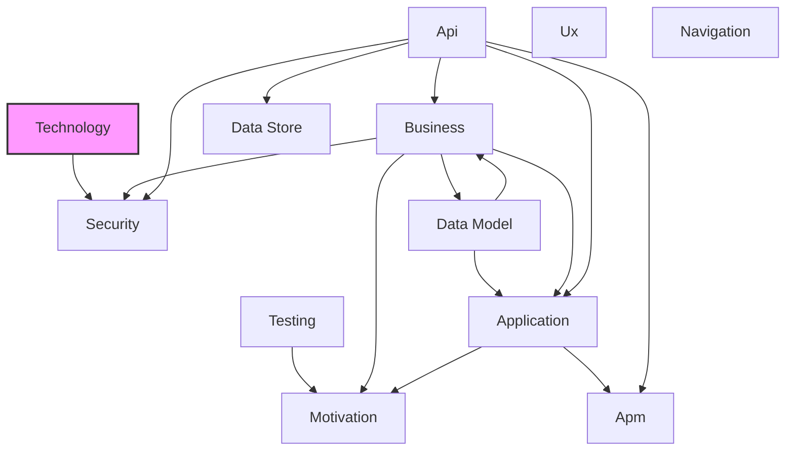

# Technology Layer

## Report Index

- [Layer Introduction](#layer-introduction)
- [Intra-Layer Relationships Diagram](#intra-layer-relationships)
- [Inter-Layer Dependencies Diagram](#inter-layer-dependencies)
- [Inter-Layer Relationships Table](#inter-layer-relationships-table)
- [Node Reference](#node-reference)
  - [Artifact](#artifact)
  - [Artifacttype](#artifacttype)
  - [Communicationnetwork](#communicationnetwork)
  - [Device](#device)
  - [Devicetype](#devicetype)
  - [Networktype](#networktype)
  - [Node](#node)
  - [Nodetype](#nodetype)
  - [Path](#path)
  - [Pathtype](#pathtype)
  - [Systemsoftware](#systemsoftware)
  - [Systemsoftwaretype](#systemsoftwaretype)
  - [Techeventtype](#techeventtype)
  - [Technologycollaboration](#technologycollaboration)
  - [Technologyevent](#technologyevent)
  - [Technologyfunction](#technologyfunction)
  - [Technologyinteraction](#technologyinteraction)
  - [Technologyinterface](#technologyinterface)
  - [Technologyprocess](#technologyprocess)
  - [Technologyservice](#technologyservice)
  - [Techprotocol](#techprotocol)
  - [Techservicetype](#techservicetype)

## Layer Introduction

**Layer 5**: Technology
**Standard**: [ArchiMate 3.2](https://pubs.opengroup.org/architecture/archimate32-doc/)

Layer 5: Technology Layer

### Statistics

| Metric                    | Count |
| ------------------------- | ----- |
| Node Types                | 22    |
| Intra-Layer Relationships | 0     |
| Inter-Layer Relationships | 2     |
| Inbound Relationships     | 0     |
| Outbound Relationships    | 2     |

### Layer Dependencies

**Depends On**: None
**Depended On By**: [Security](./03-security-layer-report.md)

## Intra-Layer Relationships

No intra-layer relationships defined.

## Inter-Layer Dependencies

## Inter-Layer Relationships Table

| Relationship ID                                            | Source Node           | Dest Node                                                                    | Dest Layer                                | Predicate      | Cardinality | Strength |
| ---------------------------------------------------------- | --------------------- | ---------------------------------------------------------------------------- | ----------------------------------------- | -------------- | ----------- | -------- |
| technology.artifact.classification.security.classification | [artifact](#artifact) | [classification](<[Security](./03-security-layer-report.md)#classification>) | [Security](./03-security-layer-report.md) | classification | many-to-one | low      |
| technology.artifact.referenced-by.security.classification  | [artifact](#artifact) | [classification](<[Security](./03-security-layer-report.md)#classification>) | [Security](./03-security-layer-report.md) | referenced-by  | many-to-one | medium   |

## Node Reference

### Artifact

**Spec Node ID**: `technology.artifact`

Physical piece of data used or produced

#### Inter-Layer Relationships

| Related Node                                                                 | Layer                                     | Predicate      | Direction | Cardinality |
| ---------------------------------------------------------------------------- | ----------------------------------------- | -------------- | --------- | ----------- |
| [classification](<[Security](./03-security-layer-report.md)#classification>) | [Security](./03-security-layer-report.md) | classification | outbound  | many-to-one |
| [classification](<[Security](./03-security-layer-report.md)#classification>) | [Security](./03-security-layer-report.md) | referenced-by  | outbound  | many-to-one |

[Back to Index](#report-index)

### Artifacttype

**Spec Node ID**: `technology.artifacttype`

ArtifactType element in Technology Layer

[Back to Index](#report-index)

### Communicationnetwork

**Spec Node ID**: `technology.communicationnetwork`

Set of structures that connects nodes

[Back to Index](#report-index)

### Device

**Spec Node ID**: `technology.device`

Physical IT resource with processing capability

[Back to Index](#report-index)

### Devicetype

**Spec Node ID**: `technology.devicetype`

DeviceType element in Technology Layer

[Back to Index](#report-index)

### Networktype

**Spec Node ID**: `technology.networktype`

NetworkType element in Technology Layer

[Back to Index](#report-index)

### Node

**Spec Node ID**: `technology.node`

Computational or physical resource that hosts artifacts

[Back to Index](#report-index)

### Nodetype

**Spec Node ID**: `technology.nodetype`

NodeType element in Technology Layer

[Back to Index](#report-index)

### Path

**Spec Node ID**: `technology.path`

Link between nodes through which they exchange

[Back to Index](#report-index)

### Pathtype

**Spec Node ID**: `technology.pathtype`

PathType element in Technology Layer

[Back to Index](#report-index)

### Systemsoftware

**Spec Node ID**: `technology.systemsoftware`

Software that provides platform for applications

[Back to Index](#report-index)

### Systemsoftwaretype

**Spec Node ID**: `technology.systemsoftwaretype`

SystemSoftwareType element in Technology Layer

[Back to Index](#report-index)

### Techeventtype

**Spec Node ID**: `technology.techeventtype`

TechEventType element in Technology Layer

[Back to Index](#report-index)

### Technologycollaboration

**Spec Node ID**: `technology.technologycollaboration`

Aggregate of nodes working together

[Back to Index](#report-index)

### Technologyevent

**Spec Node ID**: `technology.technologyevent`

Technology state change

[Back to Index](#report-index)

### Technologyfunction

**Spec Node ID**: `technology.technologyfunction`

Collection of technology behavior

[Back to Index](#report-index)

### Technologyinteraction

**Spec Node ID**: `technology.technologyinteraction`

Unit of collective technology behavior

[Back to Index](#report-index)

### Technologyinterface

**Spec Node ID**: `technology.technologyinterface`

Point of access where technology services are available

[Back to Index](#report-index)

### Technologyprocess

**Spec Node ID**: `technology.technologyprocess`

Sequence of technology behaviors

[Back to Index](#report-index)

### Technologyservice

**Spec Node ID**: `technology.technologyservice`

Externally visible unit of technology functionality

[Back to Index](#report-index)

### Techprotocol

**Spec Node ID**: `technology.techprotocol`

TechProtocol element in Technology Layer

[Back to Index](#report-index)

### Techservicetype

**Spec Node ID**: `technology.techservicetype`

TechServiceType element in Technology Layer

[Back to Index](#report-index)

---

_Generated: 2026-02-11T21:36:57.794Z | Generator: generate-layer-reports.ts_
