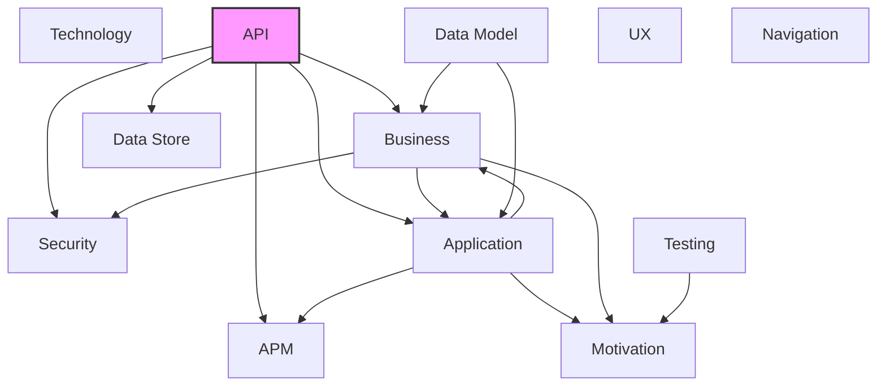

# API Layer

## Report Index

- [Layer Introduction](#layer-introduction)
- [Intra-Layer Relationships](#intra-layer-relationships)
- [Inter-Layer Dependencies](#inter-layer-dependencies)
- [Inter-Layer Relationships Table](#inter-layer-relationships-table)
- [Node Reference](#node-reference)
  - [Callback](#callback)
  - [Components](#components)
  - [Contact](#contact)
  - [Encoding](#encoding)
  - [Example](#example)
  - [Externaldocumentation](#externaldocumentation)
  - [Header](#header)
  - [Info](#info)
  - [License](#license)
  - [Link](#link)
  - [Mediatype](#mediatype)
  - [Oauthflow](#oauthflow)
  - [Oauthflows](#oauthflows)
  - [Openapidocument](#openapidocument)
  - [Operation](#operation)
  - [Parameter](#parameter)
  - [Pathitem](#pathitem)
  - [Paths](#paths)
  - [Ratelimit](#ratelimit)
  - [Requestbody](#requestbody)
  - [Response](#response)
  - [Responses](#responses)
  - [Schema](#schema)
  - [Securityscheme](#securityscheme)
  - [Server](#server)
  - [Servervariable](#servervariable)
  - [Tag](#tag)

## Layer Introduction

**Layer 6**: API
**Standard**: [OpenAPI 3.0](https://spec.openapis.org/oas/v3.0.0)

Layer 6: API Layer

### Statistics

| Metric                    | Count |
| ------------------------- | ----- |
| Node Types                | 27    |
| Intra-Layer Relationships | 130   |
| Inter-Layer Relationships | 14    |
| Inbound Relationships     | 0     |
| Outbound Relationships    | 14    |

### Layer Dependencies

**Depends On**: None

**Depended On By**: [Business](./02-business-layer-report.md), [Security](./03-security-layer-report.md), [Application](./04-application-layer-report.md), [Data Store](./08-data-store-layer-report.md), [APM](./11-apm-layer-report.md)

## Intra-Layer Relationships

```mermaid
flowchart LR
  subgraph api
    callback["callback"]
    components["components"]
    contact["contact"]
    encoding["encoding"]
    example["example"]
    externaldocumentation["externaldocumentation"]
    header["header"]
    info["info"]
    license["license"]
    link["link"]
    mediatype["mediatype"]
    oauthflow["oauthflow"]
    oauthflows["oauthflows"]
    openapidocument["openapidocument"]
    operation["operation"]
    parameter["parameter"]
    pathitem["pathitem"]
    paths["paths"]
    ratelimit["ratelimit"]
    requestbody["requestbody"]
    response["response"]
    responses["responses"]
    schema["schema"]
    securityscheme["securityscheme"]
    server["server"]
    servervariable["servervariable"]
    tag["tag"]
    callback -->|aggregates| pathitem
    components -->|aggregates| callback
    components -->|aggregates| example
    components -->|aggregates| link
    components -->|aggregates| requestbody
    components -->|aggregates| response
    components -->|composes| header
    components -->|composes| parameter
    components -->|composes| paths
    components -->|composes| response
    components -->|composes| responses
    components -->|composes| schema
    components -->|composes| securityscheme
    contact -->|associated-with| openapidocument
    encoding -->|associated-with| mediatype
    encoding -->|associated-with| parameter
    encoding -->|composes| header
    encoding -->|references| header
    encoding -->|references| schema
    example -->|associated-with| operation
    example -->|references| schema
    header -->|associated-with| securityscheme
    header -->|references| example
    header -->|references| schema
    header -->|specializes| parameter
    info -->|aggregates| contact
    info -->|aggregates| license
    info -->|associated-with| openapidocument
    license -->|associated-with| openapidocument
    link -->|references| operation
    link -->|references| schema
    link -->|references| tag
    mediatype -->|aggregates| encoding
    mediatype -->|aggregates| example
    mediatype -->|associated-with| header
    mediatype -->|composes| encoding
    mediatype -->|composes| schema
    mediatype -->|references| example
    mediatype -->|references| schema
    mediatype -->|serves| requestbody
    mediatype -->|serves| response
    oauthflow -->|aggregates| tag
    oauthflow -->|associated-with| oauthflows
    oauthflow -->|associated-with| ratelimit
    oauthflow -->|references| server
    oauthflow -->|serves| operation
    oauthflow -->|serves| securityscheme
    oauthflows -->|aggregates| oauthflow
    oauthflows -->|associated-with| components
    oauthflows -->|associated-with| operation
    oauthflows -->|composes| oauthflow
    oauthflows -->|serves| securityscheme
    openapidocument -->|aggregates| server
    openapidocument -->|aggregates| tag
    openapidocument -->|composes| components
    openapidocument -->|composes| info
    openapidocument -->|composes| paths
    openapidocument -->|composes| responses
    openapidocument -->|composes| schema
    operation -->|aggregates| parameter
    operation -->|aggregates| requestbody
    operation -->|aggregates| server
    operation -->|aggregates| tag
    operation -->|composes| paths
    operation -->|composes| responses
    operation -->|composes| schema
    operation -->|delivers| response
    operation -->|references| operation
    operation -->|references| schema
    operation -->|references| tag
    operation -->|triggers| callback
    operation -->|uses| securityscheme
    parameter -->|references| example
    parameter -->|references| operation
    parameter -->|references| schema
    parameter -->|references| tag
    pathitem -->|aggregates| parameter
    pathitem -->|aggregates| server
    pathitem -->|composes| operation
    pathitem -->|references| externaldocumentation
    pathitem -->|references| pathitem
    paths -->|aggregates| pathitem
    paths -->|aggregates| server
    paths -->|associated-with| ratelimit
    paths -->|composes| pathitem
    paths -->|references| externaldocumentation
    paths -->|references| tag
    paths -->|serves| operation
    ratelimit -->|associated-with| header
    ratelimit -->|associated-with| securityscheme
    ratelimit -->|governs| operation
    ratelimit -->|serves| operation
    ratelimit -->|serves| pathitem
    ratelimit -->|specializes| ratelimit
    ratelimit -->|triggers| response
    requestbody -->|aggregates| example
    requestbody -->|aggregates| mediatype
    requestbody -->|associated-with| encoding
    requestbody -->|composes| mediatype
    requestbody -->|references| schema
    requestbody -->|serves| operation
    response -->|aggregates| header
    response -->|aggregates| mediatype
    response -->|aggregates| schema
    response -->|composes| header
    response -->|composes| link
    response -->|composes| mediatype
    response -->|references| example
    response -->|references| schema
    responses -->|aggregates| header
    responses -->|aggregates| schema
    responses -->|associated-with| ratelimit
    responses -->|composes| response
    responses -->|references| link
    responses -->|references| schema
    schema -->|references| operation
    schema -->|references| schema
    schema -->|references| tag
    schema -->|specializes| schema
    securityscheme -->|composes| oauthflows
    securityscheme -->|serves| operation
    server -->|aggregates| servervariable
    server -->|associated-with| ratelimit
    server -->|references| securityscheme
    server -->|serves| pathitem
    tag -->|aggregates| operation
    tag -->|associated-with| schema
    tag -->|associated-with| securityscheme
    tag -->|references| externaldocumentation
    tag -->|serves| operation
  end
```

## Inter-Layer Dependencies

## Inter-Layer Relationships Table

| Relationship ID                                              | Source Node                                               | Dest Node                                                                 | Dest Layer                                      | Predicate  | Cardinality | Strength |
| ------------------------------------------------------------ | --------------------------------------------------------- | ------------------------------------------------------------------------- | ----------------------------------------------- | ---------- | ----------- | -------- |
| api.operation.references.apm.traceconfiguration              | [operation](./06-api-layer-report.md#operation)           | [traceconfiguration](./11-apm-layer-report.md#traceconfiguration)         | [APM](./11-apm-layer-report.md)                 | references | many-to-one | medium   |
| api.operation.references.application.applicationservice      | [operation](./06-api-layer-report.md#operation)           | [applicationservice](./04-application-layer-report.md#applicationservice) | [Application](./04-application-layer-report.md) | references | many-to-one | medium   |
| api.operation.references.business.businessinterface          | [operation](./06-api-layer-report.md#operation)           | [businessinterface](./02-business-layer-report.md#businessinterface)      | [Business](./02-business-layer-report.md)       | references | many-to-one | medium   |
| api.operation.references.business.businessservice            | [operation](./06-api-layer-report.md#operation)           | [businessservice](./02-business-layer-report.md#businessservice)          | [Business](./02-business-layer-report.md)       | references | many-to-one | medium   |
| api.operation.references.security.secureresource             | [operation](./06-api-layer-report.md#operation)           | [secureresource](./03-security-layer-report.md#secureresource)            | [Security](./03-security-layer-report.md)       | references | many-to-one | medium   |
| api.operation.requires.security.permission                   | [operation](./06-api-layer-report.md#operation)           | [permission](./03-security-layer-report.md#permission)                    | [Security](./03-security-layer-report.md)       | requires   | many-to-one | medium   |
| api.schema.maps-to.data-store.collection                     | [schema](./06-api-layer-report.md#schema)                 | [collection](./08-data-store-layer-report.md#collection)                  | [Data Store](./08-data-store-layer-report.md)   | maps-to    | many-to-one | medium   |
| api.schema.maps-to.data-store.field                          | [schema](./06-api-layer-report.md#schema)                 | [field](./08-data-store-layer-report.md#field)                            | [Data Store](./08-data-store-layer-report.md)   | maps-to    | many-to-one | medium   |
| api.securityscheme.maps-to.data-store.collection             | [securityscheme](./06-api-layer-report.md#securityscheme) | [collection](./08-data-store-layer-report.md#collection)                  | [Data Store](./08-data-store-layer-report.md)   | maps-to    | many-to-one | medium   |
| api.securityscheme.references.application.applicationservice | [securityscheme](./06-api-layer-report.md#securityscheme) | [applicationservice](./04-application-layer-report.md#applicationservice) | [Application](./04-application-layer-report.md) | references | many-to-one | medium   |
| api.securityscheme.references.business.businessinterface     | [securityscheme](./06-api-layer-report.md#securityscheme) | [businessinterface](./02-business-layer-report.md#businessinterface)      | [Business](./02-business-layer-report.md)       | references | many-to-one | medium   |
| api.securityscheme.references.business.businessservice       | [securityscheme](./06-api-layer-report.md#securityscheme) | [businessservice](./02-business-layer-report.md#businessservice)          | [Business](./02-business-layer-report.md)       | references | many-to-one | medium   |
| api.securityscheme.references.security.secureresource        | [securityscheme](./06-api-layer-report.md#securityscheme) | [secureresource](./03-security-layer-report.md#secureresource)            | [Security](./03-security-layer-report.md)       | references | many-to-one | medium   |
| api.securityscheme.requires.security.permission              | [securityscheme](./06-api-layer-report.md#securityscheme) | [permission](./03-security-layer-report.md#permission)                    | [Security](./03-security-layer-report.md)       | requires   | many-to-one | medium   |

## Node Reference

### Callback {#callback}

**Spec Node ID**: `api.callback`

Defines a callback where the API sends asynchronous notifications to an external URL derived at runtime. A callback maps a Runtime Expression (e.g., $request.body#/callbackUrl) to a full PathItem object, meaning the callback specifies the complete HTTP interaction — method, headers, and expected response — not just a target URL. Enables event-driven integrations and async workflows.

#### Relationship Metrics

- **Intra-Layer**: Inbound: 2 | Outbound: 1
- **Inter-Layer**: Inbound: 0 | Outbound: 0

#### Intra-Layer Relationships

| Related Node              | Predicate  | Direction | Cardinality  |
| ------------------------- | ---------- | --------- | ------------ |
| [pathitem](#pathitem)     | aggregates | outbound  | many-to-one  |
| [components](#components) | aggregates | inbound   | many-to-many |
| [operation](#operation)   | triggers   | inbound   | many-to-many |

[Back to Index](#report-index)

### Components {#components}

**Spec Node ID**: `api.components`

A named registry for reusable API definition objects (schemas, responses, parameters, examples, requestBodies, headers, securitySchemes, links, callbacks) that enables $ref referencing throughout the specification. Component entries are not rendered directly — they must be referenced by operations, parameters, or schemas to take effect. Component name keys must match the pattern ^[a-zA-Z0-9.\-_]+$ per OpenAPI 3.0 — arbitrary strings are not valid component identifiers.

#### Relationship Metrics

- **Intra-Layer**: Inbound: 2 | Outbound: 12
- **Inter-Layer**: Inbound: 0 | Outbound: 0

#### Intra-Layer Relationships

| Related Node                        | Predicate       | Direction | Cardinality  |
| ----------------------------------- | --------------- | --------- | ------------ |
| [callback](#callback)               | aggregates      | outbound  | many-to-many |
| [example](#example)                 | aggregates      | outbound  | many-to-one  |
| [link](#link)                       | aggregates      | outbound  | many-to-many |
| [requestbody](#requestbody)         | aggregates      | outbound  | many-to-many |
| [response](#response)               | aggregates      | outbound  | many-to-one  |
| [header](#header)                   | composes        | outbound  | many-to-one  |
| [parameter](#parameter)             | composes        | outbound  | many-to-one  |
| [paths](#paths)                     | composes        | outbound  | many-to-many |
| [response](#response)               | composes        | outbound  | many-to-one  |
| [responses](#responses)             | composes        | outbound  | many-to-many |
| [schema](#schema)                   | composes        | outbound  | many-to-many |
| [securityscheme](#securityscheme)   | composes        | outbound  | many-to-one  |
| [oauthflows](#oauthflows)           | associated-with | inbound   | many-to-one  |
| [openapidocument](#openapidocument) | composes        | inbound   | many-to-one  |

[Back to Index](#report-index)

### Contact {#contact}

**Spec Node ID**: `api.contact`

Contact information for the API owner or maintainer, including name, email, and URL. Enables consumers to reach out for support or collaboration.

#### Relationship Metrics

- **Intra-Layer**: Inbound: 1 | Outbound: 1
- **Inter-Layer**: Inbound: 0 | Outbound: 0

#### Intra-Layer Relationships

| Related Node                        | Predicate       | Direction | Cardinality  |
| ----------------------------------- | --------------- | --------- | ------------ |
| [openapidocument](#openapidocument) | associated-with | outbound  | many-to-many |
| [info](#info)                       | aggregates      | inbound   | many-to-one  |

[Back to Index](#report-index)

### Encoding {#encoding}

**Spec Node ID**: `api.encoding`

Specifies serialization details for multipart request body properties, including content-type, headers, and encoding style. Handles complex content negotiation. Note: a Content-Type header placed in the Encoding object's 'headers' map is ignored — use the 'contentType' attribute to set the MIME type for a multipart section.

#### Relationship Metrics

- **Intra-Layer**: Inbound: 3 | Outbound: 5
- **Inter-Layer**: Inbound: 0 | Outbound: 0

#### Intra-Layer Relationships

| Related Node                | Predicate       | Direction | Cardinality |
| --------------------------- | --------------- | --------- | ----------- |
| [mediatype](#mediatype)     | associated-with | outbound  | many-to-one |
| [parameter](#parameter)     | associated-with | outbound  | many-to-one |
| [header](#header)           | composes        | outbound  | many-to-one |
| [header](#header)           | references      | outbound  | many-to-one |
| [schema](#schema)           | references      | outbound  | many-to-one |
| [mediatype](#mediatype)     | aggregates      | inbound   | many-to-one |
| [mediatype](#mediatype)     | composes        | inbound   | many-to-one |
| [requestbody](#requestbody) | associated-with | inbound   | many-to-one |

[Back to Index](#report-index)

### Example {#example}

**Spec Node ID**: `api.example`

Provides sample values for request bodies, responses, or parameters. Improves documentation clarity and enables automated testing or mocking.

#### Relationship Metrics

- **Intra-Layer**: Inbound: 7 | Outbound: 2
- **Inter-Layer**: Inbound: 0 | Outbound: 0

#### Intra-Layer Relationships

| Related Node                | Predicate       | Direction | Cardinality |
| --------------------------- | --------------- | --------- | ----------- |
| [components](#components)   | aggregates      | inbound   | many-to-one |
| [operation](#operation)     | associated-with | outbound  | many-to-one |
| [schema](#schema)           | references      | outbound  | many-to-one |
| [header](#header)           | references      | inbound   | many-to-one |
| [mediatype](#mediatype)     | aggregates      | inbound   | many-to-one |
| [mediatype](#mediatype)     | references      | inbound   | many-to-one |
| [parameter](#parameter)     | references      | inbound   | many-to-one |
| [requestbody](#requestbody) | aggregates      | inbound   | many-to-one |
| [response](#response)       | references      | inbound   | many-to-one |

[Back to Index](#report-index)

### Externaldocumentation {#externaldocumentation}

**Spec Node ID**: `api.externaldocumentation`

A reference to external documentation resources (URLs, wikis, guides) that provide additional context beyond the inline API specification. Can be attached to the root OpenAPI document, individual Tags, Operations, and Schema objects.

#### Relationship Metrics

- **Intra-Layer**: Inbound: 3 | Outbound: 0
- **Inter-Layer**: Inbound: 0 | Outbound: 0

#### Intra-Layer Relationships

| Related Node          | Predicate  | Direction | Cardinality |
| --------------------- | ---------- | --------- | ----------- |
| [pathitem](#pathitem) | references | inbound   | many-to-one |
| [paths](#paths)       | references | inbound   | many-to-one |
| [tag](#tag)           | references | inbound   | many-to-one |

[Back to Index](#report-index)

### Header {#header}

**Spec Node ID**: `api.header`

Defines a reusable HTTP header for responses or request components. The header name is derived from its map key — the OpenAPI 3.0 Header Object does not include a 'name' field (use the 'name' attribute as a local identifier only). The 'in' location is implicitly 'header' and must not be specified, distinguishing Header from Parameter.

#### Relationship Metrics

- **Intra-Layer**: Inbound: 8 | Outbound: 4
- **Inter-Layer**: Inbound: 0 | Outbound: 0

#### Intra-Layer Relationships

| Related Node                      | Predicate       | Direction | Cardinality |
| --------------------------------- | --------------- | --------- | ----------- |
| [components](#components)         | composes        | inbound   | many-to-one |
| [encoding](#encoding)             | composes        | inbound   | many-to-one |
| [encoding](#encoding)             | references      | inbound   | many-to-one |
| [securityscheme](#securityscheme) | associated-with | outbound  | many-to-one |
| [example](#example)               | references      | outbound  | many-to-one |
| [schema](#schema)                 | references      | outbound  | many-to-one |
| [parameter](#parameter)           | specializes     | outbound  | many-to-one |
| [mediatype](#mediatype)           | associated-with | inbound   | many-to-one |
| [ratelimit](#ratelimit)           | associated-with | inbound   | many-to-one |
| [response](#response)             | aggregates      | inbound   | many-to-one |
| [response](#response)             | composes        | inbound   | many-to-one |
| [responses](#responses)           | aggregates      | inbound   | many-to-one |

[Back to Index](#report-index)

### Info {#info}

**Spec Node ID**: `api.info`

Required root-level metadata describing the API identity, version, legal terms, and maintainer contact. The 'title' and 'version' fields are required per OpenAPI 3.0. Consumed by documentation generators, API gateways, and developer portals.

#### Relationship Metrics

- **Intra-Layer**: Inbound: 1 | Outbound: 3
- **Inter-Layer**: Inbound: 0 | Outbound: 0

#### Intra-Layer Relationships

| Related Node                        | Predicate       | Direction | Cardinality |
| ----------------------------------- | --------------- | --------- | ----------- |
| [contact](#contact)                 | aggregates      | outbound  | many-to-one |
| [license](#license)                 | aggregates      | outbound  | many-to-one |
| [openapidocument](#openapidocument) | associated-with | outbound  | many-to-one |
| [openapidocument](#openapidocument) | composes        | inbound   | many-to-one |

[Back to Index](#report-index)

### License {#license}

**Spec Node ID**: `api.license`

Specifies the legal license under which the API is provided, including license name and URL to full terms. Clarifies usage rights for API consumers.

#### Relationship Metrics

- **Intra-Layer**: Inbound: 1 | Outbound: 1
- **Inter-Layer**: Inbound: 0 | Outbound: 0

#### Intra-Layer Relationships

| Related Node                        | Predicate       | Direction | Cardinality  |
| ----------------------------------- | --------------- | --------- | ------------ |
| [info](#info)                       | aggregates      | inbound   | many-to-one  |
| [openapidocument](#openapidocument) | associated-with | outbound  | many-to-many |

[Back to Index](#report-index)

### Link {#link}

**Spec Node ID**: `api.link`

Describes a relationship between API responses and subsequent operations, enabling hypermedia-driven API navigation. Supports HATEOAS design patterns.

#### Relationship Metrics

- **Intra-Layer**: Inbound: 3 | Outbound: 3
- **Inter-Layer**: Inbound: 0 | Outbound: 0

#### Intra-Layer Relationships

| Related Node              | Predicate  | Direction | Cardinality  |
| ------------------------- | ---------- | --------- | ------------ |
| [components](#components) | aggregates | inbound   | many-to-many |
| [operation](#operation)   | references | outbound  | many-to-many |
| [schema](#schema)         | references | outbound  | many-to-many |
| [tag](#tag)               | references | outbound  | many-to-many |
| [response](#response)     | composes   | inbound   | many-to-one  |
| [responses](#responses)   | references | inbound   | many-to-one  |

[Back to Index](#report-index)

### Mediatype {#mediatype}

**Spec Node ID**: `api.mediatype`

Describes the schema, examples, and encoding for a specific MIME type within a request body or response content map. Keyed by media type string (e.g., application/json).

#### Relationship Metrics

- **Intra-Layer**: Inbound: 5 | Outbound: 9
- **Inter-Layer**: Inbound: 0 | Outbound: 0

#### Intra-Layer Relationships

| Related Node                | Predicate       | Direction | Cardinality |
| --------------------------- | --------------- | --------- | ----------- |
| [encoding](#encoding)       | associated-with | inbound   | many-to-one |
| [encoding](#encoding)       | aggregates      | outbound  | many-to-one |
| [example](#example)         | aggregates      | outbound  | many-to-one |
| [header](#header)           | associated-with | outbound  | many-to-one |
| [encoding](#encoding)       | composes        | outbound  | many-to-one |
| [schema](#schema)           | composes        | outbound  | many-to-one |
| [example](#example)         | references      | outbound  | many-to-one |
| [schema](#schema)           | references      | outbound  | many-to-one |
| [requestbody](#requestbody) | serves          | outbound  | many-to-one |
| [response](#response)       | serves          | outbound  | many-to-one |
| [requestbody](#requestbody) | aggregates      | inbound   | many-to-one |
| [requestbody](#requestbody) | composes        | inbound   | many-to-one |
| [response](#response)       | aggregates      | inbound   | many-to-one |
| [response](#response)       | composes        | inbound   | many-to-one |

[Back to Index](#report-index)

### Oauthflow {#oauthflow}

**Spec Node ID**: `api.oauthflow`

Configuration for a single OAuth 2.0 grant type (implicit, password, clientCredentials, or authorizationCode). authorizationUrl is required for implicit and authorizationCode flows; tokenUrl is required for password, clientCredentials, and authorizationCode flows; scopes is required for all flows. The flow type is not an explicit field — it is implied by which attribute of the parent OAuthFlows object references this OAuthFlow.

#### Relationship Metrics

- **Intra-Layer**: Inbound: 2 | Outbound: 6
- **Inter-Layer**: Inbound: 0 | Outbound: 0

#### Intra-Layer Relationships

| Related Node                      | Predicate       | Direction | Cardinality |
| --------------------------------- | --------------- | --------- | ----------- |
| [tag](#tag)                       | aggregates      | outbound  | many-to-one |
| [oauthflows](#oauthflows)         | associated-with | outbound  | many-to-one |
| [ratelimit](#ratelimit)           | associated-with | outbound  | many-to-one |
| [server](#server)                 | references      | outbound  | many-to-one |
| [operation](#operation)           | serves          | outbound  | many-to-one |
| [securityscheme](#securityscheme) | serves          | outbound  | many-to-one |
| [oauthflows](#oauthflows)         | aggregates      | inbound   | many-to-one |
| [oauthflows](#oauthflows)         | composes        | inbound   | many-to-one |

[Back to Index](#report-index)

### Oauthflows {#oauthflows}

**Spec Node ID**: `api.oauthflows`

Configuration for OAuth 2.0 authentication flows (implicit, password, clientCredentials, authorizationCode), specifying authorization URLs, token URLs, and scopes. At least one flow attribute must be specified. Always nested within a SecurityScheme where type is 'oauth2' — cannot be used independently.

#### Relationship Metrics

- **Intra-Layer**: Inbound: 2 | Outbound: 5
- **Inter-Layer**: Inbound: 0 | Outbound: 0

#### Intra-Layer Relationships

| Related Node                      | Predicate       | Direction | Cardinality |
| --------------------------------- | --------------- | --------- | ----------- |
| [oauthflow](#oauthflow)           | associated-with | inbound   | many-to-one |
| [oauthflow](#oauthflow)           | aggregates      | outbound  | many-to-one |
| [components](#components)         | associated-with | outbound  | many-to-one |
| [operation](#operation)           | associated-with | outbound  | many-to-one |
| [oauthflow](#oauthflow)           | composes        | outbound  | many-to-one |
| [securityscheme](#securityscheme) | serves          | outbound  | many-to-one |
| [securityscheme](#securityscheme) | composes        | inbound   | one-to-one  |

[Back to Index](#report-index)

### Openapidocument {#openapidocument}

**Spec Node ID**: `api.openapidocument`

The root document object of an OpenAPI 3.0 specification. Required fields are openapi (semver string, e.g. '3.0.3'), info, and paths. Serves as the entry point for all tooling, gateways, and documentation generators.

#### Relationship Metrics

- **Intra-Layer**: Inbound: 3 | Outbound: 7
- **Inter-Layer**: Inbound: 0 | Outbound: 0

#### Intra-Layer Relationships

| Related Node              | Predicate       | Direction | Cardinality  |
| ------------------------- | --------------- | --------- | ------------ |
| [contact](#contact)       | associated-with | inbound   | many-to-many |
| [info](#info)             | associated-with | inbound   | many-to-one  |
| [license](#license)       | associated-with | inbound   | many-to-many |
| [server](#server)         | aggregates      | outbound  | many-to-many |
| [tag](#tag)               | aggregates      | outbound  | many-to-many |
| [components](#components) | composes        | outbound  | many-to-one  |
| [info](#info)             | composes        | outbound  | many-to-one  |
| [paths](#paths)           | composes        | outbound  | many-to-many |
| [responses](#responses)   | composes        | outbound  | many-to-many |
| [schema](#schema)         | composes        | outbound  | many-to-many |

[Back to Index](#report-index)

### Operation {#operation}

**Spec Node ID**: `api.operation`

Defines a single HTTP method bound to a path, specifying its contract: parameters, request body, possible responses, security requirements, and tags. Operation-level security overrides global API security requirements; an empty security array ([]) explicitly removes all security enforcement for the operation. The primary unit of API surface area in OpenAPI 3.0.

#### Relationship Metrics

- **Intra-Layer**: Inbound: 15 | Outbound: 13
- **Inter-Layer**: Inbound: 0 | Outbound: 6

#### Intra-Layer Relationships

| Related Node                      | Predicate       | Direction | Cardinality  |
| --------------------------------- | --------------- | --------- | ------------ |
| [example](#example)               | associated-with | inbound   | many-to-one  |
| [link](#link)                     | references      | inbound   | many-to-many |
| [oauthflow](#oauthflow)           | serves          | inbound   | many-to-one  |
| [oauthflows](#oauthflows)         | associated-with | inbound   | many-to-one  |
| [parameter](#parameter)           | aggregates      | outbound  | many-to-one  |
| [requestbody](#requestbody)       | aggregates      | outbound  | many-to-one  |
| [server](#server)                 | aggregates      | outbound  | many-to-many |
| [tag](#tag)                       | aggregates      | outbound  | many-to-many |
| [paths](#paths)                   | composes        | outbound  | many-to-many |
| [responses](#responses)           | composes        | outbound  | many-to-many |
| [schema](#schema)                 | composes        | outbound  | many-to-many |
| [response](#response)             | delivers        | outbound  | many-to-one  |
| [operation](#operation)           | references      | outbound  | many-to-many |
| [schema](#schema)                 | references      | outbound  | many-to-many |
| [tag](#tag)                       | references      | outbound  | many-to-many |
| [callback](#callback)             | triggers        | outbound  | many-to-many |
| [securityscheme](#securityscheme) | uses            | outbound  | many-to-one  |
| [parameter](#parameter)           | references      | inbound   | many-to-many |
| [pathitem](#pathitem)             | composes        | inbound   | many-to-one  |
| [paths](#paths)                   | serves          | inbound   | many-to-one  |
| [ratelimit](#ratelimit)           | governs         | inbound   | many-to-one  |
| [ratelimit](#ratelimit)           | serves          | inbound   | many-to-one  |
| [requestbody](#requestbody)       | serves          | inbound   | many-to-one  |
| [schema](#schema)                 | references      | inbound   | many-to-many |
| [securityscheme](#securityscheme) | serves          | inbound   | many-to-many |
| [tag](#tag)                       | aggregates      | inbound   | many-to-one  |
| [tag](#tag)                       | serves          | inbound   | many-to-one  |

#### Inter-Layer Relationships

| Related Node                                                              | Layer                                           | Predicate  | Direction | Cardinality |
| ------------------------------------------------------------------------- | ----------------------------------------------- | ---------- | --------- | ----------- |
| [traceconfiguration](./11-apm-layer-report.md#traceconfiguration)         | [APM](./11-apm-layer-report.md)                 | references | outbound  | many-to-one |
| [applicationservice](./04-application-layer-report.md#applicationservice) | [Application](./04-application-layer-report.md) | references | outbound  | many-to-one |
| [businessinterface](./02-business-layer-report.md#businessinterface)      | [Business](./02-business-layer-report.md)       | references | outbound  | many-to-one |
| [businessservice](./02-business-layer-report.md#businessservice)          | [Business](./02-business-layer-report.md)       | references | outbound  | many-to-one |
| [secureresource](./03-security-layer-report.md#secureresource)            | [Security](./03-security-layer-report.md)       | references | outbound  | many-to-one |
| [permission](./03-security-layer-report.md#permission)                    | [Security](./03-security-layer-report.md)       | requires   | outbound  | many-to-one |

[Back to Index](#report-index)

### Parameter {#parameter}

**Spec Node ID**: `api.parameter`

Defines an input to an API operation by location, name, and schema. Parameters can appear in four locations: 'path' (always required, name must match the {placeholder} in the path template), 'query' (case-sensitive name, appended to the URL), 'header' (case-insensitive name), and 'cookie'. The 'schema' and 'content' attributes are mutually exclusive; 'content' requires exactly one map entry.

#### Relationship Metrics

- **Intra-Layer**: Inbound: 5 | Outbound: 4
- **Inter-Layer**: Inbound: 0 | Outbound: 0

#### Intra-Layer Relationships

| Related Node              | Predicate       | Direction | Cardinality  |
| ------------------------- | --------------- | --------- | ------------ |
| [components](#components) | composes        | inbound   | many-to-one  |
| [encoding](#encoding)     | associated-with | inbound   | many-to-one  |
| [header](#header)         | specializes     | inbound   | many-to-one  |
| [operation](#operation)   | aggregates      | inbound   | many-to-one  |
| [example](#example)       | references      | outbound  | many-to-one  |
| [operation](#operation)   | references      | outbound  | many-to-many |
| [schema](#schema)         | references      | outbound  | many-to-many |
| [tag](#tag)               | references      | outbound  | many-to-many |
| [pathitem](#pathitem)     | aggregates      | inbound   | many-to-one  |

[Back to Index](#report-index)

### Pathitem {#pathitem}

**Spec Node ID**: `api.pathitem`

Groups all HTTP operations available under a single URL path pattern (e.g., /users/{userId}). Path-level parameters apply to all operations under the path and can be overridden by matching name+in at the operation level, but cannot be removed. Individual HTTP methods are represented as operation references. Supports $ref at the PathItem level, enabling shared path definitions to be reused across multiple OpenAPI specifications.

#### Relationship Metrics

- **Intra-Layer**: Inbound: 6 | Outbound: 5
- **Inter-Layer**: Inbound: 0 | Outbound: 0

#### Intra-Layer Relationships

| Related Node                                    | Predicate  | Direction | Cardinality |
| ----------------------------------------------- | ---------- | --------- | ----------- |
| [callback](#callback)                           | aggregates | inbound   | many-to-one |
| [parameter](#parameter)                         | aggregates | outbound  | many-to-one |
| [server](#server)                               | aggregates | outbound  | many-to-one |
| [operation](#operation)                         | composes   | outbound  | many-to-one |
| [externaldocumentation](#externaldocumentation) | references | outbound  | many-to-one |
| [pathitem](#pathitem)                           | references | outbound  | many-to-one |
| [paths](#paths)                                 | aggregates | inbound   | many-to-one |
| [paths](#paths)                                 | composes   | inbound   | many-to-one |
| [ratelimit](#ratelimit)                         | serves     | inbound   | many-to-one |
| [server](#server)                               | serves     | inbound   | many-to-one |

[Back to Index](#report-index)

### Paths {#paths}

**Spec Node ID**: `api.paths`

A map of URL path patterns to PathItem objects defining the API surface. Path keys use OpenAPI path templating (e.g., /users/{id}) and must begin with '/'. Individual path entries are modeled as relationships to api.pathitem nodes.

#### Relationship Metrics

- **Intra-Layer**: Inbound: 3 | Outbound: 7
- **Inter-Layer**: Inbound: 0 | Outbound: 0

#### Intra-Layer Relationships

| Related Node                                    | Predicate       | Direction | Cardinality  |
| ----------------------------------------------- | --------------- | --------- | ------------ |
| [components](#components)                       | composes        | inbound   | many-to-many |
| [openapidocument](#openapidocument)             | composes        | inbound   | many-to-many |
| [operation](#operation)                         | composes        | inbound   | many-to-many |
| [pathitem](#pathitem)                           | aggregates      | outbound  | many-to-one  |
| [server](#server)                               | aggregates      | outbound  | many-to-one  |
| [ratelimit](#ratelimit)                         | associated-with | outbound  | many-to-one  |
| [pathitem](#pathitem)                           | composes        | outbound  | many-to-one  |
| [externaldocumentation](#externaldocumentation) | references      | outbound  | many-to-one  |
| [tag](#tag)                                     | references      | outbound  | many-to-one  |
| [operation](#operation)                         | serves          | outbound  | many-to-one  |

[Back to Index](#report-index)

### Ratelimit {#ratelimit}

**Spec Node ID**: `api.ratelimit`

Defines throttling constraints for API or service access, specifying maximum request counts, time windows, and actions to take when limits are exceeded. Protects resources from abuse and ensures fair usage across consumers.

#### Relationship Metrics

- **Intra-Layer**: Inbound: 5 | Outbound: 7
- **Inter-Layer**: Inbound: 0 | Outbound: 0

#### Intra-Layer Relationships

| Related Node                      | Predicate       | Direction | Cardinality |
| --------------------------------- | --------------- | --------- | ----------- |
| [oauthflow](#oauthflow)           | associated-with | inbound   | many-to-one |
| [paths](#paths)                   | associated-with | inbound   | many-to-one |
| [header](#header)                 | associated-with | outbound  | many-to-one |
| [securityscheme](#securityscheme) | associated-with | outbound  | many-to-one |
| [operation](#operation)           | governs         | outbound  | many-to-one |
| [operation](#operation)           | serves          | outbound  | many-to-one |
| [pathitem](#pathitem)             | serves          | outbound  | many-to-one |
| [ratelimit](#ratelimit)           | specializes     | outbound  | many-to-one |
| [response](#response)             | triggers        | outbound  | many-to-one |
| [responses](#responses)           | associated-with | inbound   | many-to-one |
| [server](#server)                 | associated-with | inbound   | many-to-one |

[Back to Index](#report-index)

### Requestbody {#requestbody}

**Spec Node ID**: `api.requestbody`

Defines the request body for an operation as a map of MIME types to MediaType objects. The 'content' field is required and must contain at least one entry per OpenAPI 3.0. The 'required' field defaults to false. Can be placed in api.components requestBodies and referenced via $ref for reuse across multiple operations.

#### Relationship Metrics

- **Intra-Layer**: Inbound: 3 | Outbound: 6
- **Inter-Layer**: Inbound: 0 | Outbound: 0

#### Intra-Layer Relationships

| Related Node              | Predicate       | Direction | Cardinality  |
| ------------------------- | --------------- | --------- | ------------ |
| [components](#components) | aggregates      | inbound   | many-to-many |
| [mediatype](#mediatype)   | serves          | inbound   | many-to-one  |
| [operation](#operation)   | aggregates      | inbound   | many-to-one  |
| [example](#example)       | aggregates      | outbound  | many-to-one  |
| [mediatype](#mediatype)   | aggregates      | outbound  | many-to-one  |
| [encoding](#encoding)     | associated-with | outbound  | many-to-one  |
| [mediatype](#mediatype)   | composes        | outbound  | many-to-one  |
| [schema](#schema)         | references      | outbound  | many-to-one  |
| [operation](#operation)   | serves          | outbound  | many-to-one  |

[Back to Index](#report-index)

### Response {#response}

**Spec Node ID**: `api.response`

Defines a single HTTP response returned by an operation, including its description, body content (keyed by MIME type), response headers, and optional hypermedia links. The 'content' field may be omitted entirely for responses with no body (e.g., 204 No Content). Header map keys are case-insensitive per the HTTP specification.

#### Relationship Metrics

- **Intra-Layer**: Inbound: 6 | Outbound: 8
- **Inter-Layer**: Inbound: 0 | Outbound: 0

#### Intra-Layer Relationships

| Related Node              | Predicate  | Direction | Cardinality |
| ------------------------- | ---------- | --------- | ----------- |
| [components](#components) | aggregates | inbound   | many-to-one |
| [components](#components) | composes   | inbound   | many-to-one |
| [mediatype](#mediatype)   | serves     | inbound   | many-to-one |
| [operation](#operation)   | delivers   | inbound   | many-to-one |
| [ratelimit](#ratelimit)   | triggers   | inbound   | many-to-one |
| [header](#header)         | aggregates | outbound  | many-to-one |
| [mediatype](#mediatype)   | aggregates | outbound  | many-to-one |
| [schema](#schema)         | aggregates | outbound  | many-to-one |
| [header](#header)         | composes   | outbound  | many-to-one |
| [link](#link)             | composes   | outbound  | many-to-one |
| [mediatype](#mediatype)   | composes   | outbound  | many-to-one |
| [example](#example)       | references | outbound  | many-to-one |
| [schema](#schema)         | references | outbound  | many-to-one |
| [responses](#responses)   | composes   | inbound   | many-to-one |

[Back to Index](#report-index)

### Responses {#responses}

**Spec Node ID**: `api.responses`

A map of HTTP status codes (e.g., 200, 404, default) to Response objects describing each possible outcome of an operation. At least one response must be defined per OpenAPI 3.0. Status code ranges (e.g., 2XX) are not supported — only specific numeric codes and 'default' are valid keys.

#### Relationship Metrics

- **Intra-Layer**: Inbound: 3 | Outbound: 6
- **Inter-Layer**: Inbound: 0 | Outbound: 0

#### Intra-Layer Relationships

| Related Node                        | Predicate       | Direction | Cardinality  |
| ----------------------------------- | --------------- | --------- | ------------ |
| [components](#components)           | composes        | inbound   | many-to-many |
| [openapidocument](#openapidocument) | composes        | inbound   | many-to-many |
| [operation](#operation)             | composes        | inbound   | many-to-many |
| [header](#header)                   | aggregates      | outbound  | many-to-one  |
| [schema](#schema)                   | aggregates      | outbound  | many-to-one  |
| [ratelimit](#ratelimit)             | associated-with | outbound  | many-to-one  |
| [response](#response)               | composes        | outbound  | many-to-one  |
| [link](#link)                       | references      | outbound  | many-to-one  |
| [schema](#schema)                   | references      | outbound  | many-to-one  |

[Back to Index](#report-index)

### Schema {#schema}

**Spec Node ID**: `api.schema`

Inline data type definition using a subset of JSON Schema Draft 7, used within API operations to describe request/response data shapes. For reusable canonical types, reference data-model layer entities instead. OpenAPI 3.0 restriction: a '$ref' within a Schema ignores all sibling keywords — unlike JSON Schema where $ref can be merged with other constraints.

#### Relationship Metrics

- **Intra-Layer**: Inbound: 19 | Outbound: 4
- **Inter-Layer**: Inbound: 0 | Outbound: 2

#### Intra-Layer Relationships

| Related Node                        | Predicate       | Direction | Cardinality  |
| ----------------------------------- | --------------- | --------- | ------------ |
| [components](#components)           | composes        | inbound   | many-to-many |
| [encoding](#encoding)               | references      | inbound   | many-to-one  |
| [example](#example)                 | references      | inbound   | many-to-one  |
| [header](#header)                   | references      | inbound   | many-to-one  |
| [link](#link)                       | references      | inbound   | many-to-many |
| [mediatype](#mediatype)             | composes        | inbound   | many-to-one  |
| [mediatype](#mediatype)             | references      | inbound   | many-to-one  |
| [openapidocument](#openapidocument) | composes        | inbound   | many-to-many |
| [operation](#operation)             | composes        | inbound   | many-to-many |
| [operation](#operation)             | references      | inbound   | many-to-many |
| [parameter](#parameter)             | references      | inbound   | many-to-many |
| [requestbody](#requestbody)         | references      | inbound   | many-to-one  |
| [response](#response)               | aggregates      | inbound   | many-to-one  |
| [response](#response)               | references      | inbound   | many-to-one  |
| [responses](#responses)             | aggregates      | inbound   | many-to-one  |
| [responses](#responses)             | references      | inbound   | many-to-one  |
| [operation](#operation)             | references      | outbound  | many-to-many |
| [schema](#schema)                   | references      | outbound  | many-to-many |
| [tag](#tag)                         | references      | outbound  | many-to-many |
| [schema](#schema)                   | specializes     | outbound  | many-to-many |
| [tag](#tag)                         | associated-with | inbound   | many-to-one  |

#### Inter-Layer Relationships

| Related Node                                             | Layer                                         | Predicate | Direction | Cardinality |
| -------------------------------------------------------- | --------------------------------------------- | --------- | --------- | ----------- |
| [collection](./08-data-store-layer-report.md#collection) | [Data Store](./08-data-store-layer-report.md) | maps-to   | outbound  | many-to-one |
| [field](./08-data-store-layer-report.md#field)           | [Data Store](./08-data-store-layer-report.md) | maps-to   | outbound  | many-to-one |

[Back to Index](#report-index)

### Securityscheme {#securityscheme}

**Spec Node ID**: `api.securityscheme`

Defines an authentication/authorization mechanism for the API. Supports four scheme types: apiKey (name+in required), http (scheme required), oauth2 (flows required), and openIdConnect (openIdConnectUrl required). Only 'type' is universally required. Note: SecurityScheme defines the mechanism; it is referenced by name string key in Operation.security or the root security array — those references are security requirement objects, not SecurityScheme instances.

#### Relationship Metrics

- **Intra-Layer**: Inbound: 8 | Outbound: 2
- **Inter-Layer**: Inbound: 0 | Outbound: 6

#### Intra-Layer Relationships

| Related Node              | Predicate       | Direction | Cardinality  |
| ------------------------- | --------------- | --------- | ------------ |
| [components](#components) | composes        | inbound   | many-to-one  |
| [header](#header)         | associated-with | inbound   | many-to-one  |
| [oauthflow](#oauthflow)   | serves          | inbound   | many-to-one  |
| [oauthflows](#oauthflows) | serves          | inbound   | many-to-one  |
| [operation](#operation)   | uses            | inbound   | many-to-one  |
| [ratelimit](#ratelimit)   | associated-with | inbound   | many-to-one  |
| [oauthflows](#oauthflows) | composes        | outbound  | one-to-one   |
| [operation](#operation)   | serves          | outbound  | many-to-many |
| [server](#server)         | references      | inbound   | many-to-one  |
| [tag](#tag)               | associated-with | inbound   | many-to-one  |

#### Inter-Layer Relationships

| Related Node                                                              | Layer                                           | Predicate  | Direction | Cardinality |
| ------------------------------------------------------------------------- | ----------------------------------------------- | ---------- | --------- | ----------- |
| [collection](./08-data-store-layer-report.md#collection)                  | [Data Store](./08-data-store-layer-report.md)   | maps-to    | outbound  | many-to-one |
| [applicationservice](./04-application-layer-report.md#applicationservice) | [Application](./04-application-layer-report.md) | references | outbound  | many-to-one |
| [businessinterface](./02-business-layer-report.md#businessinterface)      | [Business](./02-business-layer-report.md)       | references | outbound  | many-to-one |
| [businessservice](./02-business-layer-report.md#businessservice)          | [Business](./02-business-layer-report.md)       | references | outbound  | many-to-one |
| [secureresource](./03-security-layer-report.md#secureresource)            | [Security](./03-security-layer-report.md)       | references | outbound  | many-to-one |
| [permission](./03-security-layer-report.md#permission)                    | [Security](./03-security-layer-report.md)       | requires   | outbound  | many-to-one |

[Back to Index](#report-index)

### Server {#server}

**Spec Node ID**: `api.server`

Defines a server URL (optionally templated with {variable} placeholders) where the API is deployed. Supports multiple server entries for different environments (production, staging, dev). The 'url' field is required. A 'servers' array can appear at three levels: root document, PathItem, and Operation — each level overrides the previous for that scope.

#### Relationship Metrics

- **Intra-Layer**: Inbound: 5 | Outbound: 4
- **Inter-Layer**: Inbound: 0 | Outbound: 0

#### Intra-Layer Relationships

| Related Node                        | Predicate       | Direction | Cardinality  |
| ----------------------------------- | --------------- | --------- | ------------ |
| [oauthflow](#oauthflow)             | references      | inbound   | many-to-one  |
| [openapidocument](#openapidocument) | aggregates      | inbound   | many-to-many |
| [operation](#operation)             | aggregates      | inbound   | many-to-many |
| [pathitem](#pathitem)               | aggregates      | inbound   | many-to-one  |
| [paths](#paths)                     | aggregates      | inbound   | many-to-one  |
| [servervariable](#servervariable)   | aggregates      | outbound  | many-to-one  |
| [ratelimit](#ratelimit)             | associated-with | outbound  | many-to-one  |
| [securityscheme](#securityscheme)   | references      | outbound  | many-to-one  |
| [pathitem](#pathitem)               | serves          | outbound  | many-to-one  |

[Back to Index](#report-index)

### Servervariable {#servervariable}

**Spec Node ID**: `api.servervariable`

A variable placeholder in server URL templates that can be substituted at runtime. Enables dynamic server addressing for different environments or tenants.

#### Relationship Metrics

- **Intra-Layer**: Inbound: 1 | Outbound: 0
- **Inter-Layer**: Inbound: 0 | Outbound: 0

#### Intra-Layer Relationships

| Related Node      | Predicate  | Direction | Cardinality |
| ----------------- | ---------- | --------- | ----------- |
| [server](#server) | aggregates | inbound   | many-to-one |

[Back to Index](#report-index)

### Tag {#tag}

**Spec Node ID**: `api.tag`

A metadata label used to group and categorize API operations for documentation organization. Root-level Tag objects provide supplementary metadata (description, externalDocs) for tag names referenced in operations — they do not control which tags are permitted. Tags used in operations but not declared at root level are implicitly valid in OpenAPI 3.0 but will lack descriptions and externalDocs. Duplicate tag names at root level are invalid per OpenAPI 3.0.

#### Relationship Metrics

- **Intra-Layer**: Inbound: 8 | Outbound: 5
- **Inter-Layer**: Inbound: 0 | Outbound: 0

#### Intra-Layer Relationships

| Related Node                                    | Predicate       | Direction | Cardinality  |
| ----------------------------------------------- | --------------- | --------- | ------------ |
| [link](#link)                                   | references      | inbound   | many-to-many |
| [oauthflow](#oauthflow)                         | aggregates      | inbound   | many-to-one  |
| [openapidocument](#openapidocument)             | aggregates      | inbound   | many-to-many |
| [operation](#operation)                         | aggregates      | inbound   | many-to-many |
| [operation](#operation)                         | references      | inbound   | many-to-many |
| [parameter](#parameter)                         | references      | inbound   | many-to-many |
| [paths](#paths)                                 | references      | inbound   | many-to-one  |
| [schema](#schema)                               | references      | inbound   | many-to-many |
| [operation](#operation)                         | aggregates      | outbound  | many-to-one  |
| [schema](#schema)                               | associated-with | outbound  | many-to-one  |
| [securityscheme](#securityscheme)               | associated-with | outbound  | many-to-one  |
| [externaldocumentation](#externaldocumentation) | references      | outbound  | many-to-one  |
| [operation](#operation)                         | serves          | outbound  | many-to-one  |

[Back to Index](#report-index)

---

_Generated: 2026-02-28T12:48:58.611Z | Spec Version: 0.8.0 | Generator: generate-layer-reports.ts_
