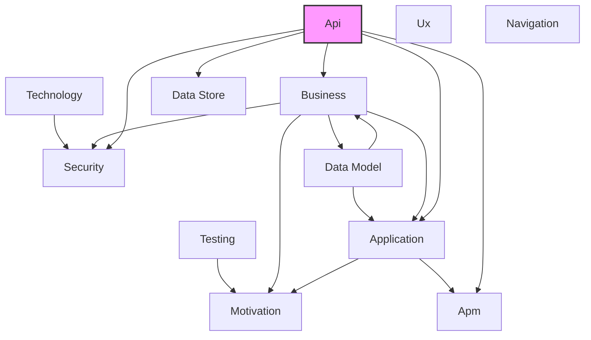

# API Layer

## Report Index

- [Layer Introduction](#layer-introduction)
- [Intra-Layer Relationships Diagram](#intra-layer-relationships)
- [Inter-Layer Dependencies Diagram](#inter-layer-dependencies)
- [Inter-Layer Relationships Table](#inter-layer-relationships-table)
- [Node Reference](#node-reference)
  - [Callback](#callback)
  - [Components](#components)
  - [Contact](#contact)
  - [Encoding](#encoding)
  - [Example](#example)
  - [Externaldocumentation](#externaldocumentation)
  - [Header](#header)
  - [Info](#info)
  - [License](#license)
  - [Link](#link)
  - [Mediatype](#mediatype)
  - [Oauthflow](#oauthflow)
  - [Oauthflows](#oauthflows)
  - [Openapidocument](#openapidocument)
  - [Operation](#operation)
  - [Parameter](#parameter)
  - [Parameterlocation](#parameterlocation)
  - [Parameterstyle](#parameterstyle)
  - [Pathitem](#pathitem)
  - [Paths](#paths)
  - [Requestbody](#requestbody)
  - [Response](#response)
  - [Responses](#responses)
  - [Schema](#schema)
  - [Securityscheme](#securityscheme)
  - [Securitytype](#securitytype)
  - [Server](#server)
  - [Servervariable](#servervariable)
  - [Tag](#tag)

## Layer Introduction

**Layer 6**: Api
**Standard**: [OpenAPI 3.0](https://spec.openapis.org/oas/v3.0.0)

Layer 6: API Layer

### Statistics

| Metric                    | Count |
| ------------------------- | ----- |
| Node Types                | 29    |
| Intra-Layer Relationships | 30    |
| Inter-Layer Relationships | 22    |
| Inbound Relationships     | 0     |
| Outbound Relationships    | 22    |

### Layer Dependencies

**Depends On**: None
**Depended On By**: [Business](./02-business-layer-report.md), [Security](./03-security-layer-report.md), [Application](./04-application-layer-report.md), [Data Store](./08-data-store-layer-report.md), [Apm](./11-apm-layer-report.md)

## Intra-Layer Relationships

## Inter-Layer Dependencies

## Inter-Layer Relationships Table

| Relationship ID                                                      | Source Node                       | Dest Node                                                                                  | Dest Layer                                      | Predicate              | Cardinality  | Strength |
| -------------------------------------------------------------------- | --------------------------------- | ------------------------------------------------------------------------------------------ | ----------------------------------------------- | ---------------------- | ------------ | -------- |
| api.operation.apm-trace.apm.traceconfiguration                       | [operation](#operation)           | [traceconfiguration](<[Apm](./11-apm-layer-report.md)#traceconfiguration>)                 | [Apm](./11-apm-layer-report.md)                 | apm-trace              | many-to-one  | medium   |
| api.operation.archimate-ref.application.applicationservice           | [operation](#operation)           | [applicationservice](<[Application](./04-application-layer-report.md)#applicationservice>) | [Application](./04-application-layer-report.md) | archimate-ref          | many-to-one  | medium   |
| api.securityscheme.archimate-ref.application.applicationservice      | [securityscheme](#securityscheme) | [applicationservice](<[Application](./04-application-layer-report.md)#applicationservice>) | [Application](./04-application-layer-report.md) | archimate-ref          | many-to-one  | medium   |
| api.operation.business-interface-ref.business.businessinterface      | [operation](#operation)           | [businessinterface](<[Business](./02-business-layer-report.md)#businessinterface>)         | [Business](./02-business-layer-report.md)       | business-interface-ref | many-to-one  | medium   |
| api.securityscheme.business-interface-ref.business.businessinterface | [securityscheme](#securityscheme) | [businessinterface](<[Business](./02-business-layer-report.md)#businessinterface>)         | [Business](./02-business-layer-report.md)       | business-interface-ref | many-to-one  | medium   |
| api.operation.business-service-ref.business.businessservice          | [operation](#operation)           | [businessservice](<[Business](./02-business-layer-report.md)#businessservice>)             | [Business](./02-business-layer-report.md)       | business-service-ref   | many-to-one  | medium   |
| api.securityscheme.business-service-ref.business.businessservice     | [securityscheme](#securityscheme) | [businessservice](<[Business](./02-business-layer-report.md)#businessservice>)             | [Business](./02-business-layer-report.md)       | business-service-ref   | many-to-one  | medium   |
| api.operation.referenced-by.business.businessinterface               | [operation](#operation)           | [businessinterface](<[Business](./02-business-layer-report.md)#businessinterface>)         | [Business](./02-business-layer-report.md)       | referenced-by          | many-to-one  | medium   |
| api.operation.referenced-by.business.businessservice                 | [operation](#operation)           | [businessservice](<[Business](./02-business-layer-report.md)#businessservice>)             | [Business](./02-business-layer-report.md)       | referenced-by          | many-to-one  | medium   |
| api.securityscheme.referenced-by.business.businessinterface          | [securityscheme](#securityscheme) | [businessinterface](<[Business](./02-business-layer-report.md)#businessinterface>)         | [Business](./02-business-layer-report.md)       | referenced-by          | many-to-one  | medium   |
| api.securityscheme.referenced-by.business.businessservice            | [securityscheme](#securityscheme) | [businessservice](<[Business](./02-business-layer-report.md)#businessservice>)             | [Business](./02-business-layer-report.md)       | referenced-by          | many-to-one  | medium   |
| api.schema.database-column.data-store.column                         | [schema](#schema)                 | [column]([Data Store](./08-data-store-layer-report.md)#column)                             | [Data Store](./08-data-store-layer-report.md)   | database-column        | many-to-one  | medium   |
| api.schema.database-table.data-store.table                           | [schema](#schema)                 | [table]([Data Store](./08-data-store-layer-report.md)#table)                               | [Data Store](./08-data-store-layer-report.md)   | database-table         | many-to-one  | medium   |
| api.securityscheme.database-table.data-store.table                   | [securityscheme](#securityscheme) | [table]([Data Store](./08-data-store-layer-report.md)#table)                               | [Data Store](./08-data-store-layer-report.md)   | database-table         | many-to-one  | medium   |
| api.operation.referenced-by.security.permission                      | [operation](#operation)           | [permission](<[Security](./03-security-layer-report.md)#permission>)                       | [Security](./03-security-layer-report.md)       | referenced-by          | many-to-many | medium   |
| api.operation.referenced-by.security.secureresource                  | [operation](#operation)           | [secureresource](<[Security](./03-security-layer-report.md)#secureresource>)               | [Security](./03-security-layer-report.md)       | referenced-by          | many-to-one  | medium   |
| api.securityscheme.referenced-by.security.permission                 | [securityscheme](#securityscheme) | [permission](<[Security](./03-security-layer-report.md)#permission>)                       | [Security](./03-security-layer-report.md)       | referenced-by          | many-to-many | medium   |
| api.securityscheme.referenced-by.security.secureresource             | [securityscheme](#securityscheme) | [secureresource](<[Security](./03-security-layer-report.md)#secureresource>)               | [Security](./03-security-layer-report.md)       | referenced-by          | many-to-one  | medium   |
| api.operation.required-permissions.security.permission               | [operation](#operation)           | [permission](<[Security](./03-security-layer-report.md)#permission>)                       | [Security](./03-security-layer-report.md)       | required-permissions   | many-to-many | critical |
| api.securityscheme.required-permissions.security.permission          | [securityscheme](#securityscheme) | [permission](<[Security](./03-security-layer-report.md)#permission>)                       | [Security](./03-security-layer-report.md)       | required-permissions   | many-to-many | critical |
| api.operation.security-resource.security.secureresource              | [operation](#operation)           | [secureresource](<[Security](./03-security-layer-report.md)#secureresource>)               | [Security](./03-security-layer-report.md)       | security-resource      | many-to-one  | critical |
| api.securityscheme.security-resource.security.secureresource         | [securityscheme](#securityscheme) | [secureresource](<[Security](./03-security-layer-report.md)#secureresource>)               | [Security](./03-security-layer-report.md)       | security-resource      | many-to-one  | critical |

## Node Reference

### Callback

**Spec Node ID**: `api.callback`

Defines a webhook or callback URL pattern where the API will send asynchronous notifications. Enables event-driven integrations and async workflows.

#### Intra-Layer Relationships

| Related Node            | Predicate | Direction | Cardinality  |
| ----------------------- | --------- | --------- | ------------ |
| [operation](#operation) | triggers  | inbound   | many-to-many |

[Back to Index](#report-index)

### Components

**Spec Node ID**: `api.components`

Reusable component definitions

#### Intra-Layer Relationships

| Related Node            | Predicate | Direction | Cardinality  |
| ----------------------- | --------- | --------- | ------------ |
| [paths](#paths)         | composes  | outbound  | many-to-many |
| [responses](#responses) | composes  | outbound  | many-to-many |
| [schema](#schema)       | composes  | outbound  | many-to-many |

[Back to Index](#report-index)

### Contact

**Spec Node ID**: `api.contact`

Contact information for the API owner or maintainer, including name, email, and URL. Enables consumers to reach out for support or collaboration.

#### Intra-Layer Relationships

| Related Node                        | Predicate       | Direction | Cardinality  |
| ----------------------------------- | --------------- | --------- | ------------ |
| [openapidocument](#openapidocument) | associated-with | outbound  | many-to-many |

[Back to Index](#report-index)

### Encoding

**Spec Node ID**: `api.encoding`

Specifies serialization details for multipart request body properties, including content-type, headers, and encoding style. Handles complex content negotiation.

[Back to Index](#report-index)

### Example

**Spec Node ID**: `api.example`

Provides sample values for request bodies, responses, or parameters. Improves documentation clarity and enables automated testing or mocking.

[Back to Index](#report-index)

### Externaldocumentation

**Spec Node ID**: `api.externaldocumentation`

A reference to external documentation resources (URLs, wikis, guides) that provide additional context beyond the inline API specification. Links API elements to comprehensive documentation.

[Back to Index](#report-index)

### Header

**Spec Node ID**: `api.header`

Defines HTTP header parameters for requests or responses, specifying name, schema, required status, and description. Documents header-based communication requirements.

[Back to Index](#report-index)

### Info

**Spec Node ID**: `api.info`

Metadata about the API

[Back to Index](#report-index)

### License

**Spec Node ID**: `api.license`

Specifies the legal license under which the API is provided, including license name and URL to full terms. Clarifies usage rights for API consumers.

#### Intra-Layer Relationships

| Related Node                        | Predicate       | Direction | Cardinality  |
| ----------------------------------- | --------------- | --------- | ------------ |
| [openapidocument](#openapidocument) | associated-with | outbound  | many-to-many |

[Back to Index](#report-index)

### Link

**Spec Node ID**: `api.link`

Describes a relationship between API responses and subsequent operations, enabling hypermedia-driven API navigation. Supports HATEOAS design patterns.

#### Intra-Layer Relationships

| Related Node            | Predicate  | Direction | Cardinality  |
| ----------------------- | ---------- | --------- | ------------ |
| [operation](#operation) | references | outbound  | many-to-many |
| [schema](#schema)       | references | outbound  | many-to-many |
| [tag](#tag)             | references | outbound  | many-to-many |

[Back to Index](#report-index)

### Mediatype

**Spec Node ID**: `api.mediatype`

Media type and schema for request/response body

[Back to Index](#report-index)

### Oauthflow

**Spec Node ID**: `api.oauthflow`

Individual OAuth 2.0 flow configuration

[Back to Index](#report-index)

### Oauthflows

**Spec Node ID**: `api.oauthflows`

Configuration for OAuth 2.0 authentication flows (implicit, password, clientCredentials, authorizationCode), specifying authorization URLs, token URLs, and scopes. Defines OAuth security implementation.

[Back to Index](#report-index)

### Openapidocument

**Spec Node ID**: `api.openapidocument`

Root of an OpenAPI specification file

#### Intra-Layer Relationships

| Related Node            | Predicate       | Direction | Cardinality  |
| ----------------------- | --------------- | --------- | ------------ |
| [contact](#contact)     | associated-with | inbound   | many-to-many |
| [license](#license)     | associated-with | inbound   | many-to-many |
| [server](#server)       | aggregates      | outbound  | many-to-many |
| [tag](#tag)             | aggregates      | outbound  | many-to-many |
| [paths](#paths)         | composes        | outbound  | many-to-many |
| [responses](#responses) | composes        | outbound  | many-to-many |
| [schema](#schema)       | composes        | outbound  | many-to-many |

[Back to Index](#report-index)

### Operation

**Spec Node ID**: `api.operation`

Single API operation (HTTP method on a path)

#### Intra-Layer Relationships

| Related Node                      | Predicate  | Direction | Cardinality  |
| --------------------------------- | ---------- | --------- | ------------ |
| [link](#link)                     | references | inbound   | many-to-many |
| [server](#server)                 | aggregates | outbound  | many-to-many |
| [tag](#tag)                       | aggregates | outbound  | many-to-many |
| [paths](#paths)                   | composes   | outbound  | many-to-many |
| [responses](#responses)           | composes   | outbound  | many-to-many |
| [schema](#schema)                 | composes   | outbound  | many-to-many |
| [operation](#operation)           | references | outbound  | many-to-many |
| [schema](#schema)                 | references | outbound  | many-to-many |
| [tag](#tag)                       | references | outbound  | many-to-many |
| [callback](#callback)             | triggers   | outbound  | many-to-many |
| [parameter](#parameter)           | references | inbound   | many-to-many |
| [schema](#schema)                 | references | inbound   | many-to-many |
| [securityscheme](#securityscheme) | serves     | inbound   | many-to-many |

#### Inter-Layer Relationships

| Related Node                                                                               | Layer                                           | Predicate              | Direction | Cardinality  |
| ------------------------------------------------------------------------------------------ | ----------------------------------------------- | ---------------------- | --------- | ------------ |
| [traceconfiguration](<[Apm](./11-apm-layer-report.md)#traceconfiguration>)                 | [Apm](./11-apm-layer-report.md)                 | apm-trace              | outbound  | many-to-one  |
| [applicationservice](<[Application](./04-application-layer-report.md)#applicationservice>) | [Application](./04-application-layer-report.md) | archimate-ref          | outbound  | many-to-one  |
| [businessinterface](<[Business](./02-business-layer-report.md)#businessinterface>)         | [Business](./02-business-layer-report.md)       | business-interface-ref | outbound  | many-to-one  |
| [businessservice](<[Business](./02-business-layer-report.md)#businessservice>)             | [Business](./02-business-layer-report.md)       | business-service-ref   | outbound  | many-to-one  |
| [businessinterface](<[Business](./02-business-layer-report.md)#businessinterface>)         | [Business](./02-business-layer-report.md)       | referenced-by          | outbound  | many-to-one  |
| [businessservice](<[Business](./02-business-layer-report.md)#businessservice>)             | [Business](./02-business-layer-report.md)       | referenced-by          | outbound  | many-to-one  |
| [permission](<[Security](./03-security-layer-report.md)#permission>)                       | [Security](./03-security-layer-report.md)       | referenced-by          | outbound  | many-to-many |
| [secureresource](<[Security](./03-security-layer-report.md)#secureresource>)               | [Security](./03-security-layer-report.md)       | referenced-by          | outbound  | many-to-one  |
| [permission](<[Security](./03-security-layer-report.md)#permission>)                       | [Security](./03-security-layer-report.md)       | required-permissions   | outbound  | many-to-many |
| [secureresource](<[Security](./03-security-layer-report.md)#secureresource>)               | [Security](./03-security-layer-report.md)       | security-resource      | outbound  | many-to-one  |

[Back to Index](#report-index)

### Parameter

**Spec Node ID**: `api.parameter`

Parameter for an operation

#### Intra-Layer Relationships

| Related Node            | Predicate  | Direction | Cardinality  |
| ----------------------- | ---------- | --------- | ------------ |
| [operation](#operation) | references | outbound  | many-to-many |
| [schema](#schema)       | references | outbound  | many-to-many |
| [tag](#tag)             | references | outbound  | many-to-many |

[Back to Index](#report-index)

### Parameterlocation

**Spec Node ID**: `api.parameterlocation`

ParameterLocation element in API Layer

[Back to Index](#report-index)

### Parameterstyle

**Spec Node ID**: `api.parameterstyle`

ParameterStyle element in API Layer

[Back to Index](#report-index)

### Pathitem

**Spec Node ID**: `api.pathitem`

Operations available on a path

[Back to Index](#report-index)

### Paths

**Spec Node ID**: `api.paths`

Available API endpoints and operations

#### Intra-Layer Relationships

| Related Node                        | Predicate | Direction | Cardinality  |
| ----------------------------------- | --------- | --------- | ------------ |
| [components](#components)           | composes  | inbound   | many-to-many |
| [openapidocument](#openapidocument) | composes  | inbound   | many-to-many |
| [operation](#operation)             | composes  | inbound   | many-to-many |

[Back to Index](#report-index)

### Requestbody

**Spec Node ID**: `api.requestbody`

Request payload for an operation

[Back to Index](#report-index)

### Response

**Spec Node ID**: `api.response`

Single response definition

[Back to Index](#report-index)

### Responses

**Spec Node ID**: `api.responses`

Possible responses from an operation

#### Intra-Layer Relationships

| Related Node                        | Predicate | Direction | Cardinality  |
| ----------------------------------- | --------- | --------- | ------------ |
| [components](#components)           | composes  | inbound   | many-to-many |
| [openapidocument](#openapidocument) | composes  | inbound   | many-to-many |
| [operation](#operation)             | composes  | inbound   | many-to-many |

[Back to Index](#report-index)

### Schema

**Spec Node ID**: `api.schema`

Data type definition (JSON Schema subset)

#### Intra-Layer Relationships

| Related Node                        | Predicate   | Direction | Cardinality  |
| ----------------------------------- | ----------- | --------- | ------------ |
| [components](#components)           | composes    | inbound   | many-to-many |
| [link](#link)                       | references  | inbound   | many-to-many |
| [openapidocument](#openapidocument) | composes    | inbound   | many-to-many |
| [operation](#operation)             | composes    | inbound   | many-to-many |
| [operation](#operation)             | references  | inbound   | many-to-many |
| [parameter](#parameter)             | references  | inbound   | many-to-many |
| [operation](#operation)             | references  | outbound  | many-to-many |
| [schema](#schema)                   | references  | outbound  | many-to-many |
| [tag](#tag)                         | references  | outbound  | many-to-many |
| [schema](#schema)                   | specializes | outbound  | many-to-many |

#### Inter-Layer Relationships

| Related Node                                                   | Layer                                         | Predicate       | Direction | Cardinality |
| -------------------------------------------------------------- | --------------------------------------------- | --------------- | --------- | ----------- |
| [column]([Data Store](./08-data-store-layer-report.md)#column) | [Data Store](./08-data-store-layer-report.md) | database-column | outbound  | many-to-one |
| [table]([Data Store](./08-data-store-layer-report.md)#table)   | [Data Store](./08-data-store-layer-report.md) | database-table  | outbound  | many-to-one |

[Back to Index](#report-index)

### Securityscheme

**Spec Node ID**: `api.securityscheme`

Security mechanism for the API

#### Intra-Layer Relationships

| Related Node            | Predicate | Direction | Cardinality  |
| ----------------------- | --------- | --------- | ------------ |
| [operation](#operation) | serves    | outbound  | many-to-many |

#### Inter-Layer Relationships

| Related Node                                                                               | Layer                                           | Predicate              | Direction | Cardinality  |
| ------------------------------------------------------------------------------------------ | ----------------------------------------------- | ---------------------- | --------- | ------------ |
| [applicationservice](<[Application](./04-application-layer-report.md)#applicationservice>) | [Application](./04-application-layer-report.md) | archimate-ref          | outbound  | many-to-one  |
| [businessinterface](<[Business](./02-business-layer-report.md)#businessinterface>)         | [Business](./02-business-layer-report.md)       | business-interface-ref | outbound  | many-to-one  |
| [businessservice](<[Business](./02-business-layer-report.md)#businessservice>)             | [Business](./02-business-layer-report.md)       | business-service-ref   | outbound  | many-to-one  |
| [table]([Data Store](./08-data-store-layer-report.md)#table)                               | [Data Store](./08-data-store-layer-report.md)   | database-table         | outbound  | many-to-one  |
| [businessinterface](<[Business](./02-business-layer-report.md)#businessinterface>)         | [Business](./02-business-layer-report.md)       | referenced-by          | outbound  | many-to-one  |
| [businessservice](<[Business](./02-business-layer-report.md)#businessservice>)             | [Business](./02-business-layer-report.md)       | referenced-by          | outbound  | many-to-one  |
| [permission](<[Security](./03-security-layer-report.md)#permission>)                       | [Security](./03-security-layer-report.md)       | referenced-by          | outbound  | many-to-many |
| [secureresource](<[Security](./03-security-layer-report.md)#secureresource>)               | [Security](./03-security-layer-report.md)       | referenced-by          | outbound  | many-to-one  |
| [permission](<[Security](./03-security-layer-report.md)#permission>)                       | [Security](./03-security-layer-report.md)       | required-permissions   | outbound  | many-to-many |
| [secureresource](<[Security](./03-security-layer-report.md)#secureresource>)               | [Security](./03-security-layer-report.md)       | security-resource      | outbound  | many-to-one  |

[Back to Index](#report-index)

### Securitytype

**Spec Node ID**: `api.securitytype`

SecurityType element in API Layer

[Back to Index](#report-index)

### Server

**Spec Node ID**: `api.server`

Server where the API is available

#### Intra-Layer Relationships

| Related Node                        | Predicate  | Direction | Cardinality  |
| ----------------------------------- | ---------- | --------- | ------------ |
| [openapidocument](#openapidocument) | aggregates | inbound   | many-to-many |
| [operation](#operation)             | aggregates | inbound   | many-to-many |

[Back to Index](#report-index)

### Servervariable

**Spec Node ID**: `api.servervariable`

A variable placeholder in server URL templates that can be substituted at runtime. Enables dynamic server addressing for different environments or tenants.

[Back to Index](#report-index)

### Tag

**Spec Node ID**: `api.tag`

A metadata label used to group and categorize API operations for documentation organization. Enables logical grouping of endpoints in generated API documentation.

#### Intra-Layer Relationships

| Related Node                        | Predicate  | Direction | Cardinality  |
| ----------------------------------- | ---------- | --------- | ------------ |
| [link](#link)                       | references | inbound   | many-to-many |
| [openapidocument](#openapidocument) | aggregates | inbound   | many-to-many |
| [operation](#operation)             | aggregates | inbound   | many-to-many |
| [operation](#operation)             | references | inbound   | many-to-many |
| [parameter](#parameter)             | references | inbound   | many-to-many |
| [schema](#schema)                   | references | inbound   | many-to-many |

[Back to Index](#report-index)

---

_Generated: 2026-02-11T21:30:52.786Z | Generator: generate-layer-reports.ts_
