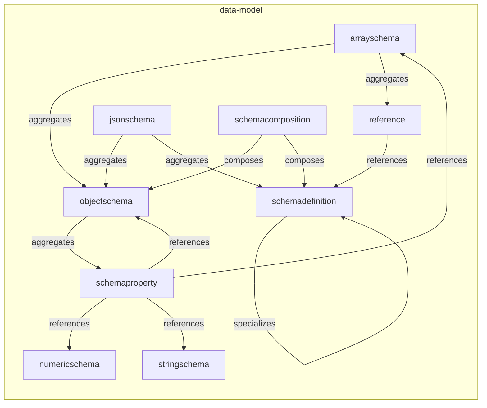
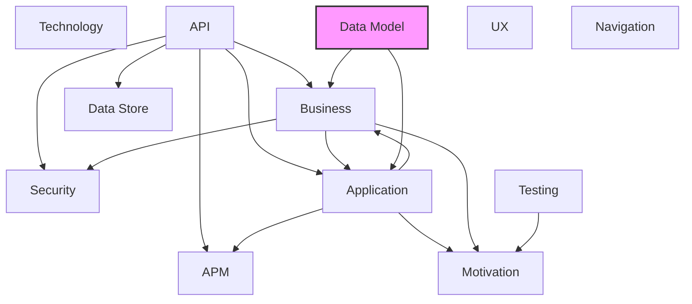

# Data Model Layer

## Report Index

- [Layer Introduction](#layer-introduction)
- [Intra-Layer Relationships](#intra-layer-relationships)
- [Inter-Layer Dependencies](#inter-layer-dependencies)
- [Inter-Layer Relationships Table](#inter-layer-relationships-table)
- [Node Reference](#node-reference)
  - [Arrayschema](#arrayschema)
  - [Jsonschema](#jsonschema)
  - [Numericschema](#numericschema)
  - [Objectschema](#objectschema)
  - [Reference](#reference)
  - [Schemacomposition](#schemacomposition)
  - [Schemadefinition](#schemadefinition)
  - [Schemaproperty](#schemaproperty)
  - [Stringschema](#stringschema)

## Layer Introduction

**Layer 7**: Data Model
**Standard**: [JSON Schema Draft 7](https://json-schema.org/draft-07/)

Layer 7: Data Model Layer

### Statistics

| Metric                    | Count |
| ------------------------- | ----- |
| Node Types                | 9     |
| Intra-Layer Relationships | 13    |
| Inter-Layer Relationships | 2     |
| Inbound Relationships     | 0     |
| Outbound Relationships    | 2     |

### Layer Dependencies

**Depends On**: None

**Depended On By**: [Business](./02-business-layer-report.md), [Application](./04-application-layer-report.md)

## Intra-Layer Relationships

## Inter-Layer Dependencies

## Inter-Layer Relationships Table

| Relationship ID                                                 | Source Node                                              | Dest Node                                                                 | Dest Layer                                      | Predicate  | Cardinality | Strength |
| --------------------------------------------------------------- | -------------------------------------------------------- | ------------------------------------------------------------------------- | ----------------------------------------------- | ---------- | ----------- | -------- |
| data-model.jsonschema.references.application.applicationservice | [jsonschema](./07-data-model-layer-report.md#jsonschema) | [applicationservice](./04-application-layer-report.md#applicationservice) | [Application](./04-application-layer-report.md) | references | many-to-one | medium   |
| data-model.jsonschema.references.business.businessobject        | [jsonschema](./07-data-model-layer-report.md#jsonschema) | [businessobject](./02-business-layer-report.md#businessobject)            | [Business](./02-business-layer-report.md)       | references | many-to-one | medium   |

## Node Reference

### Arrayschema {#arrayschema}

**Spec Node ID**: `data-model.arrayschema`

Defines validation rules for JSON array instances, constraining item schemas, cardinality bounds (minItems/maxItems), uniqueness requirements, and contains-subschema matching.

#### Relationship Metrics

- **Intra-Layer**: Inbound: 1 | Outbound: 2
- **Inter-Layer**: Inbound: 0 | Outbound: 0

#### Intra-Layer Relationships

| Related Node                      | Predicate  | Direction | Cardinality |
| --------------------------------- | ---------- | --------- | ----------- |
| [objectschema](#objectschema)     | aggregates | outbound  | many-to-one |
| [reference](#reference)           | aggregates | outbound  | many-to-one |
| [schemaproperty](#schemaproperty) | references | inbound   | many-to-one |

[Back to Index](#report-index)

### Jsonschema {#jsonschema}

**Spec Node ID**: `data-model.jsonschema`

The root JSON Schema document, identified by $schema (dialect URI) and $id (base URI for $ref resolution), containing type constraints, annotations, and reusable definitions.

#### Relationship Metrics

- **Intra-Layer**: Inbound: 0 | Outbound: 2
- **Inter-Layer**: Inbound: 0 | Outbound: 2

#### Intra-Layer Relationships

| Related Node                          | Predicate  | Direction | Cardinality |
| ------------------------------------- | ---------- | --------- | ----------- |
| [objectschema](#objectschema)         | aggregates | outbound  | many-to-one |
| [schemadefinition](#schemadefinition) | aggregates | outbound  | many-to-one |

#### Inter-Layer Relationships

| Related Node                                                              | Layer                                           | Predicate  | Direction | Cardinality |
| ------------------------------------------------------------------------- | ----------------------------------------------- | ---------- | --------- | ----------- |
| [applicationservice](./04-application-layer-report.md#applicationservice) | [Application](./04-application-layer-report.md) | references | outbound  | many-to-one |
| [businessobject](./02-business-layer-report.md#businessobject)            | [Business](./02-business-layer-report.md)       | references | outbound  | many-to-one |

[Back to Index](#report-index)

### Numericschema {#numericschema}

**Spec Node ID**: `data-model.numericschema`

Defines validation rules for JSON numeric instances (number or integer types), including inclusive/exclusive bounds and divisibility constraints. Note: in JSON Schema Draft 7, exclusiveMinimum and exclusiveMaximum are numeric boundary values (e.g., exclusiveMinimum: 0), not the boolean flags used in Draft 4.

#### Relationship Metrics

- **Intra-Layer**: Inbound: 1 | Outbound: 0
- **Inter-Layer**: Inbound: 0 | Outbound: 0

#### Intra-Layer Relationships

| Related Node                      | Predicate  | Direction | Cardinality |
| --------------------------------- | ---------- | --------- | ----------- |
| [schemaproperty](#schemaproperty) | references | inbound   | many-to-one |

[Back to Index](#report-index)

### Objectschema {#objectschema}

**Spec Node ID**: `data-model.objectschema`

Defines validation rules for JSON object instances, specifying named properties, required fields, and constraints on additional or dynamically named properties.

#### Relationship Metrics

- **Intra-Layer**: Inbound: 4 | Outbound: 1
- **Inter-Layer**: Inbound: 0 | Outbound: 0

#### Intra-Layer Relationships

| Related Node                            | Predicate  | Direction | Cardinality |
| --------------------------------------- | ---------- | --------- | ----------- |
| [arrayschema](#arrayschema)             | aggregates | inbound   | many-to-one |
| [jsonschema](#jsonschema)               | aggregates | inbound   | many-to-one |
| [schemaproperty](#schemaproperty)       | aggregates | outbound  | many-to-one |
| [schemacomposition](#schemacomposition) | composes   | inbound   | many-to-one |
| [schemaproperty](#schemaproperty)       | references | inbound   | many-to-one |

[Back to Index](#report-index)

### Reference {#reference}

**Spec Node ID**: `data-model.reference`

A JSON Schema $ref pointer that references another schema by URI or JSON Pointer fragment, enabling schema reuse without duplication. In JSON Schema Draft 7, all sibling keywords alongside $ref are ignored — use allOf to combine a $ref with additional constraints.

#### Relationship Metrics

- **Intra-Layer**: Inbound: 1 | Outbound: 1
- **Inter-Layer**: Inbound: 0 | Outbound: 0

#### Intra-Layer Relationships

| Related Node                          | Predicate  | Direction | Cardinality |
| ------------------------------------- | ---------- | --------- | ----------- |
| [arrayschema](#arrayschema)           | aggregates | inbound   | many-to-one |
| [schemadefinition](#schemadefinition) | references | outbound  | many-to-one |

[Back to Index](#report-index)

### Schemacomposition {#schemacomposition}

**Spec Node ID**: `data-model.schemacomposition`

Combines multiple schemas using boolean logic. allOf requires all subschemas to validate; anyOf requires at least one; oneOf requires exactly one; not inverts the result of the subschema.

#### Relationship Metrics

- **Intra-Layer**: Inbound: 0 | Outbound: 2
- **Inter-Layer**: Inbound: 0 | Outbound: 0

#### Intra-Layer Relationships

| Related Node                          | Predicate | Direction | Cardinality |
| ------------------------------------- | --------- | --------- | ----------- |
| [objectschema](#objectschema)         | composes  | outbound  | many-to-one |
| [schemadefinition](#schemadefinition) | composes  | outbound  | many-to-one |

[Back to Index](#report-index)

### Schemadefinition {#schemadefinition}

**Spec Node ID**: `data-model.schemadefinition`

A reusable JSON Schema definition declared under the 'definitions' keyword and referenced via '$ref: #/definitions/{name}'. Enables DRY schema design and consistent type definitions across entities.

#### Relationship Metrics

- **Intra-Layer**: Inbound: 4 | Outbound: 1
- **Inter-Layer**: Inbound: 0 | Outbound: 0

#### Intra-Layer Relationships

| Related Node                            | Predicate   | Direction | Cardinality |
| --------------------------------------- | ----------- | --------- | ----------- |
| [jsonschema](#jsonschema)               | aggregates  | inbound   | many-to-one |
| [reference](#reference)                 | references  | inbound   | many-to-one |
| [schemacomposition](#schemacomposition) | composes    | inbound   | many-to-one |
| [schemadefinition](#schemadefinition)   | specializes | outbound  | many-to-one |

[Back to Index](#report-index)

### Schemaproperty {#schemaproperty}

**Spec Node ID**: `data-model.schemaproperty`

Defines a single property within a schema, including its type, constraints, validation rules, and documentation. The fundamental building block of data model structure.

#### Relationship Metrics

- **Intra-Layer**: Inbound: 1 | Outbound: 4
- **Inter-Layer**: Inbound: 0 | Outbound: 0

#### Intra-Layer Relationships

| Related Node                    | Predicate  | Direction | Cardinality |
| ------------------------------- | ---------- | --------- | ----------- |
| [objectschema](#objectschema)   | aggregates | inbound   | many-to-one |
| [arrayschema](#arrayschema)     | references | outbound  | many-to-one |
| [numericschema](#numericschema) | references | outbound  | many-to-one |
| [objectschema](#objectschema)   | references | outbound  | many-to-one |
| [stringschema](#stringschema)   | references | outbound  | many-to-one |

[Back to Index](#report-index)

### Stringschema {#stringschema}

**Spec Node ID**: `data-model.stringschema`

Defines validation rules for JSON string instances, including length bounds (minLength/maxLength), regular expression patterns, and semantic format hints (e.g., date-time, email, uri). The canonical node type for string type constraints in the data model.

#### Relationship Metrics

- **Intra-Layer**: Inbound: 1 | Outbound: 0
- **Inter-Layer**: Inbound: 0 | Outbound: 0

#### Intra-Layer Relationships

| Related Node                      | Predicate  | Direction | Cardinality |
| --------------------------------- | ---------- | --------- | ----------- |
| [schemaproperty](#schemaproperty) | references | inbound   | many-to-one |

[Back to Index](#report-index)

---

_Generated: 2026-02-28T12:48:58.611Z | Spec Version: 0.8.0 | Generator: generate-layer-reports.ts_
