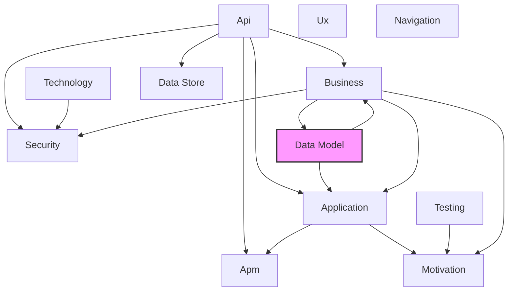

# Data Model Layer

## Report Index

- [Layer Introduction](#layer-introduction)
- [Intra-Layer Relationships](#intra-layer-relationships)
- [Inter-Layer Dependencies](#inter-layer-dependencies)
- [Inter-Layer Relationships Table](#inter-layer-relationships-table)
- [Node Reference](#node-reference)
  - [Jsonschema](#jsonschema)
  - [Schemacomposition](#schemacomposition)
  - [Datagovernance](#datagovernance)
  - [X-database](#x-database)
  - [X-data-governance](#x-data-governance)
  - [Databasemapping](#databasemapping)
  - [Numericschema](#numericschema)
  - [Schemaproperty](#schemaproperty)
  - [X-apm-data-quality-metrics](#x-apm-data-quality-metrics)
  - [Schemadefinition](#schemadefinition)
  - [X-ui](#x-ui)
  - [Reference](#reference)
  - [Objectschema](#objectschema)
  - [X-business-object-ref](#x-business-object-ref)
  - [Dataqualitymetrics](#dataqualitymetrics)
  - [X-security](#x-security)
  - [Stringschema](#stringschema)
  - [Jsontype](#jsontype)
  - [Arrayschema](#arrayschema)
  - [String](#string)

## Layer Introduction

**Layer 7**: Data Model
**Standard**: [JSON Schema Draft 7](https://json-schema.org/draft-07/)

Layer 7: Data Model Layer

### Statistics

| Metric                    | Count |
| ------------------------- | ----- |
| Node Types                | 20    |
| Intra-Layer Relationships | 4     |
| Inter-Layer Relationships | 4     |
| Inbound Relationships     | 1     |
| Outbound Relationships    | 3     |

### Layer Dependencies

**Depends On**: [Business](./02-business-layer-report.md)
**Depended On By**: [Business](./02-business-layer-report.md), [Application](./04-application-layer-report.md)

## Intra-Layer Relationships

```mermaid
flowchart LR
  subgraph data-model
    jsonschema["jsonschema"]
    schemacomposition["schemacomposition"]
    datagovernance["datagovernance"]
    x_database["x-database"]
    x_data_governance["x-data-governance"]
    databasemapping["databasemapping"]
    numericschema["numericschema"]
    schemaproperty["schemaproperty"]
    x_apm_data_quality_metrics["x-apm-data-quality-metrics"]
    schemadefinition["schemadefinition"]
    x_ui["x-ui"]
    reference["reference"]
    objectschema["objectschema"]
    x_business_object_ref["x-business-object-ref"]
    dataqualitymetrics["dataqualitymetrics"]
    x_security["x-security"]
    stringschema["stringschema"]
    jsontype["jsontype"]
    arrayschema["arrayschema"]
    string["string"]
    jsonschema -->|data-governance| datagovernance
    schemaproperty -->|database-mapping| databasemapping
    jsonschema -->|database-mapping| databasemapping
    jsonschema -->|apm-data-quality-metrics| dataqualitymetrics
  end
```

## Inter-Layer Dependencies

## Inter-Layer Relationships Table

| Relationship ID                                                    | Source Node                                                    | Dest Node                                                                 | Dest Layer                                      | Predicate           | Cardinality | Strength |
| ------------------------------------------------------------------ | -------------------------------------------------------------- | ------------------------------------------------------------------------- | ----------------------------------------------- | ------------------- | ----------- | -------- |
| data-model.jsonschema.archimate-ref.application.applicationservice | [jsonschema](./07-data-model-layer-report.md#jsonschema)       | [applicationservice](./04-application-layer-report.md#applicationservice) | [Application](./04-application-layer-report.md) | archimate-ref       | many-to-one | medium   |
| data-model.jsonschema.business-object-ref.business.businessobject  | [jsonschema](./07-data-model-layer-report.md#jsonschema)       | [businessobject](./02-business-layer-report.md#businessobject)            | [Business](./02-business-layer-report.md)       | business-object-ref | many-to-one | medium   |
| data-model.jsonschema.referenced-by.business.businessobject        | [jsonschema](./07-data-model-layer-report.md#jsonschema)       | [businessobject](./02-business-layer-report.md#businessobject)            | [Business](./02-business-layer-report.md)       | referenced-by       | many-to-one | medium   |
| business.businessobject.governance-owner.data-model.datagovernance | [businessobject](./02-business-layer-report.md#businessobject) | [datagovernance](./07-data-model-layer-report.md#datagovernance)          | [Data Model](./07-data-model-layer-report.md)   | governance-owner    | many-to-one | medium   |

## Node Reference

### Jsonschema

**Spec Node ID**: `data-model.jsonschema`

Root schema document

#### Intra-Layer Relationships

| Related Node                              | Predicate                | Direction | Cardinality |
| ----------------------------------------- | ------------------------ | --------- | ----------- |
| [datagovernance](#datagovernance)         | data-governance          | outbound  | many-to-one |
| [databasemapping](#databasemapping)       | database-mapping         | outbound  | many-to-one |
| [dataqualitymetrics](#dataqualitymetrics) | apm-data-quality-metrics | outbound  | many-to-one |

#### Inter-Layer Relationships

| Related Node                                                              | Layer                                           | Predicate           | Direction | Cardinality |
| ------------------------------------------------------------------------- | ----------------------------------------------- | ------------------- | --------- | ----------- |
| [applicationservice](./04-application-layer-report.md#applicationservice) | [Application](./04-application-layer-report.md) | archimate-ref       | outbound  | many-to-one |
| [businessobject](./02-business-layer-report.md#businessobject)            | [Business](./02-business-layer-report.md)       | business-object-ref | outbound  | many-to-one |
| [businessobject](./02-business-layer-report.md#businessobject)            | [Business](./02-business-layer-report.md)       | referenced-by       | outbound  | many-to-one |

[Back to Index](#report-index)

### Schemacomposition

**Spec Node ID**: `data-model.schemacomposition`

Combining multiple schemas

[Back to Index](#report-index)

### Datagovernance

**Spec Node ID**: `data-model.datagovernance`

Metadata about data ownership, classification, sensitivity level, and handling requirements. Ensures data is managed according to organizational policies and regulations.

#### Intra-Layer Relationships

| Related Node              | Predicate       | Direction | Cardinality |
| ------------------------- | --------------- | --------- | ----------- |
| [jsonschema](#jsonschema) | data-governance | inbound   | many-to-one |

#### Inter-Layer Relationships

| Related Node                                                   | Layer                                     | Predicate        | Direction | Cardinality |
| -------------------------------------------------------------- | ----------------------------------------- | ---------------- | --------- | ----------- |
| [businessobject](./02-business-layer-report.md#businessobject) | [Business](./02-business-layer-report.md) | governance-owner | inbound   | many-to-one |

[Back to Index](#report-index)

### X-database

**Spec Node ID**: `data-model.x-database`

Database mapping information

[Back to Index](#report-index)

### X-data-governance

**Spec Node ID**: `data-model.x-data-governance`

Data model governance metadata (root-level)

[Back to Index](#report-index)

### Databasemapping

**Spec Node ID**: `data-model.databasemapping`

Specifies how a logical data model entity maps to physical database storage, including table names, column mappings, and storage optimizations. Bridges logical and physical data layers.

#### Intra-Layer Relationships

| Related Node                      | Predicate        | Direction | Cardinality |
| --------------------------------- | ---------------- | --------- | ----------- |
| [schemaproperty](#schemaproperty) | database-mapping | inbound   | many-to-one |
| [jsonschema](#jsonschema)         | database-mapping | inbound   | many-to-one |

[Back to Index](#report-index)

### Numericschema

**Spec Node ID**: `data-model.numericschema`

NumericSchema validation rules

[Back to Index](#report-index)

### Schemaproperty

**Spec Node ID**: `data-model.schemaproperty`

Defines a single property within a schema, including its type, constraints, validation rules, and documentation. The fundamental building block of data model structure.

#### Intra-Layer Relationships

| Related Node                        | Predicate        | Direction | Cardinality |
| ----------------------------------- | ---------------- | --------- | ----------- |
| [databasemapping](#databasemapping) | database-mapping | outbound  | many-to-one |

[Back to Index](#report-index)

### X-apm-data-quality-metrics

**Spec Node ID**: `data-model.x-apm-data-quality-metrics`

Links schema to data quality metrics in APM/Observability Layer

[Back to Index](#report-index)

### Schemadefinition

**Spec Node ID**: `data-model.schemadefinition`

A reusable JSON Schema definition that can be referenced throughout the data model. Enables DRY schema design and consistent type definitions across entities.

[Back to Index](#report-index)

### X-ui

**Spec Node ID**: `data-model.x-ui`

UI rendering hints

[Back to Index](#report-index)

### Reference

**Spec Node ID**: `data-model.reference`

Reference to another schema

[Back to Index](#report-index)

### Objectschema

**Spec Node ID**: `data-model.objectschema`

ObjectSchema validation rules

[Back to Index](#report-index)

### X-business-object-ref

**Spec Node ID**: `data-model.x-business-object-ref`

Reference to BusinessObject this schema implements

[Back to Index](#report-index)

### Dataqualitymetrics

**Spec Node ID**: `data-model.dataqualitymetrics`

Defines measurable quality attributes for data elements such as completeness, accuracy, consistency, and timeliness. Enables data quality monitoring and SLA enforcement.

#### Intra-Layer Relationships

| Related Node              | Predicate                | Direction | Cardinality |
| ------------------------- | ------------------------ | --------- | ----------- |
| [jsonschema](#jsonschema) | apm-data-quality-metrics | inbound   | many-to-one |

[Back to Index](#report-index)

### X-security

**Spec Node ID**: `data-model.x-security`

Security and privacy metadata

[Back to Index](#report-index)

### Stringschema

**Spec Node ID**: `data-model.stringschema`

StringSchema validation rules

[Back to Index](#report-index)

### Jsontype

**Spec Node ID**: `data-model.jsontype`

Core JSON data types

[Back to Index](#report-index)

### Arrayschema

**Spec Node ID**: `data-model.arrayschema`

ArraySchema validation rules

[Back to Index](#report-index)

### String

**Spec Node ID**: `data-model.string`

String type definition for data model properties

[Back to Index](#report-index)

---

_Generated: 2026-02-11T21:45:57.105Z | Generator: generate-layer-reports.ts_
