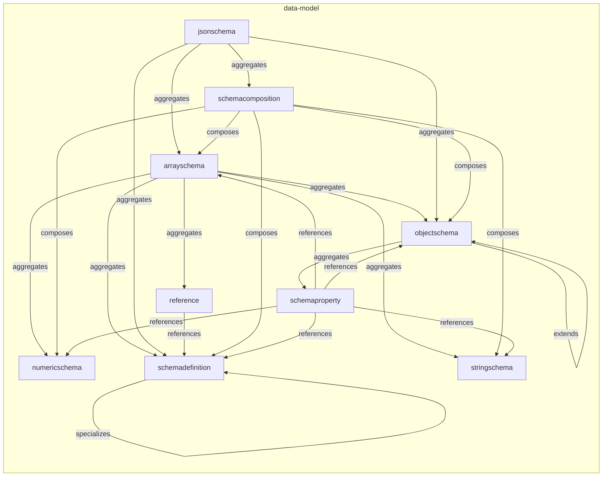
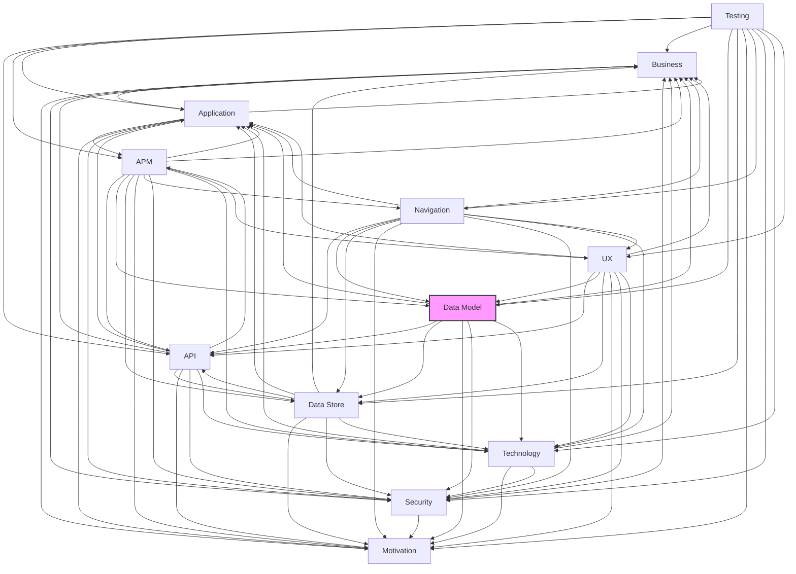

# Data Model Layer

## Report Index

- [Layer Introduction](#layer-introduction)
- [Intra-Layer Relationships](#intra-layer-relationships)
- [Inter-Layer Dependencies](#inter-layer-dependencies)
- [Inter-Layer Relationships Table](#inter-layer-relationships-table)
- [Node Reference](#node-reference)
  - [Arrayschema](#arrayschema)
  - [Jsonschema](#jsonschema)
  - [Numericschema](#numericschema)
  - [Objectschema](#objectschema)
  - [Reference](#reference)
  - [Schemacomposition](#schemacomposition)
  - [Schemadefinition](#schemadefinition)
  - [Schemaproperty](#schemaproperty)
  - [Stringschema](#stringschema)

## Layer Introduction

**Layer 7**: Data Model
**Standard**: [JSON Schema Draft 7](https://json-schema.org/draft-07/)

Layer 7: Data Model Layer

### Statistics

| Metric                    | Count |
| ------------------------- | ----- |
| Node Types                | 9     |
| Intra-Layer Relationships | 25    |
| Inter-Layer Relationships | 77    |
| Inbound Relationships     | 31    |
| Outbound Relationships    | 46    |

### Layer Dependencies

**Depends On**: [UX](./09-ux-layer-report.md), [Navigation](./10-navigation-layer-report.md), [APM](./11-apm-layer-report.md), [Testing](./12-testing-layer-report.md)

**Depended On By**: [Motivation](./01-motivation-layer-report.md), [Business](./02-business-layer-report.md), [Security](./03-security-layer-report.md), [Application](./04-application-layer-report.md), [Technology](./05-technology-layer-report.md), [API](./06-api-layer-report.md), [Data Store](./08-data-store-layer-report.md)

## Intra-Layer Relationships

```mermaid
flowchart LR
  subgraph data-model
    arrayschema["arrayschema"]
    jsonschema["jsonschema"]
    numericschema["numericschema"]
    objectschema["objectschema"]
    reference["reference"]
    schemacomposition["schemacomposition"]
    schemadefinition["schemadefinition"]
    schemaproperty["schemaproperty"]
    stringschema["stringschema"]
    arrayschema -->|aggregates| numericschema
    arrayschema -->|aggregates| objectschema
    arrayschema -->|aggregates| reference
    arrayschema -->|aggregates| schemadefinition
    arrayschema -->|aggregates| stringschema
    jsonschema -->|aggregates| arrayschema
    jsonschema -->|aggregates| objectschema
    jsonschema -->|aggregates| schemacomposition
    jsonschema -->|aggregates| schemadefinition
    objectschema -->|aggregates| schemaproperty
    objectschema -->|extends| objectschema
    reference -->|references| schemadefinition
    schemacomposition -->|composes| arrayschema
    schemacomposition -->|composes| numericschema
    schemacomposition -->|composes| objectschema
    schemacomposition -->|composes| schemadefinition
    schemacomposition -->|composes| stringschema
    schemadefinition -->|composes| schemadefinition
    schemadefinition -->|references| schemadefinition
    schemadefinition -->|specializes| schemadefinition
    schemaproperty -->|references| arrayschema
    schemaproperty -->|references| numericschema
    schemaproperty -->|references| objectschema
    schemaproperty -->|references| schemadefinition
    schemaproperty -->|references| stringschema
  end
```

## Inter-Layer Dependencies

```mermaid
flowchart TB
  classDef current fill:#f9f,stroke:#333,stroke-width:2px
  motivation["Motivation"]
  business["Business"]
  security["Security"]
  application["Application"]
  technology["Technology"]
  api["API"]
  data_model["Data Model"]
  data_store["Data Store"]
  ux["UX"]
  navigation["Navigation"]
  apm["APM"]
  testing["Testing"]
  api --> apm
  api --> application
  api --> business
  api --> data_store
  api --> motivation
  api --> security
  api --> technology
  apm --> api
  apm --> application
  apm --> business
  apm --> data_model
  apm --> data_store
  apm --> motivation
  apm --> navigation
  apm --> security
  apm --> technology
  apm --> ux
  application --> apm
  application --> business
  application --> motivation
  application --> security
  business --> application
  business --> motivation
  business --> security
  data_model --> api
  data_model --> application
  data_model --> business
  data_model --> data_store
  data_model --> motivation
  data_model --> security
  data_model --> technology
  data_store --> api
  data_store --> application
  data_store --> business
  data_store --> motivation
  data_store --> security
  data_store --> technology
  navigation --> api
  navigation --> application
  navigation --> business
  navigation --> data_model
  navigation --> data_store
  navigation --> motivation
  navigation --> security
  navigation --> technology
  navigation --> ux
  security --> business
  security --> motivation
  technology --> application
  technology --> business
  technology --> motivation
  technology --> security
  testing --> api
  testing --> apm
  testing --> application
  testing --> business
  testing --> data_model
  testing --> data_store
  testing --> motivation
  testing --> navigation
  testing --> security
  testing --> technology
  testing --> ux
  ux --> api
  ux --> application
  ux --> business
  ux --> data_model
  ux --> data_store
  ux --> motivation
  ux --> security
  ux --> technology
  class data_model current
```

## Inter-Layer Relationships Table

| Relationship ID                                                     | Source Node                                                             | Dest Node                                                                     | Dest Layer                                      | Predicate  | Cardinality  | Strength |
| ------------------------------------------------------------------- | ----------------------------------------------------------------------- | ----------------------------------------------------------------------------- | ----------------------------------------------- | ---------- | ------------ | -------- |
| apm.instrumentationscope.monitors.data-model.objectschema           | [Instrumentationscope](./11-apm-layer-report.md#instrumentationscope)   | [Objectschema](./07-data-model-layer-report.md#objectschema)                  | [Data Model](./07-data-model-layer-report.md)   | monitors   | many-to-many | medium   |
| apm.logrecord.references.data-model.objectschema                    | [Logrecord](./11-apm-layer-report.md#logrecord)                         | [Objectschema](./07-data-model-layer-report.md#objectschema)                  | [Data Model](./07-data-model-layer-report.md)   | references | many-to-many | medium   |
| apm.logrecord.references.data-model.schemadefinition                | [Logrecord](./11-apm-layer-report.md#logrecord)                         | [Schemadefinition](./07-data-model-layer-report.md#schemadefinition)          | [Data Model](./07-data-model-layer-report.md)   | references | many-to-many | medium   |
| apm.metricconfiguration.references.data-model.jsonschema            | [Metricconfiguration](./11-apm-layer-report.md#metricconfiguration)     | [Jsonschema](./07-data-model-layer-report.md#jsonschema)                      | [Data Model](./07-data-model-layer-report.md)   | references | many-to-many | medium   |
| apm.metricinstrument.monitors.data-model.objectschema               | [Metricinstrument](./11-apm-layer-report.md#metricinstrument)           | [Objectschema](./07-data-model-layer-report.md#objectschema)                  | [Data Model](./07-data-model-layer-report.md)   | monitors   | many-to-many | medium   |
| apm.metricinstrument.monitors.data-model.schemadefinition           | [Metricinstrument](./11-apm-layer-report.md#metricinstrument)           | [Schemadefinition](./07-data-model-layer-report.md#schemadefinition)          | [Data Model](./07-data-model-layer-report.md)   | monitors   | many-to-many | medium   |
| apm.span.monitors.data-model.objectschema                           | [Span](./11-apm-layer-report.md#span)                                   | [Objectschema](./07-data-model-layer-report.md#objectschema)                  | [Data Model](./07-data-model-layer-report.md)   | monitors   | many-to-many | medium   |
| apm.span.references.data-model.schemadefinition                     | [Span](./11-apm-layer-report.md#span)                                   | [Schemadefinition](./07-data-model-layer-report.md#schemadefinition)          | [Data Model](./07-data-model-layer-report.md)   | references | many-to-many | medium   |
| data-model.arrayschema.maps-to.api.response                         | [Arrayschema](./07-data-model-layer-report.md#arrayschema)              | [Response](./06-api-layer-report.md#response)                                 | [API](./06-api-layer-report.md)                 | maps-to    | many-to-many | medium   |
| data-model.jsonschema.depends-on.technology.systemsoftware          | [Jsonschema](./07-data-model-layer-report.md#jsonschema)                | [Systemsoftware](./05-technology-layer-report.md#systemsoftware)              | [Technology](./05-technology-layer-report.md)   | depends-on | many-to-many | medium   |
| data-model.jsonschema.maps-to.technology.artifact                   | [Jsonschema](./07-data-model-layer-report.md#jsonschema)                | [Artifact](./05-technology-layer-report.md#artifact)                          | [Technology](./05-technology-layer-report.md)   | maps-to    | many-to-many | medium   |
| data-model.jsonschema.realizes.api.schema                           | [Jsonschema](./07-data-model-layer-report.md#jsonschema)                | [Schema](./06-api-layer-report.md#schema)                                     | [API](./06-api-layer-report.md)                 | realizes   | many-to-many | medium   |
| data-model.jsonschema.realizes.motivation.goal                      | [Jsonschema](./07-data-model-layer-report.md#jsonschema)                | [Goal](./01-motivation-layer-report.md#goal)                                  | [Motivation](./01-motivation-layer-report.md)   | realizes   | many-to-many | medium   |
| data-model.jsonschema.references.application.applicationservice     | [Jsonschema](./07-data-model-layer-report.md#jsonschema)                | [Applicationservice](./04-application-layer-report.md#applicationservice)     | [Application](./04-application-layer-report.md) | references | many-to-many | medium   |
| data-model.jsonschema.references.business.businessobject            | [Jsonschema](./07-data-model-layer-report.md#jsonschema)                | [Businessobject](./02-business-layer-report.md#businessobject)                | [Business](./02-business-layer-report.md)       | references | many-to-many | medium   |
| data-model.jsonschema.satisfies.motivation.constraint               | [Jsonschema](./07-data-model-layer-report.md#jsonschema)                | [Constraint](./01-motivation-layer-report.md#constraint)                      | [Motivation](./01-motivation-layer-report.md)   | satisfies  | many-to-many | medium   |
| data-model.jsonschema.satisfies.motivation.requirement              | [Jsonschema](./07-data-model-layer-report.md#jsonschema)                | [Requirement](./01-motivation-layer-report.md#requirement)                    | [Motivation](./01-motivation-layer-report.md)   | satisfies  | many-to-many | medium   |
| data-model.jsonschema.serves.application.applicationfunction        | [Jsonschema](./07-data-model-layer-report.md#jsonschema)                | [Applicationfunction](./04-application-layer-report.md#applicationfunction)   | [Application](./04-application-layer-report.md) | serves     | many-to-many | medium   |
| data-model.jsonschema.serves.business.businessservice               | [Jsonschema](./07-data-model-layer-report.md#jsonschema)                | [Businessservice](./02-business-layer-report.md#businessservice)              | [Business](./02-business-layer-report.md)       | serves     | many-to-many | medium   |
| data-model.jsonschema.uses.technology.technologyservice             | [Jsonschema](./07-data-model-layer-report.md#jsonschema)                | [Technologyservice](./05-technology-layer-report.md#technologyservice)        | [Technology](./05-technology-layer-report.md)   | uses       | many-to-many | medium   |
| data-model.objectschema.depends-on.technology.systemsoftware        | [Objectschema](./07-data-model-layer-report.md#objectschema)            | [Systemsoftware](./05-technology-layer-report.md#systemsoftware)              | [Technology](./05-technology-layer-report.md)   | depends-on | many-to-many | medium   |
| data-model.objectschema.maps-to.api.requestbody                     | [Objectschema](./07-data-model-layer-report.md#objectschema)            | [Requestbody](./06-api-layer-report.md#requestbody)                           | [API](./06-api-layer-report.md)                 | maps-to    | many-to-many | medium   |
| data-model.objectschema.maps-to.api.response                        | [Objectschema](./07-data-model-layer-report.md#objectschema)            | [Response](./06-api-layer-report.md#response)                                 | [API](./06-api-layer-report.md)                 | maps-to    | many-to-many | medium   |
| data-model.objectschema.realizes.application.dataobject             | [Objectschema](./07-data-model-layer-report.md#objectschema)            | [Dataobject](./04-application-layer-report.md#dataobject)                     | [Application](./04-application-layer-report.md) | realizes   | many-to-many | medium   |
| data-model.objectschema.realizes.business.businessobject            | [Objectschema](./07-data-model-layer-report.md#objectschema)            | [Businessobject](./02-business-layer-report.md#businessobject)                | [Business](./02-business-layer-report.md)       | realizes   | many-to-many | medium   |
| data-model.objectschema.realizes.motivation.goal                    | [Objectschema](./07-data-model-layer-report.md#objectschema)            | [Goal](./01-motivation-layer-report.md#goal)                                  | [Motivation](./01-motivation-layer-report.md)   | realizes   | many-to-many | medium   |
| data-model.objectschema.references.business.businessfunction        | [Objectschema](./07-data-model-layer-report.md#objectschema)            | [Businessfunction](./02-business-layer-report.md#businessfunction)            | [Business](./02-business-layer-report.md)       | references | many-to-many | medium   |
| data-model.objectschema.references.business.businessprocess         | [Objectschema](./07-data-model-layer-report.md#objectschema)            | [Businessprocess](./02-business-layer-report.md#businessprocess)              | [Business](./02-business-layer-report.md)       | references | many-to-many | medium   |
| data-model.objectschema.references.security.secureresource          | [Objectschema](./07-data-model-layer-report.md#objectschema)            | [Secureresource](./03-security-layer-report.md#secureresource)                | [Security](./03-security-layer-report.md)       | references | many-to-many | medium   |
| data-model.objectschema.satisfies.motivation.requirement            | [Objectschema](./07-data-model-layer-report.md#objectschema)            | [Requirement](./01-motivation-layer-report.md#requirement)                    | [Motivation](./01-motivation-layer-report.md)   | satisfies  | many-to-many | medium   |
| data-model.objectschema.satisfies.security.securityconstraints      | [Objectschema](./07-data-model-layer-report.md#objectschema)            | [Securityconstraints](./03-security-layer-report.md#securityconstraints)      | [Security](./03-security-layer-report.md)       | satisfies  | many-to-many | medium   |
| data-model.reference.maps-to.api.schema                             | [Reference](./07-data-model-layer-report.md#reference)                  | [Schema](./06-api-layer-report.md#schema)                                     | [API](./06-api-layer-report.md)                 | maps-to    | many-to-many | medium   |
| data-model.reference.maps-to.application.applicationservice         | [Reference](./07-data-model-layer-report.md#reference)                  | [Applicationservice](./04-application-layer-report.md#applicationservice)     | [Application](./04-application-layer-report.md) | maps-to    | many-to-many | medium   |
| data-model.schemacomposition.serves.application.applicationfunction | [Schemacomposition](./07-data-model-layer-report.md#schemacomposition)  | [Applicationfunction](./04-application-layer-report.md#applicationfunction)   | [Application](./04-application-layer-report.md) | serves     | many-to-many | medium   |
| data-model.schemadefinition.depends-on.technology.systemsoftware    | [Schemadefinition](./07-data-model-layer-report.md#schemadefinition)    | [Systemsoftware](./05-technology-layer-report.md#systemsoftware)              | [Technology](./05-technology-layer-report.md)   | depends-on | many-to-many | medium   |
| data-model.schemadefinition.maps-to.api.schema                      | [Schemadefinition](./07-data-model-layer-report.md#schemadefinition)    | [Schema](./06-api-layer-report.md#schema)                                     | [API](./06-api-layer-report.md)                 | maps-to    | many-to-many | medium   |
| data-model.schemadefinition.maps-to.data-store.collection           | [Schemadefinition](./07-data-model-layer-report.md#schemadefinition)    | [Collection](./08-data-store-layer-report.md#collection)                      | [Data Store](./08-data-store-layer-report.md)   | maps-to    | many-to-many | medium   |
| data-model.schemadefinition.realizes.application.dataobject         | [Schemadefinition](./07-data-model-layer-report.md#schemadefinition)    | [Dataobject](./04-application-layer-report.md#dataobject)                     | [Application](./04-application-layer-report.md) | realizes   | many-to-many | medium   |
| data-model.schemadefinition.realizes.business.businessobject        | [Schemadefinition](./07-data-model-layer-report.md#schemadefinition)    | [Businessobject](./02-business-layer-report.md#businessobject)                | [Business](./02-business-layer-report.md)       | realizes   | many-to-many | medium   |
| data-model.schemadefinition.references.business.businessprocess     | [Schemadefinition](./07-data-model-layer-report.md#schemadefinition)    | [Businessprocess](./02-business-layer-report.md#businessprocess)              | [Business](./02-business-layer-report.md)       | references | many-to-many | medium   |
| data-model.schemadefinition.references.security.threat              | [Schemadefinition](./07-data-model-layer-report.md#schemadefinition)    | [Threat](./03-security-layer-report.md#threat)                                | [Security](./03-security-layer-report.md)       | references | many-to-many | medium   |
| data-model.schemadefinition.requires.security.retentionpolicy       | [Schemadefinition](./07-data-model-layer-report.md#schemadefinition)    | [Retentionpolicy](./03-security-layer-report.md#retentionpolicy)              | [Security](./03-security-layer-report.md)       | requires   | many-to-many | medium   |
| data-model.schemadefinition.satisfies.motivation.constraint         | [Schemadefinition](./07-data-model-layer-report.md#schemadefinition)    | [Constraint](./01-motivation-layer-report.md#constraint)                      | [Motivation](./01-motivation-layer-report.md)   | satisfies  | many-to-many | medium   |
| data-model.schemadefinition.satisfies.motivation.requirement        | [Schemadefinition](./07-data-model-layer-report.md#schemadefinition)    | [Requirement](./01-motivation-layer-report.md#requirement)                    | [Motivation](./01-motivation-layer-report.md)   | satisfies  | many-to-many | medium   |
| data-model.schemadefinition.satisfies.security.dataclassification   | [Schemadefinition](./07-data-model-layer-report.md#schemadefinition)    | [Dataclassification](./03-security-layer-report.md#dataclassification)        | [Security](./03-security-layer-report.md)       | satisfies  | many-to-many | medium   |
| data-model.schemadefinition.serves.api.operation                    | [Schemadefinition](./07-data-model-layer-report.md#schemadefinition)    | [Operation](./06-api-layer-report.md#operation)                               | [API](./06-api-layer-report.md)                 | serves     | many-to-many | medium   |
| data-model.schemadefinition.serves.application.applicationcomponent | [Schemadefinition](./07-data-model-layer-report.md#schemadefinition)    | [Applicationcomponent](./04-application-layer-report.md#applicationcomponent) | [Application](./04-application-layer-report.md) | serves     | many-to-many | medium   |
| data-model.schemadefinition.serves.application.applicationevent     | [Schemadefinition](./07-data-model-layer-report.md#schemadefinition)    | [Applicationevent](./04-application-layer-report.md#applicationevent)         | [Application](./04-application-layer-report.md) | serves     | many-to-many | medium   |
| data-model.schemadefinition.serves.application.applicationfunction  | [Schemadefinition](./07-data-model-layer-report.md#schemadefinition)    | [Applicationfunction](./04-application-layer-report.md#applicationfunction)   | [Application](./04-application-layer-report.md) | serves     | many-to-many | medium   |
| data-model.schemaproperty.maps-to.api.parameter                     | [Schemaproperty](./07-data-model-layer-report.md#schemaproperty)        | [Parameter](./06-api-layer-report.md#parameter)                               | [API](./06-api-layer-report.md)                 | maps-to    | many-to-many | medium   |
| data-model.schemaproperty.satisfies.motivation.constraint           | [Schemaproperty](./07-data-model-layer-report.md#schemaproperty)        | [Constraint](./01-motivation-layer-report.md#constraint)                      | [Motivation](./01-motivation-layer-report.md)   | satisfies  | many-to-many | medium   |
| data-model.schemaproperty.satisfies.security.dataclassification     | [Schemaproperty](./07-data-model-layer-report.md#schemaproperty)        | [Dataclassification](./03-security-layer-report.md#dataclassification)        | [Security](./03-security-layer-report.md)       | satisfies  | many-to-many | medium   |
| data-model.schemaproperty.satisfies.security.fieldaccesscontrol     | [Schemaproperty](./07-data-model-layer-report.md#schemaproperty)        | [Fieldaccesscontrol](./03-security-layer-report.md#fieldaccesscontrol)        | [Security](./03-security-layer-report.md)       | satisfies  | many-to-many | medium   |
| data-model.schemaproperty.satisfies.security.validationrule         | [Schemaproperty](./07-data-model-layer-report.md#schemaproperty)        | [Validationrule](./03-security-layer-report.md#validationrule)                | [Security](./03-security-layer-report.md)       | satisfies  | many-to-many | medium   |
| navigation.contextvariable.maps-to.data-model.schemaproperty        | [Contextvariable](./10-navigation-layer-report.md#contextvariable)      | [Schemaproperty](./07-data-model-layer-report.md#schemaproperty)              | [Data Model](./07-data-model-layer-report.md)   | maps-to    | many-to-many | medium   |
| navigation.contextvariable.references.data-model.jsonschema         | [Contextvariable](./10-navigation-layer-report.md#contextvariable)      | [Jsonschema](./07-data-model-layer-report.md#jsonschema)                      | [Data Model](./07-data-model-layer-report.md)   | references | many-to-many | medium   |
| navigation.flowstep.accesses.data-model.objectschema                | [Flowstep](./10-navigation-layer-report.md#flowstep)                    | [Objectschema](./07-data-model-layer-report.md#objectschema)                  | [Data Model](./07-data-model-layer-report.md)   | accesses   | many-to-many | medium   |
| navigation.guardcondition.references.data-model.objectschema        | [Guardcondition](./10-navigation-layer-report.md#guardcondition)        | [Objectschema](./07-data-model-layer-report.md#objectschema)                  | [Data Model](./07-data-model-layer-report.md)   | references | many-to-many | medium   |
| navigation.navigationflow.accesses.data-model.objectschema          | [Navigationflow](./10-navigation-layer-report.md#navigationflow)        | [Objectschema](./07-data-model-layer-report.md#objectschema)                  | [Data Model](./07-data-model-layer-report.md)   | accesses   | many-to-many | medium   |
| navigation.navigationguard.uses.data-model.objectschema             | [Navigationguard](./10-navigation-layer-report.md#navigationguard)      | [Objectschema](./07-data-model-layer-report.md#objectschema)                  | [Data Model](./07-data-model-layer-report.md)   | uses       | many-to-many | medium   |
| navigation.route.accesses.data-model.objectschema                   | [Route](./10-navigation-layer-report.md#route)                          | [Objectschema](./07-data-model-layer-report.md#objectschema)                  | [Data Model](./07-data-model-layer-report.md)   | accesses   | many-to-many | medium   |
| navigation.route.references.data-model.schemadefinition             | [Route](./10-navigation-layer-report.md#route)                          | [Schemadefinition](./07-data-model-layer-report.md#schemadefinition)          | [Data Model](./07-data-model-layer-report.md)   | references | many-to-many | medium   |
| testing.coveragerequirement.covers.data-model.schemaproperty        | [Coveragerequirement](./12-testing-layer-report.md#coveragerequirement) | [Schemaproperty](./07-data-model-layer-report.md#schemaproperty)              | [Data Model](./07-data-model-layer-report.md)   | covers     | many-to-many | medium   |
| testing.inputspacepartition.references.data-model.jsonschema        | [Inputspacepartition](./12-testing-layer-report.md#inputspacepartition) | [Jsonschema](./07-data-model-layer-report.md#jsonschema)                      | [Data Model](./07-data-model-layer-report.md)   | references | many-to-many | medium   |
| testing.inputspacepartition.references.data-model.schemaproperty    | [Inputspacepartition](./12-testing-layer-report.md#inputspacepartition) | [Schemaproperty](./07-data-model-layer-report.md#schemaproperty)              | [Data Model](./07-data-model-layer-report.md)   | references | many-to-many | medium   |
| testing.targetinputfield.references.data-model.schemaproperty       | [Targetinputfield](./12-testing-layer-report.md#targetinputfield)       | [Schemaproperty](./07-data-model-layer-report.md#schemaproperty)              | [Data Model](./07-data-model-layer-report.md)   | references | many-to-many | medium   |
| testing.testcasesketch.tests.data-model.schemadefinition            | [Testcasesketch](./12-testing-layer-report.md#testcasesketch)           | [Schemadefinition](./07-data-model-layer-report.md#schemadefinition)          | [Data Model](./07-data-model-layer-report.md)   | tests      | many-to-many | medium   |
| testing.testcoveragemodel.covers.data-model.objectschema            | [Testcoveragemodel](./12-testing-layer-report.md#testcoveragemodel)     | [Objectschema](./07-data-model-layer-report.md#objectschema)                  | [Data Model](./07-data-model-layer-report.md)   | covers     | many-to-many | medium   |
| testing.testcoveragetarget.covers.data-model.objectschema           | [Testcoveragetarget](./12-testing-layer-report.md#testcoveragetarget)   | [Objectschema](./07-data-model-layer-report.md#objectschema)                  | [Data Model](./07-data-model-layer-report.md)   | covers     | many-to-many | medium   |
| ux.chartseries.maps-to.data-model.arrayschema                       | [Chartseries](./09-ux-layer-report.md#chartseries)                      | [Arrayschema](./07-data-model-layer-report.md#arrayschema)                    | [Data Model](./07-data-model-layer-report.md)   | maps-to    | many-to-many | medium   |
| ux.componentinstance.maps-to.data-model.objectschema                | [Componentinstance](./09-ux-layer-report.md#componentinstance)          | [Objectschema](./07-data-model-layer-report.md#objectschema)                  | [Data Model](./07-data-model-layer-report.md)   | maps-to    | many-to-many | medium   |
| ux.dataconfig.maps-to.data-model.objectschema                       | [Dataconfig](./09-ux-layer-report.md#dataconfig)                        | [Objectschema](./07-data-model-layer-report.md#objectschema)                  | [Data Model](./07-data-model-layer-report.md)   | maps-to    | many-to-many | medium   |
| ux.dataconfig.references.data-model.schemadefinition                | [Dataconfig](./09-ux-layer-report.md#dataconfig)                        | [Schemadefinition](./07-data-model-layer-report.md#schemadefinition)          | [Data Model](./07-data-model-layer-report.md)   | references | many-to-many | medium   |
| ux.errorconfig.references.data-model.objectschema                   | [Errorconfig](./09-ux-layer-report.md#errorconfig)                      | [Objectschema](./07-data-model-layer-report.md#objectschema)                  | [Data Model](./07-data-model-layer-report.md)   | references | many-to-many | medium   |
| ux.subview.references.data-model.objectschema                       | [Subview](./09-ux-layer-report.md#subview)                              | [Objectschema](./07-data-model-layer-report.md#objectschema)                  | [Data Model](./07-data-model-layer-report.md)   | references | many-to-many | medium   |
| ux.tablecolumn.maps-to.data-model.schemaproperty                    | [Tablecolumn](./09-ux-layer-report.md#tablecolumn)                      | [Schemaproperty](./07-data-model-layer-report.md#schemaproperty)              | [Data Model](./07-data-model-layer-report.md)   | maps-to    | many-to-many | medium   |
| ux.view.references.data-model.objectschema                          | [View](./09-ux-layer-report.md#view)                                    | [Objectschema](./07-data-model-layer-report.md#objectschema)                  | [Data Model](./07-data-model-layer-report.md)   | references | many-to-many | medium   |

## Node Reference

### Arrayschema {#arrayschema}

**Spec Node ID**: `data-model.arrayschema`

Defines validation rules for JSON array instances, constraining item schemas, cardinality bounds (minItems/maxItems), uniqueness requirements, and contains-subschema matching.

#### Relationship Metrics

- **Intra-Layer**: Inbound: 3 | Outbound: 5
- **Inter-Layer**: Inbound: 1 | Outbound: 1

#### Intra-Layer Relationships

| Related Node                            | Predicate  | Direction | Cardinality  |
| --------------------------------------- | ---------- | --------- | ------------ |
| [Numericschema](#numericschema)         | aggregates | outbound  | many-to-many |
| [Objectschema](#objectschema)           | aggregates | outbound  | many-to-many |
| [Reference](#reference)                 | aggregates | outbound  | many-to-many |
| [Schemadefinition](#schemadefinition)   | aggregates | outbound  | many-to-many |
| [Stringschema](#stringschema)           | aggregates | outbound  | many-to-many |
| [Jsonschema](#jsonschema)               | aggregates | inbound   | many-to-many |
| [Schemacomposition](#schemacomposition) | composes   | inbound   | many-to-many |
| [Schemaproperty](#schemaproperty)       | references | inbound   | many-to-many |

#### Inter-Layer Relationships

| Related Node                                       | Layer                           | Predicate | Direction | Cardinality  |
| -------------------------------------------------- | ------------------------------- | --------- | --------- | ------------ |
| [Response](./06-api-layer-report.md#response)      | [API](./06-api-layer-report.md) | maps-to   | outbound  | many-to-many |
| [Chartseries](./09-ux-layer-report.md#chartseries) | [UX](./09-ux-layer-report.md)   | maps-to   | inbound   | many-to-many |

[Back to Index](#report-index)

### Jsonschema {#jsonschema}

**Spec Node ID**: `data-model.jsonschema`

The root JSON Schema document, identified by $schema (dialect URI) and $id (base URI for $ref resolution), containing type constraints, annotations, and reusable definitions.

#### Relationship Metrics

- **Intra-Layer**: Inbound: 0 | Outbound: 4
- **Inter-Layer**: Inbound: 3 | Outbound: 11

#### Intra-Layer Relationships

| Related Node                            | Predicate  | Direction | Cardinality  |
| --------------------------------------- | ---------- | --------- | ------------ |
| [Arrayschema](#arrayschema)             | aggregates | outbound  | many-to-many |
| [Objectschema](#objectschema)           | aggregates | outbound  | many-to-many |
| [Schemacomposition](#schemacomposition) | aggregates | outbound  | many-to-many |
| [Schemadefinition](#schemadefinition)   | aggregates | outbound  | many-to-many |

#### Inter-Layer Relationships

| Related Node                                                                | Layer                                           | Predicate  | Direction | Cardinality  |
| --------------------------------------------------------------------------- | ----------------------------------------------- | ---------- | --------- | ------------ |
| [Metricconfiguration](./11-apm-layer-report.md#metricconfiguration)         | [APM](./11-apm-layer-report.md)                 | references | inbound   | many-to-many |
| [Systemsoftware](./05-technology-layer-report.md#systemsoftware)            | [Technology](./05-technology-layer-report.md)   | depends-on | outbound  | many-to-many |
| [Artifact](./05-technology-layer-report.md#artifact)                        | [Technology](./05-technology-layer-report.md)   | maps-to    | outbound  | many-to-many |
| [Schema](./06-api-layer-report.md#schema)                                   | [API](./06-api-layer-report.md)                 | realizes   | outbound  | many-to-many |
| [Goal](./01-motivation-layer-report.md#goal)                                | [Motivation](./01-motivation-layer-report.md)   | realizes   | outbound  | many-to-many |
| [Applicationservice](./04-application-layer-report.md#applicationservice)   | [Application](./04-application-layer-report.md) | references | outbound  | many-to-many |
| [Businessobject](./02-business-layer-report.md#businessobject)              | [Business](./02-business-layer-report.md)       | references | outbound  | many-to-many |
| [Constraint](./01-motivation-layer-report.md#constraint)                    | [Motivation](./01-motivation-layer-report.md)   | satisfies  | outbound  | many-to-many |
| [Requirement](./01-motivation-layer-report.md#requirement)                  | [Motivation](./01-motivation-layer-report.md)   | satisfies  | outbound  | many-to-many |
| [Applicationfunction](./04-application-layer-report.md#applicationfunction) | [Application](./04-application-layer-report.md) | serves     | outbound  | many-to-many |
| [Businessservice](./02-business-layer-report.md#businessservice)            | [Business](./02-business-layer-report.md)       | serves     | outbound  | many-to-many |
| [Technologyservice](./05-technology-layer-report.md#technologyservice)      | [Technology](./05-technology-layer-report.md)   | uses       | outbound  | many-to-many |
| [Contextvariable](./10-navigation-layer-report.md#contextvariable)          | [Navigation](./10-navigation-layer-report.md)   | references | inbound   | many-to-many |
| [Inputspacepartition](./12-testing-layer-report.md#inputspacepartition)     | [Testing](./12-testing-layer-report.md)         | references | inbound   | many-to-many |

[Back to Index](#report-index)

### Numericschema {#numericschema}

**Spec Node ID**: `data-model.numericschema`

Defines validation rules for JSON numeric instances (number or integer types), including inclusive/exclusive bounds and divisibility constraints. Note: in JSON Schema Draft 7, exclusiveMinimum and exclusiveMaximum are numeric boundary values (e.g., exclusiveMinimum: 0), not the boolean flags used in Draft 4.

#### Relationship Metrics

- **Intra-Layer**: Inbound: 3 | Outbound: 0
- **Inter-Layer**: Inbound: 0 | Outbound: 0

#### Intra-Layer Relationships

| Related Node                            | Predicate  | Direction | Cardinality  |
| --------------------------------------- | ---------- | --------- | ------------ |
| [Arrayschema](#arrayschema)             | aggregates | inbound   | many-to-many |
| [Schemacomposition](#schemacomposition) | composes   | inbound   | many-to-many |
| [Schemaproperty](#schemaproperty)       | references | inbound   | many-to-many |

[Back to Index](#report-index)

### Objectschema {#objectschema}

**Spec Node ID**: `data-model.objectschema`

Defines validation rules for JSON object instances, specifying named properties, required fields, and constraints on additional or dynamically named properties.

#### Relationship Metrics

- **Intra-Layer**: Inbound: 5 | Outbound: 2
- **Inter-Layer**: Inbound: 16 | Outbound: 11

#### Intra-Layer Relationships

| Related Node                            | Predicate  | Direction | Cardinality  |
| --------------------------------------- | ---------- | --------- | ------------ |
| [Arrayschema](#arrayschema)             | aggregates | inbound   | many-to-many |
| [Jsonschema](#jsonschema)               | aggregates | inbound   | many-to-many |
| [Schemaproperty](#schemaproperty)       | aggregates | outbound  | many-to-many |
| [Objectschema](#objectschema)           | extends    | outbound  | many-to-many |
| [Schemacomposition](#schemacomposition) | composes   | inbound   | many-to-many |
| [Schemaproperty](#schemaproperty)       | references | inbound   | many-to-many |

#### Inter-Layer Relationships

| Related Node                                                             | Layer                                           | Predicate  | Direction | Cardinality  |
| ------------------------------------------------------------------------ | ----------------------------------------------- | ---------- | --------- | ------------ |
| [Instrumentationscope](./11-apm-layer-report.md#instrumentationscope)    | [APM](./11-apm-layer-report.md)                 | monitors   | inbound   | many-to-many |
| [Logrecord](./11-apm-layer-report.md#logrecord)                          | [APM](./11-apm-layer-report.md)                 | references | inbound   | many-to-many |
| [Metricinstrument](./11-apm-layer-report.md#metricinstrument)            | [APM](./11-apm-layer-report.md)                 | monitors   | inbound   | many-to-many |
| [Span](./11-apm-layer-report.md#span)                                    | [APM](./11-apm-layer-report.md)                 | monitors   | inbound   | many-to-many |
| [Systemsoftware](./05-technology-layer-report.md#systemsoftware)         | [Technology](./05-technology-layer-report.md)   | depends-on | outbound  | many-to-many |
| [Requestbody](./06-api-layer-report.md#requestbody)                      | [API](./06-api-layer-report.md)                 | maps-to    | outbound  | many-to-many |
| [Response](./06-api-layer-report.md#response)                            | [API](./06-api-layer-report.md)                 | maps-to    | outbound  | many-to-many |
| [Dataobject](./04-application-layer-report.md#dataobject)                | [Application](./04-application-layer-report.md) | realizes   | outbound  | many-to-many |
| [Businessobject](./02-business-layer-report.md#businessobject)           | [Business](./02-business-layer-report.md)       | realizes   | outbound  | many-to-many |
| [Goal](./01-motivation-layer-report.md#goal)                             | [Motivation](./01-motivation-layer-report.md)   | realizes   | outbound  | many-to-many |
| [Businessfunction](./02-business-layer-report.md#businessfunction)       | [Business](./02-business-layer-report.md)       | references | outbound  | many-to-many |
| [Businessprocess](./02-business-layer-report.md#businessprocess)         | [Business](./02-business-layer-report.md)       | references | outbound  | many-to-many |
| [Secureresource](./03-security-layer-report.md#secureresource)           | [Security](./03-security-layer-report.md)       | references | outbound  | many-to-many |
| [Requirement](./01-motivation-layer-report.md#requirement)               | [Motivation](./01-motivation-layer-report.md)   | satisfies  | outbound  | many-to-many |
| [Securityconstraints](./03-security-layer-report.md#securityconstraints) | [Security](./03-security-layer-report.md)       | satisfies  | outbound  | many-to-many |
| [Flowstep](./10-navigation-layer-report.md#flowstep)                     | [Navigation](./10-navigation-layer-report.md)   | accesses   | inbound   | many-to-many |
| [Guardcondition](./10-navigation-layer-report.md#guardcondition)         | [Navigation](./10-navigation-layer-report.md)   | references | inbound   | many-to-many |
| [Navigationflow](./10-navigation-layer-report.md#navigationflow)         | [Navigation](./10-navigation-layer-report.md)   | accesses   | inbound   | many-to-many |
| [Navigationguard](./10-navigation-layer-report.md#navigationguard)       | [Navigation](./10-navigation-layer-report.md)   | uses       | inbound   | many-to-many |
| [Route](./10-navigation-layer-report.md#route)                           | [Navigation](./10-navigation-layer-report.md)   | accesses   | inbound   | many-to-many |
| [Testcoveragemodel](./12-testing-layer-report.md#testcoveragemodel)      | [Testing](./12-testing-layer-report.md)         | covers     | inbound   | many-to-many |
| [Testcoveragetarget](./12-testing-layer-report.md#testcoveragetarget)    | [Testing](./12-testing-layer-report.md)         | covers     | inbound   | many-to-many |
| [Componentinstance](./09-ux-layer-report.md#componentinstance)           | [UX](./09-ux-layer-report.md)                   | maps-to    | inbound   | many-to-many |
| [Dataconfig](./09-ux-layer-report.md#dataconfig)                         | [UX](./09-ux-layer-report.md)                   | maps-to    | inbound   | many-to-many |
| [Errorconfig](./09-ux-layer-report.md#errorconfig)                       | [UX](./09-ux-layer-report.md)                   | references | inbound   | many-to-many |
| [Subview](./09-ux-layer-report.md#subview)                               | [UX](./09-ux-layer-report.md)                   | references | inbound   | many-to-many |
| [View](./09-ux-layer-report.md#view)                                     | [UX](./09-ux-layer-report.md)                   | references | inbound   | many-to-many |

[Back to Index](#report-index)

### Reference {#reference}

**Spec Node ID**: `data-model.reference`

A JSON Schema $ref pointer that references another schema by URI or JSON Pointer fragment, enabling schema reuse without duplication. In JSON Schema Draft 7, all sibling keywords alongside $ref are ignored — use allOf to combine a $ref with additional constraints.

#### Relationship Metrics

- **Intra-Layer**: Inbound: 1 | Outbound: 1
- **Inter-Layer**: Inbound: 0 | Outbound: 2

#### Intra-Layer Relationships

| Related Node                          | Predicate  | Direction | Cardinality  |
| ------------------------------------- | ---------- | --------- | ------------ |
| [Arrayschema](#arrayschema)           | aggregates | inbound   | many-to-many |
| [Schemadefinition](#schemadefinition) | references | outbound  | many-to-many |

#### Inter-Layer Relationships

| Related Node                                                              | Layer                                           | Predicate | Direction | Cardinality  |
| ------------------------------------------------------------------------- | ----------------------------------------------- | --------- | --------- | ------------ |
| [Schema](./06-api-layer-report.md#schema)                                 | [API](./06-api-layer-report.md)                 | maps-to   | outbound  | many-to-many |
| [Applicationservice](./04-application-layer-report.md#applicationservice) | [Application](./04-application-layer-report.md) | maps-to   | outbound  | many-to-many |

[Back to Index](#report-index)

### Schemacomposition {#schemacomposition}

**Spec Node ID**: `data-model.schemacomposition`

Combines multiple schemas using boolean logic. allOf requires all subschemas to validate; anyOf requires at least one; oneOf requires exactly one; not inverts the result of the subschema.

#### Relationship Metrics

- **Intra-Layer**: Inbound: 1 | Outbound: 5
- **Inter-Layer**: Inbound: 0 | Outbound: 1

#### Intra-Layer Relationships

| Related Node                          | Predicate  | Direction | Cardinality  |
| ------------------------------------- | ---------- | --------- | ------------ |
| [Jsonschema](#jsonschema)             | aggregates | inbound   | many-to-many |
| [Arrayschema](#arrayschema)           | composes   | outbound  | many-to-many |
| [Numericschema](#numericschema)       | composes   | outbound  | many-to-many |
| [Objectschema](#objectschema)         | composes   | outbound  | many-to-many |
| [Schemadefinition](#schemadefinition) | composes   | outbound  | many-to-many |
| [Stringschema](#stringschema)         | composes   | outbound  | many-to-many |

#### Inter-Layer Relationships

| Related Node                                                                | Layer                                           | Predicate | Direction | Cardinality  |
| --------------------------------------------------------------------------- | ----------------------------------------------- | --------- | --------- | ------------ |
| [Applicationfunction](./04-application-layer-report.md#applicationfunction) | [Application](./04-application-layer-report.md) | serves    | outbound  | many-to-many |

[Back to Index](#report-index)

### Schemadefinition {#schemadefinition}

**Spec Node ID**: `data-model.schemadefinition`

A reusable JSON Schema definition declared under the 'definitions' keyword and referenced via '$ref: #/definitions/{name}'. Enables DRY schema design and consistent type definitions across entities.

#### Relationship Metrics

- **Intra-Layer**: Inbound: 8 | Outbound: 3
- **Inter-Layer**: Inbound: 6 | Outbound: 15

#### Intra-Layer Relationships

| Related Node                            | Predicate   | Direction | Cardinality  |
| --------------------------------------- | ----------- | --------- | ------------ |
| [Arrayschema](#arrayschema)             | aggregates  | inbound   | many-to-many |
| [Jsonschema](#jsonschema)               | aggregates  | inbound   | many-to-many |
| [Reference](#reference)                 | references  | inbound   | many-to-many |
| [Schemacomposition](#schemacomposition) | composes    | inbound   | many-to-many |
| [Schemadefinition](#schemadefinition)   | composes    | outbound  | many-to-many |
| [Schemadefinition](#schemadefinition)   | references  | outbound  | many-to-many |
| [Schemadefinition](#schemadefinition)   | specializes | outbound  | many-to-many |
| [Schemaproperty](#schemaproperty)       | references  | inbound   | many-to-many |

#### Inter-Layer Relationships

| Related Node                                                                  | Layer                                           | Predicate  | Direction | Cardinality  |
| ----------------------------------------------------------------------------- | ----------------------------------------------- | ---------- | --------- | ------------ |
| [Logrecord](./11-apm-layer-report.md#logrecord)                               | [APM](./11-apm-layer-report.md)                 | references | inbound   | many-to-many |
| [Metricinstrument](./11-apm-layer-report.md#metricinstrument)                 | [APM](./11-apm-layer-report.md)                 | monitors   | inbound   | many-to-many |
| [Span](./11-apm-layer-report.md#span)                                         | [APM](./11-apm-layer-report.md)                 | references | inbound   | many-to-many |
| [Systemsoftware](./05-technology-layer-report.md#systemsoftware)              | [Technology](./05-technology-layer-report.md)   | depends-on | outbound  | many-to-many |
| [Schema](./06-api-layer-report.md#schema)                                     | [API](./06-api-layer-report.md)                 | maps-to    | outbound  | many-to-many |
| [Collection](./08-data-store-layer-report.md#collection)                      | [Data Store](./08-data-store-layer-report.md)   | maps-to    | outbound  | many-to-many |
| [Dataobject](./04-application-layer-report.md#dataobject)                     | [Application](./04-application-layer-report.md) | realizes   | outbound  | many-to-many |
| [Businessobject](./02-business-layer-report.md#businessobject)                | [Business](./02-business-layer-report.md)       | realizes   | outbound  | many-to-many |
| [Businessprocess](./02-business-layer-report.md#businessprocess)              | [Business](./02-business-layer-report.md)       | references | outbound  | many-to-many |
| [Threat](./03-security-layer-report.md#threat)                                | [Security](./03-security-layer-report.md)       | references | outbound  | many-to-many |
| [Retentionpolicy](./03-security-layer-report.md#retentionpolicy)              | [Security](./03-security-layer-report.md)       | requires   | outbound  | many-to-many |
| [Constraint](./01-motivation-layer-report.md#constraint)                      | [Motivation](./01-motivation-layer-report.md)   | satisfies  | outbound  | many-to-many |
| [Requirement](./01-motivation-layer-report.md#requirement)                    | [Motivation](./01-motivation-layer-report.md)   | satisfies  | outbound  | many-to-many |
| [Dataclassification](./03-security-layer-report.md#dataclassification)        | [Security](./03-security-layer-report.md)       | satisfies  | outbound  | many-to-many |
| [Operation](./06-api-layer-report.md#operation)                               | [API](./06-api-layer-report.md)                 | serves     | outbound  | many-to-many |
| [Applicationcomponent](./04-application-layer-report.md#applicationcomponent) | [Application](./04-application-layer-report.md) | serves     | outbound  | many-to-many |
| [Applicationevent](./04-application-layer-report.md#applicationevent)         | [Application](./04-application-layer-report.md) | serves     | outbound  | many-to-many |
| [Applicationfunction](./04-application-layer-report.md#applicationfunction)   | [Application](./04-application-layer-report.md) | serves     | outbound  | many-to-many |
| [Route](./10-navigation-layer-report.md#route)                                | [Navigation](./10-navigation-layer-report.md)   | references | inbound   | many-to-many |
| [Testcasesketch](./12-testing-layer-report.md#testcasesketch)                 | [Testing](./12-testing-layer-report.md)         | tests      | inbound   | many-to-many |
| [Dataconfig](./09-ux-layer-report.md#dataconfig)                              | [UX](./09-ux-layer-report.md)                   | references | inbound   | many-to-many |

[Back to Index](#report-index)

### Schemaproperty {#schemaproperty}

**Spec Node ID**: `data-model.schemaproperty`

Defines a single property within a schema, including its type, constraints, validation rules, and documentation. The fundamental building block of data model structure.

#### Relationship Metrics

- **Intra-Layer**: Inbound: 1 | Outbound: 5
- **Inter-Layer**: Inbound: 5 | Outbound: 5

#### Intra-Layer Relationships

| Related Node                          | Predicate  | Direction | Cardinality  |
| ------------------------------------- | ---------- | --------- | ------------ |
| [Objectschema](#objectschema)         | aggregates | inbound   | many-to-many |
| [Arrayschema](#arrayschema)           | references | outbound  | many-to-many |
| [Numericschema](#numericschema)       | references | outbound  | many-to-many |
| [Objectschema](#objectschema)         | references | outbound  | many-to-many |
| [Schemadefinition](#schemadefinition) | references | outbound  | many-to-many |
| [Stringschema](#stringschema)         | references | outbound  | many-to-many |

#### Inter-Layer Relationships

| Related Node                                                            | Layer                                         | Predicate  | Direction | Cardinality  |
| ----------------------------------------------------------------------- | --------------------------------------------- | ---------- | --------- | ------------ |
| [Parameter](./06-api-layer-report.md#parameter)                         | [API](./06-api-layer-report.md)               | maps-to    | outbound  | many-to-many |
| [Constraint](./01-motivation-layer-report.md#constraint)                | [Motivation](./01-motivation-layer-report.md) | satisfies  | outbound  | many-to-many |
| [Dataclassification](./03-security-layer-report.md#dataclassification)  | [Security](./03-security-layer-report.md)     | satisfies  | outbound  | many-to-many |
| [Fieldaccesscontrol](./03-security-layer-report.md#fieldaccesscontrol)  | [Security](./03-security-layer-report.md)     | satisfies  | outbound  | many-to-many |
| [Validationrule](./03-security-layer-report.md#validationrule)          | [Security](./03-security-layer-report.md)     | satisfies  | outbound  | many-to-many |
| [Contextvariable](./10-navigation-layer-report.md#contextvariable)      | [Navigation](./10-navigation-layer-report.md) | maps-to    | inbound   | many-to-many |
| [Coveragerequirement](./12-testing-layer-report.md#coveragerequirement) | [Testing](./12-testing-layer-report.md)       | covers     | inbound   | many-to-many |
| [Inputspacepartition](./12-testing-layer-report.md#inputspacepartition) | [Testing](./12-testing-layer-report.md)       | references | inbound   | many-to-many |
| [Targetinputfield](./12-testing-layer-report.md#targetinputfield)       | [Testing](./12-testing-layer-report.md)       | references | inbound   | many-to-many |
| [Tablecolumn](./09-ux-layer-report.md#tablecolumn)                      | [UX](./09-ux-layer-report.md)                 | maps-to    | inbound   | many-to-many |

[Back to Index](#report-index)

### Stringschema {#stringschema}

**Spec Node ID**: `data-model.stringschema`

Defines validation rules for JSON string instances, including length bounds (minLength/maxLength), regular expression patterns, and semantic format hints (e.g., date-time, email, uri). The canonical node type for string type constraints in the data model.

#### Relationship Metrics

- **Intra-Layer**: Inbound: 3 | Outbound: 0
- **Inter-Layer**: Inbound: 0 | Outbound: 0

#### Intra-Layer Relationships

| Related Node                            | Predicate  | Direction | Cardinality  |
| --------------------------------------- | ---------- | --------- | ------------ |
| [Arrayschema](#arrayschema)             | aggregates | inbound   | many-to-many |
| [Schemacomposition](#schemacomposition) | composes   | inbound   | many-to-many |
| [Schemaproperty](#schemaproperty)       | references | inbound   | many-to-many |

[Back to Index](#report-index)

---

_Generated: 2026-04-04T12:20:35.643Z | Spec Version: 0.8.3 | Generator: generate-layer-reports.ts_
