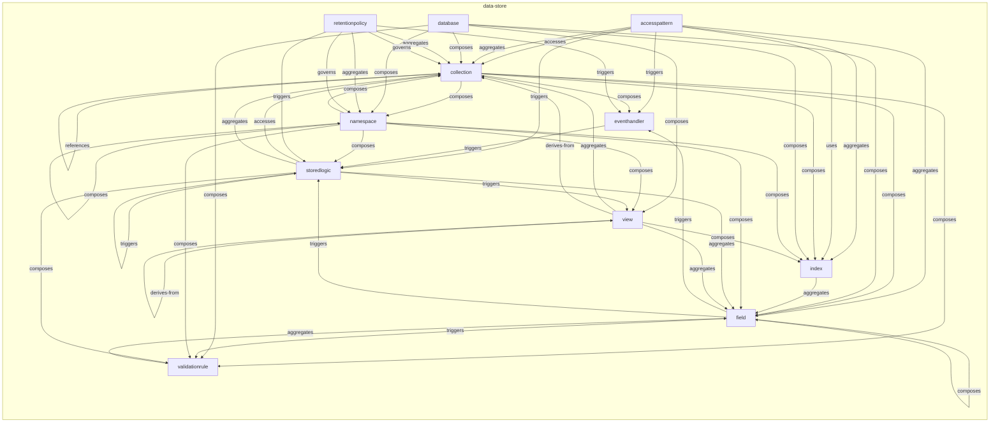
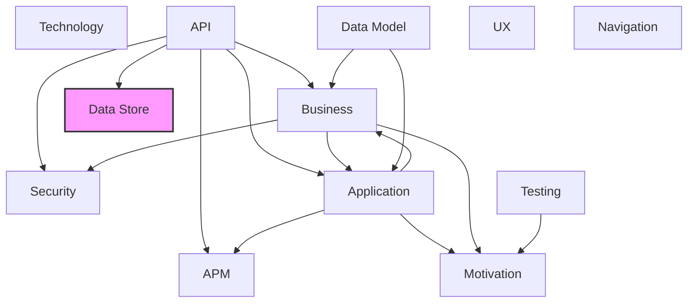

# Data Store Layer

## Report Index

- [Layer Introduction](#layer-introduction)
- [Intra-Layer Relationships](#intra-layer-relationships)
- [Inter-Layer Dependencies](#inter-layer-dependencies)
- [Inter-Layer Relationships Table](#inter-layer-relationships-table)
- [Node Reference](#node-reference)
  - [Accesspattern](#accesspattern)
  - [Collection](#collection)
  - [Database](#database)
  - [Eventhandler](#eventhandler)
  - [Field](#field)
  - [Index](#index)
  - [Namespace](#namespace)
  - [Retentionpolicy](#retentionpolicy)
  - [Storedlogic](#storedlogic)
  - [Validationrule](#validationrule)
  - [View](#view)

## Layer Introduction

**Layer 8**: Data Store
**Standard**: [ISO/IEC 9075 (SQL) + Paradigm Extensions](https://en.wikipedia.org/wiki/Database_model)

Layer 8: Data Store Layer

### Statistics

| Metric                    | Count |
| ------------------------- | ----- |
| Node Types                | 11    |
| Intra-Layer Relationships | 52    |
| Inter-Layer Relationships | 3     |
| Inbound Relationships     | 3     |
| Outbound Relationships    | 0     |

### Layer Dependencies

**Depends On**: [API](./06-api-layer-report.md)

**Depended On By**: None

## Intra-Layer Relationships

## Inter-Layer Dependencies

## Inter-Layer Relationships Table

| Relationship ID                                  | Source Node                                               | Dest Node                                                | Dest Layer                                    | Predicate | Cardinality | Strength |
| ------------------------------------------------ | --------------------------------------------------------- | -------------------------------------------------------- | --------------------------------------------- | --------- | ----------- | -------- |
| api.schema.maps-to.data-store.collection         | [schema](./06-api-layer-report.md#schema)                 | [collection](./08-data-store-layer-report.md#collection) | [Data Store](./08-data-store-layer-report.md) | maps-to   | many-to-one | medium   |
| api.schema.maps-to.data-store.field              | [schema](./06-api-layer-report.md#schema)                 | [field](./08-data-store-layer-report.md#field)           | [Data Store](./08-data-store-layer-report.md) | maps-to   | many-to-one | medium   |
| api.securityscheme.maps-to.data-store.collection | [securityscheme](./06-api-layer-report.md#securityscheme) | [collection](./08-data-store-layer-report.md#collection) | [Data Store](./08-data-store-layer-report.md) | maps-to   | many-to-one | medium   |

## Node Reference

### Accesspattern {#accesspattern}

**Spec Node ID**: `data-store.accesspattern`

A documented data access pattern that describes how applications read or write data. Critical for NoSQL data modeling where schema design is driven by access patterns rather than normalization.

#### Relationship Metrics

- **Intra-Layer**: Inbound: 0 | Outbound: 7
- **Inter-Layer**: Inbound: 0 | Outbound: 0

#### Intra-Layer Relationships

| Related Node                  | Predicate  | Direction | Cardinality |
| ----------------------------- | ---------- | --------- | ----------- |
| [collection](#collection)     | accesses   | outbound  | many-to-one |
| [collection](#collection)     | aggregates | outbound  | many-to-one |
| [field](#field)               | aggregates | outbound  | many-to-one |
| [index](#index)               | aggregates | outbound  | many-to-one |
| [eventhandler](#eventhandler) | triggers   | outbound  | many-to-one |
| [storedlogic](#storedlogic)   | triggers   | outbound  | many-to-one |
| [index](#index)               | uses       | outbound  | many-to-one |

[Back to Index](#report-index)

### Collection {#collection}

**Spec Node ID**: `data-store.collection`

A container for records, documents, or entries within a data store. Paradigm-neutral: maps to SQL table, document store collection, key-value bucket/hash, wide-column table/column family, vector collection, time-series measurement/hypertable, graph node label or edge type, and search engine index.

#### Relationship Metrics

- **Intra-Layer**: Inbound: 12 | Outbound: 7
- **Inter-Layer**: Inbound: 2 | Outbound: 0

#### Intra-Layer Relationships

| Related Node                        | Predicate    | Direction | Cardinality  |
| ----------------------------------- | ------------ | --------- | ------------ |
| [accesspattern](#accesspattern)     | accesses     | inbound   | many-to-one  |
| [accesspattern](#accesspattern)     | aggregates   | inbound   | many-to-one  |
| [collection](#collection)           | composes     | outbound  | many-to-many |
| [eventhandler](#eventhandler)       | composes     | outbound  | many-to-one  |
| [field](#field)                     | composes     | outbound  | many-to-many |
| [index](#index)                     | composes     | outbound  | many-to-many |
| [namespace](#namespace)             | composes     | outbound  | many-to-many |
| [validationrule](#validationrule)   | composes     | outbound  | many-to-many |
| [collection](#collection)           | references   | outbound  | many-to-one  |
| [database](#database)               | composes     | inbound   | many-to-many |
| [namespace](#namespace)             | composes     | inbound   | many-to-many |
| [retentionpolicy](#retentionpolicy) | aggregates   | inbound   | many-to-one  |
| [retentionpolicy](#retentionpolicy) | governs      | inbound   | many-to-one  |
| [storedlogic](#storedlogic)         | accesses     | inbound   | many-to-one  |
| [storedlogic](#storedlogic)         | aggregates   | inbound   | many-to-one  |
| [view](#view)                       | aggregates   | inbound   | many-to-one  |
| [view](#view)                       | derives-from | inbound   | many-to-one  |

#### Inter-Layer Relationships

| Related Node                                              | Layer                           | Predicate | Direction | Cardinality |
| --------------------------------------------------------- | ------------------------------- | --------- | --------- | ----------- |
| [schema](./06-api-layer-report.md#schema)                 | [API](./06-api-layer-report.md) | maps-to   | inbound   | many-to-one |
| [securityscheme](./06-api-layer-report.md#securityscheme) | [API](./06-api-layer-report.md) | maps-to   | inbound   | many-to-one |

[Back to Index](#report-index)

### Database {#database}

**Spec Node ID**: `data-store.database`

A database instance representing a top-level data store deployment. Paradigm-neutral: covers relational databases, document stores, key-value stores, wide-column stores, vector databases, time-series databases, graph databases, search engines, and multi-model systems.

#### Relationship Metrics

- **Intra-Layer**: Inbound: 0 | Outbound: 6
- **Inter-Layer**: Inbound: 0 | Outbound: 0

#### Intra-Layer Relationships

| Related Node                      | Predicate | Direction | Cardinality  |
| --------------------------------- | --------- | --------- | ------------ |
| [collection](#collection)         | composes  | outbound  | many-to-many |
| [field](#field)                   | composes  | outbound  | many-to-many |
| [index](#index)                   | composes  | outbound  | many-to-many |
| [namespace](#namespace)           | composes  | outbound  | many-to-many |
| [validationrule](#validationrule) | composes  | outbound  | many-to-many |
| [view](#view)                     | composes  | outbound  | many-to-one  |

[Back to Index](#report-index)

### Eventhandler {#eventhandler}

**Spec Node ID**: `data-store.eventhandler`

A reactive mechanism that executes in response to data change events. Paradigm-neutral: covers SQL triggers, MongoDB change streams, DynamoDB Streams, Cassandra CDC, Redis keyspace notifications, Elasticsearch watchers, Neo4j APOC triggers, and time-series alerting rules.

#### Relationship Metrics

- **Intra-Layer**: Inbound: 4 | Outbound: 1
- **Inter-Layer**: Inbound: 0 | Outbound: 0

#### Intra-Layer Relationships

| Related Node                        | Predicate | Direction | Cardinality  |
| ----------------------------------- | --------- | --------- | ------------ |
| [accesspattern](#accesspattern)     | triggers  | inbound   | many-to-one  |
| [collection](#collection)           | composes  | inbound   | many-to-one  |
| [storedlogic](#storedlogic)         | triggers  | outbound  | many-to-many |
| [field](#field)                     | triggers  | inbound   | many-to-one  |
| [retentionpolicy](#retentionpolicy) | triggers  | inbound   | many-to-one  |

[Back to Index](#report-index)

### Field {#field}

**Spec Node ID**: `data-store.field`

A named data element within a collection. Paradigm-neutral: maps to SQL column, document store field/path, key-value hash field, wide-column column, vector dimension or metadata field, time-series tag or field, graph property, and search engine mapping property.

#### Relationship Metrics

- **Intra-Layer**: Inbound: 9 | Outbound: 4
- **Inter-Layer**: Inbound: 1 | Outbound: 0

#### Intra-Layer Relationships

| Related Node                      | Predicate  | Direction | Cardinality  |
| --------------------------------- | ---------- | --------- | ------------ |
| [accesspattern](#accesspattern)   | aggregates | inbound   | many-to-one  |
| [collection](#collection)         | composes   | inbound   | many-to-many |
| [database](#database)             | composes   | inbound   | many-to-many |
| [field](#field)                   | composes   | outbound  | many-to-one  |
| [eventhandler](#eventhandler)     | triggers   | outbound  | many-to-one  |
| [storedlogic](#storedlogic)       | triggers   | outbound  | many-to-one  |
| [validationrule](#validationrule) | triggers   | outbound  | many-to-one  |
| [index](#index)                   | aggregates | inbound   | many-to-many |
| [namespace](#namespace)           | composes   | inbound   | many-to-many |
| [storedlogic](#storedlogic)       | aggregates | inbound   | many-to-one  |
| [validationrule](#validationrule) | aggregates | inbound   | many-to-many |
| [view](#view)                     | aggregates | inbound   | many-to-one  |

#### Inter-Layer Relationships

| Related Node                              | Layer                           | Predicate | Direction | Cardinality |
| ----------------------------------------- | ------------------------------- | --------- | --------- | ----------- |
| [schema](./06-api-layer-report.md#schema) | [API](./06-api-layer-report.md) | maps-to   | inbound   | many-to-one |

[Back to Index](#report-index)

### Index {#index}

**Spec Node ID**: `data-store.index`

A database index for query optimization. Paradigm-neutral: covers B-tree and hash indexes (relational), compound and multikey indexes (document stores), vector approximate nearest neighbor indexes (HNSW, IVF), inverted indexes (search engines), geospatial indexes, and secondary indexes (wide-column stores).

#### Relationship Metrics

- **Intra-Layer**: Inbound: 6 | Outbound: 1
- **Inter-Layer**: Inbound: 0 | Outbound: 0

#### Intra-Layer Relationships

| Related Node                    | Predicate  | Direction | Cardinality  |
| ------------------------------- | ---------- | --------- | ------------ |
| [accesspattern](#accesspattern) | aggregates | inbound   | many-to-one  |
| [accesspattern](#accesspattern) | uses       | inbound   | many-to-one  |
| [collection](#collection)       | composes   | inbound   | many-to-many |
| [database](#database)           | composes   | inbound   | many-to-many |
| [field](#field)                 | aggregates | outbound  | many-to-many |
| [namespace](#namespace)         | composes   | inbound   | many-to-many |
| [view](#view)                   | composes   | inbound   | many-to-one  |

[Back to Index](#report-index)

### Namespace {#namespace}

**Spec Node ID**: `data-store.namespace`

A logical grouping of database objects within a database instance. Paradigm-neutral: maps to SQL schema, MongoDB database, Cassandra keyspace, Redis namespace/prefix, Elasticsearch index, vector database namespace, and graph database named graph.

#### Relationship Metrics

- **Intra-Layer**: Inbound: 5 | Outbound: 7
- **Inter-Layer**: Inbound: 0 | Outbound: 0

#### Intra-Layer Relationships

| Related Node                        | Predicate  | Direction | Cardinality  |
| ----------------------------------- | ---------- | --------- | ------------ |
| [collection](#collection)           | composes   | inbound   | many-to-many |
| [database](#database)               | composes   | inbound   | many-to-many |
| [collection](#collection)           | composes   | outbound  | many-to-many |
| [field](#field)                     | composes   | outbound  | many-to-many |
| [index](#index)                     | composes   | outbound  | many-to-many |
| [namespace](#namespace)             | composes   | outbound  | many-to-many |
| [storedlogic](#storedlogic)         | composes   | outbound  | one-to-many  |
| [validationrule](#validationrule)   | composes   | outbound  | many-to-many |
| [view](#view)                       | composes   | outbound  | many-to-one  |
| [retentionpolicy](#retentionpolicy) | aggregates | inbound   | many-to-one  |
| [retentionpolicy](#retentionpolicy) | governs    | inbound   | many-to-one  |

[Back to Index](#report-index)

### Retentionpolicy {#retentionpolicy}

**Spec Node ID**: `data-store.retentionpolicy`

A data lifecycle management policy that governs how long data is retained and what action is taken when the retention period expires. Applicable across paradigms: time-series downsampling, key-value TTL, search index lifecycle, relational partition pruning, and archival strategies.

#### Relationship Metrics

- **Intra-Layer**: Inbound: 0 | Outbound: 6
- **Inter-Layer**: Inbound: 0 | Outbound: 0

#### Intra-Layer Relationships

| Related Node                  | Predicate  | Direction | Cardinality |
| ----------------------------- | ---------- | --------- | ----------- |
| [collection](#collection)     | aggregates | outbound  | many-to-one |
| [namespace](#namespace)       | aggregates | outbound  | many-to-one |
| [collection](#collection)     | governs    | outbound  | many-to-one |
| [namespace](#namespace)       | governs    | outbound  | many-to-one |
| [eventhandler](#eventhandler) | triggers   | outbound  | many-to-one |
| [storedlogic](#storedlogic)   | triggers   | outbound  | many-to-one |

[Back to Index](#report-index)

### Storedlogic {#storedlogic}

**Spec Node ID**: `data-store.storedlogic`

Stored computation logic that executes within the data store engine. Paradigm-neutral: covers SQL functions and procedures, MongoDB aggregation pipelines, Redis Lua scripts, Cassandra UDFs, Neo4j stored procedures, Elasticsearch ingest pipelines, time-series continuous queries, and DynamoDB Lambda triggers.

#### Relationship Metrics

- **Intra-Layer**: Inbound: 7 | Outbound: 7
- **Inter-Layer**: Inbound: 0 | Outbound: 0

#### Intra-Layer Relationships

| Related Node                        | Predicate  | Direction | Cardinality  |
| ----------------------------------- | ---------- | --------- | ------------ |
| [accesspattern](#accesspattern)     | triggers   | inbound   | many-to-one  |
| [eventhandler](#eventhandler)       | triggers   | inbound   | many-to-many |
| [field](#field)                     | triggers   | inbound   | many-to-one  |
| [namespace](#namespace)             | composes   | inbound   | one-to-many  |
| [retentionpolicy](#retentionpolicy) | triggers   | inbound   | many-to-one  |
| [collection](#collection)           | accesses   | outbound  | many-to-one  |
| [collection](#collection)           | aggregates | outbound  | many-to-one  |
| [field](#field)                     | aggregates | outbound  | many-to-one  |
| [storedlogic](#storedlogic)         | composes   | outbound  | many-to-one  |
| [validationrule](#validationrule)   | composes   | outbound  | many-to-one  |
| [storedlogic](#storedlogic)         | triggers   | outbound  | many-to-one  |
| [view](#view)                       | triggers   | outbound  | many-to-one  |

[Back to Index](#report-index)

### Validationrule {#validationrule}

**Spec Node ID**: `data-store.validationrule`

A data integrity or validation rule enforced by the data store. Paradigm-neutral: covers SQL constraints (PRIMARY KEY, FOREIGN KEY, UNIQUE, CHECK, NOT NULL), document store schema validation and required fields, graph uniqueness and existence constraints, key-value key format rules, and search engine mapping enforcement.

#### Relationship Metrics

- **Intra-Layer**: Inbound: 5 | Outbound: 1
- **Inter-Layer**: Inbound: 0 | Outbound: 0

#### Intra-Layer Relationships

| Related Node                | Predicate  | Direction | Cardinality  |
| --------------------------- | ---------- | --------- | ------------ |
| [collection](#collection)   | composes   | inbound   | many-to-many |
| [database](#database)       | composes   | inbound   | many-to-many |
| [field](#field)             | triggers   | inbound   | many-to-one  |
| [namespace](#namespace)     | composes   | inbound   | many-to-many |
| [storedlogic](#storedlogic) | composes   | inbound   | many-to-one  |
| [field](#field)             | aggregates | outbound  | many-to-many |

[Back to Index](#report-index)

### View {#view}

**Spec Node ID**: `data-store.view`

A derived or virtual collection that presents data from one or more source collections. Paradigm-neutral: covers SQL views and materialized views, search engine aliases, document store views (CouchDB), time-series continuous aggregates (TimescaleDB), and named graph projections.

#### Relationship Metrics

- **Intra-Layer**: Inbound: 4 | Outbound: 5
- **Inter-Layer**: Inbound: 0 | Outbound: 0

#### Intra-Layer Relationships

| Related Node                | Predicate    | Direction | Cardinality |
| --------------------------- | ------------ | --------- | ----------- |
| [database](#database)       | composes     | inbound   | many-to-one |
| [namespace](#namespace)     | composes     | inbound   | many-to-one |
| [storedlogic](#storedlogic) | triggers     | inbound   | many-to-one |
| [collection](#collection)   | aggregates   | outbound  | many-to-one |
| [field](#field)             | aggregates   | outbound  | many-to-one |
| [index](#index)             | composes     | outbound  | many-to-one |
| [collection](#collection)   | derives-from | outbound  | many-to-one |
| [view](#view)               | derives-from | outbound  | many-to-one |

[Back to Index](#report-index)

---

_Generated: 2026-02-28T10:53:05.785Z | Spec Version: 0.8.0 | Generator: generate-layer-reports.ts_
