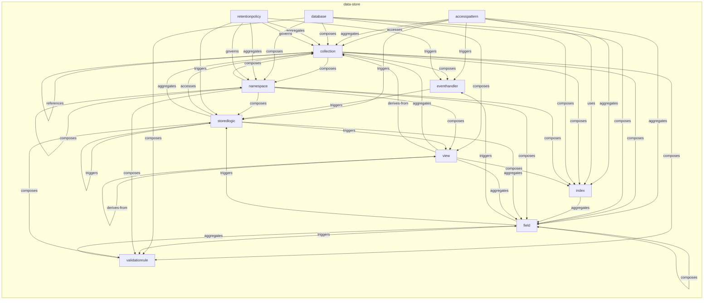
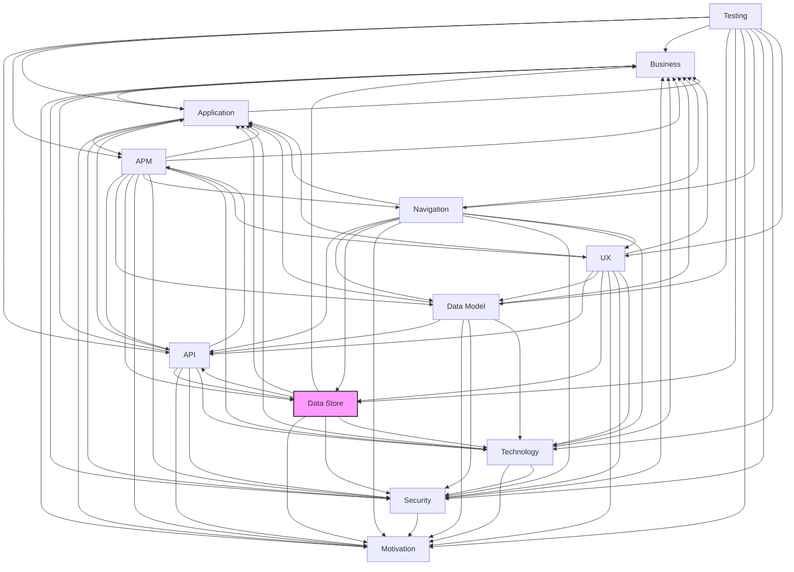

# Data Store Layer

## Report Index

- [Layer Introduction](#layer-introduction)
- [Intra-Layer Relationships](#intra-layer-relationships)
- [Inter-Layer Dependencies](#inter-layer-dependencies)
- [Inter-Layer Relationships Table](#inter-layer-relationships-table)
- [Node Reference](#node-reference)
  - [Accesspattern](#accesspattern)
  - [Collection](#collection)
  - [Database](#database)
  - [Eventhandler](#eventhandler)
  - [Field](#field)
  - [Index](#index)
  - [Namespace](#namespace)
  - [Retentionpolicy](#retentionpolicy)
  - [Storedlogic](#storedlogic)
  - [Validationrule](#validationrule)
  - [View](#view)

## Layer Introduction

**Layer 8**: Data Store
**Standard**: [ISO/IEC 9075 (SQL) + Paradigm Extensions](https://en.wikipedia.org/wiki/Database_model)

Layer 8: Data Store Layer

### Statistics

| Metric                    | Count |
| ------------------------- | ----- |
| Node Types                | 11    |
| Intra-Layer Relationships | 52    |
| Inter-Layer Relationships | 77    |
| Inbound Relationships     | 32    |
| Outbound Relationships    | 45    |

### Layer Dependencies

**Depends On**: [API](./06-api-layer-report.md), [UX](./09-ux-layer-report.md), [Navigation](./10-navigation-layer-report.md), [APM](./11-apm-layer-report.md), [Testing](./12-testing-layer-report.md)

**Depended On By**: [Motivation](./01-motivation-layer-report.md), [Business](./02-business-layer-report.md), [Security](./03-security-layer-report.md), [Application](./04-application-layer-report.md), [Technology](./05-technology-layer-report.md), [API](./06-api-layer-report.md)

## Intra-Layer Relationships

```mermaid
flowchart LR
  subgraph data-store
    accesspattern["accesspattern"]
    collection["collection"]
    database["database"]
    eventhandler["eventhandler"]
    field["field"]
    index["index"]
    namespace["namespace"]
    retentionpolicy["retentionpolicy"]
    storedlogic["storedlogic"]
    validationrule["validationrule"]
    view["view"]
    accesspattern -->|accesses| collection
    accesspattern -->|aggregates| collection
    accesspattern -->|aggregates| field
    accesspattern -->|aggregates| index
    accesspattern -->|triggers| eventhandler
    accesspattern -->|triggers| storedlogic
    accesspattern -->|uses| index
    collection -->|composes| collection
    collection -->|composes| eventhandler
    collection -->|composes| field
    collection -->|composes| index
    collection -->|composes| namespace
    collection -->|composes| validationrule
    collection -->|references| collection
    database -->|composes| collection
    database -->|composes| field
    database -->|composes| index
    database -->|composes| namespace
    database -->|composes| validationrule
    database -->|composes| view
    eventhandler -->|triggers| storedlogic
    field -->|composes| field
    field -->|triggers| eventhandler
    field -->|triggers| storedlogic
    field -->|triggers| validationrule
    index -->|aggregates| field
    namespace -->|composes| collection
    namespace -->|composes| field
    namespace -->|composes| index
    namespace -->|composes| namespace
    namespace -->|composes| storedlogic
    namespace -->|composes| validationrule
    namespace -->|composes| view
    retentionpolicy -->|aggregates| collection
    retentionpolicy -->|aggregates| namespace
    retentionpolicy -->|governs| collection
    retentionpolicy -->|governs| namespace
    retentionpolicy -->|triggers| eventhandler
    retentionpolicy -->|triggers| storedlogic
    storedlogic -->|accesses| collection
    storedlogic -->|aggregates| collection
    storedlogic -->|aggregates| field
    storedlogic -->|composes| storedlogic
    storedlogic -->|composes| validationrule
    storedlogic -->|triggers| storedlogic
    storedlogic -->|triggers| view
    validationrule -->|aggregates| field
    view -->|aggregates| collection
    view -->|aggregates| field
    view -->|composes| index
    view -->|derives-from| collection
    view -->|derives-from| view
  end
```

## Inter-Layer Dependencies

```mermaid
flowchart TB
  classDef current fill:#f9f,stroke:#333,stroke-width:2px
  motivation["Motivation"]
  business["Business"]
  security["Security"]
  application["Application"]
  technology["Technology"]
  api["API"]
  data_model["Data Model"]
  data_store["Data Store"]
  ux["UX"]
  navigation["Navigation"]
  apm["APM"]
  testing["Testing"]
  api --> apm
  api --> application
  api --> business
  api --> data_store
  api --> motivation
  api --> security
  api --> technology
  apm --> api
  apm --> application
  apm --> business
  apm --> data_model
  apm --> data_store
  apm --> motivation
  apm --> navigation
  apm --> security
  apm --> technology
  apm --> ux
  application --> apm
  application --> business
  application --> motivation
  application --> security
  business --> application
  business --> motivation
  business --> security
  data_model --> api
  data_model --> application
  data_model --> business
  data_model --> motivation
  data_model --> security
  data_model --> technology
  data_store --> api
  data_store --> application
  data_store --> business
  data_store --> motivation
  data_store --> security
  data_store --> technology
  navigation --> api
  navigation --> application
  navigation --> business
  navigation --> data_model
  navigation --> data_store
  navigation --> motivation
  navigation --> security
  navigation --> technology
  navigation --> ux
  security --> business
  security --> motivation
  technology --> application
  technology --> business
  technology --> motivation
  technology --> security
  testing --> api
  testing --> apm
  testing --> application
  testing --> business
  testing --> data_model
  testing --> data_store
  testing --> motivation
  testing --> navigation
  testing --> security
  testing --> technology
  testing --> ux
  ux --> api
  ux --> application
  ux --> business
  ux --> data_model
  ux --> data_store
  ux --> motivation
  ux --> security
  ux --> technology
  class data_store current
```

## Inter-Layer Relationships Table

| Relationship ID                                                   | Source Node                                                             | Dest Node                                                                     | Dest Layer                                      | Predicate  | Cardinality | Strength |
| ----------------------------------------------------------------- | ----------------------------------------------------------------------- | ----------------------------------------------------------------------------- | ----------------------------------------------- | ---------- | ----------- | -------- |
| api.schema.maps-to.data-store.collection                          | [Schema](./06-api-layer-report.md#schema)                               | [Collection](./08-data-store-layer-report.md#collection)                      | [Data Store](./08-data-store-layer-report.md)   | maps-to    | many-to-one | medium   |
| api.schema.maps-to.data-store.field                               | [Schema](./06-api-layer-report.md#schema)                               | [Field](./08-data-store-layer-report.md#field)                                | [Data Store](./08-data-store-layer-report.md)   | maps-to    | many-to-one | medium   |
| api.securityscheme.maps-to.data-store.collection                  | [Securityscheme](./06-api-layer-report.md#securityscheme)               | [Collection](./08-data-store-layer-report.md#collection)                      | [Data Store](./08-data-store-layer-report.md)   | maps-to    | many-to-one | medium   |
| apm.exporterconfig.serves.data-store.database                     | [Exporterconfig](./11-apm-layer-report.md#exporterconfig)               | [Database](./08-data-store-layer-report.md#database)                          | [Data Store](./08-data-store-layer-report.md)   | serves     | many-to-one | medium   |
| apm.logconfiguration.depends-on.data-store.database               | [Logconfiguration](./11-apm-layer-report.md#logconfiguration)           | [Database](./08-data-store-layer-report.md#database)                          | [Data Store](./08-data-store-layer-report.md)   | depends-on | many-to-one | medium   |
| apm.metricinstrument.monitors.data-store.collection               | [Metricinstrument](./11-apm-layer-report.md#metricinstrument)           | [Collection](./08-data-store-layer-report.md#collection)                      | [Data Store](./08-data-store-layer-report.md)   | monitors   | many-to-one | medium   |
| apm.metricinstrument.monitors.data-store.database                 | [Metricinstrument](./11-apm-layer-report.md#metricinstrument)           | [Database](./08-data-store-layer-report.md#database)                          | [Data Store](./08-data-store-layer-report.md)   | monitors   | many-to-one | medium   |
| apm.span.accesses.data-store.collection                           | [Span](./11-apm-layer-report.md#span)                                   | [Collection](./08-data-store-layer-report.md#collection)                      | [Data Store](./08-data-store-layer-report.md)   | accesses   | many-to-one | medium   |
| apm.span.monitors.data-store.database                             | [Span](./11-apm-layer-report.md#span)                                   | [Database](./08-data-store-layer-report.md#database)                          | [Data Store](./08-data-store-layer-report.md)   | monitors   | many-to-one | medium   |
| apm.traceconfiguration.depends-on.data-store.database             | [Traceconfiguration](./11-apm-layer-report.md#traceconfiguration)       | [Database](./08-data-store-layer-report.md#database)                          | [Data Store](./08-data-store-layer-report.md)   | depends-on | many-to-one | medium   |
| data-store.accesspattern.maps-to.api.operation                    | [Accesspattern](./08-data-store-layer-report.md#accesspattern)          | [Operation](./06-api-layer-report.md#operation)                               | [API](./06-api-layer-report.md)                 | maps-to    | many-to-one | medium   |
| data-store.accesspattern.satisfies.motivation.requirement         | [Accesspattern](./08-data-store-layer-report.md#accesspattern)          | [Requirement](./01-motivation-layer-report.md#requirement)                    | [Motivation](./01-motivation-layer-report.md)   | satisfies  | many-to-one | medium   |
| data-store.accesspattern.satisfies.security.accesscondition       | [Accesspattern](./08-data-store-layer-report.md#accesspattern)          | [Accesscondition](./03-security-layer-report.md#accesscondition)              | [Security](./03-security-layer-report.md)       | satisfies  | many-to-one | medium   |
| data-store.accesspattern.serves.application.applicationfunction   | [Accesspattern](./08-data-store-layer-report.md#accesspattern)          | [Applicationfunction](./04-application-layer-report.md#applicationfunction)   | [Application](./04-application-layer-report.md) | serves     | many-to-one | medium   |
| data-store.accesspattern.serves.business.businessfunction         | [Accesspattern](./08-data-store-layer-report.md#accesspattern)          | [Businessfunction](./02-business-layer-report.md#businessfunction)            | [Business](./02-business-layer-report.md)       | serves     | many-to-one | medium   |
| data-store.collection.implements.security.secureresource          | [Collection](./08-data-store-layer-report.md#collection)                | [Secureresource](./03-security-layer-report.md#secureresource)                | [Security](./03-security-layer-report.md)       | implements | many-to-one | medium   |
| data-store.collection.maps-to.api.requestbody                     | [Collection](./08-data-store-layer-report.md#collection)                | [Requestbody](./06-api-layer-report.md#requestbody)                           | [API](./06-api-layer-report.md)                 | maps-to    | many-to-one | medium   |
| data-store.collection.realizes.api.schema                         | [Collection](./08-data-store-layer-report.md#collection)                | [Schema](./06-api-layer-report.md#schema)                                     | [API](./06-api-layer-report.md)                 | realizes   | many-to-one | medium   |
| data-store.collection.realizes.business.businessobject            | [Collection](./08-data-store-layer-report.md#collection)                | [Businessobject](./02-business-layer-report.md#businessobject)                | [Business](./02-business-layer-report.md)       | realizes   | many-to-one | medium   |
| data-store.collection.satisfies.motivation.requirement            | [Collection](./08-data-store-layer-report.md#collection)                | [Requirement](./01-motivation-layer-report.md#requirement)                    | [Motivation](./01-motivation-layer-report.md)   | satisfies  | many-to-one | medium   |
| data-store.collection.satisfies.security.dataclassification       | [Collection](./08-data-store-layer-report.md#collection)                | [Dataclassification](./03-security-layer-report.md#dataclassification)        | [Security](./03-security-layer-report.md)       | satisfies  | many-to-one | medium   |
| data-store.collection.serves.api.operation                        | [Collection](./08-data-store-layer-report.md#collection)                | [Operation](./06-api-layer-report.md#operation)                               | [API](./06-api-layer-report.md)                 | serves     | many-to-one | medium   |
| data-store.collection.serves.application.applicationcomponent     | [Collection](./08-data-store-layer-report.md#collection)                | [Applicationcomponent](./04-application-layer-report.md#applicationcomponent) | [Application](./04-application-layer-report.md) | serves     | many-to-one | medium   |
| data-store.database.depends-on.technology.node                    | [Database](./08-data-store-layer-report.md#database)                    | [Node](./05-technology-layer-report.md#node)                                  | [Technology](./05-technology-layer-report.md)   | depends-on | many-to-one | medium   |
| data-store.database.depends-on.technology.systemsoftware          | [Database](./08-data-store-layer-report.md#database)                    | [Systemsoftware](./05-technology-layer-report.md#systemsoftware)              | [Technology](./05-technology-layer-report.md)   | depends-on | many-to-one | medium   |
| data-store.database.realizes.business.businessservice             | [Database](./08-data-store-layer-report.md#database)                    | [Businessservice](./02-business-layer-report.md#businessservice)              | [Business](./02-business-layer-report.md)       | realizes   | many-to-one | medium   |
| data-store.database.satisfies.motivation.constraint               | [Database](./08-data-store-layer-report.md#database)                    | [Constraint](./01-motivation-layer-report.md#constraint)                      | [Motivation](./01-motivation-layer-report.md)   | satisfies  | many-to-one | medium   |
| data-store.database.satisfies.motivation.requirement              | [Database](./08-data-store-layer-report.md#database)                    | [Requirement](./01-motivation-layer-report.md#requirement)                    | [Motivation](./01-motivation-layer-report.md)   | satisfies  | many-to-one | medium   |
| data-store.database.satisfies.security.securitypolicy             | [Database](./08-data-store-layer-report.md#database)                    | [Securitypolicy](./03-security-layer-report.md#securitypolicy)                | [Security](./03-security-layer-report.md)       | satisfies  | many-to-one | medium   |
| data-store.database.serves.application.applicationcomponent       | [Database](./08-data-store-layer-report.md#database)                    | [Applicationcomponent](./04-application-layer-report.md#applicationcomponent) | [Application](./04-application-layer-report.md) | serves     | many-to-one | medium   |
| data-store.database.serves.application.applicationservice         | [Database](./08-data-store-layer-report.md#database)                    | [Applicationservice](./04-application-layer-report.md#applicationservice)     | [Application](./04-application-layer-report.md) | serves     | many-to-one | medium   |
| data-store.database.serves.business.businessprocess               | [Database](./08-data-store-layer-report.md#database)                    | [Businessprocess](./02-business-layer-report.md#businessprocess)              | [Business](./02-business-layer-report.md)       | serves     | many-to-one | medium   |
| data-store.database.uses.technology.technologyservice             | [Database](./08-data-store-layer-report.md#database)                    | [Technologyservice](./05-technology-layer-report.md#technologyservice)        | [Technology](./05-technology-layer-report.md)   | uses       | many-to-one | medium   |
| data-store.eventhandler.triggers.application.applicationevent     | [Eventhandler](./08-data-store-layer-report.md#eventhandler)            | [Applicationevent](./04-application-layer-report.md#applicationevent)         | [Application](./04-application-layer-report.md) | triggers   | many-to-one | medium   |
| data-store.eventhandler.triggers.business.businessevent           | [Eventhandler](./08-data-store-layer-report.md#eventhandler)            | [Businessevent](./02-business-layer-report.md#businessevent)                  | [Business](./02-business-layer-report.md)       | triggers   | many-to-one | medium   |
| data-store.field.maps-to.api.parameter                            | [Field](./08-data-store-layer-report.md#field)                          | [Parameter](./06-api-layer-report.md#parameter)                               | [API](./06-api-layer-report.md)                 | maps-to    | many-to-one | medium   |
| data-store.field.requires.security.fieldaccesscontrol             | [Field](./08-data-store-layer-report.md#field)                          | [Fieldaccesscontrol](./03-security-layer-report.md#fieldaccesscontrol)        | [Security](./03-security-layer-report.md)       | requires   | many-to-one | medium   |
| data-store.field.satisfies.security.dataclassification            | [Field](./08-data-store-layer-report.md#field)                          | [Dataclassification](./03-security-layer-report.md#dataclassification)        | [Security](./03-security-layer-report.md)       | satisfies  | many-to-one | medium   |
| data-store.retentionpolicy.satisfies.business.contract            | [Retentionpolicy](./08-data-store-layer-report.md#retentionpolicy)      | [Contract](./02-business-layer-report.md#contract)                            | [Business](./02-business-layer-report.md)       | satisfies  | many-to-one | medium   |
| data-store.retentionpolicy.satisfies.motivation.constraint        | [Retentionpolicy](./08-data-store-layer-report.md#retentionpolicy)      | [Constraint](./01-motivation-layer-report.md#constraint)                      | [Motivation](./01-motivation-layer-report.md)   | satisfies  | many-to-one | medium   |
| data-store.retentionpolicy.satisfies.motivation.principle         | [Retentionpolicy](./08-data-store-layer-report.md#retentionpolicy)      | [Principle](./01-motivation-layer-report.md#principle)                        | [Motivation](./01-motivation-layer-report.md)   | satisfies  | many-to-one | medium   |
| data-store.retentionpolicy.satisfies.motivation.requirement       | [Retentionpolicy](./08-data-store-layer-report.md#retentionpolicy)      | [Requirement](./01-motivation-layer-report.md#requirement)                    | [Motivation](./01-motivation-layer-report.md)   | satisfies  | many-to-one | medium   |
| data-store.retentionpolicy.satisfies.security.retentionpolicy     | [Retentionpolicy](./08-data-store-layer-report.md#retentionpolicy)      | [Retentionpolicy](./03-security-layer-report.md#retentionpolicy)              | [Security](./03-security-layer-report.md)       | satisfies  | many-to-one | medium   |
| data-store.retentionpolicy.uses.technology.technologyservice      | [Retentionpolicy](./08-data-store-layer-report.md#retentionpolicy)      | [Technologyservice](./05-technology-layer-report.md#technologyservice)        | [Technology](./05-technology-layer-report.md)   | uses       | many-to-one | medium   |
| data-store.storedlogic.depends-on.technology.systemsoftware       | [Storedlogic](./08-data-store-layer-report.md#storedlogic)              | [Systemsoftware](./05-technology-layer-report.md#systemsoftware)              | [Technology](./05-technology-layer-report.md)   | depends-on | many-to-one | medium   |
| data-store.storedlogic.implements.application.applicationfunction | [Storedlogic](./08-data-store-layer-report.md#storedlogic)              | [Applicationfunction](./04-application-layer-report.md#applicationfunction)   | [Application](./04-application-layer-report.md) | implements | many-to-one | medium   |
| data-store.storedlogic.realizes.business.businessfunction         | [Storedlogic](./08-data-store-layer-report.md#storedlogic)              | [Businessfunction](./02-business-layer-report.md#businessfunction)            | [Business](./02-business-layer-report.md)       | realizes   | many-to-one | medium   |
| data-store.storedlogic.satisfies.security.securitypolicy          | [Storedlogic](./08-data-store-layer-report.md#storedlogic)              | [Securitypolicy](./03-security-layer-report.md#securitypolicy)                | [Security](./03-security-layer-report.md)       | satisfies  | many-to-one | medium   |
| data-store.storedlogic.serves.api.operation                       | [Storedlogic](./08-data-store-layer-report.md#storedlogic)              | [Operation](./06-api-layer-report.md#operation)                               | [API](./06-api-layer-report.md)                 | serves     | many-to-one | medium   |
| data-store.storedlogic.serves.application.applicationservice      | [Storedlogic](./08-data-store-layer-report.md#storedlogic)              | [Applicationservice](./04-application-layer-report.md#applicationservice)     | [Application](./04-application-layer-report.md) | serves     | many-to-one | medium   |
| data-store.storedlogic.uses.technology.technologyservice          | [Storedlogic](./08-data-store-layer-report.md#storedlogic)              | [Technologyservice](./05-technology-layer-report.md#technologyservice)        | [Technology](./05-technology-layer-report.md)   | uses       | many-to-one | medium   |
| data-store.validationrule.satisfies.motivation.requirement        | [Validationrule](./08-data-store-layer-report.md#validationrule)        | [Requirement](./01-motivation-layer-report.md#requirement)                    | [Motivation](./01-motivation-layer-report.md)   | satisfies  | many-to-one | medium   |
| data-store.view.realizes.api.response                             | [View](./08-data-store-layer-report.md#view)                            | [Response](./06-api-layer-report.md#response)                                 | [API](./06-api-layer-report.md)                 | realizes   | many-to-one | medium   |
| data-store.view.serves.application.applicationservice             | [View](./08-data-store-layer-report.md#view)                            | [Applicationservice](./04-application-layer-report.md#applicationservice)     | [Application](./04-application-layer-report.md) | serves     | many-to-one | medium   |
| data-store.view.serves.business.businessservice                   | [View](./08-data-store-layer-report.md#view)                            | [Businessservice](./02-business-layer-report.md#businessservice)              | [Business](./02-business-layer-report.md)       | serves     | many-to-one | medium   |
| navigation.flowstep.accesses.data-store.collection                | [Flowstep](./10-navigation-layer-report.md#flowstep)                    | [Collection](./08-data-store-layer-report.md#collection)                      | [Data Store](./08-data-store-layer-report.md)   | accesses   | many-to-one | medium   |
| navigation.navigationflow.accesses.data-store.collection          | [Navigationflow](./10-navigation-layer-report.md#navigationflow)        | [Collection](./08-data-store-layer-report.md#collection)                      | [Data Store](./08-data-store-layer-report.md)   | accesses   | many-to-one | medium   |
| navigation.navigationguard.accesses.data-store.collection         | [Navigationguard](./10-navigation-layer-report.md#navigationguard)      | [Collection](./08-data-store-layer-report.md#collection)                      | [Data Store](./08-data-store-layer-report.md)   | accesses   | many-to-one | medium   |
| navigation.route.accesses.data-store.collection                   | [Route](./10-navigation-layer-report.md#route)                          | [Collection](./08-data-store-layer-report.md#collection)                      | [Data Store](./08-data-store-layer-report.md)   | accesses   | many-to-one | medium   |
| navigation.route.depends-on.data-store.accesspattern              | [Route](./10-navigation-layer-report.md#route)                          | [Accesspattern](./08-data-store-layer-report.md#accesspattern)                | [Data Store](./08-data-store-layer-report.md)   | depends-on | many-to-one | medium   |
| navigation.route.uses.data-store.view                             | [Route](./10-navigation-layer-report.md#route)                          | [View](./08-data-store-layer-report.md#view)                                  | [Data Store](./08-data-store-layer-report.md)   | uses       | many-to-one | medium   |
| testing.inputspacepartition.references.data-store.collection      | [Inputspacepartition](./12-testing-layer-report.md#inputspacepartition) | [Collection](./08-data-store-layer-report.md#collection)                      | [Data Store](./08-data-store-layer-report.md)   | references | many-to-one | medium   |
| testing.testcasesketch.accesses.data-store.collection             | [Testcasesketch](./12-testing-layer-report.md#testcasesketch)           | [Collection](./08-data-store-layer-report.md#collection)                      | [Data Store](./08-data-store-layer-report.md)   | accesses   | many-to-one | medium   |
| testing.testcasesketch.accesses.data-store.view                   | [Testcasesketch](./12-testing-layer-report.md#testcasesketch)           | [View](./08-data-store-layer-report.md#view)                                  | [Data Store](./08-data-store-layer-report.md)   | accesses   | many-to-one | medium   |
| testing.testcasesketch.tests.data-store.validationrule            | [Testcasesketch](./12-testing-layer-report.md#testcasesketch)           | [Validationrule](./08-data-store-layer-report.md#validationrule)              | [Data Store](./08-data-store-layer-report.md)   | tests      | many-to-one | medium   |
| testing.testcoveragemodel.references.data-store.database          | [Testcoveragemodel](./12-testing-layer-report.md#testcoveragemodel)     | [Database](./08-data-store-layer-report.md#database)                          | [Data Store](./08-data-store-layer-report.md)   | references | many-to-one | medium   |
| testing.testcoveragetarget.tests.data-store.collection            | [Testcoveragetarget](./12-testing-layer-report.md#testcoveragetarget)   | [Collection](./08-data-store-layer-report.md#collection)                      | [Data Store](./08-data-store-layer-report.md)   | tests      | many-to-one | medium   |
| testing.testcoveragetarget.tests.data-store.storedlogic           | [Testcoveragetarget](./12-testing-layer-report.md#testcoveragetarget)   | [Storedlogic](./08-data-store-layer-report.md#storedlogic)                    | [Data Store](./08-data-store-layer-report.md)   | tests      | many-to-one | medium   |
| testing.testcoveragetarget.tests.data-store.view                  | [Testcoveragetarget](./12-testing-layer-report.md#testcoveragetarget)   | [View](./08-data-store-layer-report.md#view)                                  | [Data Store](./08-data-store-layer-report.md)   | tests      | many-to-one | medium   |
| ux.actioncomponent.accesses.data-store.collection                 | [Actioncomponent](./09-ux-layer-report.md#actioncomponent)              | [Collection](./08-data-store-layer-report.md#collection)                      | [Data Store](./08-data-store-layer-report.md)   | accesses   | many-to-one | medium   |
| ux.actioncomponent.triggers.data-store.storedlogic                | [Actioncomponent](./09-ux-layer-report.md#actioncomponent)              | [Storedlogic](./08-data-store-layer-report.md#storedlogic)                    | [Data Store](./08-data-store-layer-report.md)   | triggers   | many-to-one | medium   |
| ux.chartseries.accesses.data-store.collection                     | [Chartseries](./09-ux-layer-report.md#chartseries)                      | [Collection](./08-data-store-layer-report.md#collection)                      | [Data Store](./08-data-store-layer-report.md)   | accesses   | many-to-one | medium   |
| ux.dataconfig.accesses.data-store.collection                      | [Dataconfig](./09-ux-layer-report.md#dataconfig)                        | [Collection](./08-data-store-layer-report.md#collection)                      | [Data Store](./08-data-store-layer-report.md)   | accesses   | many-to-one | medium   |
| ux.subview.accesses.data-store.collection                         | [Subview](./09-ux-layer-report.md#subview)                              | [Collection](./08-data-store-layer-report.md#collection)                      | [Data Store](./08-data-store-layer-report.md)   | accesses   | many-to-one | medium   |
| ux.tablecolumn.maps-to.data-store.field                           | [Tablecolumn](./09-ux-layer-report.md#tablecolumn)                      | [Field](./08-data-store-layer-report.md#field)                                | [Data Store](./08-data-store-layer-report.md)   | maps-to    | many-to-one | medium   |
| ux.view.accesses.data-store.collection                            | [View](./09-ux-layer-report.md#view)                                    | [Collection](./08-data-store-layer-report.md#collection)                      | [Data Store](./08-data-store-layer-report.md)   | accesses   | many-to-one | medium   |
| ux.view.accesses.data-store.view                                  | [View](./09-ux-layer-report.md#view)                                    | [View](./08-data-store-layer-report.md#view)                                  | [Data Store](./08-data-store-layer-report.md)   | accesses   | many-to-one | medium   |

## Node Reference

### Accesspattern {#accesspattern}

**Spec Node ID**: `data-store.accesspattern`

A documented data access pattern that describes how applications read or write data. Critical for NoSQL data modeling where schema design is driven by access patterns rather than normalization.

#### Relationship Metrics

- **Intra-Layer**: Inbound: 0 | Outbound: 7
- **Inter-Layer**: Inbound: 1 | Outbound: 5

#### Intra-Layer Relationships

| Related Node                  | Predicate  | Direction | Cardinality |
| ----------------------------- | ---------- | --------- | ----------- |
| [Collection](#collection)     | accesses   | outbound  | many-to-one |
| [Collection](#collection)     | aggregates | outbound  | many-to-one |
| [Field](#field)               | aggregates | outbound  | many-to-one |
| [Index](#index)               | aggregates | outbound  | many-to-one |
| [Eventhandler](#eventhandler) | triggers   | outbound  | many-to-one |
| [Storedlogic](#storedlogic)   | triggers   | outbound  | many-to-one |
| [Index](#index)               | uses       | outbound  | many-to-one |

#### Inter-Layer Relationships

| Related Node                                                                | Layer                                           | Predicate  | Direction | Cardinality |
| --------------------------------------------------------------------------- | ----------------------------------------------- | ---------- | --------- | ----------- |
| [Operation](./06-api-layer-report.md#operation)                             | [API](./06-api-layer-report.md)                 | maps-to    | outbound  | many-to-one |
| [Requirement](./01-motivation-layer-report.md#requirement)                  | [Motivation](./01-motivation-layer-report.md)   | satisfies  | outbound  | many-to-one |
| [Accesscondition](./03-security-layer-report.md#accesscondition)            | [Security](./03-security-layer-report.md)       | satisfies  | outbound  | many-to-one |
| [Applicationfunction](./04-application-layer-report.md#applicationfunction) | [Application](./04-application-layer-report.md) | serves     | outbound  | many-to-one |
| [Businessfunction](./02-business-layer-report.md#businessfunction)          | [Business](./02-business-layer-report.md)       | serves     | outbound  | many-to-one |
| [Route](./10-navigation-layer-report.md#route)                              | [Navigation](./10-navigation-layer-report.md)   | depends-on | inbound   | many-to-one |

[Back to Index](#report-index)

### Collection {#collection}

**Spec Node ID**: `data-store.collection`

A container for records, documents, or entries within a data store. Paradigm-neutral: maps to SQL table, document store collection, key-value bucket/hash, wide-column table/column family, vector collection, time-series measurement/hypertable, graph node label or edge type, and search engine index.

#### Relationship Metrics

- **Intra-Layer**: Inbound: 12 | Outbound: 7
- **Inter-Layer**: Inbound: 16 | Outbound: 8

#### Intra-Layer Relationships

| Related Node                        | Predicate    | Direction | Cardinality  |
| ----------------------------------- | ------------ | --------- | ------------ |
| [Accesspattern](#accesspattern)     | accesses     | inbound   | many-to-one  |
| [Accesspattern](#accesspattern)     | aggregates   | inbound   | many-to-one  |
| [Collection](#collection)           | composes     | outbound  | many-to-many |
| [Eventhandler](#eventhandler)       | composes     | outbound  | many-to-one  |
| [Field](#field)                     | composes     | outbound  | many-to-many |
| [Index](#index)                     | composes     | outbound  | many-to-many |
| [Namespace](#namespace)             | composes     | outbound  | many-to-many |
| [Validationrule](#validationrule)   | composes     | outbound  | many-to-many |
| [Collection](#collection)           | references   | outbound  | many-to-one  |
| [Database](#database)               | composes     | inbound   | many-to-many |
| [Namespace](#namespace)             | composes     | inbound   | many-to-many |
| [Retentionpolicy](#retentionpolicy) | aggregates   | inbound   | many-to-one  |
| [Retentionpolicy](#retentionpolicy) | governs      | inbound   | many-to-one  |
| [Storedlogic](#storedlogic)         | accesses     | inbound   | many-to-one  |
| [Storedlogic](#storedlogic)         | aggregates   | inbound   | many-to-one  |
| [View](#view)                       | aggregates   | inbound   | many-to-one  |
| [View](#view)                       | derives-from | inbound   | many-to-one  |

#### Inter-Layer Relationships

| Related Node                                                                  | Layer                                           | Predicate  | Direction | Cardinality |
| ----------------------------------------------------------------------------- | ----------------------------------------------- | ---------- | --------- | ----------- |
| [Schema](./06-api-layer-report.md#schema)                                     | [API](./06-api-layer-report.md)                 | maps-to    | inbound   | many-to-one |
| [Securityscheme](./06-api-layer-report.md#securityscheme)                     | [API](./06-api-layer-report.md)                 | maps-to    | inbound   | many-to-one |
| [Metricinstrument](./11-apm-layer-report.md#metricinstrument)                 | [APM](./11-apm-layer-report.md)                 | monitors   | inbound   | many-to-one |
| [Span](./11-apm-layer-report.md#span)                                         | [APM](./11-apm-layer-report.md)                 | accesses   | inbound   | many-to-one |
| [Secureresource](./03-security-layer-report.md#secureresource)                | [Security](./03-security-layer-report.md)       | implements | outbound  | many-to-one |
| [Requestbody](./06-api-layer-report.md#requestbody)                           | [API](./06-api-layer-report.md)                 | maps-to    | outbound  | many-to-one |
| [Schema](./06-api-layer-report.md#schema)                                     | [API](./06-api-layer-report.md)                 | realizes   | outbound  | many-to-one |
| [Businessobject](./02-business-layer-report.md#businessobject)                | [Business](./02-business-layer-report.md)       | realizes   | outbound  | many-to-one |
| [Requirement](./01-motivation-layer-report.md#requirement)                    | [Motivation](./01-motivation-layer-report.md)   | satisfies  | outbound  | many-to-one |
| [Dataclassification](./03-security-layer-report.md#dataclassification)        | [Security](./03-security-layer-report.md)       | satisfies  | outbound  | many-to-one |
| [Operation](./06-api-layer-report.md#operation)                               | [API](./06-api-layer-report.md)                 | serves     | outbound  | many-to-one |
| [Applicationcomponent](./04-application-layer-report.md#applicationcomponent) | [Application](./04-application-layer-report.md) | serves     | outbound  | many-to-one |
| [Flowstep](./10-navigation-layer-report.md#flowstep)                          | [Navigation](./10-navigation-layer-report.md)   | accesses   | inbound   | many-to-one |
| [Navigationflow](./10-navigation-layer-report.md#navigationflow)              | [Navigation](./10-navigation-layer-report.md)   | accesses   | inbound   | many-to-one |
| [Navigationguard](./10-navigation-layer-report.md#navigationguard)            | [Navigation](./10-navigation-layer-report.md)   | accesses   | inbound   | many-to-one |
| [Route](./10-navigation-layer-report.md#route)                                | [Navigation](./10-navigation-layer-report.md)   | accesses   | inbound   | many-to-one |
| [Inputspacepartition](./12-testing-layer-report.md#inputspacepartition)       | [Testing](./12-testing-layer-report.md)         | references | inbound   | many-to-one |
| [Testcasesketch](./12-testing-layer-report.md#testcasesketch)                 | [Testing](./12-testing-layer-report.md)         | accesses   | inbound   | many-to-one |
| [Testcoveragetarget](./12-testing-layer-report.md#testcoveragetarget)         | [Testing](./12-testing-layer-report.md)         | tests      | inbound   | many-to-one |
| [Actioncomponent](./09-ux-layer-report.md#actioncomponent)                    | [UX](./09-ux-layer-report.md)                   | accesses   | inbound   | many-to-one |
| [Chartseries](./09-ux-layer-report.md#chartseries)                            | [UX](./09-ux-layer-report.md)                   | accesses   | inbound   | many-to-one |
| [Dataconfig](./09-ux-layer-report.md#dataconfig)                              | [UX](./09-ux-layer-report.md)                   | accesses   | inbound   | many-to-one |
| [Subview](./09-ux-layer-report.md#subview)                                    | [UX](./09-ux-layer-report.md)                   | accesses   | inbound   | many-to-one |
| [View](./09-ux-layer-report.md#view)                                          | [UX](./09-ux-layer-report.md)                   | accesses   | inbound   | many-to-one |

[Back to Index](#report-index)

### Database {#database}

**Spec Node ID**: `data-store.database`

A database instance representing a top-level data store deployment. Paradigm-neutral: covers relational databases, document stores, key-value stores, wide-column stores, vector databases, time-series databases, graph databases, search engines, and multi-model systems.

#### Relationship Metrics

- **Intra-Layer**: Inbound: 0 | Outbound: 6
- **Inter-Layer**: Inbound: 6 | Outbound: 10

#### Intra-Layer Relationships

| Related Node                      | Predicate | Direction | Cardinality  |
| --------------------------------- | --------- | --------- | ------------ |
| [Collection](#collection)         | composes  | outbound  | many-to-many |
| [Field](#field)                   | composes  | outbound  | many-to-many |
| [Index](#index)                   | composes  | outbound  | many-to-many |
| [Namespace](#namespace)           | composes  | outbound  | many-to-many |
| [Validationrule](#validationrule) | composes  | outbound  | many-to-many |
| [View](#view)                     | composes  | outbound  | many-to-one  |

#### Inter-Layer Relationships

| Related Node                                                                  | Layer                                           | Predicate  | Direction | Cardinality |
| ----------------------------------------------------------------------------- | ----------------------------------------------- | ---------- | --------- | ----------- |
| [Exporterconfig](./11-apm-layer-report.md#exporterconfig)                     | [APM](./11-apm-layer-report.md)                 | serves     | inbound   | many-to-one |
| [Logconfiguration](./11-apm-layer-report.md#logconfiguration)                 | [APM](./11-apm-layer-report.md)                 | depends-on | inbound   | many-to-one |
| [Metricinstrument](./11-apm-layer-report.md#metricinstrument)                 | [APM](./11-apm-layer-report.md)                 | monitors   | inbound   | many-to-one |
| [Span](./11-apm-layer-report.md#span)                                         | [APM](./11-apm-layer-report.md)                 | monitors   | inbound   | many-to-one |
| [Traceconfiguration](./11-apm-layer-report.md#traceconfiguration)             | [APM](./11-apm-layer-report.md)                 | depends-on | inbound   | many-to-one |
| [Node](./05-technology-layer-report.md#node)                                  | [Technology](./05-technology-layer-report.md)   | depends-on | outbound  | many-to-one |
| [Systemsoftware](./05-technology-layer-report.md#systemsoftware)              | [Technology](./05-technology-layer-report.md)   | depends-on | outbound  | many-to-one |
| [Businessservice](./02-business-layer-report.md#businessservice)              | [Business](./02-business-layer-report.md)       | realizes   | outbound  | many-to-one |
| [Constraint](./01-motivation-layer-report.md#constraint)                      | [Motivation](./01-motivation-layer-report.md)   | satisfies  | outbound  | many-to-one |
| [Requirement](./01-motivation-layer-report.md#requirement)                    | [Motivation](./01-motivation-layer-report.md)   | satisfies  | outbound  | many-to-one |
| [Securitypolicy](./03-security-layer-report.md#securitypolicy)                | [Security](./03-security-layer-report.md)       | satisfies  | outbound  | many-to-one |
| [Applicationcomponent](./04-application-layer-report.md#applicationcomponent) | [Application](./04-application-layer-report.md) | serves     | outbound  | many-to-one |
| [Applicationservice](./04-application-layer-report.md#applicationservice)     | [Application](./04-application-layer-report.md) | serves     | outbound  | many-to-one |
| [Businessprocess](./02-business-layer-report.md#businessprocess)              | [Business](./02-business-layer-report.md)       | serves     | outbound  | many-to-one |
| [Technologyservice](./05-technology-layer-report.md#technologyservice)        | [Technology](./05-technology-layer-report.md)   | uses       | outbound  | many-to-one |
| [Testcoveragemodel](./12-testing-layer-report.md#testcoveragemodel)           | [Testing](./12-testing-layer-report.md)         | references | inbound   | many-to-one |

[Back to Index](#report-index)

### Eventhandler {#eventhandler}

**Spec Node ID**: `data-store.eventhandler`

A reactive mechanism that executes in response to data change events. Paradigm-neutral: covers SQL triggers, MongoDB change streams, DynamoDB Streams, Cassandra CDC, Redis keyspace notifications, Elasticsearch watchers, Neo4j APOC triggers, and time-series alerting rules.

#### Relationship Metrics

- **Intra-Layer**: Inbound: 4 | Outbound: 1
- **Inter-Layer**: Inbound: 0 | Outbound: 2

#### Intra-Layer Relationships

| Related Node                        | Predicate | Direction | Cardinality  |
| ----------------------------------- | --------- | --------- | ------------ |
| [Accesspattern](#accesspattern)     | triggers  | inbound   | many-to-one  |
| [Collection](#collection)           | composes  | inbound   | many-to-one  |
| [Storedlogic](#storedlogic)         | triggers  | outbound  | many-to-many |
| [Field](#field)                     | triggers  | inbound   | many-to-one  |
| [Retentionpolicy](#retentionpolicy) | triggers  | inbound   | many-to-one  |

#### Inter-Layer Relationships

| Related Node                                                          | Layer                                           | Predicate | Direction | Cardinality |
| --------------------------------------------------------------------- | ----------------------------------------------- | --------- | --------- | ----------- |
| [Applicationevent](./04-application-layer-report.md#applicationevent) | [Application](./04-application-layer-report.md) | triggers  | outbound  | many-to-one |
| [Businessevent](./02-business-layer-report.md#businessevent)          | [Business](./02-business-layer-report.md)       | triggers  | outbound  | many-to-one |

[Back to Index](#report-index)

### Field {#field}

**Spec Node ID**: `data-store.field`

A named data element within a collection. Paradigm-neutral: maps to SQL column, document store field/path, key-value hash field, wide-column column, vector dimension or metadata field, time-series tag or field, graph property, and search engine mapping property.

#### Relationship Metrics

- **Intra-Layer**: Inbound: 9 | Outbound: 4
- **Inter-Layer**: Inbound: 2 | Outbound: 3

#### Intra-Layer Relationships

| Related Node                      | Predicate  | Direction | Cardinality  |
| --------------------------------- | ---------- | --------- | ------------ |
| [Accesspattern](#accesspattern)   | aggregates | inbound   | many-to-one  |
| [Collection](#collection)         | composes   | inbound   | many-to-many |
| [Database](#database)             | composes   | inbound   | many-to-many |
| [Field](#field)                   | composes   | outbound  | many-to-one  |
| [Eventhandler](#eventhandler)     | triggers   | outbound  | many-to-one  |
| [Storedlogic](#storedlogic)       | triggers   | outbound  | many-to-one  |
| [Validationrule](#validationrule) | triggers   | outbound  | many-to-one  |
| [Index](#index)                   | aggregates | inbound   | many-to-many |
| [Namespace](#namespace)           | composes   | inbound   | many-to-many |
| [Storedlogic](#storedlogic)       | aggregates | inbound   | many-to-one  |
| [Validationrule](#validationrule) | aggregates | inbound   | many-to-many |
| [View](#view)                     | aggregates | inbound   | many-to-one  |

#### Inter-Layer Relationships

| Related Node                                                           | Layer                                     | Predicate | Direction | Cardinality |
| ---------------------------------------------------------------------- | ----------------------------------------- | --------- | --------- | ----------- |
| [Schema](./06-api-layer-report.md#schema)                              | [API](./06-api-layer-report.md)           | maps-to   | inbound   | many-to-one |
| [Parameter](./06-api-layer-report.md#parameter)                        | [API](./06-api-layer-report.md)           | maps-to   | outbound  | many-to-one |
| [Fieldaccesscontrol](./03-security-layer-report.md#fieldaccesscontrol) | [Security](./03-security-layer-report.md) | requires  | outbound  | many-to-one |
| [Dataclassification](./03-security-layer-report.md#dataclassification) | [Security](./03-security-layer-report.md) | satisfies | outbound  | many-to-one |
| [Tablecolumn](./09-ux-layer-report.md#tablecolumn)                     | [UX](./09-ux-layer-report.md)             | maps-to   | inbound   | many-to-one |

[Back to Index](#report-index)

### Index {#index}

**Spec Node ID**: `data-store.index`

A database index for query optimization. Paradigm-neutral: covers B-tree and hash indexes (relational), compound and multikey indexes (document stores), vector approximate nearest neighbor indexes (HNSW, IVF), inverted indexes (search engines), geospatial indexes, and secondary indexes (wide-column stores).

#### Relationship Metrics

- **Intra-Layer**: Inbound: 6 | Outbound: 1
- **Inter-Layer**: Inbound: 0 | Outbound: 0

#### Intra-Layer Relationships

| Related Node                    | Predicate  | Direction | Cardinality  |
| ------------------------------- | ---------- | --------- | ------------ |
| [Accesspattern](#accesspattern) | aggregates | inbound   | many-to-one  |
| [Accesspattern](#accesspattern) | uses       | inbound   | many-to-one  |
| [Collection](#collection)       | composes   | inbound   | many-to-many |
| [Database](#database)           | composes   | inbound   | many-to-many |
| [Field](#field)                 | aggregates | outbound  | many-to-many |
| [Namespace](#namespace)         | composes   | inbound   | many-to-many |
| [View](#view)                   | composes   | inbound   | many-to-one  |

[Back to Index](#report-index)

### Namespace {#namespace}

**Spec Node ID**: `data-store.namespace`

A logical grouping of database objects within a database instance. Paradigm-neutral: maps to SQL schema, MongoDB database, Cassandra keyspace, Redis namespace/prefix, Elasticsearch index, vector database namespace, and graph database named graph.

#### Relationship Metrics

- **Intra-Layer**: Inbound: 5 | Outbound: 7
- **Inter-Layer**: Inbound: 0 | Outbound: 0

#### Intra-Layer Relationships

| Related Node                        | Predicate  | Direction | Cardinality  |
| ----------------------------------- | ---------- | --------- | ------------ |
| [Collection](#collection)           | composes   | inbound   | many-to-many |
| [Database](#database)               | composes   | inbound   | many-to-many |
| [Collection](#collection)           | composes   | outbound  | many-to-many |
| [Field](#field)                     | composes   | outbound  | many-to-many |
| [Index](#index)                     | composes   | outbound  | many-to-many |
| [Namespace](#namespace)             | composes   | outbound  | many-to-many |
| [Storedlogic](#storedlogic)         | composes   | outbound  | one-to-many  |
| [Validationrule](#validationrule)   | composes   | outbound  | many-to-many |
| [View](#view)                       | composes   | outbound  | many-to-one  |
| [Retentionpolicy](#retentionpolicy) | aggregates | inbound   | many-to-one  |
| [Retentionpolicy](#retentionpolicy) | governs    | inbound   | many-to-one  |

[Back to Index](#report-index)

### Retentionpolicy {#retentionpolicy}

**Spec Node ID**: `data-store.retentionpolicy`

A data lifecycle management policy that governs how long data is retained and what action is taken when the retention period expires. Applicable across paradigms: time-series downsampling, key-value TTL, search index lifecycle, relational partition pruning, and archival strategies.

#### Relationship Metrics

- **Intra-Layer**: Inbound: 0 | Outbound: 6
- **Inter-Layer**: Inbound: 0 | Outbound: 6

#### Intra-Layer Relationships

| Related Node                  | Predicate  | Direction | Cardinality |
| ----------------------------- | ---------- | --------- | ----------- |
| [Collection](#collection)     | aggregates | outbound  | many-to-one |
| [Namespace](#namespace)       | aggregates | outbound  | many-to-one |
| [Collection](#collection)     | governs    | outbound  | many-to-one |
| [Namespace](#namespace)       | governs    | outbound  | many-to-one |
| [Eventhandler](#eventhandler) | triggers   | outbound  | many-to-one |
| [Storedlogic](#storedlogic)   | triggers   | outbound  | many-to-one |

#### Inter-Layer Relationships

| Related Node                                                           | Layer                                         | Predicate | Direction | Cardinality |
| ---------------------------------------------------------------------- | --------------------------------------------- | --------- | --------- | ----------- |
| [Contract](./02-business-layer-report.md#contract)                     | [Business](./02-business-layer-report.md)     | satisfies | outbound  | many-to-one |
| [Constraint](./01-motivation-layer-report.md#constraint)               | [Motivation](./01-motivation-layer-report.md) | satisfies | outbound  | many-to-one |
| [Principle](./01-motivation-layer-report.md#principle)                 | [Motivation](./01-motivation-layer-report.md) | satisfies | outbound  | many-to-one |
| [Requirement](./01-motivation-layer-report.md#requirement)             | [Motivation](./01-motivation-layer-report.md) | satisfies | outbound  | many-to-one |
| [Retentionpolicy](./03-security-layer-report.md#retentionpolicy)       | [Security](./03-security-layer-report.md)     | satisfies | outbound  | many-to-one |
| [Technologyservice](./05-technology-layer-report.md#technologyservice) | [Technology](./05-technology-layer-report.md) | uses      | outbound  | many-to-one |

[Back to Index](#report-index)

### Storedlogic {#storedlogic}

**Spec Node ID**: `data-store.storedlogic`

Stored computation logic that executes within the data store engine. Paradigm-neutral: covers SQL functions and procedures, MongoDB aggregation pipelines, Redis Lua scripts, Cassandra UDFs, Neo4j stored procedures, Elasticsearch ingest pipelines, time-series continuous queries, and DynamoDB Lambda triggers.

#### Relationship Metrics

- **Intra-Layer**: Inbound: 7 | Outbound: 7
- **Inter-Layer**: Inbound: 2 | Outbound: 7

#### Intra-Layer Relationships

| Related Node                        | Predicate  | Direction | Cardinality  |
| ----------------------------------- | ---------- | --------- | ------------ |
| [Accesspattern](#accesspattern)     | triggers   | inbound   | many-to-one  |
| [Eventhandler](#eventhandler)       | triggers   | inbound   | many-to-many |
| [Field](#field)                     | triggers   | inbound   | many-to-one  |
| [Namespace](#namespace)             | composes   | inbound   | one-to-many  |
| [Retentionpolicy](#retentionpolicy) | triggers   | inbound   | many-to-one  |
| [Collection](#collection)           | accesses   | outbound  | many-to-one  |
| [Collection](#collection)           | aggregates | outbound  | many-to-one  |
| [Field](#field)                     | aggregates | outbound  | many-to-one  |
| [Storedlogic](#storedlogic)         | composes   | outbound  | many-to-one  |
| [Validationrule](#validationrule)   | composes   | outbound  | many-to-one  |
| [Storedlogic](#storedlogic)         | triggers   | outbound  | many-to-one  |
| [View](#view)                       | triggers   | outbound  | many-to-one  |

#### Inter-Layer Relationships

| Related Node                                                                | Layer                                           | Predicate  | Direction | Cardinality |
| --------------------------------------------------------------------------- | ----------------------------------------------- | ---------- | --------- | ----------- |
| [Systemsoftware](./05-technology-layer-report.md#systemsoftware)            | [Technology](./05-technology-layer-report.md)   | depends-on | outbound  | many-to-one |
| [Applicationfunction](./04-application-layer-report.md#applicationfunction) | [Application](./04-application-layer-report.md) | implements | outbound  | many-to-one |
| [Businessfunction](./02-business-layer-report.md#businessfunction)          | [Business](./02-business-layer-report.md)       | realizes   | outbound  | many-to-one |
| [Securitypolicy](./03-security-layer-report.md#securitypolicy)              | [Security](./03-security-layer-report.md)       | satisfies  | outbound  | many-to-one |
| [Operation](./06-api-layer-report.md#operation)                             | [API](./06-api-layer-report.md)                 | serves     | outbound  | many-to-one |
| [Applicationservice](./04-application-layer-report.md#applicationservice)   | [Application](./04-application-layer-report.md) | serves     | outbound  | many-to-one |
| [Technologyservice](./05-technology-layer-report.md#technologyservice)      | [Technology](./05-technology-layer-report.md)   | uses       | outbound  | many-to-one |
| [Testcoveragetarget](./12-testing-layer-report.md#testcoveragetarget)       | [Testing](./12-testing-layer-report.md)         | tests      | inbound   | many-to-one |
| [Actioncomponent](./09-ux-layer-report.md#actioncomponent)                  | [UX](./09-ux-layer-report.md)                   | triggers   | inbound   | many-to-one |

[Back to Index](#report-index)

### Validationrule {#validationrule}

**Spec Node ID**: `data-store.validationrule`

A data integrity or validation rule enforced by the data store. Paradigm-neutral: covers SQL constraints (PRIMARY KEY, FOREIGN KEY, UNIQUE, CHECK, NOT NULL), document store schema validation and required fields, graph uniqueness and existence constraints, key-value key format rules, and search engine mapping enforcement.

#### Relationship Metrics

- **Intra-Layer**: Inbound: 5 | Outbound: 1
- **Inter-Layer**: Inbound: 1 | Outbound: 1

#### Intra-Layer Relationships

| Related Node                | Predicate  | Direction | Cardinality  |
| --------------------------- | ---------- | --------- | ------------ |
| [Collection](#collection)   | composes   | inbound   | many-to-many |
| [Database](#database)       | composes   | inbound   | many-to-many |
| [Field](#field)             | triggers   | inbound   | many-to-one  |
| [Namespace](#namespace)     | composes   | inbound   | many-to-many |
| [Storedlogic](#storedlogic) | composes   | inbound   | many-to-one  |
| [Field](#field)             | aggregates | outbound  | many-to-many |

#### Inter-Layer Relationships

| Related Node                                                  | Layer                                         | Predicate | Direction | Cardinality |
| ------------------------------------------------------------- | --------------------------------------------- | --------- | --------- | ----------- |
| [Requirement](./01-motivation-layer-report.md#requirement)    | [Motivation](./01-motivation-layer-report.md) | satisfies | outbound  | many-to-one |
| [Testcasesketch](./12-testing-layer-report.md#testcasesketch) | [Testing](./12-testing-layer-report.md)       | tests     | inbound   | many-to-one |

[Back to Index](#report-index)

### View {#view}

**Spec Node ID**: `data-store.view`

A derived or virtual collection that presents data from one or more source collections. Paradigm-neutral: covers SQL views and materialized views, search engine aliases, document store views (CouchDB), time-series continuous aggregates (TimescaleDB), and named graph projections.

#### Relationship Metrics

- **Intra-Layer**: Inbound: 4 | Outbound: 5
- **Inter-Layer**: Inbound: 4 | Outbound: 3

#### Intra-Layer Relationships

| Related Node                | Predicate    | Direction | Cardinality |
| --------------------------- | ------------ | --------- | ----------- |
| [Database](#database)       | composes     | inbound   | many-to-one |
| [Namespace](#namespace)     | composes     | inbound   | many-to-one |
| [Storedlogic](#storedlogic) | triggers     | inbound   | many-to-one |
| [Collection](#collection)   | aggregates   | outbound  | many-to-one |
| [Field](#field)             | aggregates   | outbound  | many-to-one |
| [Index](#index)             | composes     | outbound  | many-to-one |
| [Collection](#collection)   | derives-from | outbound  | many-to-one |
| [View](#view)               | derives-from | outbound  | many-to-one |

#### Inter-Layer Relationships

| Related Node                                                              | Layer                                           | Predicate | Direction | Cardinality |
| ------------------------------------------------------------------------- | ----------------------------------------------- | --------- | --------- | ----------- |
| [Response](./06-api-layer-report.md#response)                             | [API](./06-api-layer-report.md)                 | realizes  | outbound  | many-to-one |
| [Applicationservice](./04-application-layer-report.md#applicationservice) | [Application](./04-application-layer-report.md) | serves    | outbound  | many-to-one |
| [Businessservice](./02-business-layer-report.md#businessservice)          | [Business](./02-business-layer-report.md)       | serves    | outbound  | many-to-one |
| [Route](./10-navigation-layer-report.md#route)                            | [Navigation](./10-navigation-layer-report.md)   | uses      | inbound   | many-to-one |
| [Testcasesketch](./12-testing-layer-report.md#testcasesketch)             | [Testing](./12-testing-layer-report.md)         | accesses  | inbound   | many-to-one |
| [Testcoveragetarget](./12-testing-layer-report.md#testcoveragetarget)     | [Testing](./12-testing-layer-report.md)         | tests     | inbound   | many-to-one |
| [View](./09-ux-layer-report.md#view)                                      | [UX](./09-ux-layer-report.md)                   | accesses  | inbound   | many-to-one |

[Back to Index](#report-index)

---

_Generated: 2026-03-15T17:29:42.776Z | Spec Version: 0.8.3 | Generator: generate-layer-reports.ts_
