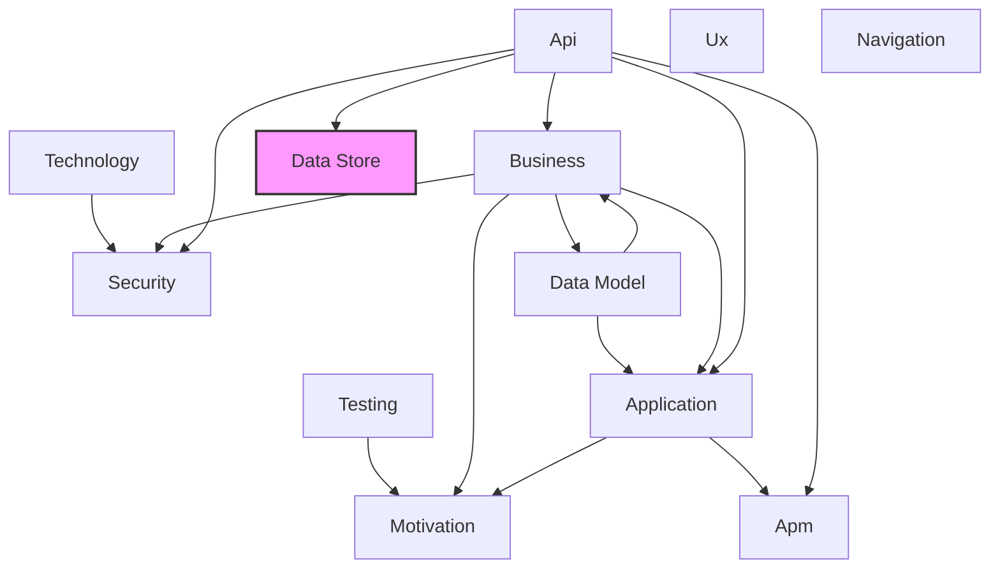

# Data Store Layer

## Report Index

- [Layer Introduction](#layer-introduction)
- [Intra-Layer Relationships](#intra-layer-relationships)
- [Inter-Layer Dependencies](#inter-layer-dependencies)
- [Inter-Layer Relationships Table](#inter-layer-relationships-table)
- [Node Reference](#node-reference)
  - [Column](#column)
  - [Constraint](#constraint)
  - [Constrainttype](#constrainttype)
  - [Database](#database)
  - [Databaseschema](#databaseschema)
  - [Databasetype](#databasetype)
  - [Function](#function)
  - [Functionlanguage](#functionlanguage)
  - [Functionvolatility](#functionvolatility)
  - [Generationtype](#generationtype)
  - [Index](#index)
  - [Indexmethod](#indexmethod)
  - [Parallelsafety](#parallelsafety)
  - [Parametermode](#parametermode)
  - [Referentialaction](#referentialaction)
  - [Refreshmode](#refreshmode)
  - [Securitydefiner](#securitydefiner)
  - [Sequence](#sequence)
  - [Sequencedatatype](#sequencedatatype)
  - [Sqldatatype](#sqldatatype)
  - [Table](#table)
  - [Trigger](#trigger)
  - [Triggerevent](#triggerevent)
  - [Triggerforeach](#triggerforeach)
  - [Triggertiming](#triggertiming)
  - [View](#view)

## Layer Introduction

**Layer 8**: Data Store
**Standard**: [SQL 2016](https://en.wikipedia.org/wiki/SQL:2016)

Layer 8: Data Store Layer

### Statistics

| Metric                    | Count |
| ------------------------- | ----- |
| Node Types                | 26    |
| Intra-Layer Relationships | 18    |
| Inter-Layer Relationships | 3     |
| Inbound Relationships     | 3     |
| Outbound Relationships    | 0     |

### Layer Dependencies

**Depends On**: [Api](./06-api-layer-report.md)

**Depended On By**: None

## Intra-Layer Relationships

## Inter-Layer Dependencies

## Inter-Layer Relationships Table

| Relationship ID                                    | Source Node                                               | Dest Node                                        | Dest Layer                                    | Predicate       | Cardinality | Strength |
| -------------------------------------------------- | --------------------------------------------------------- | ------------------------------------------------ | --------------------------------------------- | --------------- | ----------- | -------- |
| api.schema.database-column.data-store.column       | [schema](./06-api-layer-report.md#schema)                 | [column](./08-data-store-layer-report.md#column) | [Data Store](./08-data-store-layer-report.md) | database-column | many-to-one | medium   |
| api.schema.database-table.data-store.table         | [schema](./06-api-layer-report.md#schema)                 | [table](./08-data-store-layer-report.md#table)   | [Data Store](./08-data-store-layer-report.md) | database-table  | many-to-one | medium   |
| api.securityscheme.database-table.data-store.table | [securityscheme](./06-api-layer-report.md#securityscheme) | [table](./08-data-store-layer-report.md#table)   | [Data Store](./08-data-store-layer-report.md) | database-table  | many-to-one | medium   |

## Node Reference

### Column

**Spec Node ID**: `data-store.column`

Table column definition

#### Intra-Layer Relationships

| Related Node                      | Predicate  | Direction | Cardinality  |
| --------------------------------- | ---------- | --------- | ------------ |
| [constraint](#constraint)         | aggregates | inbound   | many-to-many |
| [database](#database)             | composes   | inbound   | many-to-many |
| [databaseschema](#databaseschema) | composes   | inbound   | many-to-many |
| [index](#index)                   | aggregates | inbound   | many-to-many |
| [table](#table)                   | composes   | inbound   | many-to-many |

#### Inter-Layer Relationships

| Related Node                              | Layer                           | Predicate       | Direction | Cardinality |
| ----------------------------------------- | ------------------------------- | --------------- | --------- | ----------- |
| [schema](./06-api-layer-report.md#schema) | [Api](./06-api-layer-report.md) | database-column | inbound   | many-to-one |

[Back to Index](#report-index)

### Constraint

**Spec Node ID**: `data-store.constraint`

Table constraint

#### Intra-Layer Relationships

| Related Node                      | Predicate  | Direction | Cardinality  |
| --------------------------------- | ---------- | --------- | ------------ |
| [column](#column)                 | aggregates | outbound  | many-to-many |
| [database](#database)             | composes   | inbound   | many-to-many |
| [databaseschema](#databaseschema) | composes   | inbound   | many-to-many |
| [table](#table)                   | composes   | inbound   | many-to-many |

[Back to Index](#report-index)

### Constrainttype

**Spec Node ID**: `data-store.constrainttype`

ConstraintType element in Data Store Layer

[Back to Index](#report-index)

### Database

**Spec Node ID**: `data-store.database`

Database instance containing schemas

#### Intra-Layer Relationships

| Related Node                      | Predicate | Direction | Cardinality  |
| --------------------------------- | --------- | --------- | ------------ |
| [column](#column)                 | composes  | outbound  | many-to-many |
| [constraint](#constraint)         | composes  | outbound  | many-to-many |
| [databaseschema](#databaseschema) | composes  | outbound  | many-to-many |
| [index](#index)                   | composes  | outbound  | many-to-many |
| [table](#table)                   | composes  | outbound  | many-to-many |

[Back to Index](#report-index)

### Databaseschema

**Spec Node ID**: `data-store.databaseschema`

Logical grouping of database objects

#### Intra-Layer Relationships

| Related Node                      | Predicate | Direction | Cardinality  |
| --------------------------------- | --------- | --------- | ------------ |
| [database](#database)             | composes  | inbound   | many-to-many |
| [column](#column)                 | composes  | outbound  | many-to-many |
| [constraint](#constraint)         | composes  | outbound  | many-to-many |
| [databaseschema](#databaseschema) | composes  | outbound  | many-to-many |
| [index](#index)                   | composes  | outbound  | many-to-many |
| [table](#table)                   | composes  | outbound  | many-to-many |
| [table](#table)                   | composes  | inbound   | many-to-many |

[Back to Index](#report-index)

### Databasetype

**Spec Node ID**: `data-store.databasetype`

DatabaseType element in Data Store Layer

[Back to Index](#report-index)

### Function

**Spec Node ID**: `data-store.function`

A stored database function that encapsulates reusable computation logic. Returns a value and can be used in SQL expressions for data transformation or validation.

#### Intra-Layer Relationships

| Related Node        | Predicate | Direction | Cardinality  |
| ------------------- | --------- | --------- | ------------ |
| [trigger](#trigger) | triggers  | inbound   | many-to-many |

[Back to Index](#report-index)

### Functionlanguage

**Spec Node ID**: `data-store.functionlanguage`

FunctionLanguage element in Data Store Layer

[Back to Index](#report-index)

### Functionvolatility

**Spec Node ID**: `data-store.functionvolatility`

FunctionVolatility element in Data Store Layer

[Back to Index](#report-index)

### Generationtype

**Spec Node ID**: `data-store.generationtype`

GenerationType element in Data Store Layer

[Back to Index](#report-index)

### Index

**Spec Node ID**: `data-store.index`

Database index for query optimization

#### Intra-Layer Relationships

| Related Node                      | Predicate  | Direction | Cardinality  |
| --------------------------------- | ---------- | --------- | ------------ |
| [database](#database)             | composes   | inbound   | many-to-many |
| [databaseschema](#databaseschema) | composes   | inbound   | many-to-many |
| [column](#column)                 | aggregates | outbound  | many-to-many |
| [table](#table)                   | composes   | inbound   | many-to-many |

[Back to Index](#report-index)

### Indexmethod

**Spec Node ID**: `data-store.indexmethod`

IndexMethod element in Data Store Layer

[Back to Index](#report-index)

### Parallelsafety

**Spec Node ID**: `data-store.parallelsafety`

ParallelSafety element in Data Store Layer

[Back to Index](#report-index)

### Parametermode

**Spec Node ID**: `data-store.parametermode`

ParameterMode element in Data Store Layer

[Back to Index](#report-index)

### Referentialaction

**Spec Node ID**: `data-store.referentialaction`

ReferentialAction element in Data Store Layer

[Back to Index](#report-index)

### Refreshmode

**Spec Node ID**: `data-store.refreshmode`

RefreshMode element in Data Store Layer

[Back to Index](#report-index)

### Securitydefiner

**Spec Node ID**: `data-store.securitydefiner`

SecurityDefiner element in Data Store Layer

[Back to Index](#report-index)

### Sequence

**Spec Node ID**: `data-store.sequence`

A database sequence generator that produces unique, ordered numeric values. Used for generating primary keys, order numbers, or other sequential identifiers.

[Back to Index](#report-index)

### Sequencedatatype

**Spec Node ID**: `data-store.sequencedatatype`

SequenceDataType element in Data Store Layer

[Back to Index](#report-index)

### Sqldatatype

**Spec Node ID**: `data-store.sqldatatype`

SQLDataType element in Data Store Layer

[Back to Index](#report-index)

### Table

**Spec Node ID**: `data-store.table`

Database table definition

#### Intra-Layer Relationships

| Related Node                      | Predicate | Direction | Cardinality  |
| --------------------------------- | --------- | --------- | ------------ |
| [database](#database)             | composes  | inbound   | many-to-many |
| [databaseschema](#databaseschema) | composes  | inbound   | many-to-many |
| [column](#column)                 | composes  | outbound  | many-to-many |
| [constraint](#constraint)         | composes  | outbound  | many-to-many |
| [databaseschema](#databaseschema) | composes  | outbound  | many-to-many |
| [index](#index)                   | composes  | outbound  | many-to-many |
| [table](#table)                   | composes  | outbound  | many-to-many |

#### Inter-Layer Relationships

| Related Node                                              | Layer                           | Predicate      | Direction | Cardinality |
| --------------------------------------------------------- | ------------------------------- | -------------- | --------- | ----------- |
| [schema](./06-api-layer-report.md#schema)                 | [Api](./06-api-layer-report.md) | database-table | inbound   | many-to-one |
| [securityscheme](./06-api-layer-report.md#securityscheme) | [Api](./06-api-layer-report.md) | database-table | inbound   | many-to-one |

[Back to Index](#report-index)

### Trigger

**Spec Node ID**: `data-store.trigger`

A database trigger that automatically executes in response to data modification events (INSERT, UPDATE, DELETE). Enables reactive database behavior and data integrity enforcement.

#### Intra-Layer Relationships

| Related Node          | Predicate | Direction | Cardinality  |
| --------------------- | --------- | --------- | ------------ |
| [function](#function) | triggers  | outbound  | many-to-many |

[Back to Index](#report-index)

### Triggerevent

**Spec Node ID**: `data-store.triggerevent`

TriggerEvent element in Data Store Layer

[Back to Index](#report-index)

### Triggerforeach

**Spec Node ID**: `data-store.triggerforeach`

TriggerForEach element in Data Store Layer

[Back to Index](#report-index)

### Triggertiming

**Spec Node ID**: `data-store.triggertiming`

TriggerTiming element in Data Store Layer

[Back to Index](#report-index)

### View

**Spec Node ID**: `data-store.view`

Database view

[Back to Index](#report-index)

---

_Generated: 2026-02-11T21:54:18.048Z | Generator: generate-layer-reports.ts_
