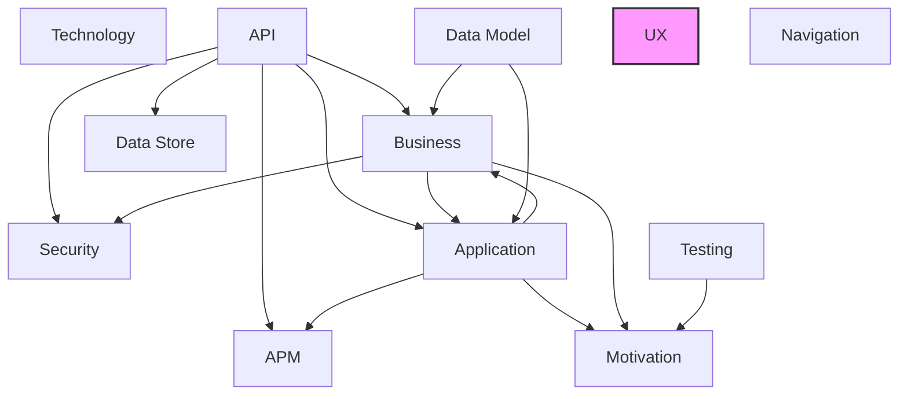

# UX Layer

## Report Index

- [Layer Introduction](#layer-introduction)
- [Intra-Layer Relationships](#intra-layer-relationships)
- [Inter-Layer Dependencies](#inter-layer-dependencies)
- [Inter-Layer Relationships Table](#inter-layer-relationships-table)
- [Node Reference](#node-reference)
  - [Actioncomponent](#actioncomponent)
  - [Actionpattern](#actionpattern)
  - [Chartseries](#chartseries)
  - [Componentinstance](#componentinstance)
  - [Componentreference](#componentreference)
  - [Dataconfig](#dataconfig)
  - [Errorconfig](#errorconfig)
  - [Experiencestate](#experiencestate)
  - [Layoutconfig](#layoutconfig)
  - [Librarycomponent](#librarycomponent)
  - [Librarysubview](#librarysubview)
  - [Stateaction](#stateaction)
  - [Stateactiontemplate](#stateactiontemplate)
  - [Statepattern](#statepattern)
  - [Statetransition](#statetransition)
  - [Subview](#subview)
  - [Tablecolumn](#tablecolumn)
  - [Transitiontemplate](#transitiontemplate)
  - [Uxapplication](#uxapplication)
  - [Uxlibrary](#uxlibrary)
  - [Uxspec](#uxspec)
  - [View](#view)

## Layer Introduction

**Layer 9**: UX
**Standard**: [HTML 5.3](https://html.spec.whatwg.org/)

Layer 9: UX Layer

### Statistics

| Metric                    | Count |
| ------------------------- | ----- |
| Node Types                | 22    |
| Intra-Layer Relationships | 123   |
| Inter-Layer Relationships | 0     |
| Inbound Relationships     | 0     |
| Outbound Relationships    | 0     |

### Layer Dependencies

**Depends On**: None

**Depended On By**: None

## Intra-Layer Relationships

```mermaid
flowchart LR
  subgraph ux
    actioncomponent["actioncomponent"]
    actionpattern["actionpattern"]
    chartseries["chartseries"]
    componentinstance["componentinstance"]
    componentreference["componentreference"]
    dataconfig["dataconfig"]
    errorconfig["errorconfig"]
    experiencestate["experiencestate"]
    layoutconfig["layoutconfig"]
    librarycomponent["librarycomponent"]
    librarysubview["librarysubview"]
    stateaction["stateaction"]
    stateactiontemplate["stateactiontemplate"]
    statepattern["statepattern"]
    statetransition["statetransition"]
    subview["subview"]
    tablecolumn["tablecolumn"]
    transitiontemplate["transitiontemplate"]
    uxapplication["uxapplication"]
    uxlibrary["uxlibrary"]
    uxspec["uxspec"]
    view["view"]
    actioncomponent -->|binds-to| dataconfig
    actioncomponent -->|implements| actionpattern
    actioncomponent -->|navigates-to| view
    actioncomponent -->|renders| actioncomponent
    actioncomponent -->|renders| componentinstance
    actioncomponent -->|renders| componentreference
    actioncomponent -->|renders| librarycomponent
    actioncomponent -->|triggers| statetransition
    actioncomponent -->|uses| errorconfig
    actionpattern -->|associated-with| statepattern
    actionpattern -->|governs| actioncomponent
    actionpattern -->|governs| stateaction
    actionpattern -->|triggers| statetransition
    actionpattern -->|uses| transitiontemplate
    chartseries -->|binds-to| dataconfig
    chartseries -->|references| librarycomponent
    chartseries -->|uses| experiencestate
    componentinstance -->|aggregates| chartseries
    componentinstance -->|aggregates| componentreference
    componentinstance -->|aggregates| tablecolumn
    componentinstance -->|binds-to| dataconfig
    componentinstance -->|implements| librarycomponent
    componentinstance -->|realizes| librarycomponent
    componentinstance -->|renders| actioncomponent
    componentinstance -->|renders| componentinstance
    componentinstance -->|renders| componentreference
    componentinstance -->|renders| layoutconfig
    componentinstance -->|renders| librarycomponent
    componentinstance -->|uses| errorconfig
    componentreference -->|implements| librarycomponent
    componentreference -->|renders| actioncomponent
    componentreference -->|renders| componentinstance
    componentreference -->|renders| componentreference
    componentreference -->|renders| librarycomponent
    componentreference -->|uses| layoutconfig
    dataconfig -->|aggregates| errorconfig
    dataconfig -->|binds-to| componentinstance
    dataconfig -->|binds-to| librarycomponent
    dataconfig -->|binds-to| subview
    dataconfig -->|binds-to| view
    dataconfig -->|composes| chartseries
    dataconfig -->|provides| tablecolumn
    dataconfig -->|realizes| statepattern
    errorconfig -->|associated-with| dataconfig
    errorconfig -->|governs| actioncomponent
    errorconfig -->|governs| componentinstance
    errorconfig -->|governs| experiencestate
    errorconfig -->|governs| view
    experiencestate -->|flows-to| statetransition
    experiencestate -->|governs| view
    experiencestate -->|navigates-to| experiencestate
    experiencestate -->|renders| view
    experiencestate -->|specializes| statepattern
    experiencestate -->|triggers| stateaction
    experiencestate -->|uses| stateactiontemplate
    layoutconfig -->|associated-with| librarycomponent
    layoutconfig -->|composes| layoutconfig
    layoutconfig -->|governs| view
    layoutconfig -->|provides| subview
    layoutconfig -->|provides| view
    librarycomponent -->|composes| actioncomponent
    librarycomponent -->|composes| librarycomponent
    librarycomponent -->|renders| actioncomponent
    librarycomponent -->|renders| componentinstance
    librarycomponent -->|renders| componentreference
    librarycomponent -->|renders| librarycomponent
    librarycomponent -->|specializes| librarycomponent
    librarycomponent -->|uses| actionpattern
    librarycomponent -->|uses| statepattern
    librarysubview -->|composes| componentinstance
    librarysubview -->|uses| actionpattern
    librarysubview -->|uses| dataconfig
    librarysubview -->|uses| layoutconfig
    stateaction -->|flows-to| statetransition
    stateaction -->|specializes| stateactiontemplate
    stateaction -->|uses| actionpattern
    stateactiontemplate -->|associated-with| statepattern
    stateactiontemplate -->|governs| statetransition
    stateactiontemplate -->|implements| stateaction
    stateactiontemplate -->|provides| stateaction
    statepattern -->|aggregates| experiencestate
    statepattern -->|governs| experiencestate
    statepattern -->|specializes| statepattern
    statepattern -->|uses| stateactiontemplate
    statepattern -->|uses| transitiontemplate
    statetransition -->|associated-with| actioncomponent
    statetransition -->|navigates-to| experiencestate
    statetransition -->|triggers| stateaction
    statetransition -->|uses| transitiontemplate
    subview -->|aggregates| componentinstance
    subview -->|binds-to| dataconfig
    subview -->|realizes| librarysubview
    subview -->|renders| componentinstance
    subview -->|uses| errorconfig
    subview -->|uses| layoutconfig
    subview -->|uses| librarysubview
    tablecolumn -->|binds-to| dataconfig
    tablecolumn -->|references| actionpattern
    tablecolumn -->|renders| componentinstance
    tablecolumn -->|uses| layoutconfig
    transitiontemplate -->|flows-to| experiencestate
    transitiontemplate -->|flows-to| subview
    transitiontemplate -->|governs| statetransition
    transitiontemplate -->|navigates-to| view
    transitiontemplate -->|specializes| transitiontemplate
    transitiontemplate -->|triggers| stateaction
    uxapplication -->|aggregates| uxspec
    uxlibrary -->|aggregates| librarycomponent
    uxlibrary -->|aggregates| librarysubview
    uxlibrary -->|provides| librarycomponent
    uxlibrary -->|provides| librarysubview
    uxlibrary -->|uses| uxlibrary
    uxspec -->|aggregates| experiencestate
    uxspec -->|aggregates| view
    uxspec -->|governs| errorconfig
    uxspec -->|uses| uxlibrary
    view -->|aggregates| actioncomponent
    view -->|aggregates| subview
    view -->|binds-to| dataconfig
    view -->|composes| subview
    view -->|renders| componentinstance
    view -->|requires| errorconfig
    view -->|uses| layoutconfig
  end
```

## Inter-Layer Dependencies

## Inter-Layer Relationships Table

No inter-layer relationships defined.

## Node Reference

### Actioncomponent {#actioncomponent}

**Spec Node ID**: `ux.actioncomponent`

Interactive element that triggers actions (button, menu, link, voice command)

#### Relationship Metrics

- **Intra-Layer**: Inbound: 9 | Outbound: 9
- **Inter-Layer**: Inbound: 0 | Outbound: 0

#### Intra-Layer Relationships

| Related Node                              | Predicate       | Direction | Cardinality |
| ----------------------------------------- | --------------- | --------- | ----------- |
| [dataconfig](#dataconfig)                 | binds-to        | outbound  | many-to-one |
| [actionpattern](#actionpattern)           | implements      | outbound  | many-to-one |
| [view](#view)                             | navigates-to    | outbound  | many-to-one |
| [actioncomponent](#actioncomponent)       | renders         | outbound  | many-to-one |
| [componentinstance](#componentinstance)   | renders         | outbound  | many-to-one |
| [componentreference](#componentreference) | renders         | outbound  | many-to-one |
| [librarycomponent](#librarycomponent)     | renders         | outbound  | many-to-one |
| [statetransition](#statetransition)       | triggers        | outbound  | many-to-one |
| [errorconfig](#errorconfig)               | uses            | outbound  | many-to-one |
| [actionpattern](#actionpattern)           | governs         | inbound   | many-to-one |
| [componentinstance](#componentinstance)   | renders         | inbound   | many-to-one |
| [componentreference](#componentreference) | renders         | inbound   | many-to-one |
| [errorconfig](#errorconfig)               | governs         | inbound   | many-to-one |
| [librarycomponent](#librarycomponent)     | composes        | inbound   | many-to-one |
| [librarycomponent](#librarycomponent)     | renders         | inbound   | many-to-one |
| [statetransition](#statetransition)       | associated-with | inbound   | many-to-one |
| [view](#view)                             | aggregates      | inbound   | one-to-many |

[Back to Index](#report-index)

### Actionpattern {#actionpattern}

**Spec Node ID**: `ux.actionpattern`

Reusable action configuration for common user interactions. Defines the trigger, feedback mechanism, and optional target for recurring UX patterns. Example: 'confirm-and-delete' pattern — trigger: click on delete button, feedback: confirmation modal then success toast, targetRef: the item being deleted.

#### Relationship Metrics

- **Intra-Layer**: Inbound: 5 | Outbound: 5
- **Inter-Layer**: Inbound: 0 | Outbound: 0

#### Intra-Layer Relationships

| Related Node                              | Predicate       | Direction | Cardinality |
| ----------------------------------------- | --------------- | --------- | ----------- |
| [actioncomponent](#actioncomponent)       | implements      | inbound   | many-to-one |
| [statepattern](#statepattern)             | associated-with | outbound  | many-to-one |
| [actioncomponent](#actioncomponent)       | governs         | outbound  | many-to-one |
| [stateaction](#stateaction)               | governs         | outbound  | many-to-one |
| [statetransition](#statetransition)       | triggers        | outbound  | many-to-one |
| [transitiontemplate](#transitiontemplate) | uses            | outbound  | many-to-one |
| [librarycomponent](#librarycomponent)     | uses            | inbound   | many-to-one |
| [librarysubview](#librarysubview)         | uses            | inbound   | many-to-one |
| [stateaction](#stateaction)               | uses            | inbound   | many-to-one |
| [tablecolumn](#tablecolumn)               | references      | inbound   | many-to-one |

[Back to Index](#report-index)

### Chartseries {#chartseries}

**Spec Node ID**: `ux.chartseries`

Configuration for a data series within a chart component, specifying data source, visualization type, colors, and legend properties. Defines how data is visualized in charts.

#### Relationship Metrics

- **Intra-Layer**: Inbound: 2 | Outbound: 3
- **Inter-Layer**: Inbound: 0 | Outbound: 0

#### Intra-Layer Relationships

| Related Node                            | Predicate  | Direction | Cardinality |
| --------------------------------------- | ---------- | --------- | ----------- |
| [dataconfig](#dataconfig)               | binds-to   | outbound  | many-to-one |
| [librarycomponent](#librarycomponent)   | references | outbound  | many-to-one |
| [experiencestate](#experiencestate)     | uses       | outbound  | many-to-one |
| [componentinstance](#componentinstance) | aggregates | inbound   | many-to-one |
| [dataconfig](#dataconfig)               | composes   | inbound   | many-to-one |

[Back to Index](#report-index)

### Componentinstance {#componentinstance}

**Spec Node ID**: `ux.componentinstance`

Instance of a LibraryComponent with application-specific configuration

#### Relationship Metrics

- **Intra-Layer**: Inbound: 11 | Outbound: 12
- **Inter-Layer**: Inbound: 0 | Outbound: 0

#### Intra-Layer Relationships

| Related Node                              | Predicate  | Direction | Cardinality |
| ----------------------------------------- | ---------- | --------- | ----------- |
| [actioncomponent](#actioncomponent)       | renders    | inbound   | many-to-one |
| [chartseries](#chartseries)               | aggregates | outbound  | many-to-one |
| [componentreference](#componentreference) | aggregates | outbound  | many-to-one |
| [tablecolumn](#tablecolumn)               | aggregates | outbound  | many-to-one |
| [dataconfig](#dataconfig)                 | binds-to   | outbound  | many-to-one |
| [librarycomponent](#librarycomponent)     | implements | outbound  | many-to-one |
| [librarycomponent](#librarycomponent)     | realizes   | outbound  | many-to-one |
| [actioncomponent](#actioncomponent)       | renders    | outbound  | many-to-one |
| [componentinstance](#componentinstance)   | renders    | outbound  | many-to-one |
| [componentreference](#componentreference) | renders    | outbound  | many-to-one |
| [layoutconfig](#layoutconfig)             | renders    | outbound  | many-to-one |
| [librarycomponent](#librarycomponent)     | renders    | outbound  | many-to-one |
| [errorconfig](#errorconfig)               | uses       | outbound  | many-to-one |
| [componentreference](#componentreference) | renders    | inbound   | many-to-one |
| [dataconfig](#dataconfig)                 | binds-to   | inbound   | many-to-one |
| [errorconfig](#errorconfig)               | governs    | inbound   | many-to-one |
| [librarycomponent](#librarycomponent)     | renders    | inbound   | many-to-one |
| [librarysubview](#librarysubview)         | composes   | inbound   | many-to-one |
| [subview](#subview)                       | aggregates | inbound   | many-to-one |
| [subview](#subview)                       | renders    | inbound   | many-to-one |
| [tablecolumn](#tablecolumn)               | renders    | inbound   | many-to-one |
| [view](#view)                             | renders    | inbound   | many-to-one |

[Back to Index](#report-index)

### Componentreference {#componentreference}

**Spec Node ID**: `ux.componentreference`

A declarative placeholder in a parent component's named slot, pointing to another component to be rendered there. Unlike ComponentInstance (a concrete rendered occurrence), ComponentReference is a composition declaration that says 'render this component in this slot of the parent', analogous to the HTML slot element.

#### Relationship Metrics

- **Intra-Layer**: Inbound: 5 | Outbound: 6
- **Inter-Layer**: Inbound: 0 | Outbound: 0

#### Intra-Layer Relationships

| Related Node                              | Predicate  | Direction | Cardinality |
| ----------------------------------------- | ---------- | --------- | ----------- |
| [actioncomponent](#actioncomponent)       | renders    | inbound   | many-to-one |
| [componentinstance](#componentinstance)   | aggregates | inbound   | many-to-one |
| [componentinstance](#componentinstance)   | renders    | inbound   | many-to-one |
| [librarycomponent](#librarycomponent)     | implements | outbound  | many-to-one |
| [actioncomponent](#actioncomponent)       | renders    | outbound  | many-to-one |
| [componentinstance](#componentinstance)   | renders    | outbound  | many-to-one |
| [componentreference](#componentreference) | renders    | outbound  | many-to-one |
| [librarycomponent](#librarycomponent)     | renders    | outbound  | many-to-one |
| [layoutconfig](#layoutconfig)             | uses       | outbound  | many-to-one |
| [librarycomponent](#librarycomponent)     | renders    | inbound   | many-to-one |

[Back to Index](#report-index)

### Dataconfig {#dataconfig}

**Spec Node ID**: `ux.dataconfig`

Configuration for data binding and state management within UI components, defining data sources, transformation pipelines, and update triggers. Manages component data flow.

#### Relationship Metrics

- **Intra-Layer**: Inbound: 8 | Outbound: 8
- **Inter-Layer**: Inbound: 0 | Outbound: 0

#### Intra-Layer Relationships

| Related Node                            | Predicate       | Direction | Cardinality |
| --------------------------------------- | --------------- | --------- | ----------- |
| [actioncomponent](#actioncomponent)     | binds-to        | inbound   | many-to-one |
| [chartseries](#chartseries)             | binds-to        | inbound   | many-to-one |
| [componentinstance](#componentinstance) | binds-to        | inbound   | many-to-one |
| [errorconfig](#errorconfig)             | aggregates      | outbound  | many-to-one |
| [componentinstance](#componentinstance) | binds-to        | outbound  | many-to-one |
| [librarycomponent](#librarycomponent)   | binds-to        | outbound  | many-to-one |
| [subview](#subview)                     | binds-to        | outbound  | many-to-one |
| [view](#view)                           | binds-to        | outbound  | many-to-one |
| [chartseries](#chartseries)             | composes        | outbound  | many-to-one |
| [tablecolumn](#tablecolumn)             | provides        | outbound  | many-to-one |
| [statepattern](#statepattern)           | realizes        | outbound  | many-to-one |
| [errorconfig](#errorconfig)             | associated-with | inbound   | many-to-one |
| [librarysubview](#librarysubview)       | uses            | inbound   | many-to-one |
| [subview](#subview)                     | binds-to        | inbound   | many-to-one |
| [tablecolumn](#tablecolumn)             | binds-to        | inbound   | many-to-one |
| [view](#view)                           | binds-to        | inbound   | many-to-one |

[Back to Index](#report-index)

### Errorconfig {#errorconfig}

**Spec Node ID**: `ux.errorconfig`

Configuration for error handling and display within UI components, specifying error message formats, retry behavior, fallback content, and user guidance. Ensures consistent error UX.

#### Relationship Metrics

- **Intra-Layer**: Inbound: 6 | Outbound: 5
- **Inter-Layer**: Inbound: 0 | Outbound: 0

#### Intra-Layer Relationships

| Related Node                            | Predicate       | Direction | Cardinality |
| --------------------------------------- | --------------- | --------- | ----------- |
| [actioncomponent](#actioncomponent)     | uses            | inbound   | many-to-one |
| [componentinstance](#componentinstance) | uses            | inbound   | many-to-one |
| [dataconfig](#dataconfig)               | aggregates      | inbound   | many-to-one |
| [dataconfig](#dataconfig)               | associated-with | outbound  | many-to-one |
| [actioncomponent](#actioncomponent)     | governs         | outbound  | many-to-one |
| [componentinstance](#componentinstance) | governs         | outbound  | many-to-one |
| [experiencestate](#experiencestate)     | governs         | outbound  | many-to-one |
| [view](#view)                           | governs         | outbound  | many-to-one |
| [subview](#subview)                     | uses            | inbound   | many-to-one |
| [uxspec](#uxspec)                       | governs         | inbound   | many-to-one |
| [view](#view)                           | requires        | inbound   | many-to-one |

[Back to Index](#report-index)

### Experiencestate {#experiencestate}

**Spec Node ID**: `ux.experiencestate`

Distinct state that the experience can be in (works across all channels)

#### Relationship Metrics

- **Intra-Layer**: Inbound: 8 | Outbound: 7
- **Inter-Layer**: Inbound: 0 | Outbound: 0

#### Intra-Layer Relationships

| Related Node                                | Predicate    | Direction | Cardinality |
| ------------------------------------------- | ------------ | --------- | ----------- |
| [chartseries](#chartseries)                 | uses         | inbound   | many-to-one |
| [errorconfig](#errorconfig)                 | governs      | inbound   | many-to-one |
| [statetransition](#statetransition)         | flows-to     | outbound  | many-to-one |
| [view](#view)                               | governs      | outbound  | many-to-one |
| [experiencestate](#experiencestate)         | navigates-to | outbound  | many-to-one |
| [view](#view)                               | renders      | outbound  | many-to-one |
| [statepattern](#statepattern)               | specializes  | outbound  | many-to-one |
| [stateaction](#stateaction)                 | triggers     | outbound  | many-to-one |
| [stateactiontemplate](#stateactiontemplate) | uses         | outbound  | many-to-one |
| [statepattern](#statepattern)               | aggregates   | inbound   | many-to-one |
| [statepattern](#statepattern)               | governs      | inbound   | many-to-one |
| [statetransition](#statetransition)         | navigates-to | inbound   | many-to-one |
| [transitiontemplate](#transitiontemplate)   | flows-to     | inbound   | many-to-one |
| [uxspec](#uxspec)                           | aggregates   | inbound   | many-to-one |

[Back to Index](#report-index)

### Layoutconfig {#layoutconfig}

**Spec Node ID**: `ux.layoutconfig`

Configuration for UI layout structure, defining grid systems, responsive breakpoints, spacing rules, and component arrangement patterns. Controls visual organization of the interface.

#### Relationship Metrics

- **Intra-Layer**: Inbound: 7 | Outbound: 5
- **Inter-Layer**: Inbound: 0 | Outbound: 0

#### Intra-Layer Relationships

| Related Node                              | Predicate       | Direction | Cardinality |
| ----------------------------------------- | --------------- | --------- | ----------- |
| [componentinstance](#componentinstance)   | renders         | inbound   | many-to-one |
| [componentreference](#componentreference) | uses            | inbound   | many-to-one |
| [librarycomponent](#librarycomponent)     | associated-with | outbound  | many-to-one |
| [layoutconfig](#layoutconfig)             | composes        | outbound  | many-to-one |
| [view](#view)                             | governs         | outbound  | many-to-one |
| [subview](#subview)                       | provides        | outbound  | many-to-one |
| [view](#view)                             | provides        | outbound  | many-to-one |
| [librarysubview](#librarysubview)         | uses            | inbound   | many-to-one |
| [subview](#subview)                       | uses            | inbound   | many-to-one |
| [tablecolumn](#tablecolumn)               | uses            | inbound   | many-to-one |
| [view](#view)                             | uses            | inbound   | many-to-one |

[Back to Index](#report-index)

### Librarycomponent {#librarycomponent}

**Spec Node ID**: `ux.librarycomponent`

Reusable UI component definition that can be instantiated in multiple UXSpecs

#### Relationship Metrics

- **Intra-Layer**: Inbound: 14 | Outbound: 9
- **Inter-Layer**: Inbound: 0 | Outbound: 0

#### Intra-Layer Relationships

| Related Node                              | Predicate       | Direction | Cardinality |
| ----------------------------------------- | --------------- | --------- | ----------- |
| [actioncomponent](#actioncomponent)       | renders         | inbound   | many-to-one |
| [chartseries](#chartseries)               | references      | inbound   | many-to-one |
| [componentinstance](#componentinstance)   | implements      | inbound   | many-to-one |
| [componentinstance](#componentinstance)   | realizes        | inbound   | many-to-one |
| [componentinstance](#componentinstance)   | renders         | inbound   | many-to-one |
| [componentreference](#componentreference) | implements      | inbound   | many-to-one |
| [componentreference](#componentreference) | renders         | inbound   | many-to-one |
| [dataconfig](#dataconfig)                 | binds-to        | inbound   | many-to-one |
| [layoutconfig](#layoutconfig)             | associated-with | inbound   | many-to-one |
| [actioncomponent](#actioncomponent)       | composes        | outbound  | many-to-one |
| [librarycomponent](#librarycomponent)     | composes        | outbound  | many-to-one |
| [actioncomponent](#actioncomponent)       | renders         | outbound  | many-to-one |
| [componentinstance](#componentinstance)   | renders         | outbound  | many-to-one |
| [componentreference](#componentreference) | renders         | outbound  | many-to-one |
| [librarycomponent](#librarycomponent)     | renders         | outbound  | many-to-one |
| [librarycomponent](#librarycomponent)     | specializes     | outbound  | many-to-one |
| [actionpattern](#actionpattern)           | uses            | outbound  | many-to-one |
| [statepattern](#statepattern)             | uses            | outbound  | many-to-one |
| [uxlibrary](#uxlibrary)                   | aggregates      | inbound   | many-to-one |
| [uxlibrary](#uxlibrary)                   | provides        | inbound   | many-to-one |

[Back to Index](#report-index)

### Librarysubview {#librarysubview}

**Spec Node ID**: `ux.librarysubview`

Reusable, non-routable grouping of components intended to be composed into Views or other SubViews. Unlike View, LibrarySubView has no route and cannot be navigated to directly. It exists purely as a reusable composition unit, analogous to an HTML template element.

#### Relationship Metrics

- **Intra-Layer**: Inbound: 4 | Outbound: 4
- **Inter-Layer**: Inbound: 0 | Outbound: 0

#### Intra-Layer Relationships

| Related Node                            | Predicate  | Direction | Cardinality |
| --------------------------------------- | ---------- | --------- | ----------- |
| [componentinstance](#componentinstance) | composes   | outbound  | many-to-one |
| [actionpattern](#actionpattern)         | uses       | outbound  | many-to-one |
| [dataconfig](#dataconfig)               | uses       | outbound  | many-to-one |
| [layoutconfig](#layoutconfig)           | uses       | outbound  | many-to-one |
| [subview](#subview)                     | realizes   | inbound   | many-to-one |
| [subview](#subview)                     | uses       | inbound   | many-to-one |
| [uxlibrary](#uxlibrary)                 | aggregates | inbound   | many-to-one |
| [uxlibrary](#uxlibrary)                 | provides   | inbound   | many-to-one |

[Back to Index](#report-index)

### Stateaction {#stateaction}

**Spec Node ID**: `ux.stateaction`

A concrete action bound to a specific ExperienceState lifecycle event. Instances are bound to a state and lifecycle hook; for reusable parameterizable definitions use StateActionTemplate. Examples: scroll-to-top (lifecycle: on-enter), focus-first-field (lifecycle: on-enter), dispatch-analytics-event (lifecycle: on-exit).

#### Relationship Metrics

- **Intra-Layer**: Inbound: 6 | Outbound: 3
- **Inter-Layer**: Inbound: 0 | Outbound: 0

#### Intra-Layer Relationships

| Related Node                                | Predicate   | Direction | Cardinality |
| ------------------------------------------- | ----------- | --------- | ----------- |
| [actionpattern](#actionpattern)             | governs     | inbound   | many-to-one |
| [experiencestate](#experiencestate)         | triggers    | inbound   | many-to-one |
| [statetransition](#statetransition)         | flows-to    | outbound  | many-to-one |
| [stateactiontemplate](#stateactiontemplate) | specializes | outbound  | many-to-one |
| [actionpattern](#actionpattern)             | uses        | outbound  | many-to-one |
| [stateactiontemplate](#stateactiontemplate) | implements  | inbound   | many-to-one |
| [stateactiontemplate](#stateactiontemplate) | provides    | inbound   | many-to-one |
| [statetransition](#statetransition)         | triggers    | inbound   | many-to-one |
| [transitiontemplate](#transitiontemplate)   | triggers    | inbound   | many-to-one |

[Back to Index](#report-index)

### Stateactiontemplate {#stateactiontemplate}

**Spec Node ID**: `ux.stateactiontemplate`

A parameterizable, reusable definition of an action to execute during state transitions. StateActionTemplate is the definition; StateAction is the concrete usage bound to a specific ExperienceState and lifecycle hook. Example: a 'scroll-to-top' template with a 'targetId' parameter, instantiated as a StateAction on multiple states.

#### Relationship Metrics

- **Intra-Layer**: Inbound: 3 | Outbound: 4
- **Inter-Layer**: Inbound: 0 | Outbound: 0

#### Intra-Layer Relationships

| Related Node                        | Predicate       | Direction | Cardinality |
| ----------------------------------- | --------------- | --------- | ----------- |
| [experiencestate](#experiencestate) | uses            | inbound   | many-to-one |
| [stateaction](#stateaction)         | specializes     | inbound   | many-to-one |
| [statepattern](#statepattern)       | associated-with | outbound  | many-to-one |
| [statetransition](#statetransition) | governs         | outbound  | many-to-one |
| [stateaction](#stateaction)         | implements      | outbound  | many-to-one |
| [stateaction](#stateaction)         | provides        | outbound  | many-to-one |
| [statepattern](#statepattern)       | uses            | inbound   | many-to-one |

[Back to Index](#report-index)

### Statepattern {#statepattern}

**Spec Node ID**: `ux.statepattern`

Reusable state machine template for common UX interaction flows, composed of named ExperienceStates and transitions. Canonical examples: 'wizard' — multi-step form with back/next/submit transitions; 'optimistic-update' — loading → success/error with retry; 'tab-panel' — N peer states with tab-driven transitions; 'authenticated-route' — unauthenticated → redirect/login → authenticated.

#### Relationship Metrics

- **Intra-Layer**: Inbound: 6 | Outbound: 5
- **Inter-Layer**: Inbound: 0 | Outbound: 0

#### Intra-Layer Relationships

| Related Node                                | Predicate       | Direction | Cardinality |
| ------------------------------------------- | --------------- | --------- | ----------- |
| [actionpattern](#actionpattern)             | associated-with | inbound   | many-to-one |
| [dataconfig](#dataconfig)                   | realizes        | inbound   | many-to-one |
| [experiencestate](#experiencestate)         | specializes     | inbound   | many-to-one |
| [librarycomponent](#librarycomponent)       | uses            | inbound   | many-to-one |
| [stateactiontemplate](#stateactiontemplate) | associated-with | inbound   | many-to-one |
| [experiencestate](#experiencestate)         | aggregates      | outbound  | many-to-one |
| [experiencestate](#experiencestate)         | governs         | outbound  | many-to-one |
| [statepattern](#statepattern)               | specializes     | outbound  | many-to-one |
| [stateactiontemplate](#stateactiontemplate) | uses            | outbound  | many-to-one |
| [transitiontemplate](#transitiontemplate)   | uses            | outbound  | many-to-one |

[Back to Index](#report-index)

### Statetransition {#statetransition}

**Spec Node ID**: `ux.statetransition`

A directed edge in the ExperienceState machine, owned by its source ExperienceState. Specifies the trigger event, destination state, optional guard condition, and side-effect actions. The 'from' state is implicitly the ExperienceState that contains this transition via relationship.

#### Relationship Metrics

- **Intra-Layer**: Inbound: 6 | Outbound: 4
- **Inter-Layer**: Inbound: 0 | Outbound: 0

#### Intra-Layer Relationships

| Related Node                                | Predicate       | Direction | Cardinality |
| ------------------------------------------- | --------------- | --------- | ----------- |
| [actioncomponent](#actioncomponent)         | triggers        | inbound   | many-to-one |
| [actionpattern](#actionpattern)             | triggers        | inbound   | many-to-one |
| [experiencestate](#experiencestate)         | flows-to        | inbound   | many-to-one |
| [stateaction](#stateaction)                 | flows-to        | inbound   | many-to-one |
| [stateactiontemplate](#stateactiontemplate) | governs         | inbound   | many-to-one |
| [actioncomponent](#actioncomponent)         | associated-with | outbound  | many-to-one |
| [experiencestate](#experiencestate)         | navigates-to    | outbound  | many-to-one |
| [stateaction](#stateaction)                 | triggers        | outbound  | many-to-one |
| [transitiontemplate](#transitiontemplate)   | uses            | outbound  | many-to-one |
| [transitiontemplate](#transitiontemplate)   | governs         | inbound   | many-to-one |

[Back to Index](#report-index)

### Subview {#subview}

**Spec Node ID**: `ux.subview`

A non-routable UI fragment embedded within a parent View. Two usage modes: (1) Library instance — 'ref' is populated with a ux.librarysubview specNodeId, rendering that reusable fragment; (2) Inline definition — 'ref' is absent and the SubView defines its own composition inline. SubViews are not independently routable; use View for routable pages.

#### Relationship Metrics

- **Intra-Layer**: Inbound: 5 | Outbound: 7
- **Inter-Layer**: Inbound: 0 | Outbound: 0

#### Intra-Layer Relationships

| Related Node                              | Predicate  | Direction | Cardinality |
| ----------------------------------------- | ---------- | --------- | ----------- |
| [dataconfig](#dataconfig)                 | binds-to   | inbound   | many-to-one |
| [layoutconfig](#layoutconfig)             | provides   | inbound   | many-to-one |
| [componentinstance](#componentinstance)   | aggregates | outbound  | many-to-one |
| [dataconfig](#dataconfig)                 | binds-to   | outbound  | many-to-one |
| [librarysubview](#librarysubview)         | realizes   | outbound  | many-to-one |
| [componentinstance](#componentinstance)   | renders    | outbound  | many-to-one |
| [errorconfig](#errorconfig)               | uses       | outbound  | many-to-one |
| [layoutconfig](#layoutconfig)             | uses       | outbound  | many-to-one |
| [librarysubview](#librarysubview)         | uses       | outbound  | many-to-one |
| [transitiontemplate](#transitiontemplate) | flows-to   | inbound   | many-to-one |
| [view](#view)                             | aggregates | inbound   | many-to-one |
| [view](#view)                             | composes   | inbound   | many-to-one |

[Back to Index](#report-index)

### Tablecolumn {#tablecolumn}

**Spec Node ID**: `ux.tablecolumn`

Configuration for a single column within a data table component, specifying header, data binding, sorting, filtering, and rendering options. Defines table structure and behavior.

#### Relationship Metrics

- **Intra-Layer**: Inbound: 2 | Outbound: 4
- **Inter-Layer**: Inbound: 0 | Outbound: 0

#### Intra-Layer Relationships

| Related Node                            | Predicate  | Direction | Cardinality |
| --------------------------------------- | ---------- | --------- | ----------- |
| [componentinstance](#componentinstance) | aggregates | inbound   | many-to-one |
| [dataconfig](#dataconfig)               | provides   | inbound   | many-to-one |
| [dataconfig](#dataconfig)               | binds-to   | outbound  | many-to-one |
| [actionpattern](#actionpattern)         | references | outbound  | many-to-one |
| [componentinstance](#componentinstance) | renders    | outbound  | many-to-one |
| [layoutconfig](#layoutconfig)           | uses       | outbound  | many-to-one |

[Back to Index](#report-index)

### Transitiontemplate {#transitiontemplate}

**Spec Node ID**: `ux.transitiontemplate`

Defines reusable animation and transition patterns for state changes, page navigation, or component lifecycle events. Ensures consistent motion design across the application.

#### Relationship Metrics

- **Intra-Layer**: Inbound: 4 | Outbound: 6
- **Inter-Layer**: Inbound: 0 | Outbound: 0

#### Intra-Layer Relationships

| Related Node                              | Predicate    | Direction | Cardinality |
| ----------------------------------------- | ------------ | --------- | ----------- |
| [actionpattern](#actionpattern)           | uses         | inbound   | many-to-one |
| [statepattern](#statepattern)             | uses         | inbound   | many-to-one |
| [statetransition](#statetransition)       | uses         | inbound   | many-to-one |
| [experiencestate](#experiencestate)       | flows-to     | outbound  | many-to-one |
| [subview](#subview)                       | flows-to     | outbound  | many-to-one |
| [statetransition](#statetransition)       | governs      | outbound  | many-to-one |
| [view](#view)                             | navigates-to | outbound  | many-to-one |
| [transitiontemplate](#transitiontemplate) | specializes  | outbound  | many-to-one |
| [stateaction](#stateaction)               | triggers     | outbound  | many-to-one |

[Back to Index](#report-index)

### Uxapplication {#uxapplication}

**Spec Node ID**: `ux.uxapplication`

Application-level UX configuration that groups UXSpecs and defines shared settings

#### Relationship Metrics

- **Intra-Layer**: Inbound: 0 | Outbound: 1
- **Inter-Layer**: Inbound: 0 | Outbound: 0

#### Intra-Layer Relationships

| Related Node      | Predicate  | Direction | Cardinality |
| ----------------- | ---------- | --------- | ----------- |
| [uxspec](#uxspec) | aggregates | outbound  | many-to-one |

[Back to Index](#report-index)

### Uxlibrary {#uxlibrary}

**Spec Node ID**: `ux.uxlibrary`

Collection of reusable UI components and sub-views that can be shared across applications

#### Relationship Metrics

- **Intra-Layer**: Inbound: 2 | Outbound: 5
- **Inter-Layer**: Inbound: 0 | Outbound: 0

#### Intra-Layer Relationships

| Related Node                          | Predicate  | Direction | Cardinality |
| ------------------------------------- | ---------- | --------- | ----------- |
| [librarycomponent](#librarycomponent) | aggregates | outbound  | many-to-one |
| [librarysubview](#librarysubview)     | aggregates | outbound  | many-to-one |
| [librarycomponent](#librarycomponent) | provides   | outbound  | many-to-one |
| [librarysubview](#librarysubview)     | provides   | outbound  | many-to-one |
| [uxlibrary](#uxlibrary)               | uses       | outbound  | many-to-one |
| [uxspec](#uxspec)                     | uses       | inbound   | many-to-one |

[Back to Index](#report-index)

### Uxspec {#uxspec}

**Spec Node ID**: `ux.uxspec`

Complete UX specification for a single experience (visual, voice, chat, SMS)

#### Relationship Metrics

- **Intra-Layer**: Inbound: 1 | Outbound: 4
- **Inter-Layer**: Inbound: 0 | Outbound: 0

#### Intra-Layer Relationships

| Related Node                        | Predicate  | Direction | Cardinality |
| ----------------------------------- | ---------- | --------- | ----------- |
| [uxapplication](#uxapplication)     | aggregates | inbound   | many-to-one |
| [experiencestate](#experiencestate) | aggregates | outbound  | many-to-one |
| [view](#view)                       | aggregates | outbound  | many-to-one |
| [errorconfig](#errorconfig)         | governs    | outbound  | many-to-one |
| [uxlibrary](#uxlibrary)             | uses       | outbound  | many-to-one |

[Back to Index](#report-index)

### View {#view}

**Spec Node ID**: `ux.view`

Routable grouping of components (a complete user experience)

#### Relationship Metrics

- **Intra-Layer**: Inbound: 9 | Outbound: 7
- **Inter-Layer**: Inbound: 0 | Outbound: 0

#### Intra-Layer Relationships

| Related Node                              | Predicate    | Direction | Cardinality |
| ----------------------------------------- | ------------ | --------- | ----------- |
| [actioncomponent](#actioncomponent)       | navigates-to | inbound   | many-to-one |
| [dataconfig](#dataconfig)                 | binds-to     | inbound   | many-to-one |
| [errorconfig](#errorconfig)               | governs      | inbound   | many-to-one |
| [experiencestate](#experiencestate)       | governs      | inbound   | many-to-one |
| [experiencestate](#experiencestate)       | renders      | inbound   | many-to-one |
| [layoutconfig](#layoutconfig)             | governs      | inbound   | many-to-one |
| [layoutconfig](#layoutconfig)             | provides     | inbound   | many-to-one |
| [transitiontemplate](#transitiontemplate) | navigates-to | inbound   | many-to-one |
| [uxspec](#uxspec)                         | aggregates   | inbound   | many-to-one |
| [actioncomponent](#actioncomponent)       | aggregates   | outbound  | one-to-many |
| [subview](#subview)                       | aggregates   | outbound  | many-to-one |
| [dataconfig](#dataconfig)                 | binds-to     | outbound  | many-to-one |
| [subview](#subview)                       | composes     | outbound  | many-to-one |
| [componentinstance](#componentinstance)   | renders      | outbound  | many-to-one |
| [errorconfig](#errorconfig)               | requires     | outbound  | many-to-one |
| [layoutconfig](#layoutconfig)             | uses         | outbound  | many-to-one |

[Back to Index](#report-index)

---

_Generated: 2026-02-28T12:48:58.613Z | Spec Version: 0.8.0 | Generator: generate-layer-reports.ts_
