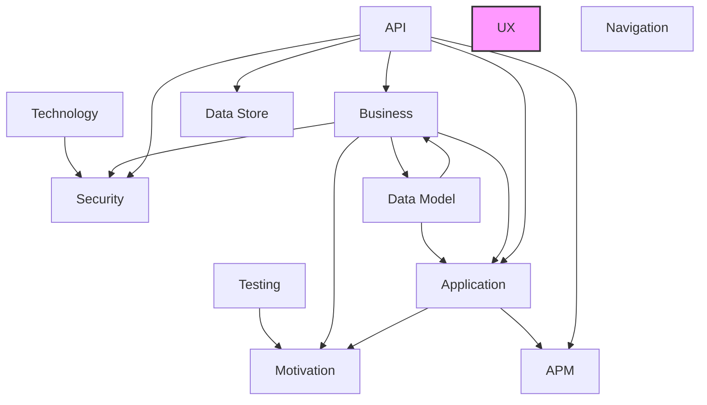

# UX Layer

## Report Index

- [Layer Introduction](#layer-introduction)
- [Intra-Layer Relationships](#intra-layer-relationships)
- [Inter-Layer Dependencies](#inter-layer-dependencies)
- [Inter-Layer Relationships Table](#inter-layer-relationships-table)
- [Node Reference](#node-reference)
  - [Actioncomponent](#actioncomponent)
  - [Actioncomponenttype](#actioncomponenttype)
  - [Actionpattern](#actionpattern)
  - [Actiontype](#actiontype)
  - [Aligncontent](#aligncontent)
  - [Alignitems](#alignitems)
  - [Animationtype](#animationtype)
  - [Apiconfig](#apiconfig)
  - [Buttonstyle](#buttonstyle)
  - [Cachestrategy](#cachestrategy)
  - [Channeltype](#channeltype)
  - [Chartseries](#chartseries)
  - [Columndisplaytype](#columndisplaytype)
  - [Componentinstance](#componentinstance)
  - [Componentreference](#componentreference)
  - [Componenttype](#componenttype)
  - [Condition](#condition)
  - [Dataconfig](#dataconfig)
  - [Datasource](#datasource)
  - [Errorconfig](#errorconfig)
  - [Experiencestate](#experiencestate)
  - [Filtertype](#filtertype)
  - [Httpmethod](#httpmethod)
  - [Justifycontent](#justifycontent)
  - [Justifyitems](#justifyitems)
  - [Labelposition](#labelposition)
  - [Layoutconfig](#layoutconfig)
  - [Layoutstyle](#layoutstyle)
  - [Layouttype](#layouttype)
  - [Librarycomponent](#librarycomponent)
  - [Librarysubview](#librarysubview)
  - [Linestyle](#linestyle)
  - [Notificationtype](#notificationtype)
  - [Performancetargets](#performancetargets)
  - [Seriestype](#seriestype)
  - [Sortdirection](#sortdirection)
  - [Stateaction](#stateaction)
  - [Stateactiontemplate](#stateactiontemplate)
  - [Statepattern](#statepattern)
  - [Statetransition](#statetransition)
  - [Stickyposition](#stickyposition)
  - [Subview](#subview)
  - [Tablecolumn](#tablecolumn)
  - [Textalign](#textalign)
  - [Transitiontemplate](#transitiontemplate)
  - [Triggertype](#triggertype)
  - [Uxapplication](#uxapplication)
  - [Uxlibrary](#uxlibrary)
  - [Uxspec](#uxspec)
  - [Validationrule](#validationrule)
  - [Validationtype](#validationtype)
  - [View](#view)
  - [Viewtype](#viewtype)

## Layer Introduction

**Layer 9**: UX
**Standard**: [HTML 5.3](https://html.spec.whatwg.org/)

Layer 9: UX Layer

### Statistics

| Metric                    | Count |
| ------------------------- | ----- |
| Node Types                | 53    |
| Intra-Layer Relationships | 0     |
| Inter-Layer Relationships | 0     |
| Inbound Relationships     | 0     |
| Outbound Relationships    | 0     |

### Layer Dependencies

**Depends On**: None

**Depended On By**: None

## Intra-Layer Relationships

### Hierarchical Organization

This layer contains 53 node types. To improve readability, they are organized hierarchically:

| Group | Count | Types |
|-------|-------|-------|
| **A** | 8 | `actioncomponent`, `actioncomponenttype`, `actionpattern`, `actiontype`, `aligncontent`, `alignitems`, `animationtype`, `apiconfig` |
| **B** | 1 | `buttonstyle` |
| **C** | 8 | `cachestrategy`, `channeltype`, `chartseries`, `columndisplaytype`, `componentinstance`, `componentreference`, `componenttype`, `condition` |
| **D** | 2 | `dataconfig`, `datasource` |
| **E** | 2 | `errorconfig`, `experiencestate` |
| **F** | 1 | `filtertype` |
| **H** | 1 | `httpmethod` |
| **J** | 2 | `justifycontent`, `justifyitems` |
| **L** | 7 | `labelposition`, `layoutconfig`, `layoutstyle`, `layouttype`, `librarycomponent`, `librarysubview`, `linestyle` |
| **N** | 1 | `notificationtype` |
| **P** | 1 | `performancetargets` |
| **S** | 8 | `seriestype`, `sortdirection`, `stateaction`, `stateactiontemplate`, `statepattern`, `statetransition`, `stickyposition`, `subview` |
| **T** | 4 | `tablecolumn`, `textalign`, `transitiontemplate`, `triggertype` |
| **U** | 3 | `uxapplication`, `uxlibrary`, `uxspec` |
| **V** | 4 | `validationrule`, `validationtype`, `view`, `viewtype` |

No intra-layer relationships are defined for this layer.

## Inter-Layer Dependencies

## Inter-Layer Relationships Table

No inter-layer relationships defined.

## Node Reference

### Actioncomponent {#actioncomponent}

**Spec Node ID**: `ux.actioncomponent`

Interactive element that triggers actions (button, menu, link, voice command)

#### Relationship Metrics

- **Intra-Layer**: Inbound: 0 | Outbound: 0
- **Inter-Layer**: Inbound: 0 | Outbound: 0

[Back to Index](#report-index)

### Actioncomponenttype {#actioncomponenttype}

**Spec Node ID**: `ux.actioncomponenttype`

ActionComponentType element in UX Layer

#### Relationship Metrics

- **Intra-Layer**: Inbound: 0 | Outbound: 0
- **Inter-Layer**: Inbound: 0 | Outbound: 0

[Back to Index](#report-index)

### Actionpattern {#actionpattern}

**Spec Node ID**: `ux.actionpattern`

Reusable action configuration for common user interactions

#### Relationship Metrics

- **Intra-Layer**: Inbound: 0 | Outbound: 0
- **Inter-Layer**: Inbound: 0 | Outbound: 0

[Back to Index](#report-index)

### Actiontype {#actiontype}

**Spec Node ID**: `ux.actiontype`

ActionType element in UX Layer

#### Relationship Metrics

- **Intra-Layer**: Inbound: 0 | Outbound: 0
- **Inter-Layer**: Inbound: 0 | Outbound: 0

[Back to Index](#report-index)

### Aligncontent {#aligncontent}

**Spec Node ID**: `ux.aligncontent`

AlignContent element in UX Layer

#### Relationship Metrics

- **Intra-Layer**: Inbound: 0 | Outbound: 0
- **Inter-Layer**: Inbound: 0 | Outbound: 0

[Back to Index](#report-index)

### Alignitems {#alignitems}

**Spec Node ID**: `ux.alignitems`

AlignItems element in UX Layer

#### Relationship Metrics

- **Intra-Layer**: Inbound: 0 | Outbound: 0
- **Inter-Layer**: Inbound: 0 | Outbound: 0

[Back to Index](#report-index)

### Animationtype {#animationtype}

**Spec Node ID**: `ux.animationtype`

AnimationType element in UX Layer

#### Relationship Metrics

- **Intra-Layer**: Inbound: 0 | Outbound: 0
- **Inter-Layer**: Inbound: 0 | Outbound: 0

[Back to Index](#report-index)

### Apiconfig {#apiconfig}

**Spec Node ID**: `ux.apiconfig`

Configuration for API integration within UI components, specifying endpoints, request/response mapping, authentication, and caching strategies. Connects UI to backend services.

#### Relationship Metrics

- **Intra-Layer**: Inbound: 0 | Outbound: 0
- **Inter-Layer**: Inbound: 0 | Outbound: 0

[Back to Index](#report-index)

### Buttonstyle {#buttonstyle}

**Spec Node ID**: `ux.buttonstyle`

ButtonStyle element in UX Layer

#### Relationship Metrics

- **Intra-Layer**: Inbound: 0 | Outbound: 0
- **Inter-Layer**: Inbound: 0 | Outbound: 0

[Back to Index](#report-index)

### Cachestrategy {#cachestrategy}

**Spec Node ID**: `ux.cachestrategy`

CacheStrategy element in UX Layer

#### Relationship Metrics

- **Intra-Layer**: Inbound: 0 | Outbound: 0
- **Inter-Layer**: Inbound: 0 | Outbound: 0

[Back to Index](#report-index)

### Channeltype {#channeltype}

**Spec Node ID**: `ux.channeltype`

ChannelType element in UX Layer

#### Relationship Metrics

- **Intra-Layer**: Inbound: 0 | Outbound: 0
- **Inter-Layer**: Inbound: 0 | Outbound: 0

[Back to Index](#report-index)

### Chartseries {#chartseries}

**Spec Node ID**: `ux.chartseries`

Configuration for a data series within a chart component, specifying data source, visualization type, colors, and legend properties. Defines how data is visualized in charts.

#### Relationship Metrics

- **Intra-Layer**: Inbound: 0 | Outbound: 0
- **Inter-Layer**: Inbound: 0 | Outbound: 0

[Back to Index](#report-index)

### Columndisplaytype {#columndisplaytype}

**Spec Node ID**: `ux.columndisplaytype`

ColumnDisplayType element in UX Layer

#### Relationship Metrics

- **Intra-Layer**: Inbound: 0 | Outbound: 0
- **Inter-Layer**: Inbound: 0 | Outbound: 0

[Back to Index](#report-index)

### Componentinstance {#componentinstance}

**Spec Node ID**: `ux.componentinstance`

Instance of a LibraryComponent with application-specific configuration

#### Relationship Metrics

- **Intra-Layer**: Inbound: 0 | Outbound: 0
- **Inter-Layer**: Inbound: 0 | Outbound: 0

[Back to Index](#report-index)

### Componentreference {#componentreference}

**Spec Node ID**: `ux.componentreference`

A reference to another UI component that can be embedded or composed within a parent component. Enables component reuse and modular UI architecture.

#### Relationship Metrics

- **Intra-Layer**: Inbound: 0 | Outbound: 0
- **Inter-Layer**: Inbound: 0 | Outbound: 0

[Back to Index](#report-index)

### Componenttype {#componenttype}

**Spec Node ID**: `ux.componenttype`

ComponentType element in UX Layer

#### Relationship Metrics

- **Intra-Layer**: Inbound: 0 | Outbound: 0
- **Inter-Layer**: Inbound: 0 | Outbound: 0

[Back to Index](#report-index)

### Condition {#condition}

**Spec Node ID**: `ux.condition`

Boolean expression for guard conditions

#### Relationship Metrics

- **Intra-Layer**: Inbound: 0 | Outbound: 0
- **Inter-Layer**: Inbound: 0 | Outbound: 0

[Back to Index](#report-index)

### Dataconfig {#dataconfig}

**Spec Node ID**: `ux.dataconfig`

Configuration for data binding and state management within UI components, defining data sources, transformation pipelines, and update triggers. Manages component data flow.

#### Relationship Metrics

- **Intra-Layer**: Inbound: 0 | Outbound: 0
- **Inter-Layer**: Inbound: 0 | Outbound: 0

[Back to Index](#report-index)

### Datasource {#datasource}

**Spec Node ID**: `ux.datasource`

DataSource element in UX Layer

#### Relationship Metrics

- **Intra-Layer**: Inbound: 0 | Outbound: 0
- **Inter-Layer**: Inbound: 0 | Outbound: 0

[Back to Index](#report-index)

### Errorconfig {#errorconfig}

**Spec Node ID**: `ux.errorconfig`

Configuration for error handling and display within UI components, specifying error message formats, retry behavior, fallback content, and user guidance. Ensures consistent error UX.

#### Relationship Metrics

- **Intra-Layer**: Inbound: 0 | Outbound: 0
- **Inter-Layer**: Inbound: 0 | Outbound: 0

[Back to Index](#report-index)

### Experiencestate {#experiencestate}

**Spec Node ID**: `ux.experiencestate`

Distinct state that the experience can be in (works across all channels)

#### Relationship Metrics

- **Intra-Layer**: Inbound: 0 | Outbound: 0
- **Inter-Layer**: Inbound: 0 | Outbound: 0

[Back to Index](#report-index)

### Filtertype {#filtertype}

**Spec Node ID**: `ux.filtertype`

FilterType element in UX Layer

#### Relationship Metrics

- **Intra-Layer**: Inbound: 0 | Outbound: 0
- **Inter-Layer**: Inbound: 0 | Outbound: 0

[Back to Index](#report-index)

### Httpmethod {#httpmethod}

**Spec Node ID**: `ux.httpmethod`

HttpMethod element in UX Layer

#### Relationship Metrics

- **Intra-Layer**: Inbound: 0 | Outbound: 0
- **Inter-Layer**: Inbound: 0 | Outbound: 0

[Back to Index](#report-index)

### Justifycontent {#justifycontent}

**Spec Node ID**: `ux.justifycontent`

JustifyContent element in UX Layer

#### Relationship Metrics

- **Intra-Layer**: Inbound: 0 | Outbound: 0
- **Inter-Layer**: Inbound: 0 | Outbound: 0

[Back to Index](#report-index)

### Justifyitems {#justifyitems}

**Spec Node ID**: `ux.justifyitems`

JustifyItems element in UX Layer

#### Relationship Metrics

- **Intra-Layer**: Inbound: 0 | Outbound: 0
- **Inter-Layer**: Inbound: 0 | Outbound: 0

[Back to Index](#report-index)

### Labelposition {#labelposition}

**Spec Node ID**: `ux.labelposition`

LabelPosition element in UX Layer

#### Relationship Metrics

- **Intra-Layer**: Inbound: 0 | Outbound: 0
- **Inter-Layer**: Inbound: 0 | Outbound: 0

[Back to Index](#report-index)

### Layoutconfig {#layoutconfig}

**Spec Node ID**: `ux.layoutconfig`

Configuration for UI layout structure, defining grid systems, responsive breakpoints, spacing rules, and component arrangement patterns. Controls visual organization of the interface.

#### Relationship Metrics

- **Intra-Layer**: Inbound: 0 | Outbound: 0
- **Inter-Layer**: Inbound: 0 | Outbound: 0

[Back to Index](#report-index)

### Layoutstyle {#layoutstyle}

**Spec Node ID**: `ux.layoutstyle`

LayoutStyle element in UX Layer

#### Relationship Metrics

- **Intra-Layer**: Inbound: 0 | Outbound: 0
- **Inter-Layer**: Inbound: 0 | Outbound: 0

[Back to Index](#report-index)

### Layouttype {#layouttype}

**Spec Node ID**: `ux.layouttype`

LayoutType element in UX Layer

#### Relationship Metrics

- **Intra-Layer**: Inbound: 0 | Outbound: 0
- **Inter-Layer**: Inbound: 0 | Outbound: 0

[Back to Index](#report-index)

### Librarycomponent {#librarycomponent}

**Spec Node ID**: `ux.librarycomponent`

Reusable UI component definition that can be instantiated in multiple UXSpecs

#### Relationship Metrics

- **Intra-Layer**: Inbound: 0 | Outbound: 0
- **Inter-Layer**: Inbound: 0 | Outbound: 0

[Back to Index](#report-index)

### Librarysubview {#librarysubview}

**Spec Node ID**: `ux.librarysubview`

Reusable grouping of components that can be composed into views

#### Relationship Metrics

- **Intra-Layer**: Inbound: 0 | Outbound: 0
- **Inter-Layer**: Inbound: 0 | Outbound: 0

[Back to Index](#report-index)

### Linestyle {#linestyle}

**Spec Node ID**: `ux.linestyle`

LineStyle element in UX Layer

#### Relationship Metrics

- **Intra-Layer**: Inbound: 0 | Outbound: 0
- **Inter-Layer**: Inbound: 0 | Outbound: 0

[Back to Index](#report-index)

### Notificationtype {#notificationtype}

**Spec Node ID**: `ux.notificationtype`

NotificationType element in UX Layer

#### Relationship Metrics

- **Intra-Layer**: Inbound: 0 | Outbound: 0
- **Inter-Layer**: Inbound: 0 | Outbound: 0

[Back to Index](#report-index)

### Performancetargets {#performancetargets}

**Spec Node ID**: `ux.performancetargets`

Defines performance SLAs for UI components including load time, interaction responsiveness, and rendering thresholds. Enables performance monitoring and optimization.

#### Relationship Metrics

- **Intra-Layer**: Inbound: 0 | Outbound: 0
- **Inter-Layer**: Inbound: 0 | Outbound: 0

[Back to Index](#report-index)

### Seriestype {#seriestype}

**Spec Node ID**: `ux.seriestype`

SeriesType element in UX Layer

#### Relationship Metrics

- **Intra-Layer**: Inbound: 0 | Outbound: 0
- **Inter-Layer**: Inbound: 0 | Outbound: 0

[Back to Index](#report-index)

### Sortdirection {#sortdirection}

**Spec Node ID**: `ux.sortdirection`

SortDirection element in UX Layer

#### Relationship Metrics

- **Intra-Layer**: Inbound: 0 | Outbound: 0
- **Inter-Layer**: Inbound: 0 | Outbound: 0

[Back to Index](#report-index)

### Stateaction {#stateaction}

**Spec Node ID**: `ux.stateaction`

Action executed during state lifecycle

#### Relationship Metrics

- **Intra-Layer**: Inbound: 0 | Outbound: 0
- **Inter-Layer**: Inbound: 0 | Outbound: 0

[Back to Index](#report-index)

### Stateactiontemplate {#stateactiontemplate}

**Spec Node ID**: `ux.stateactiontemplate`

A reusable template defining actions to execute during component state transitions. Enables standardized behavior patterns for common state changes.

#### Relationship Metrics

- **Intra-Layer**: Inbound: 0 | Outbound: 0
- **Inter-Layer**: Inbound: 0 | Outbound: 0

[Back to Index](#report-index)

### Statepattern {#statepattern}

**Spec Node ID**: `ux.statepattern`

Reusable state machine pattern for common UX flows

#### Relationship Metrics

- **Intra-Layer**: Inbound: 0 | Outbound: 0
- **Inter-Layer**: Inbound: 0 | Outbound: 0

[Back to Index](#report-index)

### Statetransition {#statetransition}

**Spec Node ID**: `ux.statetransition`

Transition from current state to another state

#### Relationship Metrics

- **Intra-Layer**: Inbound: 0 | Outbound: 0
- **Inter-Layer**: Inbound: 0 | Outbound: 0

[Back to Index](#report-index)

### Stickyposition {#stickyposition}

**Spec Node ID**: `ux.stickyposition`

StickyPosition element in UX Layer

#### Relationship Metrics

- **Intra-Layer**: Inbound: 0 | Outbound: 0
- **Inter-Layer**: Inbound: 0 | Outbound: 0

[Back to Index](#report-index)

### Subview {#subview}

**Spec Node ID**: `ux.subview`

Instance of a LibrarySubView or custom sub-view definition

#### Relationship Metrics

- **Intra-Layer**: Inbound: 0 | Outbound: 0
- **Inter-Layer**: Inbound: 0 | Outbound: 0

[Back to Index](#report-index)

### Tablecolumn {#tablecolumn}

**Spec Node ID**: `ux.tablecolumn`

Configuration for a single column within a data table component, specifying header, data binding, sorting, filtering, and rendering options. Defines table structure and behavior.

#### Relationship Metrics

- **Intra-Layer**: Inbound: 0 | Outbound: 0
- **Inter-Layer**: Inbound: 0 | Outbound: 0

[Back to Index](#report-index)

### Textalign {#textalign}

**Spec Node ID**: `ux.textalign`

TextAlign element in UX Layer

#### Relationship Metrics

- **Intra-Layer**: Inbound: 0 | Outbound: 0
- **Inter-Layer**: Inbound: 0 | Outbound: 0

[Back to Index](#report-index)

### Transitiontemplate {#transitiontemplate}

**Spec Node ID**: `ux.transitiontemplate`

Defines reusable animation and transition patterns for state changes, page navigation, or component lifecycle events. Ensures consistent motion design across the application.

#### Relationship Metrics

- **Intra-Layer**: Inbound: 0 | Outbound: 0
- **Inter-Layer**: Inbound: 0 | Outbound: 0

[Back to Index](#report-index)

### Triggertype {#triggertype}

**Spec Node ID**: `ux.triggertype`

TriggerType element in UX Layer

#### Relationship Metrics

- **Intra-Layer**: Inbound: 0 | Outbound: 0
- **Inter-Layer**: Inbound: 0 | Outbound: 0

[Back to Index](#report-index)

### Uxapplication {#uxapplication}

**Spec Node ID**: `ux.uxapplication`

Application-level UX configuration that groups UXSpecs and defines shared settings

#### Relationship Metrics

- **Intra-Layer**: Inbound: 0 | Outbound: 0
- **Inter-Layer**: Inbound: 0 | Outbound: 0

[Back to Index](#report-index)

### Uxlibrary {#uxlibrary}

**Spec Node ID**: `ux.uxlibrary`

Collection of reusable UI components and sub-views that can be shared across applications

#### Relationship Metrics

- **Intra-Layer**: Inbound: 0 | Outbound: 0
- **Inter-Layer**: Inbound: 0 | Outbound: 0

[Back to Index](#report-index)

### Uxspec {#uxspec}

**Spec Node ID**: `ux.uxspec`

Complete UX specification for a single experience (visual, voice, chat, SMS)

#### Relationship Metrics

- **Intra-Layer**: Inbound: 0 | Outbound: 0
- **Inter-Layer**: Inbound: 0 | Outbound: 0

[Back to Index](#report-index)

### Validationrule {#validationrule}

**Spec Node ID**: `ux.validationrule`

Client-side validation rule for a field

#### Relationship Metrics

- **Intra-Layer**: Inbound: 0 | Outbound: 0
- **Inter-Layer**: Inbound: 0 | Outbound: 0

[Back to Index](#report-index)

### Validationtype {#validationtype}

**Spec Node ID**: `ux.validationtype`

ValidationType element in UX Layer

#### Relationship Metrics

- **Intra-Layer**: Inbound: 0 | Outbound: 0
- **Inter-Layer**: Inbound: 0 | Outbound: 0

[Back to Index](#report-index)

### View {#view}

**Spec Node ID**: `ux.view`

Routable grouping of components (a complete user experience)

#### Relationship Metrics

- **Intra-Layer**: Inbound: 0 | Outbound: 0
- **Inter-Layer**: Inbound: 0 | Outbound: 0

[Back to Index](#report-index)

### Viewtype {#viewtype}

**Spec Node ID**: `ux.viewtype`

ViewType element in UX Layer

#### Relationship Metrics

- **Intra-Layer**: Inbound: 0 | Outbound: 0
- **Inter-Layer**: Inbound: 0 | Outbound: 0

[Back to Index](#report-index)

---

_Generated: 2026-02-13T10:34:36.992Z | Spec Version: 0.8.0 | Commit: f946950 | Generator: generate-layer-reports.ts_
