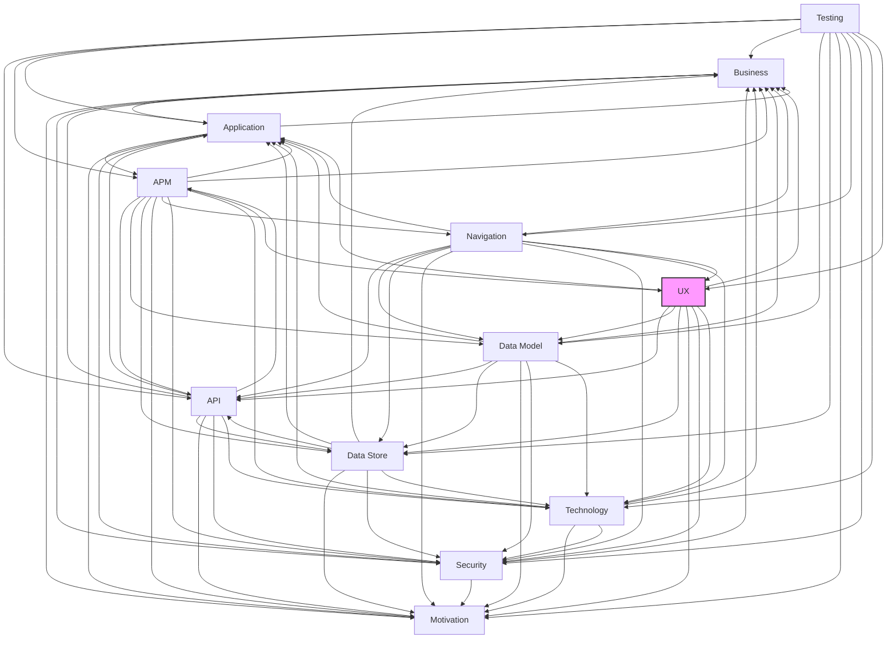

# UX Layer

## Report Index

- [Layer Introduction](#layer-introduction)
- [Intra-Layer Relationships](#intra-layer-relationships)
- [Inter-Layer Dependencies](#inter-layer-dependencies)
- [Inter-Layer Relationships Table](#inter-layer-relationships-table)
- [Node Reference](#node-reference)
  - [Actioncomponent](#actioncomponent)
  - [Actionpattern](#actionpattern)
  - [Chartseries](#chartseries)
  - [Componentinstance](#componentinstance)
  - [Componentreference](#componentreference)
  - [Dataconfig](#dataconfig)
  - [Errorconfig](#errorconfig)
  - [Experiencestate](#experiencestate)
  - [Layoutconfig](#layoutconfig)
  - [Librarycomponent](#librarycomponent)
  - [Librarysubview](#librarysubview)
  - [Stateaction](#stateaction)
  - [Stateactiontemplate](#stateactiontemplate)
  - [Statepattern](#statepattern)
  - [Statetransition](#statetransition)
  - [Subview](#subview)
  - [Tablecolumn](#tablecolumn)
  - [Transitiontemplate](#transitiontemplate)
  - [Uxapplication](#uxapplication)
  - [Uxlibrary](#uxlibrary)
  - [Uxspec](#uxspec)
  - [View](#view)

## Layer Introduction

**Layer 9**: UX
**Standard**: [HTML 5.3](https://html.spec.whatwg.org/)

Layer 9: UX Layer

### Statistics

| Metric                    | Count |
| ------------------------- | ----- |
| Node Types                | 22    |
| Intra-Layer Relationships | 128   |
| Inter-Layer Relationships | 84    |
| Inbound Relationships     | 24    |
| Outbound Relationships    | 60    |

### Layer Dependencies

**Depends On**: [Navigation](./10-navigation-layer-report.md), [APM](./11-apm-layer-report.md), [Testing](./12-testing-layer-report.md)

**Depended On By**: [Motivation](./01-motivation-layer-report.md), [Business](./02-business-layer-report.md), [Security](./03-security-layer-report.md), [Application](./04-application-layer-report.md), [Technology](./05-technology-layer-report.md), [API](./06-api-layer-report.md), [Data Model](./07-data-model-layer-report.md), [Data Store](./08-data-store-layer-report.md)

## Intra-Layer Relationships

```mermaid
flowchart LR
  subgraph ux
    actioncomponent["actioncomponent"]
    actionpattern["actionpattern"]
    chartseries["chartseries"]
    componentinstance["componentinstance"]
    componentreference["componentreference"]
    dataconfig["dataconfig"]
    errorconfig["errorconfig"]
    experiencestate["experiencestate"]
    layoutconfig["layoutconfig"]
    librarycomponent["librarycomponent"]
    librarysubview["librarysubview"]
    stateaction["stateaction"]
    stateactiontemplate["stateactiontemplate"]
    statepattern["statepattern"]
    statetransition["statetransition"]
    subview["subview"]
    tablecolumn["tablecolumn"]
    transitiontemplate["transitiontemplate"]
    uxapplication["uxapplication"]
    uxlibrary["uxlibrary"]
    uxspec["uxspec"]
    view["view"]
    actioncomponent -->|binds-to| dataconfig
    actioncomponent -->|implements| actionpattern
    actioncomponent -->|navigates-to| view
    actioncomponent -->|renders| actioncomponent
    actioncomponent -->|renders| componentinstance
    actioncomponent -->|renders| componentreference
    actioncomponent -->|renders| librarycomponent
    actioncomponent -->|triggers| stateaction
    actioncomponent -->|triggers| statetransition
    actioncomponent -->|uses| errorconfig
    actionpattern -->|associated-with| statepattern
    actionpattern -->|governs| actioncomponent
    actionpattern -->|governs| stateaction
    actionpattern -->|triggers| statetransition
    actionpattern -->|uses| transitiontemplate
    chartseries -->|binds-to| dataconfig
    chartseries -->|references| librarycomponent
    chartseries -->|uses| experiencestate
    componentinstance -->|aggregates| chartseries
    componentinstance -->|aggregates| componentreference
    componentinstance -->|aggregates| tablecolumn
    componentinstance -->|binds-to| dataconfig
    componentinstance -->|implements| librarycomponent
    componentinstance -->|provides| componentinstance
    componentinstance -->|realizes| librarycomponent
    componentinstance -->|renders| actioncomponent
    componentinstance -->|renders| componentinstance
    componentinstance -->|renders| componentreference
    componentinstance -->|renders| layoutconfig
    componentinstance -->|renders| librarycomponent
    componentinstance -->|uses| errorconfig
    componentreference -->|implements| librarycomponent
    componentreference -->|renders| actioncomponent
    componentreference -->|renders| componentinstance
    componentreference -->|renders| componentreference
    componentreference -->|renders| librarycomponent
    componentreference -->|uses| layoutconfig
    dataconfig -->|aggregates| errorconfig
    dataconfig -->|binds-to| componentinstance
    dataconfig -->|binds-to| librarycomponent
    dataconfig -->|binds-to| subview
    dataconfig -->|binds-to| view
    dataconfig -->|composes| chartseries
    dataconfig -->|provides| tablecolumn
    dataconfig -->|realizes| statepattern
    errorconfig -->|associated-with| dataconfig
    errorconfig -->|governs| actioncomponent
    errorconfig -->|governs| componentinstance
    errorconfig -->|governs| experiencestate
    errorconfig -->|governs| view
    experiencestate -->|associated-with| view
    experiencestate -->|flows-to| statetransition
    experiencestate -->|governs| view
    experiencestate -->|navigates-to| experiencestate
    experiencestate -->|renders| view
    experiencestate -->|specializes| statepattern
    experiencestate -->|triggers| stateaction
    experiencestate -->|uses| stateactiontemplate
    layoutconfig -->|associated-with| librarycomponent
    layoutconfig -->|composes| layoutconfig
    layoutconfig -->|governs| view
    layoutconfig -->|provides| subview
    layoutconfig -->|provides| view
    librarycomponent -->|composes| actioncomponent
    librarycomponent -->|composes| librarycomponent
    librarycomponent -->|renders| actioncomponent
    librarycomponent -->|renders| componentinstance
    librarycomponent -->|renders| componentreference
    librarycomponent -->|renders| librarycomponent
    librarycomponent -->|specializes| librarycomponent
    librarycomponent -->|uses| actionpattern
    librarycomponent -->|uses| statepattern
    librarysubview -->|aggregates| componentinstance
    librarysubview -->|composes| componentinstance
    librarysubview -->|uses| actionpattern
    librarysubview -->|uses| dataconfig
    librarysubview -->|uses| layoutconfig
    stateaction -->|flows-to| statetransition
    stateaction -->|specializes| stateactiontemplate
    stateaction -->|uses| actionpattern
    stateactiontemplate -->|associated-with| statepattern
    stateactiontemplate -->|governs| statetransition
    stateactiontemplate -->|implements| stateaction
    stateactiontemplate -->|provides| stateaction
    statepattern -->|aggregates| experiencestate
    statepattern -->|governs| experiencestate
    statepattern -->|specializes| statepattern
    statepattern -->|uses| stateactiontemplate
    statepattern -->|uses| transitiontemplate
    statetransition -->|associated-with| actioncomponent
    statetransition -->|navigates-to| experiencestate
    statetransition -->|triggers| stateaction
    statetransition -->|uses| transitiontemplate
    subview -->|aggregates| componentinstance
    subview -->|binds-to| dataconfig
    subview -->|realizes| librarysubview
    subview -->|renders| componentinstance
    subview -->|uses| errorconfig
    subview -->|uses| layoutconfig
    subview -->|uses| librarysubview
    tablecolumn -->|binds-to| dataconfig
    tablecolumn -->|references| actionpattern
    tablecolumn -->|renders| componentinstance
    tablecolumn -->|uses| layoutconfig
    transitiontemplate -->|flows-to| experiencestate
    transitiontemplate -->|flows-to| subview
    transitiontemplate -->|governs| statetransition
    transitiontemplate -->|navigates-to| view
    transitiontemplate -->|specializes| transitiontemplate
    transitiontemplate -->|triggers| stateaction
    uxapplication -->|aggregates| uxspec
    uxlibrary -->|aggregates| librarycomponent
    uxlibrary -->|aggregates| librarysubview
    uxlibrary -->|provides| librarycomponent
    uxlibrary -->|provides| librarysubview
    uxlibrary -->|uses| uxlibrary
    uxspec -->|aggregates| experiencestate
    uxspec -->|aggregates| view
    uxspec -->|governs| errorconfig
    uxspec -->|uses| uxlibrary
    view -->|aggregates| actioncomponent
    view -->|aggregates| subview
    view -->|applies| layoutconfig
    view -->|binds-to| dataconfig
    view -->|composes| subview
    view -->|renders| componentinstance
    view -->|requires| errorconfig
    view -->|uses| layoutconfig
  end
```

## Inter-Layer Dependencies

```mermaid
flowchart TB
  classDef current fill:#f9f,stroke:#333,stroke-width:2px
  motivation["Motivation"]
  business["Business"]
  security["Security"]
  application["Application"]
  technology["Technology"]
  api["API"]
  data_model["Data Model"]
  data_store["Data Store"]
  ux["UX"]
  navigation["Navigation"]
  apm["APM"]
  testing["Testing"]
  api --> apm
  api --> application
  api --> business
  api --> data_store
  api --> motivation
  api --> security
  api --> technology
  apm --> api
  apm --> application
  apm --> business
  apm --> data_model
  apm --> data_store
  apm --> motivation
  apm --> navigation
  apm --> security
  apm --> technology
  apm --> ux
  application --> apm
  application --> business
  application --> motivation
  application --> security
  business --> application
  business --> motivation
  business --> security
  data_model --> api
  data_model --> application
  data_model --> business
  data_model --> data_store
  data_model --> motivation
  data_model --> security
  data_model --> technology
  data_store --> api
  data_store --> application
  data_store --> business
  data_store --> motivation
  data_store --> security
  data_store --> technology
  navigation --> api
  navigation --> application
  navigation --> business
  navigation --> data_model
  navigation --> data_store
  navigation --> motivation
  navigation --> security
  navigation --> technology
  navigation --> ux
  security --> business
  security --> motivation
  technology --> application
  technology --> business
  technology --> motivation
  technology --> security
  testing --> api
  testing --> apm
  testing --> application
  testing --> business
  testing --> data_model
  testing --> data_store
  testing --> motivation
  testing --> navigation
  testing --> security
  testing --> technology
  testing --> ux
  ux --> api
  ux --> application
  ux --> business
  ux --> data_model
  ux --> data_store
  ux --> motivation
  ux --> security
  ux --> technology
  class ux current
```

## Inter-Layer Relationships Table

| Relationship ID                                              | Source Node                                                                  | Dest Node                                                                     | Dest Layer                                      | Predicate  | Cardinality  | Strength |
| ------------------------------------------------------------ | ---------------------------------------------------------------------------- | ----------------------------------------------------------------------------- | ----------------------------------------------- | ---------- | ------------ | -------- |
| apm.instrumentationscope.monitors.ux.uxapplication           | [Instrumentationscope](./11-apm-layer-report.md#instrumentationscope)        | [Uxapplication](./09-ux-layer-report.md#uxapplication)                        | [UX](./09-ux-layer-report.md)                   | monitors   | many-to-many | medium   |
| apm.logrecord.references.ux.view                             | [Logrecord](./11-apm-layer-report.md#logrecord)                              | [View](./09-ux-layer-report.md#view)                                          | [UX](./09-ux-layer-report.md)                   | references | many-to-many | medium   |
| apm.metricinstrument.monitors.ux.actioncomponent             | [Metricinstrument](./11-apm-layer-report.md#metricinstrument)                | [Actioncomponent](./09-ux-layer-report.md#actioncomponent)                    | [UX](./09-ux-layer-report.md)                   | monitors   | many-to-many | medium   |
| apm.metricinstrument.monitors.ux.errorconfig                 | [Metricinstrument](./11-apm-layer-report.md#metricinstrument)                | [Errorconfig](./09-ux-layer-report.md#errorconfig)                            | [UX](./09-ux-layer-report.md)                   | monitors   | many-to-many | medium   |
| apm.metricinstrument.monitors.ux.view                        | [Metricinstrument](./11-apm-layer-report.md#metricinstrument)                | [View](./09-ux-layer-report.md#view)                                          | [UX](./09-ux-layer-report.md)                   | monitors   | many-to-many | medium   |
| apm.span.monitors.ux.view                                    | [Span](./11-apm-layer-report.md#span)                                        | [View](./09-ux-layer-report.md#view)                                          | [UX](./09-ux-layer-report.md)                   | monitors   | many-to-many | medium   |
| apm.spanevent.monitors.ux.actioncomponent                    | [Spanevent](./11-apm-layer-report.md#spanevent)                              | [Actioncomponent](./09-ux-layer-report.md#actioncomponent)                    | [UX](./09-ux-layer-report.md)                   | monitors   | many-to-many | medium   |
| apm.traceconfiguration.monitors.ux.uxapplication             | [Traceconfiguration](./11-apm-layer-report.md#traceconfiguration)            | [Uxapplication](./09-ux-layer-report.md#uxapplication)                        | [UX](./09-ux-layer-report.md)                   | monitors   | many-to-many | medium   |
| navigation.flowstep.maps-to.ux.view                          | [Flowstep](./10-navigation-layer-report.md#flowstep)                         | [View](./09-ux-layer-report.md#view)                                          | [UX](./09-ux-layer-report.md)                   | maps-to    | many-to-many | medium   |
| navigation.navigationflow.accesses.ux.view                   | [Navigationflow](./10-navigation-layer-report.md#navigationflow)             | [View](./09-ux-layer-report.md#view)                                          | [UX](./09-ux-layer-report.md)                   | accesses   | many-to-many | medium   |
| navigation.navigationguard.triggers.ux.experiencestate       | [Navigationguard](./10-navigation-layer-report.md#navigationguard)           | [Experiencestate](./09-ux-layer-report.md#experiencestate)                    | [UX](./09-ux-layer-report.md)                   | triggers   | many-to-many | medium   |
| navigation.navigationtransition.triggers.ux.statetransition  | [Navigationtransition](./10-navigation-layer-report.md#navigationtransition) | [Statetransition](./09-ux-layer-report.md#statetransition)                    | [UX](./09-ux-layer-report.md)                   | triggers   | many-to-many | medium   |
| navigation.route.maps-to.ux.view                             | [Route](./10-navigation-layer-report.md#route)                               | [View](./09-ux-layer-report.md#view)                                          | [UX](./09-ux-layer-report.md)                   | maps-to    | many-to-many | medium   |
| navigation.route.uses.ux.errorconfig                         | [Route](./10-navigation-layer-report.md#route)                               | [Errorconfig](./09-ux-layer-report.md#errorconfig)                            | [UX](./09-ux-layer-report.md)                   | uses       | many-to-many | medium   |
| navigation.route.uses.ux.layoutconfig                        | [Route](./10-navigation-layer-report.md#route)                               | [Layoutconfig](./09-ux-layer-report.md#layoutconfig)                          | [UX](./09-ux-layer-report.md)                   | uses       | many-to-many | medium   |
| navigation.routemeta.uses.ux.layoutconfig                    | [Routemeta](./10-navigation-layer-report.md#routemeta)                       | [Layoutconfig](./09-ux-layer-report.md#layoutconfig)                          | [UX](./09-ux-layer-report.md)                   | uses       | many-to-many | medium   |
| testing.coveragerequirement.covers.ux.experiencestate        | [Coveragerequirement](./12-testing-layer-report.md#coveragerequirement)      | [Experiencestate](./09-ux-layer-report.md#experiencestate)                    | [UX](./09-ux-layer-report.md)                   | covers     | many-to-many | medium   |
| testing.targetinputfield.maps-to.ux.actioncomponent          | [Targetinputfield](./12-testing-layer-report.md#targetinputfield)            | [Actioncomponent](./09-ux-layer-report.md#actioncomponent)                    | [UX](./09-ux-layer-report.md)                   | maps-to    | many-to-many | medium   |
| testing.testcasesketch.tests.ux.actioncomponent              | [Testcasesketch](./12-testing-layer-report.md#testcasesketch)                | [Actioncomponent](./09-ux-layer-report.md#actioncomponent)                    | [UX](./09-ux-layer-report.md)                   | tests      | many-to-many | medium   |
| testing.testcasesketch.tests.ux.librarycomponent             | [Testcasesketch](./12-testing-layer-report.md#testcasesketch)                | [Librarycomponent](./09-ux-layer-report.md#librarycomponent)                  | [UX](./09-ux-layer-report.md)                   | tests      | many-to-many | medium   |
| testing.testcasesketch.tests.ux.view                         | [Testcasesketch](./12-testing-layer-report.md#testcasesketch)                | [View](./09-ux-layer-report.md#view)                                          | [UX](./09-ux-layer-report.md)                   | tests      | many-to-many | medium   |
| testing.testcoveragemodel.covers.ux.uxapplication            | [Testcoveragemodel](./12-testing-layer-report.md#testcoveragemodel)          | [Uxapplication](./09-ux-layer-report.md#uxapplication)                        | [UX](./09-ux-layer-report.md)                   | covers     | many-to-many | medium   |
| testing.testcoveragetarget.covers.ux.subview                 | [Testcoveragetarget](./12-testing-layer-report.md#testcoveragetarget)        | [Subview](./09-ux-layer-report.md#subview)                                    | [UX](./09-ux-layer-report.md)                   | covers     | many-to-many | medium   |
| testing.testcoveragetarget.covers.ux.view                    | [Testcoveragetarget](./12-testing-layer-report.md#testcoveragetarget)        | [View](./09-ux-layer-report.md#view)                                          | [UX](./09-ux-layer-report.md)                   | covers     | many-to-many | medium   |
| ux.actioncomponent.accesses.data-store.collection            | [Actioncomponent](./09-ux-layer-report.md#actioncomponent)                   | [Collection](./08-data-store-layer-report.md#collection)                      | [Data Store](./08-data-store-layer-report.md)   | accesses   | many-to-many | medium   |
| ux.actioncomponent.realizes.business.businessfunction        | [Actioncomponent](./09-ux-layer-report.md#actioncomponent)                   | [Businessfunction](./02-business-layer-report.md#businessfunction)            | [Business](./02-business-layer-report.md)       | realizes   | many-to-many | medium   |
| ux.actioncomponent.references.security.secureresource        | [Actioncomponent](./09-ux-layer-report.md#actioncomponent)                   | [Secureresource](./03-security-layer-report.md#secureresource)                | [Security](./03-security-layer-report.md)       | references | many-to-many | medium   |
| ux.actioncomponent.requires.security.permission              | [Actioncomponent](./09-ux-layer-report.md#actioncomponent)                   | [Permission](./03-security-layer-report.md#permission)                        | [Security](./03-security-layer-report.md)       | requires   | many-to-many | medium   |
| ux.actioncomponent.satisfies.motivation.requirement          | [Actioncomponent](./09-ux-layer-report.md#actioncomponent)                   | [Requirement](./01-motivation-layer-report.md#requirement)                    | [Motivation](./01-motivation-layer-report.md)   | satisfies  | many-to-many | medium   |
| ux.actioncomponent.triggers.api.operation                    | [Actioncomponent](./09-ux-layer-report.md#actioncomponent)                   | [Operation](./06-api-layer-report.md#operation)                               | [API](./06-api-layer-report.md)                 | triggers   | many-to-many | medium   |
| ux.actioncomponent.triggers.application.applicationservice   | [Actioncomponent](./09-ux-layer-report.md#actioncomponent)                   | [Applicationservice](./04-application-layer-report.md#applicationservice)     | [Application](./04-application-layer-report.md) | triggers   | many-to-many | medium   |
| ux.actioncomponent.triggers.business.businessevent           | [Actioncomponent](./09-ux-layer-report.md#actioncomponent)                   | [Businessevent](./02-business-layer-report.md#businessevent)                  | [Business](./02-business-layer-report.md)       | triggers   | many-to-many | medium   |
| ux.actioncomponent.triggers.data-store.storedlogic           | [Actioncomponent](./09-ux-layer-report.md#actioncomponent)                   | [Storedlogic](./08-data-store-layer-report.md#storedlogic)                    | [Data Store](./08-data-store-layer-report.md)   | triggers   | many-to-many | medium   |
| ux.actioncomponent.uses.application.applicationfunction      | [Actioncomponent](./09-ux-layer-report.md#actioncomponent)                   | [Applicationfunction](./04-application-layer-report.md#applicationfunction)   | [Application](./04-application-layer-report.md) | uses       | many-to-many | medium   |
| ux.actioncomponent.uses.technology.technologyservice         | [Actioncomponent](./09-ux-layer-report.md#actioncomponent)                   | [Technologyservice](./05-technology-layer-report.md#technologyservice)        | [Technology](./05-technology-layer-report.md)   | uses       | many-to-many | medium   |
| ux.chartseries.accesses.data-store.collection                | [Chartseries](./09-ux-layer-report.md#chartseries)                           | [Collection](./08-data-store-layer-report.md#collection)                      | [Data Store](./08-data-store-layer-report.md)   | accesses   | many-to-many | medium   |
| ux.chartseries.maps-to.data-model.arrayschema                | [Chartseries](./09-ux-layer-report.md#chartseries)                           | [Arrayschema](./07-data-model-layer-report.md#arrayschema)                    | [Data Model](./07-data-model-layer-report.md)   | maps-to    | many-to-many | medium   |
| ux.componentinstance.accesses.application.applicationservice | [Componentinstance](./09-ux-layer-report.md#componentinstance)               | [Applicationservice](./04-application-layer-report.md#applicationservice)     | [Application](./04-application-layer-report.md) | accesses   | many-to-many | medium   |
| ux.componentinstance.maps-to.data-model.objectschema         | [Componentinstance](./09-ux-layer-report.md#componentinstance)               | [Objectschema](./07-data-model-layer-report.md#objectschema)                  | [Data Model](./07-data-model-layer-report.md)   | maps-to    | many-to-many | medium   |
| ux.dataconfig.accesses.data-store.collection                 | [Dataconfig](./09-ux-layer-report.md#dataconfig)                             | [Collection](./08-data-store-layer-report.md#collection)                      | [Data Store](./08-data-store-layer-report.md)   | accesses   | many-to-many | medium   |
| ux.dataconfig.maps-to.api.requestbody                        | [Dataconfig](./09-ux-layer-report.md#dataconfig)                             | [Requestbody](./06-api-layer-report.md#requestbody)                           | [API](./06-api-layer-report.md)                 | maps-to    | many-to-many | medium   |
| ux.dataconfig.maps-to.api.response                           | [Dataconfig](./09-ux-layer-report.md#dataconfig)                             | [Response](./06-api-layer-report.md#response)                                 | [API](./06-api-layer-report.md)                 | maps-to    | many-to-many | medium   |
| ux.dataconfig.maps-to.api.schema                             | [Dataconfig](./09-ux-layer-report.md#dataconfig)                             | [Schema](./06-api-layer-report.md#schema)                                     | [API](./06-api-layer-report.md)                 | maps-to    | many-to-many | medium   |
| ux.dataconfig.maps-to.data-model.objectschema                | [Dataconfig](./09-ux-layer-report.md#dataconfig)                             | [Objectschema](./07-data-model-layer-report.md#objectschema)                  | [Data Model](./07-data-model-layer-report.md)   | maps-to    | many-to-many | medium   |
| ux.dataconfig.references.data-model.schemadefinition         | [Dataconfig](./09-ux-layer-report.md#dataconfig)                             | [Schemadefinition](./07-data-model-layer-report.md#schemadefinition)          | [Data Model](./07-data-model-layer-report.md)   | references | many-to-many | medium   |
| ux.errorconfig.maps-to.api.response                          | [Errorconfig](./09-ux-layer-report.md#errorconfig)                           | [Response](./06-api-layer-report.md#response)                                 | [API](./06-api-layer-report.md)                 | maps-to    | many-to-many | medium   |
| ux.errorconfig.references.data-model.objectschema            | [Errorconfig](./09-ux-layer-report.md#errorconfig)                           | [Objectschema](./07-data-model-layer-report.md#objectschema)                  | [Data Model](./07-data-model-layer-report.md)   | references | many-to-many | medium   |
| ux.librarycomponent.depends-on.technology.systemsoftware     | [Librarycomponent](./09-ux-layer-report.md#librarycomponent)                 | [Systemsoftware](./05-technology-layer-report.md#systemsoftware)              | [Technology](./05-technology-layer-report.md)   | depends-on | many-to-many | medium   |
| ux.librarycomponent.requires.technology.technologyservice    | [Librarycomponent](./09-ux-layer-report.md#librarycomponent)                 | [Technologyservice](./05-technology-layer-report.md#technologyservice)        | [Technology](./05-technology-layer-report.md)   | requires   | many-to-many | medium   |
| ux.librarycomponent.satisfies.motivation.principle           | [Librarycomponent](./09-ux-layer-report.md#librarycomponent)                 | [Principle](./01-motivation-layer-report.md#principle)                        | [Motivation](./01-motivation-layer-report.md)   | satisfies  | many-to-many | medium   |
| ux.librarycomponent.satisfies.motivation.requirement         | [Librarycomponent](./09-ux-layer-report.md#librarycomponent)                 | [Requirement](./01-motivation-layer-report.md#requirement)                    | [Motivation](./01-motivation-layer-report.md)   | satisfies  | many-to-many | medium   |
| ux.stateaction.triggers.api.operation                        | [Stateaction](./09-ux-layer-report.md#stateaction)                           | [Operation](./06-api-layer-report.md#operation)                               | [API](./06-api-layer-report.md)                 | triggers   | many-to-many | medium   |
| ux.subview.accesses.data-store.collection                    | [Subview](./09-ux-layer-report.md#subview)                                   | [Collection](./08-data-store-layer-report.md#collection)                      | [Data Store](./08-data-store-layer-report.md)   | accesses   | many-to-many | medium   |
| ux.subview.realizes.business.businessprocess                 | [Subview](./09-ux-layer-report.md#subview)                                   | [Businessprocess](./02-business-layer-report.md#businessprocess)              | [Business](./02-business-layer-report.md)       | realizes   | many-to-many | medium   |
| ux.subview.references.data-model.objectschema                | [Subview](./09-ux-layer-report.md#subview)                                   | [Objectschema](./07-data-model-layer-report.md#objectschema)                  | [Data Model](./07-data-model-layer-report.md)   | references | many-to-many | medium   |
| ux.subview.requires.security.permission                      | [Subview](./09-ux-layer-report.md#subview)                                   | [Permission](./03-security-layer-report.md#permission)                        | [Security](./03-security-layer-report.md)       | requires   | many-to-many | medium   |
| ux.subview.serves.application.applicationservice             | [Subview](./09-ux-layer-report.md#subview)                                   | [Applicationservice](./04-application-layer-report.md#applicationservice)     | [Application](./04-application-layer-report.md) | serves     | many-to-many | medium   |
| ux.tablecolumn.maps-to.data-model.schemaproperty             | [Tablecolumn](./09-ux-layer-report.md#tablecolumn)                           | [Schemaproperty](./07-data-model-layer-report.md#schemaproperty)              | [Data Model](./07-data-model-layer-report.md)   | maps-to    | many-to-many | medium   |
| ux.tablecolumn.maps-to.data-store.field                      | [Tablecolumn](./09-ux-layer-report.md#tablecolumn)                           | [Field](./08-data-store-layer-report.md#field)                                | [Data Store](./08-data-store-layer-report.md)   | maps-to    | many-to-many | medium   |
| ux.tablecolumn.references.security.fieldaccesscontrol        | [Tablecolumn](./09-ux-layer-report.md#tablecolumn)                           | [Fieldaccesscontrol](./03-security-layer-report.md#fieldaccesscontrol)        | [Security](./03-security-layer-report.md)       | references | many-to-many | medium   |
| ux.uxspec.satisfies.motivation.requirement                   | [Uxspec](./09-ux-layer-report.md#uxspec)                                     | [Requirement](./01-motivation-layer-report.md#requirement)                    | [Motivation](./01-motivation-layer-report.md)   | satisfies  | many-to-many | medium   |
| ux.view.accesses.api.operation                               | [View](./09-ux-layer-report.md#view)                                         | [Operation](./06-api-layer-report.md#operation)                               | [API](./06-api-layer-report.md)                 | accesses   | many-to-many | medium   |
| ux.view.accesses.application.applicationcomponent            | [View](./09-ux-layer-report.md#view)                                         | [Applicationcomponent](./04-application-layer-report.md#applicationcomponent) | [Application](./04-application-layer-report.md) | accesses   | many-to-many | medium   |
| ux.view.accesses.data-store.collection                       | [View](./09-ux-layer-report.md#view)                                         | [Collection](./08-data-store-layer-report.md#collection)                      | [Data Store](./08-data-store-layer-report.md)   | accesses   | many-to-many | medium   |
| ux.view.accesses.data-store.view                             | [View](./09-ux-layer-report.md#view)                                         | [View](./08-data-store-layer-report.md#view)                                  | [Data Store](./08-data-store-layer-report.md)   | accesses   | many-to-many | medium   |
| ux.view.depends-on.technology.systemsoftware                 | [View](./09-ux-layer-report.md#view)                                         | [Systemsoftware](./05-technology-layer-report.md#systemsoftware)              | [Technology](./05-technology-layer-report.md)   | depends-on | many-to-many | medium   |
| ux.view.maps-to.business.businessobject                      | [View](./09-ux-layer-report.md#view)                                         | [Businessobject](./02-business-layer-report.md#businessobject)                | [Business](./02-business-layer-report.md)       | maps-to    | many-to-many | medium   |
| ux.view.maps-to.motivation.outcome                           | [View](./09-ux-layer-report.md#view)                                         | [Outcome](./01-motivation-layer-report.md#outcome)                            | [Motivation](./01-motivation-layer-report.md)   | maps-to    | many-to-many | medium   |
| ux.view.realizes.application.applicationinterface            | [View](./09-ux-layer-report.md#view)                                         | [Applicationinterface](./04-application-layer-report.md#applicationinterface) | [Application](./04-application-layer-report.md) | realizes   | many-to-many | medium   |
| ux.view.realizes.business.businessprocess                    | [View](./09-ux-layer-report.md#view)                                         | [Businessprocess](./02-business-layer-report.md#businessprocess)              | [Business](./02-business-layer-report.md)       | realizes   | many-to-many | medium   |
| ux.view.realizes.motivation.goal                             | [View](./09-ux-layer-report.md#view)                                         | [Goal](./01-motivation-layer-report.md#goal)                                  | [Motivation](./01-motivation-layer-report.md)   | realizes   | many-to-many | medium   |
| ux.view.references.data-model.objectschema                   | [View](./09-ux-layer-report.md#view)                                         | [Objectschema](./07-data-model-layer-report.md#objectschema)                  | [Data Model](./07-data-model-layer-report.md)   | references | many-to-many | medium   |
| ux.view.references.security.secureresource                   | [View](./09-ux-layer-report.md#view)                                         | [Secureresource](./03-security-layer-report.md#secureresource)                | [Security](./03-security-layer-report.md)       | references | many-to-many | medium   |
| ux.view.requires.security.permission                         | [View](./09-ux-layer-report.md#view)                                         | [Permission](./03-security-layer-report.md#permission)                        | [Security](./03-security-layer-report.md)       | requires   | many-to-many | medium   |
| ux.view.requires.security.role                               | [View](./09-ux-layer-report.md#view)                                         | [Role](./03-security-layer-report.md#role)                                    | [Security](./03-security-layer-report.md)       | requires   | many-to-many | medium   |
| ux.view.requires.technology.technologyservice                | [View](./09-ux-layer-report.md#view)                                         | [Technologyservice](./05-technology-layer-report.md#technologyservice)        | [Technology](./05-technology-layer-report.md)   | requires   | many-to-many | medium   |
| ux.view.satisfies.motivation.requirement                     | [View](./09-ux-layer-report.md#view)                                         | [Requirement](./01-motivation-layer-report.md#requirement)                    | [Motivation](./01-motivation-layer-report.md)   | satisfies  | many-to-many | medium   |
| ux.view.satisfies.security.securitypolicy                    | [View](./09-ux-layer-report.md#view)                                         | [Securitypolicy](./03-security-layer-report.md#securitypolicy)                | [Security](./03-security-layer-report.md)       | satisfies  | many-to-many | medium   |
| ux.view.serves.application.applicationservice                | [View](./09-ux-layer-report.md#view)                                         | [Applicationservice](./04-application-layer-report.md#applicationservice)     | [Application](./04-application-layer-report.md) | serves     | many-to-many | medium   |
| ux.view.serves.business.businessrole                         | [View](./09-ux-layer-report.md#view)                                         | [Businessrole](./02-business-layer-report.md#businessrole)                    | [Business](./02-business-layer-report.md)       | serves     | many-to-many | medium   |
| ux.view.serves.business.businessservice                      | [View](./09-ux-layer-report.md#view)                                         | [Businessservice](./02-business-layer-report.md#businessservice)              | [Business](./02-business-layer-report.md)       | serves     | many-to-many | medium   |
| ux.view.serves.motivation.stakeholder                        | [View](./09-ux-layer-report.md#view)                                         | [Stakeholder](./01-motivation-layer-report.md#stakeholder)                    | [Motivation](./01-motivation-layer-report.md)   | serves     | many-to-many | medium   |
| ux.view.uses.api.securityscheme                              | [View](./09-ux-layer-report.md#view)                                         | [Securityscheme](./06-api-layer-report.md#securityscheme)                     | [API](./06-api-layer-report.md)                 | uses       | many-to-many | medium   |
| ux.view.uses.application.applicationevent                    | [View](./09-ux-layer-report.md#view)                                         | [Applicationevent](./04-application-layer-report.md#applicationevent)         | [Application](./04-application-layer-report.md) | uses       | many-to-many | medium   |

## Node Reference

### Actioncomponent {#actioncomponent}

**Spec Node ID**: `ux.actioncomponent`

Interactive element that triggers actions (button, menu, link, voice command)

#### Relationship Metrics

- **Intra-Layer**: Inbound: 9 | Outbound: 10
- **Inter-Layer**: Inbound: 4 | Outbound: 11

#### Intra-Layer Relationships

| Related Node                              | Predicate       | Direction | Cardinality  |
| ----------------------------------------- | --------------- | --------- | ------------ |
| [Dataconfig](#dataconfig)                 | binds-to        | outbound  | many-to-many |
| [Actionpattern](#actionpattern)           | implements      | outbound  | many-to-many |
| [View](#view)                             | navigates-to    | outbound  | many-to-many |
| [Actioncomponent](#actioncomponent)       | renders         | outbound  | many-to-many |
| [Componentinstance](#componentinstance)   | renders         | outbound  | many-to-many |
| [Componentreference](#componentreference) | renders         | outbound  | many-to-many |
| [Librarycomponent](#librarycomponent)     | renders         | outbound  | many-to-many |
| [Stateaction](#stateaction)               | triggers        | outbound  | many-to-many |
| [Statetransition](#statetransition)       | triggers        | outbound  | many-to-many |
| [Errorconfig](#errorconfig)               | uses            | outbound  | many-to-many |
| [Actionpattern](#actionpattern)           | governs         | inbound   | many-to-many |
| [Componentinstance](#componentinstance)   | renders         | inbound   | many-to-many |
| [Componentreference](#componentreference) | renders         | inbound   | many-to-many |
| [Errorconfig](#errorconfig)               | governs         | inbound   | many-to-many |
| [Librarycomponent](#librarycomponent)     | composes        | inbound   | many-to-many |
| [Librarycomponent](#librarycomponent)     | renders         | inbound   | many-to-many |
| [Statetransition](#statetransition)       | associated-with | inbound   | many-to-many |
| [View](#view)                             | aggregates      | inbound   | one-to-many  |

#### Inter-Layer Relationships

| Related Node                                                                | Layer                                           | Predicate  | Direction | Cardinality  |
| --------------------------------------------------------------------------- | ----------------------------------------------- | ---------- | --------- | ------------ |
| [Metricinstrument](./11-apm-layer-report.md#metricinstrument)               | [APM](./11-apm-layer-report.md)                 | monitors   | inbound   | many-to-many |
| [Spanevent](./11-apm-layer-report.md#spanevent)                             | [APM](./11-apm-layer-report.md)                 | monitors   | inbound   | many-to-many |
| [Targetinputfield](./12-testing-layer-report.md#targetinputfield)           | [Testing](./12-testing-layer-report.md)         | maps-to    | inbound   | many-to-many |
| [Testcasesketch](./12-testing-layer-report.md#testcasesketch)               | [Testing](./12-testing-layer-report.md)         | tests      | inbound   | many-to-many |
| [Collection](./08-data-store-layer-report.md#collection)                    | [Data Store](./08-data-store-layer-report.md)   | accesses   | outbound  | many-to-many |
| [Businessfunction](./02-business-layer-report.md#businessfunction)          | [Business](./02-business-layer-report.md)       | realizes   | outbound  | many-to-many |
| [Secureresource](./03-security-layer-report.md#secureresource)              | [Security](./03-security-layer-report.md)       | references | outbound  | many-to-many |
| [Permission](./03-security-layer-report.md#permission)                      | [Security](./03-security-layer-report.md)       | requires   | outbound  | many-to-many |
| [Requirement](./01-motivation-layer-report.md#requirement)                  | [Motivation](./01-motivation-layer-report.md)   | satisfies  | outbound  | many-to-many |
| [Operation](./06-api-layer-report.md#operation)                             | [API](./06-api-layer-report.md)                 | triggers   | outbound  | many-to-many |
| [Applicationservice](./04-application-layer-report.md#applicationservice)   | [Application](./04-application-layer-report.md) | triggers   | outbound  | many-to-many |
| [Businessevent](./02-business-layer-report.md#businessevent)                | [Business](./02-business-layer-report.md)       | triggers   | outbound  | many-to-many |
| [Storedlogic](./08-data-store-layer-report.md#storedlogic)                  | [Data Store](./08-data-store-layer-report.md)   | triggers   | outbound  | many-to-many |
| [Applicationfunction](./04-application-layer-report.md#applicationfunction) | [Application](./04-application-layer-report.md) | uses       | outbound  | many-to-many |
| [Technologyservice](./05-technology-layer-report.md#technologyservice)      | [Technology](./05-technology-layer-report.md)   | uses       | outbound  | many-to-many |

[Back to Index](#report-index)

### Actionpattern {#actionpattern}

**Spec Node ID**: `ux.actionpattern`

Reusable action configuration for common user interactions. Defines the trigger, feedback mechanism, and optional target for recurring UX patterns. Example: 'confirm-and-delete' pattern — trigger: click on delete button, feedback: confirmation modal then success toast, targetRef: the item being deleted.

#### Relationship Metrics

- **Intra-Layer**: Inbound: 5 | Outbound: 5
- **Inter-Layer**: Inbound: 0 | Outbound: 0

#### Intra-Layer Relationships

| Related Node                              | Predicate       | Direction | Cardinality  |
| ----------------------------------------- | --------------- | --------- | ------------ |
| [Actioncomponent](#actioncomponent)       | implements      | inbound   | many-to-many |
| [Statepattern](#statepattern)             | associated-with | outbound  | many-to-many |
| [Actioncomponent](#actioncomponent)       | governs         | outbound  | many-to-many |
| [Stateaction](#stateaction)               | governs         | outbound  | many-to-many |
| [Statetransition](#statetransition)       | triggers        | outbound  | many-to-many |
| [Transitiontemplate](#transitiontemplate) | uses            | outbound  | many-to-many |
| [Librarycomponent](#librarycomponent)     | uses            | inbound   | many-to-many |
| [Librarysubview](#librarysubview)         | uses            | inbound   | many-to-many |
| [Stateaction](#stateaction)               | uses            | inbound   | many-to-many |
| [Tablecolumn](#tablecolumn)               | references      | inbound   | many-to-many |

[Back to Index](#report-index)

### Chartseries {#chartseries}

**Spec Node ID**: `ux.chartseries`

Configuration for a data series within a chart component, specifying data source, visualization type, colors, and legend properties. Defines how data is visualized in charts.

#### Relationship Metrics

- **Intra-Layer**: Inbound: 2 | Outbound: 3
- **Inter-Layer**: Inbound: 0 | Outbound: 2

#### Intra-Layer Relationships

| Related Node                            | Predicate  | Direction | Cardinality  |
| --------------------------------------- | ---------- | --------- | ------------ |
| [Dataconfig](#dataconfig)               | binds-to   | outbound  | many-to-many |
| [Librarycomponent](#librarycomponent)   | references | outbound  | many-to-many |
| [Experiencestate](#experiencestate)     | uses       | outbound  | many-to-many |
| [Componentinstance](#componentinstance) | aggregates | inbound   | many-to-many |
| [Dataconfig](#dataconfig)               | composes   | inbound   | many-to-many |

#### Inter-Layer Relationships

| Related Node                                               | Layer                                         | Predicate | Direction | Cardinality  |
| ---------------------------------------------------------- | --------------------------------------------- | --------- | --------- | ------------ |
| [Collection](./08-data-store-layer-report.md#collection)   | [Data Store](./08-data-store-layer-report.md) | accesses  | outbound  | many-to-many |
| [Arrayschema](./07-data-model-layer-report.md#arrayschema) | [Data Model](./07-data-model-layer-report.md) | maps-to   | outbound  | many-to-many |

[Back to Index](#report-index)

### Componentinstance {#componentinstance}

**Spec Node ID**: `ux.componentinstance`

Instance of a LibraryComponent with application-specific configuration

#### Relationship Metrics

- **Intra-Layer**: Inbound: 13 | Outbound: 13
- **Inter-Layer**: Inbound: 0 | Outbound: 2

#### Intra-Layer Relationships

| Related Node                              | Predicate  | Direction | Cardinality  |
| ----------------------------------------- | ---------- | --------- | ------------ |
| [Actioncomponent](#actioncomponent)       | renders    | inbound   | many-to-many |
| [Chartseries](#chartseries)               | aggregates | outbound  | many-to-many |
| [Componentreference](#componentreference) | aggregates | outbound  | many-to-many |
| [Tablecolumn](#tablecolumn)               | aggregates | outbound  | many-to-many |
| [Dataconfig](#dataconfig)                 | binds-to   | outbound  | many-to-many |
| [Librarycomponent](#librarycomponent)     | implements | outbound  | many-to-many |
| [Componentinstance](#componentinstance)   | provides   | outbound  | many-to-many |
| [Librarycomponent](#librarycomponent)     | realizes   | outbound  | many-to-many |
| [Actioncomponent](#actioncomponent)       | renders    | outbound  | many-to-many |
| [Componentinstance](#componentinstance)   | renders    | outbound  | many-to-many |
| [Componentreference](#componentreference) | renders    | outbound  | many-to-many |
| [Layoutconfig](#layoutconfig)             | renders    | outbound  | many-to-many |
| [Librarycomponent](#librarycomponent)     | renders    | outbound  | many-to-many |
| [Errorconfig](#errorconfig)               | uses       | outbound  | many-to-many |
| [Componentreference](#componentreference) | renders    | inbound   | many-to-many |
| [Dataconfig](#dataconfig)                 | binds-to   | inbound   | many-to-many |
| [Errorconfig](#errorconfig)               | governs    | inbound   | many-to-many |
| [Librarycomponent](#librarycomponent)     | renders    | inbound   | many-to-many |
| [Librarysubview](#librarysubview)         | aggregates | inbound   | many-to-many |
| [Librarysubview](#librarysubview)         | composes   | inbound   | many-to-many |
| [Subview](#subview)                       | aggregates | inbound   | many-to-many |
| [Subview](#subview)                       | renders    | inbound   | many-to-many |
| [Tablecolumn](#tablecolumn)               | renders    | inbound   | many-to-many |
| [View](#view)                             | renders    | inbound   | many-to-many |

#### Inter-Layer Relationships

| Related Node                                                              | Layer                                           | Predicate | Direction | Cardinality  |
| ------------------------------------------------------------------------- | ----------------------------------------------- | --------- | --------- | ------------ |
| [Applicationservice](./04-application-layer-report.md#applicationservice) | [Application](./04-application-layer-report.md) | accesses  | outbound  | many-to-many |
| [Objectschema](./07-data-model-layer-report.md#objectschema)              | [Data Model](./07-data-model-layer-report.md)   | maps-to   | outbound  | many-to-many |

[Back to Index](#report-index)

### Componentreference {#componentreference}

**Spec Node ID**: `ux.componentreference`

A declarative placeholder in a parent component's named slot, pointing to another component to be rendered there. Unlike ComponentInstance (a concrete rendered occurrence), ComponentReference is a composition declaration that says 'render this component in this slot of the parent', analogous to the HTML slot element.

#### Relationship Metrics

- **Intra-Layer**: Inbound: 5 | Outbound: 6
- **Inter-Layer**: Inbound: 0 | Outbound: 0

#### Intra-Layer Relationships

| Related Node                              | Predicate  | Direction | Cardinality  |
| ----------------------------------------- | ---------- | --------- | ------------ |
| [Actioncomponent](#actioncomponent)       | renders    | inbound   | many-to-many |
| [Componentinstance](#componentinstance)   | aggregates | inbound   | many-to-many |
| [Componentinstance](#componentinstance)   | renders    | inbound   | many-to-many |
| [Librarycomponent](#librarycomponent)     | implements | outbound  | many-to-many |
| [Actioncomponent](#actioncomponent)       | renders    | outbound  | many-to-many |
| [Componentinstance](#componentinstance)   | renders    | outbound  | many-to-many |
| [Componentreference](#componentreference) | renders    | outbound  | many-to-many |
| [Librarycomponent](#librarycomponent)     | renders    | outbound  | many-to-many |
| [Layoutconfig](#layoutconfig)             | uses       | outbound  | many-to-many |
| [Librarycomponent](#librarycomponent)     | renders    | inbound   | many-to-many |

[Back to Index](#report-index)

### Dataconfig {#dataconfig}

**Spec Node ID**: `ux.dataconfig`

Configuration for data binding and state management within UI components, defining data sources, transformation pipelines, and update triggers. Manages component data flow.

#### Relationship Metrics

- **Intra-Layer**: Inbound: 8 | Outbound: 8
- **Inter-Layer**: Inbound: 0 | Outbound: 6

#### Intra-Layer Relationships

| Related Node                            | Predicate       | Direction | Cardinality  |
| --------------------------------------- | --------------- | --------- | ------------ |
| [Actioncomponent](#actioncomponent)     | binds-to        | inbound   | many-to-many |
| [Chartseries](#chartseries)             | binds-to        | inbound   | many-to-many |
| [Componentinstance](#componentinstance) | binds-to        | inbound   | many-to-many |
| [Errorconfig](#errorconfig)             | aggregates      | outbound  | many-to-many |
| [Componentinstance](#componentinstance) | binds-to        | outbound  | many-to-many |
| [Librarycomponent](#librarycomponent)   | binds-to        | outbound  | many-to-many |
| [Subview](#subview)                     | binds-to        | outbound  | many-to-many |
| [View](#view)                           | binds-to        | outbound  | many-to-many |
| [Chartseries](#chartseries)             | composes        | outbound  | many-to-many |
| [Tablecolumn](#tablecolumn)             | provides        | outbound  | many-to-many |
| [Statepattern](#statepattern)           | realizes        | outbound  | many-to-many |
| [Errorconfig](#errorconfig)             | associated-with | inbound   | many-to-many |
| [Librarysubview](#librarysubview)       | uses            | inbound   | many-to-many |
| [Subview](#subview)                     | binds-to        | inbound   | many-to-many |
| [Tablecolumn](#tablecolumn)             | binds-to        | inbound   | many-to-many |
| [View](#view)                           | binds-to        | inbound   | many-to-many |

#### Inter-Layer Relationships

| Related Node                                                         | Layer                                         | Predicate  | Direction | Cardinality  |
| -------------------------------------------------------------------- | --------------------------------------------- | ---------- | --------- | ------------ |
| [Collection](./08-data-store-layer-report.md#collection)             | [Data Store](./08-data-store-layer-report.md) | accesses   | outbound  | many-to-many |
| [Requestbody](./06-api-layer-report.md#requestbody)                  | [API](./06-api-layer-report.md)               | maps-to    | outbound  | many-to-many |
| [Response](./06-api-layer-report.md#response)                        | [API](./06-api-layer-report.md)               | maps-to    | outbound  | many-to-many |
| [Schema](./06-api-layer-report.md#schema)                            | [API](./06-api-layer-report.md)               | maps-to    | outbound  | many-to-many |
| [Objectschema](./07-data-model-layer-report.md#objectschema)         | [Data Model](./07-data-model-layer-report.md) | maps-to    | outbound  | many-to-many |
| [Schemadefinition](./07-data-model-layer-report.md#schemadefinition) | [Data Model](./07-data-model-layer-report.md) | references | outbound  | many-to-many |

[Back to Index](#report-index)

### Errorconfig {#errorconfig}

**Spec Node ID**: `ux.errorconfig`

Configuration for error handling and display within UI components, specifying error message formats, retry behavior, fallback content, and user guidance. Ensures consistent error UX.

#### Relationship Metrics

- **Intra-Layer**: Inbound: 6 | Outbound: 5
- **Inter-Layer**: Inbound: 2 | Outbound: 2

#### Intra-Layer Relationships

| Related Node                            | Predicate       | Direction | Cardinality  |
| --------------------------------------- | --------------- | --------- | ------------ |
| [Actioncomponent](#actioncomponent)     | uses            | inbound   | many-to-many |
| [Componentinstance](#componentinstance) | uses            | inbound   | many-to-many |
| [Dataconfig](#dataconfig)               | aggregates      | inbound   | many-to-many |
| [Dataconfig](#dataconfig)               | associated-with | outbound  | many-to-many |
| [Actioncomponent](#actioncomponent)     | governs         | outbound  | many-to-many |
| [Componentinstance](#componentinstance) | governs         | outbound  | many-to-many |
| [Experiencestate](#experiencestate)     | governs         | outbound  | many-to-many |
| [View](#view)                           | governs         | outbound  | many-to-many |
| [Subview](#subview)                     | uses            | inbound   | many-to-many |
| [Uxspec](#uxspec)                       | governs         | inbound   | many-to-many |
| [View](#view)                           | requires        | inbound   | many-to-many |

#### Inter-Layer Relationships

| Related Node                                                  | Layer                                         | Predicate  | Direction | Cardinality  |
| ------------------------------------------------------------- | --------------------------------------------- | ---------- | --------- | ------------ |
| [Metricinstrument](./11-apm-layer-report.md#metricinstrument) | [APM](./11-apm-layer-report.md)               | monitors   | inbound   | many-to-many |
| [Route](./10-navigation-layer-report.md#route)                | [Navigation](./10-navigation-layer-report.md) | uses       | inbound   | many-to-many |
| [Response](./06-api-layer-report.md#response)                 | [API](./06-api-layer-report.md)               | maps-to    | outbound  | many-to-many |
| [Objectschema](./07-data-model-layer-report.md#objectschema)  | [Data Model](./07-data-model-layer-report.md) | references | outbound  | many-to-many |

[Back to Index](#report-index)

### Experiencestate {#experiencestate}

**Spec Node ID**: `ux.experiencestate`

Distinct state that the experience can be in (works across all channels)

#### Relationship Metrics

- **Intra-Layer**: Inbound: 8 | Outbound: 8
- **Inter-Layer**: Inbound: 2 | Outbound: 0

#### Intra-Layer Relationships

| Related Node                                | Predicate       | Direction | Cardinality  |
| ------------------------------------------- | --------------- | --------- | ------------ |
| [Chartseries](#chartseries)                 | uses            | inbound   | many-to-many |
| [Errorconfig](#errorconfig)                 | governs         | inbound   | many-to-many |
| [View](#view)                               | associated-with | outbound  | many-to-many |
| [Statetransition](#statetransition)         | flows-to        | outbound  | many-to-many |
| [View](#view)                               | governs         | outbound  | many-to-many |
| [Experiencestate](#experiencestate)         | navigates-to    | outbound  | many-to-many |
| [View](#view)                               | renders         | outbound  | many-to-many |
| [Statepattern](#statepattern)               | specializes     | outbound  | many-to-many |
| [Stateaction](#stateaction)                 | triggers        | outbound  | many-to-many |
| [Stateactiontemplate](#stateactiontemplate) | uses            | outbound  | many-to-many |
| [Statepattern](#statepattern)               | aggregates      | inbound   | many-to-many |
| [Statepattern](#statepattern)               | governs         | inbound   | many-to-many |
| [Statetransition](#statetransition)         | navigates-to    | inbound   | many-to-many |
| [Transitiontemplate](#transitiontemplate)   | flows-to        | inbound   | many-to-many |
| [Uxspec](#uxspec)                           | aggregates      | inbound   | many-to-many |

#### Inter-Layer Relationships

| Related Node                                                            | Layer                                         | Predicate | Direction | Cardinality  |
| ----------------------------------------------------------------------- | --------------------------------------------- | --------- | --------- | ------------ |
| [Navigationguard](./10-navigation-layer-report.md#navigationguard)      | [Navigation](./10-navigation-layer-report.md) | triggers  | inbound   | many-to-many |
| [Coveragerequirement](./12-testing-layer-report.md#coveragerequirement) | [Testing](./12-testing-layer-report.md)       | covers    | inbound   | many-to-many |

[Back to Index](#report-index)

### Layoutconfig {#layoutconfig}

**Spec Node ID**: `ux.layoutconfig`

Configuration for UI layout structure, defining grid systems, responsive breakpoints, spacing rules, and component arrangement patterns. Controls visual organization of the interface.

#### Relationship Metrics

- **Intra-Layer**: Inbound: 8 | Outbound: 5
- **Inter-Layer**: Inbound: 2 | Outbound: 0

#### Intra-Layer Relationships

| Related Node                              | Predicate       | Direction | Cardinality  |
| ----------------------------------------- | --------------- | --------- | ------------ |
| [Componentinstance](#componentinstance)   | renders         | inbound   | many-to-many |
| [Componentreference](#componentreference) | uses            | inbound   | many-to-many |
| [Librarycomponent](#librarycomponent)     | associated-with | outbound  | many-to-many |
| [Layoutconfig](#layoutconfig)             | composes        | outbound  | many-to-many |
| [View](#view)                             | governs         | outbound  | many-to-many |
| [Subview](#subview)                       | provides        | outbound  | many-to-many |
| [View](#view)                             | provides        | outbound  | many-to-many |
| [Librarysubview](#librarysubview)         | uses            | inbound   | many-to-many |
| [Subview](#subview)                       | uses            | inbound   | many-to-many |
| [Tablecolumn](#tablecolumn)               | uses            | inbound   | many-to-many |
| [View](#view)                             | applies         | inbound   | many-to-many |
| [View](#view)                             | uses            | inbound   | many-to-many |

#### Inter-Layer Relationships

| Related Node                                           | Layer                                         | Predicate | Direction | Cardinality  |
| ------------------------------------------------------ | --------------------------------------------- | --------- | --------- | ------------ |
| [Route](./10-navigation-layer-report.md#route)         | [Navigation](./10-navigation-layer-report.md) | uses      | inbound   | many-to-many |
| [Routemeta](./10-navigation-layer-report.md#routemeta) | [Navigation](./10-navigation-layer-report.md) | uses      | inbound   | many-to-many |

[Back to Index](#report-index)

### Librarycomponent {#librarycomponent}

**Spec Node ID**: `ux.librarycomponent`

Reusable UI component definition that can be instantiated in multiple UXSpecs

#### Relationship Metrics

- **Intra-Layer**: Inbound: 14 | Outbound: 9
- **Inter-Layer**: Inbound: 1 | Outbound: 4

#### Intra-Layer Relationships

| Related Node                              | Predicate       | Direction | Cardinality  |
| ----------------------------------------- | --------------- | --------- | ------------ |
| [Actioncomponent](#actioncomponent)       | renders         | inbound   | many-to-many |
| [Chartseries](#chartseries)               | references      | inbound   | many-to-many |
| [Componentinstance](#componentinstance)   | implements      | inbound   | many-to-many |
| [Componentinstance](#componentinstance)   | realizes        | inbound   | many-to-many |
| [Componentinstance](#componentinstance)   | renders         | inbound   | many-to-many |
| [Componentreference](#componentreference) | implements      | inbound   | many-to-many |
| [Componentreference](#componentreference) | renders         | inbound   | many-to-many |
| [Dataconfig](#dataconfig)                 | binds-to        | inbound   | many-to-many |
| [Layoutconfig](#layoutconfig)             | associated-with | inbound   | many-to-many |
| [Actioncomponent](#actioncomponent)       | composes        | outbound  | many-to-many |
| [Librarycomponent](#librarycomponent)     | composes        | outbound  | many-to-many |
| [Actioncomponent](#actioncomponent)       | renders         | outbound  | many-to-many |
| [Componentinstance](#componentinstance)   | renders         | outbound  | many-to-many |
| [Componentreference](#componentreference) | renders         | outbound  | many-to-many |
| [Librarycomponent](#librarycomponent)     | renders         | outbound  | many-to-many |
| [Librarycomponent](#librarycomponent)     | specializes     | outbound  | many-to-many |
| [Actionpattern](#actionpattern)           | uses            | outbound  | many-to-many |
| [Statepattern](#statepattern)             | uses            | outbound  | many-to-many |
| [Uxlibrary](#uxlibrary)                   | aggregates      | inbound   | many-to-many |
| [Uxlibrary](#uxlibrary)                   | provides        | inbound   | many-to-many |

#### Inter-Layer Relationships

| Related Node                                                           | Layer                                         | Predicate  | Direction | Cardinality  |
| ---------------------------------------------------------------------- | --------------------------------------------- | ---------- | --------- | ------------ |
| [Testcasesketch](./12-testing-layer-report.md#testcasesketch)          | [Testing](./12-testing-layer-report.md)       | tests      | inbound   | many-to-many |
| [Systemsoftware](./05-technology-layer-report.md#systemsoftware)       | [Technology](./05-technology-layer-report.md) | depends-on | outbound  | many-to-many |
| [Technologyservice](./05-technology-layer-report.md#technologyservice) | [Technology](./05-technology-layer-report.md) | requires   | outbound  | many-to-many |
| [Principle](./01-motivation-layer-report.md#principle)                 | [Motivation](./01-motivation-layer-report.md) | satisfies  | outbound  | many-to-many |
| [Requirement](./01-motivation-layer-report.md#requirement)             | [Motivation](./01-motivation-layer-report.md) | satisfies  | outbound  | many-to-many |

[Back to Index](#report-index)

### Librarysubview {#librarysubview}

**Spec Node ID**: `ux.librarysubview`

Reusable, non-routable grouping of components intended to be composed into Views or other SubViews. Unlike View, LibrarySubView has no route and cannot be navigated to directly. It exists purely as a reusable composition unit, analogous to an HTML template element.

#### Relationship Metrics

- **Intra-Layer**: Inbound: 4 | Outbound: 5
- **Inter-Layer**: Inbound: 0 | Outbound: 0

#### Intra-Layer Relationships

| Related Node                            | Predicate  | Direction | Cardinality  |
| --------------------------------------- | ---------- | --------- | ------------ |
| [Componentinstance](#componentinstance) | aggregates | outbound  | many-to-many |
| [Componentinstance](#componentinstance) | composes   | outbound  | many-to-many |
| [Actionpattern](#actionpattern)         | uses       | outbound  | many-to-many |
| [Dataconfig](#dataconfig)               | uses       | outbound  | many-to-many |
| [Layoutconfig](#layoutconfig)           | uses       | outbound  | many-to-many |
| [Subview](#subview)                     | realizes   | inbound   | many-to-many |
| [Subview](#subview)                     | uses       | inbound   | many-to-many |
| [Uxlibrary](#uxlibrary)                 | aggregates | inbound   | many-to-many |
| [Uxlibrary](#uxlibrary)                 | provides   | inbound   | many-to-many |

[Back to Index](#report-index)

### Stateaction {#stateaction}

**Spec Node ID**: `ux.stateaction`

A concrete action bound to a specific ExperienceState lifecycle event. Instances are bound to a state and lifecycle hook; for reusable parameterizable definitions use StateActionTemplate. Examples: scroll-to-top (lifecycle: on-enter), focus-first-field (lifecycle: on-enter), dispatch-analytics-event (lifecycle: on-exit).

#### Relationship Metrics

- **Intra-Layer**: Inbound: 7 | Outbound: 3
- **Inter-Layer**: Inbound: 0 | Outbound: 1

#### Intra-Layer Relationships

| Related Node                                | Predicate   | Direction | Cardinality  |
| ------------------------------------------- | ----------- | --------- | ------------ |
| [Actioncomponent](#actioncomponent)         | triggers    | inbound   | many-to-many |
| [Actionpattern](#actionpattern)             | governs     | inbound   | many-to-many |
| [Experiencestate](#experiencestate)         | triggers    | inbound   | many-to-many |
| [Statetransition](#statetransition)         | flows-to    | outbound  | many-to-many |
| [Stateactiontemplate](#stateactiontemplate) | specializes | outbound  | many-to-many |
| [Actionpattern](#actionpattern)             | uses        | outbound  | many-to-many |
| [Stateactiontemplate](#stateactiontemplate) | implements  | inbound   | many-to-many |
| [Stateactiontemplate](#stateactiontemplate) | provides    | inbound   | many-to-many |
| [Statetransition](#statetransition)         | triggers    | inbound   | many-to-many |
| [Transitiontemplate](#transitiontemplate)   | triggers    | inbound   | many-to-many |

#### Inter-Layer Relationships

| Related Node                                    | Layer                           | Predicate | Direction | Cardinality  |
| ----------------------------------------------- | ------------------------------- | --------- | --------- | ------------ |
| [Operation](./06-api-layer-report.md#operation) | [API](./06-api-layer-report.md) | triggers  | outbound  | many-to-many |

[Back to Index](#report-index)

### Stateactiontemplate {#stateactiontemplate}

**Spec Node ID**: `ux.stateactiontemplate`

A parameterizable, reusable definition of an action to execute during state transitions. StateActionTemplate is the definition; StateAction is the concrete usage bound to a specific ExperienceState and lifecycle hook. Example: a 'scroll-to-top' template with a 'targetId' parameter, instantiated as a StateAction on multiple states.

#### Relationship Metrics

- **Intra-Layer**: Inbound: 3 | Outbound: 4
- **Inter-Layer**: Inbound: 0 | Outbound: 0

#### Intra-Layer Relationships

| Related Node                        | Predicate       | Direction | Cardinality  |
| ----------------------------------- | --------------- | --------- | ------------ |
| [Experiencestate](#experiencestate) | uses            | inbound   | many-to-many |
| [Stateaction](#stateaction)         | specializes     | inbound   | many-to-many |
| [Statepattern](#statepattern)       | associated-with | outbound  | many-to-many |
| [Statetransition](#statetransition) | governs         | outbound  | many-to-many |
| [Stateaction](#stateaction)         | implements      | outbound  | many-to-many |
| [Stateaction](#stateaction)         | provides        | outbound  | many-to-many |
| [Statepattern](#statepattern)       | uses            | inbound   | many-to-many |

[Back to Index](#report-index)

### Statepattern {#statepattern}

**Spec Node ID**: `ux.statepattern`

Reusable state machine template for common UX interaction flows, composed of named ExperienceStates and transitions. Canonical examples: 'wizard' — multi-step form with back/next/submit transitions; 'optimistic-update' — loading → success/error with retry; 'tab-panel' — N peer states with tab-driven transitions; 'authenticated-route' — unauthenticated → redirect/login → authenticated.

#### Relationship Metrics

- **Intra-Layer**: Inbound: 6 | Outbound: 5
- **Inter-Layer**: Inbound: 0 | Outbound: 0

#### Intra-Layer Relationships

| Related Node                                | Predicate       | Direction | Cardinality  |
| ------------------------------------------- | --------------- | --------- | ------------ |
| [Actionpattern](#actionpattern)             | associated-with | inbound   | many-to-many |
| [Dataconfig](#dataconfig)                   | realizes        | inbound   | many-to-many |
| [Experiencestate](#experiencestate)         | specializes     | inbound   | many-to-many |
| [Librarycomponent](#librarycomponent)       | uses            | inbound   | many-to-many |
| [Stateactiontemplate](#stateactiontemplate) | associated-with | inbound   | many-to-many |
| [Experiencestate](#experiencestate)         | aggregates      | outbound  | many-to-many |
| [Experiencestate](#experiencestate)         | governs         | outbound  | many-to-many |
| [Statepattern](#statepattern)               | specializes     | outbound  | many-to-many |
| [Stateactiontemplate](#stateactiontemplate) | uses            | outbound  | many-to-many |
| [Transitiontemplate](#transitiontemplate)   | uses            | outbound  | many-to-many |

[Back to Index](#report-index)

### Statetransition {#statetransition}

**Spec Node ID**: `ux.statetransition`

A directed edge in the ExperienceState machine, owned by its source ExperienceState. Specifies the trigger event, destination state, optional guard condition, and side-effect actions. The 'from' state is implicitly the ExperienceState that contains this transition via relationship.

#### Relationship Metrics

- **Intra-Layer**: Inbound: 6 | Outbound: 4
- **Inter-Layer**: Inbound: 1 | Outbound: 0

#### Intra-Layer Relationships

| Related Node                                | Predicate       | Direction | Cardinality  |
| ------------------------------------------- | --------------- | --------- | ------------ |
| [Actioncomponent](#actioncomponent)         | triggers        | inbound   | many-to-many |
| [Actionpattern](#actionpattern)             | triggers        | inbound   | many-to-many |
| [Experiencestate](#experiencestate)         | flows-to        | inbound   | many-to-many |
| [Stateaction](#stateaction)                 | flows-to        | inbound   | many-to-many |
| [Stateactiontemplate](#stateactiontemplate) | governs         | inbound   | many-to-many |
| [Actioncomponent](#actioncomponent)         | associated-with | outbound  | many-to-many |
| [Experiencestate](#experiencestate)         | navigates-to    | outbound  | many-to-many |
| [Stateaction](#stateaction)                 | triggers        | outbound  | many-to-many |
| [Transitiontemplate](#transitiontemplate)   | uses            | outbound  | many-to-many |
| [Transitiontemplate](#transitiontemplate)   | governs         | inbound   | many-to-many |

#### Inter-Layer Relationships

| Related Node                                                                 | Layer                                         | Predicate | Direction | Cardinality  |
| ---------------------------------------------------------------------------- | --------------------------------------------- | --------- | --------- | ------------ |
| [Navigationtransition](./10-navigation-layer-report.md#navigationtransition) | [Navigation](./10-navigation-layer-report.md) | triggers  | inbound   | many-to-many |

[Back to Index](#report-index)

### Subview {#subview}

**Spec Node ID**: `ux.subview`

A non-routable UI fragment embedded within a parent View. Two usage modes: (1) Library instance — 'ref' is populated with a ux.librarysubview specNodeId, rendering that reusable fragment; (2) Inline definition — 'ref' is absent and the SubView defines its own composition inline. SubViews are not independently routable; use View for routable pages.

#### Relationship Metrics

- **Intra-Layer**: Inbound: 5 | Outbound: 7
- **Inter-Layer**: Inbound: 1 | Outbound: 5

#### Intra-Layer Relationships

| Related Node                              | Predicate  | Direction | Cardinality  |
| ----------------------------------------- | ---------- | --------- | ------------ |
| [Dataconfig](#dataconfig)                 | binds-to   | inbound   | many-to-many |
| [Layoutconfig](#layoutconfig)             | provides   | inbound   | many-to-many |
| [Componentinstance](#componentinstance)   | aggregates | outbound  | many-to-many |
| [Dataconfig](#dataconfig)                 | binds-to   | outbound  | many-to-many |
| [Librarysubview](#librarysubview)         | realizes   | outbound  | many-to-many |
| [Componentinstance](#componentinstance)   | renders    | outbound  | many-to-many |
| [Errorconfig](#errorconfig)               | uses       | outbound  | many-to-many |
| [Layoutconfig](#layoutconfig)             | uses       | outbound  | many-to-many |
| [Librarysubview](#librarysubview)         | uses       | outbound  | many-to-many |
| [Transitiontemplate](#transitiontemplate) | flows-to   | inbound   | many-to-many |
| [View](#view)                             | aggregates | inbound   | many-to-many |
| [View](#view)                             | composes   | inbound   | many-to-many |

#### Inter-Layer Relationships

| Related Node                                                              | Layer                                           | Predicate  | Direction | Cardinality  |
| ------------------------------------------------------------------------- | ----------------------------------------------- | ---------- | --------- | ------------ |
| [Testcoveragetarget](./12-testing-layer-report.md#testcoveragetarget)     | [Testing](./12-testing-layer-report.md)         | covers     | inbound   | many-to-many |
| [Collection](./08-data-store-layer-report.md#collection)                  | [Data Store](./08-data-store-layer-report.md)   | accesses   | outbound  | many-to-many |
| [Businessprocess](./02-business-layer-report.md#businessprocess)          | [Business](./02-business-layer-report.md)       | realizes   | outbound  | many-to-many |
| [Objectschema](./07-data-model-layer-report.md#objectschema)              | [Data Model](./07-data-model-layer-report.md)   | references | outbound  | many-to-many |
| [Permission](./03-security-layer-report.md#permission)                    | [Security](./03-security-layer-report.md)       | requires   | outbound  | many-to-many |
| [Applicationservice](./04-application-layer-report.md#applicationservice) | [Application](./04-application-layer-report.md) | serves     | outbound  | many-to-many |

[Back to Index](#report-index)

### Tablecolumn {#tablecolumn}

**Spec Node ID**: `ux.tablecolumn`

Configuration for a single column within a data table component, specifying header, data binding, sorting, filtering, and rendering options. Defines table structure and behavior.

#### Relationship Metrics

- **Intra-Layer**: Inbound: 2 | Outbound: 4
- **Inter-Layer**: Inbound: 0 | Outbound: 3

#### Intra-Layer Relationships

| Related Node                            | Predicate  | Direction | Cardinality  |
| --------------------------------------- | ---------- | --------- | ------------ |
| [Componentinstance](#componentinstance) | aggregates | inbound   | many-to-many |
| [Dataconfig](#dataconfig)               | provides   | inbound   | many-to-many |
| [Dataconfig](#dataconfig)               | binds-to   | outbound  | many-to-many |
| [Actionpattern](#actionpattern)         | references | outbound  | many-to-many |
| [Componentinstance](#componentinstance) | renders    | outbound  | many-to-many |
| [Layoutconfig](#layoutconfig)           | uses       | outbound  | many-to-many |

#### Inter-Layer Relationships

| Related Node                                                           | Layer                                         | Predicate  | Direction | Cardinality  |
| ---------------------------------------------------------------------- | --------------------------------------------- | ---------- | --------- | ------------ |
| [Schemaproperty](./07-data-model-layer-report.md#schemaproperty)       | [Data Model](./07-data-model-layer-report.md) | maps-to    | outbound  | many-to-many |
| [Field](./08-data-store-layer-report.md#field)                         | [Data Store](./08-data-store-layer-report.md) | maps-to    | outbound  | many-to-many |
| [Fieldaccesscontrol](./03-security-layer-report.md#fieldaccesscontrol) | [Security](./03-security-layer-report.md)     | references | outbound  | many-to-many |

[Back to Index](#report-index)

### Transitiontemplate {#transitiontemplate}

**Spec Node ID**: `ux.transitiontemplate`

Defines reusable animation and transition patterns for state changes, page navigation, or component lifecycle events. Ensures consistent motion design across the application.

#### Relationship Metrics

- **Intra-Layer**: Inbound: 4 | Outbound: 6
- **Inter-Layer**: Inbound: 0 | Outbound: 0

#### Intra-Layer Relationships

| Related Node                              | Predicate    | Direction | Cardinality  |
| ----------------------------------------- | ------------ | --------- | ------------ |
| [Actionpattern](#actionpattern)           | uses         | inbound   | many-to-many |
| [Statepattern](#statepattern)             | uses         | inbound   | many-to-many |
| [Statetransition](#statetransition)       | uses         | inbound   | many-to-many |
| [Experiencestate](#experiencestate)       | flows-to     | outbound  | many-to-many |
| [Subview](#subview)                       | flows-to     | outbound  | many-to-many |
| [Statetransition](#statetransition)       | governs      | outbound  | many-to-many |
| [View](#view)                             | navigates-to | outbound  | many-to-many |
| [Transitiontemplate](#transitiontemplate) | specializes  | outbound  | many-to-many |
| [Stateaction](#stateaction)               | triggers     | outbound  | many-to-many |

[Back to Index](#report-index)

### Uxapplication {#uxapplication}

**Spec Node ID**: `ux.uxapplication`

Application-level UX configuration that groups UXSpecs and defines shared settings

#### Relationship Metrics

- **Intra-Layer**: Inbound: 0 | Outbound: 1
- **Inter-Layer**: Inbound: 3 | Outbound: 0

#### Intra-Layer Relationships

| Related Node      | Predicate  | Direction | Cardinality  |
| ----------------- | ---------- | --------- | ------------ |
| [Uxspec](#uxspec) | aggregates | outbound  | many-to-many |

#### Inter-Layer Relationships

| Related Node                                                          | Layer                                   | Predicate | Direction | Cardinality  |
| --------------------------------------------------------------------- | --------------------------------------- | --------- | --------- | ------------ |
| [Instrumentationscope](./11-apm-layer-report.md#instrumentationscope) | [APM](./11-apm-layer-report.md)         | monitors  | inbound   | many-to-many |
| [Traceconfiguration](./11-apm-layer-report.md#traceconfiguration)     | [APM](./11-apm-layer-report.md)         | monitors  | inbound   | many-to-many |
| [Testcoveragemodel](./12-testing-layer-report.md#testcoveragemodel)   | [Testing](./12-testing-layer-report.md) | covers    | inbound   | many-to-many |

[Back to Index](#report-index)

### Uxlibrary {#uxlibrary}

**Spec Node ID**: `ux.uxlibrary`

Collection of reusable UI components and sub-views that can be shared across applications

#### Relationship Metrics

- **Intra-Layer**: Inbound: 2 | Outbound: 5
- **Inter-Layer**: Inbound: 0 | Outbound: 0

#### Intra-Layer Relationships

| Related Node                          | Predicate  | Direction | Cardinality  |
| ------------------------------------- | ---------- | --------- | ------------ |
| [Librarycomponent](#librarycomponent) | aggregates | outbound  | many-to-many |
| [Librarysubview](#librarysubview)     | aggregates | outbound  | many-to-many |
| [Librarycomponent](#librarycomponent) | provides   | outbound  | many-to-many |
| [Librarysubview](#librarysubview)     | provides   | outbound  | many-to-many |
| [Uxlibrary](#uxlibrary)               | uses       | outbound  | many-to-many |
| [Uxspec](#uxspec)                     | uses       | inbound   | many-to-many |

[Back to Index](#report-index)

### Uxspec {#uxspec}

**Spec Node ID**: `ux.uxspec`

Complete UX specification for a single experience (visual, voice, chat, SMS)

#### Relationship Metrics

- **Intra-Layer**: Inbound: 1 | Outbound: 4
- **Inter-Layer**: Inbound: 0 | Outbound: 1

#### Intra-Layer Relationships

| Related Node                        | Predicate  | Direction | Cardinality  |
| ----------------------------------- | ---------- | --------- | ------------ |
| [Uxapplication](#uxapplication)     | aggregates | inbound   | many-to-many |
| [Experiencestate](#experiencestate) | aggregates | outbound  | many-to-many |
| [View](#view)                       | aggregates | outbound  | many-to-many |
| [Errorconfig](#errorconfig)         | governs    | outbound  | many-to-many |
| [Uxlibrary](#uxlibrary)             | uses       | outbound  | many-to-many |

#### Inter-Layer Relationships

| Related Node                                               | Layer                                         | Predicate | Direction | Cardinality  |
| ---------------------------------------------------------- | --------------------------------------------- | --------- | --------- | ------------ |
| [Requirement](./01-motivation-layer-report.md#requirement) | [Motivation](./01-motivation-layer-report.md) | satisfies | outbound  | many-to-many |

[Back to Index](#report-index)

### View {#view}

**Spec Node ID**: `ux.view`

Routable grouping of components (a complete user experience)

#### Relationship Metrics

- **Intra-Layer**: Inbound: 10 | Outbound: 8
- **Inter-Layer**: Inbound: 8 | Outbound: 23

#### Intra-Layer Relationships

| Related Node                              | Predicate       | Direction | Cardinality  |
| ----------------------------------------- | --------------- | --------- | ------------ |
| [Actioncomponent](#actioncomponent)       | navigates-to    | inbound   | many-to-many |
| [Dataconfig](#dataconfig)                 | binds-to        | inbound   | many-to-many |
| [Errorconfig](#errorconfig)               | governs         | inbound   | many-to-many |
| [Experiencestate](#experiencestate)       | associated-with | inbound   | many-to-many |
| [Experiencestate](#experiencestate)       | governs         | inbound   | many-to-many |
| [Experiencestate](#experiencestate)       | renders         | inbound   | many-to-many |
| [Layoutconfig](#layoutconfig)             | governs         | inbound   | many-to-many |
| [Layoutconfig](#layoutconfig)             | provides        | inbound   | many-to-many |
| [Transitiontemplate](#transitiontemplate) | navigates-to    | inbound   | many-to-many |
| [Uxspec](#uxspec)                         | aggregates      | inbound   | many-to-many |
| [Actioncomponent](#actioncomponent)       | aggregates      | outbound  | one-to-many  |
| [Subview](#subview)                       | aggregates      | outbound  | many-to-many |
| [Layoutconfig](#layoutconfig)             | applies         | outbound  | many-to-many |
| [Dataconfig](#dataconfig)                 | binds-to        | outbound  | many-to-many |
| [Subview](#subview)                       | composes        | outbound  | many-to-many |
| [Componentinstance](#componentinstance)   | renders         | outbound  | many-to-many |
| [Errorconfig](#errorconfig)               | requires        | outbound  | many-to-many |
| [Layoutconfig](#layoutconfig)             | uses            | outbound  | many-to-many |

#### Inter-Layer Relationships

| Related Node                                                                  | Layer                                           | Predicate  | Direction | Cardinality  |
| ----------------------------------------------------------------------------- | ----------------------------------------------- | ---------- | --------- | ------------ |
| [Logrecord](./11-apm-layer-report.md#logrecord)                               | [APM](./11-apm-layer-report.md)                 | references | inbound   | many-to-many |
| [Metricinstrument](./11-apm-layer-report.md#metricinstrument)                 | [APM](./11-apm-layer-report.md)                 | monitors   | inbound   | many-to-many |
| [Span](./11-apm-layer-report.md#span)                                         | [APM](./11-apm-layer-report.md)                 | monitors   | inbound   | many-to-many |
| [Flowstep](./10-navigation-layer-report.md#flowstep)                          | [Navigation](./10-navigation-layer-report.md)   | maps-to    | inbound   | many-to-many |
| [Navigationflow](./10-navigation-layer-report.md#navigationflow)              | [Navigation](./10-navigation-layer-report.md)   | accesses   | inbound   | many-to-many |
| [Route](./10-navigation-layer-report.md#route)                                | [Navigation](./10-navigation-layer-report.md)   | maps-to    | inbound   | many-to-many |
| [Testcasesketch](./12-testing-layer-report.md#testcasesketch)                 | [Testing](./12-testing-layer-report.md)         | tests      | inbound   | many-to-many |
| [Testcoveragetarget](./12-testing-layer-report.md#testcoveragetarget)         | [Testing](./12-testing-layer-report.md)         | covers     | inbound   | many-to-many |
| [Operation](./06-api-layer-report.md#operation)                               | [API](./06-api-layer-report.md)                 | accesses   | outbound  | many-to-many |
| [Applicationcomponent](./04-application-layer-report.md#applicationcomponent) | [Application](./04-application-layer-report.md) | accesses   | outbound  | many-to-many |
| [Collection](./08-data-store-layer-report.md#collection)                      | [Data Store](./08-data-store-layer-report.md)   | accesses   | outbound  | many-to-many |
| [View](./08-data-store-layer-report.md#view)                                  | [Data Store](./08-data-store-layer-report.md)   | accesses   | outbound  | many-to-many |
| [Systemsoftware](./05-technology-layer-report.md#systemsoftware)              | [Technology](./05-technology-layer-report.md)   | depends-on | outbound  | many-to-many |
| [Businessobject](./02-business-layer-report.md#businessobject)                | [Business](./02-business-layer-report.md)       | maps-to    | outbound  | many-to-many |
| [Outcome](./01-motivation-layer-report.md#outcome)                            | [Motivation](./01-motivation-layer-report.md)   | maps-to    | outbound  | many-to-many |
| [Applicationinterface](./04-application-layer-report.md#applicationinterface) | [Application](./04-application-layer-report.md) | realizes   | outbound  | many-to-many |
| [Businessprocess](./02-business-layer-report.md#businessprocess)              | [Business](./02-business-layer-report.md)       | realizes   | outbound  | many-to-many |
| [Goal](./01-motivation-layer-report.md#goal)                                  | [Motivation](./01-motivation-layer-report.md)   | realizes   | outbound  | many-to-many |
| [Objectschema](./07-data-model-layer-report.md#objectschema)                  | [Data Model](./07-data-model-layer-report.md)   | references | outbound  | many-to-many |
| [Secureresource](./03-security-layer-report.md#secureresource)                | [Security](./03-security-layer-report.md)       | references | outbound  | many-to-many |
| [Permission](./03-security-layer-report.md#permission)                        | [Security](./03-security-layer-report.md)       | requires   | outbound  | many-to-many |
| [Role](./03-security-layer-report.md#role)                                    | [Security](./03-security-layer-report.md)       | requires   | outbound  | many-to-many |
| [Technologyservice](./05-technology-layer-report.md#technologyservice)        | [Technology](./05-technology-layer-report.md)   | requires   | outbound  | many-to-many |
| [Requirement](./01-motivation-layer-report.md#requirement)                    | [Motivation](./01-motivation-layer-report.md)   | satisfies  | outbound  | many-to-many |
| [Securitypolicy](./03-security-layer-report.md#securitypolicy)                | [Security](./03-security-layer-report.md)       | satisfies  | outbound  | many-to-many |
| [Applicationservice](./04-application-layer-report.md#applicationservice)     | [Application](./04-application-layer-report.md) | serves     | outbound  | many-to-many |
| [Businessrole](./02-business-layer-report.md#businessrole)                    | [Business](./02-business-layer-report.md)       | serves     | outbound  | many-to-many |
| [Businessservice](./02-business-layer-report.md#businessservice)              | [Business](./02-business-layer-report.md)       | serves     | outbound  | many-to-many |
| [Stakeholder](./01-motivation-layer-report.md#stakeholder)                    | [Motivation](./01-motivation-layer-report.md)   | serves     | outbound  | many-to-many |
| [Securityscheme](./06-api-layer-report.md#securityscheme)                     | [API](./06-api-layer-report.md)                 | uses       | outbound  | many-to-many |
| [Applicationevent](./04-application-layer-report.md#applicationevent)         | [Application](./04-application-layer-report.md) | uses       | outbound  | many-to-many |

[Back to Index](#report-index)

---

_Generated: 2026-04-04T12:15:20.267Z | Spec Version: 0.8.3 | Generator: generate-layer-reports.ts_
