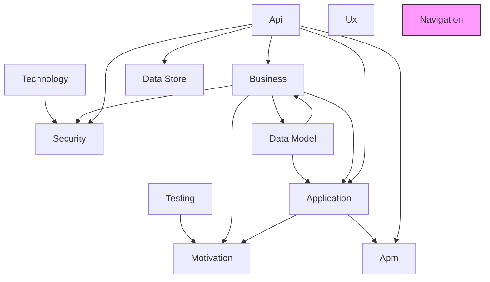

# Navigation Layer

## Report Index

- [Layer Introduction](#layer-introduction)
- [Intra-Layer Relationships](#intra-layer-relationships)
- [Inter-Layer Dependencies](#inter-layer-dependencies)
- [Inter-Layer Relationships Table](#inter-layer-relationships-table)
- [Node Reference](#node-reference)
  - [Breadcrumbconfig](#breadcrumbconfig)
  - [Breadcrumbmode](#breadcrumbmode)
  - [Contextscope](#contextscope)
  - [Contextvariable](#contextvariable)
  - [Datamapping](#datamapping)
  - [Flowanalytics](#flowanalytics)
  - [Flowstep](#flowstep)
  - [Guardaction](#guardaction)
  - [Guardactiontype](#guardactiontype)
  - [Guardcondition](#guardcondition)
  - [Guardtype](#guardtype)
  - [Httpmethod](#httpmethod)
  - [Navigationflow](#navigationflow)
  - [Navigationgraph](#navigationgraph)
  - [Navigationguard](#navigationguard)
  - [Navigationtransition](#navigationtransition)
  - [Navigationtrigger](#navigationtrigger)
  - [Notificationaction](#notificationaction)
  - [Notificationtype](#notificationtype)
  - [Processtracking](#processtracking)
  - [Route](#route)
  - [Routemeta](#routemeta)
  - [Routetype](#routetype)
  - [Storagetype](#storagetype)
  - [Truncationtype](#truncationtype)
  - [Waittype](#waittype)

## Layer Introduction

**Layer 10**: Navigation
**Standard**: [SPA Navigation Patterns](https://www.w3.org/TR/navigation-timing-2/)

Layer 10: Navigation Layer

### Statistics

| Metric                    | Count |
| ------------------------- | ----- |
| Node Types                | 26    |
| Intra-Layer Relationships | 0     |
| Inter-Layer Relationships | 0     |
| Inbound Relationships     | 0     |
| Outbound Relationships    | 0     |

### Layer Dependencies

**Depends On**: None
**Depended On By**: None

## Intra-Layer Relationships

No intra-layer relationships defined.

## Inter-Layer Dependencies

## Inter-Layer Relationships Table

No inter-layer relationships defined.

## Node Reference

### Breadcrumbconfig

**Spec Node ID**: `navigation.breadcrumbconfig`

Configuration for breadcrumb navigation display, specifying path generation rules, separator styles, truncation behavior, and home link settings. Provides users with location context and navigation history.

[Back to Index](#report-index)

### Breadcrumbmode

**Spec Node ID**: `navigation.breadcrumbmode`

BreadcrumbMode element in Navigation Layer

[Back to Index](#report-index)

### Contextscope

**Spec Node ID**: `navigation.contextscope`

ContextScope element in Navigation Layer

[Back to Index](#report-index)

### Contextvariable

**Spec Node ID**: `navigation.contextvariable`

Shared variable across flow steps (Gap #1: Cross-experience state)

[Back to Index](#report-index)

### Datamapping

**Spec Node ID**: `navigation.datamapping`

Maps data between flow context and experience (Gap #2: Data handoff)

[Back to Index](#report-index)

### Flowanalytics

**Spec Node ID**: `navigation.flowanalytics`

Analytics for funnel tracking (Gap #9: Funnel analytics)

[Back to Index](#report-index)

### Flowstep

**Spec Node ID**: `navigation.flowstep`

One step in a navigation flow

[Back to Index](#report-index)

### Guardaction

**Spec Node ID**: `navigation.guardaction`

Action when guard denies access

[Back to Index](#report-index)

### Guardactiontype

**Spec Node ID**: `navigation.guardactiontype`

GuardActionType element in Navigation Layer

[Back to Index](#report-index)

### Guardcondition

**Spec Node ID**: `navigation.guardcondition`

Condition expression for guard

[Back to Index](#report-index)

### Guardtype

**Spec Node ID**: `navigation.guardtype`

GuardType element in Navigation Layer

[Back to Index](#report-index)

### Httpmethod

**Spec Node ID**: `navigation.httpmethod`

HttpMethod element in Navigation Layer

[Back to Index](#report-index)

### Navigationflow

**Spec Node ID**: `navigation.navigationflow`

Sequence of routes that realizes a business process

[Back to Index](#report-index)

### Navigationgraph

**Spec Node ID**: `navigation.navigationgraph`

Complete navigation structure for application

[Back to Index](#report-index)

### Navigationguard

**Spec Node ID**: `navigation.navigationguard`

Guard condition for route access

[Back to Index](#report-index)

### Navigationtransition

**Spec Node ID**: `navigation.navigationtransition`

Transition from one route to another

[Back to Index](#report-index)

### Navigationtrigger

**Spec Node ID**: `navigation.navigationtrigger`

NavigationTrigger element in Navigation Layer

[Back to Index](#report-index)

### Notificationaction

**Spec Node ID**: `navigation.notificationaction`

Notification to send during flow step

[Back to Index](#report-index)

### Notificationtype

**Spec Node ID**: `navigation.notificationtype`

NotificationType element in Navigation Layer

[Back to Index](#report-index)

### Processtracking

**Spec Node ID**: `navigation.processtracking`

Tracks business process instance across flow (Gap #3: Process correlation)

[Back to Index](#report-index)

### Route

**Spec Node ID**: `navigation.route`

Single route/destination in the application (channel-agnostic)

[Back to Index](#report-index)

### Routemeta

**Spec Node ID**: `navigation.routemeta`

Route metadata

[Back to Index](#report-index)

### Routetype

**Spec Node ID**: `navigation.routetype`

RouteType element in Navigation Layer

[Back to Index](#report-index)

### Storagetype

**Spec Node ID**: `navigation.storagetype`

StorageType element in Navigation Layer

[Back to Index](#report-index)

### Truncationtype

**Spec Node ID**: `navigation.truncationtype`

TruncationType element in Navigation Layer

[Back to Index](#report-index)

### Waittype

**Spec Node ID**: `navigation.waittype`

WaitType element in Navigation Layer

[Back to Index](#report-index)

---

_Generated: 2026-02-11T21:39:52.918Z | Generator: generate-layer-reports.ts_
