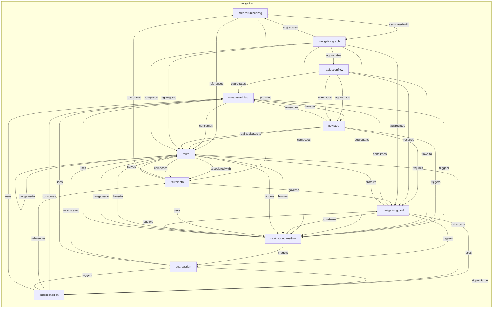
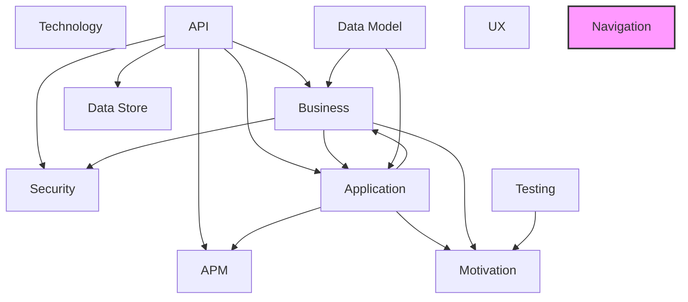

# Navigation Layer

## Report Index

- [Layer Introduction](#layer-introduction)
- [Intra-Layer Relationships](#intra-layer-relationships)
- [Inter-Layer Dependencies](#inter-layer-dependencies)
- [Inter-Layer Relationships Table](#inter-layer-relationships-table)
- [Node Reference](#node-reference)
  - [Breadcrumbconfig](#breadcrumbconfig)
  - [Contextvariable](#contextvariable)
  - [Flowstep](#flowstep)
  - [Guardaction](#guardaction)
  - [Guardcondition](#guardcondition)
  - [Navigationflow](#navigationflow)
  - [Navigationgraph](#navigationgraph)
  - [Navigationguard](#navigationguard)
  - [Navigationtransition](#navigationtransition)
  - [Route](#route)
  - [Routemeta](#routemeta)

## Layer Introduction

**Layer 10**: Navigation
**Standard**: [SPA Navigation Patterns](https://www.w3.org/TR/navigation-timing-2/)

Layer 10: Navigation Layer

### Statistics

| Metric                    | Count |
| ------------------------- | ----- |
| Node Types                | 11    |
| Intra-Layer Relationships | 51    |
| Inter-Layer Relationships | 0     |
| Inbound Relationships     | 0     |
| Outbound Relationships    | 0     |

### Layer Dependencies

**Depends On**: None

**Depended On By**: None

## Intra-Layer Relationships

## Inter-Layer Dependencies

## Inter-Layer Relationships Table

No inter-layer relationships defined.

## Node Reference

### Breadcrumbconfig {#breadcrumbconfig}

**Spec Node ID**: `navigation.breadcrumbconfig`

Configuration for breadcrumb navigation display, specifying path generation rules, separator styles, truncation behavior, and home link settings. Applied globally to define breadcrumb rendering for a navigation scope rather than attached per individual Route. Provides users with location context and navigation history.

#### Relationship Metrics

- **Intra-Layer**: Inbound: 2 | Outbound: 3
- **Inter-Layer**: Inbound: 0 | Outbound: 0

#### Intra-Layer Relationships

| Related Node                        | Predicate       | Direction | Cardinality |
| ----------------------------------- | --------------- | --------- | ----------- |
| [navigationgraph](#navigationgraph) | associated-with | outbound  | many-to-one |
| [routemeta](#routemeta)             | provides        | outbound  | many-to-one |
| [route](#route)                     | references      | outbound  | many-to-one |
| [navigationgraph](#navigationgraph) | aggregates      | inbound   | many-to-one |
| [routemeta](#routemeta)             | references      | inbound   | many-to-one |

[Back to Index](#report-index)

### Contextvariable {#contextvariable}

**Spec Node ID**: `navigation.contextvariable`

A typed variable shared across steps of a NavigationFlow, enabling state to persist and transfer between route transitions.

#### Relationship Metrics

- **Intra-Layer**: Inbound: 7 | Outbound: 3
- **Inter-Layer**: Inbound: 0 | Outbound: 0

#### Intra-Layer Relationships

| Related Node                                  | Predicate  | Direction | Cardinality |
| --------------------------------------------- | ---------- | --------- | ----------- |
| [route](#route)                               | consumes   | outbound  | many-to-one |
| [flowstep](#flowstep)                         | flows-to   | outbound  | many-to-one |
| [navigationtransition](#navigationtransition) | triggers   | outbound  | many-to-one |
| [flowstep](#flowstep)                         | consumes   | inbound   | many-to-one |
| [guardaction](#guardaction)                   | uses       | inbound   | many-to-one |
| [guardcondition](#guardcondition)             | consumes   | inbound   | many-to-one |
| [guardcondition](#guardcondition)             | uses       | inbound   | many-to-one |
| [navigationflow](#navigationflow)             | aggregates | inbound   | many-to-one |
| [navigationguard](#navigationguard)           | consumes   | inbound   | many-to-one |
| [navigationtransition](#navigationtransition) | uses       | inbound   | many-to-one |

[Back to Index](#report-index)

### Flowstep {#flowstep}

**Spec Node ID**: `navigation.flowstep`

One step in a navigation flow

#### Relationship Metrics

- **Intra-Layer**: Inbound: 3 | Outbound: 5
- **Inter-Layer**: Inbound: 0 | Outbound: 0

#### Intra-Layer Relationships

| Related Node                                  | Predicate    | Direction | Cardinality |
| --------------------------------------------- | ------------ | --------- | ----------- |
| [contextvariable](#contextvariable)           | flows-to     | inbound   | many-to-one |
| [contextvariable](#contextvariable)           | consumes     | outbound  | many-to-one |
| [route](#route)                               | navigates-to | outbound  | many-to-one |
| [route](#route)                               | realizes     | outbound  | many-to-one |
| [navigationguard](#navigationguard)           | requires     | outbound  | many-to-one |
| [navigationtransition](#navigationtransition) | triggers     | outbound  | many-to-one |
| [navigationflow](#navigationflow)             | aggregates   | inbound   | many-to-one |
| [navigationflow](#navigationflow)             | composes     | inbound   | many-to-one |

[Back to Index](#report-index)

### Guardaction {#guardaction}

**Spec Node ID**: `navigation.guardaction`

Defines the response executed by a NavigationGuard when its condition evaluates to false (access denied). Specifies whether to redirect the user, block navigation in place, notify with a message, or prompt for confirmation — along with the target destination and whether to preserve the attempted route for post-authentication redirect.

#### Relationship Metrics

- **Intra-Layer**: Inbound: 3 | Outbound: 3
- **Inter-Layer**: Inbound: 0 | Outbound: 0

#### Intra-Layer Relationships

| Related Node                                  | Predicate    | Direction | Cardinality |
| --------------------------------------------- | ------------ | --------- | ----------- |
| [guardcondition](#guardcondition)             | depends-on   | outbound  | many-to-one |
| [route](#route)                               | navigates-to | outbound  | many-to-one |
| [contextvariable](#contextvariable)           | uses         | outbound  | many-to-one |
| [guardcondition](#guardcondition)             | triggers     | inbound   | many-to-one |
| [navigationguard](#navigationguard)           | triggers     | inbound   | many-to-one |
| [navigationtransition](#navigationtransition) | triggers     | inbound   | many-to-one |

[Back to Index](#report-index)

### Guardcondition {#guardcondition}

**Spec Node ID**: `navigation.guardcondition`

Boolean predicate evaluated by a NavigationGuard to determine whether route access should be permitted. Expressions may reference user session state, roles, or feature flags. Async conditions (e.g., token validation API calls) are supported with a configurable timeout; on timeout, the condition fails closed (access denied) to preserve security.

#### Relationship Metrics

- **Intra-Layer**: Inbound: 2 | Outbound: 5
- **Inter-Layer**: Inbound: 0 | Outbound: 0

#### Intra-Layer Relationships

| Related Node                        | Predicate  | Direction | Cardinality |
| ----------------------------------- | ---------- | --------- | ----------- |
| [guardaction](#guardaction)         | depends-on | inbound   | many-to-one |
| [route](#route)                     | constrains | outbound  | many-to-one |
| [contextvariable](#contextvariable) | consumes   | outbound  | many-to-one |
| [routemeta](#routemeta)             | references | outbound  | many-to-one |
| [guardaction](#guardaction)         | triggers   | outbound  | many-to-one |
| [contextvariable](#contextvariable) | uses       | outbound  | many-to-one |
| [navigationguard](#navigationguard) | uses       | inbound   | many-to-one |

[Back to Index](#report-index)

### Navigationflow {#navigationflow}

**Spec Node ID**: `navigation.navigationflow`

Sequence of routes that realizes a business process

#### Relationship Metrics

- **Intra-Layer**: Inbound: 1 | Outbound: 5
- **Inter-Layer**: Inbound: 0 | Outbound: 0

#### Intra-Layer Relationships

| Related Node                                  | Predicate  | Direction | Cardinality |
| --------------------------------------------- | ---------- | --------- | ----------- |
| [contextvariable](#contextvariable)           | aggregates | outbound  | many-to-one |
| [flowstep](#flowstep)                         | aggregates | outbound  | many-to-one |
| [flowstep](#flowstep)                         | composes   | outbound  | many-to-one |
| [navigationtransition](#navigationtransition) | flows-to   | outbound  | many-to-one |
| [navigationguard](#navigationguard)           | requires   | outbound  | many-to-one |
| [navigationgraph](#navigationgraph)           | aggregates | inbound   | many-to-one |

[Back to Index](#report-index)

### Navigationgraph {#navigationgraph}

**Spec Node ID**: `navigation.navigationgraph`

Root container for an application's complete routing structure, composing all Route, NavigationTransition, and NavigationGuard nodes into a unified navigation model.

#### Relationship Metrics

- **Intra-Layer**: Inbound: 1 | Outbound: 7
- **Inter-Layer**: Inbound: 0 | Outbound: 0

#### Intra-Layer Relationships

| Related Node                                  | Predicate       | Direction | Cardinality |
| --------------------------------------------- | --------------- | --------- | ----------- |
| [breadcrumbconfig](#breadcrumbconfig)         | associated-with | inbound   | many-to-one |
| [breadcrumbconfig](#breadcrumbconfig)         | aggregates      | outbound  | many-to-one |
| [navigationflow](#navigationflow)             | aggregates      | outbound  | many-to-one |
| [navigationguard](#navigationguard)           | aggregates      | outbound  | many-to-one |
| [navigationtransition](#navigationtransition) | aggregates      | outbound  | many-to-one |
| [route](#route)                               | aggregates      | outbound  | many-to-one |
| [navigationtransition](#navigationtransition) | composes        | outbound  | many-to-one |
| [route](#route)                               | composes        | outbound  | many-to-one |

[Back to Index](#report-index)

### Navigationguard {#navigationguard}

**Spec Node ID**: `navigation.navigationguard`

Guard condition for route access

#### Relationship Metrics

- **Intra-Layer**: Inbound: 5 | Outbound: 5
- **Inter-Layer**: Inbound: 0 | Outbound: 0

#### Intra-Layer Relationships

| Related Node                                  | Predicate  | Direction | Cardinality |
| --------------------------------------------- | ---------- | --------- | ----------- |
| [flowstep](#flowstep)                         | requires   | inbound   | many-to-one |
| [navigationflow](#navigationflow)             | requires   | inbound   | many-to-one |
| [navigationgraph](#navigationgraph)           | aggregates | inbound   | many-to-one |
| [navigationtransition](#navigationtransition) | constrains | outbound  | many-to-one |
| [contextvariable](#contextvariable)           | consumes   | outbound  | many-to-one |
| [route](#route)                               | protects   | outbound  | many-to-one |
| [guardaction](#guardaction)                   | triggers   | outbound  | many-to-one |
| [guardcondition](#guardcondition)             | uses       | outbound  | many-to-one |
| [navigationtransition](#navigationtransition) | requires   | inbound   | many-to-one |
| [routemeta](#routemeta)                       | governs    | inbound   | many-to-one |

[Back to Index](#report-index)

### Navigationtransition {#navigationtransition}

**Spec Node ID**: `navigation.navigationtransition`

Transition from one route to another

#### Relationship Metrics

- **Intra-Layer**: Inbound: 9 | Outbound: 5
- **Inter-Layer**: Inbound: 0 | Outbound: 0

#### Intra-Layer Relationships

| Related Node                        | Predicate    | Direction | Cardinality |
| ----------------------------------- | ------------ | --------- | ----------- |
| [contextvariable](#contextvariable) | triggers     | inbound   | many-to-one |
| [flowstep](#flowstep)               | triggers     | inbound   | many-to-one |
| [navigationflow](#navigationflow)   | flows-to     | inbound   | many-to-one |
| [navigationgraph](#navigationgraph) | aggregates   | inbound   | many-to-one |
| [navigationgraph](#navigationgraph) | composes     | inbound   | many-to-one |
| [navigationguard](#navigationguard) | constrains   | inbound   | many-to-one |
| [route](#route)                     | flows-to     | outbound  | many-to-one |
| [route](#route)                     | navigates-to | outbound  | many-to-one |
| [navigationguard](#navigationguard) | requires     | outbound  | many-to-one |
| [guardaction](#guardaction)         | triggers     | outbound  | many-to-one |
| [contextvariable](#contextvariable) | uses         | outbound  | many-to-one |
| [route](#route)                     | flows-to     | inbound   | many-to-one |
| [route](#route)                     | triggers     | inbound   | many-to-one |
| [routemeta](#routemeta)             | uses         | inbound   | many-to-one |

[Back to Index](#report-index)

### Route {#route}

**Spec Node ID**: `navigation.route`

Single route/destination in the application (channel-agnostic)

#### Relationship Metrics

- **Intra-Layer**: Inbound: 14 | Outbound: 6
- **Inter-Layer**: Inbound: 0 | Outbound: 0

#### Intra-Layer Relationships

| Related Node                                  | Predicate       | Direction | Cardinality |
| --------------------------------------------- | --------------- | --------- | ----------- |
| [breadcrumbconfig](#breadcrumbconfig)         | references      | inbound   | many-to-one |
| [contextvariable](#contextvariable)           | consumes        | inbound   | many-to-one |
| [flowstep](#flowstep)                         | navigates-to    | inbound   | many-to-one |
| [flowstep](#flowstep)                         | realizes        | inbound   | many-to-one |
| [guardaction](#guardaction)                   | navigates-to    | inbound   | many-to-one |
| [guardcondition](#guardcondition)             | constrains      | inbound   | many-to-one |
| [navigationgraph](#navigationgraph)           | aggregates      | inbound   | many-to-one |
| [navigationgraph](#navigationgraph)           | composes        | inbound   | many-to-one |
| [navigationguard](#navigationguard)           | protects        | inbound   | many-to-one |
| [navigationtransition](#navigationtransition) | flows-to        | inbound   | many-to-one |
| [navigationtransition](#navigationtransition) | navigates-to    | inbound   | many-to-one |
| [route](#route)                               | aggregates      | outbound  | many-to-one |
| [routemeta](#routemeta)                       | associated-with | outbound  | many-to-one |
| [routemeta](#routemeta)                       | composes        | outbound  | many-to-one |
| [navigationtransition](#navigationtransition) | flows-to        | outbound  | many-to-one |
| [route](#route)                               | navigates-to    | outbound  | many-to-one |
| [navigationtransition](#navigationtransition) | triggers        | outbound  | many-to-one |
| [routemeta](#routemeta)                       | serves          | inbound   | many-to-one |

[Back to Index](#report-index)

### Routemeta {#routemeta}

**Spec Node ID**: `navigation.routemeta`

Per-route rendering and access configuration attached to a Route node and consumed by the SPA router at runtime. Covers layout selection, component instance caching, animation transitions, breadcrumb labeling, and access control hints. Security attributes (requiresAuth, roles, permissions) are navigation hints that should be enforced through NavigationGuard nodes in the security layer.

#### Relationship Metrics

- **Intra-Layer**: Inbound: 4 | Outbound: 4
- **Inter-Layer**: Inbound: 0 | Outbound: 0

#### Intra-Layer Relationships

| Related Node                                  | Predicate       | Direction | Cardinality |
| --------------------------------------------- | --------------- | --------- | ----------- |
| [breadcrumbconfig](#breadcrumbconfig)         | provides        | inbound   | many-to-one |
| [guardcondition](#guardcondition)             | references      | inbound   | many-to-one |
| [route](#route)                               | associated-with | inbound   | many-to-one |
| [route](#route)                               | composes        | inbound   | many-to-one |
| [navigationguard](#navigationguard)           | governs         | outbound  | many-to-one |
| [breadcrumbconfig](#breadcrumbconfig)         | references      | outbound  | many-to-one |
| [route](#route)                               | serves          | outbound  | many-to-one |
| [navigationtransition](#navigationtransition) | uses            | outbound  | many-to-one |

[Back to Index](#report-index)

---

_Generated: 2026-02-28T10:53:05.787Z | Spec Version: 0.8.0 | Generator: generate-layer-reports.ts_
