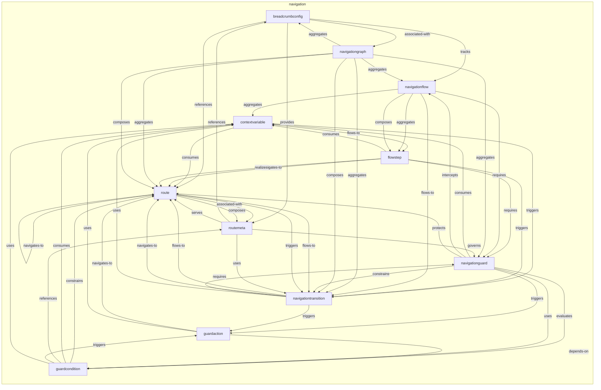
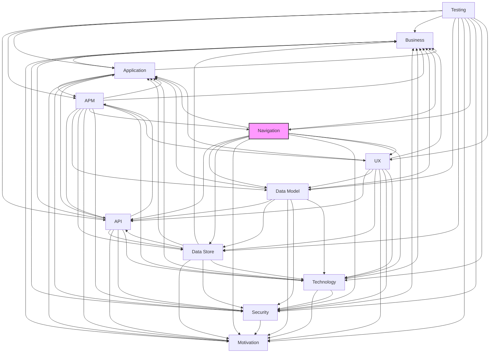

# Navigation Layer

## Report Index

- [Layer Introduction](#layer-introduction)
- [Intra-Layer Relationships](#intra-layer-relationships)
- [Inter-Layer Dependencies](#inter-layer-dependencies)
- [Inter-Layer Relationships Table](#inter-layer-relationships-table)
- [Node Reference](#node-reference)
  - [Breadcrumbconfig](#breadcrumbconfig)
  - [Contextvariable](#contextvariable)
  - [Flowstep](#flowstep)
  - [Guardaction](#guardaction)
  - [Guardcondition](#guardcondition)
  - [Navigationflow](#navigationflow)
  - [Navigationgraph](#navigationgraph)
  - [Navigationguard](#navigationguard)
  - [Navigationtransition](#navigationtransition)
  - [Route](#route)
  - [Routemeta](#routemeta)

## Layer Introduction

**Layer 10**: Navigation
**Standard**: [SPA Navigation Patterns](https://www.w3.org/TR/navigation-timing-2/)

Layer 10: Navigation Layer

### Statistics

| Metric                    | Count |
| ------------------------- | ----- |
| Node Types                | 11    |
| Intra-Layer Relationships | 54    |
| Inter-Layer Relationships | 82    |
| Inbound Relationships     | 14    |
| Outbound Relationships    | 68    |

### Layer Dependencies

**Depends On**: [APM](./11-apm-layer-report.md), [Testing](./12-testing-layer-report.md)

**Depended On By**: [Motivation](./01-motivation-layer-report.md), [Business](./02-business-layer-report.md), [Security](./03-security-layer-report.md), [Application](./04-application-layer-report.md), [Technology](./05-technology-layer-report.md), [API](./06-api-layer-report.md), [Data Model](./07-data-model-layer-report.md), [Data Store](./08-data-store-layer-report.md), [UX](./09-ux-layer-report.md)

## Intra-Layer Relationships

```mermaid
flowchart LR
  subgraph navigation
    breadcrumbconfig["breadcrumbconfig"]
    contextvariable["contextvariable"]
    flowstep["flowstep"]
    guardaction["guardaction"]
    guardcondition["guardcondition"]
    navigationflow["navigationflow"]
    navigationgraph["navigationgraph"]
    navigationguard["navigationguard"]
    navigationtransition["navigationtransition"]
    route["route"]
    routemeta["routemeta"]
    breadcrumbconfig -->|associated-with| navigationgraph
    breadcrumbconfig -->|provides| routemeta
    breadcrumbconfig -->|references| route
    breadcrumbconfig -->|tracks| navigationflow
    contextvariable -->|consumes| route
    contextvariable -->|flows-to| flowstep
    contextvariable -->|triggers| navigationtransition
    flowstep -->|consumes| contextvariable
    flowstep -->|navigates-to| route
    flowstep -->|realizes| route
    flowstep -->|requires| navigationguard
    flowstep -->|triggers| navigationtransition
    guardaction -->|depends-on| guardcondition
    guardaction -->|navigates-to| route
    guardaction -->|uses| contextvariable
    guardcondition -->|constrains| route
    guardcondition -->|consumes| contextvariable
    guardcondition -->|references| routemeta
    guardcondition -->|triggers| guardaction
    guardcondition -->|uses| contextvariable
    navigationflow -->|aggregates| contextvariable
    navigationflow -->|aggregates| flowstep
    navigationflow -->|composes| flowstep
    navigationflow -->|flows-to| navigationtransition
    navigationflow -->|requires| navigationguard
    navigationgraph -->|aggregates| breadcrumbconfig
    navigationgraph -->|aggregates| navigationflow
    navigationgraph -->|aggregates| navigationguard
    navigationgraph -->|aggregates| navigationtransition
    navigationgraph -->|aggregates| route
    navigationgraph -->|composes| navigationtransition
    navigationgraph -->|composes| route
    navigationguard -->|constrains| navigationtransition
    navigationguard -->|consumes| contextvariable
    navigationguard -->|evaluates| guardcondition
    navigationguard -->|intercepts| navigationflow
    navigationguard -->|protects| route
    navigationguard -->|triggers| guardaction
    navigationguard -->|uses| guardcondition
    navigationtransition -->|flows-to| route
    navigationtransition -->|navigates-to| route
    navigationtransition -->|requires| navigationguard
    navigationtransition -->|triggers| guardaction
    navigationtransition -->|uses| contextvariable
    route -->|aggregates| route
    route -->|associated-with| routemeta
    route -->|composes| routemeta
    route -->|flows-to| navigationtransition
    route -->|navigates-to| route
    route -->|triggers| navigationtransition
    routemeta -->|governs| navigationguard
    routemeta -->|references| breadcrumbconfig
    routemeta -->|serves| route
    routemeta -->|uses| navigationtransition
  end
```

## Inter-Layer Dependencies

```mermaid
flowchart TB
  classDef current fill:#f9f,stroke:#333,stroke-width:2px
  motivation["Motivation"]
  business["Business"]
  security["Security"]
  application["Application"]
  technology["Technology"]
  api["API"]
  data_model["Data Model"]
  data_store["Data Store"]
  ux["UX"]
  navigation["Navigation"]
  apm["APM"]
  testing["Testing"]
  api --> apm
  api --> application
  api --> business
  api --> data_store
  api --> motivation
  api --> security
  api --> technology
  apm --> api
  apm --> application
  apm --> business
  apm --> data_model
  apm --> data_store
  apm --> motivation
  apm --> navigation
  apm --> security
  apm --> technology
  apm --> ux
  application --> apm
  application --> business
  application --> motivation
  application --> security
  business --> application
  business --> motivation
  business --> security
  data_model --> api
  data_model --> application
  data_model --> business
  data_model --> data_store
  data_model --> motivation
  data_model --> security
  data_model --> technology
  data_store --> api
  data_store --> application
  data_store --> business
  data_store --> motivation
  data_store --> security
  data_store --> technology
  navigation --> api
  navigation --> application
  navigation --> business
  navigation --> data_model
  navigation --> data_store
  navigation --> motivation
  navigation --> security
  navigation --> technology
  navigation --> ux
  security --> business
  security --> motivation
  technology --> application
  technology --> business
  technology --> motivation
  technology --> security
  testing --> api
  testing --> apm
  testing --> application
  testing --> business
  testing --> data_model
  testing --> data_store
  testing --> motivation
  testing --> navigation
  testing --> security
  testing --> technology
  testing --> ux
  ux --> api
  ux --> application
  ux --> business
  ux --> data_model
  ux --> data_store
  ux --> motivation
  ux --> security
  ux --> technology
  class navigation current
```

## Inter-Layer Relationships Table

| Relationship ID                                                   | Source Node                                                                  | Dest Node                                                                     | Dest Layer                                      | Predicate     | Cardinality  | Strength |
| ----------------------------------------------------------------- | ---------------------------------------------------------------------------- | ----------------------------------------------------------------------------- | ----------------------------------------------- | ------------- | ------------ | -------- |
| apm.instrumentationconfig.monitors.navigation.route               | [Instrumentationconfig](./11-apm-layer-report.md#instrumentationconfig)      | [Route](./10-navigation-layer-report.md#route)                                | [Navigation](./10-navigation-layer-report.md)   | monitors      | many-to-many | medium   |
| apm.logrecord.references.navigation.route                         | [Logrecord](./11-apm-layer-report.md#logrecord)                              | [Route](./10-navigation-layer-report.md#route)                                | [Navigation](./10-navigation-layer-report.md)   | references    | many-to-many | medium   |
| apm.metricinstrument.monitors.navigation.navigationtransition     | [Metricinstrument](./11-apm-layer-report.md#metricinstrument)                | [Navigationtransition](./10-navigation-layer-report.md#navigationtransition)  | [Navigation](./10-navigation-layer-report.md)   | monitors      | many-to-many | medium   |
| apm.metricinstrument.monitors.navigation.route                    | [Metricinstrument](./11-apm-layer-report.md#metricinstrument)                | [Route](./10-navigation-layer-report.md#route)                                | [Navigation](./10-navigation-layer-report.md)   | monitors      | many-to-many | medium   |
| apm.span.monitors.navigation.navigationflow                       | [Span](./11-apm-layer-report.md#span)                                        | [Navigationflow](./10-navigation-layer-report.md#navigationflow)              | [Navigation](./10-navigation-layer-report.md)   | monitors      | many-to-many | medium   |
| apm.span.monitors.navigation.navigationguard                      | [Span](./11-apm-layer-report.md#span)                                        | [Navigationguard](./10-navigation-layer-report.md#navigationguard)            | [Navigation](./10-navigation-layer-report.md)   | monitors      | many-to-many | medium   |
| apm.span.monitors.navigation.route                                | [Span](./11-apm-layer-report.md#span)                                        | [Route](./10-navigation-layer-report.md#route)                                | [Navigation](./10-navigation-layer-report.md)   | monitors      | many-to-many | medium   |
| apm.traceconfiguration.monitors.navigation.route                  | [Traceconfiguration](./11-apm-layer-report.md#traceconfiguration)            | [Route](./10-navigation-layer-report.md#route)                                | [Navigation](./10-navigation-layer-report.md)   | monitors      | many-to-many | medium   |
| navigation.contextvariable.maps-to.api.parameter                  | [Contextvariable](./10-navigation-layer-report.md#contextvariable)           | [Parameter](./06-api-layer-report.md#parameter)                               | [API](./06-api-layer-report.md)                 | maps-to       | many-to-many | medium   |
| navigation.contextvariable.maps-to.data-model.schemaproperty      | [Contextvariable](./10-navigation-layer-report.md#contextvariable)           | [Schemaproperty](./07-data-model-layer-report.md#schemaproperty)              | [Data Model](./07-data-model-layer-report.md)   | maps-to       | many-to-many | medium   |
| navigation.contextvariable.references.application.dataobject      | [Contextvariable](./10-navigation-layer-report.md#contextvariable)           | [Dataobject](./04-application-layer-report.md#dataobject)                     | [Application](./04-application-layer-report.md) | references    | many-to-many | medium   |
| navigation.contextvariable.references.data-model.jsonschema       | [Contextvariable](./10-navigation-layer-report.md#contextvariable)           | [Jsonschema](./07-data-model-layer-report.md#jsonschema)                      | [Data Model](./07-data-model-layer-report.md)   | references    | many-to-many | medium   |
| navigation.flowstep.accesses.api.operation                        | [Flowstep](./10-navigation-layer-report.md#flowstep)                         | [Operation](./06-api-layer-report.md#operation)                               | [API](./06-api-layer-report.md)                 | accesses      | many-to-many | medium   |
| navigation.flowstep.accesses.application.applicationservice       | [Flowstep](./10-navigation-layer-report.md#flowstep)                         | [Applicationservice](./04-application-layer-report.md#applicationservice)     | [Application](./04-application-layer-report.md) | accesses      | many-to-many | medium   |
| navigation.flowstep.accesses.data-model.objectschema              | [Flowstep](./10-navigation-layer-report.md#flowstep)                         | [Objectschema](./07-data-model-layer-report.md#objectschema)                  | [Data Model](./07-data-model-layer-report.md)   | accesses      | many-to-many | medium   |
| navigation.flowstep.accesses.data-store.collection                | [Flowstep](./10-navigation-layer-report.md#flowstep)                         | [Collection](./08-data-store-layer-report.md#collection)                      | [Data Store](./08-data-store-layer-report.md)   | accesses      | many-to-many | medium   |
| navigation.flowstep.maps-to.ux.view                               | [Flowstep](./10-navigation-layer-report.md#flowstep)                         | [View](./09-ux-layer-report.md#view)                                          | [UX](./09-ux-layer-report.md)                   | maps-to       | many-to-many | medium   |
| navigation.flowstep.realizes.business.businessfunction            | [Flowstep](./10-navigation-layer-report.md#flowstep)                         | [Businessfunction](./02-business-layer-report.md#businessfunction)            | [Business](./02-business-layer-report.md)       | realizes      | many-to-many | medium   |
| navigation.flowstep.satisfies.motivation.requirement              | [Flowstep](./10-navigation-layer-report.md#flowstep)                         | [Requirement](./01-motivation-layer-report.md#requirement)                    | [Motivation](./01-motivation-layer-report.md)   | satisfies     | many-to-many | medium   |
| navigation.guardcondition.references.data-model.objectschema      | [Guardcondition](./10-navigation-layer-report.md#guardcondition)             | [Objectschema](./07-data-model-layer-report.md#objectschema)                  | [Data Model](./07-data-model-layer-report.md)   | references    | many-to-many | medium   |
| navigation.guardcondition.references.security.permission          | [Guardcondition](./10-navigation-layer-report.md#guardcondition)             | [Permission](./03-security-layer-report.md#permission)                        | [Security](./03-security-layer-report.md)       | references    | many-to-many | medium   |
| navigation.navigationflow.accesses.data-model.objectschema        | [Navigationflow](./10-navigation-layer-report.md#navigationflow)             | [Objectschema](./07-data-model-layer-report.md#objectschema)                  | [Data Model](./07-data-model-layer-report.md)   | accesses      | many-to-many | medium   |
| navigation.navigationflow.accesses.data-store.collection          | [Navigationflow](./10-navigation-layer-report.md#navigationflow)             | [Collection](./08-data-store-layer-report.md#collection)                      | [Data Store](./08-data-store-layer-report.md)   | accesses      | many-to-many | medium   |
| navigation.navigationflow.accesses.ux.view                        | [Navigationflow](./10-navigation-layer-report.md#navigationflow)             | [View](./09-ux-layer-report.md#view)                                          | [UX](./09-ux-layer-report.md)                   | accesses      | many-to-many | medium   |
| navigation.navigationflow.realizes.application.applicationprocess | [Navigationflow](./10-navigation-layer-report.md#navigationflow)             | [Applicationprocess](./04-application-layer-report.md#applicationprocess)     | [Application](./04-application-layer-report.md) | realizes      | many-to-many | medium   |
| navigation.navigationflow.realizes.business.businessprocess       | [Navigationflow](./10-navigation-layer-report.md#navigationflow)             | [Businessprocess](./02-business-layer-report.md#businessprocess)              | [Business](./02-business-layer-report.md)       | realizes      | many-to-many | medium   |
| navigation.navigationflow.realizes.motivation.goal                | [Navigationflow](./10-navigation-layer-report.md#navigationflow)             | [Goal](./01-motivation-layer-report.md#goal)                                  | [Motivation](./01-motivation-layer-report.md)   | realizes      | many-to-many | medium   |
| navigation.navigationflow.satisfies.motivation.requirement        | [Navigationflow](./10-navigation-layer-report.md#navigationflow)             | [Requirement](./01-motivation-layer-report.md#requirement)                    | [Motivation](./01-motivation-layer-report.md)   | satisfies     | many-to-many | medium   |
| navigation.navigationflow.satisfies.security.securityconstraints  | [Navigationflow](./10-navigation-layer-report.md#navigationflow)             | [Securityconstraints](./03-security-layer-report.md#securityconstraints)      | [Security](./03-security-layer-report.md)       | satisfies     | many-to-many | medium   |
| navigation.navigationflow.serves.business.businessservice         | [Navigationflow](./10-navigation-layer-report.md#navigationflow)             | [Businessservice](./02-business-layer-report.md#businessservice)              | [Business](./02-business-layer-report.md)       | serves        | many-to-many | medium   |
| navigation.navigationflow.triggers.application.applicationevent   | [Navigationflow](./10-navigation-layer-report.md#navigationflow)             | [Applicationevent](./04-application-layer-report.md#applicationevent)         | [Application](./04-application-layer-report.md) | triggers      | many-to-many | medium   |
| navigation.navigationflow.triggers.business.businessprocess       | [Navigationflow](./10-navigation-layer-report.md#navigationflow)             | [Businessprocess](./02-business-layer-report.md#businessprocess)              | [Business](./02-business-layer-report.md)       | triggers      | many-to-many | medium   |
| navigation.navigationflow.uses.technology.systemsoftware          | [Navigationflow](./10-navigation-layer-report.md#navigationflow)             | [Systemsoftware](./05-technology-layer-report.md#systemsoftware)              | [Technology](./05-technology-layer-report.md)   | uses          | many-to-many | medium   |
| navigation.navigationgraph.uses.technology.systemsoftware         | [Navigationgraph](./10-navigation-layer-report.md#navigationgraph)           | [Systemsoftware](./05-technology-layer-report.md#systemsoftware)              | [Technology](./05-technology-layer-report.md)   | uses          | many-to-many | medium   |
| navigation.navigationguard.accesses.api.operation                 | [Navigationguard](./10-navigation-layer-report.md#navigationguard)           | [Operation](./06-api-layer-report.md#operation)                               | [API](./06-api-layer-report.md)                 | accesses      | many-to-many | medium   |
| navigation.navigationguard.accesses.data-store.collection         | [Navigationguard](./10-navigation-layer-report.md#navigationguard)           | [Collection](./08-data-store-layer-report.md#collection)                      | [Data Store](./08-data-store-layer-report.md)   | accesses      | many-to-many | medium   |
| navigation.navigationguard.implements.security.securitypolicy     | [Navigationguard](./10-navigation-layer-report.md#navigationguard)           | [Securitypolicy](./03-security-layer-report.md#securitypolicy)                | [Security](./03-security-layer-report.md)       | implements    | many-to-many | medium   |
| navigation.navigationguard.realizes.motivation.principle          | [Navigationguard](./10-navigation-layer-report.md#navigationguard)           | [Principle](./01-motivation-layer-report.md#principle)                        | [Motivation](./01-motivation-layer-report.md)   | realizes      | many-to-many | medium   |
| navigation.navigationguard.references.business.businessrole       | [Navigationguard](./10-navigation-layer-report.md#navigationguard)           | [Businessrole](./02-business-layer-report.md#businessrole)                    | [Business](./02-business-layer-report.md)       | references    | many-to-many | medium   |
| navigation.navigationguard.requires.security.role                 | [Navigationguard](./10-navigation-layer-report.md#navigationguard)           | [Role](./03-security-layer-report.md#role)                                    | [Security](./03-security-layer-report.md)       | requires      | many-to-many | medium   |
| navigation.navigationguard.satisfies.motivation.constraint        | [Navigationguard](./10-navigation-layer-report.md#navigationguard)           | [Constraint](./01-motivation-layer-report.md#constraint)                      | [Motivation](./01-motivation-layer-report.md)   | satisfies     | many-to-many | medium   |
| navigation.navigationguard.triggers.ux.experiencestate            | [Navigationguard](./10-navigation-layer-report.md#navigationguard)           | [Experiencestate](./09-ux-layer-report.md#experiencestate)                    | [UX](./09-ux-layer-report.md)                   | triggers      | many-to-many | medium   |
| navigation.navigationguard.uses.api.securityscheme                | [Navigationguard](./10-navigation-layer-report.md#navigationguard)           | [Securityscheme](./06-api-layer-report.md#securityscheme)                     | [API](./06-api-layer-report.md)                 | uses          | many-to-many | medium   |
| navigation.navigationguard.uses.application.applicationservice    | [Navigationguard](./10-navigation-layer-report.md#navigationguard)           | [Applicationservice](./04-application-layer-report.md#applicationservice)     | [Application](./04-application-layer-report.md) | uses          | many-to-many | medium   |
| navigation.navigationguard.uses.data-model.objectschema           | [Navigationguard](./10-navigation-layer-report.md#navigationguard)           | [Objectschema](./07-data-model-layer-report.md#objectschema)                  | [Data Model](./07-data-model-layer-report.md)   | uses          | many-to-many | medium   |
| navigation.navigationguard.uses.technology.systemsoftware         | [Navigationguard](./10-navigation-layer-report.md#navigationguard)           | [Systemsoftware](./05-technology-layer-report.md#systemsoftware)              | [Technology](./05-technology-layer-report.md)   | uses          | many-to-many | medium   |
| navigation.navigationtransition.triggers.ux.statetransition       | [Navigationtransition](./10-navigation-layer-report.md#navigationtransition) | [Statetransition](./09-ux-layer-report.md#statetransition)                    | [UX](./09-ux-layer-report.md)                   | triggers      | many-to-many | medium   |
| navigation.route.accesses.api.operation                           | [Route](./10-navigation-layer-report.md#route)                               | [Operation](./06-api-layer-report.md#operation)                               | [API](./06-api-layer-report.md)                 | accesses      | many-to-many | medium   |
| navigation.route.accesses.application.applicationinterface        | [Route](./10-navigation-layer-report.md#route)                               | [Applicationinterface](./04-application-layer-report.md#applicationinterface) | [Application](./04-application-layer-report.md) | accesses      | many-to-many | medium   |
| navigation.route.accesses.data-model.objectschema                 | [Route](./10-navigation-layer-report.md#route)                               | [Objectschema](./07-data-model-layer-report.md#objectschema)                  | [Data Model](./07-data-model-layer-report.md)   | accesses      | many-to-many | medium   |
| navigation.route.accesses.data-store.collection                   | [Route](./10-navigation-layer-report.md#route)                               | [Collection](./08-data-store-layer-report.md#collection)                      | [Data Store](./08-data-store-layer-report.md)   | accesses      | many-to-many | medium   |
| navigation.route.accesses.security.secureresource                 | [Route](./10-navigation-layer-report.md#route)                               | [Secureresource](./03-security-layer-report.md#secureresource)                | [Security](./03-security-layer-report.md)       | accesses      | many-to-many | medium   |
| navigation.route.depends-on.application.applicationcomponent      | [Route](./10-navigation-layer-report.md#route)                               | [Applicationcomponent](./04-application-layer-report.md#applicationcomponent) | [Application](./04-application-layer-report.md) | depends-on    | many-to-many | medium   |
| navigation.route.depends-on.data-store.accesspattern              | [Route](./10-navigation-layer-report.md#route)                               | [Accesspattern](./08-data-store-layer-report.md#accesspattern)                | [Data Store](./08-data-store-layer-report.md)   | depends-on    | many-to-many | medium   |
| navigation.route.depends-on.technology.technologyservice          | [Route](./10-navigation-layer-report.md#route)                               | [Technologyservice](./05-technology-layer-report.md#technologyservice)        | [Technology](./05-technology-layer-report.md)   | depends-on    | many-to-many | medium   |
| navigation.route.lazy-loads.application.applicationcomponent      | [Route](./10-navigation-layer-report.md#route)                               | [Applicationcomponent](./04-application-layer-report.md#applicationcomponent) | [Application](./04-application-layer-report.md) | lazy-loads    | many-to-many | medium   |
| navigation.route.maps-to.api.pathitem                             | [Route](./10-navigation-layer-report.md#route)                               | [Pathitem](./06-api-layer-report.md#pathitem)                                 | [API](./06-api-layer-report.md)                 | maps-to       | many-to-many | medium   |
| navigation.route.maps-to.business.businessfunction                | [Route](./10-navigation-layer-report.md#route)                               | [Businessfunction](./02-business-layer-report.md#businessfunction)            | [Business](./02-business-layer-report.md)       | maps-to       | many-to-many | medium   |
| navigation.route.maps-to.ux.view                                  | [Route](./10-navigation-layer-report.md#route)                               | [View](./09-ux-layer-report.md#view)                                          | [UX](./09-ux-layer-report.md)                   | maps-to       | many-to-many | medium   |
| navigation.route.realizes.business.businessprocess                | [Route](./10-navigation-layer-report.md#route)                               | [Businessprocess](./02-business-layer-report.md#businessprocess)              | [Business](./02-business-layer-report.md)       | realizes      | many-to-many | medium   |
| navigation.route.realizes.motivation.outcome                      | [Route](./10-navigation-layer-report.md#route)                               | [Outcome](./01-motivation-layer-report.md#outcome)                            | [Motivation](./01-motivation-layer-report.md)   | realizes      | many-to-many | medium   |
| navigation.route.references.data-model.schemadefinition           | [Route](./10-navigation-layer-report.md#route)                               | [Schemadefinition](./07-data-model-layer-report.md#schemadefinition)          | [Data Model](./07-data-model-layer-report.md)   | references    | many-to-many | medium   |
| navigation.route.requires.api.securityscheme                      | [Route](./10-navigation-layer-report.md#route)                               | [Securityscheme](./06-api-layer-report.md#securityscheme)                     | [API](./06-api-layer-report.md)                 | requires      | many-to-many | medium   |
| navigation.route.requires.security.permission                     | [Route](./10-navigation-layer-report.md#route)                               | [Permission](./03-security-layer-report.md#permission)                        | [Security](./03-security-layer-report.md)       | requires      | many-to-many | medium   |
| navigation.route.resolves-with.application.applicationservice     | [Route](./10-navigation-layer-report.md#route)                               | [Applicationservice](./04-application-layer-report.md#applicationservice)     | [Application](./04-application-layer-report.md) | resolves-with | many-to-many | medium   |
| navigation.route.satisfies.motivation.requirement                 | [Route](./10-navigation-layer-report.md#route)                               | [Requirement](./01-motivation-layer-report.md#requirement)                    | [Motivation](./01-motivation-layer-report.md)   | satisfies     | many-to-many | medium   |
| navigation.route.serves.business.businessrole                     | [Route](./10-navigation-layer-report.md#route)                               | [Businessrole](./02-business-layer-report.md#businessrole)                    | [Business](./02-business-layer-report.md)       | serves        | many-to-many | medium   |
| navigation.route.uses.application.applicationservice              | [Route](./10-navigation-layer-report.md#route)                               | [Applicationservice](./04-application-layer-report.md#applicationservice)     | [Application](./04-application-layer-report.md) | uses          | many-to-many | medium   |
| navigation.route.uses.data-store.view                             | [Route](./10-navigation-layer-report.md#route)                               | [View](./08-data-store-layer-report.md#view)                                  | [Data Store](./08-data-store-layer-report.md)   | uses          | many-to-many | medium   |
| navigation.route.uses.technology.systemsoftware                   | [Route](./10-navigation-layer-report.md#route)                               | [Systemsoftware](./05-technology-layer-report.md#systemsoftware)              | [Technology](./05-technology-layer-report.md)   | uses          | many-to-many | medium   |
| navigation.route.uses.technology.technologyfunction               | [Route](./10-navigation-layer-report.md#route)                               | [Technologyfunction](./05-technology-layer-report.md#technologyfunction)      | [Technology](./05-technology-layer-report.md)   | uses          | many-to-many | medium   |
| navigation.route.uses.ux.errorconfig                              | [Route](./10-navigation-layer-report.md#route)                               | [Errorconfig](./09-ux-layer-report.md#errorconfig)                            | [UX](./09-ux-layer-report.md)                   | uses          | many-to-many | medium   |
| navigation.route.uses.ux.layoutconfig                             | [Route](./10-navigation-layer-report.md#route)                               | [Layoutconfig](./09-ux-layer-report.md#layoutconfig)                          | [UX](./09-ux-layer-report.md)                   | uses          | many-to-many | medium   |
| navigation.routemeta.references.api.operation                     | [Routemeta](./10-navigation-layer-report.md#routemeta)                       | [Operation](./06-api-layer-report.md#operation)                               | [API](./06-api-layer-report.md)                 | references    | many-to-many | medium   |
| navigation.routemeta.references.security.securitypolicy           | [Routemeta](./10-navigation-layer-report.md#routemeta)                       | [Securitypolicy](./03-security-layer-report.md#securitypolicy)                | [Security](./03-security-layer-report.md)       | references    | many-to-many | medium   |
| navigation.routemeta.uses.ux.layoutconfig                         | [Routemeta](./10-navigation-layer-report.md#routemeta)                       | [Layoutconfig](./09-ux-layer-report.md#layoutconfig)                          | [UX](./09-ux-layer-report.md)                   | uses          | many-to-many | medium   |
| testing.coveragerequirement.covers.navigation.navigationguard     | [Coveragerequirement](./12-testing-layer-report.md#coveragerequirement)      | [Navigationguard](./10-navigation-layer-report.md#navigationguard)            | [Navigation](./10-navigation-layer-report.md)   | covers        | many-to-many | medium   |
| testing.testcasesketch.tests.navigation.navigationflow            | [Testcasesketch](./12-testing-layer-report.md#testcasesketch)                | [Navigationflow](./10-navigation-layer-report.md#navigationflow)              | [Navigation](./10-navigation-layer-report.md)   | tests         | many-to-many | medium   |
| testing.testcasesketch.tests.navigation.navigationguard           | [Testcasesketch](./12-testing-layer-report.md#testcasesketch)                | [Navigationguard](./10-navigation-layer-report.md#navigationguard)            | [Navigation](./10-navigation-layer-report.md)   | tests         | many-to-many | medium   |
| testing.testcasesketch.tests.navigation.route                     | [Testcasesketch](./12-testing-layer-report.md#testcasesketch)                | [Route](./10-navigation-layer-report.md#route)                                | [Navigation](./10-navigation-layer-report.md)   | tests         | many-to-many | medium   |
| testing.testcoveragemodel.covers.navigation.route                 | [Testcoveragemodel](./12-testing-layer-report.md#testcoveragemodel)          | [Route](./10-navigation-layer-report.md#route)                                | [Navigation](./10-navigation-layer-report.md)   | covers        | many-to-many | medium   |
| testing.testcoveragetarget.references.navigation.route            | [Testcoveragetarget](./12-testing-layer-report.md#testcoveragetarget)        | [Route](./10-navigation-layer-report.md#route)                                | [Navigation](./10-navigation-layer-report.md)   | references    | many-to-many | medium   |

## Node Reference

### Breadcrumbconfig {#breadcrumbconfig}

**Spec Node ID**: `navigation.breadcrumbconfig`

Configuration for breadcrumb navigation display, specifying path generation rules, separator styles, truncation behavior, and home link settings. Applied globally to define breadcrumb rendering for a navigation scope rather than attached per individual Route. Provides users with location context and navigation history.

#### Relationship Metrics

- **Intra-Layer**: Inbound: 2 | Outbound: 4
- **Inter-Layer**: Inbound: 0 | Outbound: 0

#### Intra-Layer Relationships

| Related Node                        | Predicate       | Direction | Cardinality  |
| ----------------------------------- | --------------- | --------- | ------------ |
| [Navigationgraph](#navigationgraph) | associated-with | outbound  | many-to-many |
| [Routemeta](#routemeta)             | provides        | outbound  | many-to-many |
| [Route](#route)                     | references      | outbound  | many-to-many |
| [Navigationflow](#navigationflow)   | tracks          | outbound  | many-to-many |
| [Navigationgraph](#navigationgraph) | aggregates      | inbound   | many-to-many |
| [Routemeta](#routemeta)             | references      | inbound   | many-to-many |

[Back to Index](#report-index)

### Contextvariable {#contextvariable}

**Spec Node ID**: `navigation.contextvariable`

A typed variable shared across steps of a NavigationFlow, enabling state to persist and transfer between route transitions.

#### Relationship Metrics

- **Intra-Layer**: Inbound: 7 | Outbound: 3
- **Inter-Layer**: Inbound: 0 | Outbound: 4

#### Intra-Layer Relationships

| Related Node                                  | Predicate  | Direction | Cardinality  |
| --------------------------------------------- | ---------- | --------- | ------------ |
| [Route](#route)                               | consumes   | outbound  | many-to-many |
| [Flowstep](#flowstep)                         | flows-to   | outbound  | many-to-many |
| [Navigationtransition](#navigationtransition) | triggers   | outbound  | many-to-many |
| [Flowstep](#flowstep)                         | consumes   | inbound   | many-to-many |
| [Guardaction](#guardaction)                   | uses       | inbound   | many-to-many |
| [Guardcondition](#guardcondition)             | consumes   | inbound   | many-to-many |
| [Guardcondition](#guardcondition)             | uses       | inbound   | many-to-many |
| [Navigationflow](#navigationflow)             | aggregates | inbound   | many-to-many |
| [Navigationguard](#navigationguard)           | consumes   | inbound   | many-to-many |
| [Navigationtransition](#navigationtransition) | uses       | inbound   | many-to-many |

#### Inter-Layer Relationships

| Related Node                                                     | Layer                                           | Predicate  | Direction | Cardinality  |
| ---------------------------------------------------------------- | ----------------------------------------------- | ---------- | --------- | ------------ |
| [Parameter](./06-api-layer-report.md#parameter)                  | [API](./06-api-layer-report.md)                 | maps-to    | outbound  | many-to-many |
| [Schemaproperty](./07-data-model-layer-report.md#schemaproperty) | [Data Model](./07-data-model-layer-report.md)   | maps-to    | outbound  | many-to-many |
| [Dataobject](./04-application-layer-report.md#dataobject)        | [Application](./04-application-layer-report.md) | references | outbound  | many-to-many |
| [Jsonschema](./07-data-model-layer-report.md#jsonschema)         | [Data Model](./07-data-model-layer-report.md)   | references | outbound  | many-to-many |

[Back to Index](#report-index)

### Flowstep {#flowstep}

**Spec Node ID**: `navigation.flowstep`

A single ordered node in a NavigationFlow, binding a sequence position to a specific route that the user must visit as part of a multi-step process. Each step carries a sequence index (determines order), a route reference, an optional required flag (whether the step may be skipped), and a waitBehavior governing whether the flow advances immediately or blocks until the step completes. FlowSteps compose into NavigationFlows that realize multi-page business processes such as checkout, onboarding, or wizards.

#### Relationship Metrics

- **Intra-Layer**: Inbound: 3 | Outbound: 5
- **Inter-Layer**: Inbound: 0 | Outbound: 7

#### Intra-Layer Relationships

| Related Node                                  | Predicate    | Direction | Cardinality  |
| --------------------------------------------- | ------------ | --------- | ------------ |
| [Contextvariable](#contextvariable)           | flows-to     | inbound   | many-to-many |
| [Contextvariable](#contextvariable)           | consumes     | outbound  | many-to-many |
| [Route](#route)                               | navigates-to | outbound  | many-to-many |
| [Route](#route)                               | realizes     | outbound  | many-to-many |
| [Navigationguard](#navigationguard)           | requires     | outbound  | many-to-many |
| [Navigationtransition](#navigationtransition) | triggers     | outbound  | many-to-many |
| [Navigationflow](#navigationflow)             | aggregates   | inbound   | many-to-many |
| [Navigationflow](#navigationflow)             | composes     | inbound   | many-to-many |

#### Inter-Layer Relationships

| Related Node                                                              | Layer                                           | Predicate | Direction | Cardinality  |
| ------------------------------------------------------------------------- | ----------------------------------------------- | --------- | --------- | ------------ |
| [Operation](./06-api-layer-report.md#operation)                           | [API](./06-api-layer-report.md)                 | accesses  | outbound  | many-to-many |
| [Applicationservice](./04-application-layer-report.md#applicationservice) | [Application](./04-application-layer-report.md) | accesses  | outbound  | many-to-many |
| [Objectschema](./07-data-model-layer-report.md#objectschema)              | [Data Model](./07-data-model-layer-report.md)   | accesses  | outbound  | many-to-many |
| [Collection](./08-data-store-layer-report.md#collection)                  | [Data Store](./08-data-store-layer-report.md)   | accesses  | outbound  | many-to-many |
| [View](./09-ux-layer-report.md#view)                                      | [UX](./09-ux-layer-report.md)                   | maps-to   | outbound  | many-to-many |
| [Businessfunction](./02-business-layer-report.md#businessfunction)        | [Business](./02-business-layer-report.md)       | realizes  | outbound  | many-to-many |
| [Requirement](./01-motivation-layer-report.md#requirement)                | [Motivation](./01-motivation-layer-report.md)   | satisfies | outbound  | many-to-many |

[Back to Index](#report-index)

### Guardaction {#guardaction}

**Spec Node ID**: `navigation.guardaction`

Defines the response executed by a NavigationGuard when its condition evaluates to false (access denied). Specifies whether to redirect the user, block navigation in place, notify with a message, or prompt for confirmation — along with the target destination and whether to preserve the attempted route for post-authentication redirect.

#### Relationship Metrics

- **Intra-Layer**: Inbound: 3 | Outbound: 3
- **Inter-Layer**: Inbound: 0 | Outbound: 0

#### Intra-Layer Relationships

| Related Node                                  | Predicate    | Direction | Cardinality  |
| --------------------------------------------- | ------------ | --------- | ------------ |
| [Guardcondition](#guardcondition)             | depends-on   | outbound  | many-to-many |
| [Route](#route)                               | navigates-to | outbound  | many-to-many |
| [Contextvariable](#contextvariable)           | uses         | outbound  | many-to-many |
| [Guardcondition](#guardcondition)             | triggers     | inbound   | many-to-many |
| [Navigationguard](#navigationguard)           | triggers     | inbound   | many-to-many |
| [Navigationtransition](#navigationtransition) | triggers     | inbound   | many-to-many |

[Back to Index](#report-index)

### Guardcondition {#guardcondition}

**Spec Node ID**: `navigation.guardcondition`

Boolean predicate evaluated by a NavigationGuard to determine whether route access should be permitted. Expressions may reference user session state, roles, or feature flags. Async conditions (e.g., token validation API calls) are supported with a configurable timeout; on timeout, the condition fails closed (access denied) to preserve security.

#### Relationship Metrics

- **Intra-Layer**: Inbound: 3 | Outbound: 5
- **Inter-Layer**: Inbound: 0 | Outbound: 2

#### Intra-Layer Relationships

| Related Node                        | Predicate  | Direction | Cardinality  |
| ----------------------------------- | ---------- | --------- | ------------ |
| [Guardaction](#guardaction)         | depends-on | inbound   | many-to-many |
| [Route](#route)                     | constrains | outbound  | many-to-many |
| [Contextvariable](#contextvariable) | consumes   | outbound  | many-to-many |
| [Routemeta](#routemeta)             | references | outbound  | many-to-many |
| [Guardaction](#guardaction)         | triggers   | outbound  | many-to-many |
| [Contextvariable](#contextvariable) | uses       | outbound  | many-to-many |
| [Navigationguard](#navigationguard) | evaluates  | inbound   | many-to-many |
| [Navigationguard](#navigationguard) | uses       | inbound   | many-to-many |

#### Inter-Layer Relationships

| Related Node                                                 | Layer                                         | Predicate  | Direction | Cardinality  |
| ------------------------------------------------------------ | --------------------------------------------- | ---------- | --------- | ------------ |
| [Objectschema](./07-data-model-layer-report.md#objectschema) | [Data Model](./07-data-model-layer-report.md) | references | outbound  | many-to-many |
| [Permission](./03-security-layer-report.md#permission)       | [Security](./03-security-layer-report.md)     | references | outbound  | many-to-many |

[Back to Index](#report-index)

### Navigationflow {#navigationflow}

**Spec Node ID**: `navigation.navigationflow`

An ordered sequence of FlowSteps that together realize a multi-step user process — such as a checkout wizard, onboarding tour, or multi-page form — by linking discrete routes into a directed path with defined entry and exit points. A NavigationFlow is the top-level container for a user journey: it groups FlowSteps, imposes traversal order, and provides the orchestration context that connects navigation structure to a business process outcome.

#### Relationship Metrics

- **Intra-Layer**: Inbound: 3 | Outbound: 5
- **Inter-Layer**: Inbound: 2 | Outbound: 12

#### Intra-Layer Relationships

| Related Node                                  | Predicate  | Direction | Cardinality  |
| --------------------------------------------- | ---------- | --------- | ------------ |
| [Breadcrumbconfig](#breadcrumbconfig)         | tracks     | inbound   | many-to-many |
| [Contextvariable](#contextvariable)           | aggregates | outbound  | many-to-many |
| [Flowstep](#flowstep)                         | aggregates | outbound  | many-to-many |
| [Flowstep](#flowstep)                         | composes   | outbound  | many-to-many |
| [Navigationtransition](#navigationtransition) | flows-to   | outbound  | many-to-many |
| [Navigationguard](#navigationguard)           | requires   | outbound  | many-to-many |
| [Navigationgraph](#navigationgraph)           | aggregates | inbound   | many-to-many |
| [Navigationguard](#navigationguard)           | intercepts | inbound   | many-to-many |

#### Inter-Layer Relationships

| Related Node                                                              | Layer                                           | Predicate | Direction | Cardinality  |
| ------------------------------------------------------------------------- | ----------------------------------------------- | --------- | --------- | ------------ |
| [Span](./11-apm-layer-report.md#span)                                     | [APM](./11-apm-layer-report.md)                 | monitors  | inbound   | many-to-many |
| [Objectschema](./07-data-model-layer-report.md#objectschema)              | [Data Model](./07-data-model-layer-report.md)   | accesses  | outbound  | many-to-many |
| [Collection](./08-data-store-layer-report.md#collection)                  | [Data Store](./08-data-store-layer-report.md)   | accesses  | outbound  | many-to-many |
| [View](./09-ux-layer-report.md#view)                                      | [UX](./09-ux-layer-report.md)                   | accesses  | outbound  | many-to-many |
| [Applicationprocess](./04-application-layer-report.md#applicationprocess) | [Application](./04-application-layer-report.md) | realizes  | outbound  | many-to-many |
| [Businessprocess](./02-business-layer-report.md#businessprocess)          | [Business](./02-business-layer-report.md)       | realizes  | outbound  | many-to-many |
| [Goal](./01-motivation-layer-report.md#goal)                              | [Motivation](./01-motivation-layer-report.md)   | realizes  | outbound  | many-to-many |
| [Requirement](./01-motivation-layer-report.md#requirement)                | [Motivation](./01-motivation-layer-report.md)   | satisfies | outbound  | many-to-many |
| [Securityconstraints](./03-security-layer-report.md#securityconstraints)  | [Security](./03-security-layer-report.md)       | satisfies | outbound  | many-to-many |
| [Businessservice](./02-business-layer-report.md#businessservice)          | [Business](./02-business-layer-report.md)       | serves    | outbound  | many-to-many |
| [Applicationevent](./04-application-layer-report.md#applicationevent)     | [Application](./04-application-layer-report.md) | triggers  | outbound  | many-to-many |
| [Businessprocess](./02-business-layer-report.md#businessprocess)          | [Business](./02-business-layer-report.md)       | triggers  | outbound  | many-to-many |
| [Systemsoftware](./05-technology-layer-report.md#systemsoftware)          | [Technology](./05-technology-layer-report.md)   | uses      | outbound  | many-to-many |
| [Testcasesketch](./12-testing-layer-report.md#testcasesketch)             | [Testing](./12-testing-layer-report.md)         | tests     | inbound   | many-to-many |

[Back to Index](#report-index)

### Navigationgraph {#navigationgraph}

**Spec Node ID**: `navigation.navigationgraph`

Root container for an application's complete routing structure, composing all Route, NavigationTransition, and NavigationGuard nodes into a unified navigation model.

#### Relationship Metrics

- **Intra-Layer**: Inbound: 1 | Outbound: 7
- **Inter-Layer**: Inbound: 0 | Outbound: 1

#### Intra-Layer Relationships

| Related Node                                  | Predicate       | Direction | Cardinality  |
| --------------------------------------------- | --------------- | --------- | ------------ |
| [Breadcrumbconfig](#breadcrumbconfig)         | associated-with | inbound   | many-to-many |
| [Breadcrumbconfig](#breadcrumbconfig)         | aggregates      | outbound  | many-to-many |
| [Navigationflow](#navigationflow)             | aggregates      | outbound  | many-to-many |
| [Navigationguard](#navigationguard)           | aggregates      | outbound  | many-to-many |
| [Navigationtransition](#navigationtransition) | aggregates      | outbound  | many-to-many |
| [Route](#route)                               | aggregates      | outbound  | many-to-many |
| [Navigationtransition](#navigationtransition) | composes        | outbound  | many-to-many |
| [Route](#route)                               | composes        | outbound  | many-to-many |

#### Inter-Layer Relationships

| Related Node                                                     | Layer                                         | Predicate | Direction | Cardinality  |
| ---------------------------------------------------------------- | --------------------------------------------- | --------- | --------- | ------------ |
| [Systemsoftware](./05-technology-layer-report.md#systemsoftware) | [Technology](./05-technology-layer-report.md) | uses      | outbound  | many-to-many |

[Back to Index](#report-index)

### Navigationguard {#navigationguard}

**Spec Node ID**: `navigation.navigationguard`

A conditional interceptor that evaluates whether a user is permitted to activate a route, applied at route resolution time before the target component renders. Guards encapsulate cross-cutting access policies — authentication state, role membership, feature-flag enablement, or custom predicates — and execute in priority order (lowest order value first) when multiple guards protect the same route. A guard may allow activation, redirect the user, or block navigation entirely based on its evaluation result.

#### Relationship Metrics

- **Intra-Layer**: Inbound: 5 | Outbound: 7
- **Inter-Layer**: Inbound: 3 | Outbound: 12

#### Intra-Layer Relationships

| Related Node                                  | Predicate  | Direction | Cardinality  |
| --------------------------------------------- | ---------- | --------- | ------------ |
| [Flowstep](#flowstep)                         | requires   | inbound   | many-to-many |
| [Navigationflow](#navigationflow)             | requires   | inbound   | many-to-many |
| [Navigationgraph](#navigationgraph)           | aggregates | inbound   | many-to-many |
| [Navigationtransition](#navigationtransition) | constrains | outbound  | many-to-many |
| [Contextvariable](#contextvariable)           | consumes   | outbound  | many-to-many |
| [Guardcondition](#guardcondition)             | evaluates  | outbound  | many-to-many |
| [Navigationflow](#navigationflow)             | intercepts | outbound  | many-to-many |
| [Route](#route)                               | protects   | outbound  | many-to-many |
| [Guardaction](#guardaction)                   | triggers   | outbound  | many-to-many |
| [Guardcondition](#guardcondition)             | uses       | outbound  | many-to-many |
| [Navigationtransition](#navigationtransition) | requires   | inbound   | many-to-many |
| [Routemeta](#routemeta)                       | governs    | inbound   | many-to-many |

#### Inter-Layer Relationships

| Related Node                                                              | Layer                                           | Predicate  | Direction | Cardinality  |
| ------------------------------------------------------------------------- | ----------------------------------------------- | ---------- | --------- | ------------ |
| [Span](./11-apm-layer-report.md#span)                                     | [APM](./11-apm-layer-report.md)                 | monitors   | inbound   | many-to-many |
| [Operation](./06-api-layer-report.md#operation)                           | [API](./06-api-layer-report.md)                 | accesses   | outbound  | many-to-many |
| [Collection](./08-data-store-layer-report.md#collection)                  | [Data Store](./08-data-store-layer-report.md)   | accesses   | outbound  | many-to-many |
| [Securitypolicy](./03-security-layer-report.md#securitypolicy)            | [Security](./03-security-layer-report.md)       | implements | outbound  | many-to-many |
| [Principle](./01-motivation-layer-report.md#principle)                    | [Motivation](./01-motivation-layer-report.md)   | realizes   | outbound  | many-to-many |
| [Businessrole](./02-business-layer-report.md#businessrole)                | [Business](./02-business-layer-report.md)       | references | outbound  | many-to-many |
| [Role](./03-security-layer-report.md#role)                                | [Security](./03-security-layer-report.md)       | requires   | outbound  | many-to-many |
| [Constraint](./01-motivation-layer-report.md#constraint)                  | [Motivation](./01-motivation-layer-report.md)   | satisfies  | outbound  | many-to-many |
| [Experiencestate](./09-ux-layer-report.md#experiencestate)                | [UX](./09-ux-layer-report.md)                   | triggers   | outbound  | many-to-many |
| [Securityscheme](./06-api-layer-report.md#securityscheme)                 | [API](./06-api-layer-report.md)                 | uses       | outbound  | many-to-many |
| [Applicationservice](./04-application-layer-report.md#applicationservice) | [Application](./04-application-layer-report.md) | uses       | outbound  | many-to-many |
| [Objectschema](./07-data-model-layer-report.md#objectschema)              | [Data Model](./07-data-model-layer-report.md)   | uses       | outbound  | many-to-many |
| [Systemsoftware](./05-technology-layer-report.md#systemsoftware)          | [Technology](./05-technology-layer-report.md)   | uses       | outbound  | many-to-many |
| [Coveragerequirement](./12-testing-layer-report.md#coveragerequirement)   | [Testing](./12-testing-layer-report.md)         | covers     | inbound   | many-to-many |
| [Testcasesketch](./12-testing-layer-report.md#testcasesketch)             | [Testing](./12-testing-layer-report.md)         | tests      | inbound   | many-to-many |

[Back to Index](#report-index)

### Navigationtransition {#navigationtransition}

**Spec Node ID**: `navigation.navigationtransition`

A directed edge in the navigation graph representing an authorized route change from a source route to a destination route, triggered by a specific mechanism (user click, programmatic dispatch, timeout, browser-back, or redirect). Models the actual paths users traverse between states in the application — distinct from the routes themselves — enabling analysis of navigation flows, dead-end detection, and trigger-based transition policies.

#### Relationship Metrics

- **Intra-Layer**: Inbound: 9 | Outbound: 5
- **Inter-Layer**: Inbound: 1 | Outbound: 1

#### Intra-Layer Relationships

| Related Node                        | Predicate    | Direction | Cardinality  |
| ----------------------------------- | ------------ | --------- | ------------ |
| [Contextvariable](#contextvariable) | triggers     | inbound   | many-to-many |
| [Flowstep](#flowstep)               | triggers     | inbound   | many-to-many |
| [Navigationflow](#navigationflow)   | flows-to     | inbound   | many-to-many |
| [Navigationgraph](#navigationgraph) | aggregates   | inbound   | many-to-many |
| [Navigationgraph](#navigationgraph) | composes     | inbound   | many-to-many |
| [Navigationguard](#navigationguard) | constrains   | inbound   | many-to-many |
| [Route](#route)                     | flows-to     | outbound  | many-to-many |
| [Route](#route)                     | navigates-to | outbound  | many-to-many |
| [Navigationguard](#navigationguard) | requires     | outbound  | many-to-many |
| [Guardaction](#guardaction)         | triggers     | outbound  | many-to-many |
| [Contextvariable](#contextvariable) | uses         | outbound  | many-to-many |
| [Route](#route)                     | flows-to     | inbound   | many-to-many |
| [Route](#route)                     | triggers     | inbound   | many-to-many |
| [Routemeta](#routemeta)             | uses         | inbound   | many-to-many |

#### Inter-Layer Relationships

| Related Node                                                  | Layer                           | Predicate | Direction | Cardinality  |
| ------------------------------------------------------------- | ------------------------------- | --------- | --------- | ------------ |
| [Metricinstrument](./11-apm-layer-report.md#metricinstrument) | [APM](./11-apm-layer-report.md) | monitors  | inbound   | many-to-many |
| [Statetransition](./09-ux-layer-report.md#statetransition)    | [UX](./09-ux-layer-report.md)   | triggers  | outbound  | many-to-many |

[Back to Index](#report-index)

### Route {#route}

**Spec Node ID**: `navigation.route`

A named, addressable destination in the application's navigation graph, representing a URL path pattern and the view or component it resolves to. Routes are the atomic unit of the navigation layer — each route maps a URL pattern to a specific UX artifact and carries an access classification (public, protected, redirect, alias, or lazy-loaded) that governs how the router handles incoming requests. Routes may be composed into NavigationFlows to model multi-step user journeys.

#### Relationship Metrics

- **Intra-Layer**: Inbound: 14 | Outbound: 6
- **Inter-Layer**: Inbound: 8 | Outbound: 26

#### Intra-Layer Relationships

| Related Node                                  | Predicate       | Direction | Cardinality  |
| --------------------------------------------- | --------------- | --------- | ------------ |
| [Breadcrumbconfig](#breadcrumbconfig)         | references      | inbound   | many-to-many |
| [Contextvariable](#contextvariable)           | consumes        | inbound   | many-to-many |
| [Flowstep](#flowstep)                         | navigates-to    | inbound   | many-to-many |
| [Flowstep](#flowstep)                         | realizes        | inbound   | many-to-many |
| [Guardaction](#guardaction)                   | navigates-to    | inbound   | many-to-many |
| [Guardcondition](#guardcondition)             | constrains      | inbound   | many-to-many |
| [Navigationgraph](#navigationgraph)           | aggregates      | inbound   | many-to-many |
| [Navigationgraph](#navigationgraph)           | composes        | inbound   | many-to-many |
| [Navigationguard](#navigationguard)           | protects        | inbound   | many-to-many |
| [Navigationtransition](#navigationtransition) | flows-to        | inbound   | many-to-many |
| [Navigationtransition](#navigationtransition) | navigates-to    | inbound   | many-to-many |
| [Route](#route)                               | aggregates      | outbound  | many-to-many |
| [Routemeta](#routemeta)                       | associated-with | outbound  | many-to-many |
| [Routemeta](#routemeta)                       | composes        | outbound  | many-to-many |
| [Navigationtransition](#navigationtransition) | flows-to        | outbound  | many-to-many |
| [Route](#route)                               | navigates-to    | outbound  | many-to-many |
| [Navigationtransition](#navigationtransition) | triggers        | outbound  | many-to-many |
| [Routemeta](#routemeta)                       | serves          | inbound   | many-to-many |

#### Inter-Layer Relationships

| Related Node                                                                  | Layer                                           | Predicate     | Direction | Cardinality  |
| ----------------------------------------------------------------------------- | ----------------------------------------------- | ------------- | --------- | ------------ |
| [Instrumentationconfig](./11-apm-layer-report.md#instrumentationconfig)       | [APM](./11-apm-layer-report.md)                 | monitors      | inbound   | many-to-many |
| [Logrecord](./11-apm-layer-report.md#logrecord)                               | [APM](./11-apm-layer-report.md)                 | references    | inbound   | many-to-many |
| [Metricinstrument](./11-apm-layer-report.md#metricinstrument)                 | [APM](./11-apm-layer-report.md)                 | monitors      | inbound   | many-to-many |
| [Span](./11-apm-layer-report.md#span)                                         | [APM](./11-apm-layer-report.md)                 | monitors      | inbound   | many-to-many |
| [Traceconfiguration](./11-apm-layer-report.md#traceconfiguration)             | [APM](./11-apm-layer-report.md)                 | monitors      | inbound   | many-to-many |
| [Operation](./06-api-layer-report.md#operation)                               | [API](./06-api-layer-report.md)                 | accesses      | outbound  | many-to-many |
| [Applicationinterface](./04-application-layer-report.md#applicationinterface) | [Application](./04-application-layer-report.md) | accesses      | outbound  | many-to-many |
| [Objectschema](./07-data-model-layer-report.md#objectschema)                  | [Data Model](./07-data-model-layer-report.md)   | accesses      | outbound  | many-to-many |
| [Collection](./08-data-store-layer-report.md#collection)                      | [Data Store](./08-data-store-layer-report.md)   | accesses      | outbound  | many-to-many |
| [Secureresource](./03-security-layer-report.md#secureresource)                | [Security](./03-security-layer-report.md)       | accesses      | outbound  | many-to-many |
| [Applicationcomponent](./04-application-layer-report.md#applicationcomponent) | [Application](./04-application-layer-report.md) | depends-on    | outbound  | many-to-many |
| [Accesspattern](./08-data-store-layer-report.md#accesspattern)                | [Data Store](./08-data-store-layer-report.md)   | depends-on    | outbound  | many-to-many |
| [Technologyservice](./05-technology-layer-report.md#technologyservice)        | [Technology](./05-technology-layer-report.md)   | depends-on    | outbound  | many-to-many |
| [Applicationcomponent](./04-application-layer-report.md#applicationcomponent) | [Application](./04-application-layer-report.md) | lazy-loads    | outbound  | many-to-many |
| [Pathitem](./06-api-layer-report.md#pathitem)                                 | [API](./06-api-layer-report.md)                 | maps-to       | outbound  | many-to-many |
| [Businessfunction](./02-business-layer-report.md#businessfunction)            | [Business](./02-business-layer-report.md)       | maps-to       | outbound  | many-to-many |
| [View](./09-ux-layer-report.md#view)                                          | [UX](./09-ux-layer-report.md)                   | maps-to       | outbound  | many-to-many |
| [Businessprocess](./02-business-layer-report.md#businessprocess)              | [Business](./02-business-layer-report.md)       | realizes      | outbound  | many-to-many |
| [Outcome](./01-motivation-layer-report.md#outcome)                            | [Motivation](./01-motivation-layer-report.md)   | realizes      | outbound  | many-to-many |
| [Schemadefinition](./07-data-model-layer-report.md#schemadefinition)          | [Data Model](./07-data-model-layer-report.md)   | references    | outbound  | many-to-many |
| [Securityscheme](./06-api-layer-report.md#securityscheme)                     | [API](./06-api-layer-report.md)                 | requires      | outbound  | many-to-many |
| [Permission](./03-security-layer-report.md#permission)                        | [Security](./03-security-layer-report.md)       | requires      | outbound  | many-to-many |
| [Applicationservice](./04-application-layer-report.md#applicationservice)     | [Application](./04-application-layer-report.md) | resolves-with | outbound  | many-to-many |
| [Requirement](./01-motivation-layer-report.md#requirement)                    | [Motivation](./01-motivation-layer-report.md)   | satisfies     | outbound  | many-to-many |
| [Businessrole](./02-business-layer-report.md#businessrole)                    | [Business](./02-business-layer-report.md)       | serves        | outbound  | many-to-many |
| [Applicationservice](./04-application-layer-report.md#applicationservice)     | [Application](./04-application-layer-report.md) | uses          | outbound  | many-to-many |
| [View](./08-data-store-layer-report.md#view)                                  | [Data Store](./08-data-store-layer-report.md)   | uses          | outbound  | many-to-many |
| [Systemsoftware](./05-technology-layer-report.md#systemsoftware)              | [Technology](./05-technology-layer-report.md)   | uses          | outbound  | many-to-many |
| [Technologyfunction](./05-technology-layer-report.md#technologyfunction)      | [Technology](./05-technology-layer-report.md)   | uses          | outbound  | many-to-many |
| [Errorconfig](./09-ux-layer-report.md#errorconfig)                            | [UX](./09-ux-layer-report.md)                   | uses          | outbound  | many-to-many |
| [Layoutconfig](./09-ux-layer-report.md#layoutconfig)                          | [UX](./09-ux-layer-report.md)                   | uses          | outbound  | many-to-many |
| [Testcasesketch](./12-testing-layer-report.md#testcasesketch)                 | [Testing](./12-testing-layer-report.md)         | tests         | inbound   | many-to-many |
| [Testcoveragemodel](./12-testing-layer-report.md#testcoveragemodel)           | [Testing](./12-testing-layer-report.md)         | covers        | inbound   | many-to-many |
| [Testcoveragetarget](./12-testing-layer-report.md#testcoveragetarget)         | [Testing](./12-testing-layer-report.md)         | references    | inbound   | many-to-many |

[Back to Index](#report-index)

### Routemeta {#routemeta}

**Spec Node ID**: `navigation.routemeta`

Per-route rendering and access configuration attached to a Route node and consumed by the SPA router at runtime. Covers layout selection, component instance caching, animation transitions, breadcrumb labeling, and access control hints. Security attributes (requiresAuth, roles, permissions) are navigation hints that should be enforced through NavigationGuard nodes in the security layer.

#### Relationship Metrics

- **Intra-Layer**: Inbound: 4 | Outbound: 4
- **Inter-Layer**: Inbound: 0 | Outbound: 3

#### Intra-Layer Relationships

| Related Node                                  | Predicate       | Direction | Cardinality  |
| --------------------------------------------- | --------------- | --------- | ------------ |
| [Breadcrumbconfig](#breadcrumbconfig)         | provides        | inbound   | many-to-many |
| [Guardcondition](#guardcondition)             | references      | inbound   | many-to-many |
| [Route](#route)                               | associated-with | inbound   | many-to-many |
| [Route](#route)                               | composes        | inbound   | many-to-many |
| [Navigationguard](#navigationguard)           | governs         | outbound  | many-to-many |
| [Breadcrumbconfig](#breadcrumbconfig)         | references      | outbound  | many-to-many |
| [Route](#route)                               | serves          | outbound  | many-to-many |
| [Navigationtransition](#navigationtransition) | uses            | outbound  | many-to-many |

#### Inter-Layer Relationships

| Related Node                                                   | Layer                                     | Predicate  | Direction | Cardinality  |
| -------------------------------------------------------------- | ----------------------------------------- | ---------- | --------- | ------------ |
| [Operation](./06-api-layer-report.md#operation)                | [API](./06-api-layer-report.md)           | references | outbound  | many-to-many |
| [Securitypolicy](./03-security-layer-report.md#securitypolicy) | [Security](./03-security-layer-report.md) | references | outbound  | many-to-many |
| [Layoutconfig](./09-ux-layer-report.md#layoutconfig)           | [UX](./09-ux-layer-report.md)             | uses       | outbound  | many-to-many |

[Back to Index](#report-index)

---

_Generated: 2026-04-04T12:15:20.270Z | Spec Version: 0.8.3 | Generator: generate-layer-reports.ts_
