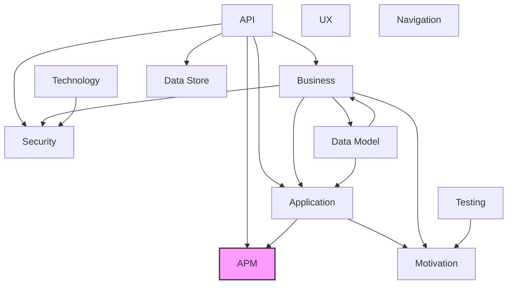

# APM Observability Layer

## Report Index

- [Layer Introduction](#layer-introduction)
- [Intra-Layer Relationships](#intra-layer-relationships)
- [Inter-Layer Dependencies](#inter-layer-dependencies)
- [Inter-Layer Relationships Table](#inter-layer-relationships-table)
- [Node Reference](#node-reference)
  - [Aggregationtemporality](#aggregationtemporality)
  - [Apmconfiguration](#apmconfiguration)
  - [Attribute](#attribute)
  - [Authtype](#authtype)
  - [Compressiontype](#compressiontype)
  - [Dataqualitymetric](#dataqualitymetric)
  - [Dataqualitymetrics](#dataqualitymetrics)
  - [Dataqualitytype](#dataqualitytype)
  - [Exporterconfig](#exporterconfig)
  - [Exporterprotocol](#exporterprotocol)
  - [Exportertype](#exportertype)
  - [Instrumentationconfig](#instrumentationconfig)
  - [Instrumentationscope](#instrumentationscope)
  - [Instrumentationtype](#instrumentationtype)
  - [Instrumenttype](#instrumenttype)
  - [Logconfiguration](#logconfiguration)
  - [Loglevel](#loglevel)
  - [Logprocessor](#logprocessor)
  - [Logprocessortype](#logprocessortype)
  - [Logrecord](#logrecord)
  - [Meterconfig](#meterconfig)
  - [Metricconfiguration](#metricconfiguration)
  - [Metricinstrument](#metricinstrument)
  - [Propagatortype](#propagatortype)
  - [Resource](#resource)
  - [Samplertype](#samplertype)
  - [Severitynumber](#severitynumber)
  - [Span](#span)
  - [Spanevent](#spanevent)
  - [Spankind](#spankind)
  - [Spanlink](#spanlink)
  - [Spanstatus](#spanstatus)
  - [Statuscode](#statuscode)
  - [Traceconfiguration](#traceconfiguration)
  - [Transformoperation](#transformoperation)

## Layer Introduction

**Layer 11**: APM
**Standard**: [OpenTelemetry](https://opentelemetry.io/)

Layer 11: APM Observability Layer

### Statistics

| Metric                    | Count |
| ------------------------- | ----- |
| Node Types                | 35    |
| Intra-Layer Relationships | 43    |
| Inter-Layer Relationships | 2     |
| Inbound Relationships     | 2     |
| Outbound Relationships    | 0     |

### Layer Dependencies

**Depends On**: [Application](./04-application-layer-report.md), [API](./06-api-layer-report.md)

**Depended On By**: None

## Intra-Layer Relationships

### Hierarchical Organization

This layer contains 35 node types. To improve readability, they are organized hierarchically:

| Group | Count | Types |
|-------|-------|-------|
| **A** | 4 | `aggregationtemporality`, `apmconfiguration`, `attribute`, `authtype` |
| **C** | 1 | `compressiontype` |
| **D** | 3 | `dataqualitymetric`, `dataqualitymetrics`, `dataqualitytype` |
| **E** | 3 | `exporterconfig`, `exporterprotocol`, `exportertype` |
| **I** | 4 | `instrumentationconfig`, `instrumentationscope`, `instrumentationtype`, `instrumenttype` |
| **L** | 5 | `logconfiguration`, `loglevel`, `logprocessor`, `logprocessortype`, `logrecord` |
| **M** | 3 | `meterconfig`, `metricconfiguration`, `metricinstrument` |
| **P** | 1 | `propagatortype` |
| **R** | 1 | `resource` |
| **S** | 8 | `samplertype`, `severitynumber`, `span`, `spanevent`, `spankind`, `spanlink`, `spanstatus`, `statuscode` |
| **T** | 2 | `traceconfiguration`, `transformoperation` |

### Relationship Map

Key relationships between node types:

| Source Type | Predicate | Destination Type | Count |
|-------------|-----------|------------------|-------|
| `traceconfiguration` | aggregates | `span` | 1 |
| `traceconfiguration` | aggregates | `metricinstrument` | 1 |
| `traceconfiguration` | aggregates | `exporterconfig` | 1 |
| `spanlink` | references | `span` | 1 |
| `span` | references | `span` | 1 |
| `span` | flows-to | `span` | 1 |
| `span` | flows-to | `logprocessor` | 1 |
| `span` | flows-to | `exporterconfig` | 1 |
| `span` | depends-on | `resource` | 1 |
| `span` | depends-on | `instrumentationscope` | 1 |
| `span` | composes | `traceconfiguration` | 1 |
| `span` | composes | `spanevent` | 1 |
| `span` | composes | `metricinstrument` | 1 |
| `resource` | aggregates | `span` | 1 |
| `resource` | aggregates | `metricinstrument` | 1 |
| `resource` | aggregates | `exporterconfig` | 1 |
| `metricinstrument` | flows-to | `span` | 1 |
| `metricinstrument` | flows-to | `logprocessor` | 1 |
| `metricinstrument` | flows-to | `exporterconfig` | 1 |
| `metricinstrument` | depends-on | `resource` | 1 |
| `metricinstrument` | depends-on | `instrumentationscope` | 1 |
| `metricinstrument` | accesses | `attribute` | 1 |
| `meterconfig` | composes | `traceconfiguration` | 1 |
| `meterconfig` | composes | `spanevent` | 1 |
| `meterconfig` | composes | `metricinstrument` | 1 |
| `logrecord` | references | `span` | 1 |
| `logrecord` | depends-on | `resource` | 1 |
| `logrecord` | depends-on | `instrumentationscope` | 1 |
| `logprocessor` | flows-to | `span` | 1 |
| `logprocessor` | flows-to | `logprocessor` | 1 |
| `logprocessor` | flows-to | `exporterconfig` | 1 |
| `logprocessor` | accesses | `attribute` | 1 |
| `instrumentationscope` | aggregates | `span` | 1 |
| `instrumentationscope` | aggregates | `metricinstrument` | 1 |
| `instrumentationscope` | aggregates | `exporterconfig` | 1 |
| `instrumentationconfig` | serves | `resource` | 1 |
| `instrumentationconfig` | serves | `apmconfiguration` | 1 |
| `exporterconfig` | serves | `resource` | 1 |
| `exporterconfig` | serves | `apmconfiguration` | 1 |
| `dataqualitymetric` | triggers | `logrecord` | 1 |
| `apmconfiguration` | composes | `traceconfiguration` | 1 |
| `apmconfiguration` | composes | `spanevent` | 1 |
| `apmconfiguration` | composes | `metricinstrument` | 1 |

## Inter-Layer Dependencies

## Inter-Layer Relationships Table

| Relationship ID                                              | Source Node                                                               | Dest Node                                                         | Dest Layer                      | Predicate | Cardinality | Strength |
| ------------------------------------------------------------ | ------------------------------------------------------------------------- | ----------------------------------------------------------------- | ------------------------------- | --------- | ----------- | -------- |
| api.operation.apm-trace.apm.traceconfiguration               | [operation](./06-api-layer-report.md#operation)                           | [traceconfiguration](./11-apm-layer-report.md#traceconfiguration) | [APM](./11-apm-layer-report.md) | apm-trace | many-to-one | medium   |
| application.applicationservice.traced.apm.traceconfiguration | [applicationservice](./04-application-layer-report.md#applicationservice) | [traceconfiguration](./11-apm-layer-report.md#traceconfiguration) | [APM](./11-apm-layer-report.md) | traced    | many-to-one | medium   |

## Node Reference

### Aggregationtemporality {#aggregationtemporality}

**Spec Node ID**: `apm.aggregationtemporality`

AggregationTemporality element in APM Observability Layer

#### Relationship Metrics

- **Intra-Layer**: Inbound: 0 | Outbound: 0
- **Inter-Layer**: Inbound: 0 | Outbound: 0

[Back to Index](#report-index)

### Apmconfiguration {#apmconfiguration}

**Spec Node ID**: `apm.apmconfiguration`

Complete APM configuration for an application

#### Relationship Metrics

- **Intra-Layer**: Inbound: 2 | Outbound: 3
- **Inter-Layer**: Inbound: 0 | Outbound: 0

#### Intra-Layer Relationships

| Related Node                                    | Predicate | Direction | Cardinality  |
| ----------------------------------------------- | --------- | --------- | ------------ |
| [metricinstrument](#metricinstrument)           | composes  | outbound  | many-to-many |
| [spanevent](#spanevent)                         | composes  | outbound  | many-to-many |
| [traceconfiguration](#traceconfiguration)       | composes  | outbound  | many-to-many |
| [exporterconfig](#exporterconfig)               | serves    | inbound   | many-to-many |
| [instrumentationconfig](#instrumentationconfig) | serves    | inbound   | many-to-many |

[Back to Index](#report-index)

### Attribute {#attribute}

**Spec Node ID**: `apm.attribute`

Key-value pair metadata

#### Relationship Metrics

- **Intra-Layer**: Inbound: 2 | Outbound: 0
- **Inter-Layer**: Inbound: 0 | Outbound: 0

#### Intra-Layer Relationships

| Related Node                          | Predicate | Direction | Cardinality  |
| ------------------------------------- | --------- | --------- | ------------ |
| [logprocessor](#logprocessor)         | accesses  | inbound   | many-to-many |
| [metricinstrument](#metricinstrument) | accesses  | inbound   | many-to-many |

[Back to Index](#report-index)

### Authtype {#authtype}

**Spec Node ID**: `apm.authtype`

AuthType element in APM Observability Layer

#### Relationship Metrics

- **Intra-Layer**: Inbound: 0 | Outbound: 0
- **Inter-Layer**: Inbound: 0 | Outbound: 0

[Back to Index](#report-index)

### Compressiontype {#compressiontype}

**Spec Node ID**: `apm.compressiontype`

CompressionType element in APM Observability Layer

#### Relationship Metrics

- **Intra-Layer**: Inbound: 0 | Outbound: 0
- **Inter-Layer**: Inbound: 0 | Outbound: 0

[Back to Index](#report-index)

### Dataqualitymetric {#dataqualitymetric}

**Spec Node ID**: `apm.dataqualitymetric`

Individual data quality metric

#### Relationship Metrics

- **Intra-Layer**: Inbound: 0 | Outbound: 1
- **Inter-Layer**: Inbound: 0 | Outbound: 0

#### Intra-Layer Relationships

| Related Node            | Predicate | Direction | Cardinality  |
| ----------------------- | --------- | --------- | ------------ |
| [logrecord](#logrecord) | triggers  | outbound  | many-to-many |

[Back to Index](#report-index)

### Dataqualitymetrics {#dataqualitymetrics}

**Spec Node ID**: `apm.dataqualitymetrics`

Data quality monitoring metrics (referenced by Data Model Layer x-apm-data-quality-metrics)

#### Relationship Metrics

- **Intra-Layer**: Inbound: 0 | Outbound: 0
- **Inter-Layer**: Inbound: 0 | Outbound: 0

[Back to Index](#report-index)

### Dataqualitytype {#dataqualitytype}

**Spec Node ID**: `apm.dataqualitytype`

DataQualityType element in APM Observability Layer

#### Relationship Metrics

- **Intra-Layer**: Inbound: 0 | Outbound: 0
- **Inter-Layer**: Inbound: 0 | Outbound: 0

[Back to Index](#report-index)

### Exporterconfig {#exporterconfig}

**Spec Node ID**: `apm.exporterconfig`

Configuration for telemetry data export destinations, specifying protocol (OTLP, Jaeger, Prometheus), endpoints, authentication, batching, and retry policies. Controls where observability data is sent.

#### Relationship Metrics

- **Intra-Layer**: Inbound: 6 | Outbound: 2
- **Inter-Layer**: Inbound: 0 | Outbound: 0

#### Intra-Layer Relationships

| Related Node                                  | Predicate  | Direction | Cardinality  |
| --------------------------------------------- | ---------- | --------- | ------------ |
| [apmconfiguration](#apmconfiguration)         | serves     | outbound  | many-to-many |
| [resource](#resource)                         | serves     | outbound  | many-to-many |
| [instrumentationscope](#instrumentationscope) | aggregates | inbound   | many-to-many |
| [logprocessor](#logprocessor)                 | flows-to   | inbound   | many-to-many |
| [metricinstrument](#metricinstrument)         | flows-to   | inbound   | many-to-many |
| [resource](#resource)                         | aggregates | inbound   | many-to-many |
| [span](#span)                                 | flows-to   | inbound   | many-to-many |
| [traceconfiguration](#traceconfiguration)     | aggregates | inbound   | many-to-many |

[Back to Index](#report-index)

### Exporterprotocol {#exporterprotocol}

**Spec Node ID**: `apm.exporterprotocol`

ExporterProtocol element in APM Observability Layer

#### Relationship Metrics

- **Intra-Layer**: Inbound: 0 | Outbound: 0
- **Inter-Layer**: Inbound: 0 | Outbound: 0

[Back to Index](#report-index)

### Exportertype {#exportertype}

**Spec Node ID**: `apm.exportertype`

ExporterType element in APM Observability Layer

#### Relationship Metrics

- **Intra-Layer**: Inbound: 0 | Outbound: 0
- **Inter-Layer**: Inbound: 0 | Outbound: 0

[Back to Index](#report-index)

### Instrumentationconfig {#instrumentationconfig}

**Spec Node ID**: `apm.instrumentationconfig`

Configuration for automatic or manual instrumentation of application code, specifying which libraries, frameworks, or code paths to instrument and capture telemetry from.

#### Relationship Metrics

- **Intra-Layer**: Inbound: 0 | Outbound: 2
- **Inter-Layer**: Inbound: 0 | Outbound: 0

#### Intra-Layer Relationships

| Related Node                          | Predicate | Direction | Cardinality  |
| ------------------------------------- | --------- | --------- | ------------ |
| [apmconfiguration](#apmconfiguration) | serves    | outbound  | many-to-many |
| [resource](#resource)                 | serves    | outbound  | many-to-many |

[Back to Index](#report-index)

### Instrumentationscope {#instrumentationscope}

**Spec Node ID**: `apm.instrumentationscope`

Logical unit of code that generates telemetry

#### Relationship Metrics

- **Intra-Layer**: Inbound: 3 | Outbound: 3
- **Inter-Layer**: Inbound: 0 | Outbound: 0

#### Intra-Layer Relationships

| Related Node                          | Predicate  | Direction | Cardinality  |
| ------------------------------------- | ---------- | --------- | ------------ |
| [exporterconfig](#exporterconfig)     | aggregates | outbound  | many-to-many |
| [metricinstrument](#metricinstrument) | aggregates | outbound  | many-to-many |
| [span](#span)                         | aggregates | outbound  | many-to-many |
| [logrecord](#logrecord)               | depends-on | inbound   | many-to-many |
| [metricinstrument](#metricinstrument) | depends-on | inbound   | many-to-many |
| [span](#span)                         | depends-on | inbound   | many-to-many |

[Back to Index](#report-index)

### Instrumentationtype {#instrumentationtype}

**Spec Node ID**: `apm.instrumentationtype`

InstrumentationType element in APM Observability Layer

#### Relationship Metrics

- **Intra-Layer**: Inbound: 0 | Outbound: 0
- **Inter-Layer**: Inbound: 0 | Outbound: 0

[Back to Index](#report-index)

### Instrumenttype {#instrumenttype}

**Spec Node ID**: `apm.instrumenttype`

InstrumentType element in APM Observability Layer

#### Relationship Metrics

- **Intra-Layer**: Inbound: 0 | Outbound: 0
- **Inter-Layer**: Inbound: 0 | Outbound: 0

[Back to Index](#report-index)

### Logconfiguration {#logconfiguration}

**Spec Node ID**: `apm.logconfiguration`

Logging configuration

#### Relationship Metrics

- **Intra-Layer**: Inbound: 0 | Outbound: 0
- **Inter-Layer**: Inbound: 0 | Outbound: 0

[Back to Index](#report-index)

### Loglevel {#loglevel}

**Spec Node ID**: `apm.loglevel`

LogLevel element in APM Observability Layer

#### Relationship Metrics

- **Intra-Layer**: Inbound: 0 | Outbound: 0
- **Inter-Layer**: Inbound: 0 | Outbound: 0

[Back to Index](#report-index)

### Logprocessor {#logprocessor}

**Spec Node ID**: `apm.logprocessor`

A processing pipeline component for log records, enabling filtering, transformation, enrichment, or routing of logs before export. Customizes log processing behavior.

#### Relationship Metrics

- **Intra-Layer**: Inbound: 3 | Outbound: 4
- **Inter-Layer**: Inbound: 0 | Outbound: 0

#### Intra-Layer Relationships

| Related Node                          | Predicate | Direction | Cardinality  |
| ------------------------------------- | --------- | --------- | ------------ |
| [attribute](#attribute)               | accesses  | outbound  | many-to-many |
| [exporterconfig](#exporterconfig)     | flows-to  | outbound  | many-to-many |
| [logprocessor](#logprocessor)         | flows-to  | outbound  | many-to-many |
| [span](#span)                         | flows-to  | outbound  | many-to-many |
| [metricinstrument](#metricinstrument) | flows-to  | inbound   | many-to-many |
| [span](#span)                         | flows-to  | inbound   | many-to-many |

[Back to Index](#report-index)

### Logprocessortype {#logprocessortype}

**Spec Node ID**: `apm.logprocessortype`

LogProcessorType element in APM Observability Layer

#### Relationship Metrics

- **Intra-Layer**: Inbound: 0 | Outbound: 0
- **Inter-Layer**: Inbound: 0 | Outbound: 0

[Back to Index](#report-index)

### Logrecord {#logrecord}

**Spec Node ID**: `apm.logrecord`

OpenTelemetry log entry

#### Relationship Metrics

- **Intra-Layer**: Inbound: 1 | Outbound: 3
- **Inter-Layer**: Inbound: 0 | Outbound: 0

#### Intra-Layer Relationships

| Related Node                                  | Predicate  | Direction | Cardinality  |
| --------------------------------------------- | ---------- | --------- | ------------ |
| [dataqualitymetric](#dataqualitymetric)       | triggers   | inbound   | many-to-many |
| [instrumentationscope](#instrumentationscope) | depends-on | outbound  | many-to-many |
| [resource](#resource)                         | depends-on | outbound  | many-to-many |
| [span](#span)                                 | references | outbound  | many-to-many |

[Back to Index](#report-index)

### Meterconfig {#meterconfig}

**Spec Node ID**: `apm.meterconfig`

Configuration for metric collection meters, specifying aggregation temporality, cardinality limits, and collection intervals. Controls how metrics are gathered and aggregated.

#### Relationship Metrics

- **Intra-Layer**: Inbound: 0 | Outbound: 3
- **Inter-Layer**: Inbound: 0 | Outbound: 0

#### Intra-Layer Relationships

| Related Node                              | Predicate | Direction | Cardinality  |
| ----------------------------------------- | --------- | --------- | ------------ |
| [metricinstrument](#metricinstrument)     | composes  | outbound  | many-to-many |
| [spanevent](#spanevent)                   | composes  | outbound  | many-to-many |
| [traceconfiguration](#traceconfiguration) | composes  | outbound  | many-to-many |

[Back to Index](#report-index)

### Metricconfiguration {#metricconfiguration}

**Spec Node ID**: `apm.metricconfiguration`

Metrics configuration

#### Relationship Metrics

- **Intra-Layer**: Inbound: 0 | Outbound: 0
- **Inter-Layer**: Inbound: 0 | Outbound: 0

[Back to Index](#report-index)

### Metricinstrument {#metricinstrument}

**Spec Node ID**: `apm.metricinstrument`

Defines a specific metric measurement instrument (Counter, Gauge, Histogram, etc.) with its name, unit, description, and attributes. The fundamental unit of metric collection.

#### Relationship Metrics

- **Intra-Layer**: Inbound: 6 | Outbound: 6
- **Inter-Layer**: Inbound: 0 | Outbound: 0

#### Intra-Layer Relationships

| Related Node                                  | Predicate  | Direction | Cardinality  |
| --------------------------------------------- | ---------- | --------- | ------------ |
| [apmconfiguration](#apmconfiguration)         | composes   | inbound   | many-to-many |
| [instrumentationscope](#instrumentationscope) | aggregates | inbound   | many-to-many |
| [meterconfig](#meterconfig)                   | composes   | inbound   | many-to-many |
| [attribute](#attribute)                       | accesses   | outbound  | many-to-many |
| [instrumentationscope](#instrumentationscope) | depends-on | outbound  | many-to-many |
| [resource](#resource)                         | depends-on | outbound  | many-to-many |
| [exporterconfig](#exporterconfig)             | flows-to   | outbound  | many-to-many |
| [logprocessor](#logprocessor)                 | flows-to   | outbound  | many-to-many |
| [span](#span)                                 | flows-to   | outbound  | many-to-many |
| [resource](#resource)                         | aggregates | inbound   | many-to-many |
| [span](#span)                                 | composes   | inbound   | many-to-many |
| [traceconfiguration](#traceconfiguration)     | aggregates | inbound   | many-to-many |

[Back to Index](#report-index)

### Propagatortype {#propagatortype}

**Spec Node ID**: `apm.propagatortype`

PropagatorType element in APM Observability Layer

#### Relationship Metrics

- **Intra-Layer**: Inbound: 0 | Outbound: 0
- **Inter-Layer**: Inbound: 0 | Outbound: 0

[Back to Index](#report-index)

### Resource {#resource}

**Spec Node ID**: `apm.resource`

Immutable representation of entity producing telemetry

#### Relationship Metrics

- **Intra-Layer**: Inbound: 5 | Outbound: 3
- **Inter-Layer**: Inbound: 0 | Outbound: 0

#### Intra-Layer Relationships

| Related Node                                    | Predicate  | Direction | Cardinality  |
| ----------------------------------------------- | ---------- | --------- | ------------ |
| [exporterconfig](#exporterconfig)               | serves     | inbound   | many-to-many |
| [instrumentationconfig](#instrumentationconfig) | serves     | inbound   | many-to-many |
| [logrecord](#logrecord)                         | depends-on | inbound   | many-to-many |
| [metricinstrument](#metricinstrument)           | depends-on | inbound   | many-to-many |
| [exporterconfig](#exporterconfig)               | aggregates | outbound  | many-to-many |
| [metricinstrument](#metricinstrument)           | aggregates | outbound  | many-to-many |
| [span](#span)                                   | aggregates | outbound  | many-to-many |
| [span](#span)                                   | depends-on | inbound   | many-to-many |

[Back to Index](#report-index)

### Samplertype {#samplertype}

**Spec Node ID**: `apm.samplertype`

SamplerType element in APM Observability Layer

#### Relationship Metrics

- **Intra-Layer**: Inbound: 0 | Outbound: 0
- **Inter-Layer**: Inbound: 0 | Outbound: 0

[Back to Index](#report-index)

### Severitynumber {#severitynumber}

**Spec Node ID**: `apm.severitynumber`

SeverityNumber element in APM Observability Layer

#### Relationship Metrics

- **Intra-Layer**: Inbound: 0 | Outbound: 0
- **Inter-Layer**: Inbound: 0 | Outbound: 0

[Back to Index](#report-index)

### Span {#span}

**Spec Node ID**: `apm.span`

Unit of work in distributed tracing

#### Relationship Metrics

- **Intra-Layer**: Inbound: 9 | Outbound: 9
- **Inter-Layer**: Inbound: 0 | Outbound: 0

#### Intra-Layer Relationships

| Related Node                                  | Predicate  | Direction | Cardinality  |
| --------------------------------------------- | ---------- | --------- | ------------ |
| [instrumentationscope](#instrumentationscope) | aggregates | inbound   | many-to-many |
| [logprocessor](#logprocessor)                 | flows-to   | inbound   | many-to-many |
| [logrecord](#logrecord)                       | references | inbound   | many-to-many |
| [metricinstrument](#metricinstrument)         | flows-to   | inbound   | many-to-many |
| [resource](#resource)                         | aggregates | inbound   | many-to-many |
| [metricinstrument](#metricinstrument)         | composes   | outbound  | many-to-many |
| [spanevent](#spanevent)                       | composes   | outbound  | many-to-many |
| [traceconfiguration](#traceconfiguration)     | composes   | outbound  | many-to-many |
| [instrumentationscope](#instrumentationscope) | depends-on | outbound  | many-to-many |
| [resource](#resource)                         | depends-on | outbound  | many-to-many |
| [exporterconfig](#exporterconfig)             | flows-to   | outbound  | many-to-many |
| [logprocessor](#logprocessor)                 | flows-to   | outbound  | many-to-many |
| [span](#span)                                 | flows-to   | outbound  | many-to-many |
| [span](#span)                                 | references | outbound  | many-to-many |
| [spanlink](#spanlink)                         | references | inbound   | many-to-many |
| [traceconfiguration](#traceconfiguration)     | aggregates | inbound   | many-to-many |

[Back to Index](#report-index)

### Spanevent {#spanevent}

**Spec Node ID**: `apm.spanevent`

Timestamped event during span execution

#### Relationship Metrics

- **Intra-Layer**: Inbound: 3 | Outbound: 0
- **Inter-Layer**: Inbound: 0 | Outbound: 0

#### Intra-Layer Relationships

| Related Node                          | Predicate | Direction | Cardinality  |
| ------------------------------------- | --------- | --------- | ------------ |
| [apmconfiguration](#apmconfiguration) | composes  | inbound   | many-to-many |
| [meterconfig](#meterconfig)           | composes  | inbound   | many-to-many |
| [span](#span)                         | composes  | inbound   | many-to-many |

[Back to Index](#report-index)

### Spankind {#spankind}

**Spec Node ID**: `apm.spankind`

SpanKind element in APM Observability Layer

#### Relationship Metrics

- **Intra-Layer**: Inbound: 0 | Outbound: 0
- **Inter-Layer**: Inbound: 0 | Outbound: 0

[Back to Index](#report-index)

### Spanlink {#spanlink}

**Spec Node ID**: `apm.spanlink`

Link to related span (different trace or parent)

#### Relationship Metrics

- **Intra-Layer**: Inbound: 0 | Outbound: 1
- **Inter-Layer**: Inbound: 0 | Outbound: 0

#### Intra-Layer Relationships

| Related Node  | Predicate  | Direction | Cardinality  |
| ------------- | ---------- | --------- | ------------ |
| [span](#span) | references | outbound  | many-to-many |

[Back to Index](#report-index)

### Spanstatus {#spanstatus}

**Spec Node ID**: `apm.spanstatus`

Outcome of span execution

#### Relationship Metrics

- **Intra-Layer**: Inbound: 0 | Outbound: 0
- **Inter-Layer**: Inbound: 0 | Outbound: 0

[Back to Index](#report-index)

### Statuscode {#statuscode}

**Spec Node ID**: `apm.statuscode`

StatusCode element in APM Observability Layer

#### Relationship Metrics

- **Intra-Layer**: Inbound: 0 | Outbound: 0
- **Inter-Layer**: Inbound: 0 | Outbound: 0

[Back to Index](#report-index)

### Traceconfiguration {#traceconfiguration}

**Spec Node ID**: `apm.traceconfiguration`

Distributed tracing configuration

#### Relationship Metrics

- **Intra-Layer**: Inbound: 3 | Outbound: 3
- **Inter-Layer**: Inbound: 2 | Outbound: 0

#### Intra-Layer Relationships

| Related Node                          | Predicate  | Direction | Cardinality  |
| ------------------------------------- | ---------- | --------- | ------------ |
| [apmconfiguration](#apmconfiguration) | composes   | inbound   | many-to-many |
| [meterconfig](#meterconfig)           | composes   | inbound   | many-to-many |
| [span](#span)                         | composes   | inbound   | many-to-many |
| [exporterconfig](#exporterconfig)     | aggregates | outbound  | many-to-many |
| [metricinstrument](#metricinstrument) | aggregates | outbound  | many-to-many |
| [span](#span)                         | aggregates | outbound  | many-to-many |

#### Inter-Layer Relationships

| Related Node                                                              | Layer                                           | Predicate | Direction | Cardinality |
| ------------------------------------------------------------------------- | ----------------------------------------------- | --------- | --------- | ----------- |
| [operation](./06-api-layer-report.md#operation)                           | [API](./06-api-layer-report.md)                 | apm-trace | inbound   | many-to-one |
| [applicationservice](./04-application-layer-report.md#applicationservice) | [Application](./04-application-layer-report.md) | traced    | inbound   | many-to-one |

[Back to Index](#report-index)

### Transformoperation {#transformoperation}

**Spec Node ID**: `apm.transformoperation`

TransformOperation element in APM Observability Layer

#### Relationship Metrics

- **Intra-Layer**: Inbound: 0 | Outbound: 0
- **Inter-Layer**: Inbound: 0 | Outbound: 0

[Back to Index](#report-index)

---

_Generated: 2026-02-13T12:27:12.860Z | Spec Version: 0.8.0 | Generator: generate-layer-reports.ts_
