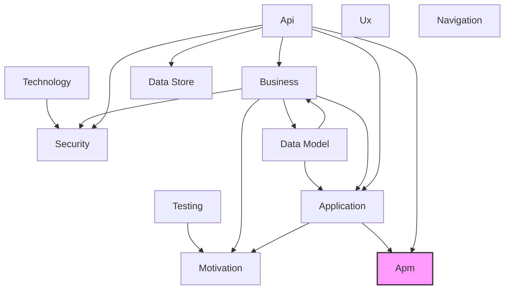

# APM Observability Layer

## Report Index

- [Layer Introduction](#layer-introduction)
- [Intra-Layer Relationships](#intra-layer-relationships)
- [Inter-Layer Dependencies](#inter-layer-dependencies)
- [Inter-Layer Relationships Table](#inter-layer-relationships-table)
- [Node Reference](#node-reference)
  - [Aggregationtemporality](#aggregationtemporality)
  - [Apmconfiguration](#apmconfiguration)
  - [Attribute](#attribute)
  - [Authtype](#authtype)
  - [Compressiontype](#compressiontype)
  - [Dataqualitymetric](#dataqualitymetric)
  - [Dataqualitymetrics](#dataqualitymetrics)
  - [Dataqualitytype](#dataqualitytype)
  - [Exporterconfig](#exporterconfig)
  - [Exporterprotocol](#exporterprotocol)
  - [Exportertype](#exportertype)
  - [Instrumentationconfig](#instrumentationconfig)
  - [Instrumentationscope](#instrumentationscope)
  - [Instrumentationtype](#instrumentationtype)
  - [Instrumenttype](#instrumenttype)
  - [Logconfiguration](#logconfiguration)
  - [Loglevel](#loglevel)
  - [Logprocessor](#logprocessor)
  - [Logprocessortype](#logprocessortype)
  - [Logrecord](#logrecord)
  - [Meterconfig](#meterconfig)
  - [Metricconfiguration](#metricconfiguration)
  - [Metricinstrument](#metricinstrument)
  - [Propagatortype](#propagatortype)
  - [Resource](#resource)
  - [Samplertype](#samplertype)
  - [Severitynumber](#severitynumber)
  - [Span](#span)
  - [Spanevent](#spanevent)
  - [Spankind](#spankind)
  - [Spanlink](#spanlink)
  - [Spanstatus](#spanstatus)
  - [Statuscode](#statuscode)
  - [Traceconfiguration](#traceconfiguration)
  - [Transformoperation](#transformoperation)

## Layer Introduction

**Layer 11**: Apm
**Standard**: [OpenTelemetry](https://opentelemetry.io/)

Layer 11: APM Observability Layer

### Statistics

| Metric                    | Count |
| ------------------------- | ----- |
| Node Types                | 35    |
| Intra-Layer Relationships | 43    |
| Inter-Layer Relationships | 2     |
| Inbound Relationships     | 2     |
| Outbound Relationships    | 0     |

### Layer Dependencies

**Depends On**: [Application](./04-application-layer-report.md), [Api](./06-api-layer-report.md)
**Depended On By**: None

## Intra-Layer Relationships

```mermaid
flowchart LR
  subgraph apm
    aggregationtemporality["aggregationtemporality"]
    apmconfiguration["apmconfiguration"]
    attribute["attribute"]
    authtype["authtype"]
    compressiontype["compressiontype"]
    dataqualitymetric["dataqualitymetric"]
    dataqualitymetrics["dataqualitymetrics"]
    dataqualitytype["dataqualitytype"]
    exporterconfig["exporterconfig"]
    exporterprotocol["exporterprotocol"]
    exportertype["exportertype"]
    instrumentationconfig["instrumentationconfig"]
    instrumentationscope["instrumentationscope"]
    instrumentationtype["instrumentationtype"]
    instrumenttype["instrumenttype"]
    logconfiguration["logconfiguration"]
    loglevel["loglevel"]
    logprocessor["logprocessor"]
    logprocessortype["logprocessortype"]
    logrecord["logrecord"]
    meterconfig["meterconfig"]
    metricconfiguration["metricconfiguration"]
    metricinstrument["metricinstrument"]
    propagatortype["propagatortype"]
    resource["resource"]
    samplertype["samplertype"]
    severitynumber["severitynumber"]
    span["span"]
    spanevent["spanevent"]
    spankind["spankind"]
    spanlink["spanlink"]
    spanstatus["spanstatus"]
    statuscode["statuscode"]
    traceconfiguration["traceconfiguration"]
    transformoperation["transformoperation"]
    apmconfiguration -->|composes| metricinstrument
    apmconfiguration -->|composes| spanevent
    apmconfiguration -->|composes| traceconfiguration
    dataqualitymetric -->|triggers| logrecord
    exporterconfig -->|serves| apmconfiguration
    exporterconfig -->|serves| resource
    instrumentationconfig -->|serves| apmconfiguration
    instrumentationconfig -->|serves| resource
    instrumentationscope -->|aggregates| exporterconfig
    instrumentationscope -->|aggregates| metricinstrument
    instrumentationscope -->|aggregates| span
    logprocessor -->|accesses| attribute
    logprocessor -->|flows-to| exporterconfig
    logprocessor -->|flows-to| logprocessor
    logprocessor -->|flows-to| span
    logrecord -->|depends-on| instrumentationscope
    logrecord -->|depends-on| resource
    logrecord -->|references| span
    meterconfig -->|composes| metricinstrument
    meterconfig -->|composes| spanevent
    meterconfig -->|composes| traceconfiguration
    metricinstrument -->|accesses| attribute
    metricinstrument -->|depends-on| instrumentationscope
    metricinstrument -->|depends-on| resource
    metricinstrument -->|flows-to| exporterconfig
    metricinstrument -->|flows-to| logprocessor
    metricinstrument -->|flows-to| span
    resource -->|aggregates| exporterconfig
    resource -->|aggregates| metricinstrument
    resource -->|aggregates| span
    span -->|composes| metricinstrument
    span -->|composes| spanevent
    span -->|composes| traceconfiguration
    span -->|depends-on| instrumentationscope
    span -->|depends-on| resource
    span -->|flows-to| exporterconfig
    span -->|flows-to| logprocessor
    span -->|flows-to| span
    span -->|references| span
    spanlink -->|references| span
    traceconfiguration -->|aggregates| exporterconfig
    traceconfiguration -->|aggregates| metricinstrument
    traceconfiguration -->|aggregates| span
  end
```

## Inter-Layer Dependencies

## Inter-Layer Relationships Table

| Relationship ID                                              | Source Node                                                               | Dest Node                                                         | Dest Layer                      | Predicate | Cardinality | Strength |
| ------------------------------------------------------------ | ------------------------------------------------------------------------- | ----------------------------------------------------------------- | ------------------------------- | --------- | ----------- | -------- |
| api.operation.apm-trace.apm.traceconfiguration               | [operation](./06-api-layer-report.md#operation)                           | [traceconfiguration](./11-apm-layer-report.md#traceconfiguration) | [Apm](./11-apm-layer-report.md) | apm-trace | many-to-one | medium   |
| application.applicationservice.traced.apm.traceconfiguration | [applicationservice](./04-application-layer-report.md#applicationservice) | [traceconfiguration](./11-apm-layer-report.md#traceconfiguration) | [Apm](./11-apm-layer-report.md) | traced    | many-to-one | medium   |

## Node Reference

### Aggregationtemporality

**Spec Node ID**: `apm.aggregationtemporality`

AggregationTemporality element in APM Observability Layer

[Back to Index](#report-index)

### Apmconfiguration

**Spec Node ID**: `apm.apmconfiguration`

Complete APM configuration for an application

#### Intra-Layer Relationships

| Related Node                                    | Predicate | Direction | Cardinality  |
| ----------------------------------------------- | --------- | --------- | ------------ |
| [metricinstrument](#metricinstrument)           | composes  | outbound  | many-to-many |
| [spanevent](#spanevent)                         | composes  | outbound  | many-to-many |
| [traceconfiguration](#traceconfiguration)       | composes  | outbound  | many-to-many |
| [exporterconfig](#exporterconfig)               | serves    | inbound   | many-to-many |
| [instrumentationconfig](#instrumentationconfig) | serves    | inbound   | many-to-many |

[Back to Index](#report-index)

### Attribute

**Spec Node ID**: `apm.attribute`

Key-value pair metadata

#### Intra-Layer Relationships

| Related Node                          | Predicate | Direction | Cardinality  |
| ------------------------------------- | --------- | --------- | ------------ |
| [logprocessor](#logprocessor)         | accesses  | inbound   | many-to-many |
| [metricinstrument](#metricinstrument) | accesses  | inbound   | many-to-many |

[Back to Index](#report-index)

### Authtype

**Spec Node ID**: `apm.authtype`

AuthType element in APM Observability Layer

[Back to Index](#report-index)

### Compressiontype

**Spec Node ID**: `apm.compressiontype`

CompressionType element in APM Observability Layer

[Back to Index](#report-index)

### Dataqualitymetric

**Spec Node ID**: `apm.dataqualitymetric`

Individual data quality metric

#### Intra-Layer Relationships

| Related Node            | Predicate | Direction | Cardinality  |
| ----------------------- | --------- | --------- | ------------ |
| [logrecord](#logrecord) | triggers  | outbound  | many-to-many |

[Back to Index](#report-index)

### Dataqualitymetrics

**Spec Node ID**: `apm.dataqualitymetrics`

Data quality monitoring metrics (referenced by Data Model Layer x-apm-data-quality-metrics)

[Back to Index](#report-index)

### Dataqualitytype

**Spec Node ID**: `apm.dataqualitytype`

DataQualityType element in APM Observability Layer

[Back to Index](#report-index)

### Exporterconfig

**Spec Node ID**: `apm.exporterconfig`

Configuration for telemetry data export destinations, specifying protocol (OTLP, Jaeger, Prometheus), endpoints, authentication, batching, and retry policies. Controls where observability data is sent.

#### Intra-Layer Relationships

| Related Node                                  | Predicate  | Direction | Cardinality  |
| --------------------------------------------- | ---------- | --------- | ------------ |
| [apmconfiguration](#apmconfiguration)         | serves     | outbound  | many-to-many |
| [resource](#resource)                         | serves     | outbound  | many-to-many |
| [instrumentationscope](#instrumentationscope) | aggregates | inbound   | many-to-many |
| [logprocessor](#logprocessor)                 | flows-to   | inbound   | many-to-many |
| [metricinstrument](#metricinstrument)         | flows-to   | inbound   | many-to-many |
| [resource](#resource)                         | aggregates | inbound   | many-to-many |
| [span](#span)                                 | flows-to   | inbound   | many-to-many |
| [traceconfiguration](#traceconfiguration)     | aggregates | inbound   | many-to-many |

[Back to Index](#report-index)

### Exporterprotocol

**Spec Node ID**: `apm.exporterprotocol`

ExporterProtocol element in APM Observability Layer

[Back to Index](#report-index)

### Exportertype

**Spec Node ID**: `apm.exportertype`

ExporterType element in APM Observability Layer

[Back to Index](#report-index)

### Instrumentationconfig

**Spec Node ID**: `apm.instrumentationconfig`

Configuration for automatic or manual instrumentation of application code, specifying which libraries, frameworks, or code paths to instrument and capture telemetry from.

#### Intra-Layer Relationships

| Related Node                          | Predicate | Direction | Cardinality  |
| ------------------------------------- | --------- | --------- | ------------ |
| [apmconfiguration](#apmconfiguration) | serves    | outbound  | many-to-many |
| [resource](#resource)                 | serves    | outbound  | many-to-many |

[Back to Index](#report-index)

### Instrumentationscope

**Spec Node ID**: `apm.instrumentationscope`

Logical unit of code that generates telemetry

#### Intra-Layer Relationships

| Related Node                          | Predicate  | Direction | Cardinality  |
| ------------------------------------- | ---------- | --------- | ------------ |
| [exporterconfig](#exporterconfig)     | aggregates | outbound  | many-to-many |
| [metricinstrument](#metricinstrument) | aggregates | outbound  | many-to-many |
| [span](#span)                         | aggregates | outbound  | many-to-many |
| [logrecord](#logrecord)               | depends-on | inbound   | many-to-many |
| [metricinstrument](#metricinstrument) | depends-on | inbound   | many-to-many |
| [span](#span)                         | depends-on | inbound   | many-to-many |

[Back to Index](#report-index)

### Instrumentationtype

**Spec Node ID**: `apm.instrumentationtype`

InstrumentationType element in APM Observability Layer

[Back to Index](#report-index)

### Instrumenttype

**Spec Node ID**: `apm.instrumenttype`

InstrumentType element in APM Observability Layer

[Back to Index](#report-index)

### Logconfiguration

**Spec Node ID**: `apm.logconfiguration`

Logging configuration

[Back to Index](#report-index)

### Loglevel

**Spec Node ID**: `apm.loglevel`

LogLevel element in APM Observability Layer

[Back to Index](#report-index)

### Logprocessor

**Spec Node ID**: `apm.logprocessor`

A processing pipeline component for log records, enabling filtering, transformation, enrichment, or routing of logs before export. Customizes log processing behavior.

#### Intra-Layer Relationships

| Related Node                          | Predicate | Direction | Cardinality  |
| ------------------------------------- | --------- | --------- | ------------ |
| [attribute](#attribute)               | accesses  | outbound  | many-to-many |
| [exporterconfig](#exporterconfig)     | flows-to  | outbound  | many-to-many |
| [logprocessor](#logprocessor)         | flows-to  | outbound  | many-to-many |
| [span](#span)                         | flows-to  | outbound  | many-to-many |
| [metricinstrument](#metricinstrument) | flows-to  | inbound   | many-to-many |
| [span](#span)                         | flows-to  | inbound   | many-to-many |

[Back to Index](#report-index)

### Logprocessortype

**Spec Node ID**: `apm.logprocessortype`

LogProcessorType element in APM Observability Layer

[Back to Index](#report-index)

### Logrecord

**Spec Node ID**: `apm.logrecord`

OpenTelemetry log entry

#### Intra-Layer Relationships

| Related Node                                  | Predicate  | Direction | Cardinality  |
| --------------------------------------------- | ---------- | --------- | ------------ |
| [dataqualitymetric](#dataqualitymetric)       | triggers   | inbound   | many-to-many |
| [instrumentationscope](#instrumentationscope) | depends-on | outbound  | many-to-many |
| [resource](#resource)                         | depends-on | outbound  | many-to-many |
| [span](#span)                                 | references | outbound  | many-to-many |

[Back to Index](#report-index)

### Meterconfig

**Spec Node ID**: `apm.meterconfig`

Configuration for metric collection meters, specifying aggregation temporality, cardinality limits, and collection intervals. Controls how metrics are gathered and aggregated.

#### Intra-Layer Relationships

| Related Node                              | Predicate | Direction | Cardinality  |
| ----------------------------------------- | --------- | --------- | ------------ |
| [metricinstrument](#metricinstrument)     | composes  | outbound  | many-to-many |
| [spanevent](#spanevent)                   | composes  | outbound  | many-to-many |
| [traceconfiguration](#traceconfiguration) | composes  | outbound  | many-to-many |

[Back to Index](#report-index)

### Metricconfiguration

**Spec Node ID**: `apm.metricconfiguration`

Metrics configuration

[Back to Index](#report-index)

### Metricinstrument

**Spec Node ID**: `apm.metricinstrument`

Defines a specific metric measurement instrument (Counter, Gauge, Histogram, etc.) with its name, unit, description, and attributes. The fundamental unit of metric collection.

#### Intra-Layer Relationships

| Related Node                                  | Predicate  | Direction | Cardinality  |
| --------------------------------------------- | ---------- | --------- | ------------ |
| [apmconfiguration](#apmconfiguration)         | composes   | inbound   | many-to-many |
| [instrumentationscope](#instrumentationscope) | aggregates | inbound   | many-to-many |
| [meterconfig](#meterconfig)                   | composes   | inbound   | many-to-many |
| [attribute](#attribute)                       | accesses   | outbound  | many-to-many |
| [instrumentationscope](#instrumentationscope) | depends-on | outbound  | many-to-many |
| [resource](#resource)                         | depends-on | outbound  | many-to-many |
| [exporterconfig](#exporterconfig)             | flows-to   | outbound  | many-to-many |
| [logprocessor](#logprocessor)                 | flows-to   | outbound  | many-to-many |
| [span](#span)                                 | flows-to   | outbound  | many-to-many |
| [resource](#resource)                         | aggregates | inbound   | many-to-many |
| [span](#span)                                 | composes   | inbound   | many-to-many |
| [traceconfiguration](#traceconfiguration)     | aggregates | inbound   | many-to-many |

[Back to Index](#report-index)

### Propagatortype

**Spec Node ID**: `apm.propagatortype`

PropagatorType element in APM Observability Layer

[Back to Index](#report-index)

### Resource

**Spec Node ID**: `apm.resource`

Immutable representation of entity producing telemetry

#### Intra-Layer Relationships

| Related Node                                    | Predicate  | Direction | Cardinality  |
| ----------------------------------------------- | ---------- | --------- | ------------ |
| [exporterconfig](#exporterconfig)               | serves     | inbound   | many-to-many |
| [instrumentationconfig](#instrumentationconfig) | serves     | inbound   | many-to-many |
| [logrecord](#logrecord)                         | depends-on | inbound   | many-to-many |
| [metricinstrument](#metricinstrument)           | depends-on | inbound   | many-to-many |
| [exporterconfig](#exporterconfig)               | aggregates | outbound  | many-to-many |
| [metricinstrument](#metricinstrument)           | aggregates | outbound  | many-to-many |
| [span](#span)                                   | aggregates | outbound  | many-to-many |
| [span](#span)                                   | depends-on | inbound   | many-to-many |

[Back to Index](#report-index)

### Samplertype

**Spec Node ID**: `apm.samplertype`

SamplerType element in APM Observability Layer

[Back to Index](#report-index)

### Severitynumber

**Spec Node ID**: `apm.severitynumber`

SeverityNumber element in APM Observability Layer

[Back to Index](#report-index)

### Span

**Spec Node ID**: `apm.span`

Unit of work in distributed tracing

#### Intra-Layer Relationships

| Related Node                                  | Predicate  | Direction | Cardinality  |
| --------------------------------------------- | ---------- | --------- | ------------ |
| [instrumentationscope](#instrumentationscope) | aggregates | inbound   | many-to-many |
| [logprocessor](#logprocessor)                 | flows-to   | inbound   | many-to-many |
| [logrecord](#logrecord)                       | references | inbound   | many-to-many |
| [metricinstrument](#metricinstrument)         | flows-to   | inbound   | many-to-many |
| [resource](#resource)                         | aggregates | inbound   | many-to-many |
| [metricinstrument](#metricinstrument)         | composes   | outbound  | many-to-many |
| [spanevent](#spanevent)                       | composes   | outbound  | many-to-many |
| [traceconfiguration](#traceconfiguration)     | composes   | outbound  | many-to-many |
| [instrumentationscope](#instrumentationscope) | depends-on | outbound  | many-to-many |
| [resource](#resource)                         | depends-on | outbound  | many-to-many |
| [exporterconfig](#exporterconfig)             | flows-to   | outbound  | many-to-many |
| [logprocessor](#logprocessor)                 | flows-to   | outbound  | many-to-many |
| [span](#span)                                 | flows-to   | outbound  | many-to-many |
| [span](#span)                                 | references | outbound  | many-to-many |
| [spanlink](#spanlink)                         | references | inbound   | many-to-many |
| [traceconfiguration](#traceconfiguration)     | aggregates | inbound   | many-to-many |

[Back to Index](#report-index)

### Spanevent

**Spec Node ID**: `apm.spanevent`

Timestamped event during span execution

#### Intra-Layer Relationships

| Related Node                          | Predicate | Direction | Cardinality  |
| ------------------------------------- | --------- | --------- | ------------ |
| [apmconfiguration](#apmconfiguration) | composes  | inbound   | many-to-many |
| [meterconfig](#meterconfig)           | composes  | inbound   | many-to-many |
| [span](#span)                         | composes  | inbound   | many-to-many |

[Back to Index](#report-index)

### Spankind

**Spec Node ID**: `apm.spankind`

SpanKind element in APM Observability Layer

[Back to Index](#report-index)

### Spanlink

**Spec Node ID**: `apm.spanlink`

Link to related span (different trace or parent)

#### Intra-Layer Relationships

| Related Node  | Predicate  | Direction | Cardinality  |
| ------------- | ---------- | --------- | ------------ |
| [span](#span) | references | outbound  | many-to-many |

[Back to Index](#report-index)

### Spanstatus

**Spec Node ID**: `apm.spanstatus`

Outcome of span execution

[Back to Index](#report-index)

### Statuscode

**Spec Node ID**: `apm.statuscode`

StatusCode element in APM Observability Layer

[Back to Index](#report-index)

### Traceconfiguration

**Spec Node ID**: `apm.traceconfiguration`

Distributed tracing configuration

#### Intra-Layer Relationships

| Related Node                          | Predicate  | Direction | Cardinality  |
| ------------------------------------- | ---------- | --------- | ------------ |
| [apmconfiguration](#apmconfiguration) | composes   | inbound   | many-to-many |
| [meterconfig](#meterconfig)           | composes   | inbound   | many-to-many |
| [span](#span)                         | composes   | inbound   | many-to-many |
| [exporterconfig](#exporterconfig)     | aggregates | outbound  | many-to-many |
| [metricinstrument](#metricinstrument) | aggregates | outbound  | many-to-many |
| [span](#span)                         | aggregates | outbound  | many-to-many |

#### Inter-Layer Relationships

| Related Node                                                              | Layer                                           | Predicate | Direction | Cardinality |
| ------------------------------------------------------------------------- | ----------------------------------------------- | --------- | --------- | ----------- |
| [applicationservice](./04-application-layer-report.md#applicationservice) | [Application](./04-application-layer-report.md) | traced    | inbound   | many-to-one |
| [operation](./06-api-layer-report.md#operation)                           | [Api](./06-api-layer-report.md)                 | apm-trace | inbound   | many-to-one |

[Back to Index](#report-index)

### Transformoperation

**Spec Node ID**: `apm.transformoperation`

TransformOperation element in APM Observability Layer

[Back to Index](#report-index)

---

_Generated: 2026-02-11T21:39:52.919Z | Generator: generate-layer-reports.ts_
