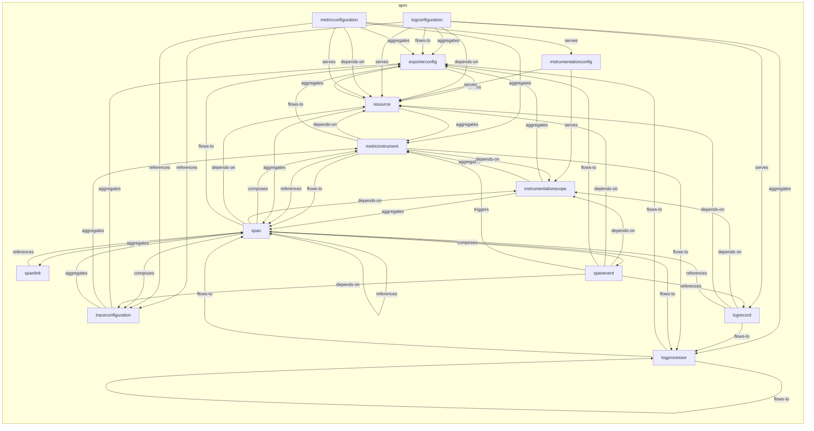
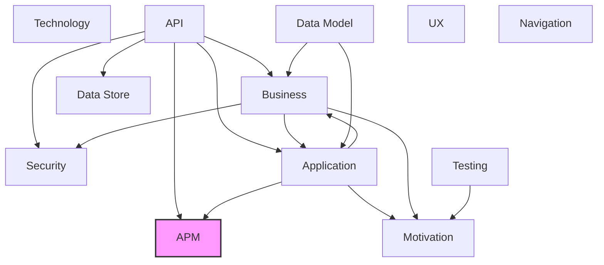

# APM Observability Layer

## Report Index

- [Layer Introduction](#layer-introduction)
- [Intra-Layer Relationships](#intra-layer-relationships)
- [Inter-Layer Dependencies](#inter-layer-dependencies)
- [Inter-Layer Relationships Table](#inter-layer-relationships-table)
- [Node Reference](#node-reference)
  - [Exporterconfig](#exporterconfig)
  - [Instrumentationconfig](#instrumentationconfig)
  - [Instrumentationscope](#instrumentationscope)
  - [Logconfiguration](#logconfiguration)
  - [Logprocessor](#logprocessor)
  - [Logrecord](#logrecord)
  - [Metricconfiguration](#metricconfiguration)
  - [Metricinstrument](#metricinstrument)
  - [Resource](#resource)
  - [Span](#span)
  - [Spanevent](#spanevent)
  - [Spanlink](#spanlink)
  - [Traceconfiguration](#traceconfiguration)

## Layer Introduction

**Layer 11**: APM
**Standard**: [OpenTelemetry](https://opentelemetry.io/)

Layer 11: APM Observability Layer

### Statistics

| Metric                    | Count |
| ------------------------- | ----- |
| Node Types                | 13    |
| Intra-Layer Relationships | 55    |
| Inter-Layer Relationships | 2     |
| Inbound Relationships     | 2     |
| Outbound Relationships    | 0     |

### Layer Dependencies

**Depends On**: [Application](./04-application-layer-report.md), [API](./06-api-layer-report.md)

**Depended On By**: None

## Intra-Layer Relationships

```mermaid
flowchart LR
  subgraph apm
    exporterconfig["exporterconfig"]
    instrumentationconfig["instrumentationconfig"]
    instrumentationscope["instrumentationscope"]
    logconfiguration["logconfiguration"]
    logprocessor["logprocessor"]
    logrecord["logrecord"]
    metricconfiguration["metricconfiguration"]
    metricinstrument["metricinstrument"]
    resource["resource"]
    span["span"]
    spanevent["spanevent"]
    spanlink["spanlink"]
    traceconfiguration["traceconfiguration"]
    exporterconfig -->|serves| resource
    instrumentationconfig -->|serves| instrumentationscope
    instrumentationconfig -->|serves| resource
    instrumentationscope -->|aggregates| exporterconfig
    instrumentationscope -->|aggregates| metricinstrument
    instrumentationscope -->|aggregates| span
    logconfiguration -->|aggregates| exporterconfig
    logconfiguration -->|aggregates| logprocessor
    logconfiguration -->|depends-on| resource
    logconfiguration -->|flows-to| exporterconfig
    logconfiguration -->|references| traceconfiguration
    logconfiguration -->|serves| logrecord
    logconfiguration -->|serves| resource
    logprocessor -->|flows-to| exporterconfig
    logprocessor -->|flows-to| logprocessor
    logprocessor -->|flows-to| span
    logrecord -->|depends-on| instrumentationscope
    logrecord -->|depends-on| resource
    logrecord -->|flows-to| logprocessor
    logrecord -->|references| span
    metricconfiguration -->|aggregates| exporterconfig
    metricconfiguration -->|aggregates| metricinstrument
    metricconfiguration -->|depends-on| resource
    metricconfiguration -->|references| traceconfiguration
    metricconfiguration -->|serves| instrumentationconfig
    metricconfiguration -->|serves| resource
    metricinstrument -->|depends-on| instrumentationscope
    metricinstrument -->|depends-on| resource
    metricinstrument -->|flows-to| exporterconfig
    metricinstrument -->|flows-to| logprocessor
    metricinstrument -->|flows-to| span
    metricinstrument -->|references| span
    resource -->|aggregates| exporterconfig
    resource -->|aggregates| metricinstrument
    resource -->|aggregates| span
    span -->|aggregates| spanlink
    span -->|composes| metricinstrument
    span -->|composes| spanevent
    span -->|composes| traceconfiguration
    span -->|depends-on| instrumentationscope
    span -->|depends-on| resource
    span -->|flows-to| exporterconfig
    span -->|flows-to| logprocessor
    span -->|flows-to| span
    span -->|references| span
    spanevent -->|depends-on| instrumentationscope
    spanevent -->|depends-on| resource
    spanevent -->|depends-on| traceconfiguration
    spanevent -->|flows-to| exporterconfig
    spanevent -->|references| logrecord
    spanevent -->|triggers| metricinstrument
    spanlink -->|references| span
    traceconfiguration -->|aggregates| exporterconfig
    traceconfiguration -->|aggregates| metricinstrument
    traceconfiguration -->|aggregates| span
  end
```

## Inter-Layer Dependencies

```mermaid
flowchart TB
  classDef current fill:#f9f,stroke:#333,stroke-width:2px
  motivation["Motivation"]
  business["Business"]
  security["Security"]
  application["Application"]
  technology["Technology"]
  api["API"]
  data_model["Data Model"]
  data_store["Data Store"]
  ux["UX"]
  navigation["Navigation"]
  apm["APM"]
  testing["Testing"]
  api --> apm
  api --> application
  api --> business
  api --> data_store
  api --> security
  application --> apm
  application --> business
  application --> motivation
  business --> application
  business --> motivation
  business --> security
  data_model --> application
  data_model --> business
  testing --> motivation
  class apm current
```

## Inter-Layer Relationships Table

| Relationship ID                                                  | Source Node                                                               | Dest Node                                                         | Dest Layer                      | Predicate  | Cardinality | Strength |
| ---------------------------------------------------------------- | ------------------------------------------------------------------------- | ----------------------------------------------------------------- | ------------------------------- | ---------- | ----------- | -------- |
| api.operation.references.apm.traceconfiguration                  | [Operation](./06-api-layer-report.md#operation)                           | [Traceconfiguration](./11-apm-layer-report.md#traceconfiguration) | [APM](./11-apm-layer-report.md) | references | many-to-one | medium   |
| application.applicationservice.references.apm.traceconfiguration | [Applicationservice](./04-application-layer-report.md#applicationservice) | [Traceconfiguration](./11-apm-layer-report.md#traceconfiguration) | [APM](./11-apm-layer-report.md) | references | many-to-one | medium   |

## Node Reference

### Exporterconfig {#exporterconfig}

**Spec Node ID**: `apm.exporterconfig`

Configuration for telemetry data export destinations, specifying protocol (OTLP, Jaeger, Prometheus), endpoints, authentication, batching, and retry policies. Controls where observability data is sent.

#### Relationship Metrics

- **Intra-Layer**: Inbound: 10 | Outbound: 1
- **Inter-Layer**: Inbound: 0 | Outbound: 0

#### Intra-Layer Relationships

| Related Node                                  | Predicate  | Direction | Cardinality  |
| --------------------------------------------- | ---------- | --------- | ------------ |
| [Resource](#resource)                         | serves     | outbound  | many-to-many |
| [Instrumentationscope](#instrumentationscope) | aggregates | inbound   | many-to-many |
| [Logconfiguration](#logconfiguration)         | aggregates | inbound   | many-to-one  |
| [Logconfiguration](#logconfiguration)         | flows-to   | inbound   | many-to-one  |
| [Logprocessor](#logprocessor)                 | flows-to   | inbound   | many-to-many |
| [Metricconfiguration](#metricconfiguration)   | aggregates | inbound   | many-to-one  |
| [Metricinstrument](#metricinstrument)         | flows-to   | inbound   | many-to-many |
| [Resource](#resource)                         | aggregates | inbound   | many-to-many |
| [Span](#span)                                 | flows-to   | inbound   | many-to-many |
| [Spanevent](#spanevent)                       | flows-to   | inbound   | many-to-one  |
| [Traceconfiguration](#traceconfiguration)     | aggregates | inbound   | many-to-many |

[Back to Index](#report-index)

### Instrumentationconfig {#instrumentationconfig}

**Spec Node ID**: `apm.instrumentationconfig`

Configuration for OTel instrumentation of application code. Auto-instrumentation uses SDK contrib plugin libraries (e.g., opentelemetry-instrumentation-express) that hook into frameworks transparently at SDK bootstrap time. Manual instrumentation uses direct OTel API calls (Tracer.startSpan, Meter.createCounter) embedded in application code. This node controls which libraries or code paths are instrumented and whether instrumentation is enabled.

#### Relationship Metrics

- **Intra-Layer**: Inbound: 1 | Outbound: 2
- **Inter-Layer**: Inbound: 0 | Outbound: 0

#### Intra-Layer Relationships

| Related Node                                  | Predicate | Direction | Cardinality  |
| --------------------------------------------- | --------- | --------- | ------------ |
| [Instrumentationscope](#instrumentationscope) | serves    | outbound  | many-to-one  |
| [Resource](#resource)                         | serves    | outbound  | many-to-many |
| [Metricconfiguration](#metricconfiguration)   | serves    | inbound   | many-to-one  |

[Back to Index](#report-index)

### Instrumentationscope {#instrumentationscope}

**Spec Node ID**: `apm.instrumentationscope`

Named instrumented library or component that identifies the source of telemetry across all three OTel signal types (traces, metrics, logs), enabling attribution and filtering of signals by their origin.

#### Relationship Metrics

- **Intra-Layer**: Inbound: 5 | Outbound: 3
- **Inter-Layer**: Inbound: 0 | Outbound: 0

#### Intra-Layer Relationships

| Related Node                                    | Predicate  | Direction | Cardinality  |
| ----------------------------------------------- | ---------- | --------- | ------------ |
| [Instrumentationconfig](#instrumentationconfig) | serves     | inbound   | many-to-one  |
| [Exporterconfig](#exporterconfig)               | aggregates | outbound  | many-to-many |
| [Metricinstrument](#metricinstrument)           | aggregates | outbound  | many-to-many |
| [Span](#span)                                   | aggregates | outbound  | many-to-many |
| [Logrecord](#logrecord)                         | depends-on | inbound   | many-to-many |
| [Metricinstrument](#metricinstrument)           | depends-on | inbound   | many-to-many |
| [Span](#span)                                   | depends-on | inbound   | many-to-many |
| [Spanevent](#spanevent)                         | depends-on | inbound   | many-to-one  |

[Back to Index](#report-index)

### Logconfiguration {#logconfiguration}

**Spec Node ID**: `apm.logconfiguration`

OTel LoggerProvider configuration, covering the LogRecordProcessor pipeline, LogRecordExporter wiring, and minimum severity filtering for log emission.

#### Relationship Metrics

- **Intra-Layer**: Inbound: 0 | Outbound: 7
- **Inter-Layer**: Inbound: 0 | Outbound: 0

#### Intra-Layer Relationships

| Related Node                              | Predicate  | Direction | Cardinality |
| ----------------------------------------- | ---------- | --------- | ----------- |
| [Exporterconfig](#exporterconfig)         | aggregates | outbound  | many-to-one |
| [Logprocessor](#logprocessor)             | aggregates | outbound  | many-to-one |
| [Resource](#resource)                     | depends-on | outbound  | many-to-one |
| [Exporterconfig](#exporterconfig)         | flows-to   | outbound  | many-to-one |
| [Traceconfiguration](#traceconfiguration) | references | outbound  | many-to-one |
| [Logrecord](#logrecord)                   | serves     | outbound  | many-to-one |
| [Resource](#resource)                     | serves     | outbound  | many-to-one |

[Back to Index](#report-index)

### Logprocessor {#logprocessor}

**Spec Node ID**: `apm.logprocessor`

A processing pipeline component for log records, enabling filtering, transformation, enrichment, or routing of logs before export. Customizes log processing behavior.

#### Relationship Metrics

- **Intra-Layer**: Inbound: 5 | Outbound: 3
- **Inter-Layer**: Inbound: 0 | Outbound: 0

#### Intra-Layer Relationships

| Related Node                          | Predicate  | Direction | Cardinality  |
| ------------------------------------- | ---------- | --------- | ------------ |
| [Logconfiguration](#logconfiguration) | aggregates | inbound   | many-to-one  |
| [Exporterconfig](#exporterconfig)     | flows-to   | outbound  | many-to-many |
| [Logprocessor](#logprocessor)         | flows-to   | outbound  | many-to-many |
| [Span](#span)                         | flows-to   | outbound  | many-to-many |
| [Logrecord](#logrecord)               | flows-to   | inbound   | many-to-one  |
| [Metricinstrument](#metricinstrument) | flows-to   | inbound   | many-to-many |
| [Span](#span)                         | flows-to   | inbound   | many-to-many |

[Back to Index](#report-index)

### Logrecord {#logrecord}

**Spec Node ID**: `apm.logrecord`

Structured log record in the OTel data model, capturing an event with dual timestamps (timeUnixNano for event occurrence, observedTimeUnixNano for ingestion), a 1–24 severity scale, and an unstructured body. Supports trace context correlation to link logs to distributed traces.

#### Relationship Metrics

- **Intra-Layer**: Inbound: 2 | Outbound: 4
- **Inter-Layer**: Inbound: 0 | Outbound: 0

#### Intra-Layer Relationships

| Related Node                                  | Predicate  | Direction | Cardinality  |
| --------------------------------------------- | ---------- | --------- | ------------ |
| [Logconfiguration](#logconfiguration)         | serves     | inbound   | many-to-one  |
| [Instrumentationscope](#instrumentationscope) | depends-on | outbound  | many-to-many |
| [Resource](#resource)                         | depends-on | outbound  | many-to-many |
| [Logprocessor](#logprocessor)                 | flows-to   | outbound  | many-to-one  |
| [Span](#span)                                 | references | outbound  | many-to-many |
| [Spanevent](#spanevent)                       | references | inbound   | many-to-one  |

[Back to Index](#report-index)

### Metricconfiguration {#metricconfiguration}

**Spec Node ID**: `apm.metricconfiguration`

OTel MeterProvider-level (global) metrics SDK configuration, covering export intervals, cardinality limits, and exemplar filtering. Distinct from per-meter configuration in MeterConfig.

#### Relationship Metrics

- **Intra-Layer**: Inbound: 0 | Outbound: 6
- **Inter-Layer**: Inbound: 0 | Outbound: 0

#### Intra-Layer Relationships

| Related Node                                    | Predicate  | Direction | Cardinality |
| ----------------------------------------------- | ---------- | --------- | ----------- |
| [Exporterconfig](#exporterconfig)               | aggregates | outbound  | many-to-one |
| [Metricinstrument](#metricinstrument)           | aggregates | outbound  | many-to-one |
| [Resource](#resource)                           | depends-on | outbound  | many-to-one |
| [Traceconfiguration](#traceconfiguration)       | references | outbound  | many-to-one |
| [Instrumentationconfig](#instrumentationconfig) | serves     | outbound  | many-to-one |
| [Resource](#resource)                           | serves     | outbound  | many-to-one |

[Back to Index](#report-index)

### Metricinstrument {#metricinstrument}

**Spec Node ID**: `apm.metricinstrument`

Defines a specific metric measurement instrument (Counter, Gauge, Histogram, etc.) with its name, unit, description, and attributes. The fundamental unit of metric collection.

#### Relationship Metrics

- **Intra-Layer**: Inbound: 6 | Outbound: 6
- **Inter-Layer**: Inbound: 0 | Outbound: 0

#### Intra-Layer Relationships

| Related Node                                  | Predicate  | Direction | Cardinality  |
| --------------------------------------------- | ---------- | --------- | ------------ |
| [Instrumentationscope](#instrumentationscope) | aggregates | inbound   | many-to-many |
| [Metricconfiguration](#metricconfiguration)   | aggregates | inbound   | many-to-one  |
| [Instrumentationscope](#instrumentationscope) | depends-on | outbound  | many-to-many |
| [Resource](#resource)                         | depends-on | outbound  | many-to-many |
| [Exporterconfig](#exporterconfig)             | flows-to   | outbound  | many-to-many |
| [Logprocessor](#logprocessor)                 | flows-to   | outbound  | many-to-many |
| [Span](#span)                                 | flows-to   | outbound  | many-to-many |
| [Span](#span)                                 | references | outbound  | many-to-one  |
| [Resource](#resource)                         | aggregates | inbound   | many-to-many |
| [Span](#span)                                 | composes   | inbound   | many-to-many |
| [Spanevent](#spanevent)                       | triggers   | inbound   | many-to-one  |
| [Traceconfiguration](#traceconfiguration)     | aggregates | inbound   | many-to-many |

[Back to Index](#report-index)

### Resource {#resource}

**Spec Node ID**: `apm.resource`

Immutable set of attributes identifying the entity (service, host, process) that produces telemetry. Resource attributes are merged into all signals (traces, metrics, logs) emitted by a process at the SDK level, making accurate resource definition critical for cross-signal correlation.

#### Relationship Metrics

- **Intra-Layer**: Inbound: 10 | Outbound: 3
- **Inter-Layer**: Inbound: 0 | Outbound: 0

#### Intra-Layer Relationships

| Related Node                                    | Predicate  | Direction | Cardinality  |
| ----------------------------------------------- | ---------- | --------- | ------------ |
| [Exporterconfig](#exporterconfig)               | serves     | inbound   | many-to-many |
| [Instrumentationconfig](#instrumentationconfig) | serves     | inbound   | many-to-many |
| [Logconfiguration](#logconfiguration)           | depends-on | inbound   | many-to-one  |
| [Logconfiguration](#logconfiguration)           | serves     | inbound   | many-to-one  |
| [Logrecord](#logrecord)                         | depends-on | inbound   | many-to-many |
| [Metricconfiguration](#metricconfiguration)     | depends-on | inbound   | many-to-one  |
| [Metricconfiguration](#metricconfiguration)     | serves     | inbound   | many-to-one  |
| [Metricinstrument](#metricinstrument)           | depends-on | inbound   | many-to-many |
| [Exporterconfig](#exporterconfig)               | aggregates | outbound  | many-to-many |
| [Metricinstrument](#metricinstrument)           | aggregates | outbound  | many-to-many |
| [Span](#span)                                   | aggregates | outbound  | many-to-many |
| [Span](#span)                                   | depends-on | inbound   | many-to-many |
| [Spanevent](#spanevent)                         | depends-on | inbound   | many-to-one  |

[Back to Index](#report-index)

### Span {#span}

**Spec Node ID**: `apm.span`

Unit of work in distributed tracing

#### Relationship Metrics

- **Intra-Layer**: Inbound: 10 | Outbound: 10
- **Inter-Layer**: Inbound: 0 | Outbound: 0

#### Intra-Layer Relationships

| Related Node                                  | Predicate  | Direction | Cardinality  |
| --------------------------------------------- | ---------- | --------- | ------------ |
| [Instrumentationscope](#instrumentationscope) | aggregates | inbound   | many-to-many |
| [Logprocessor](#logprocessor)                 | flows-to   | inbound   | many-to-many |
| [Logrecord](#logrecord)                       | references | inbound   | many-to-many |
| [Metricinstrument](#metricinstrument)         | flows-to   | inbound   | many-to-many |
| [Metricinstrument](#metricinstrument)         | references | inbound   | many-to-one  |
| [Resource](#resource)                         | aggregates | inbound   | many-to-many |
| [Spanlink](#spanlink)                         | aggregates | outbound  | one-to-many  |
| [Metricinstrument](#metricinstrument)         | composes   | outbound  | many-to-many |
| [Spanevent](#spanevent)                       | composes   | outbound  | many-to-many |
| [Traceconfiguration](#traceconfiguration)     | composes   | outbound  | many-to-many |
| [Instrumentationscope](#instrumentationscope) | depends-on | outbound  | many-to-many |
| [Resource](#resource)                         | depends-on | outbound  | many-to-many |
| [Exporterconfig](#exporterconfig)             | flows-to   | outbound  | many-to-many |
| [Logprocessor](#logprocessor)                 | flows-to   | outbound  | many-to-many |
| [Span](#span)                                 | flows-to   | outbound  | many-to-many |
| [Span](#span)                                 | references | outbound  | many-to-many |
| [Spanlink](#spanlink)                         | references | inbound   | many-to-many |
| [Traceconfiguration](#traceconfiguration)     | aggregates | inbound   | many-to-many |

[Back to Index](#report-index)

### Spanevent {#spanevent}

**Spec Node ID**: `apm.spanevent`

Timestamped annotation within a span's lifetime, used to record significant moments such as exceptions (OTel semantic convention: name='exception' with exception.type, exception.message, and exception.stacktrace attributes) or state transitions.

#### Relationship Metrics

- **Intra-Layer**: Inbound: 1 | Outbound: 6
- **Inter-Layer**: Inbound: 0 | Outbound: 0

#### Intra-Layer Relationships

| Related Node                                  | Predicate  | Direction | Cardinality  |
| --------------------------------------------- | ---------- | --------- | ------------ |
| [Span](#span)                                 | composes   | inbound   | many-to-many |
| [Instrumentationscope](#instrumentationscope) | depends-on | outbound  | many-to-one  |
| [Resource](#resource)                         | depends-on | outbound  | many-to-one  |
| [Traceconfiguration](#traceconfiguration)     | depends-on | outbound  | many-to-one  |
| [Exporterconfig](#exporterconfig)             | flows-to   | outbound  | many-to-one  |
| [Logrecord](#logrecord)                       | references | outbound  | many-to-one  |
| [Metricinstrument](#metricinstrument)         | triggers   | outbound  | many-to-one  |

[Back to Index](#report-index)

### Spanlink {#spanlink}

**Spec Node ID**: `apm.spanlink`

Non-hierarchical causality link to a span in a different trace or batch context (e.g., async message consumer linking to producer spans). Distinct from parent-child relationships, which are expressed via the parentSpanId attribute on the Span.

#### Relationship Metrics

- **Intra-Layer**: Inbound: 1 | Outbound: 1
- **Inter-Layer**: Inbound: 0 | Outbound: 0

#### Intra-Layer Relationships

| Related Node  | Predicate  | Direction | Cardinality  |
| ------------- | ---------- | --------- | ------------ |
| [Span](#span) | aggregates | inbound   | one-to-many  |
| [Span](#span) | references | outbound  | many-to-many |

[Back to Index](#report-index)

### Traceconfiguration {#traceconfiguration}

**Spec Node ID**: `apm.traceconfiguration`

OTel TracerProvider configuration covering sampler selection, context propagation formats, and span processor pipeline. Service identity attributes (serviceName, serviceVersion, deploymentEnvironment) are OTel Resource semantic conventions and belong on the Resource node.

#### Relationship Metrics

- **Intra-Layer**: Inbound: 4 | Outbound: 3
- **Inter-Layer**: Inbound: 2 | Outbound: 0

#### Intra-Layer Relationships

| Related Node                                | Predicate  | Direction | Cardinality  |
| ------------------------------------------- | ---------- | --------- | ------------ |
| [Logconfiguration](#logconfiguration)       | references | inbound   | many-to-one  |
| [Metricconfiguration](#metricconfiguration) | references | inbound   | many-to-one  |
| [Span](#span)                               | composes   | inbound   | many-to-many |
| [Spanevent](#spanevent)                     | depends-on | inbound   | many-to-one  |
| [Exporterconfig](#exporterconfig)           | aggregates | outbound  | many-to-many |
| [Metricinstrument](#metricinstrument)       | aggregates | outbound  | many-to-many |
| [Span](#span)                               | aggregates | outbound  | many-to-many |

#### Inter-Layer Relationships

| Related Node                                                              | Layer                                           | Predicate  | Direction | Cardinality |
| ------------------------------------------------------------------------- | ----------------------------------------------- | ---------- | --------- | ----------- |
| [Operation](./06-api-layer-report.md#operation)                           | [API](./06-api-layer-report.md)                 | references | inbound   | many-to-one |
| [Applicationservice](./04-application-layer-report.md#applicationservice) | [Application](./04-application-layer-report.md) | references | inbound   | many-to-one |

[Back to Index](#report-index)

---

_Generated: 2026-03-05T13:44:20.786Z | Spec Version: 0.8.1 | Generator: generate-layer-reports.ts_
