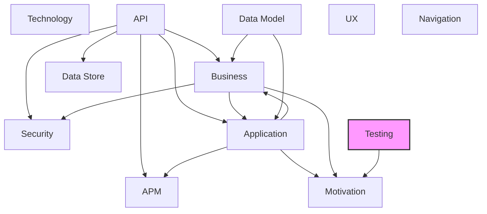

# Testing Layer

## Report Index

- [Layer Introduction](#layer-introduction)
- [Intra-Layer Relationships](#intra-layer-relationships)
- [Inter-Layer Dependencies](#inter-layer-dependencies)
- [Inter-Layer Relationships Table](#inter-layer-relationships-table)
- [Node Reference](#node-reference)
  - [Contextvariation](#contextvariation)
  - [Coverageexclusion](#coverageexclusion)
  - [Coveragegap](#coveragegap)
  - [Coveragerequirement](#coveragerequirement)
  - [Coveragesummary](#coveragesummary)
  - [Environmentfactor](#environmentfactor)
  - [Inputpartitionselection](#inputpartitionselection)
  - [Inputselection](#inputselection)
  - [Inputspacepartition](#inputspacepartition)
  - [Outcomecategory](#outcomecategory)
  - [Partitiondependency](#partitiondependency)
  - [Partitionvalue](#partitionvalue)
  - [Targetcoveragesummary](#targetcoveragesummary)
  - [Targetinputfield](#targetinputfield)
  - [Testcasesketch](#testcasesketch)
  - [Testcoveragemodel](#testcoveragemodel)
  - [Testcoveragetarget](#testcoveragetarget)

## Layer Introduction

**Layer 12**: Testing
**Standard**: [IEEE 829-2008](https://en.wikipedia.org/wiki/IEEE_829)

Layer 12: Testing Layer

### Statistics

| Metric                    | Count |
| ------------------------- | ----- |
| Node Types                | 17    |
| Intra-Layer Relationships | 100   |
| Inter-Layer Relationships | 8     |
| Inbound Relationships     | 0     |
| Outbound Relationships    | 8     |

### Layer Dependencies

**Depends On**: None

**Depended On By**: [Motivation](./01-motivation-layer-report.md)

## Intra-Layer Relationships

```mermaid
flowchart LR
  subgraph testing
    contextvariation["contextvariation"]
    coverageexclusion["coverageexclusion"]
    coveragegap["coveragegap"]
    coveragerequirement["coveragerequirement"]
    coveragesummary["coveragesummary"]
    environmentfactor["environmentfactor"]
    inputpartitionselection["inputpartitionselection"]
    inputselection["inputselection"]
    inputspacepartition["inputspacepartition"]
    outcomecategory["outcomecategory"]
    partitiondependency["partitiondependency"]
    partitionvalue["partitionvalue"]
    targetcoveragesummary["targetcoveragesummary"]
    targetinputfield["targetinputfield"]
    testcasesketch["testcasesketch"]
    testcoveragemodel["testcoveragemodel"]
    testcoveragetarget["testcoveragetarget"]
    contextvariation -->|references| environmentfactor
    contextvariation -->|serves| testcoveragetarget
    coverageexclusion -->|references| coveragerequirement
    coverageexclusion -->|references| testcoveragetarget
    coveragegap -->|flows-to| coverageexclusion
    coveragegap -->|references| testcoveragetarget
    coveragegap -->|triggers| coveragerequirement
    coveragegap -->|triggers| partitionvalue
    coveragerequirement -->|accesses| inputpartitionselection
    coveragerequirement -->|accesses| inputselection
    coveragerequirement -->|aggregates| contextvariation
    coveragerequirement -->|aggregates| coverageexclusion
    coveragerequirement -->|aggregates| partitionvalue
    coveragerequirement -->|composes| inputpartitionselection
    coveragerequirement -->|composes| outcomecategory
    coveragerequirement -->|composes| testcoveragetarget
    coveragerequirement -->|depends-on| contextvariation
    coveragerequirement -->|depends-on| inputspacepartition
    coveragerequirement -->|depends-on| outcomecategory
    coveragerequirement -->|flows-to| coveragerequirement
    coveragerequirement -->|flows-to| testcasesketch
    coveragerequirement -->|references| coveragerequirement
    coveragerequirement -->|references| partitionvalue
    coveragerequirement -->|references| testcoveragetarget
    coveragesummary -->|aggregates| coveragerequirement
    coveragesummary -->|aggregates| targetcoveragesummary
    coveragesummary -->|aggregates| testcasesketch
    coveragesummary -->|aggregates| testcoveragemodel
    coveragesummary -->|depends-on| testcoveragetarget
    coveragesummary -->|references| coverageexclusion
    coveragesummary -->|references| coveragegap
    coveragesummary -->|references| testcoveragemodel
    coveragesummary -->|serves| testcoveragemodel
    coveragesummary -->|validates| coveragerequirement
    environmentfactor -->|composes| contextvariation
    environmentfactor -->|composes| inputspacepartition
    environmentfactor -->|flows-to| coveragesummary
    environmentfactor -->|references| partitionvalue
    environmentfactor -->|serves| coveragerequirement
    environmentfactor -->|serves| testcasesketch
    environmentfactor -->|serves| testcoveragemodel
    inputpartitionselection -->|aggregates| contextvariation
    inputpartitionselection -->|aggregates| partitionvalue
    inputselection -->|references| coveragerequirement
    inputselection -->|references| partitionvalue
    inputselection -->|references| testcoveragetarget
    inputspacepartition -->|composes| partitionvalue
    inputspacepartition -->|depends-on| inputspacepartition
    inputspacepartition -->|serves| testcoveragetarget
    outcomecategory -->|aggregates| testcasesketch
    outcomecategory -->|constrained-by| environmentfactor
    outcomecategory -->|flows-to| coveragesummary
    outcomecategory -->|references| targetinputfield
    outcomecategory -->|serves| coveragerequirement
    partitiondependency -->|references| inputspacepartition
    partitiondependency -->|triggers| coveragerequirement
    partitiondependency -->|triggers| partitionvalue
    partitionvalue -->|composes| inputspacepartition
    partitionvalue -->|constrained-by| coveragerequirement
    partitionvalue -->|depends-on| environmentfactor
    partitionvalue -->|flows-to| outcomecategory
    partitionvalue -->|references| coverageexclusion
    partitionvalue -->|triggers| coveragegap
    targetcoveragesummary -->|references| coverageexclusion
    targetcoveragesummary -->|references| coveragegap
    targetcoveragesummary -->|validates| coveragerequirement
    targetcoveragesummary -->|validates| testcoveragetarget
    targetinputfield -->|aggregates| partitionvalue
    targetinputfield -->|constrained-by| coveragerequirement
    targetinputfield -->|depends-on| contextvariation
    targetinputfield -->|flows-to| inputpartitionselection
    targetinputfield -->|references| inputspacepartition
    targetinputfield -->|references| testcoveragetarget
    testcasesketch -->|accesses| inputpartitionselection
    testcasesketch -->|accesses| inputselection
    testcasesketch -->|depends-on| contextvariation
    testcasesketch -->|depends-on| inputspacepartition
    testcasesketch -->|depends-on| outcomecategory
    testcasesketch -->|references| coveragerequirement
    testcasesketch -->|references| partitionvalue
    testcasesketch -->|references| testcoveragetarget
    testcasesketch -->|tests| coveragerequirement
    testcasesketch -->|validates| coveragerequirement
    testcasesketch -->|validates| testcoveragetarget
    testcoveragemodel -->|aggregates| contextvariation
    testcoveragemodel -->|aggregates| inputspacepartition
    testcoveragemodel -->|aggregates| testcasesketch
    testcoveragemodel -->|composes| coverageexclusion
    testcoveragemodel -->|composes| coveragerequirement
    testcoveragemodel -->|composes| coveragesummary
    testcoveragemodel -->|composes| inputpartitionselection
    testcoveragemodel -->|composes| outcomecategory
    testcoveragemodel -->|composes| testcoveragetarget
    testcoveragetarget -->|aggregates| contextvariation
    testcoveragetarget -->|composes| inputpartitionselection
    testcoveragetarget -->|composes| outcomecategory
    testcoveragetarget -->|composes| targetinputfield
    testcoveragetarget -->|composes| testcoveragetarget
    testcoveragetarget -->|flows-to| coveragerequirement
    testcoveragetarget -->|flows-to| testcasesketch
  end
```

## Inter-Layer Dependencies

## Inter-Layer Relationships Table

| Relationship ID                                                          | Source Node                                                             | Dest Node                                                  | Dest Layer                                    | Predicate              | Cardinality  | Strength |
| ------------------------------------------------------------------------ | ----------------------------------------------------------------------- | ---------------------------------------------------------- | --------------------------------------------- | ---------------------- | ------------ | -------- |
| testing.coveragerequirement.constrained-by.motivation.constraint         | [coveragerequirement](./12-testing-layer-report.md#coveragerequirement) | [constraint](./01-motivation-layer-report.md#constraint)   | [Motivation](./01-motivation-layer-report.md) | constrained-by         | many-to-many | medium   |
| testing.coveragerequirement.fulfills-requirements.motivation.requirement | [coveragerequirement](./12-testing-layer-report.md#coveragerequirement) | [requirement](./01-motivation-layer-report.md#requirement) | [Motivation](./01-motivation-layer-report.md) | fulfills-requirements  | many-to-many | high     |
| testing.testcasesketch.fulfills-requirements.motivation.requirement      | [testcasesketch](./12-testing-layer-report.md#testcasesketch)           | [requirement](./01-motivation-layer-report.md#requirement) | [Motivation](./01-motivation-layer-report.md) | fulfills-requirements  | many-to-many | high     |
| testing.testcasesketch.supports-goals.motivation.goal                    | [testcasesketch](./12-testing-layer-report.md#testcasesketch)           | [goal](./01-motivation-layer-report.md#goal)               | [Motivation](./01-motivation-layer-report.md) | supports-goals         | many-to-many | high     |
| testing.testcoveragemodel.constrained-by.motivation.constraint           | [testcoveragemodel](./12-testing-layer-report.md#testcoveragemodel)     | [constraint](./01-motivation-layer-report.md#constraint)   | [Motivation](./01-motivation-layer-report.md) | constrained-by         | many-to-many | medium   |
| testing.testcoveragemodel.fulfills-requirements.motivation.requirement   | [testcoveragemodel](./12-testing-layer-report.md#testcoveragemodel)     | [requirement](./01-motivation-layer-report.md#requirement) | [Motivation](./01-motivation-layer-report.md) | fulfills-requirements  | many-to-many | high     |
| testing.testcoveragemodel.governed-by-principles.motivation.principle    | [testcoveragemodel](./12-testing-layer-report.md#testcoveragemodel)     | [principle](./01-motivation-layer-report.md#principle)     | [Motivation](./01-motivation-layer-report.md) | governed-by-principles | many-to-many | high     |
| testing.testcoveragemodel.supports-goals.motivation.goal                 | [testcoveragemodel](./12-testing-layer-report.md#testcoveragemodel)     | [goal](./01-motivation-layer-report.md#goal)               | [Motivation](./01-motivation-layer-report.md) | supports-goals         | many-to-many | high     |

## Node Reference

### Contextvariation {#contextvariation}

**Spec Node ID**: `testing.contextvariation`

A distinct test type or environmental context under which a coverage target may be invoked, used to parameterize test design across different execution conditions (functional correctness, load behavior, security posture, regression state). Maps to environmental needs documented in IEEE 829-2008 test design specifications.

#### Relationship Metrics

- **Intra-Layer**: Inbound: 8 | Outbound: 2
- **Inter-Layer**: Inbound: 0 | Outbound: 0

#### Intra-Layer Relationships

| Related Node                                        | Predicate  | Direction | Cardinality  |
| --------------------------------------------------- | ---------- | --------- | ------------ |
| [environmentfactor](#environmentfactor)             | references | outbound  | many-to-one  |
| [testcoveragetarget](#testcoveragetarget)           | serves     | outbound  | many-to-many |
| [coveragerequirement](#coveragerequirement)         | aggregates | inbound   | many-to-many |
| [coveragerequirement](#coveragerequirement)         | depends-on | inbound   | many-to-many |
| [environmentfactor](#environmentfactor)             | composes   | inbound   | many-to-one  |
| [inputpartitionselection](#inputpartitionselection) | aggregates | inbound   | many-to-many |
| [targetinputfield](#targetinputfield)               | depends-on | inbound   | many-to-one  |
| [testcasesketch](#testcasesketch)                   | depends-on | inbound   | many-to-many |
| [testcoveragemodel](#testcoveragemodel)             | aggregates | inbound   | one-to-many  |
| [testcoveragetarget](#testcoveragetarget)           | aggregates | inbound   | many-to-many |

[Back to Index](#report-index)

### Coverageexclusion {#coverageexclusion}

**Spec Node ID**: `testing.coverageexclusion`

A formally approved exclusion of a coverage target or requirement from the test coverage model, documenting the rationale, accepted risk, and accountable approver per test plan scope documentation in IEEE 829-2008.

#### Relationship Metrics

- **Intra-Layer**: Inbound: 6 | Outbound: 2
- **Inter-Layer**: Inbound: 0 | Outbound: 0

#### Intra-Layer Relationships

| Related Node                                    | Predicate  | Direction | Cardinality |
| ----------------------------------------------- | ---------- | --------- | ----------- |
| [coveragerequirement](#coveragerequirement)     | references | outbound  | many-to-one |
| [testcoveragetarget](#testcoveragetarget)       | references | outbound  | many-to-one |
| [coveragegap](#coveragegap)                     | flows-to   | inbound   | many-to-one |
| [coveragerequirement](#coveragerequirement)     | aggregates | inbound   | many-to-one |
| [coveragesummary](#coveragesummary)             | references | inbound   | many-to-one |
| [partitionvalue](#partitionvalue)               | references | inbound   | many-to-one |
| [targetcoveragesummary](#targetcoveragesummary) | references | inbound   | many-to-one |
| [testcoveragemodel](#testcoveragemodel)         | composes   | inbound   | many-to-one |

[Back to Index](#report-index)

### Coveragegap {#coveragegap}

**Spec Node ID**: `testing.coveragegap`

An identified deficit between required and achieved test coverage for a target or requirement, typically surfaced during test summary reporting per IEEE 829-2008. Gaps require remediation, risk acceptance (CoverageExclusion), or deferral.

#### Relationship Metrics

- **Intra-Layer**: Inbound: 3 | Outbound: 4
- **Inter-Layer**: Inbound: 0 | Outbound: 0

#### Intra-Layer Relationships

| Related Node                                    | Predicate  | Direction | Cardinality  |
| ----------------------------------------------- | ---------- | --------- | ------------ |
| [coverageexclusion](#coverageexclusion)         | flows-to   | outbound  | many-to-one  |
| [testcoveragetarget](#testcoveragetarget)       | references | outbound  | many-to-one  |
| [coveragerequirement](#coveragerequirement)     | triggers   | outbound  | many-to-many |
| [partitionvalue](#partitionvalue)               | triggers   | outbound  | many-to-many |
| [coveragesummary](#coveragesummary)             | references | inbound   | many-to-one  |
| [partitionvalue](#partitionvalue)               | triggers   | inbound   | many-to-one  |
| [targetcoveragesummary](#targetcoveragesummary) | references | inbound   | many-to-one  |

[Back to Index](#report-index)

### Coveragerequirement {#coveragerequirement}

**Spec Node ID**: `testing.coveragerequirement`

A specification of coverage criteria that must be satisfied for a TestCoverageTarget, defining which input partitions, context variations, and outcome categories must be exercised, per test design specification requirements in IEEE 829-2008.

#### Relationship Metrics

- **Intra-Layer**: Inbound: 18 | Outbound: 16
- **Inter-Layer**: Inbound: 0 | Outbound: 2

#### Intra-Layer Relationships

| Related Node                                        | Predicate      | Direction | Cardinality  |
| --------------------------------------------------- | -------------- | --------- | ------------ |
| [coverageexclusion](#coverageexclusion)             | references     | inbound   | many-to-one  |
| [coveragegap](#coveragegap)                         | triggers       | inbound   | many-to-many |
| [inputpartitionselection](#inputpartitionselection) | accesses       | outbound  | many-to-many |
| [inputselection](#inputselection)                   | accesses       | outbound  | many-to-many |
| [contextvariation](#contextvariation)               | aggregates     | outbound  | many-to-many |
| [coverageexclusion](#coverageexclusion)             | aggregates     | outbound  | many-to-one  |
| [partitionvalue](#partitionvalue)                   | aggregates     | outbound  | many-to-many |
| [inputpartitionselection](#inputpartitionselection) | composes       | outbound  | many-to-many |
| [outcomecategory](#outcomecategory)                 | composes       | outbound  | many-to-many |
| [testcoveragetarget](#testcoveragetarget)           | composes       | outbound  | many-to-many |
| [contextvariation](#contextvariation)               | depends-on     | outbound  | many-to-many |
| [inputspacepartition](#inputspacepartition)         | depends-on     | outbound  | many-to-many |
| [outcomecategory](#outcomecategory)                 | depends-on     | outbound  | many-to-many |
| [coveragerequirement](#coveragerequirement)         | flows-to       | outbound  | many-to-many |
| [testcasesketch](#testcasesketch)                   | flows-to       | outbound  | many-to-many |
| [coveragerequirement](#coveragerequirement)         | references     | outbound  | many-to-many |
| [partitionvalue](#partitionvalue)                   | references     | outbound  | many-to-many |
| [testcoveragetarget](#testcoveragetarget)           | references     | outbound  | many-to-many |
| [coveragesummary](#coveragesummary)                 | aggregates     | inbound   | many-to-one  |
| [coveragesummary](#coveragesummary)                 | validates      | inbound   | many-to-one  |
| [environmentfactor](#environmentfactor)             | serves         | inbound   | many-to-one  |
| [inputselection](#inputselection)                   | references     | inbound   | many-to-many |
| [outcomecategory](#outcomecategory)                 | serves         | inbound   | many-to-one  |
| [partitiondependency](#partitiondependency)         | triggers       | inbound   | many-to-many |
| [partitionvalue](#partitionvalue)                   | constrained-by | inbound   | many-to-one  |
| [targetcoveragesummary](#targetcoveragesummary)     | validates      | inbound   | many-to-many |
| [targetinputfield](#targetinputfield)               | constrained-by | inbound   | many-to-one  |
| [testcasesketch](#testcasesketch)                   | references     | inbound   | many-to-many |
| [testcasesketch](#testcasesketch)                   | tests          | inbound   | many-to-one  |
| [testcasesketch](#testcasesketch)                   | validates      | inbound   | many-to-many |
| [testcoveragemodel](#testcoveragemodel)             | composes       | inbound   | many-to-one  |
| [testcoveragetarget](#testcoveragetarget)           | flows-to       | inbound   | many-to-many |

#### Inter-Layer Relationships

| Related Node                                               | Layer                                         | Predicate             | Direction | Cardinality  |
| ---------------------------------------------------------- | --------------------------------------------- | --------------------- | --------- | ------------ |
| [constraint](./01-motivation-layer-report.md#constraint)   | [Motivation](./01-motivation-layer-report.md) | constrained-by        | outbound  | many-to-many |
| [requirement](./01-motivation-layer-report.md#requirement) | [Motivation](./01-motivation-layer-report.md) | fulfills-requirements | outbound  | many-to-many |

[Back to Index](#report-index)

### Coveragesummary {#coveragesummary}

**Spec Node ID**: `testing.coveragesummary`

Aggregated coverage status across all targets and requirements within a test coverage model, suitable for test summary reporting.

#### Relationship Metrics

- **Intra-Layer**: Inbound: 3 | Outbound: 10
- **Inter-Layer**: Inbound: 0 | Outbound: 0

#### Intra-Layer Relationships

| Related Node                                    | Predicate  | Direction | Cardinality |
| ----------------------------------------------- | ---------- | --------- | ----------- |
| [coveragerequirement](#coveragerequirement)     | aggregates | outbound  | many-to-one |
| [targetcoveragesummary](#targetcoveragesummary) | aggregates | outbound  | many-to-one |
| [testcasesketch](#testcasesketch)               | aggregates | outbound  | many-to-one |
| [testcoveragemodel](#testcoveragemodel)         | aggregates | outbound  | many-to-one |
| [testcoveragetarget](#testcoveragetarget)       | depends-on | outbound  | many-to-one |
| [coverageexclusion](#coverageexclusion)         | references | outbound  | many-to-one |
| [coveragegap](#coveragegap)                     | references | outbound  | many-to-one |
| [testcoveragemodel](#testcoveragemodel)         | references | outbound  | many-to-one |
| [testcoveragemodel](#testcoveragemodel)         | serves     | outbound  | many-to-one |
| [coveragerequirement](#coveragerequirement)     | validates  | outbound  | many-to-one |
| [environmentfactor](#environmentfactor)         | flows-to   | inbound   | many-to-one |
| [outcomecategory](#outcomecategory)             | flows-to   | inbound   | many-to-one |
| [testcoveragemodel](#testcoveragemodel)         | composes   | inbound   | many-to-one |

[Back to Index](#report-index)

### Environmentfactor {#environmentfactor}

**Spec Node ID**: `testing.environmentfactor`

A specific environmental variable (OS version, network latency, locale setting, hardware configuration, dependency version) documented as affecting test behavior. Used to parameterize ContextVariation instances with concrete environmental constraints per IEEE 829-2008 environmental needs specification.

#### Relationship Metrics

- **Intra-Layer**: Inbound: 3 | Outbound: 7
- **Inter-Layer**: Inbound: 0 | Outbound: 0

#### Intra-Layer Relationships

| Related Node                                | Predicate      | Direction | Cardinality |
| ------------------------------------------- | -------------- | --------- | ----------- |
| [contextvariation](#contextvariation)       | references     | inbound   | many-to-one |
| [contextvariation](#contextvariation)       | composes       | outbound  | many-to-one |
| [inputspacepartition](#inputspacepartition) | composes       | outbound  | many-to-one |
| [coveragesummary](#coveragesummary)         | flows-to       | outbound  | many-to-one |
| [partitionvalue](#partitionvalue)           | references     | outbound  | many-to-one |
| [coveragerequirement](#coveragerequirement) | serves         | outbound  | many-to-one |
| [testcasesketch](#testcasesketch)           | serves         | outbound  | many-to-one |
| [testcoveragemodel](#testcoveragemodel)     | serves         | outbound  | many-to-one |
| [outcomecategory](#outcomecategory)         | constrained-by | inbound   | many-to-one |
| [partitionvalue](#partitionvalue)           | depends-on     | inbound   | many-to-one |

[Back to Index](#report-index)

### Inputpartitionselection {#inputpartitionselection}

**Spec Node ID**: `testing.inputpartitionselection`

A specification of which values from an InputSpacePartition must be exercised within a CoverageRequirement, supporting selective coverage of equivalence classes per IEEE 829-2008 test design specification. When coverAllCategories is true, all partition values are included except those in excludeValues; otherwise, only the values listed in coverValues are included.

#### Relationship Metrics

- **Intra-Layer**: Inbound: 6 | Outbound: 2
- **Inter-Layer**: Inbound: 0 | Outbound: 0

#### Intra-Layer Relationships

| Related Node                                | Predicate  | Direction | Cardinality  |
| ------------------------------------------- | ---------- | --------- | ------------ |
| [coveragerequirement](#coveragerequirement) | accesses   | inbound   | many-to-many |
| [coveragerequirement](#coveragerequirement) | composes   | inbound   | many-to-many |
| [contextvariation](#contextvariation)       | aggregates | outbound  | many-to-many |
| [partitionvalue](#partitionvalue)           | aggregates | outbound  | many-to-many |
| [targetinputfield](#targetinputfield)       | flows-to   | inbound   | many-to-one  |
| [testcasesketch](#testcasesketch)           | accesses   | inbound   | many-to-many |
| [testcoveragemodel](#testcoveragemodel)     | composes   | inbound   | many-to-many |
| [testcoveragetarget](#testcoveragetarget)   | composes   | inbound   | many-to-many |

[Back to Index](#report-index)

### Inputselection {#inputselection}

**Spec Node ID**: `testing.inputselection`

A concrete input value assignment for a TestCaseSketch, binding an abstract partition representative value (selectedValue) to a specific concrete test datum (concreteValue), per test case input specification in IEEE 829-2008.

#### Relationship Metrics

- **Intra-Layer**: Inbound: 2 | Outbound: 3
- **Inter-Layer**: Inbound: 0 | Outbound: 0

#### Intra-Layer Relationships

| Related Node                                | Predicate  | Direction | Cardinality  |
| ------------------------------------------- | ---------- | --------- | ------------ |
| [coveragerequirement](#coveragerequirement) | accesses   | inbound   | many-to-many |
| [coveragerequirement](#coveragerequirement) | references | outbound  | many-to-many |
| [partitionvalue](#partitionvalue)           | references | outbound  | many-to-many |
| [testcoveragetarget](#testcoveragetarget)   | references | outbound  | many-to-many |
| [testcasesketch](#testcasesketch)           | accesses   | inbound   | many-to-many |

[Back to Index](#report-index)

### Inputspacepartition {#inputspacepartition}

**Spec Node ID**: `testing.inputspacepartition`

Partitioning of an input dimension into testable equivalence classes, where each entry in the partitions array represents a PartitionValue (an equivalence class with a label, category, and representative value), enabling structured coverage analysis per IEEE 829-2008 equivalence partitioning guidance.

#### Relationship Metrics

- **Intra-Layer**: Inbound: 8 | Outbound: 3
- **Inter-Layer**: Inbound: 0 | Outbound: 0

#### Intra-Layer Relationships

| Related Node                                | Predicate  | Direction | Cardinality  |
| ------------------------------------------- | ---------- | --------- | ------------ |
| [coveragerequirement](#coveragerequirement) | depends-on | inbound   | many-to-many |
| [environmentfactor](#environmentfactor)     | composes   | inbound   | many-to-one  |
| [partitionvalue](#partitionvalue)           | composes   | outbound  | one-to-many  |
| [inputspacepartition](#inputspacepartition) | depends-on | outbound  | many-to-many |
| [testcoveragetarget](#testcoveragetarget)   | serves     | outbound  | many-to-many |
| [partitiondependency](#partitiondependency) | references | inbound   | many-to-one  |
| [partitionvalue](#partitionvalue)           | composes   | inbound   | many-to-one  |
| [targetinputfield](#targetinputfield)       | references | inbound   | many-to-one  |
| [testcasesketch](#testcasesketch)           | depends-on | inbound   | many-to-many |
| [testcoveragemodel](#testcoveragemodel)     | aggregates | inbound   | one-to-many  |

[Back to Index](#report-index)

### Outcomecategory {#outcomecategory}

**Spec Node ID**: `testing.outcomecategory`

An abstract category of observable outcomes (e.g., success, validation error, authorization error, timeout) associated with a TestCoverageTarget, used during test design to organize expected results before test case specification per IEEE 829-2008. Distinguished from specific assertions — OutcomeCategory defines the class of outcome, not the exact expected value.

#### Relationship Metrics

- **Intra-Layer**: Inbound: 6 | Outbound: 5
- **Inter-Layer**: Inbound: 0 | Outbound: 0

#### Intra-Layer Relationships

| Related Node                                | Predicate      | Direction | Cardinality  |
| ------------------------------------------- | -------------- | --------- | ------------ |
| [coveragerequirement](#coveragerequirement) | composes       | inbound   | many-to-many |
| [coveragerequirement](#coveragerequirement) | depends-on     | inbound   | many-to-many |
| [testcasesketch](#testcasesketch)           | aggregates     | outbound  | many-to-one  |
| [environmentfactor](#environmentfactor)     | constrained-by | outbound  | many-to-one  |
| [coveragesummary](#coveragesummary)         | flows-to       | outbound  | many-to-one  |
| [targetinputfield](#targetinputfield)       | references     | outbound  | many-to-one  |
| [coveragerequirement](#coveragerequirement) | serves         | outbound  | many-to-one  |
| [partitionvalue](#partitionvalue)           | flows-to       | inbound   | many-to-one  |
| [testcasesketch](#testcasesketch)           | depends-on     | inbound   | many-to-many |
| [testcoveragemodel](#testcoveragemodel)     | composes       | inbound   | many-to-many |
| [testcoveragetarget](#testcoveragetarget)   | composes       | inbound   | many-to-many |

[Back to Index](#report-index)

### Partitiondependency {#partitiondependency}

**Spec Node ID**: `testing.partitiondependency`

A constraint specifying how selection of a partition value in one field affects valid or available partition values in another field, enabling combinatorial test design to avoid invalid input combinations per IEEE 829-2008 test design specification.

#### Relationship Metrics

- **Intra-Layer**: Inbound: 0 | Outbound: 3
- **Inter-Layer**: Inbound: 0 | Outbound: 0

#### Intra-Layer Relationships

| Related Node                                | Predicate  | Direction | Cardinality  |
| ------------------------------------------- | ---------- | --------- | ------------ |
| [inputspacepartition](#inputspacepartition) | references | outbound  | many-to-one  |
| [coveragerequirement](#coveragerequirement) | triggers   | outbound  | many-to-many |
| [partitionvalue](#partitionvalue)           | triggers   | outbound  | many-to-many |

[Back to Index](#report-index)

### Partitionvalue {#partitionvalue}

**Spec Node ID**: `testing.partitionvalue`

An individual equivalence class within an InputSpacePartition, characterized by a label, representative value, and optional constraint expression, used to enumerate the testable categories of an input dimension per IEEE 829-2008 test design specification.

#### Relationship Metrics

- **Intra-Layer**: Inbound: 10 | Outbound: 6
- **Inter-Layer**: Inbound: 0 | Outbound: 0

#### Intra-Layer Relationships

| Related Node                                        | Predicate      | Direction | Cardinality  |
| --------------------------------------------------- | -------------- | --------- | ------------ |
| [coveragegap](#coveragegap)                         | triggers       | inbound   | many-to-many |
| [coveragerequirement](#coveragerequirement)         | aggregates     | inbound   | many-to-many |
| [coveragerequirement](#coveragerequirement)         | references     | inbound   | many-to-many |
| [environmentfactor](#environmentfactor)             | references     | inbound   | many-to-one  |
| [inputpartitionselection](#inputpartitionselection) | aggregates     | inbound   | many-to-many |
| [inputselection](#inputselection)                   | references     | inbound   | many-to-many |
| [inputspacepartition](#inputspacepartition)         | composes       | inbound   | one-to-many  |
| [partitiondependency](#partitiondependency)         | triggers       | inbound   | many-to-many |
| [inputspacepartition](#inputspacepartition)         | composes       | outbound  | many-to-one  |
| [coveragerequirement](#coveragerequirement)         | constrained-by | outbound  | many-to-one  |
| [environmentfactor](#environmentfactor)             | depends-on     | outbound  | many-to-one  |
| [outcomecategory](#outcomecategory)                 | flows-to       | outbound  | many-to-one  |
| [coverageexclusion](#coverageexclusion)             | references     | outbound  | many-to-one  |
| [coveragegap](#coveragegap)                         | triggers       | outbound  | many-to-one  |
| [targetinputfield](#targetinputfield)               | aggregates     | inbound   | many-to-one  |
| [testcasesketch](#testcasesketch)                   | references     | inbound   | many-to-many |

[Back to Index](#report-index)

### Targetcoveragesummary {#targetcoveragesummary}

**Spec Node ID**: `testing.targetcoveragesummary`

Coverage metrics summary for a single test coverage target

#### Relationship Metrics

- **Intra-Layer**: Inbound: 1 | Outbound: 4
- **Inter-Layer**: Inbound: 0 | Outbound: 0

#### Intra-Layer Relationships

| Related Node                                | Predicate  | Direction | Cardinality  |
| ------------------------------------------- | ---------- | --------- | ------------ |
| [coveragesummary](#coveragesummary)         | aggregates | inbound   | many-to-one  |
| [coverageexclusion](#coverageexclusion)     | references | outbound  | many-to-one  |
| [coveragegap](#coveragegap)                 | references | outbound  | many-to-one  |
| [coveragerequirement](#coveragerequirement) | validates  | outbound  | many-to-many |
| [testcoveragetarget](#testcoveragetarget)   | validates  | outbound  | many-to-many |

[Back to Index](#report-index)

### Targetinputfield {#targetinputfield}

**Spec Node ID**: `testing.targetinputfield`

An association between a TestCoverageTarget and a specific input field of the target artifact, defining which InputSpacePartition applies to that field and documenting its coverage relevance per IEEE 829-2008 test case specification.

#### Relationship Metrics

- **Intra-Layer**: Inbound: 2 | Outbound: 6
- **Inter-Layer**: Inbound: 0 | Outbound: 0

#### Intra-Layer Relationships

| Related Node                                        | Predicate      | Direction | Cardinality |
| --------------------------------------------------- | -------------- | --------- | ----------- |
| [outcomecategory](#outcomecategory)                 | references     | inbound   | many-to-one |
| [partitionvalue](#partitionvalue)                   | aggregates     | outbound  | many-to-one |
| [coveragerequirement](#coveragerequirement)         | constrained-by | outbound  | many-to-one |
| [contextvariation](#contextvariation)               | depends-on     | outbound  | many-to-one |
| [inputpartitionselection](#inputpartitionselection) | flows-to       | outbound  | many-to-one |
| [inputspacepartition](#inputspacepartition)         | references     | outbound  | many-to-one |
| [testcoveragetarget](#testcoveragetarget)           | references     | outbound  | many-to-one |
| [testcoveragetarget](#testcoveragetarget)           | composes       | inbound   | many-to-one |

[Back to Index](#report-index)

### Testcasesketch {#testcasesketch}

**Spec Node ID**: `testing.testcasesketch`

A design-time test case specification that selects concrete input partition values for a CoverageRequirement, serving as the bridge between test design (InputPartitionSelection) and executable test case specification per IEEE 829-2008. Exists in sketch (unimplemented) or implemented status — not yet tied to a specific test runner or execution framework.

#### Relationship Metrics

- **Intra-Layer**: Inbound: 6 | Outbound: 11
- **Inter-Layer**: Inbound: 0 | Outbound: 2

#### Intra-Layer Relationships

| Related Node                                        | Predicate  | Direction | Cardinality  |
| --------------------------------------------------- | ---------- | --------- | ------------ |
| [coveragerequirement](#coveragerequirement)         | flows-to   | inbound   | many-to-many |
| [coveragesummary](#coveragesummary)                 | aggregates | inbound   | many-to-one  |
| [environmentfactor](#environmentfactor)             | serves     | inbound   | many-to-one  |
| [outcomecategory](#outcomecategory)                 | aggregates | inbound   | many-to-one  |
| [inputpartitionselection](#inputpartitionselection) | accesses   | outbound  | many-to-many |
| [inputselection](#inputselection)                   | accesses   | outbound  | many-to-many |
| [contextvariation](#contextvariation)               | depends-on | outbound  | many-to-many |
| [inputspacepartition](#inputspacepartition)         | depends-on | outbound  | many-to-many |
| [outcomecategory](#outcomecategory)                 | depends-on | outbound  | many-to-many |
| [coveragerequirement](#coveragerequirement)         | references | outbound  | many-to-many |
| [partitionvalue](#partitionvalue)                   | references | outbound  | many-to-many |
| [testcoveragetarget](#testcoveragetarget)           | references | outbound  | many-to-many |
| [coveragerequirement](#coveragerequirement)         | tests      | outbound  | many-to-one  |
| [coveragerequirement](#coveragerequirement)         | validates  | outbound  | many-to-many |
| [testcoveragetarget](#testcoveragetarget)           | validates  | outbound  | many-to-many |
| [testcoveragemodel](#testcoveragemodel)             | aggregates | inbound   | one-to-many  |
| [testcoveragetarget](#testcoveragetarget)           | flows-to   | inbound   | many-to-many |

#### Inter-Layer Relationships

| Related Node                                               | Layer                                         | Predicate             | Direction | Cardinality  |
| ---------------------------------------------------------- | --------------------------------------------- | --------------------- | --------- | ------------ |
| [requirement](./01-motivation-layer-report.md#requirement) | [Motivation](./01-motivation-layer-report.md) | fulfills-requirements | outbound  | many-to-many |
| [goal](./01-motivation-layer-report.md#goal)               | [Motivation](./01-motivation-layer-report.md) | supports-goals        | outbound  | many-to-many |

[Back to Index](#report-index)

### Testcoveragemodel {#testcoveragemodel}

**Spec Node ID**: `testing.testcoveragemodel`

The root artifact of a testing layer coverage specification, aggregating all TestCoverageTargets, InputSpacePartitions, ContextVariations, CoverageRequirements, and TestCaseSketches for an application. Corresponds to the test plan document structure in IEEE 829-2008, providing a single point of reference for coverage governance.

#### Relationship Metrics

- **Intra-Layer**: Inbound: 4 | Outbound: 9
- **Inter-Layer**: Inbound: 0 | Outbound: 4

#### Intra-Layer Relationships

| Related Node                                        | Predicate  | Direction | Cardinality  |
| --------------------------------------------------- | ---------- | --------- | ------------ |
| [coveragesummary](#coveragesummary)                 | aggregates | inbound   | many-to-one  |
| [coveragesummary](#coveragesummary)                 | references | inbound   | many-to-one  |
| [coveragesummary](#coveragesummary)                 | serves     | inbound   | many-to-one  |
| [environmentfactor](#environmentfactor)             | serves     | inbound   | many-to-one  |
| [contextvariation](#contextvariation)               | aggregates | outbound  | one-to-many  |
| [inputspacepartition](#inputspacepartition)         | aggregates | outbound  | one-to-many  |
| [testcasesketch](#testcasesketch)                   | aggregates | outbound  | one-to-many  |
| [coverageexclusion](#coverageexclusion)             | composes   | outbound  | many-to-one  |
| [coveragerequirement](#coveragerequirement)         | composes   | outbound  | many-to-one  |
| [coveragesummary](#coveragesummary)                 | composes   | outbound  | many-to-one  |
| [inputpartitionselection](#inputpartitionselection) | composes   | outbound  | many-to-many |
| [outcomecategory](#outcomecategory)                 | composes   | outbound  | many-to-many |
| [testcoveragetarget](#testcoveragetarget)           | composes   | outbound  | many-to-many |

#### Inter-Layer Relationships

| Related Node                                               | Layer                                         | Predicate              | Direction | Cardinality  |
| ---------------------------------------------------------- | --------------------------------------------- | ---------------------- | --------- | ------------ |
| [constraint](./01-motivation-layer-report.md#constraint)   | [Motivation](./01-motivation-layer-report.md) | constrained-by         | outbound  | many-to-many |
| [requirement](./01-motivation-layer-report.md#requirement) | [Motivation](./01-motivation-layer-report.md) | fulfills-requirements  | outbound  | many-to-many |
| [principle](./01-motivation-layer-report.md#principle)     | [Motivation](./01-motivation-layer-report.md) | governed-by-principles | outbound  | many-to-many |
| [goal](./01-motivation-layer-report.md#goal)               | [Motivation](./01-motivation-layer-report.md) | supports-goals         | outbound  | many-to-many |

[Back to Index](#report-index)

### Testcoveragetarget {#testcoveragetarget}

**Spec Node ID**: `testing.testcoveragetarget`

An artifact or functionality that requires test coverage

#### Relationship Metrics

- **Intra-Layer**: Inbound: 14 | Outbound: 7
- **Inter-Layer**: Inbound: 0 | Outbound: 0

#### Intra-Layer Relationships

| Related Node                                        | Predicate  | Direction | Cardinality  |
| --------------------------------------------------- | ---------- | --------- | ------------ |
| [contextvariation](#contextvariation)               | serves     | inbound   | many-to-many |
| [coverageexclusion](#coverageexclusion)             | references | inbound   | many-to-one  |
| [coveragegap](#coveragegap)                         | references | inbound   | many-to-one  |
| [coveragerequirement](#coveragerequirement)         | composes   | inbound   | many-to-many |
| [coveragerequirement](#coveragerequirement)         | references | inbound   | many-to-many |
| [coveragesummary](#coveragesummary)                 | depends-on | inbound   | many-to-one  |
| [inputselection](#inputselection)                   | references | inbound   | many-to-many |
| [inputspacepartition](#inputspacepartition)         | serves     | inbound   | many-to-many |
| [targetcoveragesummary](#targetcoveragesummary)     | validates  | inbound   | many-to-many |
| [targetinputfield](#targetinputfield)               | references | inbound   | many-to-one  |
| [testcasesketch](#testcasesketch)                   | references | inbound   | many-to-many |
| [testcasesketch](#testcasesketch)                   | validates  | inbound   | many-to-many |
| [testcoveragemodel](#testcoveragemodel)             | composes   | inbound   | many-to-many |
| [contextvariation](#contextvariation)               | aggregates | outbound  | many-to-many |
| [inputpartitionselection](#inputpartitionselection) | composes   | outbound  | many-to-many |
| [outcomecategory](#outcomecategory)                 | composes   | outbound  | many-to-many |
| [targetinputfield](#targetinputfield)               | composes   | outbound  | many-to-one  |
| [testcoveragetarget](#testcoveragetarget)           | composes   | outbound  | many-to-many |
| [coveragerequirement](#coveragerequirement)         | flows-to   | outbound  | many-to-many |
| [testcasesketch](#testcasesketch)                   | flows-to   | outbound  | many-to-many |

[Back to Index](#report-index)

---

_Generated: 2026-02-28T12:48:58.615Z | Spec Version: 0.8.0 | Generator: generate-layer-reports.ts_
