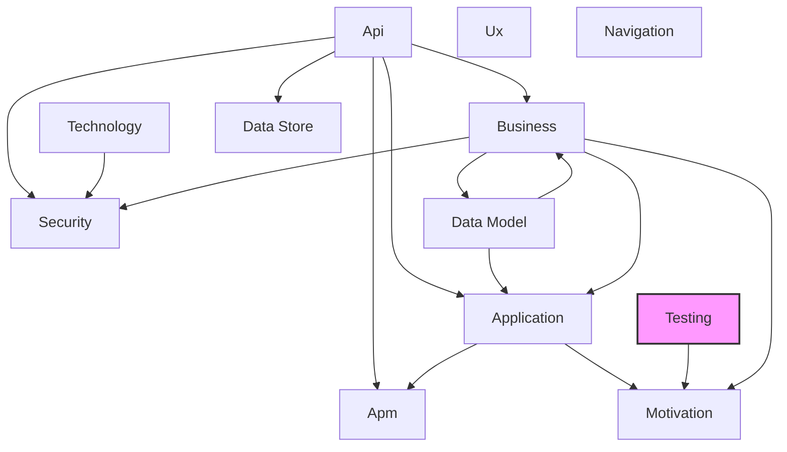

# Testing Layer

## Report Index

- [Layer Introduction](#layer-introduction)
- [Intra-Layer Relationships](#intra-layer-relationships)
- [Inter-Layer Dependencies](#inter-layer-dependencies)
- [Inter-Layer Relationships Table](#inter-layer-relationships-table)
- [Node Reference](#node-reference)
  - [Partitiondependency](#partitiondependency)
  - [Inputselection](#inputselection)
  - [Coverageexclusion](#coverageexclusion)
  - [Testcasesketch](#testcasesketch)
  - [Contextvariation](#contextvariation)
  - [Testcoveragemodel](#testcoveragemodel)
  - [Priority](#priority)
  - [Environmentfactor](#environmentfactor)
  - [Gapseverity](#gapseverity)
  - [Targettype](#targettype)
  - [Inputspacepartition](#inputspacepartition)
  - [Partitionvalue](#partitionvalue)
  - [Fieldrelevance](#fieldrelevance)
  - [Targetcoveragesummary](#targetcoveragesummary)
  - [Outcometype](#outcometype)
  - [Inputpartitionselection](#inputpartitionselection)
  - [Partitioncategory](#partitioncategory)
  - [Coveragegap](#coveragegap)
  - [Testcoveragetarget](#testcoveragetarget)
  - [Coveragerequirement](#coveragerequirement)
  - [Contexttype](#contexttype)
  - [Outcomecategory](#outcomecategory)
  - [Targetinputfield](#targetinputfield)
  - [Implementationformat](#implementationformat)
  - [Coveragecriteria](#coveragecriteria)
  - [Coveragesummary](#coveragesummary)
  - [Presencerule](#presencerule)
  - [Dependencyeffect](#dependencyeffect)
  - [Sketchstatus](#sketchstatus)

## Layer Introduction

**Layer 12**: Testing
**Standard**: [IEEE 829-2008](https://en.wikipedia.org/wiki/IEEE_829)

Layer 12: Testing Layer

### Statistics

| Metric                    | Count |
| ------------------------- | ----- |
| Node Types                | 29    |
| Intra-Layer Relationships | 46    |
| Inter-Layer Relationships | 8     |
| Inbound Relationships     | 0     |
| Outbound Relationships    | 8     |

### Layer Dependencies

**Depends On**: None
**Depended On By**: [Motivation](./01-motivation-layer-report.md)

## Intra-Layer Relationships

```mermaid
flowchart LR
  subgraph testing
    partitiondependency["partitiondependency"]
    inputselection["inputselection"]
    coverageexclusion["coverageexclusion"]
    testcasesketch["testcasesketch"]
    contextvariation["contextvariation"]
    testcoveragemodel["testcoveragemodel"]
    priority["priority"]
    environmentfactor["environmentfactor"]
    gapseverity["gapseverity"]
    targettype["targettype"]
    inputspacepartition["inputspacepartition"]
    partitionvalue["partitionvalue"]
    fieldrelevance["fieldrelevance"]
    targetcoveragesummary["targetcoveragesummary"]
    outcometype["outcometype"]
    inputpartitionselection["inputpartitionselection"]
    partitioncategory["partitioncategory"]
    coveragegap["coveragegap"]
    testcoveragetarget["testcoveragetarget"]
    coveragerequirement["coveragerequirement"]
    contexttype["contexttype"]
    outcomecategory["outcomecategory"]
    targetinputfield["targetinputfield"]
    implementationformat["implementationformat"]
    coveragecriteria["coveragecriteria"]
    coveragesummary["coveragesummary"]
    presencerule["presencerule"]
    dependencyeffect["dependencyeffect"]
    sketchstatus["sketchstatus"]
    coveragerequirement -->|flows-to| coveragerequirement
    testcasesketch -->|accesses| inputpartitionselection
    coveragerequirement -->|aggregates| partitionvalue
    testcoveragemodel -->|composes| testcoveragetarget
    coveragerequirement -->|aggregates| contextvariation
    coveragerequirement -->|composes| inputpartitionselection
    coveragerequirement -->|depends-on| inputspacepartition
    coveragerequirement -->|references| coveragerequirement
    testcasesketch -->|accesses| inputselection
    testcoveragetarget -->|composes| testcoveragetarget
    inputpartitionselection -->|aggregates| contextvariation
    coveragerequirement -->|composes| outcomecategory
    coveragerequirement -->|depends-on| outcomecategory
    partitiondependency -->|triggers| partitionvalue
    coveragerequirement -->|flows-to| testcasesketch
    testcasesketch -->|references| testcoveragetarget
    coveragerequirement -->|references| testcoveragetarget
    targetcoveragesummary -->|validates| testcoveragetarget
    inputselection -->|references| partitionvalue
    partitiondependency -->|triggers| coveragerequirement
    coveragerequirement -->|accesses| inputselection
    testcasesketch -->|depends-on| outcomecategory
    inputspacepartition -->|serves| testcoveragetarget
    coveragegap -->|triggers| coveragerequirement
    testcoveragetarget -->|flows-to| coveragerequirement
    testcasesketch -->|validates| testcoveragetarget
    testcoveragetarget -->|composes| outcomecategory
    testcoveragetarget -->|flows-to| testcasesketch
    testcasesketch -->|validates| coveragerequirement
    targetcoveragesummary -->|validates| coveragerequirement
    inputselection -->|references| testcoveragetarget
    testcoveragetarget -->|composes| inputpartitionselection
    coveragegap -->|triggers| partitionvalue
    coveragerequirement -->|composes| testcoveragetarget
    testcoveragemodel -->|composes| outcomecategory
    coveragerequirement -->|references| partitionvalue
    testcasesketch -->|depends-on| inputspacepartition
    inputselection -->|references| coveragerequirement
    testcasesketch -->|depends-on| contextvariation
    coveragerequirement -->|depends-on| contextvariation
    testcasesketch -->|references| partitionvalue
    testcasesketch -->|references| coveragerequirement
    coveragerequirement -->|accesses| inputpartitionselection
    testcoveragemodel -->|composes| inputpartitionselection
    inputpartitionselection -->|aggregates| partitionvalue
    contextvariation -->|serves| testcoveragetarget
  end
```

## Inter-Layer Dependencies

## Inter-Layer Relationships Table

| Relationship ID                                                          | Source Node                                                             | Dest Node                                                  | Dest Layer                                    | Predicate              | Cardinality  | Strength |
| ------------------------------------------------------------------------ | ----------------------------------------------------------------------- | ---------------------------------------------------------- | --------------------------------------------- | ---------------------- | ------------ | -------- |
| testing.coveragerequirement.constrained-by.motivation.constraint         | [coveragerequirement](./12-testing-layer-report.md#coveragerequirement) | [constraint](./01-motivation-layer-report.md#constraint)   | [Motivation](./01-motivation-layer-report.md) | constrained-by         | many-to-many | medium   |
| testing.testcoveragemodel.constrained-by.motivation.constraint           | [testcoveragemodel](./12-testing-layer-report.md#testcoveragemodel)     | [constraint](./01-motivation-layer-report.md#constraint)   | [Motivation](./01-motivation-layer-report.md) | constrained-by         | many-to-many | medium   |
| testing.testcasesketch.fulfills-requirements.motivation.requirement      | [testcasesketch](./12-testing-layer-report.md#testcasesketch)           | [requirement](./01-motivation-layer-report.md#requirement) | [Motivation](./01-motivation-layer-report.md) | fulfills-requirements  | many-to-many | high     |
| testing.coveragerequirement.fulfills-requirements.motivation.requirement | [coveragerequirement](./12-testing-layer-report.md#coveragerequirement) | [requirement](./01-motivation-layer-report.md#requirement) | [Motivation](./01-motivation-layer-report.md) | fulfills-requirements  | many-to-many | high     |
| testing.testcoveragemodel.fulfills-requirements.motivation.requirement   | [testcoveragemodel](./12-testing-layer-report.md#testcoveragemodel)     | [requirement](./01-motivation-layer-report.md#requirement) | [Motivation](./01-motivation-layer-report.md) | fulfills-requirements  | many-to-many | high     |
| testing.testcoveragemodel.governed-by-principles.motivation.principle    | [testcoveragemodel](./12-testing-layer-report.md#testcoveragemodel)     | [principle](./01-motivation-layer-report.md#principle)     | [Motivation](./01-motivation-layer-report.md) | governed-by-principles | many-to-many | high     |
| testing.testcoveragemodel.supports-goals.motivation.goal                 | [testcoveragemodel](./12-testing-layer-report.md#testcoveragemodel)     | [goal](./01-motivation-layer-report.md#goal)               | [Motivation](./01-motivation-layer-report.md) | supports-goals         | many-to-many | high     |
| testing.testcasesketch.supports-goals.motivation.goal                    | [testcasesketch](./12-testing-layer-report.md#testcasesketch)           | [goal](./01-motivation-layer-report.md#goal)               | [Motivation](./01-motivation-layer-report.md) | supports-goals         | many-to-many | high     |

## Node Reference

### Partitiondependency

**Spec Node ID**: `testing.partitiondependency`

Constraint between partition values across fields

#### Intra-Layer Relationships

| Related Node                                | Predicate | Direction | Cardinality  |
| ------------------------------------------- | --------- | --------- | ------------ |
| [partitionvalue](#partitionvalue)           | triggers  | outbound  | many-to-many |
| [coveragerequirement](#coveragerequirement) | triggers  | outbound  | many-to-many |

[Back to Index](#report-index)

### Inputselection

**Spec Node ID**: `testing.inputselection`

Specific partition value selected for a test case

#### Intra-Layer Relationships

| Related Node                                | Predicate  | Direction | Cardinality  |
| ------------------------------------------- | ---------- | --------- | ------------ |
| [testcasesketch](#testcasesketch)           | accesses   | inbound   | many-to-many |
| [partitionvalue](#partitionvalue)           | references | outbound  | many-to-many |
| [coveragerequirement](#coveragerequirement) | accesses   | inbound   | many-to-many |
| [testcoveragetarget](#testcoveragetarget)   | references | outbound  | many-to-many |
| [coveragerequirement](#coveragerequirement) | references | outbound  | many-to-many |

[Back to Index](#report-index)

### Coverageexclusion

**Spec Node ID**: `testing.coverageexclusion`

Explicit exclusion from coverage with justification

[Back to Index](#report-index)

### Testcasesketch

**Spec Node ID**: `testing.testcasesketch`

Abstract test case selecting specific partition values

#### Intra-Layer Relationships

| Related Node                                        | Predicate  | Direction | Cardinality  |
| --------------------------------------------------- | ---------- | --------- | ------------ |
| [inputpartitionselection](#inputpartitionselection) | accesses   | outbound  | many-to-many |
| [inputselection](#inputselection)                   | accesses   | outbound  | many-to-many |
| [coveragerequirement](#coveragerequirement)         | flows-to   | inbound   | many-to-many |
| [testcoveragetarget](#testcoveragetarget)           | references | outbound  | many-to-many |
| [outcomecategory](#outcomecategory)                 | depends-on | outbound  | many-to-many |
| [testcoveragetarget](#testcoveragetarget)           | validates  | outbound  | many-to-many |
| [testcoveragetarget](#testcoveragetarget)           | flows-to   | inbound   | many-to-many |
| [coveragerequirement](#coveragerequirement)         | validates  | outbound  | many-to-many |
| [inputspacepartition](#inputspacepartition)         | depends-on | outbound  | many-to-many |
| [contextvariation](#contextvariation)               | depends-on | outbound  | many-to-many |
| [partitionvalue](#partitionvalue)                   | references | outbound  | many-to-many |
| [coveragerequirement](#coveragerequirement)         | references | outbound  | many-to-many |

#### Inter-Layer Relationships

| Related Node                                               | Layer                                         | Predicate             | Direction | Cardinality  |
| ---------------------------------------------------------- | --------------------------------------------- | --------------------- | --------- | ------------ |
| [requirement](./01-motivation-layer-report.md#requirement) | [Motivation](./01-motivation-layer-report.md) | fulfills-requirements | outbound  | many-to-many |
| [goal](./01-motivation-layer-report.md#goal)               | [Motivation](./01-motivation-layer-report.md) | supports-goals        | outbound  | many-to-many |

[Back to Index](#report-index)

### Contextvariation

**Spec Node ID**: `testing.contextvariation`

Different context in which functionality can be invoked

#### Intra-Layer Relationships

| Related Node                                        | Predicate  | Direction | Cardinality  |
| --------------------------------------------------- | ---------- | --------- | ------------ |
| [coveragerequirement](#coveragerequirement)         | aggregates | inbound   | many-to-many |
| [inputpartitionselection](#inputpartitionselection) | aggregates | inbound   | many-to-many |
| [testcasesketch](#testcasesketch)                   | depends-on | inbound   | many-to-many |
| [coveragerequirement](#coveragerequirement)         | depends-on | inbound   | many-to-many |
| [testcoveragetarget](#testcoveragetarget)           | serves     | outbound  | many-to-many |

[Back to Index](#report-index)

### Testcoveragemodel

**Spec Node ID**: `testing.testcoveragemodel`

Complete test coverage model for application

#### Intra-Layer Relationships

| Related Node                                        | Predicate | Direction | Cardinality  |
| --------------------------------------------------- | --------- | --------- | ------------ |
| [testcoveragetarget](#testcoveragetarget)           | composes  | outbound  | many-to-many |
| [outcomecategory](#outcomecategory)                 | composes  | outbound  | many-to-many |
| [inputpartitionselection](#inputpartitionselection) | composes  | outbound  | many-to-many |

#### Inter-Layer Relationships

| Related Node                                               | Layer                                         | Predicate              | Direction | Cardinality  |
| ---------------------------------------------------------- | --------------------------------------------- | ---------------------- | --------- | ------------ |
| [goal](./01-motivation-layer-report.md#goal)               | [Motivation](./01-motivation-layer-report.md) | supports-goals         | outbound  | many-to-many |
| [requirement](./01-motivation-layer-report.md#requirement) | [Motivation](./01-motivation-layer-report.md) | fulfills-requirements  | outbound  | many-to-many |
| [principle](./01-motivation-layer-report.md#principle)     | [Motivation](./01-motivation-layer-report.md) | governed-by-principles | outbound  | many-to-many |
| [constraint](./01-motivation-layer-report.md#constraint)   | [Motivation](./01-motivation-layer-report.md) | constrained-by         | outbound  | many-to-many |

[Back to Index](#report-index)

### Priority

**Spec Node ID**: `testing.priority`

Priority element in Testing Layer

[Back to Index](#report-index)

### Environmentfactor

**Spec Node ID**: `testing.environmentfactor`

Environmental condition that may affect behavior

[Back to Index](#report-index)

### Gapseverity

**Spec Node ID**: `testing.gapseverity`

GapSeverity element in Testing Layer

[Back to Index](#report-index)

### Targettype

**Spec Node ID**: `testing.targettype`

TargetType element in Testing Layer

[Back to Index](#report-index)

### Inputspacepartition

**Spec Node ID**: `testing.inputspacepartition`

Partitioning of an input dimension into testable categories

#### Intra-Layer Relationships

| Related Node                                | Predicate  | Direction | Cardinality  |
| ------------------------------------------- | ---------- | --------- | ------------ |
| [coveragerequirement](#coveragerequirement) | depends-on | inbound   | many-to-many |
| [testcoveragetarget](#testcoveragetarget)   | serves     | outbound  | many-to-many |
| [testcasesketch](#testcasesketch)           | depends-on | inbound   | many-to-many |

[Back to Index](#report-index)

### Partitionvalue

**Spec Node ID**: `testing.partitionvalue`

A specific partition within the input space

#### Intra-Layer Relationships

| Related Node                                        | Predicate  | Direction | Cardinality  |
| --------------------------------------------------- | ---------- | --------- | ------------ |
| [coveragerequirement](#coveragerequirement)         | aggregates | inbound   | many-to-many |
| [partitiondependency](#partitiondependency)         | triggers   | inbound   | many-to-many |
| [inputselection](#inputselection)                   | references | inbound   | many-to-many |
| [coveragegap](#coveragegap)                         | triggers   | inbound   | many-to-many |
| [coveragerequirement](#coveragerequirement)         | references | inbound   | many-to-many |
| [testcasesketch](#testcasesketch)                   | references | inbound   | many-to-many |
| [inputpartitionselection](#inputpartitionselection) | aggregates | inbound   | many-to-many |

[Back to Index](#report-index)

### Fieldrelevance

**Spec Node ID**: `testing.fieldrelevance`

FieldRelevance element in Testing Layer

[Back to Index](#report-index)

### Targetcoveragesummary

**Spec Node ID**: `testing.targetcoveragesummary`

Coverage metrics summary for a single test coverage target

#### Intra-Layer Relationships

| Related Node                                | Predicate | Direction | Cardinality  |
| ------------------------------------------- | --------- | --------- | ------------ |
| [testcoveragetarget](#testcoveragetarget)   | validates | outbound  | many-to-many |
| [coveragerequirement](#coveragerequirement) | validates | outbound  | many-to-many |

[Back to Index](#report-index)

### Outcometype

**Spec Node ID**: `testing.outcometype`

OutcomeType element in Testing Layer

[Back to Index](#report-index)

### Inputpartitionselection

**Spec Node ID**: `testing.inputpartitionselection`

Selection of partition values to include in coverage

#### Intra-Layer Relationships

| Related Node                                | Predicate  | Direction | Cardinality  |
| ------------------------------------------- | ---------- | --------- | ------------ |
| [testcasesketch](#testcasesketch)           | accesses   | inbound   | many-to-many |
| [coveragerequirement](#coveragerequirement) | composes   | inbound   | many-to-many |
| [contextvariation](#contextvariation)       | aggregates | outbound  | many-to-many |
| [testcoveragetarget](#testcoveragetarget)   | composes   | inbound   | many-to-many |
| [coveragerequirement](#coveragerequirement) | accesses   | inbound   | many-to-many |
| [testcoveragemodel](#testcoveragemodel)     | composes   | inbound   | many-to-many |
| [partitionvalue](#partitionvalue)           | aggregates | outbound  | many-to-many |

[Back to Index](#report-index)

### Partitioncategory

**Spec Node ID**: `testing.partitioncategory`

PartitionCategory element in Testing Layer

[Back to Index](#report-index)

### Coveragegap

**Spec Node ID**: `testing.coveragegap`

Identified gap in test coverage requiring attention

#### Intra-Layer Relationships

| Related Node                                | Predicate | Direction | Cardinality  |
| ------------------------------------------- | --------- | --------- | ------------ |
| [coveragerequirement](#coveragerequirement) | triggers  | outbound  | many-to-many |
| [partitionvalue](#partitionvalue)           | triggers  | outbound  | many-to-many |

[Back to Index](#report-index)

### Testcoveragetarget

**Spec Node ID**: `testing.testcoveragetarget`

An artifact or functionality that requires test coverage

#### Intra-Layer Relationships

| Related Node                                        | Predicate  | Direction | Cardinality  |
| --------------------------------------------------- | ---------- | --------- | ------------ |
| [testcoveragemodel](#testcoveragemodel)             | composes   | inbound   | many-to-many |
| [testcoveragetarget](#testcoveragetarget)           | composes   | outbound  | many-to-many |
| [testcasesketch](#testcasesketch)                   | references | inbound   | many-to-many |
| [coveragerequirement](#coveragerequirement)         | references | inbound   | many-to-many |
| [targetcoveragesummary](#targetcoveragesummary)     | validates  | inbound   | many-to-many |
| [inputspacepartition](#inputspacepartition)         | serves     | inbound   | many-to-many |
| [coveragerequirement](#coveragerequirement)         | flows-to   | outbound  | many-to-many |
| [testcasesketch](#testcasesketch)                   | validates  | inbound   | many-to-many |
| [outcomecategory](#outcomecategory)                 | composes   | outbound  | many-to-many |
| [testcasesketch](#testcasesketch)                   | flows-to   | outbound  | many-to-many |
| [inputselection](#inputselection)                   | references | inbound   | many-to-many |
| [inputpartitionselection](#inputpartitionselection) | composes   | outbound  | many-to-many |
| [coveragerequirement](#coveragerequirement)         | composes   | inbound   | many-to-many |
| [contextvariation](#contextvariation)               | serves     | inbound   | many-to-many |

[Back to Index](#report-index)

### Coveragerequirement

**Spec Node ID**: `testing.coveragerequirement`

Requirement for test coverage of a target

#### Intra-Layer Relationships

| Related Node                                        | Predicate  | Direction | Cardinality  |
| --------------------------------------------------- | ---------- | --------- | ------------ |
| [coveragerequirement](#coveragerequirement)         | flows-to   | outbound  | many-to-many |
| [partitionvalue](#partitionvalue)                   | aggregates | outbound  | many-to-many |
| [contextvariation](#contextvariation)               | aggregates | outbound  | many-to-many |
| [inputpartitionselection](#inputpartitionselection) | composes   | outbound  | many-to-many |
| [inputspacepartition](#inputspacepartition)         | depends-on | outbound  | many-to-many |
| [coveragerequirement](#coveragerequirement)         | references | outbound  | many-to-many |
| [outcomecategory](#outcomecategory)                 | composes   | outbound  | many-to-many |
| [outcomecategory](#outcomecategory)                 | depends-on | outbound  | many-to-many |
| [testcasesketch](#testcasesketch)                   | flows-to   | outbound  | many-to-many |
| [testcoveragetarget](#testcoveragetarget)           | references | outbound  | many-to-many |
| [partitiondependency](#partitiondependency)         | triggers   | inbound   | many-to-many |
| [inputselection](#inputselection)                   | accesses   | outbound  | many-to-many |
| [coveragegap](#coveragegap)                         | triggers   | inbound   | many-to-many |
| [testcoveragetarget](#testcoveragetarget)           | flows-to   | inbound   | many-to-many |
| [testcasesketch](#testcasesketch)                   | validates  | inbound   | many-to-many |
| [targetcoveragesummary](#targetcoveragesummary)     | validates  | inbound   | many-to-many |
| [testcoveragetarget](#testcoveragetarget)           | composes   | outbound  | many-to-many |
| [partitionvalue](#partitionvalue)                   | references | outbound  | many-to-many |
| [inputselection](#inputselection)                   | references | inbound   | many-to-many |
| [contextvariation](#contextvariation)               | depends-on | outbound  | many-to-many |
| [testcasesketch](#testcasesketch)                   | references | inbound   | many-to-many |
| [inputpartitionselection](#inputpartitionselection) | accesses   | outbound  | many-to-many |

#### Inter-Layer Relationships

| Related Node                                               | Layer                                         | Predicate             | Direction | Cardinality  |
| ---------------------------------------------------------- | --------------------------------------------- | --------------------- | --------- | ------------ |
| [requirement](./01-motivation-layer-report.md#requirement) | [Motivation](./01-motivation-layer-report.md) | fulfills-requirements | outbound  | many-to-many |
| [constraint](./01-motivation-layer-report.md#constraint)   | [Motivation](./01-motivation-layer-report.md) | constrained-by        | outbound  | many-to-many |

[Back to Index](#report-index)

### Contexttype

**Spec Node ID**: `testing.contexttype`

ContextType element in Testing Layer

[Back to Index](#report-index)

### Outcomecategory

**Spec Node ID**: `testing.outcomecategory`

Category of expected outcomes (not specific assertions)

#### Intra-Layer Relationships

| Related Node                                | Predicate  | Direction | Cardinality  |
| ------------------------------------------- | ---------- | --------- | ------------ |
| [coveragerequirement](#coveragerequirement) | composes   | inbound   | many-to-many |
| [coveragerequirement](#coveragerequirement) | depends-on | inbound   | many-to-many |
| [testcasesketch](#testcasesketch)           | depends-on | inbound   | many-to-many |
| [testcoveragetarget](#testcoveragetarget)   | composes   | inbound   | many-to-many |
| [testcoveragemodel](#testcoveragemodel)     | composes   | inbound   | many-to-many |

[Back to Index](#report-index)

### Targetinputfield

**Spec Node ID**: `testing.targetinputfield`

Input field associated with a coverage target

[Back to Index](#report-index)

### Implementationformat

**Spec Node ID**: `testing.implementationformat`

ImplementationFormat element in Testing Layer

[Back to Index](#report-index)

### Coveragecriteria

**Spec Node ID**: `testing.coveragecriteria`

CoverageCriteria element in Testing Layer

[Back to Index](#report-index)

### Coveragesummary

**Spec Node ID**: `testing.coveragesummary`

Summary of coverage status (can be computed or declared)

[Back to Index](#report-index)

### Presencerule

**Spec Node ID**: `testing.presencerule`

PresenceRule element in Testing Layer

[Back to Index](#report-index)

### Dependencyeffect

**Spec Node ID**: `testing.dependencyeffect`

DependencyEffect element in Testing Layer

[Back to Index](#report-index)

### Sketchstatus

**Spec Node ID**: `testing.sketchstatus`

SketchStatus element in Testing Layer

[Back to Index](#report-index)

---

_Generated: 2026-02-11T21:42:21.341Z | Generator: generate-layer-reports.ts_
