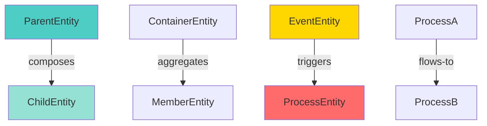
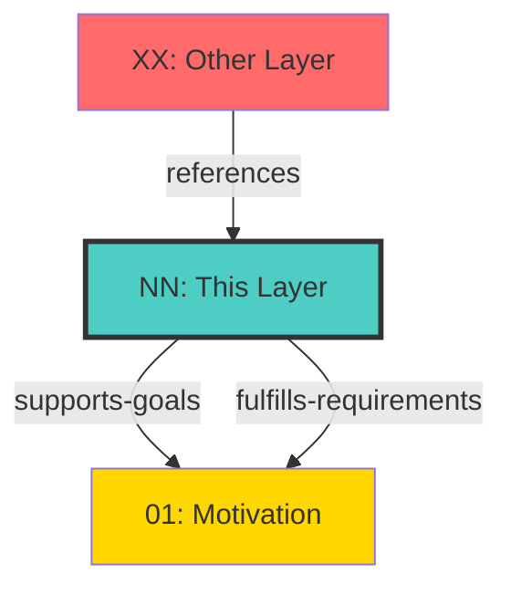

# Layer NN: [Layer Name]

**Version**: 0.6.0
**Status**: [Draft | Active | Deprecated]
**Last Updated**: YYYY-MM-DD

## Overview

[1-2 paragraph overview of this layer's purpose, scope, and role in the Documentation Robotics framework. Explain what this layer models and why it's important.]

## Layer Characteristics

- **Standard**: [ArchiMate 3.2 | Custom | Hybrid]
- **Custom Extensions**: [List any custom extensions or modifications to standard ArchiMate]
- **Validation**: `spec/schemas/NN-[layer-name]-layer.schema.json`
- **Relationship Support**: [Intra-layer | Cross-layer | Both]

## Entity Definitions

[Existing entity definition structure - no change]

### Entity Name

**Purpose**: [Brief description of what this entity represents]

**Properties**:

- `id`: Unique identifier (UUID format)
- `name`: Human-readable name
- `description`: Detailed description
- [Additional properties specific to this entity type]

**Example**:

```yaml
id: entity-example-1
name: Example Entity
description: A sample entity demonstrating the structure
[Additional property examples]
```

---

## Intra-Layer Relationships

**Purpose**: Define structural and behavioral relationships between entities within this layer.

### Structural Relationships

Relationships that define the composition, aggregation, and specialization of entities within this layer.

| Relationship   | Source Element    | Target Element  | Predicate     | Inverse Predicate | Cardinality | Description                               |
| -------------- | ----------------- | --------------- | ------------- | ----------------- | ----------- | ----------------------------------------- |
| Composition    | [ParentEntity]    | [ChildEntity]   | `composes`    | `composed-of`     | 1:N         | [Description of composition relationship] |
| Aggregation    | [ContainerEntity] | [MemberEntity]  | `aggregates`  | `aggregated-by`   | 1:N         | [Description of aggregation relationship] |
| Specialization | [SpecificEntity]  | [GeneralEntity] | `specializes` | `generalized-by`  | N:1         | [Description of inheritance relationship] |

**Example**:

```xml
<!-- Composition example -->
<relationship type="Composition" source="parent-entity-1" target="child-entity-1"/>

<!-- Aggregation example -->
<relationship type="Aggregation" source="container-1" target="member-1"/>
```

### Behavioral Relationships

Relationships that define interactions, flows, and dependencies between entities within this layer.

| Relationship | Source Element   | Target Element  | Predicate  | Inverse Predicate | Cardinality | Description                              |
| ------------ | ---------------- | --------------- | ---------- | ----------------- | ----------- | ---------------------------------------- |
| Triggering   | [EventEntity]    | [ProcessEntity] | `triggers` | `triggered-by`    | N:N         | [Description of triggering relationship] |
| Flow         | [ProcessA]       | [ProcessB]      | `flows-to` | `flows-from`      | N:N         | [Description of flow relationship]       |
| Access       | [BehaviorEntity] | [DataEntity]    | `accesses` | `accessed-by`     | N:N         | [Description of access relationship]     |

**Example**:

```xml
<!-- Triggering example -->
<relationship type="Triggering" source="event-1" target="process-1"/>

<!-- Flow example -->
<relationship type="Flow" source="process-1" target="process-2"/>
```

### Relationship Diagram



---

## Cross-Layer Relationships

**Purpose**: Define semantic links to entities in other layers, supporting traceability, governance, and architectural alignment.

### Outgoing Relationships (This Layer → Other Layers)

Links from entities in this layer to entities in other layers.

#### To Motivation Layer (01)

Links to strategic goals, requirements, principles, and constraints.

| Predicate                | Source Element | Target Element | Field Path                          | Strength | Required | Examples             |
| ------------------------ | -------------- | -------------- | ----------------------------------- | -------- | -------- | -------------------- |
| `supports-goals`         | [EntityType]   | Goal           | `motivation.supports-goals`         | High     | No       | [See examples below] |
| `fulfills-requirements`  | [EntityType]   | Requirement    | `motivation.fulfills-requirements`  | High     | No       | [See examples below] |
| `governed-by-principles` | [EntityType]   | Principle      | `motivation.governed-by-principles` | High     | No       | [See examples below] |
| `constrained-by`         | [EntityType]   | Constraint     | `motivation.constrained-by`         | Medium   | No       | [See examples below] |

**Example**:

```yaml
# Entity linking to goals
properties:
  motivation.supports-goals:
    type: array
    items:
      type: string
    description: Goal IDs this entity supports
    example: ["goal-revenue-growth", "goal-customer-satisfaction"]
```

#### To [Other Target Layer] (NN)

[Repeat structure for each target layer this layer links to]

| Predicate     | Source Element | Target Element | Field Path     | Strength | Required | Examples   |
| ------------- | -------------- | -------------- | -------------- | -------- | -------- | ---------- |
| `[predicate]` | [EntityType]   | [TargetEntity] | `[field.path]` | [Level]  | [Yes/No] | [Examples] |

### Incoming Relationships (Other Layers → This Layer)

Links from entities in other layers to entities in this layer.

#### From [Source Layer] (NN)

[Description of what these incoming links represent]

| Predicate     | Source Element | Source Layer | Target Element | Field Path     | Description   |
| ------------- | -------------- | ------------ | -------------- | -------------- | ------------- |
| `[predicate]` | [SourceEntity] | NN-[layer]   | [EntityType]   | `[field.path]` | [Description] |

**Usage Example**:

```yaml
# Another layer referencing this layer's entities
properties:
  [layer].[predicate]:
    type: string
    description: Reference to [EntityType] in this layer
    example: "entity-id-from-this-layer"
```

### Cross-Layer Relationship Diagram



---

## Integration Points

### Upward Traceability

This layer provides upward traceability to strategic layers:

- **To Motivation (01)**: [Describe traceability to goals, requirements, etc.]
- **To [Other Strategic Layers]**: [Describe other upward traceability]

### Horizontal Integration

This layer integrates with peer layers:

- **With [Peer Layer 1]**: [Describe integration patterns]
- **With [Peer Layer 2]**: [Describe integration patterns]

### Downward Realization

This layer is realized by implementation layers:

- **By [Implementation Layer 1]**: [Describe how this layer is implemented]
- **By [Implementation Layer 2]**: [Describe additional implementation]

---

## Example Model

### Complete Example

[Existing example model structure - enhanced with relationship examples]

```yaml
# Example entity with complete relationships

# Entity definition
entity-id: example-entity-1
name: Example Entity
description: Demonstrates complete relationship modeling

# Properties
properties:
  # Entity-specific properties
  [property-name]:
    type: [type]
    description: [description]

  # Cross-layer relationships
  motivation.supports-goals:
    type: array
    items:
      type: string
    example: ["goal-1", "goal-2"]

  motivation.fulfills-requirements:
    type: array
    items:
      type: string
    example: ["req-1", "req-2"]

# Intra-layer relationships (in XML)
relationships:
  - type: Composition
    source: example-entity-1
    target: child-entity-1
  - type: Flow
    source: example-entity-1
    target: next-entity-1
```

---

## Validation Rules

### Entity Validation

- **Required Fields**: `id`, `name`, `description`
- **ID Format**: UUID v4 or kebab-case string
- **Name**: Non-empty string, max 200 characters
- **Description**: Non-empty string, max 1000 characters

### Relationship Validation

#### Intra-Layer Relationships

- **Valid Types**: Composition, Aggregation, Specialization, Triggering, Flow, Access, Serving, Assignment
- **Source Validation**: Must reference existing entity in this layer
- **Target Validation**: Must reference existing entity in this layer
- **Cardinality**: Enforced based on relationship type

#### Cross-Layer Relationships

- **Target Existence**: Referenced entities must exist in target layer
- **Target Type**: Must match allowed target element types
- **Cardinality**:
  - Array fields: Multiple references allowed
  - Single fields: One reference only
- **Format Validation**:
  - UUID fields: Valid UUID v4 format
  - ID fields: Valid identifier format
  - Enum fields: Must match allowed values

### Schema Validation

All entities must validate against: `spec/schemas/NN-[layer-name]-layer.schema.json`

---

## Best Practices

### Entity Design

1. **Single Responsibility**: Each entity should have a clear, focused purpose
2. **Clear Naming**: Use descriptive, unambiguous names
3. **Complete Documentation**: Provide thorough descriptions
4. **Consistent Structure**: Follow layer template structure

### Relationship Design

1. **Semantic Clarity**: Use predicates that clearly express relationship meaning
2. **Bidirectional Support**: Define inverse predicates for two-way navigation
3. **Appropriate Cardinality**: Use array for multiple links, single for one-to-one
4. **Traceability**: Link to strategic elements (goals, requirements) where applicable

### Documentation

1. **Examples First**: Provide concrete examples before abstract explanations
2. **Visual Diagrams**: Include Mermaid diagrams for complex relationships
3. **Cross-References**: Link to related entities and layers
4. **Version History**: Track significant changes in comments

---

## Version History

| Version | Date       | Changes                                                         | Author   |
| ------- | ---------- | --------------------------------------------------------------- | -------- |
| 0.6.0   | YYYY-MM-DD | Enhanced with intra-layer and cross-layer relationship sections | [Author] |
| 1.0.0   | YYYY-MM-DD | Initial version                                                 | [Author] |

---

## Related Documents

- [Relationship Taxonomy](../core/07-relationship-taxonomy.md) - Complete predicate definitions
- [Cross-Layer Reference Registry](../core/06-cross-layer-reference-registry.md) - Valid link patterns
- [Relationship Catalog](../schemas/relationship-catalog.json) - Machine-readable relationship definitions
- [Layer Schema](../schemas/NN-[layer-name]-layer.schema.json) - JSON Schema validation

---

## Notes

[Any additional notes, caveats, or future enhancements for this layer]
